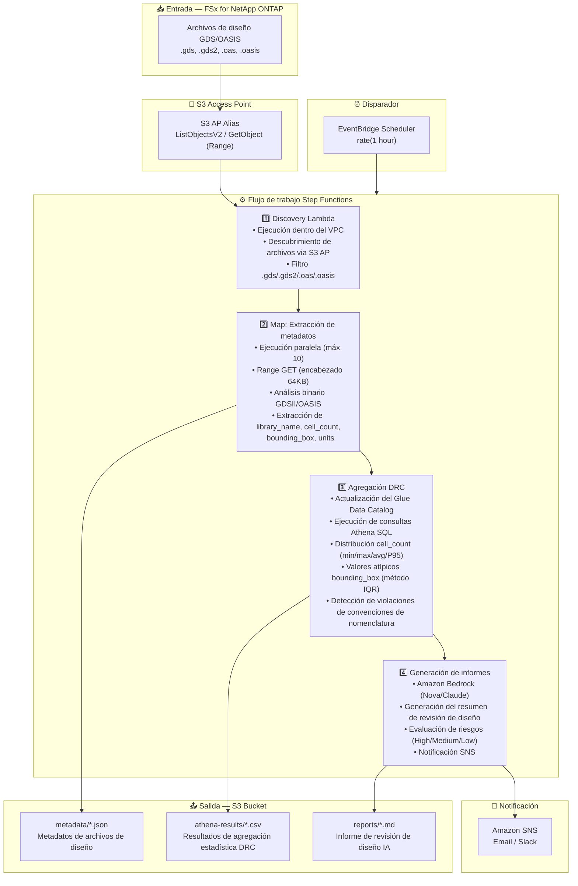

# UC6: Semiconductores / EDA — Validación de archivos de diseño

🌐 **Language / 言語**: [日本語](architecture.md) | [English](architecture.en.md) | [한국어](architecture.ko.md) | [简体中文](architecture.zh-CN.md) | [繁體中文](architecture.zh-TW.md) | [Français](architecture.fr.md) | [Deutsch](architecture.de.md) | Español

## Arquitectura de extremo a extremo (Entrada → Salida)

---

## Flujo de alto nivel

```
┌─────────────────────────────────────────────────────────────────────────────┐
│                         FSx for NetApp ONTAP                                 │
│                                                                              │
│  /vol/eda_designs/                                                           │
│  ├── top_chip_v3.gds        (GDSII format, multi-GB)                        │
│  ├── block_a_io.gds2        (GDSII format)                                  │
│  ├── memory_ctrl.oasis      (OASIS format)                                  │
│  └── analog_frontend.oas    (OASIS format)                                  │
│                                                                              │
└──────────────────────────────────┬───────────────────────────────────────────┘
                                   │
                                   ▼
┌──────────────────────────────────────────────────────────────────────────────┐
│                      S3 Access Point (Data Path)                              │
│                                                                              │
│  Alias: fsxn-eda-vol-ext-s3alias                                             │
│  • ListObjectsV2 (descubrimiento de archivos)                                │
│  • GetObject with Range header (lectura de encabezado 64KB)                  │
│  • No NFS mount required from Lambda                                         │
│                                                                              │
└──────────────────────────────────┬───────────────────────────────────────────┘
                                   │
                                   ▼
┌──────────────────────────────────────────────────────────────────────────────┐
│                    EventBridge Scheduler (Trigger)                            │
│                                                                              │
│  Schedule: rate(1 hour) — configurable                                       │
│  Target: Step Functions State Machine                                        │
│                                                                              │
└──────────────────────────────────┬───────────────────────────────────────────┘
                                   │
                                   ▼
┌──────────────────────────────────────────────────────────────────────────────┐
│                    AWS Step Functions (Orchestration)                         │
│                                                                              │
│  ┌─────────────┐    ┌──────────────────────┐    ┌────────────────┐          │
│  │  Discovery   │───▶│  Map State           │───▶│ DRC Aggregation│          │
│  │  Lambda      │    │  (MetadataExtraction)│    │ Lambda         │          │
│  │             │    │  MaxConcurrency: 10  │    │               │          │
│  │  • VPC内     │    │  • Retry 3x          │    │  • Athena SQL  │          │
│  │  • S3 AP List│    │  • Catch → MarkFailed│    │  • Glue Catalog│          │
│  │  • ONTAP API │    │  • Range GET 64KB    │    │  • IQR outliers│          │
│  └─────────────┘    └──────────────────────┘    └───────┬────────┘          │
│                                                          │                   │
│                                                          ▼                   │
│                                                 ┌────────────────┐          │
│                                                 │Report Generation│          │
│                                                 │ Lambda         │          │
│                                                 │               │          │
│                                                 │ • Bedrock      │          │
│                                                 │ • SNS notify   │          │
│                                                 └────────────────┘          │
│                                                                              │
└──────────────────────────────────────────────────────────────────────────────┘
                                   │
                                   ▼
┌──────────────────────────────────────────────────────────────────────────────┐
│                         Output (S3 Bucket)                                    │
│                                                                              │
│  s3://{stack}-output-{account}/                                              │
│  ├── metadata/YYYY/MM/DD/                                                    │
│  │   ├── top_chip_v3.json          ← Metadatos extraídos                    │
│  │   ├── block_a_io.json                                                     │
│  │   ├── memory_ctrl.json                                                    │
│  │   └── analog_frontend.json                                                │
│  ├── athena-results/                                                         │
│  │   └── {query-execution-id}.csv  ← Estadísticas DRC                       │
│  └── reports/YYYY/MM/DD/                                                     │
│      └── eda-design-review-{id}.md ← Informe Bedrock                        │
│                                                                              │
└──────────────────────────────────────────────────────────────────────────────┘
```

---

## Diagrama Mermaid (para presentaciones / documentación)



---

## Detalle del flujo de datos

### Entrada
| Elemento | Descripción |
|----------|-------------|
| **Origen** | Volumen FSx for NetApp ONTAP |
| **Tipos de archivo** | .gds, .gds2 (GDSII), .oas, .oasis (OASIS) |
| **Método de acceso** | S3 Access Point (sin montaje NFS) |
| **Estrategia de lectura** | Solicitud Range — solo primeros 64KB (análisis de encabezado) |

### Procesamiento
| Paso | Servicio | Función |
|------|----------|---------|
| Discovery | Lambda (VPC) | Listar archivos de diseño via S3 AP |
| Extracción de metadatos | Lambda (Map) | Analizar encabezados binarios GDSII/OASIS |
| Agregación DRC | Lambda + Athena | Análisis estadístico basado en SQL |
| Generación de informes | Lambda + Bedrock | Resumen de revisión de diseño IA |

### Salida
| Artefacto | Formato | Descripción |
|-----------|---------|-------------|
| JSON de metadatos | `metadata/YYYY/MM/DD/{stem}.json` | Metadatos extraídos por archivo |
| Resultados Athena | `athena-results/{id}.csv` | Estadísticas DRC (distribución de celdas, valores atípicos) |
| Revisión de diseño | `reports/YYYY/MM/DD/eda-design-review-{id}.md` | Informe generado por Bedrock |
| Notificación SNS | Email | Resumen con recuento de archivos y ubicación del informe |

---

## Decisiones de diseño clave

1. **S3 AP en lugar de NFS** — Lambda no puede montar NFS; S3 AP proporciona acceso nativo serverless a datos ONTAP
2. **Solicitudes Range** — Los archivos GDS pueden ser de varios GB; solo se necesita el encabezado de 64KB para metadatos
3. **Athena para analítica** — La agregación DRC basada en SQL escala a millones de archivos
4. **Detección de valores atípicos IQR** — Método estadístico para la detección de anomalías de bounding box
5. **Bedrock para informes** — Resúmenes en lenguaje natural para partes interesadas no técnicas
6. **Sondeo (no basado en eventos)** — S3 AP no soporta `GetBucketNotificationConfiguration`

---

## Servicios AWS utilizados

| Servicio | Rol |
|----------|-----|
| FSx for NetApp ONTAP | Almacenamiento de archivos empresarial (archivos GDS/OASIS) |
| S3 Access Points | Acceso serverless a datos en volúmenes ONTAP |
| EventBridge Scheduler | Disparador periódico |
| Step Functions | Orquestación de flujo de trabajo con estado Map |
| Lambda | Cómputo (Discovery, Extraction, Aggregation, Report) |
| Glue Data Catalog | Gestión de esquemas para Athena |
| Amazon Athena | Analítica SQL sobre metadatos |
| Amazon Bedrock | Generación de informes IA (Nova Lite / Claude) |
| SNS | Notificación |
| CloudWatch + X-Ray | Observabilidad |
