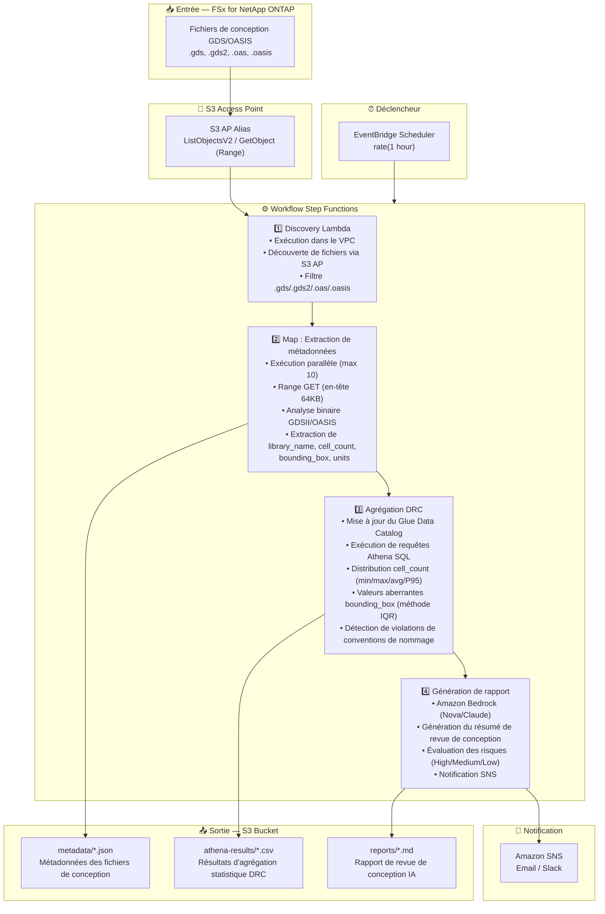

# UC6 : Semi-conducteurs / EDA — Validation des fichiers de conception

🌐 **Language / 言語**: [日本語](architecture.md) | [English](architecture.en.md) | [한국어](architecture.ko.md) | [简体中文](architecture.zh-CN.md) | [繁體中文](architecture.zh-TW.md) | Français | [Deutsch](architecture.de.md) | [Español](architecture.es.md)

## Architecture de bout en bout (Entrée → Sortie)

---

## Flux de haut niveau

```
┌─────────────────────────────────────────────────────────────────────────────┐
│                         FSx for NetApp ONTAP                                 │
│                                                                              │
│  /vol/eda_designs/                                                           │
│  ├── top_chip_v3.gds        (GDSII format, multi-GB)                        │
│  ├── block_a_io.gds2        (GDSII format)                                  │
│  ├── memory_ctrl.oasis      (OASIS format)                                  │
│  └── analog_frontend.oas    (OASIS format)                                  │
│                                                                              │
└──────────────────────────────────┬───────────────────────────────────────────┘
                                   │
                                   ▼
┌──────────────────────────────────────────────────────────────────────────────┐
│                      S3 Access Point (Data Path)                              │
│                                                                              │
│  Alias: fsxn-eda-vol-ext-s3alias                                             │
│  • ListObjectsV2 (découverte de fichiers)                                    │
│  • GetObject with Range header (lecture d'en-tête 64KB)                      │
│  • No NFS mount required from Lambda                                         │
│                                                                              │
└──────────────────────────────────┬───────────────────────────────────────────┘
                                   │
                                   ▼
┌──────────────────────────────────────────────────────────────────────────────┐
│                    EventBridge Scheduler (Trigger)                            │
│                                                                              │
│  Schedule: rate(1 hour) — configurable                                       │
│  Target: Step Functions State Machine                                        │
│                                                                              │
└──────────────────────────────────┬───────────────────────────────────────────┘
                                   │
                                   ▼
┌──────────────────────────────────────────────────────────────────────────────┐
│                    AWS Step Functions (Orchestration)                         │
│                                                                              │
│  ┌─────────────┐    ┌──────────────────────┐    ┌────────────────┐          │
│  │  Discovery   │───▶│  Map State           │───▶│ DRC Aggregation│          │
│  │  Lambda      │    │  (MetadataExtraction)│    │ Lambda         │          │
│  │             │    │  MaxConcurrency: 10  │    │               │          │
│  │  • VPC内     │    │  • Retry 3x          │    │  • Athena SQL  │          │
│  │  • S3 AP List│    │  • Catch → MarkFailed│    │  • Glue Catalog│          │
│  │  • ONTAP API │    │  • Range GET 64KB    │    │  • IQR outliers│          │
│  └─────────────┘    └──────────────────────┘    └───────┬────────┘          │
│                                                          │                   │
│                                                          ▼                   │
│                                                 ┌────────────────┐          │
│                                                 │Report Generation│          │
│                                                 │ Lambda         │          │
│                                                 │               │          │
│                                                 │ • Bedrock      │          │
│                                                 │ • SNS notify   │          │
│                                                 └────────────────┘          │
│                                                                              │
└──────────────────────────────────────────────────────────────────────────────┘
                                   │
                                   ▼
┌──────────────────────────────────────────────────────────────────────────────┐
│                         Output (S3 Bucket)                                    │
│                                                                              │
│  s3://{stack}-output-{account}/                                              │
│  ├── metadata/YYYY/MM/DD/                                                    │
│  │   ├── top_chip_v3.json          ← Métadonnées extraites                  │
│  │   ├── block_a_io.json                                                     │
│  │   ├── memory_ctrl.json                                                    │
│  │   └── analog_frontend.json                                                │
│  ├── athena-results/                                                         │
│  │   └── {query-execution-id}.csv  ← Statistiques DRC                       │
│  └── reports/YYYY/MM/DD/                                                     │
│      └── eda-design-review-{id}.md ← Rapport Bedrock                        │
│                                                                              │
└──────────────────────────────────────────────────────────────────────────────┘
```

---

## Diagramme Mermaid (pour présentations / documentation)



---

## Détail du flux de données

### Entrée
| Élément | Description |
|---------|-------------|
| **Source** | Volume FSx for NetApp ONTAP |
| **Types de fichiers** | .gds, .gds2 (GDSII), .oas, .oasis (OASIS) |
| **Méthode d'accès** | S3 Access Point (pas de montage NFS) |
| **Stratégie de lecture** | Requête Range — premiers 64KB uniquement (analyse d'en-tête) |

### Traitement
| Étape | Service | Fonction |
|-------|---------|----------|
| Discovery | Lambda (VPC) | Lister les fichiers de conception via S3 AP |
| Extraction de métadonnées | Lambda (Map) | Analyser les en-têtes binaires GDSII/OASIS |
| Agrégation DRC | Lambda + Athena | Analyse statistique basée sur SQL |
| Génération de rapport | Lambda + Bedrock | Résumé de revue de conception IA |

### Sortie
| Artefact | Format | Description |
|----------|--------|-------------|
| JSON de métadonnées | `metadata/YYYY/MM/DD/{stem}.json` | Métadonnées extraites par fichier |
| Résultats Athena | `athena-results/{id}.csv` | Statistiques DRC (distribution des cellules, valeurs aberrantes) |
| Revue de conception | `reports/YYYY/MM/DD/eda-design-review-{id}.md` | Rapport généré par Bedrock |
| Notification SNS | Email | Résumé avec nombre de fichiers et emplacement du rapport |

---

## Décisions de conception clés

1. **S3 AP plutôt que NFS** — Lambda ne peut pas monter NFS ; S3 AP fournit un accès natif serverless aux données ONTAP
2. **Requêtes Range** — Les fichiers GDS peuvent atteindre plusieurs GB ; seul l'en-tête de 64KB est nécessaire pour les métadonnées
3. **Athena pour l'analytique** — L'agrégation DRC basée sur SQL s'adapte à des millions de fichiers
4. **Détection d'anomalies IQR** — Méthode statistique pour la détection d'anomalies de bounding box
5. **Bedrock pour les rapports** — Résumés en langage naturel pour les parties prenantes non techniques
6. **Interrogation périodique (non événementielle)** — S3 AP ne prend pas en charge `GetBucketNotificationConfiguration`

---

## Services AWS utilisés

| Service | Rôle |
|---------|------|
| FSx for NetApp ONTAP | Stockage de fichiers d'entreprise (fichiers GDS/OASIS) |
| S3 Access Points | Accès serverless aux données des volumes ONTAP |
| EventBridge Scheduler | Déclencheur périodique |
| Step Functions | Orchestration de workflow avec état Map |
| Lambda | Calcul (Discovery, Extraction, Aggregation, Report) |
| Glue Data Catalog | Gestion de schéma pour Athena |
| Amazon Athena | Analytique SQL sur les métadonnées |
| Amazon Bedrock | Génération de rapports IA (Nova Lite / Claude) |
| SNS | Notification |
| CloudWatch + X-Ray | Observabilité |
