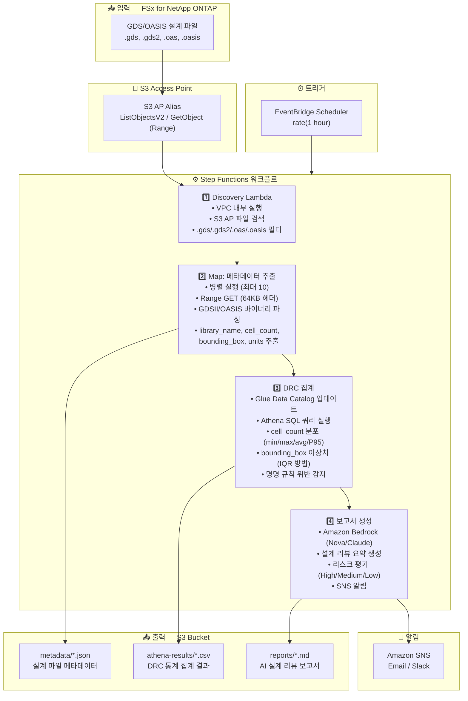

# UC6: 반도체 / EDA — 설계 파일 검증

🌐 **Language / 言語**: [日本語](architecture.md) | [English](architecture.en.md) | 한국어 | [简体中文](architecture.zh-CN.md) | [繁體中文](architecture.zh-TW.md) | [Français](architecture.fr.md) | [Deutsch](architecture.de.md) | [Español](architecture.es.md)

## 엔드투엔드 아키텍처 (입력 → 출력)

---

## 상위 레벨 흐름

```
┌─────────────────────────────────────────────────────────────────────────────┐
│                         FSx for NetApp ONTAP                                 │
│                                                                              │
│  /vol/eda_designs/                                                           │
│  ├── top_chip_v3.gds        (GDSII format, multi-GB)                        │
│  ├── block_a_io.gds2        (GDSII format)                                  │
│  ├── memory_ctrl.oasis      (OASIS format)                                  │
│  └── analog_frontend.oas    (OASIS format)                                  │
│                                                                              │
└──────────────────────────────────┬───────────────────────────────────────────┘
                                   │
                                   ▼
┌──────────────────────────────────────────────────────────────────────────────┐
│                      S3 Access Point (Data Path)                              │
│                                                                              │
│  Alias: fsxn-eda-vol-ext-s3alias                                             │
│  • ListObjectsV2 (파일 검색)                                                 │
│  • GetObject with Range header (64KB 헤더 읽기)                              │
│  • No NFS mount required from Lambda                                         │
│                                                                              │
└──────────────────────────────────┬───────────────────────────────────────────┘
                                   │
                                   ▼
┌──────────────────────────────────────────────────────────────────────────────┐
│                    EventBridge Scheduler (Trigger)                            │
│                                                                              │
│  Schedule: rate(1 hour) — configurable                                       │
│  Target: Step Functions State Machine                                        │
│                                                                              │
└──────────────────────────────────┬───────────────────────────────────────────┘
                                   │
                                   ▼
┌──────────────────────────────────────────────────────────────────────────────┐
│                    AWS Step Functions (Orchestration)                         │
│                                                                              │
│  ┌─────────────┐    ┌──────────────────────┐    ┌────────────────┐          │
│  │  Discovery   │───▶│  Map State           │───▶│ DRC Aggregation│          │
│  │  Lambda      │    │  (MetadataExtraction)│    │ Lambda         │          │
│  │             │    │  MaxConcurrency: 10  │    │               │          │
│  │  • VPC内     │    │  • Retry 3x          │    │  • Athena SQL  │          │
│  │  • S3 AP List│    │  • Catch → MarkFailed│    │  • Glue Catalog│          │
│  │  • ONTAP API │    │  • Range GET 64KB    │    │  • IQR outliers│          │
│  └─────────────┘    └──────────────────────┘    └───────┬────────┘          │
│                                                          │                   │
│                                                          ▼                   │
│                                                 ┌────────────────┐          │
│                                                 │Report Generation│          │
│                                                 │ Lambda         │          │
│                                                 │               │          │
│                                                 │ • Bedrock      │          │
│                                                 │ • SNS notify   │          │
│                                                 └────────────────┘          │
│                                                                              │
└──────────────────────────────────────────────────────────────────────────────┘
                                   │
                                   ▼
┌──────────────────────────────────────────────────────────────────────────────┐
│                         Output (S3 Bucket)                                    │
│                                                                              │
│  s3://{stack}-output-{account}/                                              │
│  ├── metadata/YYYY/MM/DD/                                                    │
│  │   ├── top_chip_v3.json          ← 추출된 메타데이터                       │
│  │   ├── block_a_io.json                                                     │
│  │   ├── memory_ctrl.json                                                    │
│  │   └── analog_frontend.json                                                │
│  ├── athena-results/                                                         │
│  │   └── {query-execution-id}.csv  ← DRC 통계                               │
│  └── reports/YYYY/MM/DD/                                                     │
│      └── eda-design-review-{id}.md ← Bedrock 보고서                         │
│                                                                              │
└──────────────────────────────────────────────────────────────────────────────┘
```

---

## Mermaid 다이어그램 (슬라이드 / 문서용)



---

## 데이터 흐름 상세

### 입력
| 항목 | 설명 |
|------|------|
| **소스** | FSx for NetApp ONTAP 볼륨 |
| **파일 유형** | .gds, .gds2 (GDSII), .oas, .oasis (OASIS) |
| **접근 방식** | S3 Access Point (NFS 마운트 불필요) |
| **읽기 전략** | Range 요청 — 처음 64KB만 (헤더 파싱) |

### 처리
| 단계 | 서비스 | 기능 |
|------|--------|------|
| Discovery | Lambda (VPC) | S3 AP를 통한 설계 파일 목록 조회 |
| 메타데이터 추출 | Lambda (Map) | GDSII/OASIS 바이너리 헤더 파싱 |
| DRC 집계 | Lambda + Athena | SQL 기반 통계 분석 |
| 보고서 생성 | Lambda + Bedrock | AI 설계 리뷰 요약 |

### 출력
| 산출물 | 형식 | 설명 |
|--------|------|------|
| 메타데이터 JSON | `metadata/YYYY/MM/DD/{stem}.json` | 파일별 추출 메타데이터 |
| Athena 결과 | `athena-results/{id}.csv` | DRC 통계 (셀 분포, 이상치) |
| 설계 리뷰 | `reports/YYYY/MM/DD/eda-design-review-{id}.md` | Bedrock 생성 보고서 |
| SNS 알림 | Email | 파일 수 및 보고서 위치 요약 |

---

## 주요 설계 결정

1. **S3 AP over NFS** — Lambda는 NFS를 마운트할 수 없음; S3 AP가 ONTAP 데이터에 대한 서버리스 네이티브 접근 제공
2. **Range 요청** — GDS 파일은 수 GB에 달할 수 있음; 메타데이터에는 64KB 헤더만 필요
3. **Athena 분석** — SQL 기반 DRC 집계가 수백만 파일까지 확장 가능
4. **IQR 이상치 감지** — bounding box 이상 감지를 위한 통계적 방법
5. **Bedrock 보고서** — 비기술 이해관계자를 위한 자연어 요약
6. **폴링 (이벤트 기반 아님)** — S3 AP는 `GetBucketNotificationConfiguration`을 지원하지 않음

---

## 사용된 AWS 서비스

| 서비스 | 역할 |
|--------|------|
| FSx for NetApp ONTAP | 엔터프라이즈 파일 스토리지 (GDS/OASIS 파일) |
| S3 Access Points | ONTAP 볼륨에 대한 서버리스 데이터 접근 |
| EventBridge Scheduler | 주기적 트리거 |
| Step Functions | Map 상태를 활용한 워크플로 오케스트레이션 |
| Lambda | 컴퓨팅 (Discovery, Extraction, Aggregation, Report) |
| Glue Data Catalog | Athena용 스키마 관리 |
| Amazon Athena | 메타데이터에 대한 SQL 분석 |
| Amazon Bedrock | AI 보고서 생성 (Nova Lite / Claude) |
| SNS | 알림 |
| CloudWatch + X-Ray | 관측성 |
