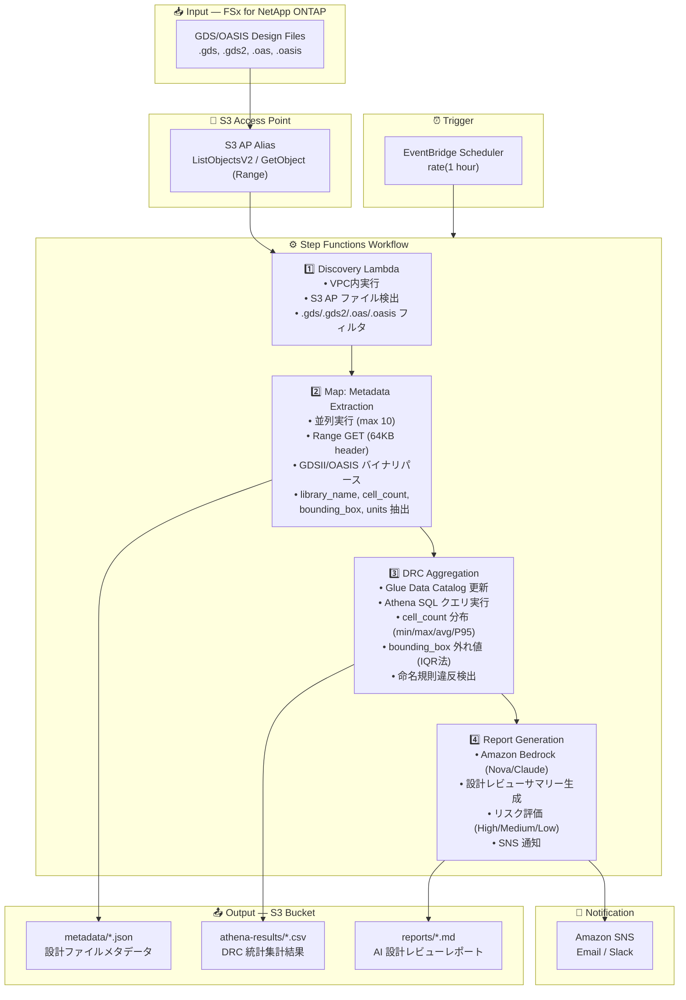

# UC6: Semiconductor / EDA — Design File Validation

🌐 **Language / 言語**: 日本語 | [English](architecture.en.md) | [한국어](architecture.ko.md) | [简体中文](architecture.zh-CN.md) | [繁體中文](architecture.zh-TW.md) | [Français](architecture.fr.md) | [Deutsch](architecture.de.md) | [Español](architecture.es.md)

## End-to-End Architecture (Input → Output)

---

## Architecture Diagram (for slides / documentation)

---

## Data Flow Detail

### Input
| Item | Description |
|------|-------------|
| **Source** | FSx for NetApp ONTAP volume |
| **File Types** | .gds, .gds2 (GDSII), .oas, .oasis (OASIS) |
| **Access Method** | S3 Access Point (no NFS mount) |
| **Read Strategy** | Range request — first 64KB only (header parsing) |

### Processing
| Step | Service | Function |
|------|---------|----------|
| Discovery | Lambda (VPC) | List design files via S3 AP |
| Metadata Extraction | Lambda (Map) | Parse GDSII/OASIS binary headers |
| DRC Aggregation | Lambda + Athena | SQL-based statistical analysis |
| Report Generation | Lambda + Bedrock | AI design review summary |

### Output
| Artifact | Format | Description |
|----------|--------|-------------|
| Metadata JSON | `metadata/YYYY/MM/DD/{stem}.json` | Per-file extracted metadata |
| Athena Results | `athena-results/{id}.csv` | DRC statistics (cell distribution, outliers) |
| Design Review | `reports/YYYY/MM/DD/eda-design-review-{id}.md` | Bedrock-generated report |
| SNS Notification | Email | Summary with file counts and report location |

---

## Key Design Decisions

1. **S3 AP over NFS** — Lambda cannot mount NFS; S3 AP provides serverless-native access to ONTAP data
2. **Range requests** — GDS files can be multi-GB; only 64KB header needed for metadata
3. **Athena for analytics** — SQL-based DRC aggregation scales to millions of files
4. **IQR outlier detection** — Statistical method for bounding box anomaly detection
5. **Bedrock for reports** — Natural language summaries for non-technical stakeholders
6. **Polling (not event-driven)** — S3 AP does not support `GetBucketNotificationConfiguration`

---

## AWS Services Used

| Service | Role |
|---------|------|
| FSx for NetApp ONTAP | Enterprise file storage (GDS/OASIS files) |
| S3 Access Points | Serverless data access to ONTAP volumes |
| EventBridge Scheduler | Periodic trigger |
| Step Functions | Workflow orchestration with Map state |
| Lambda | Compute (Discovery, Extraction, Aggregation, Report) |
| Glue Data Catalog | Schema management for Athena |
| Amazon Athena | SQL analytics on metadata |
| Amazon Bedrock | AI report generation (Nova Lite / Claude) |
| SNS | Notification |
| CloudWatch + X-Ray | Observability |
