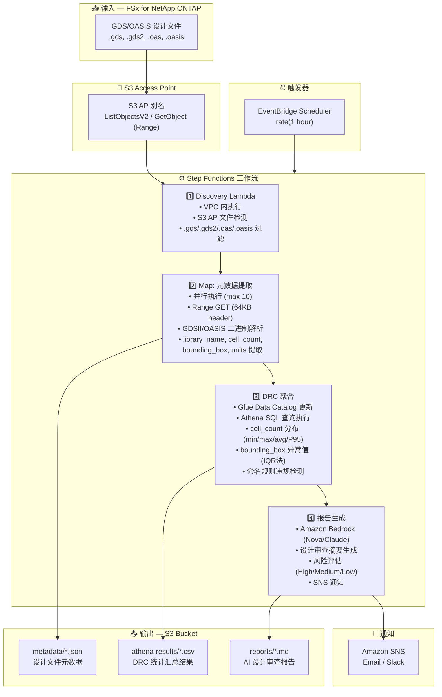

# UC6：半导体/EDA — 设计文件验证

🌐 **Language / 언어 / 语言 / 語言 / Langue / Sprache / Idioma**: [日本語](architecture.md) | [English](architecture.en.md) | [한국어](architecture.ko.md) | 简体中文 | [繁體中文](architecture.zh-TW.md) | [Français](architecture.fr.md) | [Deutsch](architecture.de.md) | [Español](architecture.es.md)

> 注意：此翻译由 Amazon Bedrock Claude 生成。欢迎对翻译质量提出改进建议。

## 端到端架构（输入 → 输出）

---

## 架构图（用于幻灯片 / 文档）

---

## 数据流详情

### 输入
| 项目 | 说明 |
|------|-------------|
| **来源** | FSx for NetApp ONTAP 卷 |
| **文件类型** | .gds, .gds2 (GDSII), .oas, .oasis (OASIS) |
| **访问方法** | S3 Access Point（无需 NFS 挂载）|
| **读取策略** | Range 请求 — 仅前 64KB（头部解析）|

### 处理
| 步骤 | 服务 | 功能 |
|------|---------|----------|
| Discovery | Lambda (VPC) | 通过 S3 AP 列出设计文件 |
| 元数据提取 | Lambda (Map) | 解析 GDSII/OASIS 二进制头部 |
| DRC 聚合 | Lambda + Athena | 基于 SQL 的统计分析 |
| 报告生成 | Lambda + Bedrock | AI 设计审查摘要 |

### 输出
| 产物 | 格式 | 说明 |
|----------|--------|-------------|
| 元数据 JSON | `metadata/YYYY/MM/DD/{stem}.json` | 每个文件提取的元数据 |
| Athena 结果 | `athena-results/{id}.csv` | DRC 统计（单元分布、异常值）|
| 设计审查 | `reports/YYYY/MM/DD/eda-design-review-{id}.md` | Bedrock 生成的报告 |
| SNS 通知 | Email | 包含文件计数和报告位置的摘要 |

---

## 关键设计决策

1. **S3 AP 优于 NFS** — Lambda 无法挂载 NFS；S3 AP 提供对 ONTAP 数据的无服务器原生访问
2. **Range 请求** — GDS 文件可能达到数 GB；元数据仅需 64KB 头部
3. **Athena 用于分析** — 基于 SQL 的 DRC 聚合可扩展至数百万文件
4. **IQR 异常值检测** — 用于边界框异常检测的统计方法
5. **Bedrock 用于报告** — 为非技术利益相关者提供自然语言摘要
6. **轮询（非事件驱动）** — S3 AP 不支持 `GetBucketNotificationConfiguration`

---

## 使用的 AWS 服务

| 服务 | 角色 |
|---------|------|
| FSx for NetApp ONTAP | 企业文件存储（GDS/OASIS 文件）|
| S3 Access Points | 对 ONTAP 卷的无服务器数据访问 |
| EventBridge Scheduler | 定期触发器 |
| Step Functions | 带 Map 状态的工作流编排 |
| Lambda | 计算（Discovery、提取、聚合、报告）|
| Glue Data Catalog | Athena 的架构管理 |
| Amazon Athena | 元数据的 SQL 分析 |
| Amazon Bedrock | AI 报告生成（Nova Lite / Claude）|
| SNS | 通知 |
| CloudWatch + X-Ray | 可观测性 |
