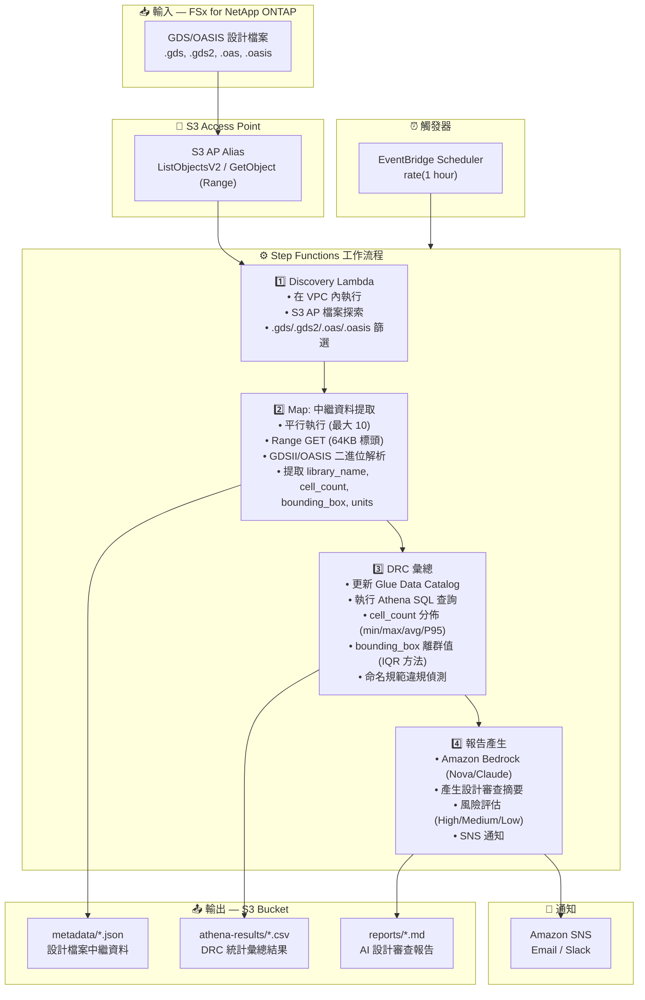

# UC6: 半導體 / EDA — 設計檔案驗證

🌐 **Language / 言語**: [日本語](architecture.md) | [English](architecture.en.md) | [한국어](architecture.ko.md) | [简体中文](architecture.zh-CN.md) | 繁體中文 | [Français](architecture.fr.md) | [Deutsch](architecture.de.md) | [Español](architecture.es.md)

## 端對端架構 (輸入 → 輸出)

---

## 高層級流程

```
┌─────────────────────────────────────────────────────────────────────────────┐
│                         FSx for NetApp ONTAP                                 │
│                                                                              │
│  /vol/eda_designs/                                                           │
│  ├── top_chip_v3.gds        (GDSII format, multi-GB)                        │
│  ├── block_a_io.gds2        (GDSII format)                                  │
│  ├── memory_ctrl.oasis      (OASIS format)                                  │
│  └── analog_frontend.oas    (OASIS format)                                  │
│                                                                              │
└──────────────────────────────────┬───────────────────────────────────────────┘
                                   │
                                   ▼
┌──────────────────────────────────────────────────────────────────────────────┐
│                      S3 Access Point (Data Path)                              │
│                                                                              │
│  Alias: fsxn-eda-vol-ext-s3alias                                             │
│  • ListObjectsV2 (檔案探索)                                                  │
│  • GetObject with Range header (64KB 標頭讀取)                               │
│  • No NFS mount required from Lambda                                         │
│                                                                              │
└──────────────────────────────────┬───────────────────────────────────────────┘
                                   │
                                   ▼
┌──────────────────────────────────────────────────────────────────────────────┐
│                    EventBridge Scheduler (Trigger)                            │
│                                                                              │
│  Schedule: rate(1 hour) — configurable                                       │
│  Target: Step Functions State Machine                                        │
│                                                                              │
└──────────────────────────────────┬───────────────────────────────────────────┘
                                   │
                                   ▼
┌──────────────────────────────────────────────────────────────────────────────┐
│                    AWS Step Functions (Orchestration)                         │
│                                                                              │
│  ┌─────────────┐    ┌──────────────────────┐    ┌────────────────┐          │
│  │  Discovery   │───▶│  Map State           │───▶│ DRC Aggregation│          │
│  │  Lambda      │    │  (MetadataExtraction)│    │ Lambda         │          │
│  │             │    │  MaxConcurrency: 10  │    │               │          │
│  │  • VPC内     │    │  • Retry 3x          │    │  • Athena SQL  │          │
│  │  • S3 AP List│    │  • Catch → MarkFailed│    │  • Glue Catalog│          │
│  │  • ONTAP API │    │  • Range GET 64KB    │    │  • IQR outliers│          │
│  └─────────────┘    └──────────────────────┘    └───────┬────────┘          │
│                                                          │                   │
│                                                          ▼                   │
│                                                 ┌────────────────┐          │
│                                                 │Report Generation│          │
│                                                 │ Lambda         │          │
│                                                 │               │          │
│                                                 │ • Bedrock      │          │
│                                                 │ • SNS notify   │          │
│                                                 └────────────────┘          │
│                                                                              │
└──────────────────────────────────────────────────────────────────────────────┘
                                   │
                                   ▼
┌──────────────────────────────────────────────────────────────────────────────┐
│                         Output (S3 Bucket)                                    │
│                                                                              │
│  s3://{stack}-output-{account}/                                              │
│  ├── metadata/YYYY/MM/DD/                                                    │
│  │   ├── top_chip_v3.json          ← 提取的中繼資料                          │
│  │   ├── block_a_io.json                                                     │
│  │   ├── memory_ctrl.json                                                    │
│  │   └── analog_frontend.json                                                │
│  ├── athena-results/                                                         │
│  │   └── {query-execution-id}.csv  ← DRC 統計                               │
│  └── reports/YYYY/MM/DD/                                                     │
│      └── eda-design-review-{id}.md ← Bedrock 報告                           │
│                                                                              │
└──────────────────────────────────────────────────────────────────────────────┘
```

---

## Mermaid 圖表 (用於簡報 / 文件)



---

## 資料流程詳情

### 輸入
| 項目 | 描述 |
|------|------|
| **來源** | FSx for NetApp ONTAP 磁碟區 |
| **檔案類型** | .gds, .gds2 (GDSII), .oas, .oasis (OASIS) |
| **存取方式** | S3 Access Point (無需 NFS 掛載) |
| **讀取策略** | Range 請求 — 僅前 64KB (標頭解析) |

### 處理
| 步驟 | 服務 | 功能 |
|------|------|------|
| Discovery | Lambda (VPC) | 透過 S3 AP 列出設計檔案 |
| 中繼資料提取 | Lambda (Map) | 解析 GDSII/OASIS 二進位標頭 |
| DRC 彙總 | Lambda + Athena | 基於 SQL 的統計分析 |
| 報告產生 | Lambda + Bedrock | AI 設計審查摘要 |

### 輸出
| 產出物 | 格式 | 描述 |
|--------|------|------|
| 中繼資料 JSON | `metadata/YYYY/MM/DD/{stem}.json` | 每個檔案的提取中繼資料 |
| Athena 結果 | `athena-results/{id}.csv` | DRC 統計 (儲存格分佈、離群值) |
| 設計審查 | `reports/YYYY/MM/DD/eda-design-review-{id}.md` | Bedrock 產生的報告 |
| SNS 通知 | Email | 檔案數量和報告位置摘要 |

---

## 關鍵設計決策

1. **S3 AP 優於 NFS** — Lambda 無法掛載 NFS; S3 AP 提供對 ONTAP 資料的無伺服器原生存取
2. **Range 請求** — GDS 檔案可達數 GB; 中繼資料僅需 64KB 標頭
3. **Athena 分析** — 基於 SQL 的 DRC 彙總可擴展至數百萬檔案
4. **IQR 離群值偵測** — 用於 bounding box 異常偵測的統計方法
5. **Bedrock 報告** — 為非技術利害關係人提供自然語言摘要
6. **輪詢 (非事件驅動)** — S3 AP 不支援 `GetBucketNotificationConfiguration`

---

## 使用的 AWS 服務

| 服務 | 角色 |
|------|------|
| FSx for NetApp ONTAP | 企業級檔案儲存 (GDS/OASIS 檔案) |
| S3 Access Points | 對 ONTAP 磁碟區的無伺服器資料存取 |
| EventBridge Scheduler | 定期觸發 |
| Step Functions | 使用 Map 狀態的工作流程編排 |
| Lambda | 運算 (Discovery, Extraction, Aggregation, Report) |
| Glue Data Catalog | Athena 的結構描述管理 |
| Amazon Athena | 中繼資料的 SQL 分析 |
| Amazon Bedrock | AI 報告產生 (Nova Lite / Claude) |
| SNS | 通知 |
| CloudWatch + X-Ray | 可觀測性 |
