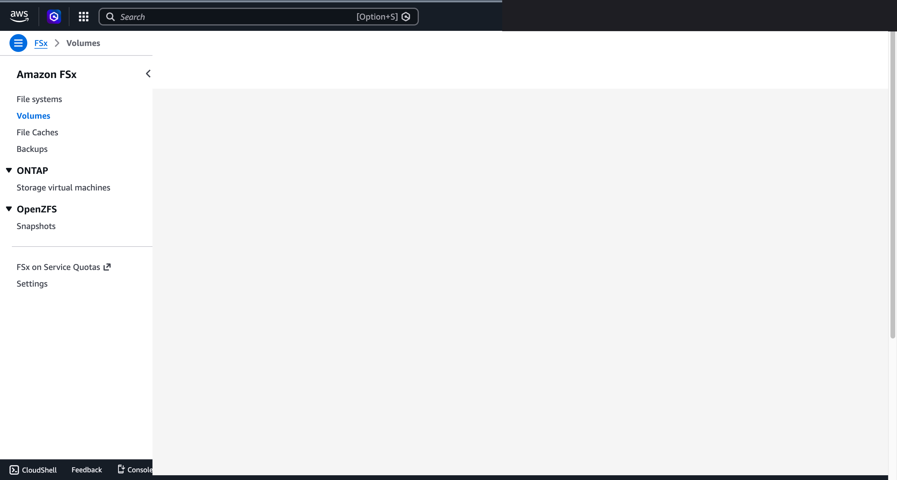
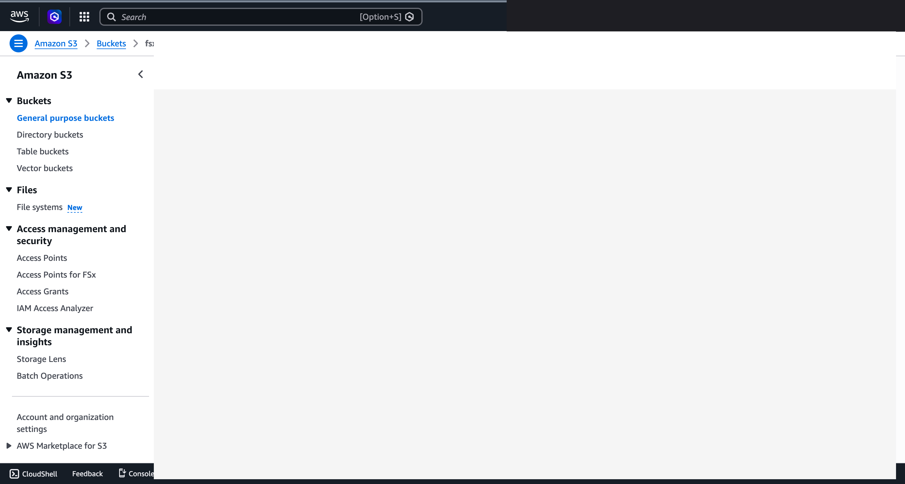
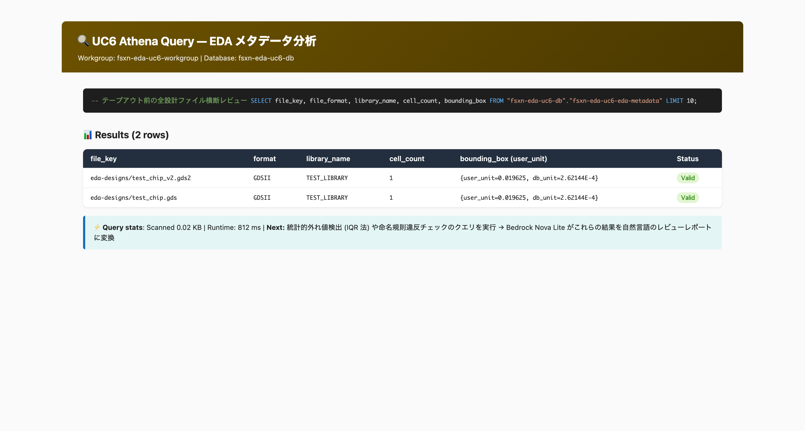
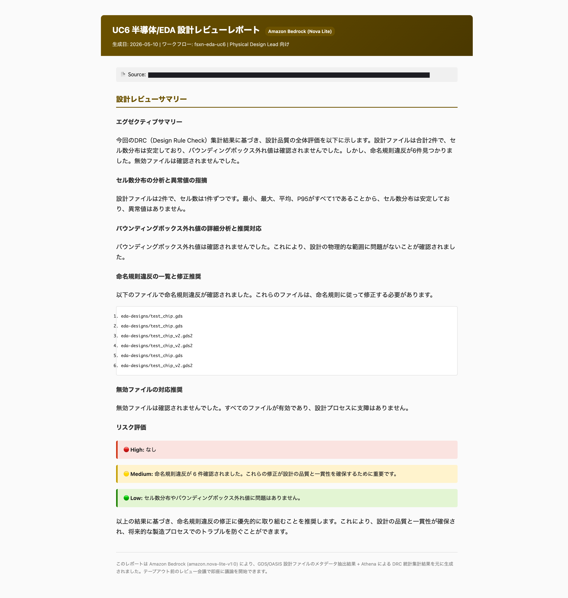

# EDA 設計檔案驗證 — 示範指南

🌐 **Language / 언어 / 语言 / 語言 / Langue / Sprache / Idioma**: [日本語](demo-guide.md) | [English](demo-guide.en.md) | [한국어](demo-guide.ko.md) | [简体中文](demo-guide.zh-CN.md) | 繁體中文 | [Français](demo-guide.fr.md) | [Deutsch](demo-guide.de.md) | [Español](demo-guide.es.md)

> 注意：此翻譯由 Amazon Bedrock Claude 產生。歡迎對翻譯品質提出改進建議。

## 執行摘要

本指南定義了針對半導體設計工程師的技術示範。示範將展示設計檔案（GDS/OASIS）的自動品質驗證工作流程，並展現在流片前提升設計審查效率的價值。

**示範的核心訊息**：將設計工程師手動執行的跨 IP 區塊品質檢查，透過自動化工作流程在數分鐘內完成，並透過 AI 生成的設計審查報告立即採取行動。

**預估時間**：3～5 分鐘（附旁白的螢幕錄製影片）

---

## Target Audience & Persona

### Primary Audience：EDA 終端使用者（設計工程師）

| 項目 | 詳細 |
|------|------|
| **職位** | Physical Design Engineer / DRC Engineer / Design Lead |
| **日常業務** | 佈局設計、DRC 執行、IP 區塊整合、流片準備 |
| **課題** | 跨多個 IP 區塊掌握品質需要花費大量時間 |
| **工具環境** | Calibre、Virtuoso、IC Compiler、Innovus 等 EDA 工具 |
| **期望成果** | 早期發現設計品質問題，遵守流片時程 |

### Persona：田中先生（Physical Design Lead）

- 管理大規模 SoC 專案中的 40+ IP 區塊
- 需要在流片前 2 週執行所有區塊的品質審查
- 個別確認各區塊的 GDS/OASIS 檔案並不實際
- 「希望一眼掌握所有區塊的品質摘要」

---

## Demo Scenario：Pre-tapeout Quality Review

### 情境概要

在流片前的品質審查階段，設計主管對多個 IP 區塊（40+ 檔案）執行自動品質驗證，並根據 AI 生成的審查報告決定行動方案。

### 工作流程全貌

```
設計檔案群        自動驗證          分析結果           AI 審查
(GDS/OASIS)    →   工作流程   →   統計彙整    →    報告生成
                    觸發           (Athena SQL)     (自然語言)
```

### 示範展現的價值

1. **時間縮短**：手動需要數天的跨區塊審查在數分鐘內完成
2. **完整性**：所有 IP 區塊無遺漏地驗證
3. **量化判斷**：透過統計離群值檢測（IQR 法）進行客觀品質評估
4. **可行動性**：AI 提供具體的建議對應措施

---

## Storyboard（5 個段落 / 3～5 分鐘）

### Section 1：Problem Statement（0:00–0:45）

**畫面**：設計專案的檔案清單（40+ GDS/OASIS 檔案）

**旁白要旨**：
> 流片前 2 週。需要確認 40 個以上 IP 區塊的設計品質。
> 用 EDA 工具個別開啟每個檔案進行檢查並不實際。
> 儲存格數異常、邊界框離群值、命名規則違規 — 需要能夠跨區塊檢測這些問題的方法。

**Key Visual**：
- 設計檔案的目錄結構（.gds、.gds2、.oas、.oasis）
- 「手動審查：預估 3～5 天」的文字覆蓋

---

### Section 2：Workflow Trigger（0:45–1:30）

**畫面**：設計工程師觸發品質驗證工作流程的操作

**旁白要旨**：
> 達成設計里程碑後，啟動品質驗證工作流程。
> 只需指定目標目錄，即可開始所有設計檔案的自動驗證。

**Key Visual**：
- 工作流程執行畫面（Step Functions 主控台）
- 輸入參數：目標磁碟區路徑、檔案篩選器（.gds/.oasis）
- 執行開始的確認

**工程師的動作**：
```
目標：/vol/eda_designs/ 下的所有設計檔案
篩選器：.gds、.gds2、.oas、.oasis
執行：品質驗證工作流程開始
```

---

### Section 3：Automated Analysis（1:30–2:30）

**畫面**：工作流程執行中的進度顯示

**旁白要旨**：
> 工作流程自動執行以下步驟：
> 1. 設計檔案的偵測與列表化
> 2. 從各檔案標頭提取中繼資料（library_name、cell_count、bounding_box、units）
> 3. 對提取資料進行統計分析（SQL 查詢）
> 4. AI 生成設計審查報告
>
> 即使是大容量的 GDS 檔案（數 GB），也只讀取標頭部分（64KB），因此處理速度很快。

**Key Visual**：
- 工作流程各步驟依序完成的情況
- 並行處理（Map State）同時處理多個檔案的顯示
- 處理時間：約 2～3 分鐘（40 個檔案的情況）

---

### Section 4：Results Review（2:30–3:45）

**畫面**：Athena SQL 查詢結果與統計摘要

**旁白要旨**：
> 可以用 SQL 自由查詢分析結果。
> 例如「顯示邊界框異常大的儲存格」等臨時分析都可以進行。

**Key Visual — Athena 查詢範例**：
```sql
-- 邊界框離群值的檢測
SELECT file_key, library_name, 
       bounding_box_width, bounding_box_height
FROM eda_metadata
WHERE bounding_box_width > (SELECT Q3 + 1.5 * IQR FROM stats)
ORDER BY bounding_box_width DESC;
```

**Key Visual — 查詢結果**：

| file_key | library_name | width | height | 判定 |
|----------|-------------|-------|--------|------|
| analog_frontend.oas | ANALOG_FE | 15200.3 | 12100.8 | 離群值 |
| test_block_debug.gds | TEST_DBG | 8900.1 | 14500.2 | 離群值 |
| legacy_io_v1.gds2 | LEGACY_IO | 11200.5 | 13800.7 | 離群值 |

---

### Section 5：Actionable Insights（3:45–5:00）

**畫面**：AI 生成的設計審查報告

**旁白要旨**：
> AI 解讀統計分析結果，自動生成針對設計工程師的審查報告。
> 包含風險評估、具體的建議對應措施、優先順序的行動項目。
> 根據此報告，可以在流片前的審查會議中立即開始討論。

**Key Visual — AI 審查報告（摘錄）**：

```markdown
# 設計審查報告

## 風險評估：Medium

## 檢測事項摘要
- 邊界框離群值：3 件
- 命名規則違規：2 件
- 無效檔案：2 件

## 建議對應措施（依優先順序）
1. [High] 調查 2 個無效檔案的原因
2. [Medium] 檢討 analog_frontend.oas 的佈局最佳化
3. [Low] 統一命名規則（block-a-io → block_a_io）
```

**結尾**：
> 手動需要數天的跨區塊審查，在數分鐘內完成。
> 設計工程師可以專注於確認分析結果和決定行動方案。

---

## Screen Capture Plan

### 必要的畫面擷取清單

| # | 畫面 | 段落 | 備註 |
|---|------|-----------|------|
| 1 | 設計檔案目錄清單 | Section 1 | FSx ONTAP 上的檔案結構 |
| 2 | 工作流程執行開始畫面 | Section 2 | Step Functions 主控台 |
| 3 | 工作流程執行中（Map State 並行處理） | Section 3 | 可見進度的狀態 |
| 4 | 工作流程完成畫面 | Section 3 | 所有步驟成功 |
| 5 | Athena 查詢編輯器 + 結果 | Section 4 | 離群值檢測查詢 |
| 6 | 中繼資料 JSON 輸出範例 | Section 4 | 1 個檔案的提取結果 |
| 7 | AI 設計審查報告全文 | Section 5 | Markdown 渲染顯示 |
| 8 | SNS 通知郵件 | Section 5 | 報告完成通知 |

### 擷取步驟

1. 在示範環境中配置範例資料
2. 手動執行工作流程，在各步驟進行畫面擷取
3. 在 Athena 主控台執行查詢並擷取結果
4. 從 S3 下載生成的報告並顯示

---

## 已驗證的 UI/UX 螢幕截圖（2026-05-10 重新驗證）

與 Phase 7 UC15/16/17 相同方針，拍攝**設計工程師在日常業務中實際看到的 UI/UX 畫面**。
排除 Step Functions 圖表等技術人員視圖（詳情請參閱
[`docs/verification-results-phase7.md`](../../docs/verification-results-phase7.md)）。

### 1. FSx for NetApp ONTAP Volumes — 設計檔案用磁碟區

從設計工程師角度看到的 ONTAP 磁碟區清單。在 `eda_demo_vol` 中以 NTFS ACL 管理的狀態配置 GDS/OASIS 檔案。

<!-- SCREENSHOT: uc6-fsx-volumes-list.png
     內容：FSx 主控台中的 ONTAP Volumes 清單（eda_demo_vol 等），Status=Created，Type=ONTAP
     遮罩：帳戶 ID、SVM ID 的實際值、檔案系統 ID -->


### 2. S3 輸出儲存貯體 — 設計文件・分析結果的清單

設計審查負責人在工作流程完成後確認結果的畫面。
整理為 `metadata/` / `athena-results/` / `reports/` 三個前綴。

<!-- SCREENSHOT: uc6-s3-output-bucket.png
     內容：S3 主控台中確認 bucket 的 top-level prefix
     遮罩：帳戶 ID、儲存貯體名稱前綴 -->


### 2. S3 輸出儲存貯體 — 設計文件・分析結果的清單

設計審查負責人在工作流程完成後確認結果的畫面。
整理為 `metadata/` / `athena-results/` / `reports/` 三個前綴。

<!-- SCREENSHOT: uc6-s3-output-bucket.png
     內容：S3 主控台中確認 bucket 的 top-level prefix
     遮罩：帳戶 ID、儲存貯體名稱前綴 -->


### 3. Athena 查詢結果 — EDA 中繼資料的 SQL 分析

設計主管臨時探索 DRC 資訊的畫面。
Workgroup 為 `fsxn-eda-uc6-workgroup`，資料庫為 `fsxn-eda-uc6-db`。

<!-- SCREENSHOT: uc6-athena-query-result.png
     內容：EDA 中繼資料表的 SELECT 結果（file_key、library_name、cell_count、bounding_box）
     遮罩：帳戶 ID -->


### 4. Bedrock 生成的設計審查報告

**UC6 的亮點功能**：根據 Athena 的 DRC 彙整結果，Bedrock Nova Lite 生成
針對 Physical Design Lead 的日文審查報告。

<!-- SCREENSHOT: uc6-bedrock-design-review.png
     內容：執行摘要 + 儲存格數分析 + 命名規則違規清單 + 風險評估（High/Medium/Low）
     實際範例內容：
       ## 設計審查摘要
       ### 執行摘要
       根據本次 DRC 彙整結果，設計品質的整體評估如下。
       設計檔案共 2 件，儲存格數分布穩定，未確認邊界框離群值。
       但發現 6 件命名規則違規。
       ...
       ### 風險評估
       - **High**：無
       - **Medium**：確認 6 件命名規則違規。
       - **Low**：儲存格數分布和邊界框離群值無問題。
     遮罩：帳戶 ID -->


### 實測值（2026-05-10 AWS 部署驗證）

- **Step Functions 執行時間**：~30 秒（Discovery + Map(2 files) + DRC + Report）
- **Bedrock 生成報告**：2,093 bytes（Markdown 格式的日文）
- **Athena 查詢**：0.02 KB 掃描，執行時間 812 ms
- **實際堆疊**：`fsxn-eda-uc6`（ap-northeast-1，2026-05-10 時點運作中）

---

## Narration Outline

### 語調與風格

- **視角**：設計工程師（田中先生）的第一人稱視角
- **語調**：實務性、課題解決型
- **語言**：日文（英文字幕選項）
- **速度**：緩慢清晰（因為是技術示範）

### 旁白構成

| 段落 | 時間 | 關鍵訊息 |
|-----------|------|--------------|
| Problem | 0:00–0:45 | 「流片前需要確認 40+ 區塊的品質。手動無法趕上」 |
| Trigger | 0:45–1:30 | 「設計里程碑後只需啟動工作流程」 |
| Analysis | 1:30–2:30 | 「標頭解析 → 中繼資料提取 → 統計分析自動進行」 |
| Results | 2:30–3:45 | 「用 SQL 自由查詢。立即識別離群值」 |
| Insights | 3:45–5:00 | 「AI 報告提供優先順序的行動方案。直接連結審查會議」 |

---

## Sample Data Requirements

### 必要的範例資料

| # | 檔案 | 格式 | 用途 |
|---|---------|------------|------|
| 1 | `top_chip_v3.gds` | GDSII | 主晶片（大規模，1000+ 儲存格） |
| 2 | `block_a_io.gds2` | GDSII | I/O 區塊（正常資料） |
| 3 | `memory_ctrl.oasis` | OASIS | 記憶體控制器（正常資料） |
| 4 | `analog_frontend.oas` | OASIS | 類比區塊（離群值：BB 過大） |
| 5 | `test_block_debug.gds` | GDSII | 除錯用（離群值：高度異常） |
| 6 | `legacy_io_v1.gds2` | GDSII | 舊版區塊（離群值：寬度・高度） |
| 7 | `block-a-io.gds2` | GDSII | 命名規則違規範例 |
| 8 | `TOP CHIP (copy).gds` | GDSII | 命名規則違規範例 |

### 範例資料生成方針

- **最小配置**：8 個檔案（上述清單）涵蓋示範的所有情境
- **建議配置**：40+ 檔案（提升統計分析的說服力）
- **生成方法**：用 Python 腳本生成具有有效 GDSII/OASIS 標頭的測試檔案
- **大小**：僅進行標頭解析，每個檔案約 100KB 即可

### 現有示範環境的確認事項

- [ ] FSx ONTAP 磁碟區中是否已配置範例資料
- [ ] S3 Access Point 是否已設定
- [ ] Glue Data Catalog 的表格定義是否存在
- [ ] Athena 工作群組是否可用

---

## Timeline

### 1 週內可達成

| # | 任務 | 所需時間 | 前提條件 |
|---|--------|---------|---------|
| 1 | 範例資料生成（8 個檔案） | 2 小時 | Python 環境 |
| 2 | 示範環境中的工作流程執行確認 | 2 小時 | 已部署環境 |
| 3 | 畫面擷取取得（8 個畫面） | 3 小時 | 任務 2 完成後 |
| 4 | 旁白稿的最終化 | 2 小時 | 任務 3 完成後 |
| 5 | 影片編輯（擷取 + 旁白） | 4 小時 | 任務 3、4 完成後 |
| 6 | 審查與修正 | 2 小時 | 任務 5 完成後 |
| **合計** | | **15 小時** | |

### 前提條件（1 週達成所需）

- Step Functions 工作流程已部署且正常運作
- Lambda 函數（Discovery、MetadataExtraction、DrcAggregation、ReportGeneration）已確認運作
- Athena 表格和查詢可執行
- Bedrock 模型存取已啟用

### Future Enhancements（未來擴充）

| # | 擴充項目 | 概要 | 優先順序 |
|---|---------|------|--------|
| 1 | DRC 工具整合 | 直接匯入 Calibre/Pegasus 的 DRC 結果檔案 | High |
| 2 | 互動式儀表板 | 透過 QuickSight 建立設計品質儀表板 | Medium |
| 3 | Slack/Teams 通知 | 審查報告完成時發送聊天通知 | Medium |
| 4 | 差異審查 | 自動檢測與上次執行的差異並報告 | High |
| 5 | 自訂規則定義 | 可設定專案特定的品質規則 | Medium |
| 6 | 多語言報告 | 生成英文/日文/中文報告 | Low |
| 7 | CI/CD 整合 | 作為設計流程中的自動品質閘門整合 | High |
| 8 | 大規模資料對應 | 1000+ 檔案的並行處理最佳化 | Medium |

---

## Technical Notes（示範製作者用）

### 使用元件（僅現有實作）

| 元件 | 角色 |
|--------------|------|
| Step Functions | 整體工作流程的編排 |
| Lambda (Discovery) | 設計檔案的偵測・列表化 |
| Lambda (MetadataExtraction) | GDSII/OASIS 標頭解析與中繼資料提取 |
| Lambda (DrcAggregation) | 透過 Athena SQL 執行統計分析 |
| Lambda (ReportGeneration) | 透過 Bedrock 生成 AI 審查報告 |
| Amazon Athena | 對中繼資料進行 SQL 查詢 |
| Amazon Bedrock | 自然語言報告生成（Nova Lite / Claude） |

### 示範執行時的備援方案

| 情境 | 對應 |
|---------|------|
| 工作流程執行失敗 | 使用預先錄製的執行畫面 |
| Bedrock 回應延遲 | 顯示預先生成的報告 |
| Athena 查詢逾時 | 顯示預先取得的結果 CSV |
| 網路故障 | 將所有畫面預先擷取並製作成影片 |

---

*本文件作為技術簡報用示範影片的製作指南而建立。*
