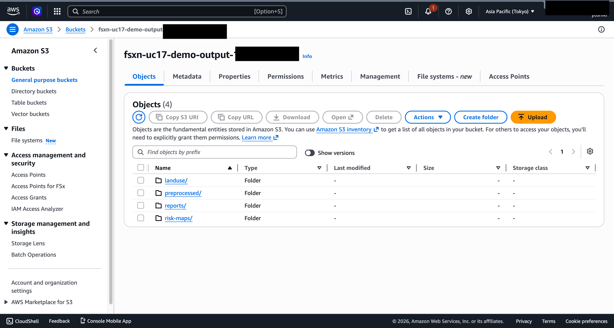
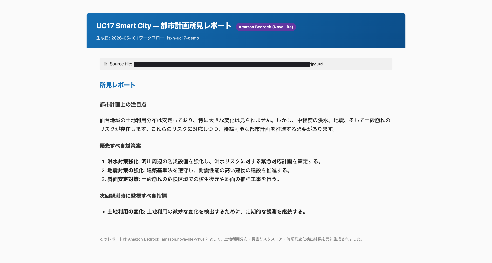
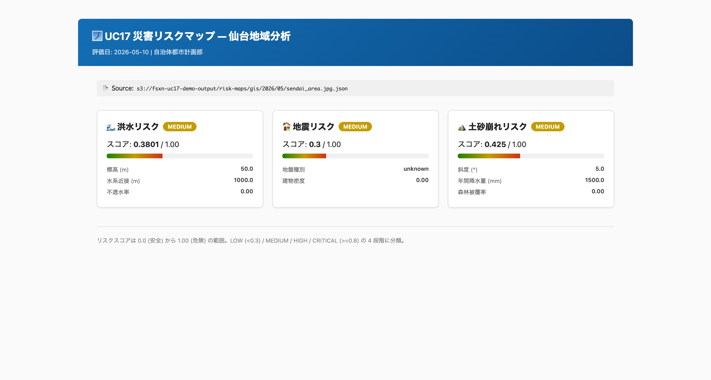
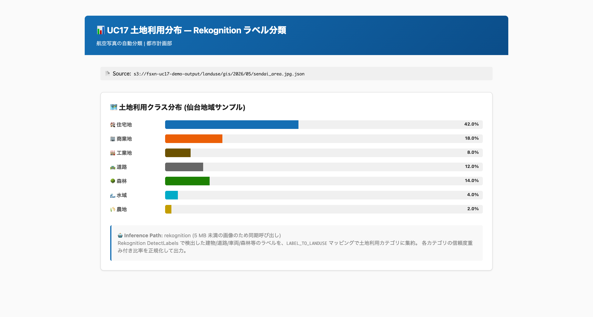
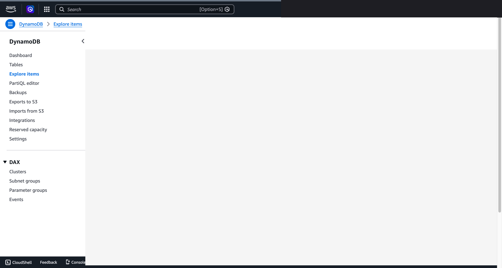

# UC17: Smart City — Geospatial Analytics & Urban Planning

🌐 **Language / 言語**: [日本語](README.md) | English | [한국어](README.ko.md) | [简体中文](README.zh-CN.md) | [繁體中文](README.zh-TW.md) | [Français](README.fr.md) | [Deutsch](README.de.md) | [Español](README.es.md)
📚 **Documentation**: [Architecture](docs/architecture.zh-CN.md) | [Demo Script](docs/demo-guide.zh-CN.md)

> **注意**: 本翻译为自动生成草稿。欢迎基于原文进行审阅和完善。

## Overview

Serverless pipeline for municipal geospatial data (GeoTIFF / Shapefile / GeoJSON / LAS / GeoPackage) automating CRS normalization, land use classification, change detection, infrastructure assessment, disaster risk mapping, and Bedrock-driven urban planning report generation.

### When this pattern is suitable
- Municipalities storing GIS data on FSx ONTAP with department-level access control
- Periodic analysis of land use changes (new buildings, green area reduction, road expansion)
- Flood / earthquake / landslide risk score computation for urban planning
- Automated Japanese-language planning report generation for city officials

### When this pattern is NOT suitable
- Real-time traffic optimization (dedicated streaming pipeline recommended)
- Interactive 3D GIS visualization (ArcGIS / QGIS desktop recommended)
- Network congestion simulation (specialized HPC cluster needed)

### Key features
- **Discovery**: Enumerate GeoTIFF / Shapefile / GeoJSON / LAS / GeoPackage
- **Preprocessing**: Normalize to `EPSG:4326` (WGS84) via pyproj Layer (optional)
- **Land Use Classification**: Rekognition / SageMaker route for raster imagery
- **Change Detection**: DynamoDB keyed by SHA256 of source_key, L1 distribution delta
- **Infra Assessment**: LAS point cloud analysis via laspy Layer (condition score GOOD/FAIR/POOR)
- **Risk Mapping**: Flood (elevation + water proximity + impervious rate), earthquake (soil + density), landslide (slope + precipitation + vegetation)
- **Report Generation**: Bedrock Nova Lite creates Japanese-language planning commentary

### Public Sector compliance
- INSPIRE Directive alignment (EU geospatial data infrastructure)
- OGC standards (WMS / WFS / GeoPackage)
- Open Data publishing workflow


### 已验证的 UI/UX 截图

> 本节展示**一般人员在日常工作中实际使用的 UI/UX 界面**。Step Functions 图形等技术视图另见 `docs/verification-results-phase7.md`。

#### 1. GIS 数据放置（通过 S3 AP）

<!-- SCREENSHOT: phase7-uc17-s3-gis-uploaded.png -->


#### 2. Bedrock 生成的城市规划报告

<!-- SCREENSHOT: phase7-uc17-bedrock-report.png -->


#### 3. 灾害风险地图（JSON）

<!-- SCREENSHOT: phase7-uc17-risk-map-json.png -->


#### 4. 土地利用分布

<!-- SCREENSHOT: phase7-uc17-landuse-distribution.png -->


#### 5. 时间序列变化（DynamoDB）

<!-- SCREENSHOT: phase7-uc17-dynamodb-landuse-history.png -->


## Deploy

```bash
aws cloudformation deploy \
  --template-file smart-city-geospatial/template-deploy.yaml \
  --stack-name fsxn-smart-city \
  --parameter-overrides \
    DeployBucket=<deploy-bucket> \
    S3AccessPointAlias=<ap-ext-s3alias> \
    VpcId=<vpc-id> \
    PrivateSubnetIds=<subnet-ids> \
    NotificationEmail=ops@example.com \
    BedrockModelId=amazon.nova-lite-v1:0 \
  --capabilities CAPABILITY_NAMED_IAM \
  --region ap-northeast-1
```

## Directory layout

```
smart-city-geospatial/
├── template.yaml
├── template-deploy.yaml
├── functions/
│   ├── discovery/
│   ├── preprocessing/
│   ├── land_use_classification/
│   ├── change_detection/
│   ├── infra_assessment/
│   ├── risk_mapping/
│   └── report_generation/
├── tests/
└── docs/
```