# UC17: スマートシティ — 地理空間データ解析アーキテクチャ

🌐 **Language / 言語**: [日本語](architecture.md) | [English](architecture.en.md) | [한국어](architecture.ko.md) | [简体中文](architecture.zh-CN.md) | [繁體中文](architecture.zh-TW.md) | [Français](architecture.fr.md) | Deutsch | [Español](architecture.es.md)

> Hinweis: Diese Übersetzung ist ein automatisch generierter Entwurf basierend auf dem japanischen Original. Beiträge zur Verbesserung der Übersetzungsqualität sind willkommen.

## 概要

FSx ONTAP 上の大容量地理空間データ（GeoTIFF / Shapefile / LAS / GeoPackage）を
サーバーレスで解析し、土地利用分類・変化検出・インフラ評価・災害リスクマッピング・
Bedrock によるレポート生成を行う。

## アーキテクチャ図

```mermaid
graph LR
    FSx[FSx ONTAP<br/>GIS データ<br/>部署別 ACL] --> S3AP[S3 Access Point]
    S3AP --> SFN[Step Functions<br/>Smart City Workflow]
    SFN --> L1[Discovery]
    L1 --> L2[Preprocessing<br/>CRS 正規化 EPSG:4326]
    L2 --> L3[Land Use Classification<br/>Rekognition / SageMaker]
    L3 --> L4[Change Detection<br/>DynamoDB 時系列]
    L4 --> L5[Infra Assessment<br/>LAS 点群解析]
    L5 --> L6[Risk Mapping<br/>洪水/地震/土砂]
    L6 --> L7[Report Generation<br/>Bedrock Nova Lite]
    L7 --> S3O[S3 Output<br/>都市計画レポート]
```

## 災害リスクモデル

### 洪水リスク（`compute_flood_risk`）

- 標高スコア: `max(0, (100 - elevation_m) / 90)` — 低標高ほど高リスク
- 水系近接スコア: `max(0, (2000 - water_proximity_m) / 1900)` — 水辺近いほど高リスク
- 不透水率: residential + commercial + industrial + road 土地利用の合計
- 総合: `0.4 * elevation + 0.3 * proximity + 0.3 * impervious`

### 地震リスク（`compute_earthquake_risk`）

- 地盤スコア: rock=0.2, stiff_soil=0.4, soft_soil=0.7, unknown=0.5
- 建物密度スコア: 0 - 1
- 総合: `0.6 * soil + 0.4 * density`

### 土砂崩れリスク（`compute_landslide_risk`）

- 斜度スコア: `max(0, (slope - 5) / 40)` — 5° 以上で線形増加、45° で飽和
- 降雨スコア: `min(1, precip / 2000)` — 2000 mm/年で最大
- 植生スコア: `1 - forest` — 森林が少ないほど高リスク
- 総合: `0.5 * slope + 0.3 * rain + 0.2 * vegetation`

### リスクレベル分類

| Score | Level |
|-------|-------|
| ≥ 0.8 | CRITICAL |
| ≥ 0.6 | HIGH |
| ≥ 0.3 | MEDIUM |
| < 0.3 | LOW |

## 対応 OGC 標準

- **WMS** (Web Map Service): GeoTIFF → CloudFront 配信で対応可
- **WFS** (Web Feature Service): Shapefile / GeoJSON 出力
- **GeoPackage**: sqlite3 ベースの OGC 標準、Lambda で処理可
- **LAS/LAZ**: laspy で処理（Lambda Layer 推奨）

## INSPIRE Directive 準拠（EU 地理空間データ基盤）

- メタデータの標準化（ISO 19115）に対応可能なアウトプット構造
- CRS 統一（EPSG:4326）
- ネットワークサービス（Discovery, View, Download）相当の API 提供

## IAM マトリクス

| Principal | Permission | Resource |
|-----------|------------|----------|
| Discovery Lambda | `s3:ListBucket`, `GetObject`, `PutObject` | S3 AP |
| Processing | `rekognition:DetectLabels` | `*` |
| Processing | `sagemaker:InvokeEndpoint` | Account endpoints |
| Processing | `bedrock:InvokeModel` | Foundation models + profiles |
| Processing | `dynamodb:PutItem`, `Query` | LandUseHistoryTable |

## コストモデル

| サービス | 月次想定（軽負荷） |
|----------|--------------------|
| Lambda (7 functions) | $20 - $60 |
| Rekognition | $10 / 10K images |
| Bedrock Nova Lite | $0.06 per 1K input tokens |
| DynamoDB (PPR) | $5 - $20 |
| S3 output | $5 - $30 |
| **合計** | **$50 - $200** |

SageMaker Endpoint はデフォルト無効化。

## Guard Hooks 準拠

- ✅ `encryption-required`: S3 SSE-KMS、DynamoDB SSE、SNS KMS
- ✅ `iam-least-privilege`: Bedrock は foundation-model ARN に制限
- ✅ `logging-required`: 全 Lambda に LogGroup
- ✅ `point-in-time-recovery`: DynamoDB PITR 有効