# UC17: Smart City — Geospatial-Datenanalyse-Architektur

🌐 **Language / 언어 / 语言 / 語言 / Langue / Sprache / Idioma**: [日本語](architecture.md) | [English](architecture.en.md) | [한국어](architecture.ko.md) | [简体中文](architecture.zh-CN.md) | [繁體中文](architecture.zh-TW.md) | [Français](architecture.fr.md) | Deutsch | [Español](architecture.es.md)

> Hinweis: Diese Übersetzung wurde von Amazon Bedrock Claude erstellt. Beiträge zur Verbesserung der Übersetzungsqualität sind willkommen.

## Übersicht

Große geospatiale Daten auf FSx ONTAP (GeoTIFF / Shapefile / LAS / GeoPackage) werden
serverlos analysiert, um Landnutzungsklassifizierung, Änderungserkennung, Infrastrukturbewertung, Katastrophenrisiko-Mapping und
Berichtserstellung durch Bedrock durchzuführen.

## Architekturdiagramm

```mermaid
graph LR
    FSx[FSx ONTAP<br/>GIS-Daten<br/>Abteilungs-ACL] --> S3AP[S3 Access Point]
    S3AP --> SFN[Step Functions<br/>Smart City Workflow]
    SFN --> L1[Discovery]
    L1 --> L2[Preprocessing<br/>CRS-Normalisierung EPSG:4326]
    L2 --> L3[Land Use Classification<br/>Rekognition / SageMaker]
    L3 --> L4[Change Detection<br/>DynamoDB Zeitreihen]
    L4 --> L5[Infra Assessment<br/>LAS-Punktwolkenanalyse]
    L5 --> L6[Risk Mapping<br/>Hochwasser/Erdbeben/Erdrutsch]
    L6 --> L7[Report Generation<br/>Bedrock Nova Lite]
    L7 --> S3O[S3 Output<br/>Stadtplanungsbericht]
```

## Katastrophenrisikomodell

### Hochwasserrisiko (`compute_flood_risk`)

- Höhenscore: `max(0, (100 - elevation_m) / 90)` — niedrigere Höhe bedeutet höheres Risiko
- Gewässernähe-Score: `max(0, (2000 - water_proximity_m) / 1900)` — näher am Wasser bedeutet höheres Risiko
- Versiegelungsrate: Summe der Landnutzung residential + commercial + industrial + road
- Gesamt: `0.4 * elevation + 0.3 * proximity + 0.3 * impervious`

### Erdbebenrisiko (`compute_earthquake_risk`)

- Bodenscore: rock=0.2, stiff_soil=0.4, soft_soil=0.7, unknown=0.5
- Gebäudedichte-Score: 0 - 1
- Gesamt: `0.6 * soil + 0.4 * density`

### Erdrutschrisiko (`compute_landslide_risk`)

- Neigungsscore: `max(0, (slope - 5) / 40)` — linearer Anstieg ab 5°, Sättigung bei 45°
- Niederschlagsscore: `min(1, precip / 2000)` — Maximum bei 2000 mm/Jahr
- Vegetationsscore: `1 - forest` — weniger Wald bedeutet höheres Risiko
- Gesamt: `0.5 * slope + 0.3 * rain + 0.2 * vegetation`

### Risikostufenklassifizierung

| Score | Level |
|-------|-------|
| ≥ 0.8 | CRITICAL |
| ≥ 0.6 | HIGH |
| ≥ 0.3 | MEDIUM |
| < 0.3 | LOW |

## Unterstützte OGC-Standards

- **WMS** (Web Map Service): GeoTIFF → Bereitstellung über CloudFront möglich
- **WFS** (Web Feature Service): Shapefile / GeoJSON-Ausgabe
- **GeoPackage**: OGC-Standard auf sqlite3-Basis, verarbeitbar in Lambda
- **LAS/LAZ**: Verarbeitung mit laspy (Lambda Layer empfohlen)

## INSPIRE-Richtlinien-Konformität (EU-Geodateninfrastruktur)

- Ausgabestruktur, die Metadatenstandardisierung (ISO 19115) unterstützt
- CRS-Vereinheitlichung (EPSG:4326)
- Bereitstellung von APIs entsprechend Netzwerkdiensten (Discovery, View, Download)

## IAM-Matrix

| Principal | Permission | Resource |
|-----------|------------|----------|
| Discovery Lambda | `s3:ListBucket`, `GetObject`, `PutObject` | S3 AP |
| Processing | `rekognition:DetectLabels` | `*` |
| Processing | `sagemaker:InvokeEndpoint` | Account endpoints |
| Processing | `bedrock:InvokeModel` | Foundation models + profiles |
| Processing | `dynamodb:PutItem`, `Query` | LandUseHistoryTable |

## Kostenmodell

| Service | Monatliche Schätzung (geringe Last) |
|----------|--------------------|
| Lambda (7 functions) | $20 - $60 |
| Rekognition | $10 / 10K images |
| Bedrock Nova Lite | $0.06 per 1K input tokens |
| DynamoDB (PPR) | $5 - $20 |
| S3 output | $5 - $30 |
| **Gesamt** | **$50 - $200** |

SageMaker Endpoint ist standardmäßig deaktiviert.

## Guard Hooks-Konformität

- ✅ `encryption-required`: S3 SSE-KMS, DynamoDB SSE, SNS KMS
- ✅ `iam-least-privilege`: Bedrock ist auf foundation-model ARN beschränkt
- ✅ `logging-required`: Alle Lambda haben LogGroup
- ✅ `point-in-time-recovery`: DynamoDB PITR aktiviert

## Ausgabeziel (OutputDestination) — Pattern B

UC17 unterstützt seit dem Update vom 11.05.2026 den Parameter `OutputDestination`.

| Modus | Ausgabeziel | Erstellte Ressourcen | Anwendungsfall |
|-------|-------|-------------------|------------|
| `STANDARD_S3` (Standard) | Neuer S3-Bucket | `AWS::S3::Bucket` | Wie bisher werden KI-Ergebnisse in einem separaten S3-Bucket gespeichert |
| `FSXN_S3AP` | FSxN S3 Access Point | Keine (Rückschreiben in bestehendes FSx-Volume) | Stadtplaner können Bedrock-Berichte (Markdown) und Risikokarten im selben Verzeichnis wie die ursprünglichen GIS-Daten über SMB/NFS einsehen |

**Betroffene Lambda**: Preprocessing, LandUseClassification, InfraAssessment, RiskMapping, ReportGeneration (5 Funktionen).  
**Nicht betroffene Lambda**: Discovery (Manifest wird direkt in S3AP geschrieben), ChangeDetection (nur DynamoDB).  
**Vorteil von Bedrock-Berichten**: Ausgabe als `text/markdown; charset=utf-8`, daher direkt in Texteditoren von SMB/NFS-Clients lesbar.

Details siehe [`docs/output-destination-patterns.md`](../../docs/output-destination-patterns.md).
