# UC17: Smart City — Geospatial Data Analysis Architecture

🌐 **Language / 언어 / 语言 / 語言 / Langue / Sprache / Idioma**: [日本語](architecture.md) | English | [한국어](architecture.ko.md) | [简体中文](architecture.zh-CN.md) | [繁體中文](architecture.zh-TW.md) | [Français](architecture.fr.md) | [Deutsch](architecture.de.md) | [Español](architecture.es.md)

> Note: This translation is produced by Amazon Bedrock Claude. Contributions to improve translation quality are welcome.

## Overview

Analyze large-scale geospatial data (GeoTIFF / Shapefile / LAS / GeoPackage) on FSx ONTAP
in a serverless manner to perform land use classification, change detection, infrastructure assessment, disaster risk mapping,
and report generation with Bedrock.

## Architecture Diagram

```mermaid
graph LR
    FSx[FSx ONTAP<br/>GIS Data<br/>Department ACL] --> S3AP[S3 Access Point]
    S3AP --> SFN[Step Functions<br/>Smart City Workflow]
    SFN --> L1[Discovery]
    L1 --> L2[Preprocessing<br/>CRS Normalization EPSG:4326]
    L2 --> L3[Land Use Classification<br/>Rekognition / SageMaker]
    L3 --> L4[Change Detection<br/>DynamoDB Time Series]
    L4 --> L5[Infra Assessment<br/>LAS Point Cloud Analysis]
    L5 --> L6[Risk Mapping<br/>Flood/Earthquake/Landslide]
    L6 --> L7[Report Generation<br/>Bedrock Nova Lite]
    L7 --> S3O[S3 Output<br/>Urban Planning Report]
```

## Disaster Risk Models

### Flood Risk (`compute_flood_risk`)

- Elevation score: `max(0, (100 - elevation_m) / 90)` — Lower elevation = higher risk
- Water proximity score: `max(0, (2000 - water_proximity_m) / 1900)` — Closer to water = higher risk
- Impervious rate: Sum of residential + commercial + industrial + road land use
- Overall: `0.4 * elevation + 0.3 * proximity + 0.3 * impervious`

### Earthquake Risk (`compute_earthquake_risk`)

- Soil score: rock=0.2, stiff_soil=0.4, soft_soil=0.7, unknown=0.5
- Building density score: 0 - 1
- Overall: `0.6 * soil + 0.4 * density`

### Landslide Risk (`compute_landslide_risk`)

- Slope score: `max(0, (slope - 5) / 40)` — Linear increase above 5°, saturates at 45°
- Rainfall score: `min(1, precip / 2000)` — Maximum at 2000 mm/year
- Vegetation score: `1 - forest` — Less forest = higher risk
- Overall: `0.5 * slope + 0.3 * rain + 0.2 * vegetation`

### Risk Level Classification

| Score | Level |
|-------|-------|
| ≥ 0.8 | CRITICAL |
| ≥ 0.6 | HIGH |
| ≥ 0.3 | MEDIUM |
| < 0.3 | LOW |

## Supported OGC Standards

- **WMS** (Web Map Service): GeoTIFF → Supported via CloudFront distribution
- **WFS** (Web Feature Service): Shapefile / GeoJSON output
- **GeoPackage**: OGC standard based on sqlite3, processable in Lambda
- **LAS/LAZ**: Processed with laspy (Lambda Layer recommended)

## INSPIRE Directive Compliance (EU Geospatial Data Infrastructure)

- Output structure capable of metadata standardization (ISO 19115)
- CRS unification (EPSG:4326)
- API provision equivalent to Network Services (Discovery, View, Download)

## IAM Matrix

| Principal | Permission | Resource |
|-----------|------------|----------|
| Discovery Lambda | `s3:ListBucket`, `GetObject`, `PutObject` | S3 AP |
| Processing | `rekognition:DetectLabels` | `*` |
| Processing | `sagemaker:InvokeEndpoint` | Account endpoints |
| Processing | `bedrock:InvokeModel` | Foundation models + profiles |
| Processing | `dynamodb:PutItem`, `Query` | LandUseHistoryTable |

## Cost Model

| Service | Monthly Estimate (Light Load) |
|----------|--------------------|
| Lambda (7 functions) | $20 - $60 |
| Rekognition | $10 / 10K images |
| Bedrock Nova Lite | $0.06 per 1K input tokens |
| DynamoDB (PPR) | $5 - $20 |
| S3 output | $5 - $30 |
| **Total** | **$50 - $200** |

SageMaker Endpoint is disabled by default.

## Guard Hooks Compliance

- ✅ `encryption-required`: S3 SSE-KMS, DynamoDB SSE, SNS KMS
- ✅ `iam-least-privilege`: Bedrock restricted to foundation-model ARN
- ✅ `logging-required`: LogGroup for all Lambda functions
- ✅ `point-in-time-recovery`: DynamoDB PITR enabled

## Output Destination (OutputDestination) — Pattern B

UC17 supports the `OutputDestination` parameter as of the 2026-05-11 update.

| Mode | Destination | Resources Created | Use Case |
|-------|-------|-------------------|------------|
| `STANDARD_S3` (default) | New S3 bucket | `AWS::S3::Bucket` | Accumulate AI artifacts in a separate S3 bucket as before |
| `FSXN_S3AP` | FSxN S3 Access Point | None (write back to existing FSx volume) | Urban planning staff can view Bedrock reports (Markdown) and risk maps in the same directory as original GIS data via SMB/NFS |

**Affected Lambda functions**: Preprocessing, LandUseClassification, InfraAssessment, RiskMapping, ReportGeneration (5 functions).  
**Unaffected Lambda functions**: Discovery (manifest written directly to S3AP), ChangeDetection (DynamoDB only).  
**Bedrock report advantage**: Written as `text/markdown; charset=utf-8`, directly viewable in text editors on SMB/NFS clients.

See [`docs/output-destination-patterns.md`](../../docs/output-destination-patterns.md) for details.
