# UC17: Ciudad Inteligente — Arquitectura de Análisis de Datos Geoespaciales

🌐 **Language / 언어 / 语言 / 語言 / Langue / Sprache / Idioma**: [日本語](architecture.md) | [English](architecture.en.md) | [한국어](architecture.ko.md) | [简体中文](architecture.zh-CN.md) | [繁體中文](architecture.zh-TW.md) | [Français](architecture.fr.md) | [Deutsch](architecture.de.md) | Español

> Nota: Esta traducción ha sido producida por Amazon Bedrock Claude. Las contribuciones para mejorar la calidad de la traducción son bienvenidas.

## Descripción general

Analiza datos geoespaciales de gran volumen en FSx ONTAP (GeoTIFF / Shapefile / LAS / GeoPackage) de forma serverless, realizando clasificación de uso del suelo, detección de cambios, evaluación de infraestructura, mapeo de riesgos de desastres y generación de informes mediante Bedrock.

## Diagrama de arquitectura

```mermaid
graph LR
    FSx[FSx ONTAP<br/>Datos GIS<br/>ACL por departamento] --> S3AP[S3 Access Point]
    S3AP --> SFN[Step Functions<br/>Smart City Workflow]
    SFN --> L1[Discovery]
    L1 --> L2[Preprocessing<br/>Normalización CRS EPSG:4326]
    L2 --> L3[Land Use Classification<br/>Rekognition / SageMaker]
    L3 --> L4[Change Detection<br/>Series temporales DynamoDB]
    L4 --> L5[Infra Assessment<br/>Análisis nube de puntos LAS]
    L5 --> L6[Risk Mapping<br/>Inundación/Terremoto/Deslizamiento]
    L6 --> L7[Report Generation<br/>Bedrock Nova Lite]
    L7 --> S3O[S3 Output<br/>Informe planificación urbana]
```

## Modelos de riesgo de desastres

### Riesgo de inundación (`compute_flood_risk`)

- Puntuación de elevación: `max(0, (100 - elevation_m) / 90)` — Mayor riesgo a menor elevación
- Puntuación de proximidad a cuerpos de agua: `max(0, (2000 - water_proximity_m) / 1900)` — Mayor riesgo cerca del agua
- Tasa de impermeabilidad: suma de uso del suelo residential + commercial + industrial + road
- Total: `0.4 * elevation + 0.3 * proximity + 0.3 * impervious`

### Riesgo de terremoto (`compute_earthquake_risk`)

- Puntuación de suelo: rock=0.2, stiff_soil=0.4, soft_soil=0.7, unknown=0.5
- Puntuación de densidad de edificios: 0 - 1
- Total: `0.6 * soil + 0.4 * density`

### Riesgo de deslizamiento de tierra (`compute_landslide_risk`)

- Puntuación de pendiente: `max(0, (slope - 5) / 40)` — Aumento lineal desde 5°, saturación a 45°
- Puntuación de precipitación: `min(1, precip / 2000)` — Máximo a 2000 mm/año
- Puntuación de vegetación: `1 - forest` — Mayor riesgo con menos bosque
- Total: `0.5 * slope + 0.3 * rain + 0.2 * vegetation`

### Clasificación de nivel de riesgo

| Score | Level |
|-------|-------|
| ≥ 0.8 | CRITICAL |
| ≥ 0.6 | HIGH |
| ≥ 0.3 | MEDIUM |
| < 0.3 | LOW |

## Estándares OGC compatibles

- **WMS** (Web Map Service): Compatible mediante distribución CloudFront de GeoTIFF
- **WFS** (Web Feature Service): Salida Shapefile / GeoJSON
- **GeoPackage**: Estándar OGC basado en sqlite3, procesable en Lambda
- **LAS/LAZ**: Procesamiento con laspy (recomendado Lambda Layer)

## Conformidad con INSPIRE Directive (infraestructura de datos geoespaciales de la UE)

- Estructura de salida compatible con estandarización de metadatos (ISO 19115)
- Unificación de CRS (EPSG:4326)
- Provisión de API equivalente a servicios de red (Discovery, View, Download)

## Matriz IAM

| Principal | Permission | Resource |
|-----------|------------|----------|
| Discovery Lambda | `s3:ListBucket`, `GetObject`, `PutObject` | S3 AP |
| Processing | `rekognition:DetectLabels` | `*` |
| Processing | `sagemaker:InvokeEndpoint` | Account endpoints |
| Processing | `bedrock:InvokeModel` | Foundation models + profiles |
| Processing | `dynamodb:PutItem`, `Query` | LandUseHistoryTable |

## Modelo de costos

| Servicio | Estimación mensual (carga ligera) |
|----------|--------------------|
| Lambda (7 functions) | $20 - $60 |
| Rekognition | $10 / 10K images |
| Bedrock Nova Lite | $0.06 per 1K input tokens |
| DynamoDB (PPR) | $5 - $20 |
| S3 output | $5 - $30 |
| **Total** | **$50 - $200** |

SageMaker Endpoint deshabilitado por defecto.

## Conformidad con Guard Hooks

- ✅ `encryption-required`: S3 SSE-KMS, DynamoDB SSE, SNS KMS
- ✅ `iam-least-privilege`: Bedrock restringido a ARN de foundation-model
- ✅ `logging-required`: LogGroup en todas las Lambda
- ✅ `point-in-time-recovery`: DynamoDB PITR habilitado

## Destino de salida (OutputDestination) — Patrón B

UC17 soporta el parámetro `OutputDestination` desde la actualización del 2026-05-11.

| Modo | Destino de salida | Recursos creados | Caso de uso |
|-------|-------|-------------------|------------|
| `STANDARD_S3` (predeterminado) | Nuevo bucket S3 | `AWS::S3::Bucket` | Acumulación de resultados de IA en bucket S3 separado como tradicionalmente |
| `FSXN_S3AP` | FSxN S3 Access Point | Ninguno (escritura en volumen FSx existente) | Responsables de planificación urbana visualizan informes Bedrock (Markdown) y mapas de riesgo en el mismo directorio que los datos GIS originales vía SMB/NFS |

**Lambdas afectadas**: Preprocessing, LandUseClassification, InfraAssessment, RiskMapping, ReportGeneration (5 funciones).  
**Lambdas no afectadas**: Discovery (manifest escrito directamente en S3AP), ChangeDetection (solo DynamoDB).  
**Ventaja de informes Bedrock**: Escritos como `text/markdown; charset=utf-8`, visualizables directamente en editores de texto de clientes SMB/NFS.

Consulte [`docs/output-destination-patterns.md`](../../docs/output-destination-patterns.md) para más detalles.
