# UC17: Ville intelligente — Architecture d'analyse de données géospatiales

🌐 **Language / 언어 / 语言 / 語言 / Langue / Sprache / Idioma**: [日本語](architecture.md) | [English](architecture.en.md) | [한국어](architecture.ko.md) | [简体中文](architecture.zh-CN.md) | [繁體中文](architecture.zh-TW.md) | Français | [Deutsch](architecture.de.md) | [Español](architecture.es.md)

> Note : Cette traduction est produite par Amazon Bedrock Claude. Les contributions pour améliorer la qualité de la traduction sont les bienvenues.

## Vue d'ensemble

Les données géospatiales volumineuses (GeoTIFF / Shapefile / LAS / GeoPackage) sur FSx ONTAP sont
analysées de manière serverless pour effectuer la classification de l'utilisation des sols, la détection de changements, l'évaluation des infrastructures, la cartographie des risques de catastrophes et
la génération de rapports par Bedrock.

## Diagramme d'architecture

```mermaid
graph LR
    FSx[FSx ONTAP<br/>Données SIG<br/>ACL par département] --> S3AP[S3 Access Point]
    S3AP --> SFN[Step Functions<br/>Smart City Workflow]
    SFN --> L1[Discovery]
    L1 --> L2[Preprocessing<br/>Normalisation CRS EPSG:4326]
    L2 --> L3[Land Use Classification<br/>Rekognition / SageMaker]
    L3 --> L4[Change Detection<br/>Séries temporelles DynamoDB]
    L4 --> L5[Infra Assessment<br/>Analyse nuage de points LAS]
    L5 --> L6[Risk Mapping<br/>Inondation/séisme/glissement]
    L6 --> L7[Report Generation<br/>Bedrock Nova Lite]
    L7 --> S3O[S3 Output<br/>Rapport d'urbanisme]
```

## Modèles de risque de catastrophe

### Risque d'inondation (`compute_flood_risk`)

- Score d'altitude : `max(0, (100 - elevation_m) / 90)` — risque plus élevé pour les basses altitudes
- Score de proximité des cours d'eau : `max(0, (2000 - water_proximity_m) / 1900)` — risque plus élevé près de l'eau
- Taux d'imperméabilité : somme de l'utilisation des sols résidentielle + commerciale + industrielle + routière
- Global : `0.4 * elevation + 0.3 * proximity + 0.3 * impervious`

### Risque sismique (`compute_earthquake_risk`)

- Score de sol : rock=0.2, stiff_soil=0.4, soft_soil=0.7, unknown=0.5
- Score de densité de bâtiments : 0 - 1
- Global : `0.6 * soil + 0.4 * density`

### Risque de glissement de terrain (`compute_landslide_risk`)

- Score de pente : `max(0, (slope - 5) / 40)` — augmentation linéaire au-delà de 5°, saturation à 45°
- Score de précipitations : `min(1, precip / 2000)` — maximum à 2000 mm/an
- Score de végétation : `1 - forest` — risque plus élevé avec moins de forêt
- Global : `0.5 * slope + 0.3 * rain + 0.2 * vegetation`

### Classification des niveaux de risque

| Score | Level |
|-------|-------|
| ≥ 0.8 | CRITICAL |
| ≥ 0.6 | HIGH |
| ≥ 0.3 | MEDIUM |
| < 0.3 | LOW |

## Normes OGC prises en charge

- **WMS** (Web Map Service) : prise en charge possible via distribution CloudFront pour GeoTIFF
- **WFS** (Web Feature Service) : sortie Shapefile / GeoJSON
- **GeoPackage** : norme OGC basée sur sqlite3, traitable par Lambda
- **LAS/LAZ** : traitement avec laspy (Lambda Layer recommandé)

## Conformité à la directive INSPIRE (infrastructure de données géospatiales de l'UE)

- Structure de sortie compatible avec la normalisation des métadonnées (ISO 19115)
- Unification CRS (EPSG:4326)
- Fourniture d'API équivalente aux services réseau (Discovery, View, Download)

## Matrice IAM

| Principal | Permission | Resource |
|-----------|------------|----------|
| Discovery Lambda | `s3:ListBucket`, `GetObject`, `PutObject` | S3 AP |
| Processing | `rekognition:DetectLabels` | `*` |
| Processing | `sagemaker:InvokeEndpoint` | Account endpoints |
| Processing | `bedrock:InvokeModel` | Foundation models + profiles |
| Processing | `dynamodb:PutItem`, `Query` | LandUseHistoryTable |

## Modèle de coûts

| Service | Estimation mensuelle (charge légère) |
|----------|--------------------|
| Lambda (7 functions) | $20 - $60 |
| Rekognition | $10 / 10K images |
| Bedrock Nova Lite | $0.06 per 1K input tokens |
| DynamoDB (PPR) | $5 - $20 |
| S3 output | $5 - $30 |
| **Total** | **$50 - $200** |

SageMaker Endpoint désactivé par défaut.

## Conformité Guard Hooks

- ✅ `encryption-required` : S3 SSE-KMS, DynamoDB SSE, SNS KMS
- ✅ `iam-least-privilege` : Bedrock limité aux ARN foundation-model
- ✅ `logging-required` : LogGroup pour tous les Lambda
- ✅ `point-in-time-recovery` : DynamoDB PITR activé

## Destination de sortie (OutputDestination) — Pattern B

UC17 prend en charge le paramètre `OutputDestination` depuis la mise à jour du 2026-05-11.

| Mode | Destination de sortie | Ressources créées | Cas d'usage |
|-------|-------|-------------------|------------|
| `STANDARD_S3` (par défaut) | Nouveau bucket S3 | `AWS::S3::Bucket` | Accumulation des résultats IA dans un bucket S3 séparé comme auparavant |
| `FSXN_S3AP` | FSxN S3 Access Point | Aucune (réécriture vers le volume FSx existant) | Les urbanistes consultent les rapports Bedrock (Markdown) et les cartes de risques dans le même répertoire que les données SIG originales via SMB/NFS |

**Lambda affectés** : Preprocessing, LandUseClassification, InfraAssessment, RiskMapping, ReportGeneration (5 fonctions).  
**Lambda non affectés** : Discovery (manifest écrit directement sur S3AP), ChangeDetection (DynamoDB uniquement).  
**Avantage des rapports Bedrock** : écrits en `text/markdown; charset=utf-8`, ils sont directement consultables dans un éditeur de texte via client SMB/NFS.

Voir [`docs/output-destination-patterns.md`](../../docs/output-destination-patterns.md) pour plus de détails.
