# UC17: 스마트시티 — 지리공간 데이터 해석 아키텍처

🌐 **Language / 언어 / 语言 / 語言 / Langue / Sprache / Idioma**: [日本語](architecture.md) | [English](architecture.en.md) | 한국어 | [简体中文](architecture.zh-CN.md) | [繁體中文](architecture.zh-TW.md) | [Français](architecture.fr.md) | [Deutsch](architecture.de.md) | [Español](architecture.es.md)

> 참고: 이 번역은 Amazon Bedrock Claude로 생성되었습니다. 번역 품질 향상에 대한 기여를 환영합니다.

## 개요

FSx ONTAP 상의 대용량 지리공간 데이터(GeoTIFF / Shapefile / LAS / GeoPackage)를
서버리스로 분석하여 토지 이용 분류·변화 감지·인프라 평가·재해 위험 매핑·
Bedrock을 통한 보고서 생성을 수행한다.

## 아키텍처 다이어그램

```mermaid
graph LR
    FSx[FSx ONTAP<br/>GIS 데이터<br/>부서별 ACL] --> S3AP[S3 Access Point]
    S3AP --> SFN[Step Functions<br/>Smart City Workflow]
    SFN --> L1[Discovery]
    L1 --> L2[Preprocessing<br/>CRS 정규화 EPSG:4326]
    L2 --> L3[Land Use Classification<br/>Rekognition / SageMaker]
    L3 --> L4[Change Detection<br/>DynamoDB 시계열]
    L4 --> L5[Infra Assessment<br/>LAS 점군 분석]
    L5 --> L6[Risk Mapping<br/>홍수/지진/토사]
    L6 --> L7[Report Generation<br/>Bedrock Nova Lite]
    L7 --> S3O[S3 Output<br/>도시계획 보고서]
```

## 재해 위험 모델

### 홍수 위험(`compute_flood_risk`)

- 표고 점수: `max(0, (100 - elevation_m) / 90)` — 저지대일수록 고위험
- 수계 근접 점수: `max(0, (2000 - water_proximity_m) / 1900)` — 수변에 가까울수록 고위험
- 불투수율: residential + commercial + industrial + road 토지 이용의 합계
- 종합: `0.4 * elevation + 0.3 * proximity + 0.3 * impervious`

### 지진 위험(`compute_earthquake_risk`)

- 지반 점수: rock=0.2, stiff_soil=0.4, soft_soil=0.7, unknown=0.5
- 건물 밀도 점수: 0 - 1
- 종합: `0.6 * soil + 0.4 * density`

### 산사태 위험(`compute_landslide_risk`)

- 경사도 점수: `max(0, (slope - 5) / 40)` — 5° 이상에서 선형 증가, 45°에서 포화
- 강우 점수: `min(1, precip / 2000)` — 2000 mm/년에서 최대
- 식생 점수: `1 - forest` — 산림이 적을수록 고위험
- 종합: `0.5 * slope + 0.3 * rain + 0.2 * vegetation`

### 위험 수준 분류

| Score | Level |
|-------|-------|
| ≥ 0.8 | CRITICAL |
| ≥ 0.6 | HIGH |
| ≥ 0.3 | MEDIUM |
| < 0.3 | LOW |

## 지원 OGC 표준

- **WMS** (Web Map Service): GeoTIFF → CloudFront 배포로 대응 가능
- **WFS** (Web Feature Service): Shapefile / GeoJSON 출력
- **GeoPackage**: sqlite3 기반의 OGC 표준, Lambda에서 처리 가능
- **LAS/LAZ**: laspy로 처리(Lambda Layer 권장)

## INSPIRE Directive 준수(EU 지리공간 데이터 기반)

- 메타데이터 표준화(ISO 19115)에 대응 가능한 출력 구조
- CRS 통일(EPSG:4326)
- 네트워크 서비스(Discovery, View, Download) 상당의 API 제공

## IAM 매트릭스

| Principal | Permission | Resource |
|-----------|------------|----------|
| Discovery Lambda | `s3:ListBucket`, `GetObject`, `PutObject` | S3 AP |
| Processing | `rekognition:DetectLabels` | `*` |
| Processing | `sagemaker:InvokeEndpoint` | Account endpoints |
| Processing | `bedrock:InvokeModel` | Foundation models + profiles |
| Processing | `dynamodb:PutItem`, `Query` | LandUseHistoryTable |

## 비용 모델

| 서비스 | 월간 예상(경부하) |
|----------|--------------------|
| Lambda (7 functions) | $20 - $60 |
| Rekognition | $10 / 10K images |
| Bedrock Nova Lite | $0.06 per 1K input tokens |
| DynamoDB (PPR) | $5 - $20 |
| S3 output | $5 - $30 |
| **합계** | **$50 - $200** |

SageMaker Endpoint는 기본적으로 비활성화.

## Guard Hooks 준수

- ✅ `encryption-required`: S3 SSE-KMS, DynamoDB SSE, SNS KMS
- ✅ `iam-least-privilege`: Bedrock은 foundation-model ARN으로 제한
- ✅ `logging-required`: 모든 Lambda에 LogGroup
- ✅ `point-in-time-recovery`: DynamoDB PITR 활성화

## 출력 대상 (OutputDestination) — Pattern B

UC17은 2026-05-11 업데이트에서 `OutputDestination` 파라미터를 지원하게 되었습니다.

| 모드 | 출력 대상 | 생성되는 리소스 | 사용 사례 |
|-------|-------|-------------------|------------|
| `STANDARD_S3`(기본값) | 신규 S3 버킷 | `AWS::S3::Bucket` | 기존과 같이 분리된 S3 버킷에 AI 산출물을 축적 |
| `FSXN_S3AP` | FSxN S3 Access Point | 없음(기존 FSx 볼륨에 재기록) | 도시계획 담당자가 SMB/NFS 경유로 원본 GIS 데이터와 동일 디렉터리에서 Bedrock 보고서(Markdown) 및 위험 지도를 열람 |

**영향을 받는 Lambda**: Preprocessing, LandUseClassification, InfraAssessment, RiskMapping, ReportGeneration(5개 함수).  
**영향을 받지 않는 Lambda**: Discovery(manifest는 S3AP 직접 기록), ChangeDetection(DynamoDB만 사용).  
**Bedrock 보고서의 장점**: `text/markdown; charset=utf-8`로 작성되므로 SMB/NFS 클라이언트의 텍스트 에디터에서 직접 열람 가능.

자세한 내용은 [`docs/output-destination-patterns.md`](../../docs/output-destination-patterns.md) 참조.
