# UC17: 智慧城市 — 地理空间数据解析架构

🌐 **Language / 언어 / 语言 / 語言 / Langue / Sprache / Idioma**: [日本語](architecture.md) | [English](architecture.en.md) | [한국어](architecture.ko.md) | 简体中文 | [繁體中文](architecture.zh-TW.md) | [Français](architecture.fr.md) | [Deutsch](architecture.de.md) | [Español](architecture.es.md)

> 注意：此翻译由 Amazon Bedrock Claude 生成。欢迎对翻译质量提出改进建议。

## 概述

对 FSx ONTAP 上的大容量地理空间数据（GeoTIFF / Shapefile / LAS / GeoPackage）进行
无服务器解析，执行土地利用分类、变化检测、基础设施评估、灾害风险映射以及
通过 Bedrock 生成报告。

## 架构图

```mermaid
graph LR
    FSx[FSx ONTAP<br/>GIS 数据<br/>部门级 ACL] --> S3AP[S3 Access Point]
    S3AP --> SFN[Step Functions<br/>Smart City Workflow]
    SFN --> L1[Discovery]
    L1 --> L2[Preprocessing<br/>CRS 标准化 EPSG:4326]
    L2 --> L3[Land Use Classification<br/>Rekognition / SageMaker]
    L3 --> L4[Change Detection<br/>DynamoDB 时序]
    L4 --> L5[Infra Assessment<br/>LAS 点云解析]
    L5 --> L6[Risk Mapping<br/>洪水/地震/滑坡]
    L6 --> L7[Report Generation<br/>Bedrock Nova Lite]
    L7 --> S3O[S3 Output<br/>城市规划报告]
```

## 灾害风险模型

### 洪水风险（`compute_flood_risk`）

- 海拔评分：`max(0, (100 - elevation_m) / 90)` — 海拔越低风险越高
- 水系邻近评分：`max(0, (2000 - water_proximity_m) / 1900)` — 越靠近水域风险越高
- 不透水率：residential + commercial + industrial + road 土地利用的总和
- 综合：`0.4 * elevation + 0.3 * proximity + 0.3 * impervious`

### 地震风险（`compute_earthquake_risk`）

- 地基评分：rock=0.2, stiff_soil=0.4, soft_soil=0.7, unknown=0.5
- 建筑密度评分：0 - 1
- 综合：`0.6 * soil + 0.4 * density`

### 滑坡风险（`compute_landslide_risk`）

- 坡度评分：`max(0, (slope - 5) / 40)` — 5° 以上线性增加，45° 饱和
- 降雨评分：`min(1, precip / 2000)` — 2000 mm/年达到最大值
- 植被评分：`1 - forest` — 森林越少风险越高
- 综合：`0.5 * slope + 0.3 * rain + 0.2 * vegetation`

### 风险等级分类

| Score | Level |
|-------|-------|
| ≥ 0.8 | CRITICAL |
| ≥ 0.6 | HIGH |
| ≥ 0.3 | MEDIUM |
| < 0.3 | LOW |

## 支持的 OGC 标准

- **WMS** (Web Map Service)：通过 GeoTIFF → CloudFront 分发支持
- **WFS** (Web Feature Service)：Shapefile / GeoJSON 输出
- **GeoPackage**：基于 sqlite3 的 OGC 标准，可在 Lambda 中处理
- **LAS/LAZ**：使用 laspy 处理（推荐 Lambda Layer）

## INSPIRE Directive 合规（EU 地理空间数据基础设施）

- 可提供符合元数据标准化（ISO 19115）的输出结构
- CRS 统一（EPSG:4326）
- 提供相当于网络服务（Discovery、View、Download）的 API

## IAM 矩阵

| Principal | Permission | Resource |
|-----------|------------|----------|
| Discovery Lambda | `s3:ListBucket`, `GetObject`, `PutObject` | S3 AP |
| Processing | `rekognition:DetectLabels` | `*` |
| Processing | `sagemaker:InvokeEndpoint` | Account endpoints |
| Processing | `bedrock:InvokeModel` | Foundation models + profiles |
| Processing | `dynamodb:PutItem`, `Query` | LandUseHistoryTable |

## 成本模型

| 服务 | 月度预估（轻负载） |
|----------|--------------------|
| Lambda (7 functions) | $20 - $60 |
| Rekognition | $10 / 10K images |
| Bedrock Nova Lite | $0.06 per 1K input tokens |
| DynamoDB (PPR) | $5 - $20 |
| S3 output | $5 - $30 |
| **合计** | **$50 - $200** |

SageMaker Endpoint 默认禁用。

## Guard Hooks 合规

- ✅ `encryption-required`：S3 SSE-KMS、DynamoDB SSE、SNS KMS
- ✅ `iam-least-privilege`：Bedrock 限制为 foundation-model ARN
- ✅ `logging-required`：所有 Lambda 配置 LogGroup
- ✅ `point-in-time-recovery`：DynamoDB PITR 已启用

## 输出目标 (OutputDestination) — Pattern B

UC17 在 2026-05-11 的更新中支持了 `OutputDestination` 参数。

| 模式 | 输出目标 | 创建的资源 | 使用场景 |
|-------|-------|-------------------|------------|
| `STANDARD_S3`（默认） | 新建 S3 存储桶 | `AWS::S3::Bucket` | 按传统方式将 AI 成果物存储在独立的 S3 存储桶中 |
| `FSXN_S3AP` | FSxN S3 Access Point | 无（写回现有 FSx 卷） | 城市规划人员通过 SMB/NFS 在与原始 GIS 数据相同的目录中查看 Bedrock 报告（Markdown）和风险地图 |

**受影响的 Lambda**：Preprocessing、LandUseClassification、InfraAssessment、RiskMapping、ReportGeneration（5 个函数）。  
**不受影响的 Lambda**：Discovery（manifest 直接写入 S3AP）、ChangeDetection（仅 DynamoDB）。  
**Bedrock 报告的优势**：以 `text/markdown; charset=utf-8` 格式写出，因此可通过 SMB/NFS 客户端的文本编辑器直接查看。

详情请参阅 [`docs/output-destination-patterns.md`](../../docs/output-destination-patterns.md)。
