# UC17: 智慧城市 — 地理空間數據解析架構

🌐 **Language / 언어 / 语言 / 語言 / Langue / Sprache / Idioma**: [日本語](architecture.md) | [English](architecture.en.md) | [한국어](architecture.ko.md) | [简体中文](architecture.zh-CN.md) | 繁體中文 | [Français](architecture.fr.md) | [Deutsch](architecture.de.md) | [Español](architecture.es.md)

> 注意：此翻譯由 Amazon Bedrock Claude 產生。歡迎對翻譯品質提出改進建議。

## 概述

對 FSx ONTAP 上的大容量地理空間資料（GeoTIFF / Shapefile / LAS / GeoPackage）進行
無伺服器解析，執行土地利用分類、變化偵測、基礎設施評估、災害風險製圖、
以及透過 Bedrock 生成報告。

## 架構圖

```mermaid
graph LR
    FSx[FSx ONTAP<br/>GIS 資料<br/>部門別 ACL] --> S3AP[S3 Access Point]
    S3AP --> SFN[Step Functions<br/>Smart City Workflow]
    SFN --> L1[Discovery]
    L1 --> L2[Preprocessing<br/>CRS 正規化 EPSG:4326]
    L2 --> L3[Land Use Classification<br/>Rekognition / SageMaker]
    L3 --> L4[Change Detection<br/>DynamoDB 時間序列]
    L4 --> L5[Infra Assessment<br/>LAS 點雲解析]
    L5 --> L6[Risk Mapping<br/>洪水/地震/土石流]
    L6 --> L7[Report Generation<br/>Bedrock Nova Lite]
    L7 --> S3O[S3 Output<br/>都市計畫報告]
```

## 災害風險模型

### 洪水風險（`compute_flood_risk`）

- 標高分數：`max(0, (100 - elevation_m) / 90)` — 低標高風險越高
- 水系鄰近分數：`max(0, (2000 - water_proximity_m) / 1900)` — 越靠近水邊風險越高
- 不透水率：residential + commercial + industrial + road 土地利用的總和
- 綜合：`0.4 * elevation + 0.3 * proximity + 0.3 * impervious`

### 地震風險（`compute_earthquake_risk`）

- 地盤分數：rock=0.2, stiff_soil=0.4, soft_soil=0.7, unknown=0.5
- 建築物密度分數：0 - 1
- 綜合：`0.6 * soil + 0.4 * density`

### 土石流風險（`compute_landslide_risk`）

- 坡度分數：`max(0, (slope - 5) / 40)` — 5° 以上線性增加，45° 飽和
- 降雨分數：`min(1, precip / 2000)` — 2000 mm/年為最大值
- 植被分數：`1 - forest` — 森林越少風險越高
- 綜合：`0.5 * slope + 0.3 * rain + 0.2 * vegetation`

### 風險等級分類

| Score | Level |
|-------|-------|
| ≥ 0.8 | CRITICAL |
| ≥ 0.6 | HIGH |
| ≥ 0.3 | MEDIUM |
| < 0.3 | LOW |

## 支援的 OGC 標準

- **WMS** (Web Map Service)：GeoTIFF → 可透過 CloudFront 配送對應
- **WFS** (Web Feature Service)：Shapefile / GeoJSON 輸出
- **GeoPackage**：基於 sqlite3 的 OGC 標準，可在 Lambda 中處理
- **LAS/LAZ**：使用 laspy 處理（建議使用 Lambda Layer）

## INSPIRE Directive 合規（EU 地理空間資料基礎設施）

- 可提供符合元資料標準化（ISO 19115）的輸出結構
- CRS 統一（EPSG:4326）
- 提供相當於網路服務（Discovery、View、Download）的 API

## IAM 矩陣

| Principal | Permission | Resource |
|-----------|------------|----------|
| Discovery Lambda | `s3:ListBucket`, `GetObject`, `PutObject` | S3 AP |
| Processing | `rekognition:DetectLabels` | `*` |
| Processing | `sagemaker:InvokeEndpoint` | Account endpoints |
| Processing | `bedrock:InvokeModel` | Foundation models + profiles |
| Processing | `dynamodb:PutItem`, `Query` | LandUseHistoryTable |

## 成本模型

| 服務 | 每月預估（輕負載） |
|----------|--------------------|
| Lambda (7 functions) | $20 - $60 |
| Rekognition | $10 / 10K images |
| Bedrock Nova Lite | $0.06 per 1K input tokens |
| DynamoDB (PPR) | $5 - $20 |
| S3 output | $5 - $30 |
| **合計** | **$50 - $200** |

SageMaker Endpoint 預設為停用。

## Guard Hooks 合規

- ✅ `encryption-required`：S3 SSE-KMS、DynamoDB SSE、SNS KMS
- ✅ `iam-least-privilege`：Bedrock 限制於 foundation-model ARN
- ✅ `logging-required`：所有 Lambda 皆有 LogGroup
- ✅ `point-in-time-recovery`：DynamoDB PITR 已啟用

## 輸出目的地 (OutputDestination) — Pattern B

UC17 在 2026-05-11 的更新中新增了 `OutputDestination` 參數支援。

| 模式 | 輸出目的地 | 建立的資源 | 使用案例 |
|-------|-------|-------------------|------------|
| `STANDARD_S3`（預設） | 新建 S3 儲存貯體 | `AWS::S3::Bucket` | 如同以往將 AI 成果物累積在獨立的 S3 儲存貯體中 |
| `FSXN_S3AP` | FSxN S3 Access Point | 無（寫回既有 FSx 磁碟區） | 都市計畫負責人可透過 SMB/NFS 在與原始 GIS 資料相同的目錄中檢視 Bedrock 報告（Markdown）和風險地圖 |

**受影響的 Lambda**：Preprocessing、LandUseClassification、InfraAssessment、RiskMapping、ReportGeneration（5 個函式）。  
**不受影響的 Lambda**：Discovery（manifest 直接寫入 S3AP）、ChangeDetection（僅 DynamoDB）。  
**Bedrock 報告的優勢**：以 `text/markdown; charset=utf-8` 格式寫出，因此可在 SMB/NFS 用戶端的文字編輯器中直接檢視。

詳情請參閱 [`docs/output-destination-patterns.md`](../../docs/output-destination-patterns.md)。
