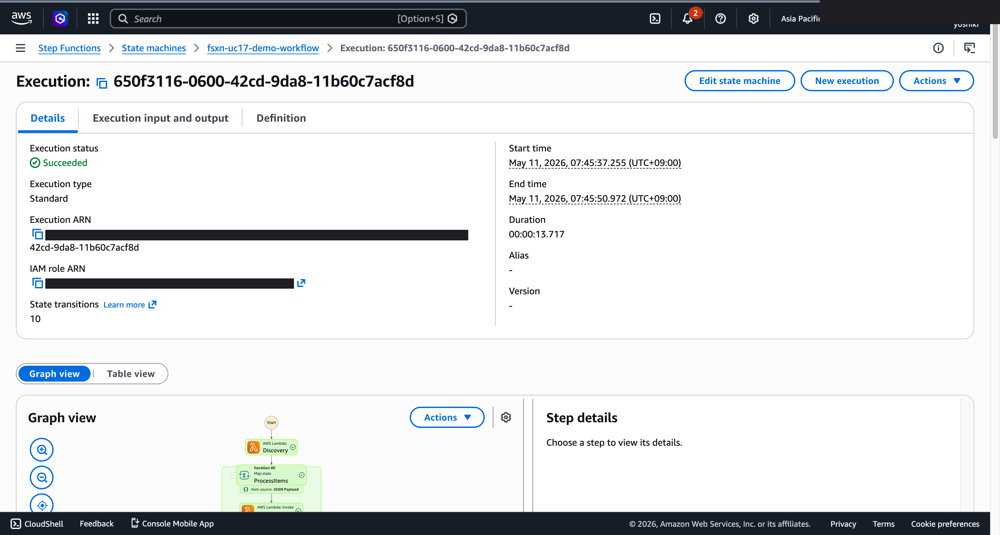

# UC17 Demoskript (30-Minuten-Slot)

🌐 **Language / 언어 / 语言 / 語言 / Langue / Sprache / Idioma**: [日本語](demo-guide.md) | [English](demo-guide.en.md) | [한국어](demo-guide.ko.md) | [简体中文](demo-guide.zh-CN.md) | [繁體中文](demo-guide.zh-TW.md) | [Français](demo-guide.fr.md) | Deutsch | [Español](demo-guide.es.md)

> Hinweis: Diese Übersetzung wurde von Amazon Bedrock Claude erstellt. Beiträge zur Verbesserung der Übersetzungsqualität sind willkommen.

## Voraussetzungen

- AWS-Konto, ap-northeast-1
- FSx for NetApp ONTAP + S3 Access Point
- Bedrock Nova Lite v1:0 Modell aktiviert

## Zeitplan

### 0:00 - 0:05 Einführung (5 Minuten)

- Herausforderungen für Kommunalverwaltungen: Zunehmende Nutzung von GIS-Daten für Stadtplanung, Katastrophenschutz und Infrastrukturerhaltung
- Bisherige Herausforderungen: GIS-Analysen konzentrieren sich auf spezialisierte Software wie ArcGIS / QGIS
- Vorschlag: Automatisierung mit FSxN S3AP + Serverless

### 0:05 - 0:10 Architektur (5 Minuten)

- Bedeutung der CRS-Normalisierung (gemischte Datenquellen)
- Generierung von Stadtplanungsberichten durch Bedrock
- Berechnungsformeln für Risikomodelle (Hochwasser, Erdbeben, Erdrutsche)

### 0:10 - 0:15 Bereitstellung (5 Minuten)

```bash
aws cloudformation deploy \
  --template-file smart-city-geospatial/template-deploy.yaml \
  --stack-name fsxn-uc17-demo \
  --parameter-overrides \
    DeployBucket=<deploy-bucket> \
    S3AccessPointAlias=<your-ap-ext-s3alias> \
    VpcId=<vpc-id> \
    PrivateSubnetIds=<subnet-ids> \
    NotificationEmail=ops@example.com \
    BedrockModelId=amazon.nova-lite-v1:0 \
  --capabilities CAPABILITY_NAMED_IAM
```

### 0:15 - 0:22 Verarbeitungsausführung (7 Minuten)

```bash
# Beispiel-Luftbild hochladen (Bezirk in Sendai)
aws s3 cp sendai_district.tif \
  s3://<s3-ap-arn>/gis/2026/05/sendai.tif

# Step Functions ausführen
aws stepfunctions start-execution \
  --state-machine-arn <uc17-StateMachineArn> \
  --input '{}'
```

Ergebnisüberprüfung:
- `s3://<out>/preprocessed/gis/2026/05/sendai.tif.metadata.json` (CRS-Informationen)
- `s3://<out>/landuse/gis/2026/05/sendai.tif.json` (Landnutzungsverteilung)
- `s3://<out>/risk-maps/gis/2026/05/sendai.tif.json` (Katastrophenrisiko-Scores)
- `s3://<out>/reports/2026/05/10/gis/2026/05/sendai.tif.md` (Bedrock-generierter Bericht)

### 0:22 - 0:27 Erläuterung der Risikokarten (5 Minuten)

- Überprüfung zeitlicher Veränderungen in der DynamoDB-Tabelle `landuse-history`
- Anzeige des von Bedrock generierten Markdown-Berichts
- Visualisierung der Hochwasser-, Erdbeben- und Erdrutsch-Risiko-Scores

### 0:27 - 0:30 Zusammenfassung (3 Minuten)

- Integrationsmöglichkeiten mit Amazon Location Service
- Punktwolkenverarbeitung im Produktivbetrieb (LAS Layer Deployment)
- Nächste Schritte: MapServer-Integration, Bürgerportal

## Häufig gestellte Fragen und Antworten

**F. Wird die CRS-Transformation tatsächlich durchgeführt?**  
A. Nur bei Bereitstellung des rasterio / pyproj Layers. Fallback durch `PYPROJ_AVAILABLE`-Prüfung.

**F. Auswahlkriterien für das Bedrock-Modell?**  
A. Nova Lite bietet ein gutes Kosten-/Genauigkeitsverhältnis. Für lange Texte wird Claude Sonnet empfohlen.
A. Nova Lite ist kosteneffizient für die Generierung japanischsprachiger Berichte. Claude 3 Haiku ist eine Alternative bei Priorisierung der Genauigkeit.

---

## Über das Ausgabeziel: Auswählbar mit OutputDestination (Pattern B)

UC17 smart-city-geospatial unterstützt seit dem Update vom 11.05.2026 den Parameter `OutputDestination`
(siehe `docs/output-destination-patterns.md`).

**Betroffene Workloads**: CRS-Normalisierungsmetadaten / Landnutzungsklassifizierung / Infrastrukturbewertung / Risikokarten / Bedrock-generierte Berichte

**2 Modi**:

### STANDARD_S3 (Standard, wie bisher)
Erstellt einen neuen S3-Bucket (`${AWS::StackName}-output-${AWS::AccountId}`) und
schreibt KI-Ergebnisse dorthin. Nur das Manifest der Discovery Lambda wird in den S3 Access Point
geschrieben (wie bisher).

```bash
aws cloudformation deploy \
  --template-file smart-city-geospatial/template-deploy.yaml \
  --stack-name fsxn-smart-city-demo \
  --parameter-overrides \
    OutputDestination=STANDARD_S3 \
    ... (andere erforderliche Parameter)
```

### FSXN_S3AP ("no data movement"-Muster)
CRS-Normalisierungsmetadaten, Landnutzungsklassifizierungsergebnisse, Infrastrukturbewertung, Risikokarten und von Bedrock generierte
Stadtplanungsberichte (Markdown) werden über den FSxN S3 Access Point zurück in **dasselbe FSx ONTAP Volume** wie die ursprünglichen GIS-Daten geschrieben.
Stadtplaner können KI-Ergebnisse direkt innerhalb der bestehenden SMB/NFS-Verzeichnisstruktur einsehen.
Es wird kein Standard-S3-Bucket erstellt.

```bash
aws cloudformation deploy \
  --template-file smart-city-geospatial/template-deploy.yaml \
  --stack-name fsxn-smart-city-demo \
  --parameter-overrides \
    OutputDestination=FSXN_S3AP \
    OutputS3APPrefix=ai-outputs/ \
    S3AccessPointName=eda-demo-s3ap \
    ... (andere erforderliche Parameter)
```

**Hinweise**:

- Angabe von `S3AccessPointName` wird dringend empfohlen (IAM-Berechtigung sowohl für Alias- als auch ARN-Format)
- Objekte über 5 GB sind mit FSxN S3AP nicht möglich (AWS-Spezifikation), Multipart-Upload erforderlich
- Die ChangeDetection Lambda verwendet nur DynamoDB und wird daher nicht von `OutputDestination` beeinflusst
- Bedrock-Berichte werden als Markdown (`text/markdown; charset=utf-8`) ausgegeben und können daher direkt mit einem Texteditor auf SMB/NFS-Clients angezeigt werden
- AWS-Spezifikationsbeschränkungen siehe
  [Abschnitt "AWS-Spezifikationsbeschränkungen und Workarounds" in der Projekt-README](../../README.md#aws-仕様上の制約と回避策)
  sowie [`docs/output-destination-patterns.md`](../../docs/output-destination-patterns.md)

---

## Verifizierte UI/UX-Screenshots

Nach dem gleichen Ansatz wie die Phase 7 UC15/16/17 und UC6/11/14 Demos, mit Fokus auf
**UI/UX-Bildschirme, die Endbenutzer tatsächlich im täglichen Betrieb sehen**.
Technische Ansichten (Step Functions-Graph, CloudFormation-Stack-Ereignisse usw.)
sind in `docs/verification-results-*.md` zusammengefasst.

### Verifizierungsstatus für diesen Anwendungsfall

- ✅ **E2E**: SUCCEEDED (Phase 7 Extended Round, commit b77fc3b)
- 📸 **UI/UX**: Not yet captured

### Vorhandene Screenshots



### UI/UX-Zielbildschirme für Re-Verifizierung (empfohlene Aufnahmeliste)

- S3-Ausgabe-Bucket (tiles/, land-use/, change-detection/, risk-maps/, reports/)
- Bedrock-generierter Stadtplanungsbericht (Markdown-Vorschau)
- DynamoDB landuse_history-Tabelle (Landnutzungsklassifizierungshistorie)
- Risikokarte JSON-Vorschau (CRITICAL/HIGH/MEDIUM/LOW-Klassifizierung)
- AI-Artefakte auf FSx ONTAP-Volume (FSXN_S3AP-Modus — Markdown-Bericht über SMB/NFS einsehbar)

### Aufnahmeanleitung

1. **Vorbereitung**: `bash scripts/verify_phase7_prerequisites.sh` ausführen, um Voraussetzungen zu prüfen
2. **Beispieldaten**: Dateien über S3 AP Alias hochladen, dann Step Functions-Workflow starten
3. **Aufnahme** (CloudShell/Terminal schließen, Benutzername oben rechts im Browser maskieren)
4. **Maskierung**: `python3 scripts/mask_uc_demos.py <uc-dir>` für automatische OCR-Maskierung ausführen
5. **Bereinigung**: `bash scripts/cleanup_generic_ucs.sh <UC>` zum Löschen des Stacks ausführen
