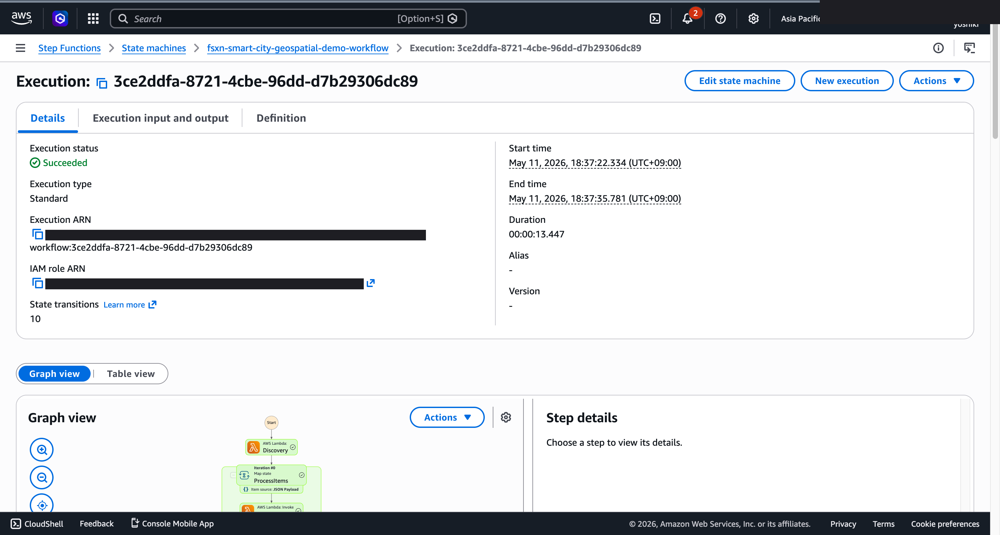
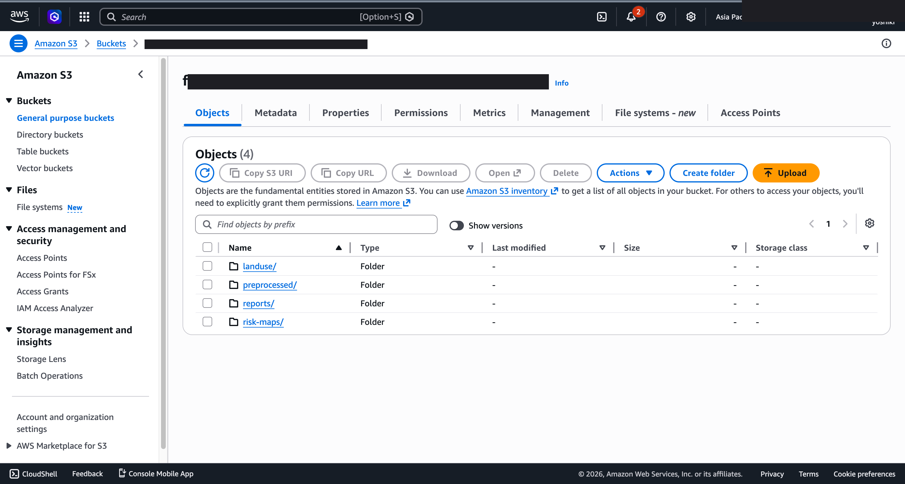
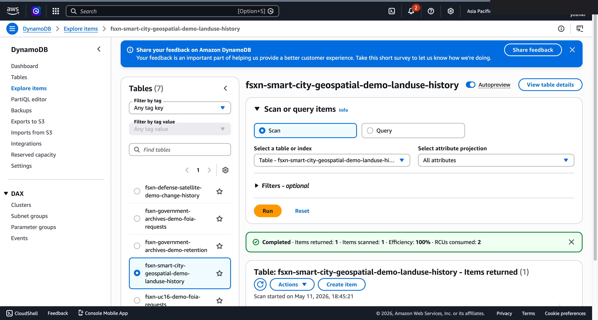

# UC17 Script de démonstration (créneau de 30 minutes)

🌐 **Language / 언어 / 语言 / 語言 / Langue / Sprache / Idioma**: [日本語](demo-guide.md) | [English](demo-guide.en.md) | [한국어](demo-guide.ko.md) | [简体中文](demo-guide.zh-CN.md) | [繁體中文](demo-guide.zh-TW.md) | Français | [Deutsch](demo-guide.de.md) | [Español](demo-guide.es.md)

> Note : Cette traduction est produite par Amazon Bedrock Claude. Les contributions pour améliorer la qualité de la traduction sont les bienvenues.

## Prérequis

- Compte AWS, ap-northeast-1
- FSx for NetApp ONTAP + S3 Access Point
- Modèle Bedrock Nova Lite v1:0 activé

## Chronologie

### 0:00 - 0:05 Introduction (5 min)

- Défis des collectivités locales : utilisation croissante des données SIG pour l'urbanisme, la gestion des catastrophes et la maintenance des infrastructures
- Défis traditionnels : l'analyse SIG est centrée sur des logiciels spécialisés comme ArcGIS / QGIS
- Proposition : automatisation avec FSxN S3AP + serverless

### 0:05 - 0:10 Architecture (5 min)

- Importance de la normalisation CRS (sources de données hétérogènes)
- Génération de rapports d'urbanisme par Bedrock
- Formules de calcul des modèles de risque (inondation, séisme, glissement de terrain)

### 0:10 - 0:15 Déploiement (5 min)

```bash
aws cloudformation deploy \
  --template-file smart-city-geospatial/template-deploy.yaml \
  --stack-name fsxn-uc17-demo \
  --parameter-overrides \
    DeployBucket=<deploy-bucket> \
    S3AccessPointAlias=<your-ap-ext-s3alias> \
    VpcId=<vpc-id> \
    PrivateSubnetIds=<subnet-ids> \
    NotificationEmail=ops@example.com \
    BedrockModelId=amazon.nova-lite-v1:0 \
  --capabilities CAPABILITY_NAMED_IAM
```

### 0:15 - 0:22 Exécution du traitement (7 min)

```bash
# サンプル航空写真アップロード（仙台市の一画）
aws s3 cp sendai_district.tif \
  s3://<s3-ap-arn>/gis/2026/05/sendai.tif

# Step Functions 実行
aws stepfunctions start-execution \
  --state-machine-arn <uc17-StateMachineArn> \
  --input '{}'
```

Vérification des résultats :
- `s3://<out>/preprocessed/gis/2026/05/sendai.tif.metadata.json` (informations CRS)
- `s3://<out>/landuse/gis/2026/05/sendai.tif.json` (répartition de l'utilisation des sols)
- `s3://<out>/risk-maps/gis/2026/05/sendai.tif.json` (scores de risque de catastrophe)
- `s3://<out>/reports/2026/05/10/gis/2026/05/sendai.tif.md` (rapport généré par Bedrock)

### 0:22 - 0:27 Explication de la carte des risques (5 min)

- Vérification des changements temporels dans la table DynamoDB `landuse-history`
- Affichage du rapport Markdown généré par Bedrock
- Visualisation des scores de risque d'inondation, de séisme et de glissement de terrain

### 0:27 - 0:30 Conclusion (3 min)

- Possibilité d'intégration avec Amazon Location Service
- Traitement de nuages de points en production (déploiement de LAS Layer)
- Prochaines étapes : intégration MapServer, portail citoyen

## Questions fréquentes et réponses

**Q. La conversion CRS est-elle réellement effectuée ?**  
R. Uniquement lors du déploiement de la Layer rasterio / pyproj. Repli avec vérification `PYPROJ_AVAILABLE`.

**Q. Critères de sélection du modèle Bedrock ?**  
R. Nova Lite offre un bon équilibre coût/précision. Claude Sonnet recommandé pour les longs textes.
R. Nova Lite est rentable pour la génération de rapports en japonais. Claude 3 Haiku est une alternative pour privilégier la précision.

---

## À propos de la destination de sortie : sélectionnable avec OutputDestination (Pattern B)

UC17 smart-city-geospatial prend en charge le paramètre `OutputDestination` depuis la mise à jour du 2026-05-11
(voir `docs/output-destination-patterns.md`).

**Charges de travail concernées** : métadonnées de normalisation CRS / classification de l'utilisation des sols / évaluation des infrastructures / cartes de risque / rapports générés par Bedrock

**2 modes** :

### STANDARD_S3 (par défaut, comportement traditionnel)
Crée un nouveau bucket S3 (`${AWS::StackName}-output-${AWS::AccountId}`) et
y écrit les résultats de l'IA. Seul le manifest de la Lambda Discovery est écrit
dans le S3 Access Point (comme auparavant).

```bash
aws cloudformation deploy \
  --template-file smart-city-geospatial/template-deploy.yaml \
  --stack-name fsxn-smart-city-demo \
  --parameter-overrides \
    OutputDestination=STANDARD_S3 \
    ... (他の必須パラメータ)
```

### FSXN_S3AP (pattern "no data movement")
Les métadonnées de normalisation CRS, les résultats de classification de l'utilisation des sols, l'évaluation des infrastructures, les cartes de risque et les
rapports d'urbanisme (Markdown) générés par Bedrock sont réécrits via le FSxN S3 Access Point dans le
**même volume FSx ONTAP** que les données SIG d'origine.
Les responsables de l'urbanisme peuvent référencer directement les résultats de l'IA dans la structure de répertoires SMB/NFS existante.
Aucun bucket S3 standard n'est créé.

```bash
aws cloudformation deploy \
  --template-file smart-city-geospatial/template-deploy.yaml \
  --stack-name fsxn-smart-city-demo \
  --parameter-overrides \
    OutputDestination=FSXN_S3AP \
    OutputS3APPrefix=ai-outputs/ \
    S3AccessPointName=eda-demo-s3ap \
    ... (他の必須パラメータ)
```

**Points d'attention** :

- Spécification de `S3AccessPointName` fortement recommandée (autoriser IAM pour les formats Alias et ARN)
- Les objets de plus de 5 Go ne sont pas pris en charge par FSxN S3AP (spécification AWS), upload multipart obligatoire
- La Lambda ChangeDetection utilise uniquement DynamoDB et n'est donc pas affectée par `OutputDestination`
- Les rapports Bedrock sont écrits en Markdown (`text/markdown; charset=utf-8`), donc directement consultables
  avec un éditeur de texte sur les clients SMB/NFS
- Pour les contraintes liées aux spécifications AWS, consultez
  [la section "Contraintes des spécifications AWS et solutions de contournement" du README du projet](../../README.md#aws-仕様上の制約と回避策)
  et [`docs/output-destination-patterns.md`](../../docs/output-destination-patterns.md)

---

## Captures d'écran UI/UX vérifiées

Suivant la même approche que les démos Phase 7 UC15/16/17 et UC6/11/14, ciblant
**les écrans UI/UX que les utilisateurs finaux voient réellement dans leurs opérations quotidiennes**.
Les vues techniques (graphe Step Functions, événements de pile CloudFormation, etc.)
sont consolidées dans `docs/verification-results-*.md`.

### Statut de vérification pour ce cas d'utilisation

- ✅ **E2E**: SUCCEEDED (Phase 7 Extended Round, commit b77fc3b)
- 📸 **Capture UI/UX** : ✅ Terminé (Phase 8 Theme D, commit d7ebabd)

### Captures d'écran existantes






### Écrans UI/UX cibles pour re-vérification (liste de captures recommandées)

- Bucket S3 de sortie (tiles/, land-use/, change-detection/, risk-maps/, reports/)
- Rapport d'urbanisme généré par Bedrock (aperçu Markdown)
- Table DynamoDB landuse_history (historique de classification d'utilisation des sols)
- Aperçu JSON de la carte des risques (classification CRITICAL/HIGH/MEDIUM/LOW)
- Artefacts AI sur volume FSx ONTAP (mode FSXN_S3AP — rapport Markdown consultable via SMB/NFS)

### Guide de capture

1. **Préparation** : Exécuter `bash scripts/verify_phase7_prerequisites.sh` pour vérifier les prérequis
2. **Données d'exemple** : Télécharger les fichiers via S3 AP Alias, puis démarrer le workflow Step Functions
3. **Capture** (fermer CloudShell/terminal, masquer le nom d'utilisateur en haut à droite du navigateur)
4. **Masquage** : Exécuter `python3 scripts/mask_uc_demos.py <uc-dir>` pour le masquage OCR automatique
5. **Nettoyage** : Exécuter `bash scripts/cleanup_generic_ucs.sh <UC>` pour supprimer la pile
