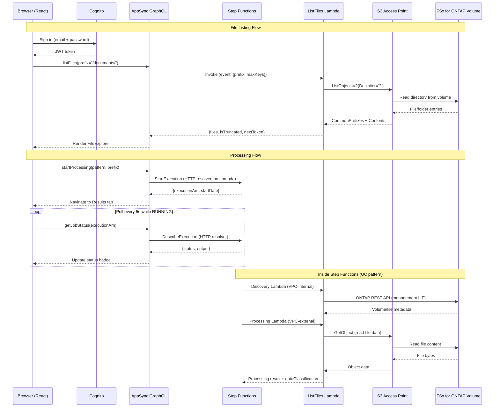

# FSx for ONTAP Dateiportal — Amplify Gen2

🌐 **Sprache**: [日本語](README.ja.md) | [English](README.md) | [한국어](README.ko.md) | [简体中文](README.zh-CN.md) | [繁體中文](README.zh-TW.md) | [Français](README.fr.md) | Deutsch | [Español](README.es.md)

Webbasiertes Dateiportal zum Durchsuchen, Verarbeiten und Anzeigen von Ergebnissen auf FSx for ONTAP-Volumes über S3 Access Points.

## Warum ein Dateiportal erstellen?

AWS bietet Bausteine (S3 API, Cognito, AppSync), aber keinen integrierten verwalteten Service, der ein Box/Google Drive-ähnliches Dateiverwaltungserlebnis für NAS-Daten auf FSx for ONTAP bietet. Um Endnutzern browserbasierter Dateizugriff, Verarbeitungsauslöser und Ergebnisanzeige zu bieten, müssen Sie Ihre eigene Lösung zusammenstellen. Dieses Projekt ist eine solche Zusammenstellung mit Amplify Gen2.

Siehe auch: [UI-Auswahlguide für das Dateiportal (Amplify / Nextcloud / Custom)](../../docs/file-portal-amplify-gen2.md)

## Dokumentation

- **[Benutzerhandbuch](../../docs/en/portal-user-guide.md)** — Endbenutzerhandbuch für die tägliche Portalnutzung (keine Deployment-Kenntnisse erforderlich)
- **[Erste Schritte](docs/GETTING-STARTED.md)** — Einrichtung, DemoMode, VPC Endpoints, Produktions-Checkliste
- **[Implementierungsguide](docs/IMPLEMENTATION.md)** — Architektur, Konfigurationsdateien, Komponentenstruktur, Deployment, Änderungsprotokoll
- **[Admin-Demo-Guide](../../docs/en/admin-resource-management-demo.md)** — E2E-Demo-Szenarien für Ressourcenverwaltung + ARP/AI
- **[AI Agent Demo-Guide](docs/ai-agent-demo-guide.en.md)** — AI Agent Chat, Semantische Suche, Guardrails, HITL
- **[Index der Architekturdiagramme](../../docs/architecture-diagrams.en.md)** — alle 13 Abbildungen (helles Design / dunkles Design)

## Hauptfunktionen

| Funktion | Beschreibung |
|---------|-------------|
| **Storage Dashboard** | 4-Karten-Gesundheitsübersicht (Kapazität, ARP-Bedrohungen, gesperrte Snapshots, Effizienz) — Admin-Startseite |
| **Welcome Onboarding** | 3-Schritte-Führung für Erstbenutzer (Durchsuchen → AI → Schutz) |
| **ARP/AI Incident Lifecycle** | Status-Verfolgung: Detected → Contained → Investigating → Resolved |
| **S3 Object Lock Management** | Statusanzeige + Aufbewahrungskonfiguration für Ausgabe-Buckets |
| **EMS Event Viewer** | ONTAP-Alarm-/Fehlerereignisse vom Event Management System |
| **PHI Guardrail** | AI-Verarbeitung für /dicom/, /phi/, /pii/-Pfade blockiert |
| **SMB Encryption Toggle** | ON/OFF für SMB 3.0-Verschlüsselung bei Übertragung mit Client-Kompatibilitätswarnung |
| **Export Policy CRUD** | Richtlinien erstellen/löschen (nicht nur Regeln) |
| **VolumeSelector Search** | Serverseitiger Wildcard-Filter + 300ms Debounce für große Umgebungen |
| **Tamperproof Lock** | Inline-Sperrformular mit FISC/SOX/HIPAA-Aufbewahrungsvoreinstellungen |
| **8-Language i18n** | JA/EN/KO/ZH-CN/ZH-TW/FR/DE/ES mit sofortiger Laufzeitumschaltung |
| **AI Agent Chat** | Natürlichsprachliche Dateioperationen über Bedrock Converse + tool_use (3 Modi: KB/Agent/Multi) |
| **Multimodal Input** | Drag-and-Drop-Bild-Upload + Bedrock Vision API-Analyse |
| **Chat History** | DynamoDB-persistierte Sitzungen mit automatischer Speicherung und Wiederherstellung |
| **Agent Directory** | Benutzerdefiniertes Agentenregister mit Erstellungsformular, Kategoriefilter und Freigabe |
| **Multi-Agent Teams** | Team-Assistent mit Rollenzuweisung (Supervisor/Collaborator/Reviewer) |
| **KB Smart Routing** | Gruppenbasierte KB-Suchbereichsfilterung für Multi-Tenant-Zugriffskontrolle |
| **Admin Feature Gates** | AI-Funktionen standardmäßig deaktiviert, pro Funktion vom Admin-Panel umschaltbar |

## Architektur


*Abbildung: Architektur des Amplify Gen2 Portals — Lambda-Funktionen außerhalb der VPC lesen und schreiben das FSx for ONTAP Volume über den S3 Access Point*

> Die Abbildung oben verwendet das helle Design (weißer Hintergrund). Wenn Sie den Dark Mode bevorzugen, nutzen Sie die [Version im dunklen Design](../../docs/images/amplify-vpc-split-en-dark.svg). Der [Index der Architekturdiagramme](../../docs/architecture-diagrams.en.md) listet alle 13 Abbildungen mit hellen und dunklen Links auf.

Dieselbe Architektur als Text:

```
┌──────────────────────────────────────────────────────────┐
│  Amplify Gen2                                            │
│  ┌──────────┐  ┌─────────────────────────────────────┐   │
│  │ Cognito  │  │ AppSync GraphQL API                 │   │
│  │ Auth     │  │  startProcessing → Step Functions   │   │
│  │ +MFA     │  │  getJobStatus → Step Functions      │   │
│  │ +SAML    │  │  listFiles → Lambda → S3 AP         │   │
│  └──────────┘  └──────────────┬──────────────────────┘   │
│                               │                          │
│  ┌─────────────────────────────────────────────────────┐ │
│  │ CDK (in data stack)                                 │ │
│  │  - HTTP Data Source → states.<region>.amazonaws.com │ │
│  │  - Lambda Data Source → ListFiles (Python 3.13)     │ │
│  └─────────────────────────────────────────────────────┘ │
└──────────────────────────────────────────────────────────┘
          │                              │
          ▼                              ▼
┌──────────────────┐          ┌─────────────────────────┐
│ Step Functions   │          │ FSx for ONTAP           │
│ (UC pattern or   │          │ S3 Access Point         │
│  test workflow)  │          │ (Internet-origin)       │
└──────────────────┘          └─────────────────────────┘
```

### Anforderungsfluss (Sequenzdiagramm)



---

## Portal-UI — Seitenleisten-Layout (12 Bereiche)


*Linke Seitenleiste: gruppierte Navigation. Mitte: aktiver Bereichsinhalt. Rechts: AI-Assistent (bei Dateiauswahl).*

| Gruppe | Bereich | Zweck |
|-------|---------|---------|
| **Browse** | All Files | Durchsuchen, Vorschau, AI Q&A, Freigabelinks, QR-Zugriff |
| | Favorites | Angeheftete Dateien (DynamoDB, pro Benutzer) |
| | Recent | Kürzlich aufgerufene Dateien |
| | Upload | Drag-and-Drop über Storage Browser for S3 |
| **AI & Processing** | AI Processing | AI/ML-Workflows auslösen (Step Functions) |
| | Job History | Vergangene Ausführungen (DynamoDB, Eigentümer-Bereich) |
| | Analytics | Athena SQL auf Glue Data Catalog |
| **Data Protection** | Snapshots | ONTAP-Snapshot-Liste + FlexClone-Wiederherstellung |
| | Lock | SnapLock (WORM) + S3 Object Lock-Status |
| | ARP/AI | Autonomous Ransomware Protection-Status |
| **Admin** | Version Diff | Dateivergleich zwischen Snapshots (nebeneinander) |
| | Audit Trail | CloudTrail S3-Datenereignisse (wer/wann/was) |


*AI Processing: Muster + Eingabepfad auswählen → Job an Step Functions übermitteln*


*ARP/AI: Ransomware-Erkennungsstatus, Alarmanzahl, automatisches Snapshot-Inventar*

### Zusätzliche Funktionen

| Funktion | Beschreibung |
|---------|-------------|
| **My Files (Gruppen-Routing)** | Cognito-Gruppe → unterschiedlicher S3 AP pro Team |
| **CONFIDENTIAL Guardrail** | Blockiert AI-Verarbeitung für klassifizierte Dateien (CUI/CONFIDENTIAL) |
| **AI-Metadaten-Badges** | Inline-Klassifizierungslabels, Rekognition-Tags, Entity-Anzahl |
| **QR-Code-Zugriff** | Presigned URL → QR-PNG für OT-/Fertigungs-Tablets |
| **Presigned URL-Freigabe** | TTL-konfigurierbare Freigabelinks (5min–1h) |
| **cdk-nag Compliance** | AwsSolutionsChecks bei synth erzwungen |
| **Fallback-UI** | Informationspanel wenn ONTAP nicht verbunden (kein weißer Bildschirm) |

> **Detaillierter Bereichsguide**: [docs/portal-tabs-guide.md](docs/portal-tabs-guide.md)

---

## Voraussetzungen

| Anforderung | Version / Hinweise |
|---|---|
| Node.js | 18.17+ (erforderlich für Amplify Gen2) |
| AWS CLI | v2 mit konfigurierten Anmeldedaten |
| AWS-Konto | Berechtigungen für Amplify, Cognito, AppSync, Lambda, Step Functions |
| OS | macOS oder Linux (Windows: WSL2 verwenden oder npm-Skripte direkt ausführen) |
| (Optional) FSx for ONTAP | Mit angehängtem **Internet-origin** S3 AP (VPC-origin wird von diesem Portal NICHT unterstützt) |
| (Optional) Bereitgestelltes UC-Muster | Für Step Functions-Integration |

> ⚠️ **Sandbox-Ressourcen bleiben bestehen, bis sie explizit gelöscht werden.** Führen Sie nach Tests immer `make sandbox-delete` aus, um verwaiste AWS-Ressourcen (Cognito User Pool, AppSync API, Lambda) zu vermeiden. Siehe [Bereinigung](#bereinigung).

---

## Schnellstart (5 Minuten)

> **Zeitbedarf**: Die Ersteinrichtung dauert insgesamt ca. 15 Minuten (npm install ~2min + CDK bootstrap + Sandbox-Deployment ~10-13min). Nachfolgende Iterationen sind viel schneller (~30s für Lambda-Code-Änderungen, ~3min für Infrastruktur-Änderungen).

> **Multi-Entwickler**: Jeder Entwickler erhält eine separate Sandbox (identifiziert durch OS-Benutzername). Mehrere Teammitglieder können ohne Konflikte am selben AWS-Konto arbeiten. Verwenden Sie `npx ampx sandbox --identifier <name>` zur Anpassung.

```bash
# 1. Abhängigkeiten installieren
make install

# 2. Konfiguration erstellen (ERFORDERLICH vor Build/Sandbox)
cp amplify/portal-config.example.ts amplify/portal-config.ts
# portal-config.ts bearbeiten — mindestens Region setzen (z.B. us-east-1 für USA, ap-northeast-1 für Japan)
# ⚠️ Ohne diese Datei schlagen `make sandbox` und `npx tsc` mit "Cannot find module './portal-config'" fehl

# 3. Backend in persönliche Sandbox deployen (~3-5 Min. beim ersten Mal, ~30s inkrementell)
make sandbox

# 4. In einem anderen Terminal den Entwicklungsserver starten
make dev

# 5. http://localhost:5173 im Browser öffnen
#    Mit E-Mail registrieren → Code verifizieren (oder CLI verwenden: siehe unten) → Anmelden
```

### Erstbenutzer-Verifizierung (CLI-Abkürzung)

Cognito sendet eine Verifizierungs-E-Mail, aber für Testkonten können Sie per CLI bestätigen:

```bash
# Ersetzen Sie mit Ihrer User Pool ID aus amplify_outputs.json
aws cognito-idp admin-confirm-sign-up \
  --user-pool-id <USER_POOL_ID> \
  --username "your-email@example.com" \
  --region ap-northeast-1
```

---

## Konfiguration

Alle umgebungsspezifischen Parameter befinden sich in `amplify/portal-config.ts`.

### Einrichtung

```bash
cp amplify/portal-config.example.ts amplify/portal-config.ts
```

`portal-config.ts` bearbeiten:

| Parameter | Erforderlich | Beispiel | Beschreibung |
|---|---|---|---|
| `region` | Ja | `"ap-northeast-1"` | AWS-Region für Step Functions und S3 AP |
| `s3ApAlias` | Nein | `"myap-abc123-s3alias"` | S3 AP-Alias oder Bucket-Name. Leer = "Keine Dateien" |
| `stateMachineArn` | Nein | `"arn:aws:states:..."` | Step Functions ARN für Verarbeitung |
| `stateMachineResourceScope` | Nein | `"*"` | IAM-Bereich (in Produktion spezifischen ARN verwenden) |
| `s3ApResourceArns` | Nein | `["arn:aws:s3:..."]` | IAM-Bereich für S3 AP (in Produktion einschränken) |
| `groupApMapping` | Nein | `{"eng": "ap-eng-xxx"}` | Cognito-Gruppe → S3 AP-Alias-Mapping (My Files) |
| `bedrockKbId` | Nein | `"KB123ABC"` | Bedrock Knowledge Base ID (Volltextsuche) |

### Umgebungsvariablen-Override

Anstatt die Datei zu bearbeiten, können Sie Umgebungsvariablen setzen:

```bash
export AMPLIFY_PORTAL_REGION=ap-northeast-1
export AMPLIFY_PORTAL_S3AP_ALIAS=myap-abc123-s3alias
export AMPLIFY_PORTAL_SFN_ARN=arn:aws:states:ap-northeast-1:123456789012:stateMachine:uc1-workflow
export AMPLIFY_PORTAL_GROUP_AP_MAPPING='{"engineering":"ap-eng-xxx-s3alias","legal":"ap-legal-xxx-s3alias"}'
export AMPLIFY_PORTAL_BEDROCK_KB_ID=KB123ABC
```

---

## Deployment-Guide

### Schneller Demo-Pfad (Am schnellsten)

```bash
make install
cp amplify/portal-config.example.ts amplify/portal-config.ts
make sfn-test-create   # Erstellt Test-SFn — ARN aus der Ausgabe notieren
# portal-config.ts bearbeiten: ARN in stateMachineArn einfügen
# amplify/data/resolvers/start-processing.js bearbeiten: ARN einfügen (Zeile 6)
make sandbox
make dev
```

> **Zwei-Stellen-ARN-Synchronisation**: Der State Machine ARN muss in `portal-config.ts` (für IAM-Bereichsfestlegung) und `start-processing.js` (für Laufzeitaufruf) gesetzt werden. Dies ist eine bekannte Einschränkung der APPSYNC_JS-Resolver, die keine CDK-Parameter zur Laufzeit lesen können. Siehe [Bekannte Fallstricke #6](#6-zwei-stellen-arn-konfiguration).

### DemoMode (Ohne FSx for ONTAP)

Für Entwicklung ohne FSx for ONTAP:

1. `s3ApAlias` leer lassen (Dateien-Tab zeigt "Keine Dateien") oder normalen S3-Bucket-Namen setzen
2. Test Step Functions State Machine erstellen: `make sfn-test-create`
3. Zurückgegebenen ARN in `portal-config.ts` einfügen
4. Neu deployen: `make sandbox`

### Verbindung mit FSx for ONTAP S3 Access Point

1. S3 AP an Ihrem FSx for ONTAP-Volume erstellen (Internet-origin empfohlen)
2. AP-Alias aus AWS-Konsole → FSx → S3 Access Points notieren
3. `s3ApAlias` in `portal-config.ts` setzen
4. `s3ApAlias` in `src/portal-settings.ts` setzen (gleicher Alias — für Upload-Tab benötigt)
5. Neu deployen: `make sandbox`

> **Hinweis**: Das ListFiles Lambda läuft VPC-extern (kein VpcConfig). Dies ist beabsichtigt — Internet-origin S3 APs sind ohne VPC-Platzierung erreichbar. Bei Verwendung eines VPC-origin AP müssen Sie dem Lambda VPC-Konfiguration hinzufügen.

> **Upload-Tab**: Storage Browser verwendet Cognito Identity Pool-Anmeldedaten, um die S3 API direkt vom Browser aufzurufen. Die erforderlichen IAM-Berechtigungen werden automatisch von `backend.ts` bereitgestellt (keine manuelle IAM-Konfiguration nötig). Stellen Sie sicher, dass `s3ApAlias` sowohl in `portal-config.ts` als auch in `src/portal-settings.ts` gesetzt ist.

> **Upload-Tab-Workflow**: Location auswählen → S3 AP Alias klicken → Ordnernavigation → Datei auswählen für Vorschau/Download oder Drag-and-Drop zum Upload. Hochgeladene Dateien sind sofort über NFS/SMB verfügbar (ONTAP strong consistency).

> **Durchsatz-Hinweis**: S3 AP-Operationen teilen sich die FSx for ONTAP-Durchsatzkapazität mit NFS/SMB-Workloads. Für die Planung gleichzeitiger Benutzer siehe [Durchsatz- und Kapazitätsplanung](../../docs/file-portal-amplify-gen2.md#スループットと容量計画).

> **Performance-Hinweis**: Das ListFiles Lambda antwortet typischerweise in 100-300ms für Verzeichnisse mit < 100 Objekten. Für Verzeichnisse mit 1000 Objekten (Maximum pro Seite) sind 300-800ms zu erwarten. Das Lambda hat ein 30-Sekunden-Timeout als Sicherheitsnetz, aber der normale Betrieb liegt weit unter 1 Sekunde.

### Verbindung mit einem bereitgestellten UC-Muster

Nach Deployment eines UC-Musters (z.B. `make deploy-uc1` aus dem Repo-Root):

1. State Machine ARN aus den CloudFormation-Outputs notieren
2. `stateMachineArn` in `portal-config.ts` setzen
3. `start-processing.js` Resolver mit dem ARN aktualisieren
4. Neu deployen: `make sandbox`

---

## Bekannte Fallstricke (Erfahrungswerte)

Bei der Verifizierung entdeckte Probleme, die Ihnen Debug-Zeit sparen:

### 1. APPSYNC_JS Resolver-Einschränkungen

AppSync JavaScript-Resolver (APPSYNC_JS Runtime) haben erhebliche Einschränkungen:

| ❌ Nicht erlaubt | ✅ Stattdessen verwenden |
|---|---|
| `new Date()` | `util.time.nowISO8601()` oder Epoch zurückgeben, im Frontend parsen |
| Template Literals (`` `${x}` ``) | String-Konkatenation (`"a" + b + "c"`) |
| `async/await` | Nur synchron |
| Globale Konstruktoren (`String()`, `Number()`) | Direkte Werte |

### 2. Cross-Stack Data Source-Bindung

Data Sources (HTTP, Lambda) **müssen** zum selben CDK-Stack wie die AppSync API hinzugefügt werden. Wenn Sie `backend.createStack()` für Data Sources verwenden, schlagen Resolver mit "Data source not found" fehl, da sie einen anderen CloudFormation-Stack referenzieren.

**Lösung**: `Stack.of(api)` verwenden, um den Data Stack zu erhalten, und dort alle Data Sources hinzufügen.

### 3. Step Functions Epoch-Sekunden

`DescribeExecution` gibt `startDate` und `stopDate` als Unix Epoch **Sekunden** zurück (nicht Millisekunden, nicht ISO 8601). Der Resolver gibt sie als Strings zurück; das Frontend multipliziert mit 1000 für JavaScript `Date`.

### 4. IAM-Berechtigungen für S3 Buckets vs S3 Access Points

Die Lambda-IAM-Policy verwendet `arn:aws:s3:*:*:accesspoint/*` für S3 Access Points. Wenn Sie einen **normalen S3 Bucket** für DemoMode-Tests verwenden, müssen Sie Bucket-Format-ARN-Berechtigungen hinzufügen:

```bash
# Temporär: per CLI für Tests hinzufügen
aws iam put-role-policy --role-name <LAMBDA_ROLE_NAME> \
  --policy-name S3BucketTestAccess \
  --policy-document '{"Version":"2012-10-17","Statement":[{"Effect":"Allow","Action":["s3:ListBucket","s3:GetObject"],"Resource":["arn:aws:s3:::<BUCKET>","arn:aws:s3:::<BUCKET>/*"]}]}'
```

Oder `s3ApResourceArns` in `portal-config.ts` aktualisieren, um den Bucket-ARN einzuschließen.

### 5. Cognito Verifizierungs-E-Mail

Testkonten mit nicht existierenden E-Mail-Adressen erhalten keine Verifizierungscodes. CLI-Abkürzung verwenden:

```bash
aws cognito-idp admin-confirm-sign-up \
  --user-pool-id <USER_POOL_ID> \
  --username "test@example.com" \
  --region <REGION>
```

### 6. Zwei-Stellen-ARN-Konfiguration

Der Step Functions State Machine ARN muss an **zwei Stellen** gesetzt werden:

1. `amplify/portal-config.ts` → `stateMachineArn` (für IAM-Policy-Bereichsfestlegung in CDK)
2. `amplify/data/resolvers/start-processing.js` → `const stateMachineArn = "..."` (zur Laufzeit vom AppSync-Resolver verwendet)

Diese Duplizierung existiert, weil APPSYNC_JS-Resolver zur Laufzeit keine CDK-Parameter oder Umgebungsvariablen lesen können. Sie sind statisches JavaScript, das von der integrierten AppSync-Runtime ausgewertet wird.

**Vergessen, eine der beiden Stellen zu aktualisieren** ist das häufigste Deployment-Problem.

### 7. State Machine ARN im Resolver ist kein Geheimnis

Der in `start-processing.js` fest codierte ARN ist im Quellcode sichtbar. Dies ist akzeptabel, da:
- ARNs keine Geheimnisse sind — sie identifizieren Ressourcen, gewähren aber keinen Zugriff
- IAM-Policies (nicht ARNs) steuern, wer eine State Machine aufrufen kann
- Die AppSync API Cognito-Authentifizierung erfordert, bevor ein Resolver ausgeführt wird

Der ARN ist jedoch **umgebungsspezifisch** — immer bei Wechsel zwischen dev/staging/prod aktualisieren.

---

## Entwicklungsbefehle

| Befehl | Beschreibung |
|---|---|
| `make install` | npm-Abhängigkeiten installieren |
| `make dev` | Vite-Entwicklungsserver starten (nur Frontend) |
| `make sandbox` | Amplify-Backend deployen/aktualisieren (persönliche Sandbox) |
| `make sandbox-delete` | Alle Sandbox-Ressourcen löschen |
| `make sandbox-status` | CloudFormation-Stack-Status anzeigen |
| `make sfn-test-create` | Test Step Functions State Machine erstellen |
| `make sfn-test-delete` | Test State Machine + IAM-Rolle löschen |
| `make test` | vitest ausführen (Einzelausführung) |
| `make typecheck` | TypeScript-Typvalidierung |
| `make lint` | ESLint-Prüfung |
| `make build` | Produktions-Build |
| `make clean` | node_modules, dist, .amplify entfernen |
| `make cleanup-all` | Sandbox + Test-SFn + Test-S3-Daten löschen |

---

## Deployment-Zeiten (Verifiziert 2026-07-20)

| Schritt | Erstmals | Folgende |
|------|-----------|-----------|
| `npm install` | ~60s | 0s (gecacht) |
| `make sandbox` | 4-5 Min. (CDK Bootstrap + vollständiger Stack) | 20-40s (inkrementell) |
| `make sandbox-delete` | ~2 Min. | — |
| Cognito-Benutzer-Erstellung (CLI) | 2s | — |
| `make dev` → Browser | 2s | 2s |

**Gesamte Ersteinrichtungszeit**: ~15 Minuten von `git clone` bis zum funktionierenden Portal (CDK Bootstrap + initiales Deployment). Folgeänderungen: ~7 Sekunden nur für Code, ~3 Minuten für Infrastrukturänderungen.

### Produktions-Deployment

Für Produktion (Amplify Hosting + benutzerdefinierte Domain) siehe den [Amplify Hosting Produktions-Guide](../../docs/en/amplify-hosting-production-guide.md).

Wesentliche Unterschiede zur Sandbox:
- Branch-basiertes CI/CD (Push nach `main` → automatisches Deployment)
- Benutzerdefinierte Domain mit ACM-Zertifikat
- WAF-Integration für DDoS-Schutz
- SAML/OIDC statt reiner E-Mail-Authentifizierung

---

## Bekannte Fallstricke — Zusätzliche Erkenntnisse (2026-07-20)

### 8. Upload-Tab erfordert `portal-settings.ts` Konfiguration

Der Upload-Tab (Storage Browser for S3) liest `region`, `accountId` und `s3ApAlias` aus `src/portal-settings.ts` — NICHT aus `amplify/portal-config.ts`. Dies liegt daran, dass Storage Browser vollständig clientseitig läuft (kein Lambda) und direkten S3 API-Zugriff über Cognito Identity Pool-Anmeldedaten benötigt.

Wenn "Network Error" im Upload-Tab erscheint, prüfen Sie ob `portal-settings.ts` den korrekten `s3ApAlias` enthält.

### 9. ~~Cognito Identity Pool IAM muss S3 AP-Zugriff erlauben~~ (automatisch konfiguriert)

> **Gelöst**: `backend.ts` gewährt nun automatisch per CDK S3 AP-Zugriffsberechtigungen an die authentifizierte Rolle des Cognito Identity Pool. Manuelles `aws iam put-role-policy` ist nicht erforderlich.

Folgender Teil von `backend.ts` konfiguriert automatisch:
```typescript
authenticatedRole.addToPrincipalPolicy(
  new iam.PolicyStatement({
    sid: "StorageBrowserS3APAccess",
    actions: ["s3:GetObject", "s3:PutObject", "s3:DeleteObject", "s3:ListBucket", "s3:GetBucketLocation"],
    resources: config.s3ApResourceArns,
  })
);
```

Wenn der Upload-Tab "AccessDenied" anzeigt, bestätigen Sie, dass `s3ApResourceArns` in `portal-config.ts` den korrekten S3 AP ARN enthält. Der Sandbox-Standard (`arn:aws:s3:*:*:accesspoint/*`) erlaubt Zugriff auf alle APs.

> **Storage Browser Authentifizierungsmodus**: Storage Browser verwendet den **direkten Authentifizierungsmodus** (`getLocationCredentials` + `listLocations`), nicht `createManagedAuthAdapter` (erfordert S3 Access Grants). Keine S3 Access Grants-Einrichtung erforderlich.

### 10. Sandbox-Löschung ist vollständig

`make sandbox-delete` entfernt ALLE Ressourcen (Cognito User Pool, AppSync API, Lambda-Funktionen, DynamoDB-Tabellen, IAM-Rollen). Benutzerkonten, Job-Verlauf und API-Endpoints werden dauerhaft gelöscht. Keine Option für teilweise Bereinigung.

### 11. Multi-Entwickler-Sandboxes

Jeder Entwickler erhält eine isolierte Sandbox, die durch den OS-Benutzernamen gekennzeichnet ist. `make sandbox` auf verschiedenen Maschinen (oder mit verschiedenen Benutzernamen) erstellt separate Stacks:

```
amplify-fsxns3apamplifyportal-yoshiki-sandbox-ae70db2b34  ← Entwickler 1
amplify-fsxns3apamplifyportal-tanaka-sandbox-bf81ec3c45   ← Entwickler 2
```

Sie teilen dasselbe AWS-Konto, interferieren aber nicht. Verwenden Sie `npx ampx sandbox --identifier benutzerdefinierter-name` für explizite Benennung.

---

## Projektstruktur

```
amplify-portal/
├── amplify/
│   ├── backend.ts                  # Einstiegspunkt — importiert Config, erstellt Data Sources + Lambda
│   ├── portal-config.ts            # IHRE Konfiguration (git-ignored)
│   ├── portal-config.example.ts    # Vorlage — kopieren und anpassen
│   ├── auth/resource.ts            # Cognito (E-Mail + MFA + SAML/OIDC-Platzhalter)
│   ├── data/
│   │   ├── resource.ts             # AppSync-Schema (Queries, Mutations, benutzerdefinierte Typen)
│   │   └── resolvers/              # APPSYNC_JS-Resolver (7 Dateien)
│   └── custom/
│       └── step-functions.ts       # (Referenz — nach backend.ts verschoben)
├── src/
│   ├── main.tsx                    # Amplify configure + Authenticator-Wrapper
│   ├── App.tsx                     # 6-Tab-Shell (Files/Upload/Process/Results/History/Analytics)
│   ├── portal-settings.ts         # Frontend-Config (Upload-Tab, Region, accountId)
│   └── components/                 # React-Komponenten (FileExplorer, AiPanel, etc.)
├── functions/
│   ├── notification-bridge/handler.py  # EventBridge → DynamoDB (FPolicy + SFTP-Events)
│   └── job-status-updater/handler.py   # Step Functions → DynamoDB (WebSocket-Push)
├── monitoring/
│   └── dashboard.ts               # CloudWatch Dashboard CDK-Konstrukt
├── docs/
│   ├── portal-tabs-guide.md       # 6-Tab-Detailguide mit Screenshots
│   └── screenshots/               # Portal-UI-Screenshots
├── tests/
│   └── components/App.test.tsx     # Tab-Rendering + Navigationstests
├── amplify_outputs.json            # Automatisch generiert durch Sandbox (git-ignored)
├── package.json
├── Makefile                        # Alle Workflow-Befehle
└── README.md
```

---

## Bereinigung

> ⚠️ **Wichtig**: Sandbox-Ressourcen werden NICHT automatisch gelöscht. Sie bleiben in Ihrem AWS-Konto, bis Sie sie explizit entfernen.

### Sandbox löschen (Entwicklungsressourcen)

```bash
make sandbox-delete
# Oder manuell:
npx ampx sandbox delete
```

Entfernt: Cognito User Pool, AppSync API, Lambda-Funktion, IAM-Rollen.

### Test-Ressourcen löschen

```bash
make sfn-test-delete    # Test Step Functions State Machine entfernen
make cleanup-all        # Vollständige Bereinigung (Sandbox + SFn + Test-S3-Daten)
```

### Geschätzte Kosten (Sandbox)

| Ressource | Monatliche Kosten (inaktiv) |
|---|---|
| Cognito User Pool | 0 $ (< 50K MAU kostenlos) |
| AppSync | 0 $ (< 250K Anfragen kostenlos) |
| Lambda | 0 $ (< 1M Anfragen kostenlos) |
| **Gesamt (Sandbox inaktiv)** | **~0 $** |

---

## Produktionsüberlegungen

Für Deployment über die Sandbox hinaus:

### Authentifizierung

SAML- oder OIDC-Abschnitt in `amplify/auth/resource.ts` für Enterprise-SSO einkommentieren.

### IAM Least Privilege

> ⚠️ **Sicherheitswarnung**: Der Standard `stateMachineResourceScope: "*"` gewährt der AppSync Data Source die Berechtigung, **jede** State Machine im Konto aufzurufen. Dies ist nur für persönliche Sandboxes akzeptabel. Für jede geteilte oder Produktionsumgebung auf einen spezifischen ARN oder Pattern einschränken.

In `portal-config.ts` einschränken:
- `stateMachineResourceScope` → spezifischer State Machine ARN oder Pattern (z.B. `"arn:aws:states:ap-northeast-1:123456789012:stateMachine:uc*"`)
- `s3ApResourceArns` → spezifischer AP ARN

### Audit Trail (CloudTrail)

Wenn das Portal Step Functions auslöst, zeichnet CloudTrail die **AppSync-Service-Rolle** als Aufrufer auf — nicht den Endbenutzer. Für Audit-Nachverfolgbarkeit bettet der `start-processing.js` Resolver das `userId`-Feld in die Step Functions-Ausführungseingabe ein. Abfrage des Ausführungsverlaufs zur Zuordnung von Aktionen zu Benutzern.

### Hosting

Frontend über Amplify Hosting (CI/CD von Git) deployen oder bauen und auf CloudFront + S3 hosten:

```bash
make build
# dist/ nach S3 + CloudFront hochladen, oder Git-Repo mit Amplify Hosting verbinden
```

### Monitoring

CloudWatch-Alarme hinzufügen für:
- AppSync: 4xx/5xx-Fehlerrate
- Lambda (ListFiles): Fehleranzahl, Dauer p99
- Step Functions: Anzahl fehlgeschlagener Ausführungen

CloudWatch Logs-Aufbewahrung für AppSync-Request-Logs und Step Functions-Ausführungsverlauf gemäß Audit-/Compliance-Anforderungen konfigurieren.

### Zugriffskontrolle

Das aktuelle Grundgerüst erlaubt jedem authentifizierten Benutzer, jeden Ausführungs-ARN abzufragen. Für Produktion eigentumsbasierte Autorisierung implementieren (Ausführung → userId-Mapping in DynamoDB speichern).

> **Hinweis zur Sichtbarkeit auf Dateiebene**: Die Cognito-Authentifizierung des Portals steuert, wer auf die AppSync API zugreifen kann. Die Zugriffskontrolle auf Dateiebene (welche Dateien ein Benutzer sehen/ändern kann) wird jedoch durch die **Dateisystem-Identität** des S3 AP auf dem ONTAP-Volume bestimmt, nicht durch Cognito-Gruppen. Wenn alle Portal-Benutzer denselben S3 AP teilen (gleiche UNIX/Windows-Identität), sehen sie dieselben Dateien. Für Dateiisolation pro Benutzer separate S3 APs mit verschiedenen Dateisystem-Identitäten erstellen.

### Inline Lambda-Code

Das ListFiles Lambda ist inline definiert (als String in `backend.ts`) für Einfachheit. Für Produktion:
- In eine separate Python-Datei mit angemessener Fehlerbehandlung und Logging extrahieren
- Unit-Tests hinzufügen
- Lambda Layer für geteilte Abhängigkeiten in Betracht ziehen

### Amplify Gen2 API-Stabilität

Amplify Gen2 entwickelt sich aktiv weiter. `@aws-amplify/*` Paketversionen pinnen und nach Upgrades testen. Breaking Changes können während des frühen Lebenszyklus in Minor-Versionen auftreten.

> **Tipp für Live-Demos**: Sandbox vorab deployen (`make sandbox`) und während der Präsentation nur `make dev` ausführen. Sandbox-Deployment dauert beim ersten Durchlauf 3-5 Minuten.

---

## Verwandte Dokumentation

- [UI-Optionen für Dateiportal (Amplify / Nextcloud / Custom)](../../docs/file-portal-amplify-gen2.md)
- [Deployment-Runbook (EN)](../../docs/en/portal-deployment-runbook.md) | [JA](../../docs/ja/portal-deployment-runbook.md)
- [Demo-Guide mit Screenshots (EN)](../../docs/en/portal-demo-guide.md) | [JA](../../docs/ja/portal-demo-guide.md)
- [SaaS-Lückenanalyse & Feature-Requests (JA)](../../docs/aws-feature-requests/file-portal-service-gap.md) | [EN](../../docs/aws-feature-requests/file-portal-service-gap.en.md)
- [Volltextsuche-Design-Entscheidung](../../.private/design-decisions/c4-fulltext-search-comparison.md) (gitignored — privat)
- [Portal-Roadmap (P0-P4)](../../.private/file-portal-roadmap.md) (gitignored — privat)
- [Quick Desktop MCP-Einrichtung (AgentCore Gateway)](../../docs/quick-desktop-mcp-setup.md)
- [Nextcloud External Storage-Einrichtung](../../docs/nextcloud-external-storage-s3ap.md)
- [S3AP-Kompatibilitätshinweise](../../docs/s3ap-compatibility-notes.md)
- [Demo-Modus-Guide](../../docs/demo-mode-guide.md)
- [Storage Browser Demo-Guide](../../docs/en/storage-browser-demo-guide.md)

---

🌐 **Sprache**: [日本語](README.ja.md) | [English](README.md) | [한국어](README.ko.md) | [简体中文](README.zh-CN.md) | [繁體中文](README.zh-TW.md) | [Français](README.fr.md) | Deutsch | [Español](README.es.md)
