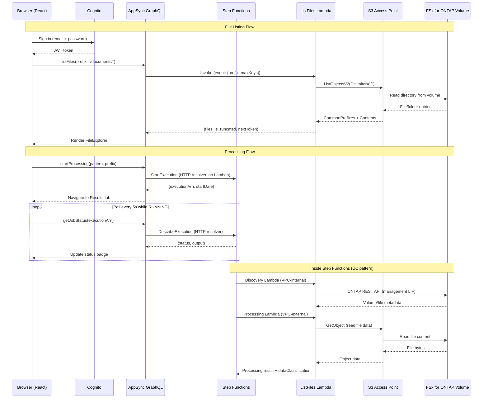

# FSx for ONTAP Portal de Archivos — Amplify Gen2

🌐 **Language / 言語**: [日本語](README.ja.md) | [English](README.md) | [한국어](README.ko.md) | [简体中文](README.zh-CN.md) | [繁體中文](README.zh-TW.md) | [Français](README.fr.md) | [Deutsch](README.de.md) | Español

Portal de archivos basado en web para explorar, procesar y visualizar resultados en volúmenes FSx for ONTAP a través de S3 Access Points.

## ¿Por qué construir un portal de archivos?

AWS proporciona bloques de construcción (S3 API, Cognito, AppSync) pero ningún servicio administrado integrado que ofrezca una experiencia de gestión de archivos tipo Box/Google Drive para datos NAS en FSx for ONTAP. Para ofrecer a los usuarios finales acceso a archivos desde el navegador, disparadores de procesamiento y visualización de resultados, necesita ensamblar su propia solución. Este proyecto es uno de esos ensamblajes usando Amplify Gen2.

Ver también: [Guía de selección de UI del portal de archivos (Amplify / Nextcloud / Custom)](../../docs/file-portal-amplify-gen2.md)

## Documentación

- **[Guía del usuario](../../docs/es/portal-user-guide.md)** — Guía del usuario final para el uso diario del portal (sin necesidad de conocimientos de despliegue)
- **[Primeros pasos](docs/GETTING-STARTED.md)** — Configuración, DemoMode, VPC Endpoints, checklist de producción
- **[Guía de implementación](docs/IMPLEMENTATION.md)** — Arquitectura, archivos de configuración, estructura de componentes, despliegue, registro de cambios
- **[Guía de demo para administradores](../../docs/en/admin-resource-management-demo.md)** — Escenarios de demo E2E de gestión de recursos + ARP/AI
- **[Guía de demo AI Agent](docs/ai-agent-demo-guide.en.md)** — AI Agent Chat, búsqueda semántica, guardrails, HITL
- **[Índice de diagramas de arquitectura](../../docs/architecture-diagrams.en.md)** — las 13 figuras (tema claro / tema oscuro)

## Funcionalidades principales

| Funcionalidad | Descripción |
|---------|-------------|
| **Storage Dashboard** | Resumen de salud en 4 tarjetas (capacidad, amenazas ARP, snapshots bloqueados, eficiencia) — página de inicio del admin |
| **Welcome Onboarding** | Tour guiado de 3 pasos para usuarios nuevos (explorar → AI → protección) |
| **ARP/AI Incident Lifecycle** | Seguimiento de estado: Detected → Contained → Investigating → Resolved |
| **S3 Object Lock Management** | Visualización de estado + configuración de retención para buckets de salida |
| **EMS Event Viewer** | Eventos de alerta/error de ONTAP desde el Event Management System |
| **PHI Guardrail** | Bloqueo del procesamiento AI para rutas /dicom/, /phi/, /pii/ |
| **SMB Encryption Toggle** | ON/OFF para cifrado SMB 3.0 en tránsito con advertencia de compatibilidad de cliente |
| **Export Policy CRUD** | Creación/eliminación de políticas (no solo reglas) |
| **VolumeSelector Search** | Filtro wildcard del lado del servidor + debounce de 300ms para entornos grandes |
| **Tamperproof Lock** | Formulario de bloqueo en línea con preajustes de retención FISC/SOX/HIPAA |
| **8-Language i18n** | JA/EN/KO/ZH-CN/ZH-TW/FR/DE/ES con cambio instantáneo en tiempo de ejecución |
| **AI Agent Chat** | Operaciones de archivos en lenguaje natural vía Bedrock Converse + tool_use (3 modos: KB/Agent/Multi) |
| **Multimodal Input** | Carga de imágenes arrastrando y soltando + análisis Bedrock Vision API |
| **Chat History** | Sesiones persistidas en DynamoDB con guardado y restauración automáticos |
| **Agent Directory** | Registro de agentes personalizados con formulario de creación, filtro por categoría y compartición |
| **Multi-Agent Teams** | Asistente de equipo con asignación de roles (Supervisor/Collaborator/Reviewer) |
| **KB Smart Routing** | Filtrado de alcance de búsqueda KB basado en grupos para control de acceso multi-tenant |
| **Admin Feature Gates** | Funcionalidades AI deshabilitadas por defecto, activables por función desde el panel admin |

## Arquitectura


*Figura: arquitectura del portal Amplify Gen2 — las funciones Lambda fuera de la VPC leen y escriben el volumen de FSx for ONTAP a través del S3 Access Point*

> La figura anterior usa el tema claro (fondo blanco). Si prefiere el modo oscuro, utilice la [versión con tema oscuro](../../docs/images/amplify-vpc-split-en-dark.svg). El [índice de diagramas de arquitectura](../../docs/architecture-diagrams.en.md) recoge las 13 figuras con enlaces claro y oscuro.

La misma arquitectura en texto:

```
┌──────────────────────────────────────────────────────────┐
│  Amplify Gen2                                            │
│  ┌──────────┐  ┌─────────────────────────────────────┐   │
│  │ Cognito  │  │ AppSync GraphQL API                 │   │
│  │ Auth     │  │  startProcessing → Step Functions   │   │
│  │ +MFA     │  │  getJobStatus → Step Functions      │   │
│  │ +SAML    │  │  listFiles → Lambda → S3 AP         │   │
│  └──────────┘  └──────────────┬──────────────────────┘   │
│                               │                          │
│  ┌─────────────────────────────────────────────────────┐ │
│  │ CDK (in data stack)                                 │ │
│  │  - HTTP Data Source → states.<region>.amazonaws.com │ │
│  │  - Lambda Data Source → ListFiles (Python 3.13)     │ │
│  └─────────────────────────────────────────────────────┘ │
└──────────────────────────────────────────────────────────┘
          │                              │
          ▼                              ▼
┌──────────────────┐          ┌─────────────────────────┐
│ Step Functions   │          │ FSx for ONTAP           │
│ (UC pattern or   │          │ S3 Access Point         │
│  test workflow)  │          │ (Internet-origin)       │
└──────────────────┘          └─────────────────────────┘
```

### Flujo de solicitudes (Diagrama de secuencia)



---

## UI del Portal — Diseño de la barra lateral (17 secciones)


*Barra lateral izquierda: navegación agrupada. Centro: contenido de la sección activa. Derecha: asistente AI (al seleccionar archivo).*

| Grupo | Sección | Propósito |
|-------|---------|---------|
| **Browse** | All Files | Explorar, ordenar, filtrar, selección múltiple, previsualizar, AI Q&A, enlaces compartidos, acceso QR |
| | Favorites | Archivos fijados (DynamoDB, por usuario) |
| | Recent | Archivos accedidos recientemente |
| | Folder Watch | Prefijos vigilados y eventos de archivo recibidos (interruptor de admin) |
| | Upload | Arrastrar y soltar vía Storage Browser for S3 |
| **AI & Processing** | AI Processing | Disparar flujos de trabajo AI/ML (Step Functions) |
| | AI Chat | Agente con herramientas sobre sus archivos, o ejecución de un agente o equipo guardado |
| | Search | Búsqueda semántica en todo el volumen |
| | Job History | Ejecuciones pasadas (DynamoDB, ámbito del propietario) |
| | Analytics | SQL Athena sobre Glue Data Catalog |
| | Agent Directory | Ejecutar, editar o compartir una definición de agente guardada |
| **Data Protection** | Snapshots | Lista de snapshots ONTAP + restauración FlexClone |
| | Lock | SnapLock (WORM) + estado de S3 Object Lock |
| | ARP/AI | Estado de Autonomous Ransomware Protection |
| **Admin** | Resource Management | Volúmenes, recursos compartidos, exportaciones, cuotas, QoS, SnapMirror (solo storage-admin) |
| | Version Diff | Comparación lado a lado de archivos entre snapshots |
| | Audit Trail | Eventos de datos S3 de CloudTrail (quién/cuándo/qué) |


*AI Processing: seleccionar patrón + ruta de entrada → enviar trabajo a Step Functions*


*ARP/AI: estado de detección de ransomware, conteo de alertas, inventario de snapshots automáticos*

### Funcionalidades adicionales

| Funcionalidad | Descripción |
|---------|-------------|
| **My Files (enrutamiento por grupo)** | Grupo Cognito → S3 AP diferente por equipo |
| **Guardrail CONFIDENTIAL** | Bloquea procesamiento AI para archivos clasificados (CUI/CONFIDENTIAL) |
| **Badges de metadatos AI** | Etiquetas de clasificación en línea, tags de Rekognition, conteo de entidades |
| **Acceso por código QR** | URL prefirmada → QR PNG para tablets OT/manufactura |
| **Compartición por URL prefirmada** | Enlaces compartidos con TTL configurable (5min–1h) |
| **Cumplimiento cdk-nag** | AwsSolutionsChecks se ejecuta en CI con `CDK_NAG=1` (no en el despliegue) |
| **UI de respaldo** | Panel informativo cuando ONTAP no está conectado (sin pantalla blanca) |

> **Guía detallada de secciones**: [docs/portal-tabs-guide.en.md](docs/portal-tabs-guide.en.md)

---

## Requisitos previos

| Requisito | Versión / Notas |
|---|---|
| Node.js | 18.17+ (requerido por Amplify Gen2) |
| AWS CLI | v2 configurado con credenciales |
| Cuenta AWS | Permisos para Amplify, Cognito, AppSync, Lambda, Step Functions |
| SO | macOS o Linux (Windows: usar WSL2 o ejecutar scripts npm directamente) |
| (Opcional) FSx for ONTAP | Con S3 AP **Internet-origin** adjunto (VPC-origin NO soportado por este portal) |
| (Opcional) Patrón UC desplegado | Para integración con Step Functions |

> ⚠️ **Los recursos del sandbox persisten hasta que se eliminen explícitamente.** Después de las pruebas, siempre ejecute `make sandbox-delete` para evitar dejar recursos AWS huérfanos (Cognito User Pool, AppSync API, Lambda). Ver [Limpieza](#limpieza).

---

## Inicio rápido (5 minutos)

> **Tiempos**: La configuración inicial toma ~15 minutos en total (npm install ~2min + CDK bootstrap + despliegue sandbox ~10-13min). Las iteraciones posteriores son mucho más rápidas (~30s para cambios de código Lambda, ~3min para cambios de infraestructura).

> **Multi-desarrollador**: Cada desarrollador obtiene un sandbox separado (identificado por nombre de usuario del SO). Múltiples miembros del equipo pueden trabajar en la misma cuenta AWS sin conflictos. Use `npx ampx sandbox --identifier <nombre>` para personalizar.

```bash
# 1. Instalar dependencias
make install

# 2. Crear su configuración (REQUERIDO antes de build/sandbox)
cp amplify/portal-config.example.ts amplify/portal-config.ts
# Editar portal-config.ts — como mínimo establezca su región (ej. us-east-1 para EE.UU., ap-northeast-1 para Japón)
# ⚠️ Sin este archivo, `make sandbox` y `npx tsc` fallarán con "Cannot find module './portal-config'"

# 3. Desplegar backend en sandbox personal (~3-5 min primera vez, ~30s incremental)
make sandbox
# ⚠️ `npm run build` no puede ejecutarse antes de este paso: src/main.tsx
#    importa ../amplify_outputs.json, que genera el sandbox y excluye
#    .gitignore. En un clon limpio, la compilación falla con
#    "[UNRESOLVED_IMPORT] Could not resolve '../amplify_outputs.json'".

# 4. En otro terminal, iniciar el servidor de desarrollo
make dev

# 5. Abrir http://localhost:5173 en su navegador
#    Registrarse con email → verificar código (o usar CLI: ver abajo) → iniciar sesión
```

### Verificación del primer usuario (atajo CLI)

Cognito envía un email de verificación, pero para cuentas de prueba puede confirmar vía CLI:

```bash
# Reemplace con su User Pool ID de amplify_outputs.json
aws cognito-idp admin-confirm-sign-up \
  --user-pool-id <USER_POOL_ID> \
  --username "your-email@example.com" \
  --region ap-northeast-1
```

---

## Configuración

Todos los parámetros específicos del entorno están en `amplify/portal-config.ts`.

### Configuración inicial

```bash
cp amplify/portal-config.example.ts amplify/portal-config.ts
```

Editar `portal-config.ts`:

| Parámetro | Requerido | Ejemplo | Descripción |
|---|---|---|---|
| `region` | Sí | `"ap-northeast-1"` | Región AWS para Step Functions y S3 AP |
| `s3ApAlias` | No | `"myap-abc123-s3alias"` | Alias S3 AP o nombre de bucket. Vacío = "Sin archivos" |
| `stateMachineArn` | No | `"arn:aws:states:..."` | ARN de Step Functions para procesamiento |
| `stateMachineResourceScope` | No | `"*"` | Alcance IAM (usar ARN específico en producción) |
| `s3ApResourceArns` | No | `["arn:aws:s3:..."]` | Alcance IAM para S3 AP (restringir en producción) |
| `groupApMapping` | No | `{"eng": "ap-eng-xxx"}` | Mapeo grupo Cognito → alias S3 AP (My Files) |
| `bedrockKbId` | No | `"KB123ABC"` | ID de Bedrock Knowledge Base (búsqueda de texto completo) |

### Override por variables de entorno

En lugar de editar el archivo, puede establecer variables de entorno:

```bash
export AMPLIFY_PORTAL_REGION=ap-northeast-1
export AMPLIFY_PORTAL_S3AP_ALIAS=myap-abc123-s3alias
export AMPLIFY_PORTAL_SFN_ARN=arn:aws:states:ap-northeast-1:123456789012:stateMachine:uc1-workflow
export AMPLIFY_PORTAL_GROUP_AP_MAPPING='{"engineering":"ap-eng-xxx-s3alias","legal":"ap-legal-xxx-s3alias"}'
export AMPLIFY_PORTAL_BEDROCK_KB_ID=KB123ABC
```

---

## Guía de despliegue

### Ruta rápida de demo (La más rápida)

```bash
make install
cp amplify/portal-config.example.ts amplify/portal-config.ts
make sfn-test-create   # Crea un SFn de prueba — anotar el ARN en la salida
# Editar portal-config.ts: pegar el ARN en stateMachineArn
# Editar amplify/data/resolvers/start-processing.js: pegar el ARN (línea 6)
make sandbox
make dev
```

> **Sincronización de ARN en dos lugares**: El ARN de la máquina de estado debe establecerse en `portal-config.ts` (para alcance IAM) y `start-processing.js` (para invocación en tiempo de ejecución). Esta es una limitación conocida de los resolvers APPSYNC_JS que no pueden leer parámetros CDK en tiempo de ejecución. Ver [Trampas conocidas #6](#6-configuración-de-arn-en-dos-lugares).

### DemoMode (Sin FSx for ONTAP)

Para desarrollo sin FSx for ONTAP:

1. Dejar `s3ApAlias` vacío (la pestaña de Archivos muestra "Sin archivos") o establecer un nombre de bucket S3 regular
2. Crear una máquina de estado Step Functions de prueba: `make sfn-test-create`
3. Pegar el ARN devuelto en `portal-config.ts`
4. Redesplegar: `make sandbox`

### Conexión con FSx for ONTAP S3 Access Point

1. Crear un S3 AP adjunto a su volumen FSx for ONTAP (Internet-origin recomendado)
2. Anotar el alias del AP desde la Consola AWS → FSx → S3 Access Points
3. Establecer `s3ApAlias` en `portal-config.ts`
4. Redesplegar: `make sandbox`

> **Nota**: El Lambda ListFiles se ejecuta fuera de VPC (sin VpcConfig). Esto es intencional — los S3 AP Internet-origin son accesibles sin ubicación VPC. Si usa un AP VPC-origin, debe agregar configuración VPC al Lambda.

> **Pestaña Upload**: Storage Browser usa credenciales de Cognito Identity Pool para llamar a la API S3 directamente desde el navegador. Los permisos IAM requeridos se aprovisionan automáticamente por `backend.ts` (no se necesita configuración IAM manual). El alias llega al navegador a través de `amplify_outputs.json`, que `npx ampx sandbox` genera desde `portal-config.ts`, por lo que se define en un solo lugar.

> **Flujo de trabajo de Upload**: Seleccionar Location → clic en alias S3 AP → navegación de carpetas → seleccionar archivo para previsualización/descarga, o arrastrar y soltar para subir. Los archivos subidos son accesibles inmediatamente vía NFS/SMB (ONTAP strong consistency).

> **Nota de throughput**: Las operaciones S3 AP comparten la capacidad de throughput de FSx for ONTAP con las cargas de trabajo NFS/SMB. Para planificación de usuarios concurrentes, ver [Planificación de throughput y capacidad](../../docs/file-portal-amplify-gen2.md#スループットと容量計画).

> **Nota de rendimiento**: El Lambda ListFiles típicamente responde en 100-300ms para directorios con < 100 objetos. Para directorios con 1000 objetos (máximo por página), espere 300-800ms. El Lambda tiene un timeout de 30 segundos como red de seguridad, pero la operación normal está muy por debajo de 1 segundo.

### Conexión con un patrón UC desplegado

Después de desplegar un patrón UC (ej. `make deploy-uc1` desde la raíz del repo):

1. Anotar el ARN de la State Machine desde las salidas de CloudFormation
2. Establecer `stateMachineArn` en `portal-config.ts`
3. Actualizar el resolver `start-processing.js` con el ARN
4. Redesplegar: `make sandbox`

---

## Trampas conocidas (Lecciones aprendidas)

Problemas descubiertos durante la verificación que le ahorran tiempo de depuración:

### 1. Limitaciones de resolvers APPSYNC_JS

Los resolvers JavaScript de AppSync (runtime APPSYNC_JS) tienen restricciones significativas:

| ❌ No permitido | ✅ Usar en su lugar |
|---|---|
| `new Date()` | `util.time.nowISO8601()` o devolver epoch, parsear en frontend |
| Template literals (`` `${x}` ``) | Concatenación de strings (`"a" + b + "c"`) |
| `async/await` | Solo síncrono |
| Constructores globales (`String()`, `Number()`) | Valores directos |

### 2. Enlace de Data Source cross-stack

Las fuentes de datos (HTTP, Lambda) **deben** agregarse al mismo stack CDK que la API AppSync. Si usa `backend.createStack()` para fuentes de datos, los resolvers fallarán con "Data source not found" porque referencian un stack CloudFormation diferente.

**Solución**: Usar `Stack.of(api)` para obtener el stack de datos, y agregar todas las fuentes de datos allí.

### 3. Step Functions Epoch segundos

`DescribeExecution` devuelve `startDate` y `stopDate` como epoch Unix **segundos** (no milisegundos, no ISO 8601). El resolver los devuelve como strings; el frontend multiplica por 1000 para JavaScript `Date`.

### 4. Permisos IAM para S3 Buckets vs S3 Access Points

La política IAM del Lambda usa `arn:aws:s3:*:*:accesspoint/*` que cubre S3 Access Points. Si usa un **bucket S3 regular** para pruebas de DemoMode, necesita agregar permisos en formato ARN de bucket:

```bash
# Temporal: agregar vía CLI para pruebas
aws iam put-role-policy --role-name <LAMBDA_ROLE_NAME> \
  --policy-name S3BucketTestAccess \
  --policy-document '{"Version":"2012-10-17","Statement":[{"Effect":"Allow","Action":["s3:ListBucket","s3:GetObject"],"Resource":["arn:aws:s3:::<BUCKET>","arn:aws:s3:::<BUCKET>/*"]}]}'
```

O actualizar `s3ApResourceArns` en `portal-config.ts` para incluir el ARN del bucket.

### 5. Email de verificación de Cognito

Las cuentas de prueba con direcciones de email inexistentes no recibirán códigos de verificación. Use el atajo CLI:

```bash
aws cognito-idp admin-confirm-sign-up \
  --user-pool-id <USER_POOL_ID> \
  --username "test@example.com" \
  --region <REGION>
```

### 6. Configuración de ARN en dos lugares

El ARN de la máquina de estado Step Functions debe configurarse en **dos lugares**:

1. `amplify/portal-config.ts` → `stateMachineArn` (usado para alcance de política IAM en CDK)
2. `amplify/data/resolvers/start-processing.js` → `const stateMachineArn = "..."` (usado en tiempo de ejecución por el resolver AppSync)

Esta duplicación existe porque los resolvers APPSYNC_JS no pueden leer parámetros CDK ni variables de entorno en tiempo de ejecución. Son JavaScript estático evaluado por el runtime integrado de AppSync.

**Olvidar actualizar uno de los dos** es el problema de despliegue más común.

### 7. El ARN de State Machine en el resolver no es un secreto

El ARN codificado en `start-processing.js` es visible en el código fuente. Esto es aceptable porque:
- Los ARN no son secretos — identifican recursos pero no otorgan acceso
- Las políticas IAM (no los ARN) controlan quién puede invocar una máquina de estado
- La API AppSync requiere autenticación Cognito antes de ejecutar cualquier resolver

Sin embargo, el ARN es **específico del entorno** — siempre actualizarlo al cambiar entre dev/staging/prod.

---

## Comandos de desarrollo

| Comando | Descripción |
|---|---|
| `make install` | Instalar dependencias npm |
| `make dev` | Iniciar servidor de desarrollo Vite (solo frontend) |
| `make sandbox` | Desplegar/actualizar backend Amplify (sandbox personal) |
| `make sandbox-delete` | Eliminar todos los recursos del sandbox |
| `make sandbox-status` | Mostrar estado del stack CloudFormation |
| `make sfn-test-create` | Crear máquina de estado Step Functions de prueba |
| `make sfn-test-delete` | Eliminar máquina de estado de prueba + rol IAM |
| `make test` | Ejecutar vitest (ejecución única) |
| `make typecheck` | Validación de tipos TypeScript |
| `make lint` | Verificación ESLint |
| `make build` | Build de producción |
| `make clean` | Eliminar node_modules, dist, .amplify |
| `make cleanup-all` | Eliminar sandbox + SFn de prueba + datos S3 de prueba |

---

## Tiempos de despliegue (Verificado 2026-07-20)

| Paso | Primera vez | Siguientes |
|------|-----------|-----------|
| `npm install` | ~60s | 0s (en caché) |
| `make sandbox` | 4-5 min (CDK bootstrap + stack completo) | 20-40s (incremental) |
| `make sandbox-delete` | ~2 min | — |
| Creación de usuario Cognito (CLI) | 2s | — |
| `make dev` → navegador | 2s | 2s |

**Tiempo total de primera configuración**: ~15 minutos desde `git clone` hasta portal funcionando (CDK bootstrap + despliegue inicial). Cambios posteriores: ~7 segundos solo código, ~3 minutos para cambios de infraestructura.

### Despliegue en producción

Para producción (Amplify Hosting + dominio personalizado), ver la [Guía de producción de Amplify Hosting](../../docs/en/amplify-hosting-production-guide.md).

Diferencias clave con el sandbox:
- CI/CD basado en ramas (push a `main` → despliegue automático)
- Dominio personalizado con certificado ACM
- Integración WAF para protección DDoS
- SAML/OIDC en lugar de autenticación solo por email

---

## Trampas conocidas — Aprendizajes adicionales (2026-07-20)

### 8. El alias de la pestaña Upload viene de los outputs generados

Storage Browser se ejecuta del lado del cliente y llama a S3 directamente, así que el navegador necesita el alias. Antes lo leía de `src/portal-settings.ts`, un archivo versionado — allí había un alias de ejemplo, ese alias de ejemplo era el que se usaba, y todas las cargas fallaban contra un access point que no existe. Ahora `amplify/backend.ts` publica el alias con `backend.addOutput({ custom: ... })` en `amplify_outputs.json`, que lee `src/lib/portalOutputs.ts`. `amplify/portal-config.ts` es el único lugar donde se define.

Si la pestaña Upload indica que no está configurada, defina `s3ApAlias` en `amplify/portal-config.ts` y vuelva a ejecutar `npx ampx sandbox`. `amplify_outputs.json` está en .gitignore, así que un clon nuevo no tiene alias.

### 9. ~~El IAM del Cognito Identity Pool debe permitir acceso S3 AP~~ (configurado automáticamente)

> **Resuelto**: `backend.ts` ahora otorga automáticamente permisos de acceso S3 AP al rol autenticado del Cognito Identity Pool vía CDK. No se necesita `aws iam put-role-policy` manual.

La siguiente parte de `backend.ts` configura automáticamente:
```typescript
authenticatedRole.addToPrincipalPolicy(
  new iam.PolicyStatement({
    sid: "StorageBrowserS3APAccess",
    actions: ["s3:GetObject", "s3:PutObject", "s3:DeleteObject", "s3:ListBucket", "s3:GetBucketLocation"],
    resources: config.s3ApResourceArns,
  })
);
```

Si la pestaña Upload muestra "AccessDenied", confirme que `s3ApResourceArns` en `portal-config.ts` contiene el ARN S3 AP correcto. El valor predeterminado del sandbox (`arn:aws:s3:*:*:accesspoint/*`) permite acceso a todos los APs.

> **Modo de autenticación de Storage Browser**: Storage Browser usa el **modo de autenticación directa** (`getLocationCredentials` + `listLocations`), no `createManagedAuthAdapter` (que requiere S3 Access Grants). No se necesita configuración de S3 Access Grants.

### 10. La eliminación del sandbox es completa

`make sandbox-delete` elimina TODOS los recursos (Cognito User Pool, AppSync API, funciones Lambda, tablas DynamoDB, roles IAM). Las cuentas de usuario, historial de trabajos y endpoints API se eliminan permanentemente. No existe opción de limpieza parcial.

### 11. Sandboxes multi-desarrollador

Cada desarrollador obtiene un sandbox aislado identificado por el nombre de usuario del SO. Ejecutar `make sandbox` en diferentes máquinas (o diferentes nombres de usuario) crea stacks separados:

```
amplify-fsxns3apamplifyportal-dev1-sandbox-0123456789  ← desarrollador 1
amplify-fsxns3apamplifyportal-dev2-sandbox-9876543210   ← desarrollador 2
```

Comparten la misma cuenta AWS pero no interfieren. Use `npx ampx sandbox --identifier nombre-personalizado` para nombrado explícito.

---

## Estructura del proyecto

```
amplify-portal/
├── amplify/
│   ├── backend.ts                  # Punto de entrada — importa config, crea data sources + Lambda
│   ├── portal-config.ts            # SU configuración (git-ignored)
│   ├── portal-config.example.ts    # Plantilla — copiar y personalizar
│   ├── auth/resource.ts            # Cognito (email + MFA + placeholders SAML/OIDC)
│   ├── data/
│   │   ├── resource.ts             # Schema AppSync (queries, mutations, tipos personalizados)
│   │   └── resolvers/              # Resolvers APPSYNC_JS (7 archivos)
│   └── custom/
│       └── step-functions.ts       # (Referencia — movido a backend.ts)
├── src/
│   ├── main.tsx                    # Amplify configure + wrapper Authenticator
│   ├── App.tsx                     # Shell de 6 pestañas (Files/Upload/Process/Results/History/Analytics)
│   ├── portal-settings.ts         # Interruptores de interfaz (sin valores de entorno)
│   └── components/                 # Componentes React (FileExplorer, AiPanel, etc.)
├── functions/
│   ├── notification-bridge/handler.py  # EventBridge → DynamoDB (eventos FPolicy + SFTP)
│   └── job-status-updater/handler.py   # Step Functions → DynamoDB (push WebSocket)
├── monitoring/
│   └── dashboard.ts               # Construct CDK CloudWatch Dashboard
├── docs/
│   ├── portal-tabs-guide.md       # Guía detallada de 17 secciones (4 grupos) con capturas de pantalla
│   └── screenshots/               # Capturas de pantalla UI del portal
├── tests/
│   └── components/App.test.tsx     # Tests de renderizado de pestañas + navegación
├── amplify_outputs.json            # Auto-generado por sandbox (git-ignored)
├── package.json
├── Makefile                        # Todos los comandos de workflow
└── README.md
```

---

## Limpieza

> ⚠️ **Importante**: Los recursos del sandbox NO se eliminan automáticamente. Persisten en su cuenta AWS hasta que los elimine explícitamente.

### Eliminar sandbox (recursos de desarrollo)

```bash
make sandbox-delete
# O manualmente:
npx ampx sandbox delete
```

Elimina: Cognito User Pool, AppSync API, función Lambda, roles IAM.

### Eliminar recursos de prueba

```bash
make sfn-test-delete    # Eliminar máquina de estado Step Functions de prueba
make cleanup-all        # Limpieza completa (sandbox + SFn + datos S3 de prueba)
```

### Costos estimados (sandbox)

| Recurso | Costo mensual (inactivo) |
|---|---|
| Cognito User Pool | $0 (< 50K MAU gratis) |
| AppSync | $0 (< 250K solicitudes gratis) |
| Lambda | $0 (< 1M solicitudes gratis) |
| **Total (sandbox inactivo)** | **~$0** |

---

## Consideraciones de producción

Para despliegue más allá del sandbox:

### Autenticación

Descomentar la sección SAML u OIDC en `amplify/auth/resource.ts` para SSO empresarial.

### Mínimo privilegio IAM

> ⚠️ **Advertencia de seguridad**: El predeterminado `stateMachineResourceScope: "*"` otorga a la fuente de datos AppSync permiso para invocar **cualquier** máquina de estado en la cuenta. Esto es aceptable solo para sandbox personal. Para cualquier entorno compartido o de producción, restringir a un ARN o patrón específico.

En `portal-config.ts`, restringir:
- `stateMachineResourceScope` → ARN específico de máquina de estado o patrón (ej. `"arn:aws:states:ap-northeast-1:123456789012:stateMachine:uc*"`)
- `s3ApResourceArns` → ARN AP específico

### Pista de auditoría (CloudTrail)

Cuando el portal dispara Step Functions, CloudTrail registra el **rol de servicio AppSync** como invocador — no el usuario final. Para trazabilidad de auditoría, el resolver `start-processing.js` integra el campo `userId` en la entrada de ejecución de Step Functions. Consulte el historial de ejecución para mapear acciones a usuarios.

### Hosting

Desplegar frontend vía Amplify Hosting (CI/CD desde Git) o construir y alojar en CloudFront + S3:

```bash
make build
# Subir dist/ a S3 + CloudFront, o conectar repo Git a Amplify Hosting
```

### Monitoreo

Agregar alarmas CloudWatch para:
- AppSync: tasa de errores 4xx/5xx
- Lambda (ListFiles): conteo de errores, duración p99
- Step Functions: conteo de ejecuciones fallidas

Configurar retención de CloudWatch Logs para logs de solicitudes AppSync e historial de ejecución de Step Functions para cumplir requisitos de auditoría/cumplimiento.

### Control de acceso

El esqueleto actual permite a cualquier usuario autenticado consultar cualquier ARN de ejecución. Para producción, implementar autorización basada en propietario (almacenar mapeo ejecución → userId en DynamoDB).

> **Nota sobre visibilidad a nivel de archivo**: La autenticación Cognito del portal controla quién puede acceder a la API AppSync. Sin embargo, el control de acceso a nivel de archivo (qué archivos puede ver/modificar un usuario) está determinado por la **identidad del sistema de archivos** del S3 AP en el volumen ONTAP, no por los grupos Cognito. Si todos los usuarios del portal comparten el mismo S3 AP (misma identidad UNIX/Windows), ven los mismos archivos. Para aislamiento de archivos por usuario, crear S3 APs separados con diferentes identidades de sistema de archivos.

### Código Lambda inline

El Lambda ListFiles está definido inline (como string en `backend.ts`) por simplicidad. Para producción:
- Extraer a un archivo Python separado con manejo de errores y logging apropiados
- Agregar tests unitarios
- Considerar usar un Lambda Layer para dependencias compartidas

### Estabilidad de la API Amplify Gen2

Amplify Gen2 está evolucionando activamente. Fijar versiones de paquetes `@aws-amplify/*` y probar después de actualizaciones. Pueden ocurrir cambios que rompen compatibilidad en versiones menores durante el ciclo de vida temprano.

> **Consejo para demos en vivo**: Desplegar el sandbox de antemano (`make sandbox`) y solo ejecutar `make dev` durante la presentación. El despliegue del sandbox toma 3-5 minutos la primera vez.

---

## Documentación relacionada

- [Opciones UI del portal de archivos (Amplify / Nextcloud / Custom)](../../docs/file-portal-amplify-gen2.md)
- [Runbook de despliegue (EN)](../../docs/en/portal-deployment-runbook.md) | [JA](../../docs/ja/portal-deployment-runbook.md)
- [Guía de demo con capturas de pantalla (EN)](../../docs/en/portal-demo-guide.md) | [JA](../../docs/ja/portal-demo-guide.md)
- [Análisis de brechas SaaS y solicitudes de funcionalidades (JA)](../../docs/aws-feature-requests/file-portal-service-gap.md) | [EN](../../docs/aws-feature-requests/file-portal-service-gap.en.md)
- [Decisión de diseño de búsqueda de texto completo](../../.private/design-decisions/c4-fulltext-search-comparison.md) (gitignored — privado)
- [Hoja de ruta del portal (P0-P4)](../../.private/file-portal-roadmap.md) (gitignored — privado)
- [Configuración Quick Desktop MCP (AgentCore Gateway)](../../docs/quick-desktop-mcp-setup.md)
- [Configuración Nextcloud External Storage](../../docs/nextcloud-external-storage-s3ap.md)
- [Notas de compatibilidad S3AP](../../docs/s3ap-compatibility-notes.md)
- [Guía de modo demo](../../docs/demo-mode-guide.md)
- [Guía de demo Storage Browser](../../docs/en/storage-browser-demo-guide.md)

---

🌐 **Idioma**: [日本語](README.ja.md) | [English](README.md) | [한국어](README.ko.md) | [简体中文](README.zh-CN.md) | [繁體中文](README.zh-TW.md) | [Français](README.fr.md) | [Deutsch](README.de.md) | Español
