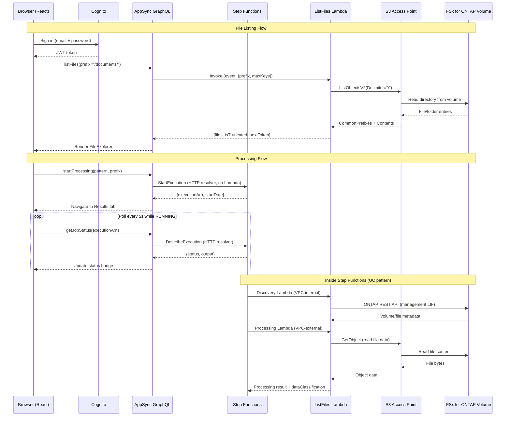
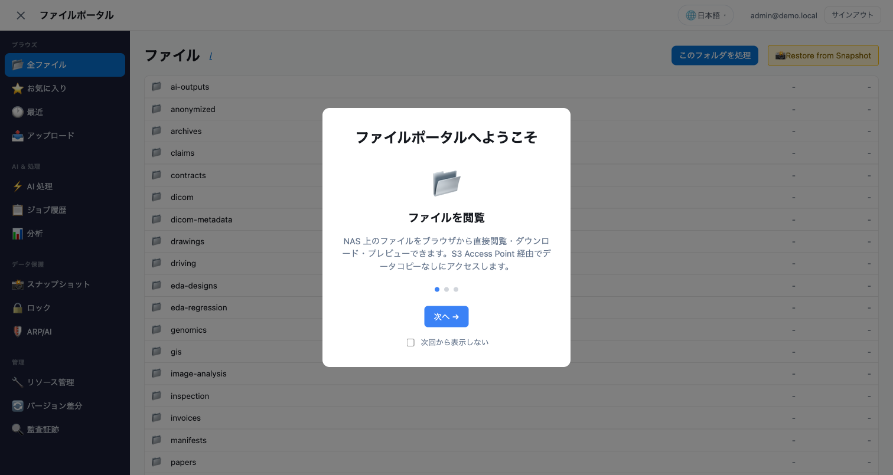
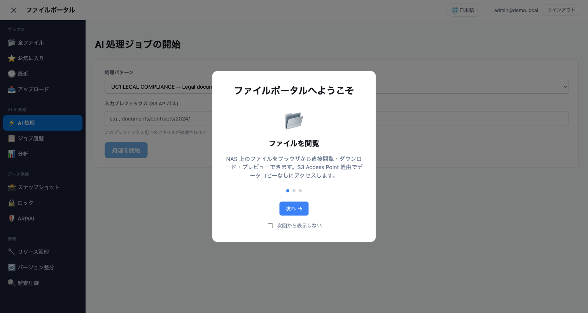
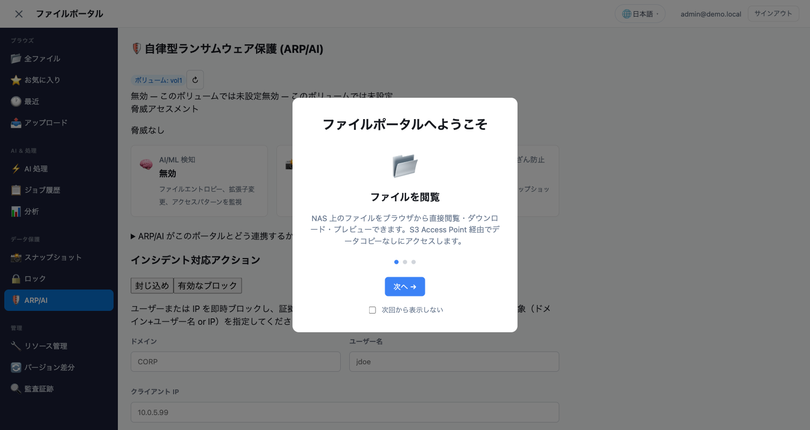

# FSx for ONTAP Portail de Fichiers — Amplify Gen2

🌐 **Language / 言語**: [日本語](README.ja.md) | [English](README.md) | [한국어](README.ko.md) | [简体中文](README.zh-CN.md) | [繁體中文](README.zh-TW.md) | Français | [Deutsch](README.de.md) | [Español](README.es.md)

Portail de fichiers Web pour parcourir, traiter et visualiser les résultats sur les volumes FSx for ONTAP via les S3 Access Points.

## Pourquoi construire un portail de fichiers ?

AWS fournit des blocs de construction (S3 API, Cognito, AppSync) mais aucun service managé intégré offrant une expérience de gestion de fichiers type Box/Google Drive pour les données NAS sur FSx for ONTAP. Pour offrir aux utilisateurs finaux un accès fichier via navigateur, des déclencheurs de traitement et la consultation des résultats, vous devez assembler votre propre solution. Ce projet est un tel assemblage utilisant Amplify Gen2.

Voir aussi : [Guide de sélection d'UI du portail de fichiers (Amplify / Nextcloud / Custom)](../../docs/file-portal-amplify-gen2.md)

## Documentation

- **[Guide utilisateur](../../docs/fr/portal-user-guide.md)** — Guide de l'utilisateur final pour l'utilisation quotidienne du portail (aucune connaissance de déploiement requise)
- **[Démarrage rapide](docs/GETTING-STARTED.md)** — Configuration, DemoMode, VPC Endpoints, checklist de production
- **[Guide d'implémentation](docs/IMPLEMENTATION.md)** — Architecture, fichiers de configuration, structure des composants, déploiement, journal des modifications
- **[Guide démo administrateur](../../docs/en/admin-resource-management-demo.md)** — Scénarios démo E2E de gestion des ressources + ARP/AI
- **[Guide démo AI Agent](docs/ai-agent-demo-guide.en.md)** — AI Agent Chat, recherche sémantique, garde-fous, HITL
- **[Index des schémas d'architecture](../../docs/architecture-diagrams.en.md)** — les 13 figures (thème clair / thème sombre)

## Fonctionnalités principales

| Fonctionnalité | Description |
|---------|-------------|
| **Storage Dashboard** | Vue d'ensemble santé en 4 cartes (capacité, menaces ARP, snapshots verrouillés, efficacité) — page d'accueil admin |
| **Welcome Onboarding** | Visite guidée en 3 étapes pour les nouveaux utilisateurs (parcourir → AI → protection) |
| **ARP/AI Incident Lifecycle** | Suivi d'état : Detected → Contained → Investigating → Resolved |
| **S3 Object Lock Management** | Affichage du statut + configuration de rétention pour les buckets de sortie |
| **EMS Event Viewer** | Événements d'alerte/erreur ONTAP depuis l'Event Management System |
| **PHI Guardrail** | Blocage du traitement AI pour les chemins /dicom/, /phi/, /pii/ |
| **SMB Encryption Toggle** | ON/OFF du chiffrement SMB 3.0 en transit avec avertissement de compatibilité client |
| **Export Policy CRUD** | Création/suppression de politiques (pas seulement de règles) |
| **VolumeSelector Search** | Filtre wildcard côté serveur + debounce 300ms pour les grands environnements |
| **Tamperproof Lock** | Formulaire de verrouillage en ligne avec préréglages de rétention FISC/SOX/HIPAA |
| **8-Language i18n** | JA/EN/KO/ZH-CN/ZH-TW/FR/DE/ES avec commutation instantanée à l'exécution |
| **AI Agent Chat** | Opérations fichier en langage naturel via Bedrock Converse + tool_use (3 modes : KB/Agent/Multi) |
| **Multimodal Input** | Upload d'images par glisser-déposer + analyse Bedrock Vision API |
| **Chat History** | Sessions persistées dans DynamoDB avec sauvegarde et restauration automatiques |
| **Agent Directory** | Registre d'agents personnalisés avec formulaire de création, filtre par catégorie et partage |
| **Multi-Agent Teams** | Assistant d'équipe avec attribution de rôles (Supervisor/Collaborator/Reviewer) |
| **KB Smart Routing** | Filtrage de portée de recherche KB basé sur les groupes pour le contrôle d'accès multi-tenant |
| **Admin Feature Gates** | Fonctionnalités AI désactivées par défaut, basculées par fonctionnalité depuis le panneau admin |

## Architecture


*Figure : architecture du portail Amplify Gen2 — les fonctions Lambda hors VPC lisent et écrivent le volume FSx for ONTAP via le S3 Access Point*

> La figure ci-dessus utilise le thème clair (fond blanc). Si vous préférez le mode sombre, utilisez la [version en thème sombre](../../docs/images/amplify-vpc-split-en-dark.svg). L'[index des schémas d'architecture](../../docs/architecture-diagrams.en.md) répertorie les 13 figures avec les liens clair et sombre.

La même architecture sous forme de texte :

```
┌──────────────────────────────────────────────────────────┐
│  Amplify Gen2                                            │
│  ┌──────────┐  ┌─────────────────────────────────────┐   │
│  │ Cognito  │  │ AppSync GraphQL API                 │   │
│  │ Auth     │  │  startProcessing → Step Functions   │   │
│  │ +MFA     │  │  getJobStatus → Step Functions      │   │
│  │ +SAML    │  │  listFiles → Lambda → S3 AP         │   │
│  └──────────┘  └──────────────┬──────────────────────┘   │
│                               │                          │
│  ┌─────────────────────────────────────────────────────┐ │
│  │ CDK (in data stack)                                 │ │
│  │  - HTTP Data Source → states.<region>.amazonaws.com │ │
│  │  - Lambda Data Source → ListFiles (Python 3.13)     │ │
│  └─────────────────────────────────────────────────────┘ │
└──────────────────────────────────────────────────────────┘
          │                              │
          ▼                              ▼
┌──────────────────┐          ┌─────────────────────────┐
│ Step Functions   │          │ FSx for ONTAP           │
│ (UC pattern or   │          │ S3 Access Point         │
│  test workflow)  │          │ (Internet-origin)       │
└──────────────────┘          └─────────────────────────┘
```

### Flux de requêtes (Diagramme de séquence)



---

## Interface du portail — Disposition de la barre latérale (17 sections)


*Barre latérale gauche : navigation groupée. Centre : contenu de la section active. Droite : assistant AI (lors de la sélection de fichier).*

| Groupe | Section | Objectif |
|-------|---------|---------|
| **Browse** | All Files | Parcourir, trier, filtrer, sélection multiple, prévisualiser, AI Q&A, liens de partage, accès QR |
| | Favorites | Fichiers épinglés (DynamoDB, par utilisateur) |
| | Recent | Fichiers récemment consultés |
| | Folder Watch | Préfixes surveillés et événements de fichiers reçus (bascule admin) |
| | Upload | Glisser-déposer via Storage Browser for S3 |
| **AI & Processing** | AI Processing | Déclencher les workflows AI/ML (Step Functions) |
| | AI Chat | Agent outillé sur vos fichiers, ou exécution d'un agent ou d'une équipe enregistrés |
| | Search | Recherche sémantique sur tout le volume |
| | Job History | Exécutions passées (DynamoDB, portée propriétaire) |
| | Analytics | SQL Athena sur Glue Data Catalog |
| | Agent Directory | Exécuter, modifier ou partager une définition d'agent enregistrée |
| **Data Protection** | Snapshots | Liste des snapshots ONTAP + restauration FlexClone |
| | Lock | SnapLock (WORM) + statut S3 Object Lock |
| | ARP/AI | Statut Autonomous Ransomware Protection |
| **Admin** | Resource Management | Volumes, partages, exports, quotas, QoS, SnapMirror (storage-admin uniquement) |
| | Version Diff | Comparaison côte à côte de fichiers entre snapshots |
| | Audit Trail | Événements de données S3 CloudTrail (qui/quand/quoi) |


*AI Processing : sélectionner le modèle + chemin d'entrée → soumettre le travail à Step Functions*


*ARP/AI : statut de détection de ransomware, nombre d'alertes, inventaire de snapshots automatiques*

### Fonctionnalités supplémentaires

| Fonctionnalité | Description |
|---------|-------------|
| **My Files (routage par groupe)** | Groupe Cognito → S3 AP différent par équipe |
| **Garde-fou CONFIDENTIAL** | Bloque le traitement AI pour les fichiers classifiés (CUI/CONFIDENTIAL) |
| **Badges métadonnées AI** | Étiquettes de classification en ligne, tags Rekognition, comptage d'entités |
| **Accès QR code** | URL présignée → QR PNG pour tablettes OT/fabrication |
| **Partage par URL présignée** | Liens de partage configurables en TTL (5min–1h) |
| **Conformité cdk-nag** | AwsSolutionsChecks exécuté en CI via `CDK_NAG=1` (pas au déploiement) |
| **UI de secours** | Panneau d'information gracieux quand ONTAP n'est pas connecté (pas d'écran blanc) |

> **Guide détaillé des sections** : [docs/portal-tabs-guide.en.md](docs/portal-tabs-guide.en.md)

---

## Prérequis

| Exigence | Version / Notes |
|---|---|
| Node.js | 18.17+ (requis par Amplify Gen2) |
| AWS CLI | v2 configuré avec des identifiants |
| Compte AWS | Permissions pour Amplify, Cognito, AppSync, Lambda, Step Functions |
| OS | macOS ou Linux (Windows : utiliser WSL2 ou exécuter les scripts npm directement) |
| (Optionnel) FSx for ONTAP | Avec S3 AP **Internet-origin** attaché (VPC-origin NON supporté par ce portail) |
| (Optionnel) UC pattern déployé | Pour l'intégration Step Functions |

> ⚠️ **Les ressources sandbox persistent jusqu'à suppression explicite.** Après les tests, exécutez toujours `make sandbox-delete` pour éviter de laisser des ressources AWS orphelines (Cognito User Pool, AppSync API, Lambda). Voir [Nettoyage](#nettoyage).

---

## Démarrage rapide (5 minutes)

> **Timing** : La première configuration prend environ 15 minutes au total (npm install ~2min + CDK bootstrap + déploiement sandbox ~10-13min). Les itérations suivantes sont beaucoup plus rapides (~30s pour les changements de code Lambda, ~3min pour les changements d'infrastructure).

> **Multi-développeur** : Chaque développeur obtient un sandbox séparé (identifié par le nom d'utilisateur OS). Plusieurs membres d'équipe peuvent travailler sur le même compte AWS sans conflits. Utilisez `npx ampx sandbox --identifier <nom>` pour personnaliser.

```bash
# 1. Installer les dépendances
make install

# 2. Créer votre configuration (REQUIS avant build/sandbox)
cp amplify/portal-config.example.ts amplify/portal-config.ts
# Éditer portal-config.ts — au minimum définir votre région (ex. us-east-1 pour les US, ap-northeast-1 pour le Japon)
# ⚠️ Sans ce fichier, `make sandbox` et `npx tsc` échoueront avec "Cannot find module './portal-config'"

# 3. Déployer le backend dans le sandbox personnel (~3-5 min la première fois, ~30s incrémental)
make sandbox
# ⚠️ `npm run build` ne peut pas s'exécuter avant cette étape : src/main.tsx
#    importe ../amplify_outputs.json, généré par le sandbox et exclu par
#    .gitignore. Sur un clone propre, la compilation échoue avec
#    "[UNRESOLVED_IMPORT] Could not resolve '../amplify_outputs.json'".

# 4. Dans un autre terminal, démarrer le serveur de développement
make dev

# 5. Ouvrir http://localhost:5173 dans votre navigateur
#    S'inscrire avec email → vérifier le code (ou utiliser CLI : voir ci-dessous) → se connecter
```

### Vérification du premier utilisateur (raccourci CLI)

Cognito envoie un email de vérification, mais pour les comptes de test vous pouvez confirmer via CLI :

```bash
# Remplacer par votre User Pool ID depuis amplify_outputs.json
aws cognito-idp admin-confirm-sign-up \
  --user-pool-id <USER_POOL_ID> \
  --username "your-email@example.com" \
  --region ap-northeast-1
```

---

## Configuration

Tous les paramètres spécifiques à l'environnement sont dans `amplify/portal-config.ts`.

### Mise en place

```bash
cp amplify/portal-config.example.ts amplify/portal-config.ts
```

Éditer `portal-config.ts` :

| Paramètre | Requis | Exemple | Description |
|---|---|---|---|
| `region` | Oui | `"ap-northeast-1"` | Région AWS pour Step Functions et S3 AP |
| `s3ApAlias` | Non | `"myap-abc123-s3alias"` | Alias S3 AP ou nom de bucket. Vide = "Pas de fichiers" |
| `stateMachineArn` | Non | `"arn:aws:states:..."` | ARN Step Functions pour le traitement |
| `stateMachineResourceScope` | Non | `"*"` | Portée IAM (utiliser un ARN spécifique en production) |
| `s3ApResourceArns` | Non | `["arn:aws:s3:..."]` | Portée IAM pour S3 AP (restreindre en production) |
| `groupApMapping` | Non | `{"eng": "ap-eng-xxx"}` | Mapping groupe Cognito → alias S3 AP (My Files) |
| `bedrockKbId` | Non | `"KB123ABC"` | ID Bedrock Knowledge Base (recherche plein texte) |

### Remplacement par variables d'environnement

Au lieu d'éditer le fichier, vous pouvez définir des variables d'environnement :

```bash
export AMPLIFY_PORTAL_REGION=ap-northeast-1
export AMPLIFY_PORTAL_S3AP_ALIAS=myap-abc123-s3alias
export AMPLIFY_PORTAL_SFN_ARN=arn:aws:states:ap-northeast-1:123456789012:stateMachine:uc1-workflow
export AMPLIFY_PORTAL_GROUP_AP_MAPPING='{"engineering":"ap-eng-xxx-s3alias","legal":"ap-legal-xxx-s3alias"}'
export AMPLIFY_PORTAL_BEDROCK_KB_ID=KB123ABC
```

---

## Guide de déploiement

### Chemin démo rapide (le plus rapide)

```bash
make install
cp amplify/portal-config.example.ts amplify/portal-config.ts
make sfn-test-create   # Crée un SFn de test — noter l'ARN dans la sortie
# Éditer portal-config.ts : coller l'ARN dans stateMachineArn
# Éditer amplify/data/resolvers/start-processing.js : coller l'ARN (ligne 6)
make sandbox
make dev
```

> **Synchronisation ARN en deux endroits** : L'ARN de la machine d'état doit être défini dans `portal-config.ts` (pour le cadrage IAM) et `start-processing.js` (pour l'invocation à l'exécution). C'est une limitation connue des résolveurs APPSYNC_JS qui ne peuvent pas lire les paramètres CDK à l'exécution. Voir [Pièges connus #6](#6-configuration-arn-en-deux-endroits).

### DemoMode (sans FSx for ONTAP)

Pour le développement sans FSx for ONTAP :

1. Laisser `s3ApAlias` vide (l'onglet Fichiers affiche "Pas de fichiers") ou définir un nom de bucket S3 ordinaire
2. Créer une machine d'état Step Functions de test : `make sfn-test-create`
3. Coller l'ARN retourné dans `portal-config.ts`
4. Redéployer : `make sandbox`

### Connexion à FSx for ONTAP S3 Access Point

1. Créer un S3 AP attaché à votre volume FSx for ONTAP (Internet-origin recommandé)
2. Noter l'alias AP depuis la Console AWS → FSx → S3 Access Points
3. Définir `s3ApAlias` dans `portal-config.ts`
4. Redéployer : `make sandbox`

> **Note** : Le Lambda ListFiles s'exécute hors VPC (pas de VpcConfig). C'est intentionnel — les S3 AP Internet-origin sont accessibles sans placement VPC. Si vous utilisez un AP VPC-origin, vous devez ajouter la configuration VPC au Lambda.

> **Onglet Upload** : Storage Browser utilise les identifiants Cognito Identity Pool pour appeler l'API S3 directement depuis le navigateur. Les permissions IAM requises sont automatiquement provisionnées par `backend.ts` (pas de configuration IAM manuelle nécessaire). L'alias parvient au navigateur via `amplify_outputs.json`, que `npx ampx sandbox` génère depuis `portal-config.ts` : il n'est donc défini qu'à un seul endroit.

> **Workflow onglet Upload** : Sélection de Location → cliquer sur l'alias S3 AP → navigation dans les dossiers → sélection de fichier pour prévisualisation/téléchargement, ou glisser-déposer pour upload. Les fichiers uploadés sont immédiatement accessibles via NFS/SMB (ONTAP strong consistency).

> **Note sur le débit** : Les opérations S3 AP partagent la capacité de débit FSx for ONTAP avec les charges de travail NFS/SMB. Pour la planification des utilisateurs concurrents, voir [Planification du débit et de la capacité](../../docs/file-portal-amplify-gen2.md#スループットと容量計画).

> **Note sur la performance** : Le Lambda ListFiles répond typiquement en 100-300ms pour les répertoires avec < 100 objets. Pour les répertoires avec 1000 objets (maximum page unique), compter 300-800ms. Le Lambda a un timeout de 30 secondes comme filet de sécurité, mais le fonctionnement normal est bien en dessous de 1 seconde.

### Connexion à un UC Pattern déployé

Après le déploiement d'un UC pattern (ex. `make deploy-uc1` depuis la racine du repo) :

1. Noter l'ARN de la State Machine depuis les sorties CloudFormation
2. Définir `stateMachineArn` dans `portal-config.ts`
3. Mettre à jour le résolveur `start-processing.js` avec l'ARN
4. Redéployer : `make sandbox`

---

## Pièges connus (Leçons apprises)

Problèmes découverts lors de la vérification qui vous font gagner du temps de débogage :

### 1. Limitations des résolveurs APPSYNC_JS

Les résolveurs JavaScript AppSync (runtime APPSYNC_JS) ont des restrictions importantes :

| ❌ Non autorisé | ✅ Utiliser à la place |
|---|---|
| `new Date()` | `util.time.nowISO8601()` ou retourner epoch, parser côté frontend |
| Template literals (`` `${x}` ``) | Concaténation de chaînes (`"a" + b + "c"`) |
| `async/await` | Synchrone uniquement |
| Constructeurs globaux (`String()`, `Number()`) | Valeurs directes |

### 2. Liaison de Data Source cross-stack

Les sources de données (HTTP, Lambda) **doivent** être ajoutées au même stack CDK que l'API AppSync. Si vous utilisez `backend.createStack()` pour les sources de données, les résolveurs échoueront avec "Data source not found" car ils référencent un stack CloudFormation différent.

**Solution** : Utiliser `Stack.of(api)` pour obtenir le stack de données, et y ajouter toutes les sources de données.

### 3. Step Functions Epoch secondes

`DescribeExecution` retourne `startDate` et `stopDate` en epoch Unix **secondes** (pas millisecondes, pas ISO 8601). Le résolveur les retourne en chaînes ; le frontend multiplie par 1000 pour JavaScript `Date`.

### 4. Permissions IAM pour S3 Buckets vs S3 Access Points

La politique IAM du Lambda utilise `arn:aws:s3:*:*:accesspoint/*` qui couvre les S3 Access Points. Si vous utilisez un **bucket S3 ordinaire** pour les tests DemoMode, vous devez ajouter des permissions au format ARN de bucket :

```bash
# Temporaire : ajouter via CLI pour les tests
aws iam put-role-policy --role-name <LAMBDA_ROLE_NAME> \
  --policy-name S3BucketTestAccess \
  --policy-document '{"Version":"2012-10-17","Statement":[{"Effect":"Allow","Action":["s3:ListBucket","s3:GetObject"],"Resource":["arn:aws:s3:::<BUCKET>","arn:aws:s3:::<BUCKET>/*"]}]}'
```

Ou mettre à jour `s3ApResourceArns` dans `portal-config.ts` pour inclure l'ARN du bucket.

### 5. Email de vérification Cognito

Les comptes de test utilisant des adresses email inexistantes ne recevront pas de codes de vérification. Utiliser le raccourci CLI :

```bash
aws cognito-idp admin-confirm-sign-up \
  --user-pool-id <USER_POOL_ID> \
  --username "test@example.com" \
  --region <REGION>
```

### 6. Configuration ARN en deux endroits

L'ARN de la machine d'état Step Functions doit être défini en **deux endroits** :

1. `amplify/portal-config.ts` → `stateMachineArn` (utilisé pour le cadrage de la politique IAM dans CDK)
2. `amplify/data/resolvers/start-processing.js` → `const stateMachineArn = "..."` (utilisé à l'exécution par le résolveur AppSync)

Cette duplication existe car les résolveurs APPSYNC_JS ne peuvent pas lire les paramètres CDK ni les variables d'environnement à l'exécution. Ce sont des JavaScript statiques évalués par le runtime intégré d'AppSync.

**Oublier de mettre à jour l'un des deux** est le problème de déploiement le plus courant.

### 7. L'ARN de la State Machine dans le résolveur n'est pas un secret

L'ARN codé en dur dans `start-processing.js` est visible dans le code source. C'est acceptable car :
- Les ARN ne sont pas des secrets — ils identifient les ressources mais n'accordent pas l'accès
- Les politiques IAM (pas les ARN) contrôlent qui peut invoquer une machine d'état
- L'API AppSync requiert l'authentification Cognito avant toute exécution de résolveur

Cependant, l'ARN est **spécifique à l'environnement** — toujours le mettre à jour lors du basculement entre dev/staging/prod.

---

## Commandes de développement

| Commande | Description |
|---|---|
| `make install` | Installer les dépendances npm |
| `make dev` | Démarrer le serveur de développement Vite (frontend uniquement) |
| `make sandbox` | Déployer/mettre à jour le backend Amplify (sandbox personnel) |
| `make sandbox-delete` | Supprimer toutes les ressources sandbox |
| `make sandbox-status` | Afficher le statut du stack CloudFormation |
| `make sfn-test-create` | Créer une machine d'état Step Functions de test |
| `make sfn-test-delete` | Supprimer la machine d'état de test + rôle IAM |
| `make test` | Exécuter vitest (exécution unique) |
| `make typecheck` | Validation de type TypeScript |
| `make lint` | Vérification ESLint |
| `make build` | Build de production |
| `make clean` | Supprimer node_modules, dist, .amplify |
| `make cleanup-all` | Supprimer sandbox + SFn de test + données S3 de test |

---

## Temps de déploiement (Vérifié 2026-07-20)

| Étape | Première fois | Suivantes |
|------|-----------|-----------|
| `npm install` | ~60s | 0s (en cache) |
| `make sandbox` | 4-5 min (CDK bootstrap + stack complet) | 20-40s (incrémental) |
| `make sandbox-delete` | ~2 min | — |
| Création utilisateur Cognito (CLI) | 2s | — |
| `make dev` → navigateur | 2s | 2s |

**Temps total de première configuration** : ~15 minutes de `git clone` à un portail fonctionnel (CDK bootstrap + déploiement initial). Changements suivants : ~7 secondes pour le code uniquement, ~3 minutes pour les changements d'infrastructure.

### Déploiement en production

Pour la production (Amplify Hosting + domaine personnalisé), voir le [Guide de production Amplify Hosting](../../docs/en/amplify-hosting-production-guide.md).

Différences clés par rapport au sandbox :
- CI/CD basé sur les branches (push vers `main` → déploiement automatique)
- Domaine personnalisé avec certificat ACM
- Intégration WAF pour la protection DDoS
- SAML/OIDC au lieu de l'authentification par email uniquement

---

## Pièges connus — Apprentissages supplémentaires (2026-07-20)

### 8. L'alias de l'onglet Upload provient des outputs générés

Storage Browser s'exécute côté client et appelle S3 directement : le navigateur a donc besoin de l'alias. Il le lisait auparavant dans `src/portal-settings.ts`, un fichier versionné — celui-ci contenait donc un alias fictif, c'est cet alias fictif qui était utilisé, et tous les envois échouaient sur un access point inexistant. `amplify/backend.ts` publie maintenant l'alias avec `backend.addOutput({ custom: ... })` dans `amplify_outputs.json`, que `src/lib/portalOutputs.ts` lit. `amplify/portal-config.ts` est le seul endroit où le définir.

Si l'onglet Upload indique qu'il n'est pas configuré, définissez `s3ApAlias` dans `amplify/portal-config.ts` et relancez `npx ampx sandbox`. `amplify_outputs.json` est ignoré par git : un clone neuf n'a donc aucun alias.

### 9. ~~Le IAM du Cognito Identity Pool doit autoriser l'accès S3 AP~~ (configuré automatiquement)

> **Résolu** : `backend.ts` accorde désormais automatiquement les permissions d'accès S3 AP au rôle authentifié du Cognito Identity Pool via CDK. Pas besoin de `aws iam put-role-policy` manuel.

La partie suivante de `backend.ts` configure automatiquement :
```typescript
authenticatedRole.addToPrincipalPolicy(
  new iam.PolicyStatement({
    sid: "StorageBrowserS3APAccess",
    actions: ["s3:GetObject", "s3:PutObject", "s3:DeleteObject", "s3:ListBucket", "s3:GetBucketLocation"],
    resources: config.s3ApResourceArns,
  })
);
```

Si l'onglet Upload affiche "AccessDenied", vérifiez que `s3ApResourceArns` dans `portal-config.ts` contient le bon ARN S3 AP. Le défaut sandbox (`arn:aws:s3:*:*:accesspoint/*`) permet l'accès à tous les AP.

> **Mode d'authentification Storage Browser** : Storage Browser utilise le **mode d'authentification directe** (`getLocationCredentials` + `listLocations`), pas `createManagedAuthAdapter` (qui nécessite S3 Access Grants). Aucune configuration S3 Access Grants n'est requise.

### 10. La suppression du sandbox est complète

`make sandbox-delete` supprime TOUTES les ressources (Cognito User Pool, AppSync API, fonctions Lambda, tables DynamoDB, rôles IAM). Les comptes utilisateurs, l'historique des travaux et les endpoints API sont définitivement supprimés. Aucune option de nettoyage partiel n'existe.

### 11. Sandboxes multi-développeurs

Chaque développeur obtient un sandbox isolé identifié par le nom d'utilisateur OS. Exécuter `make sandbox` sur différentes machines (ou différents noms d'utilisateur) crée des stacks séparés :

```
amplify-fsxns3apamplifyportal-dev1-sandbox-0123456789  ← développeur 1
amplify-fsxns3apamplifyportal-dev2-sandbox-9876543210   ← développeur 2
```

Ils partagent le même compte AWS mais n'interfèrent pas. Utilisez `npx ampx sandbox --identifier nom-personnalisé` pour un nommage explicite.

---

## Structure du projet

```
amplify-portal/
├── amplify/
│   ├── backend.ts                  # Point d'entrée — importe la config, crée les data sources + Lambda
│   ├── portal-config.ts            # VOTRE configuration (git-ignored)
│   ├── portal-config.example.ts    # Modèle — copier et personnaliser
│   ├── auth/resource.ts            # Cognito (email + MFA + placeholders SAML/OIDC)
│   ├── data/
│   │   ├── resource.ts             # Schéma AppSync (queries, mutations, types personnalisés)
│   │   └── resolvers/              # APPSYNC_JS resolvers (18 files, all reached from resource.ts)
│   │       ├── start-processing.js   # HTTP → StepFunctions.StartExecution
│   │       ├── get-job-status.js     # HTTP → StepFunctions.DescribeExecution
│   │       ├── files-dispatch.js     # Lambda → list-files (listing + file lifecycle)
│   │       ├── snapshots-dispatch.js # Lambda → snapshots (ONTAP snapshots, FlexClone)
│   │       ├── rm-dispatch.js        # Lambda → resource-management (storage-admin actions)
│   │       ├── arp-dispatch.js       # Lambda → ARP response actions
│   │       ├── agent-dispatch.js     # Lambda → agent chat, directory and teams
│   │       ├── search-files.js       # Lambda → Bedrock KB Retrieve
│   │       ├── get-file-metadata.js  # Lambda → DynamoDB AI metadata
│   │       ├── get-presigned-url.js  # Lambda → Presigned URL generation
│   │       ├── generate-qr-code.js   # Lambda → Presigned URL + QR PNG
│   │       ├── query-audit-log.js    # Lambda → Athena (CloudTrail)
│   │       ├── ask-about-file.js     # Lambda → Bedrock Converse API
│   │       ├── detect-labels.js      # Lambda → Rekognition DetectLabels
│   │       ├── extract-text.js       # Lambda → Textract
│   │       ├── analyze-text.js       # Lambda → Comprehend
│   │       ├── browse-catalog.js     # Lambda → Glue Data Catalog
│   │       └── run-athena-query.js   # Lambda → Athena StartQueryExecution
│   └── custom/
│       └── step-functions.ts       # (Référence — déplacé vers backend.ts)
├── src/
│   ├── main.tsx                    # Amplify configure + wrapper Authenticator
│   ├── App.tsx                     # Shell à 6 onglets (Files/Upload/Process/Results/History/Analytics)
│   ├── portal-settings.ts         # Options d'interface (aucune valeur d'environnement)
│   └── components/
│       ├── FileExplorer.tsx        # Navigation répertoire + pagination + liens de partage
│       ├── FilePreview.tsx         # Prévisualisation image via URL présignée + labels Rekognition
│       ├── ShareLink.tsx           # Générateur de liens de partage URL présignée (TTL sélectionnable)
│       ├── StorageBrowserTab.tsx   # Storage Browser for S3 (onglet Upload)
│       ├── AiPanel.tsx             # Interface chat Bedrock Q&A
│       ├── AthenaQueryPanel.tsx    # Éditeur SQL + table de résultats
│       ├── AuditLog.tsx            # Piste d'audit d'accès fichier (CloudTrail → Athena)
│       ├── VersionHistory.tsx      # Liste Snapshot ONTAP + déclencheur de restauration
│       ├── SnapshotCompare.tsx     # Diff côte à côte (actuel vs FlexClone)
│       ├── JobSubmitForm.tsx       # Sélection UC pattern + soumission de travail
│       ├── ResultsViewer.tsx       # Statut (basé sur abonnement) + affichage des résultats
│       ├── FlexCloneStatus.tsx     # Progression de création du clone
│       ├── RestoreFromSnapshot.tsx # Dialogue déclencheur FlexClone
│       ├── JobHistory.tsx          # Exécutions passées (DynamoDB)
│       └── LoadingSkeleton.tsx     # Placeholder de chargement auth
├── functions/
│   ├── notification-bridge/handler.py  # EventBridge → DynamoDB (événements FPolicy + SFTP)
│   └── job-status-updater/handler.py   # Step Functions → DynamoDB (push WebSocket)
├── monitoring/
│   └── dashboard.ts               # Construct CDK CloudWatch Dashboard
├── docs/
│   ├── portal-tabs-guide.md       # Guide détaillé des 17 sections (4 groupes) avec captures d'écran
│   └── screenshots/               # Captures d'écran UI du portail
├── tests/
│   └── components/App.test.tsx     # Tests de rendu d'onglets + navigation
├── amplify_outputs.json            # Auto-généré par sandbox (git-ignored)
├── package.json
├── Makefile                        # Toutes les commandes de workflow
└── README.md
```

---

## Nettoyage

> ⚠️ **Important** : Les ressources sandbox ne sont PAS automatiquement supprimées. Elles persistent dans votre compte AWS jusqu'à ce que vous les supprimiez explicitement.

### Supprimer le sandbox (ressources de développement)

```bash
make sandbox-delete
# Ou manuellement :
npx ampx sandbox delete
```

Supprime : Cognito User Pool, AppSync API, fonction Lambda, rôles IAM.

### Supprimer les ressources de test

```bash
make sfn-test-delete    # Supprimer la machine d'état Step Functions de test
make cleanup-all        # Nettoyage complet (sandbox + SFn + données S3 de test)
```

### Coûts estimés (sandbox)

| Ressource | Coût mensuel (inactif) |
|---|---|
| Cognito User Pool | 0 $ (< 50K MAU gratuit) |
| AppSync | 0 $ (< 250K requêtes gratuites) |
| Lambda | 0 $ (< 1M requêtes gratuites) |
| **Total (sandbox inactif)** | **~0 $** |

---

## Considérations de production

Pour un déploiement au-delà du sandbox :

### Authentification

Décommenter la section SAML ou OIDC dans `amplify/auth/resource.ts` pour le SSO d'entreprise.

### Moindre privilège IAM

> ⚠️ **Avertissement de sécurité** : Le défaut `stateMachineResourceScope: "*"` accorde à la source de données AppSync la permission d'invoquer **n'importe quelle** machine d'état du compte. C'est acceptable uniquement pour un sandbox personnel. Pour tout environnement partagé ou de production, restreindre à un ARN ou pattern spécifique.

Dans `portal-config.ts`, restreindre :
- `stateMachineResourceScope` → ARN de machine d'état spécifique ou pattern (ex. `"arn:aws:states:ap-northeast-1:123456789012:stateMachine:uc*"`)
- `s3ApResourceArns` → ARN AP spécifique

### Piste d'audit (CloudTrail)

Quand le portail déclenche Step Functions, CloudTrail enregistre le **rôle de service AppSync** comme appelant — pas l'utilisateur final. Pour la traçabilité d'audit, le champ `userId` est intégré dans l'entrée d'exécution Step Functions par le résolveur `start-processing.js`. Interrogez l'historique d'exécution pour mapper les actions aux utilisateurs.

### Hébergement

Déployer le frontend via Amplify Hosting (CI/CD depuis Git) ou builder et héberger sur CloudFront + S3 :

```bash
make build
# Uploader dist/ vers S3 + CloudFront, ou connecter le repo Git à Amplify Hosting
```

### Surveillance

Ajouter des alarmes CloudWatch pour :
- AppSync : taux d'erreurs 4xx/5xx
- Lambda (ListFiles) : nombre d'erreurs, durée p99
- Step Functions : nombre d'exécutions échouées

Configurer la rétention des CloudWatch Logs pour les logs de requêtes AppSync et l'historique d'exécution Step Functions pour répondre aux exigences d'audit/conformité.

### Contrôle d'accès

Le squelette actuel permet à tout utilisateur authentifié d'interroger n'importe quel ARN d'exécution. Pour la production, implémenter une autorisation basée sur le propriétaire (stocker le mapping exécution → userId dans DynamoDB).

> **Note sur la visibilité au niveau fichier** : L'authentification Cognito du portail contrôle qui peut accéder à l'API AppSync. Cependant, le contrôle d'accès au niveau fichier (quels fichiers un utilisateur peut voir/modifier) est déterminé par l'**identité du système de fichiers** du S3 AP sur le volume ONTAP, pas par les groupes Cognito. Si tous les utilisateurs du portail partagent le même S3 AP (même identité UNIX/Windows), ils voient les mêmes fichiers. Pour l'isolation fichier par utilisateur, créer des S3 AP séparés avec des identités de système de fichiers différentes.

### Code Lambda inline

Le Lambda ListFiles est défini inline (comme une chaîne dans `backend.ts`) pour la simplicité. Pour la production :
- Extraire vers un fichier Python séparé avec gestion d'erreurs et logging appropriés
- Ajouter des tests unitaires
- Envisager l'utilisation d'un Lambda Layer pour les dépendances partagées

### Stabilité de l'API Amplify Gen2

Amplify Gen2 évolue activement. Épingler les versions des packages `@aws-amplify/*` et tester après les mises à jour. Des changements cassants peuvent survenir dans les versions mineures pendant le cycle de vie initial.

> **Conseil pour les démos en direct** : Déployer le sandbox à l'avance (`make sandbox`) et ne lancer que `make dev` pendant la présentation. Le déploiement sandbox prend 3-5 minutes au premier lancement.

---

## Documentation associée

- [Options UI du portail de fichiers (Amplify / Nextcloud / Custom)](../../docs/file-portal-amplify-gen2.md)
- [Runbook de déploiement (EN)](../../docs/en/portal-deployment-runbook.md) | [JA](../../docs/ja/portal-deployment-runbook.md)
- [Guide démo avec captures d'écran (EN)](../../docs/en/portal-demo-guide.md) | [JA](../../docs/ja/portal-demo-guide.md)
- [Analyse des écarts SaaS et demandes de fonctionnalités (JA)](../../docs/aws-feature-requests/file-portal-service-gap.md) | [EN](../../docs/aws-feature-requests/file-portal-service-gap.en.md)
- [Décision de conception recherche plein texte](../../.private/design-decisions/c4-fulltext-search-comparison.md) (gitignored — privé)
- [Feuille de route du portail (P0-P4)](../../.private/file-portal-roadmap.md) (gitignored — privé)
- [Configuration MCP Quick Desktop (AgentCore Gateway)](../../docs/quick-desktop-mcp-setup.md)
- [Configuration Nextcloud External Storage](../../docs/nextcloud-external-storage-s3ap.md)
- [Notes de compatibilité S3AP](../../docs/s3ap-compatibility-notes.md)
- [Guide du mode démo](../../docs/demo-mode-guide.md)
- [Guide démo Storage Browser](../../docs/en/storage-browser-demo-guide.md)

---

🌐 **Langue** : [日本語](README.ja.md) | [English](README.md) | [한국어](README.ko.md) | [简体中文](README.zh-CN.md) | [繁體中文](README.zh-TW.md) | Français | [Deutsch](README.de.md) | [Español](README.es.md)
