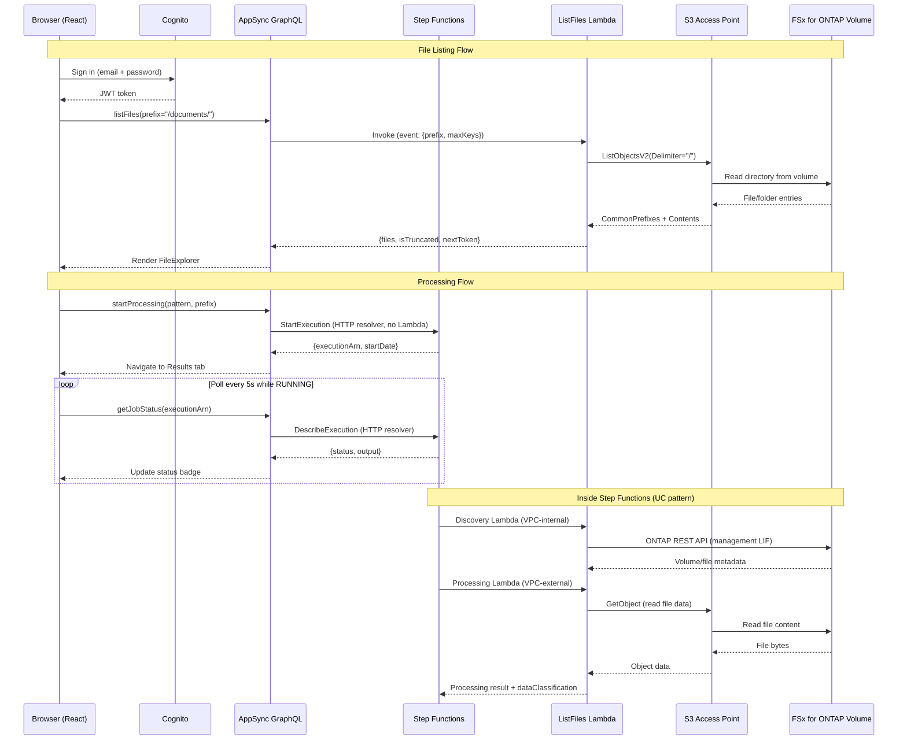

# FSx for ONTAP ファイルポータル — Amplify Gen2

🌐 **言語**: 日本語 | [English](README.md) | [한국어](README.ko.md) | [简体中文](README.zh-CN.md) | [繁體中文](README.zh-TW.md) | [Français](README.fr.md) | [Deutsch](README.de.md) | [Español](README.es.md)

FSx for ONTAP ボリュームの S3 Access Point 経由でファイルの閲覧・処理・結果表示を行う Web ベースのファイルポータルです。

## なぜファイルポータルを構築するのか？

AWS はビルディングブロック（S3 API、Cognito、AppSync）を提供していますが、FSx for ONTAP 上の NAS データに対して Box や Google Drive のようなファイル管理エクスペリエンスを提供する統合マネージドサービスは存在しません。エンドユーザーにブラウザベースのファイルアクセス、処理トリガー、結果閲覧を提供するには、独自にソリューションを組み立てる必要があります。本プロジェクトは Amplify Gen2 を使用したその実装例です。

参照: [ファイルポータル UI 選定ガイド（Amplify / Nextcloud / Custom）](../../docs/file-portal-amplify-gen2.md)

## ドキュメント

- **[ユーザーガイド](../../docs/ja/portal-user-guide.md)** — 日常的なポータル利用のためのエンドユーザーガイド（デプロイ知識不要）
- **[はじめに](docs/GETTING-STARTED.md)** — セットアップ、DemoMode、VPC Endpoints、本番チェックリスト
- **[実装ガイド](docs/IMPLEMENTATION.md)** — アーキテクチャ、設定ファイル、コンポーネント構成、デプロイ、変更ログ
- **[UI 拡張ガイド](docs/CONTRIBUTING-UI.md)** — 機能追加・画面修正をする開発者向け。ディスパッチ契約、アクションの追加手順、i18n とテーマ、通すゲート、実際に踏んだ失敗
- **[管理機能マップ](docs/admin-capability-map.md)** — 各インターフェースの担当範囲、20 パネルの実装状況、System Manager の機能領域との対応、ONTAP REST エンドポイント対応
- **[リソース管理デモガイド](docs/resource-management-demo-guide.md)** — 20 パネルの操作手順（FlexCache / FlexClone / SnapMirror / ローカルユーザー / 名前マッピング / Vscan / FPolicy / クラスター・SVM ピアリング / クラスター情報を含む）
- **[管理者デモガイド](../../docs/en/admin-resource-management-demo.md)** — リソース管理 + ARP/AI の E2E デモシナリオ
- **[AI Agent デモガイド](docs/ai-agent-demo-guide.md)** — AI Agent Chat、セマンティック検索、ガードレール、HITL
- **[構成図インデックス](../../docs/architecture-diagrams.md)** — 全 13 枚の構成図（ライトテーマ / ダークテーマ）

## 主な機能

| 機能 | 説明 |
|---------|-------------|
| **Storage Dashboard** | 4 カードのヘルス概要（容量、ARP 脅威、ロック済みスナップショット、効率性）— 管理者ランディングページ |
| **Welcome Onboarding** | 初回ユーザー向け 3 ステップガイドツアー（閲覧 → AI → 保護） |
| **ARP/AI Incident Lifecycle** | 状態追跡: Detected → Contained → Investigating → Resolved |
| **S3 Object Lock Management** | 出力バケットのステータス表示 + リテンション設定 |
| **EMS Event Viewer** | Event Management System からの ONTAP アラート/エラーイベント |
| **PHI Guardrail** | /dicom/、/phi/、/pii/ パスの AI 処理をブロック |
| **SMB Encryption Toggle** | SMB 3.0 転送中暗号化の ON/OFF（クライアント互換性警告付き） |
| **Export Policy CRUD** | ポリシーの作成/削除（ルールだけでなくポリシー単位） |
| **VolumeSelector Search** | サーバーサイドワイルドカードフィルター + 大規模環境向け 300ms デバウンス |
| **Tamperproof Lock** | FISC/SOX/HIPAA リテンションプリセット付きインラインロックフォーム |
| **8-Language i18n** | JA/EN/KO/ZH-CN/ZH-TW/FR/DE/ES（実行時即時切替対応） |
| **AI Agent Chat** | Bedrock Converse + tool_use による自然言語ファイル操作（3 モード: KB/Agent/Multi） |
| **Multimodal Input** | ドラッグ＆ドロップ画像アップロード + Bedrock Vision API 分析 |
| **Chat History** | DynamoDB 永続化セッション（自動保存・復元） |
| **Agent Directory** | カスタムエージェントレジストリ（作成フォーム、カテゴリフィルター、共有機能） |
| **Multi-Agent Teams** | ロール割当（Supervisor/Collaborator/Reviewer）付きチームウィザード |
| **KB Smart Routing** | マルチテナントアクセス制御のためのグループベース KB 検索スコープフィルタリング |
| **Admin Feature Gates** | AI 機能はデフォルト無効、管理パネルから機能単位でトグル |

## アーキテクチャ


*図: Amplify Gen2 ポータルの構成 — VPC 外の Lambda が S3 Access Point 経由で FSx for ONTAP ボリュームを読み書きする*

> 上図はライトテーマ（白背景）です。ダークモードで見たい場合は [ダークテーマ版](../../docs/images/amplify-vpc-split-dark.svg)をご利用ください。全 13 枚の図をライト / ダーク両方のリンク付きでまとめた [構成図インデックス](../../docs/architecture-diagrams.md) もあります。

以下は同じ構成をテキストで表したものです。

```
┌──────────────────────────────────────────────────────────┐
│  Amplify Gen2                                            │
│  ┌──────────┐  ┌─────────────────────────────────────┐   │
│  │ Cognito  │  │ AppSync GraphQL API                 │   │
│  │ Auth     │  │  startProcessing → Step Functions   │   │
│  │ +MFA     │  │  getJobStatus → Step Functions      │   │
│  │ +SAML    │  │  listFiles → Lambda → S3 AP         │   │
│  └──────────┘  └──────────────┬──────────────────────┘   │
│                               │                          │
│  ┌─────────────────────────────────────────────────────┐ │
│  │ CDK (in data stack)                                 │ │
│  │  - HTTP Data Source → states.<region>.amazonaws.com │ │
│  │  - Lambda Data Source → ListFiles (Python 3.13)     │ │
│  └─────────────────────────────────────────────────────┘ │
└──────────────────────────────────────────────────────────┘
          │                              │
          ▼                              ▼
┌──────────────────┐          ┌─────────────────────────┐
│ Step Functions   │          │ FSx for ONTAP           │
│ (UC pattern or   │          │ S3 Access Point         │
│  test workflow)  │          │ (Internet-origin)       │
└──────────────────┘          └─────────────────────────┘
```

### リクエストフロー（シーケンス図）



---

## ポータル UI — サイドバーレイアウト（17 セクション）


*左サイドバー: グループ化されたナビゲーション。中央: アクティブなセクションコンテンツ。右: AI アシスタント（ファイル選択時）。*

| グループ | セクション | 用途 |
|-------|---------|---------|
| **Browse** | All Files | 閲覧、並べ替え、絞り込み、複数選択、プレビュー、AI Q&A、共有リンク、QR アクセス |
| | Favorites | ピン留めファイル（DynamoDB、ユーザーごと） |
| | Recent | 最近アクセスしたファイル |
| | Folder Watch | 監視対象プレフィックスと受信したファイルイベント（管理トグル） |
| | Upload | Storage Browser for S3 によるドラッグ＆ドロップ |
| **AI & Processing** | AI Processing | AI/ML ワークフローのトリガー（Step Functions） |
| | AI Chat | ファイルを対象にツールを使うエージェント（保存したエージェント / チームの実行も可） |
| | Search | ボリューム全体のセマンティック検索 |
| | Job History | 過去の実行履歴（DynamoDB、オーナースコープ） |
| | Analytics | Glue Data Catalog 上の Athena SQL |
| | Agent Directory | 保存済みエージェント定義の実行・編集・共有 |
| **Data Protection** | Snapshots | ONTAP スナップショット一覧 + FlexClone リストア |
| | Lock | SnapLock (WORM) + S3 Object Lock ステータス |
| | ARP/AI | Autonomous Ransomware Protection ステータス |
| **Admin** | Resource Management | ボリューム、共有、エクスポート、クォータ、QoS、SnapMirror（storage-admin のみ） |
| | Version Diff | スナップショット間のサイドバイサイドファイル比較 |
| | Audit Trail | CloudTrail S3 データイベント（誰が/いつ/何を） |


*AI Processing: パターン + 入力パスを選択 → Step Functions にジョブを送信*


*ARP/AI: ランサムウェア検出ステータス、アラート数、自動スナップショットインベントリ*

### 追加機能

| 機能 | 説明 |
|---------|-------------|
| **My Files (group routing)** | Cognito グループ → チームごとに異なる S3 AP |
| **CONFIDENTIAL guardrail** | 機密ファイル（CUI/CONFIDENTIAL）の AI 処理をブロック |
| **AI metadata badges** | インライン分類ラベル、Rekognition タグ、エンティティ数 |
| **QR code access** | Presigned URL → QR PNG（OT/製造現場タブレット向け） |
| **Presigned URL sharing** | TTL 設定可能な共有リンク（5分〜1時間） |
| **cdk-nag compliance** | AwsSolutionsChecks を CI で `CDK_NAG=1` 実行（デプロイ時は適用しない） |
| **Fallback UI** | ONTAP 未接続時のグレースフル情報パネル（白画面なし） |

> **詳細なセクションガイド**: [docs/portal-tabs-guide.md](docs/portal-tabs-guide.md)

---

## 前提条件

| 要件 | バージョン / 備考 |
|---|---|
| Node.js | 18.17+（Amplify Gen2 必須） |
| AWS CLI | v2（認証情報設定済み） |
| AWS アカウント | Amplify、Cognito、AppSync、Lambda、Step Functions の権限 |
| OS | macOS または Linux（Windows: WSL2 を使用するか npm スクリプトを直接実行） |
| (オプション) FSx for ONTAP | **Internet-origin** S3 AP が接続されていること（VPC-origin は本ポータルでは非対応） |
| (オプション) デプロイ済み UC パターン | Step Functions 連携用 |

> ⚠️ **サンドボックスリソースは明示的に削除するまで残り続けます。** テスト後は必ず `make sandbox-delete` を実行して、孤立した AWS リソース（Cognito User Pool、AppSync API、Lambda）を削除してください。[クリーンアップ](#クリーンアップ) を参照。

---

## クイックスタート（5分）

> **所要時間**: 初回セットアップは合計約 15 分（npm install 約 2 分 + CDK bootstrap + sandbox deploy 約 10-13 分）。2 回目以降は大幅に高速化（Lambda コード変更で約 30 秒、インフラ変更で約 3 分）。

> **マルチ開発者**: 各開発者は OS ユーザー名で識別される個別のサンドボックスを取得します。同じ AWS アカウントで複数のチームメンバーが衝突なく作業できます。`npx ampx sandbox --identifier <name>` でカスタマイズ可能です。

```bash
# 1. 依存関係のインストール
make install

# 2. 設定ファイルの作成（ビルド/サンドボックスの前に必須）
cp amplify/portal-config.example.ts amplify/portal-config.ts
# portal-config.ts を編集 — 最低限リージョンを設定（例: 米国は us-east-1、日本は ap-northeast-1）
# ⚠️ このファイルがないと `make sandbox` と `npx tsc` は "Cannot find module './portal-config'" で失敗します

# 3. 個人サンドボックスにバックエンドをデプロイ（初回は約 3-5 分、差分は約 30 秒）
make sandbox
# ⚠️ このステップより前に `npm run build` は実行できません。src/main.tsx が
#    ../amplify_outputs.json を import しており、このファイルは sandbox が
#    生成し .gitignore で除外されています。クローン直後のビルドは
#    "[UNRESOLVED_IMPORT] Could not resolve '../amplify_outputs.json'" で失敗します。

# 4. 別のターミナルで開発サーバーを起動
make dev

# 5. ブラウザで http://localhost:5173 を開く
#    メールでサインアップ → 確認コード入力（または CLI: 下記参照）→ ログイン
```

### 初回ユーザー確認（CLI ショートカット）

Cognito は確認メールを送信しますが、テストアカウントの場合は CLI で確認できます:

```bash
# amplify_outputs.json の User Pool ID に置き換えてください
aws cognito-idp admin-confirm-sign-up \
  --user-pool-id <USER_POOL_ID> \
  --username "your-email@example.com" \
  --region ap-northeast-1
```

---

## 設定

環境固有のパラメータはすべて `amplify/portal-config.ts` に集約されています。

### セットアップ

```bash
cp amplify/portal-config.example.ts amplify/portal-config.ts
```

`portal-config.ts` を編集:

| パラメータ | 必須 | 例 | 説明 |
|---|---|---|---|
| `region` | Yes | `"ap-northeast-1"` | Step Functions と S3 AP の AWS リージョン |
| `s3ApAlias` | No | `"myap-abc123-s3alias"` | S3 AP エイリアスまたはバケット名。空 = "No files" |
| `stateMachineArn` | No | `"arn:aws:states:..."` | 処理用 Step Functions ARN |
| `stateMachineResourceScope` | No | `"*"` | IAM スコープ（本番では特定 ARN を使用） |
| `s3ApResourceArns` | No | `["arn:aws:s3:..."]` | S3 AP の IAM スコープ（本番では制限） |
| `groupApMapping` | No | `{"eng": "ap-eng-xxx"}` | Cognito グループ → S3 AP エイリアスマッピング（My Files） |
| `bedrockKbId` | No | `"KB123ABC"` | Bedrock Knowledge Base ID（全文検索） |

### 環境変数によるオーバーライド

ファイルを編集する代わりに環境変数を設定できます:

```bash
export AMPLIFY_PORTAL_REGION=ap-northeast-1
export AMPLIFY_PORTAL_S3AP_ALIAS=myap-abc123-s3alias
export AMPLIFY_PORTAL_SFN_ARN=arn:aws:states:ap-northeast-1:123456789012:stateMachine:uc1-workflow
export AMPLIFY_PORTAL_GROUP_AP_MAPPING='{"engineering":"ap-eng-xxx-s3alias","legal":"ap-legal-xxx-s3alias"}'
export AMPLIFY_PORTAL_BEDROCK_KB_ID=KB123ABC
```

---

## デプロイガイド

### クイックデモパス（最速）

```bash
make install
cp amplify/portal-config.example.ts amplify/portal-config.ts
make sfn-test-create   # テスト用 SFn を作成 — 出力の ARN をメモ
# portal-config.ts を編集: ARN を stateMachineArn に貼り付け
# amplify/data/resolvers/start-processing.js を編集: ARN を貼り付け（6 行目）
make sandbox
make dev
```

> **2 箇所の ARN 同期**: ステートマシン ARN は `portal-config.ts`（IAM スコープ用）と `start-processing.js`（ランタイム呼び出し用）の両方に設定する必要があります。これは APPSYNC_JS リゾルバがランタイムで CDK パラメータを読み取れないという既知の制約です。[既知の注意点 #6](#6-2-箇所の-arn-設定) を参照。

### DemoMode（FSx for ONTAP なし）

FSx for ONTAP なしで開発する場合:

1. `s3ApAlias` を空のままにする（Files タブは "No files" を表示）か、通常の S3 バケット名を設定
2. テスト用 Step Functions ステートマシンを作成: `make sfn-test-create`
3. 返された ARN を `portal-config.ts` に貼り付け
4. 再デプロイ: `make sandbox`

### FSx for ONTAP S3 Access Point への接続

1. FSx for ONTAP ボリュームにアタッチされた S3 AP を作成（Internet-origin 推奨）
2. AWS Console → FSx → S3 Access Points から AP エイリアスをメモ
3. `portal-config.ts` で `s3ApAlias` を設定
4. `src/portal-settings.ts` で `s3ApAlias` を設定（同じエイリアス — Upload タブに必要）
5. 再デプロイ: `make sandbox`

> **注**: ListFiles Lambda は VPC 外で実行されます（VpcConfig なし）。これは意図的な設計です — Internet-origin S3 AP は VPC 配置なしでアクセス可能です。VPC-origin AP を使用する場合は、Lambda に VPC 設定を追加する必要があります。

> **Upload タブ**: Storage Browser は Cognito Identity Pool 認証情報を使用してブラウザから直接 S3 API を呼び出します。必要な IAM 権限は `backend.ts` により自動プロビジョニングされます（手動の IAM 設定は不要）。`portal-config.ts` と `src/portal-settings.ts` の両方で `s3ApAlias` が設定されていることを確認してください。

> **Upload タブワークフロー**: Location 選択 → S3 AP alias をクリック → フォルダナビゲーション → ファイル選択でプレビュー/ダウンロード、またはドラッグ＆ドロップでアップロード。アップロードしたファイルは NFS/SMB から即座に参照可能です（ONTAP の strong consistency）。

> **スループットに関する注記**: S3 AP 操作は FSx for ONTAP のスループットキャパシティを NFS/SMB ワークロードと共有します。同時ユーザー計画については [スループットと容量計画](../../docs/file-portal-amplify-gen2.md#スループットと容量計画) を参照。

> **パフォーマンスに関する注記**: ListFiles Lambda は通常、100 オブジェクト未満のディレクトリで 100-300ms で応答します。1000 オブジェクト（最大 1 ページ）のディレクトリでは 300-800ms を想定してください。Lambda のタイムアウトはセーフティネットとして 30 秒に設定されていますが、通常の操作は 1 秒以内です。

### デプロイ済み UC パターンへの接続

UC パターンをデプロイ後（例: リポジトリルートから `make deploy-uc1`）:

1. CloudFormation 出力からステートマシン ARN をメモ
2. `portal-config.ts` で `stateMachineArn` を設定
3. `start-processing.js` リゾルバの ARN を更新
4. 再デプロイ: `make sandbox`

---

## 既知の注意点（実践から得た教訓）

検証中に発見された問題点で、デバッグ時間を節約できます:

### 1. APPSYNC_JS リゾルバの制約

AppSync JavaScript リゾルバ（APPSYNC_JS ランタイム）には重大な制約があります:

| ❌ 使用不可 | ✅ 代替手段 |
|---|---|
| `new Date()` | `util.time.nowISO8601()` またはエポック値を返しフロントエンドでパース |
| テンプレートリテラル (`` `${x}` ``) | 文字列連結 (`"a" + b + "c"`) |
| `async/await` | 同期処理のみ |
| グローバルコンストラクタ (`String()`, `Number()`) | 値を直接使用 |

### 2. クロススタックデータソースバインディング

データソース（HTTP、Lambda）は AppSync API と**同じ CDK スタック**に追加する必要があります。`backend.createStack()` をデータソースに使用すると、異なる CloudFormation スタックを参照するためリゾルバが "Data source not found" で失敗します。

**解決策**: `Stack.of(api)` でデータスタックを取得し、すべてのデータソースをそこに追加します。

### 3. Step Functions エポック秒

`DescribeExecution` は `startDate` と `stopDate` を Unix エポック**秒**（ミリ秒や ISO 8601 ではない）で返します。リゾルバは文字列として返し、フロントエンドが JavaScript `Date` 用に 1000 倍します。

### 4. S3 バケットと S3 Access Point の IAM 権限

Lambda IAM ポリシーは `arn:aws:s3:*:*:accesspoint/*` を使用し、S3 Access Point をカバーします。DemoMode テストで**通常の S3 バケット**を使用する場合は、バケット形式の ARN 権限を追加する必要があります:

```bash
# 一時的: CLI でテスト用に追加
aws iam put-role-policy --role-name <LAMBDA_ROLE_NAME> \
  --policy-name S3BucketTestAccess \
  --policy-document '{"Version":"2012-10-17","Statement":[{"Effect":"Allow","Action":["s3:ListBucket","s3:GetObject"],"Resource":["arn:aws:s3:::<BUCKET>","arn:aws:s3:::<BUCKET>/*"]}]}'
```

または `portal-config.ts` の `s3ApResourceArns` にバケット ARN を含めます。

### 5. Cognito 確認メール

存在しないメールアドレスを使用したテストアカウントは確認コードを受信できません。CLI ショートカットを使用してください:

```bash
aws cognito-idp admin-confirm-sign-up \
  --user-pool-id <USER_POOL_ID> \
  --username "test@example.com" \
  --region <REGION>
```

### 6. 2 箇所の ARN 設定

Step Functions ステートマシン ARN は**2 箇所**に設定する必要があります:

1. `amplify/portal-config.ts` → `stateMachineArn`（CDK での IAM ポリシースコープに使用）
2. `amplify/data/resolvers/start-processing.js` → `const stateMachineArn = "..."`（AppSync リゾルバのランタイムで使用）

この重複は APPSYNC_JS リゾルバがランタイムで CDK パラメータや環境変数を読み取れないために存在します。リゾルバは AppSync の組み込みランタイムが評価する静的な JavaScript です。

**2 箇所のうち 1 つの更新を忘れる**ことが最も一般的なデプロイの問題です。

### 7. リゾルバ内のステートマシン ARN はシークレットではない

`start-processing.js` にハードコードされた ARN はソースコードで可視です。これが許容される理由:
- ARN はシークレットではなく、リソースを識別するだけでアクセスを付与しない
- ステートマシンの呼び出し権限を制御するのは IAM ポリシー（ARN ではない）
- AppSync API はリゾルバ実行前に Cognito 認証を要求する

ただし、ARN は**環境固有**です — dev/staging/prod を切り替える際は必ず更新してください。

---

## 開発コマンド

| コマンド | 説明 |
|---|---|
| `make install` | npm 依存関係のインストール |
| `make dev` | Vite 開発サーバーの起動（フロントエンドのみ） |
| `make sandbox` | Amplify バックエンドのデプロイ/更新（個人サンドボックス） |
| `make sandbox-delete` | すべてのサンドボックスリソースの削除 |
| `make sandbox-status` | CloudFormation スタックステータスの表示 |
| `make sfn-test-create` | テスト用 Step Functions ステートマシンの作成 |
| `make sfn-test-delete` | テスト用ステートマシン + IAM ロールの削除 |
| `make test` | vitest の実行（単発実行） |
| `make typecheck` | TypeScript 型検証 |
| `make lint` | ESLint チェック |
| `make build` | 本番ビルド |
| `make clean` | node_modules、dist、.amplify の削除 |
| `make cleanup-all` | サンドボックス + テスト SFn + テスト S3 データの削除 |

---

## デプロイ所要時間（2026-07-20 検証済み）

| ステップ | 初回 | 2 回目以降 |
|------|-----------|-----------|
| `npm install` | 約 60 秒 | 0 秒（キャッシュ済み） |
| `make sandbox` | 4-5 分（CDK bootstrap + フルスタック） | 20-40 秒（差分） |
| `make sandbox-delete` | 約 2 分 | — |
| Cognito ユーザー作成（CLI） | 2 秒 | — |
| `make dev` → ブラウザ | 2 秒 | 2 秒 |

**初回セットアップ合計**: `git clone` から動作するポータルまで約 15 分（CDK bootstrap + 初回デプロイ）。以降の変更: コードのみで約 7 秒、インフラ変更で約 3 分。

### 本番デプロイ

本番環境（Amplify Hosting + カスタムドメイン）については [Amplify Hosting 本番ガイド](../../docs/en/amplify-hosting-production-guide.md) を参照。

サンドボックスとの主な違い:
- ブランチベース CI/CD（`main` へのプッシュ → 自動デプロイ）
- ACM 証明書付きカスタムドメイン
- DDoS 対策の WAF 統合
- メールのみの認証の代わりに SAML/OIDC

---

## 既知の注意点 — 追加の学び（2026-07-20）

### 8. Upload タブには `portal-settings.ts` の設定が必要

Upload タブ（Storage Browser for S3）は `region`、`accountId`、`s3ApAlias` を `src/portal-settings.ts` から読み取ります — `amplify/portal-config.ts` からではありません。これは Storage Browser が完全にクライアントサイドで動作し（Lambda なし）、Cognito Identity Pool 認証情報を使用して直接 S3 API にアクセスする必要があるためです。

Upload タブで "Network Error" が表示される場合は、`portal-settings.ts` の `s3ApAlias` が正しいか確認してください。

### 9. ~~Cognito Identity Pool IAM で S3 AP アクセスを許可する必要がある~~ (自動設定済み)

> **解決済み**: `backend.ts` で Cognito Identity Pool の authenticated ロールに S3 AP アクセス権限を CDK で自動付与するように変更しました。手動での `aws iam put-role-policy` は不要です。

`backend.ts` の以下の部分が自動設定します:
```typescript
authenticatedRole.addToPrincipalPolicy(
  new iam.PolicyStatement({
    sid: "StorageBrowserS3APAccess",
    actions: ["s3:GetObject", "s3:PutObject", "s3:DeleteObject", "s3:ListBucket", "s3:GetBucketLocation"],
    resources: config.s3ApResourceArns,
  })
);
```

Upload タブが「AccessDenied」を表示する場合は、`portal-config.ts` の `s3ApResourceArns` に正しい S3 AP ARN が含まれていることを確認してください。sandbox デフォルト (`arn:aws:s3:*:*:accesspoint/*`) であれば全ての AP にアクセスできます。

> **Storage Browser の認証モード**: Storage Browser は `createManagedAuthAdapter` (S3 Access Grants 必須) ではなく、**直接認証モード** (`getLocationCredentials` + `listLocations`) を使用しています。S3 Access Grants のセットアップは不要です。

### 10. サンドボックス削除は完全削除

`make sandbox-delete` はすべてのリソース（Cognito User Pool、AppSync API、Lambda 関数、DynamoDB テーブル、IAM ロール）を削除します。ユーザーアカウント、ジョブ履歴、API エンドポイントは永久に削除されます。部分的なクリーンアップオプションはありません。

### 11. マルチ開発者サンドボックス

各開発者は OS ユーザー名をキーとする隔離されたサンドボックスを取得します。異なるマシン（または異なるユーザー名）で `make sandbox` を実行すると、別々のスタックが作成されます:

```
amplify-fsxns3apamplifyportal-dev1-sandbox-0123456789  ← 開発者 1
amplify-fsxns3apamplifyportal-dev2-sandbox-9876543210   ← 開発者 2
```

同じ AWS アカウントを共有しますが、相互に干渉しません。`npx ampx sandbox --identifier custom-name` で明示的な命名も可能です。

---

## プロジェクト構成

```
amplify-portal/
├── amplify/
│   ├── backend.ts                  # エントリポイント — config をインポート、データソース + Lambda を作成
│   ├── portal-config.ts            # あなたの設定（git-ignored）
│   ├── portal-config.example.ts    # テンプレート — コピーしてカスタマイズ
│   ├── auth/resource.ts            # Cognito (email + MFA + SAML/OIDC プレースホルダー)
│   ├── data/
│   │   ├── resource.ts             # AppSync スキーマ（queries, mutations, custom types）
│   │   └── resolvers/              # APPSYNC_JS リゾルバ（18 ファイル、すべて resource.ts から参照）
│   │       ├── start-processing.js   # HTTP → StepFunctions.StartExecution
│   │       ├── get-job-status.js     # HTTP → StepFunctions.DescribeExecution
│   │       ├── files-dispatch.js     # Lambda → list-files（一覧 + ファイル操作）
│   │       ├── snapshots-dispatch.js # Lambda → snapshots（ONTAP Snapshot、FlexClone）
│   │       ├── rm-dispatch.js        # Lambda → resource-management（storage-admin 操作）
│   │       ├── arp-dispatch.js       # Lambda → ARP 対応アクション
│   │       ├── agent-dispatch.js     # Lambda → エージェントチャット / ディレクトリ / チーム
│   │       ├── search-files.js       # Lambda → Bedrock KB Retrieve
│   │       ├── get-file-metadata.js  # Lambda → DynamoDB の AI メタデータ
│   │       ├── get-presigned-url.js  # Lambda → 署名付き URL 生成
│   │       ├── generate-qr-code.js   # Lambda → 署名付き URL + QR PNG
│   │       ├── query-audit-log.js    # Lambda → Athena（CloudTrail）
│   │       ├── ask-about-file.js     # Lambda → Bedrock Converse API
│   │       ├── detect-labels.js      # Lambda → Rekognition DetectLabels
│   │       ├── extract-text.js       # Lambda → Textract
│   │       ├── analyze-text.js       # Lambda → Comprehend
│   │       ├── browse-catalog.js     # Lambda → Glue Data Catalog
│   │       └── run-athena-query.js   # Lambda → Athena StartQueryExecution
│   └── custom/
│       └── step-functions.ts       # （参考 — backend.ts に移動済み）
├── src/
│   ├── main.tsx                    # Amplify configure + Authenticator ラッパー
│   ├── App.tsx                     # 6 タブシェル（Files/Upload/Process/Results/History/Analytics）
│   ├── portal-settings.ts         # フロントエンド設定（Upload タブ、region、accountId）
│   └── components/
│       ├── FileExplorer.tsx        # ディレクトリ閲覧 + ページネーション + 共有リンク
│       ├── FilePreview.tsx         # Presigned URL による画像プレビュー + Rekognition ラベル
│       ├── ShareLink.tsx           # Presigned URL 共有リンクジェネレータ（TTL 選択可）
│       ├── StorageBrowserTab.tsx   # Storage Browser for S3（Upload タブ）
│       ├── AiPanel.tsx             # Bedrock Q&A チャットインターフェース
│       ├── AthenaQueryPanel.tsx    # SQL エディタ + 結果テーブル
│       ├── AuditLog.tsx            # ファイルアクセス監査証跡（CloudTrail → Athena）
│       ├── VersionHistory.tsx      # ONTAP Snapshot 一覧 + リストアトリガー
│       ├── SnapshotCompare.tsx     # サイドバイサイド差分（現在 vs FlexClone）
│       ├── JobSubmitForm.tsx       # UC パターン選択 + ジョブ送信
│       ├── ResultsViewer.tsx       # ステータス（subscription ベース）+ 出力表示
│       ├── FlexCloneStatus.tsx     # クローン作成進捗
│       ├── RestoreFromSnapshot.tsx # FlexClone トリガーダイアログ
│       ├── JobHistory.tsx          # 過去の実行（DynamoDB）
│       └── LoadingSkeleton.tsx     # 認証ローディングプレースホルダー
├── functions/
│   ├── notification-bridge/handler.py  # EventBridge → DynamoDB (FPolicy + SFTP events)
│   └── job-status-updater/handler.py   # Step Functions → DynamoDB (WebSocket push)
├── monitoring/
│   └── dashboard.ts               # CloudWatch Dashboard CDK コンストラクト
├── docs/
│   ├── portal-tabs-guide.md       # 17 セクション詳細ガイド（4 グループ、スクリーンショット付き）
│   └── screenshots/               # ポータル UI スクリーンショット
├── tests/
│   └── components/App.test.tsx     # タブレンダリング + ナビゲーションテスト
├── amplify_outputs.json            # sandbox が自動生成（git-ignored）
├── package.json
├── Makefile                        # すべてのワークフローコマンド
└── README.md
```

---

## クリーンアップ

> ⚠️ **重要**: サンドボックスリソースは自動的に削除されません。明示的に削除するまで AWS アカウントに残り続けます。

### サンドボックスの削除（開発リソース）

```bash
make sandbox-delete
# または手動で:
npx ampx sandbox delete
```

削除対象: Cognito User Pool、AppSync API、Lambda 関数、IAM ロール。

### テストリソースの削除

```bash
make sfn-test-delete    # テスト用 Step Functions ステートマシンの削除
make cleanup-all        # 完全クリーンアップ（サンドボックス + SFn + テスト S3 データ）
```

### 推定コスト（サンドボックス）

| リソース | 月額コスト（アイドル時） |
|---|---|
| Cognito User Pool | $0（50K MAU まで無料） |
| AppSync | $0（250K リクエストまで無料） |
| Lambda | $0（1M リクエストまで無料） |
| **合計（サンドボックスアイドル時）** | **約 $0** |

---

## 本番環境の考慮事項

サンドボックスを超えるデプロイの場合:

### 認証

エンタープライズ SSO には `amplify/auth/resource.ts` の SAML または OIDC セクションのコメントを解除します。

### IAM 最小権限

> ⚠️ **セキュリティ警告**: デフォルトの `stateMachineResourceScope: "*"` は AppSync データソースにアカウント内の**すべて**のステートマシンを呼び出す権限を付与します。個人サンドボックスでのみ許容されます。共有環境や本番環境では、特定の ARN パターンに制限してください。

`portal-config.ts` で制限:
- `stateMachineResourceScope` → 特定のステートマシン ARN またはパターン（例: `"arn:aws:states:ap-northeast-1:123456789012:stateMachine:uc*"`）
- `s3ApResourceArns` → 特定の AP ARN

### 監査証跡（CloudTrail）

ポータルが Step Functions をトリガーすると、CloudTrail はエンドユーザーではなく **AppSync サービスロール**を呼び出し元として記録します。監査トレーサビリティのため、`start-processing.js` リゾルバが Step Functions 実行入力に `userId` フィールドを埋め込みます。実行履歴を照会してアクションをユーザーにマッピングしてください。

### ホスティング

Amplify Hosting（Git からの CI/CD）または CloudFront + S3 にビルドしてホストでフロントエンドをデプロイ:

```bash
make build
# dist/ を S3 + CloudFront にアップロード、または Git リポジトリを Amplify Hosting に接続
```

### モニタリング

以下の CloudWatch アラームを追加:
- AppSync: 4xx/5xx エラーレート
- Lambda (ListFiles): エラー数、p99 レイテンシ
- Step Functions: 失敗実行数

監査/コンプライアンス要件を満たすよう、AppSync リクエストログと Step Functions 実行履歴の CloudWatch Logs 保持期間を設定してください。

### アクセス制御

現在のスケルトンでは、認証済みのすべてのユーザーが任意の実行 ARN を照会できます。本番環境では、オーナーベースの認可（実行 → userId マッピングを DynamoDB に保存）を実装してください。

> **ファイルレベルの可視性に関する注記**: ポータルの Cognito 認証は AppSync API へのアクセス権限を制御します。ただし、ファイルレベルのアクセス制御（どのファイルを閲覧/変更できるか）は Cognito グループではなく、ONTAP ボリュームの S3 AP の **File System Identity** によって決定されます。すべてのポータルユーザーが同じ S3 AP（同じ UNIX/Windows アイデンティティ）を共有する場合、同じファイルが見えます。ユーザーごとのファイル分離には、異なるファイルシステムアイデンティティを持つ別々の S3 AP を作成してください。

### インライン Lambda コード

ListFiles Lambda はシンプルさのためインライン（`backend.ts` 内の文字列として）で定義されています。本番環境では:
- 適切なエラーハンドリングとロギングを備えた別の Python ファイルに抽出
- ユニットテストを追加
- 共有依存関係に Lambda Layer の使用を検討

### Amplify Gen2 API の安定性

Amplify Gen2 は活発に進化しています。`@aws-amplify/*` パッケージバージョンを固定し、アップグレード後にテストしてください。初期ライフサイクル中はマイナーバージョンで破壊的変更が発生する可能性があります。

> **ライブデモのヒント**: 事前にサンドボックスをデプロイ（`make sandbox`）し、プレゼンテーション中は `make dev` のみ実行してください。サンドボックスのデプロイは初回で 3-5 分かかります。

---

## コアパターンとの関係

本ポータルは**オプショナルなフロントエンドレイヤー**です。コアパターンには変更を加えません:

- バックエンド Lambda 関数（Python）は `solutions/industry/*/` に残ります
- Step Functions ASL ワークフローは ARN で参照されます（コピーではない）
- `shared/` Python モジュールは影響を受けません
- 既存のすべての `make test-uc*` コマンドは独立して動作します

---

## 関連ドキュメント

- [ファイルポータル UI オプション（Amplify / Nextcloud / Custom）](../../docs/file-portal-amplify-gen2.md)
- [デプロイランブック (EN)](../../docs/en/portal-deployment-runbook.md) | [JA](../../docs/ja/portal-deployment-runbook.md)
- [スクリーンショット付きデモガイド (EN)](../../docs/en/portal-demo-guide.md) | [JA](../../docs/ja/portal-demo-guide.md)
- [SaaS ギャップ分析 & 機能リクエスト (JA)](../../docs/aws-feature-requests/file-portal-service-gap.md) | [EN](../../docs/aws-feature-requests/file-portal-service-gap.md)
- [全文検索設計判断](../../.private/design-decisions/c4-fulltext-search-comparison.md) (gitignored — private)
- [ポータルロードマップ (P0-P4)](../../.private/file-portal-roadmap.md) (gitignored — private)
- [Quick Desktop MCP セットアップ（AgentCore Gateway）](../../docs/quick-desktop-mcp-setup.md)
- [Nextcloud External Storage セットアップ](../../docs/nextcloud-external-storage-s3ap.md)
- [S3AP 互換性ノート](../../docs/s3ap-compatibility-notes.md)
- [Demo Mode ガイド](../../docs/demo-mode-guide.md)
- [Storage Browser デモガイド](../../docs/en/storage-browser-demo-guide.md)

---

🌐 **言語**: 日本語 | [English](README.md) | [한국어](README.ko.md) | [简体中文](README.zh-CN.md) | [繁體中文](README.zh-TW.md) | [Français](README.fr.md) | [Deutsch](README.de.md) | [Español](README.es.md)
