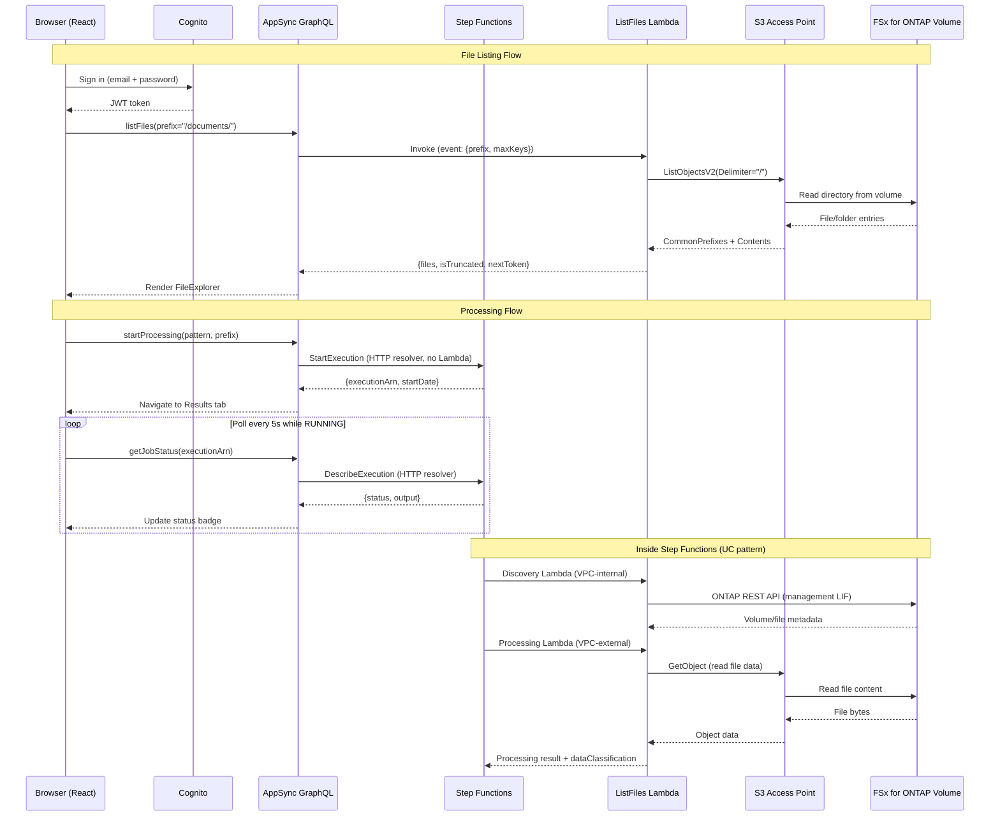

# FSx for ONTAP 파일 포털 — Amplify Gen2

🌐 **Language / 言語**: [日本語](README.ja.md) | [English](README.md) | 한국어 | [简体中文](README.zh-CN.md) | [繁體中文](README.zh-TW.md) | [Français](README.fr.md) | [Deutsch](README.de.md) | [Español](README.es.md)

FSx for ONTAP 볼륨의 S3 Access Point를 통해 파일 탐색, 처리 및 결과 조회를 수행하는 웹 기반 파일 포털입니다.

## 왜 파일 포털을 구축하는가?

AWS는 빌딩 블록(S3 API, Cognito, AppSync)을 제공하지만, FSx for ONTAP의 NAS 데이터에 대해 Box나 Google Drive와 같은 파일 관리 경험을 제공하는 통합 관리형 서비스는 존재하지 않습니다. 최종 사용자에게 브라우저 기반 파일 액세스, 처리 트리거, 결과 조회를 제공하려면 자체 솔루션을 구성해야 합니다. 이 프로젝트는 Amplify Gen2를 사용한 구현 예시입니다.

참조: [파일 포털 UI 선택 가이드 (Amplify / Nextcloud / Custom)](../../docs/file-portal-amplify-gen2.md)

## 문서

- **[사용자 가이드](../../docs/ko/portal-user-guide.md)** — 일상적인 포털 사용을 위한 최종 사용자 가이드 (배포 지식 불필요)
- **[시작하기](docs/GETTING-STARTED.md)** — 설정, DemoMode, VPC Endpoints, 프로덕션 체크리스트
- **[구현 가이드](docs/IMPLEMENTATION.md)** — 아키텍처, 설정 파일, 컴포넌트 구조, 배포, 변경 로그
- **[관리자 데모 가이드](../../docs/en/admin-resource-management-demo.md)** — 리소스 관리 + ARP/AI E2E 데모 시나리오
- **[AI Agent 데모 가이드](docs/ai-agent-demo-guide.en.md)** — AI Agent Chat, 시맨틱 검색, 가드레일, HITL
- **[아키텍처 다이어그램 색인](../../docs/architecture-diagrams.en.md)** — 13개 그림 전체(라이트 테마 / 다크 테마)

## 주요 기능

| 기능 | 설명 |
|---------|-------------|
| **Storage Dashboard** | 4개 카드 헬스 개요 (용량, ARP 위협, 잠긴 스냅샷, 효율성) — 관리자 랜딩 페이지 |
| **Welcome Onboarding** | 최초 사용자를 위한 3단계 가이드 투어 (탐색 → AI → 보호) |
| **ARP/AI Incident Lifecycle** | 상태 추적: Detected → Contained → Investigating → Resolved |
| **S3 Object Lock Management** | 출력 버킷의 상태 표시 + 리텐션 설정 |
| **EMS Event Viewer** | Event Management System의 ONTAP 알림/오류 이벤트 |
| **PHI Guardrail** | /dicom/, /phi/, /pii/ 경로의 AI 처리 차단 |
| **SMB Encryption Toggle** | SMB 3.0 전송 중 암호화 ON/OFF (클라이언트 호환성 경고 포함) |
| **Export Policy CRUD** | 정책 생성/삭제 (규칙뿐만 아니라 정책 단위) |
| **VolumeSelector Search** | 서버 사이드 와일드카드 필터 + 대규모 환경용 300ms 디바운스 |
| **Tamperproof Lock** | FISC/SOX/HIPAA 리텐션 프리셋이 포함된 인라인 잠금 폼 |
| **8-Language i18n** | JA/EN/KO/ZH-CN/ZH-TW/FR/DE/ES (런타임 즉시 전환 지원) |
| **AI Agent Chat** | Bedrock Converse + tool_use를 통한 자연어 파일 작업 (3가지 모드: KB/Agent/Multi) |
| **Multimodal Input** | 드래그 앤 드롭 이미지 업로드 + Bedrock Vision API 분석 |
| **Chat History** | DynamoDB 영속화 세션 (자동 저장 및 복원) |
| **Agent Directory** | 커스텀 에이전트 레지스트리 (생성 폼, 카테고리 필터, 공유 기능) |
| **Multi-Agent Teams** | 역할 할당 (Supervisor/Collaborator/Reviewer) 팀 마법사 |
| **KB Smart Routing** | 멀티테넌트 접근 제어를 위한 그룹 기반 KB 검색 스코프 필터링 |
| **Admin Feature Gates** | AI 기능은 기본 비활성화, 관리 패널에서 기능별 토글 |

## 아키텍처


*그림: Amplify Gen2 포털 아키텍처 — VPC 외부의 Lambda가 S3 Access Point를 통해 FSx for ONTAP 볼륨을 읽고 쓴다*

> 위 그림은 라이트 테마(흰 배경)입니다. 다크 모드를 선호하면 [다크 테마 버전](../../docs/images/amplify-vpc-split-en-dark.svg)을 이용하세요. 13개 그림 전체를 라이트 / 다크 링크와 함께 정리한 [아키텍처 다이어그램 색인](../../docs/architecture-diagrams.en.md)도 있습니다.

동일한 아키텍처를 텍스트로 표현한 것입니다.

```
┌──────────────────────────────────────────────────────────┐
│  Amplify Gen2                                            │
│  ┌──────────┐  ┌─────────────────────────────────────┐   │
│  │ Cognito  │  │ AppSync GraphQL API                 │   │
│  │ Auth     │  │  startProcessing → Step Functions   │   │
│  │ +MFA     │  │  getJobStatus → Step Functions      │   │
│  │ +SAML    │  │  listFiles → Lambda → S3 AP         │   │
│  └──────────┘  └──────────────┬──────────────────────┘   │
│                               │                          │
│  ┌─────────────────────────────────────────────────────┐ │
│  │ CDK (in data stack)                                 │ │
│  │  - HTTP Data Source → states.<region>.amazonaws.com │ │
│  │  - Lambda Data Source → ListFiles (Python 3.13)     │ │
│  └─────────────────────────────────────────────────────┘ │
└──────────────────────────────────────────────────────────┘
          │                              │
          ▼                              ▼
┌──────────────────┐          ┌─────────────────────────┐
│ Step Functions   │          │ FSx for ONTAP           │
│ (UC pattern or   │          │ S3 Access Point         │
│  test workflow)  │          │ (Internet-origin)       │
└──────────────────┘          └─────────────────────────┘
```

### 요청 흐름 (시퀀스 다이어그램)



---

## 포털 UI — 사이드바 레이아웃 (17개 섹션)


*왼쪽 사이드바: 그룹화된 네비게이션. 중앙: 활성 섹션 콘텐츠. 오른쪽: AI 어시스턴트 (파일 선택 시).*

| 그룹 | 섹션 | 용도 |
|-------|---------|---------|
| **Browse** | All Files | 탐색, 정렬, 필터, 다중 선택, 미리보기, AI Q&A, 공유 링크, QR 액세스 |
| | Favorites | 핀 고정 파일 (DynamoDB, 사용자별) |
| | Recent | 최근 액세스한 파일 |
| | Folder Watch | 감시 대상 프리픽스와 수신된 파일 이벤트 (관리 토글) |
| | Upload | Storage Browser for S3를 통한 드래그 앤 드롭 |
| **AI & Processing** | AI Processing | AI/ML 워크플로우 트리거 (Step Functions) |
| | AI Chat | 파일을 대상으로 도구를 사용하는 에이전트(저장된 에이전트/팀 실행 포함) |
| | Search | 볼륨 전체 시맨틱 검색 |
| | Job History | 과거 실행 이력 (DynamoDB, 소유자 스코프) |
| | Analytics | Glue Data Catalog 기반 Athena SQL |
| | Agent Directory | 저장된 에이전트 정의 실행, 편집, 공유 |
| **Data Protection** | Snapshots | ONTAP 스냅샷 목록 + FlexClone 복원 |
| | Lock | SnapLock (WORM) + S3 Object Lock 상태 |
| | ARP/AI | Autonomous Ransomware Protection 상태 |
| **Admin** | Resource Management | 볼륨, 공유, 내보내기, 할당량, QoS, SnapMirror(storage-admin 전용) |
| | Version Diff | 스냅샷 간 파일 비교 (사이드 바이 사이드) |
| | Audit Trail | CloudTrail S3 데이터 이벤트 (누가/언제/무엇을) |


*AI Processing: 패턴 + 입력 경로 선택 → Step Functions에 작업 제출*


*ARP/AI: 랜섬웨어 탐지 상태, 알림 수, 자동 스냅샷 인벤토리*

### 추가 기능

| 기능 | 설명 |
|---------|-------------|
| **My Files (그룹 라우팅)** | Cognito 그룹 → 팀별 다른 S3 AP |
| **CONFIDENTIAL 가드레일** | 기밀 파일 (CUI/CONFIDENTIAL)의 AI 처리 차단 |
| **AI 메타데이터 배지** | 인라인 분류 라벨, Rekognition 태그, 엔터티 수 |
| **QR 코드 액세스** | Presigned URL → QR PNG (OT/제조 태블릿용) |
| **Presigned URL 공유** | TTL 설정 가능한 공유 링크 (5분~1시간) |
| **cdk-nag 규정 준수** | CI에서 `CDK_NAG=1`로 AwsSolutionsChecks 실행(배포 시에는 미적용) |
| **폴백 UI** | ONTAP 미연결 시 안내 패널 표시 (화이트 스크린 없음) |

> **상세 섹션 가이드**: [docs/portal-tabs-guide.en.md](docs/portal-tabs-guide.en.md)

---

## 사전 요구 사항

| 요구 사항 | 버전 / 비고 |
|---|---|
| Node.js | 18.17+ (Amplify Gen2 필수) |
| AWS CLI | v2 (자격 증명 설정 완료) |
| AWS 계정 | Amplify, Cognito, AppSync, Lambda, Step Functions 권한 |
| OS | macOS 또는 Linux (Windows: WSL2 사용 또는 npm 스크립트 직접 실행) |
| (선택) FSx for ONTAP | **Internet-origin** S3 AP가 연결된 상태 (VPC-origin은 이 포털에서 지원하지 않음) |
| (선택) 배포된 UC 패턴 | Step Functions 통합용 |

> ⚠️ **샌드박스 리소스는 명시적으로 삭제하기 전까지 유지됩니다.** 테스트 후 항상 `make sandbox-delete`를 실행하여 잔여 AWS 리소스 (Cognito User Pool, AppSync API, Lambda)를 정리하세요. [정리](#정리) 참조.

---

## 빠른 시작 (5분)

> **소요 시간**: 최초 설정은 약 15분 소요 (npm install ~2분 + CDK bootstrap + sandbox 배포 ~10-13분). 이후 반복 작업은 훨씬 빠릅니다 (Lambda 코드 변경 ~30초, 인프라 변경 ~3분).

> **멀티 개발자**: 각 개발자는 별도의 샌드박스를 받습니다 (OS 사용자 이름으로 식별). 여러 팀원이 동일한 AWS 계정에서 충돌 없이 작업할 수 있습니다. `npx ampx sandbox --identifier <name>`으로 커스터마이즈 가능합니다.

```bash
# 1. 의존성 설치
make install

# 2. 설정 파일 생성 (빌드/샌드박스 전 필수)
cp amplify/portal-config.example.ts amplify/portal-config.ts
# portal-config.ts 편집 — 최소한 리전을 설정 (예: 미국은 us-east-1, 일본은 ap-northeast-1)
# ⚠️ 이 파일 없이는 `make sandbox`와 `npx tsc`가 "Cannot find module './portal-config'" 오류로 실패

# 3. 개인 샌드박스에 백엔드 배포 (최초 ~3-5분, 증분 ~30초)
make sandbox
# ⚠️ 이 단계 전에는 `npm run build`를 실행할 수 없습니다. src/main.tsx가
#    ../amplify_outputs.json을 import하며, 이 파일은 sandbox가 생성하고
#    .gitignore가 제외합니다. 새로 클론한 상태에서는 빌드가
#    "[UNRESOLVED_IMPORT] Could not resolve '../amplify_outputs.json'"로 실패합니다.

# 4. 다른 터미널에서 개발 서버 시작
make dev

# 5. 브라우저에서 http://localhost:5173 열기
#    이메일로 가입 → 인증 코드 확인 (또는 CLI 사용: 아래 참조) → 로그인
```

### 최초 사용자 확인 (CLI 바로가기)

Cognito가 확인 이메일을 보내지만, 테스트 계정은 CLI로 확인할 수 있습니다:

```bash
# amplify_outputs.json의 User Pool ID로 교체
aws cognito-idp admin-confirm-sign-up \
  --user-pool-id <USER_POOL_ID> \
  --username "your-email@example.com" \
  --region ap-northeast-1
```

---

## 설정

모든 환경별 파라미터는 `amplify/portal-config.ts`에 있습니다.

### 설정 방법

```bash
cp amplify/portal-config.example.ts amplify/portal-config.ts
```

`portal-config.ts` 편집:

| 파라미터 | 필수 | 예시 | 설명 |
|---|---|---|---|
| `region` | 예 | `"ap-northeast-1"` | Step Functions 및 S3 AP용 AWS 리전 |
| `s3ApAlias` | 아니오 | `"myap-abc123-s3alias"` | S3 AP 별칭 또는 버킷 이름. 비어있으면 "파일 없음" |
| `stateMachineArn` | 아니오 | `"arn:aws:states:..."` | 처리용 Step Functions ARN |
| `stateMachineResourceScope` | 아니오 | `"*"` | IAM 스코프 (프로덕션에서는 특정 ARN 사용) |
| `s3ApResourceArns` | 아니오 | `["arn:aws:s3:..."]` | S3 AP용 IAM 스코프 (프로덕션에서는 제한) |
| `groupApMapping` | 아니오 | `{"eng": "ap-eng-xxx"}` | Cognito 그룹 → S3 AP 별칭 매핑 (My Files) |
| `bedrockKbId` | 아니오 | `"KB123ABC"` | Bedrock Knowledge Base ID (전문 검색) |

### 환경 변수 오버라이드

파일 편집 대신 환경 변수를 설정할 수 있습니다:

```bash
export AMPLIFY_PORTAL_REGION=ap-northeast-1
export AMPLIFY_PORTAL_S3AP_ALIAS=myap-abc123-s3alias
export AMPLIFY_PORTAL_SFN_ARN=arn:aws:states:ap-northeast-1:123456789012:stateMachine:uc1-workflow
export AMPLIFY_PORTAL_GROUP_AP_MAPPING='{"engineering":"ap-eng-xxx-s3alias","legal":"ap-legal-xxx-s3alias"}'
export AMPLIFY_PORTAL_BEDROCK_KB_ID=KB123ABC
```

---

## 배포 가이드

### 빠른 데모 경로 (가장 빠름)

```bash
make install
cp amplify/portal-config.example.ts amplify/portal-config.ts
make sfn-test-create   # 테스트 SFn 생성 — 출력에서 ARN 확인
# portal-config.ts 편집: stateMachineArn에 ARN 붙여넣기
# amplify/data/resolvers/start-processing.js 편집: ARN 붙여넣기 (6번째 줄)
make sandbox
make dev
```

> **두 곳에 ARN 동기화**: 상태 머신 ARN은 `portal-config.ts` (IAM 스코핑용)와 `start-processing.js` (런타임 호출용) 두 곳에 설정해야 합니다. 이는 APPSYNC_JS 리졸버가 런타임에 CDK 파라미터를 읽을 수 없는 알려진 제한 사항입니다. [알려진 함정 #6](#6-두-곳의-arn-설정) 참조.

### DemoMode (FSx for ONTAP 없이)

FSx for ONTAP 없이 개발하는 경우:

1. `s3ApAlias`를 비워둠 (파일 탭에 "파일 없음" 표시) 또는 일반 S3 버킷 이름 설정
2. 테스트 Step Functions 상태 머신 생성: `make sfn-test-create`
3. 반환된 ARN을 `portal-config.ts`에 붙여넣기
4. 재배포: `make sandbox`

### FSx for ONTAP S3 Access Point 연결

1. FSx for ONTAP 볼륨에 S3 AP 생성 (Internet-origin 권장)
2. AWS 콘솔 → FSx → S3 Access Points에서 AP 별칭 확인
3. `portal-config.ts`에 `s3ApAlias` 설정
4. `src/portal-settings.ts`에 `s3ApAlias` 설정 (동일 별칭 — Upload 탭에 필요)
5. 재배포: `make sandbox`

> **참고**: ListFiles Lambda는 VPC 외부에서 실행됩니다 (VpcConfig 없음). 이는 의도적입니다 — Internet-origin S3 AP는 VPC 배치 없이 액세스 가능합니다. VPC-origin AP를 사용하는 경우 Lambda에 VPC 설정을 추가해야 합니다.

> **Upload 탭**: Storage Browser는 Cognito Identity Pool 자격 증명을 사용하여 브라우저에서 직접 S3 API를 호출합니다. 필요한 IAM 권한은 `backend.ts`에서 자동으로 프로비저닝됩니다 (수동 IAM 설정 불필요). `s3ApAlias`가 `portal-config.ts`와 `src/portal-settings.ts` 모두에 설정되어 있는지 확인하세요.

> **Upload 탭 워크플로우**: Location 선택 → S3 AP alias 클릭 → 폴더 네비게이션 → 파일 선택으로 미리보기/다운로드, 또는 드래그 앤 드롭으로 업로드. 업로드한 파일은 NFS/SMB에서 즉시 참조 가능합니다 (ONTAP strong consistency).

> **스루풋 참고**: S3 AP 작업은 NFS/SMB 워크로드와 FSx for ONTAP 스루풋 용량을 공유합니다. 동시 사용자 계획은 [스루풋 및 용량 계획](../../docs/file-portal-amplify-gen2.md#スループットと容量計画)을 참조하세요.

> **성능 참고**: ListFiles Lambda는 100개 미만 오브젝트의 디렉토리에서 일반적으로 100-300ms 응답합니다. 1000개 오브젝트 (최대 단일 페이지)의 경우 300-800ms가 예상됩니다. Lambda는 안전망으로 30초 타임아웃이 설정되어 있지만, 정상 작동 시 1초 미만입니다.

### 배포된 UC 패턴에 연결

UC 패턴 배포 후 (예: 저장소 루트에서 `make deploy-uc1`):

1. CloudFormation 출력에서 State Machine ARN 확인
2. `portal-config.ts`에 `stateMachineArn` 설정
3. `start-processing.js` 리졸버에 ARN 업데이트
4. 재배포: `make sandbox`

---

## 알려진 함정 (교훈)

검증 과정에서 발견된 디버깅 시간을 절약해 주는 이슈들:

### 1. APPSYNC_JS 리졸버 제한 사항

AppSync JavaScript 리졸버 (APPSYNC_JS 런타임)에는 상당한 제약이 있습니다:

| ❌ 사용 불가 | ✅ 대신 사용 |
|---|---|
| `new Date()` | `util.time.nowISO8601()` 또는 epoch 반환 후 프론트엔드에서 파싱 |
| 템플릿 리터럴 (`` `${x}` ``) | 문자열 연결 (`"a" + b + "c"`) |
| `async/await` | 동기식만 가능 |
| 전역 생성자 (`String()`, `Number()`) | 직접 값 사용 |

### 2. 크로스 스택 데이터 소스 바인딩

데이터 소스 (HTTP, Lambda)는 AppSync API와 **동일한 CDK 스택**에 추가해야 합니다. `backend.createStack()`을 데이터 소스에 사용하면 리졸버가 다른 CloudFormation 스택을 참조하므로 "Data source not found" 오류가 발생합니다.

**해결 방법**: `Stack.of(api)`로 데이터 스택을 가져와 모든 데이터 소스를 그곳에 추가합니다.

### 3. Step Functions Epoch 초

`DescribeExecution`은 `startDate`와 `stopDate`를 Unix epoch **초** 단위로 반환합니다 (밀리초나 ISO 8601이 아님). 리졸버는 문자열로 반환하고, 프론트엔드에서 JavaScript `Date`를 위해 1000을 곱합니다.

### 4. S3 버킷 vs S3 Access Point IAM 권한

Lambda IAM 정책은 `arn:aws:s3:*:*:accesspoint/*`를 사용하여 S3 Access Point를 커버합니다. DemoMode 테스트에 **일반 S3 버킷**을 사용하는 경우 버킷 형식 ARN 권한을 추가해야 합니다:

```bash
# 임시: CLI로 테스트용 추가
aws iam put-role-policy --role-name <LAMBDA_ROLE_NAME> \
  --policy-name S3BucketTestAccess \
  --policy-document '{"Version":"2012-10-17","Statement":[{"Effect":"Allow","Action":["s3:ListBucket","s3:GetObject"],"Resource":["arn:aws:s3:::<BUCKET>","arn:aws:s3:::<BUCKET>/*"]}]}'
```

또는 `portal-config.ts`의 `s3ApResourceArns`에 버킷 ARN을 포함합니다.

### 5. Cognito 확인 이메일

존재하지 않는 이메일 주소를 사용하는 테스트 계정은 확인 코드를 받을 수 없습니다. CLI 바로가기를 사용하세요:

```bash
aws cognito-idp admin-confirm-sign-up \
  --user-pool-id <USER_POOL_ID> \
  --username "test@example.com" \
  --region <REGION>
```

### 6. 두 곳의 ARN 설정

Step Functions 상태 머신 ARN은 **두 곳**에 설정해야 합니다:

1. `amplify/portal-config.ts` → `stateMachineArn` (CDK에서 IAM 정책 스코핑에 사용)
2. `amplify/data/resolvers/start-processing.js` → `const stateMachineArn = "..."` (AppSync 리졸버가 런타임에 사용)

이 중복은 APPSYNC_JS 리졸버가 런타임에 CDK 파라미터나 환경 변수를 읽을 수 없기 때문에 존재합니다. AppSync의 내장 런타임이 평가하는 정적 JavaScript입니다.

**둘 중 하나를 업데이트하는 것을 잊는 것**이 가장 흔한 배포 이슈입니다.

### 7. 리졸버 내 State Machine ARN은 비밀이 아님

`start-processing.js`에 하드코딩된 ARN은 소스 코드에서 볼 수 있습니다. 이는 다음 이유로 허용됩니다:
- ARN은 비밀이 아님 — 리소스를 식별하지만 액세스를 부여하지 않음
- IAM 정책 (ARN이 아님)이 누가 상태 머신을 호출할 수 있는지 제어
- AppSync API는 리졸버 실행 전에 Cognito 인증을 요구

단, ARN은 **환경별**입니다 — dev/staging/prod 간 전환 시 항상 업데이트하세요.

---

## 개발 명령어

| 명령어 | 설명 |
|---|---|
| `make install` | npm 의존성 설치 |
| `make dev` | Vite 개발 서버 시작 (프론트엔드만) |
| `make sandbox` | Amplify 백엔드 배포/업데이트 (개인 샌드박스) |
| `make sandbox-delete` | 모든 샌드박스 리소스 삭제 |
| `make sandbox-status` | CloudFormation 스택 상태 확인 |
| `make sfn-test-create` | 테스트 Step Functions 상태 머신 생성 |
| `make sfn-test-delete` | 테스트 상태 머신 + IAM 역할 삭제 |
| `make test` | vitest 실행 (단일 실행) |
| `make typecheck` | TypeScript 타입 검증 |
| `make lint` | ESLint 검사 |
| `make build` | 프로덕션 빌드 |
| `make clean` | node_modules, dist, .amplify 제거 |
| `make cleanup-all` | 샌드박스 + 테스트 SFn + 테스트 S3 데이터 삭제 |

---

## 배포 소요 시간 (2026-07-20 검증)

| 단계 | 최초 | 이후 |
|------|-----------|-----------|
| `npm install` | ~60초 | 0초 (캐시됨) |
| `make sandbox` | 4-5분 (CDK bootstrap + 전체 스택) | 20-40초 (증분) |
| `make sandbox-delete` | ~2분 | — |
| Cognito 사용자 생성 (CLI) | 2초 | — |
| `make dev` → 브라우저 | 2초 | 2초 |

**총 최초 설정 시간**: `git clone`부터 작동하는 포털까지 ~15분 (CDK bootstrap + 초기 배포). 이후 변경: 코드만 ~7초, 인프라 변경 ~3분.

### 프로덕션 배포

프로덕션 (Amplify Hosting + 커스텀 도메인)은 [Amplify Hosting 프로덕션 가이드](../../docs/en/amplify-hosting-production-guide.md)를 참조하세요.

샌드박스와의 주요 차이점:
- 브랜치 기반 CI/CD (`main`에 push → 자동 배포)
- ACM 인증서가 포함된 커스텀 도메인
- DDoS 보호를 위한 WAF 통합
- 이메일 전용 인증 대신 SAML/OIDC

---

## 알려진 함정 — 추가 학습 (2026-07-20)

### 8. Upload 탭은 `portal-settings.ts` 설정이 필요

Upload 탭 (Storage Browser for S3)은 `src/portal-settings.ts`에서 `region`, `accountId`, `s3ApAlias`를 읽습니다 — `amplify/portal-config.ts`가 아닙니다. 이는 Storage Browser가 완전히 클라이언트 사이드에서 실행되며 (Lambda 없음) Cognito Identity Pool 자격 증명을 통한 직접 S3 API 액세스가 필요하기 때문입니다.

Upload 탭에서 "Network Error"가 표시되면 `portal-settings.ts`에 올바른 `s3ApAlias`가 있는지 확인하세요.

### 9. ~~Cognito Identity Pool IAM은 S3 AP 액세스를 허용해야 함~~ (자동 설정됨)

> **해결됨**: `backend.ts`에서 Cognito Identity Pool의 authenticated 역할에 S3 AP 액세스 권한을 CDK로 자동 부여하도록 변경했습니다. 수동 `aws iam put-role-policy`는 불필요합니다.

`backend.ts`의 다음 부분이 자동으로 설정합니다:
```typescript
authenticatedRole.addToPrincipalPolicy(
  new iam.PolicyStatement({
    sid: "StorageBrowserS3APAccess",
    actions: ["s3:GetObject", "s3:PutObject", "s3:DeleteObject", "s3:ListBucket", "s3:GetBucketLocation"],
    resources: config.s3ApResourceArns,
  })
);
```

Upload 탭에 "AccessDenied"가 표시되면 `portal-config.ts`의 `s3ApResourceArns`에 올바른 S3 AP ARN이 포함되어 있는지 확인하세요. 샌드박스 기본값 (`arn:aws:s3:*:*:accesspoint/*`)이면 모든 AP에 액세스할 수 있습니다.

> **Storage Browser 인증 모드**: Storage Browser는 `createManagedAuthAdapter` (S3 Access Grants 필수)가 아닌 **직접 인증 모드** (`getLocationCredentials` + `listLocations`)를 사용합니다. S3 Access Grants 설정이 불필요합니다.

### 10. 샌드박스 삭제는 완전함

`make sandbox-delete`는 모든 리소스를 제거합니다 (Cognito User Pool, AppSync API, Lambda 함수, DynamoDB 테이블, IAM 역할). 사용자 계정, 작업 이력, API 엔드포인트가 영구 삭제됩니다. 부분 정리 옵션은 없습니다.

### 11. 멀티 개발자 샌드박스

각 개발자는 OS 사용자 이름으로 키가 지정된 격리된 샌드박스를 받습니다. 다른 머신 (또는 다른 사용자 이름)에서 `make sandbox`를 실행하면 별도의 스택이 생성됩니다:

```
amplify-fsxns3apamplifyportal-dev1-sandbox-0123456789  ← 개발자 1
amplify-fsxns3apamplifyportal-dev2-sandbox-9876543210   ← 개발자 2
```

동일한 AWS 계정을 공유하지만 간섭하지 않습니다. `npx ampx sandbox --identifier custom-name`으로 명시적 이름을 지정할 수 있습니다.

---

## 프로젝트 구조

```
amplify-portal/
├── amplify/
│   ├── backend.ts                  # 진입점 — 설정 가져오기, 데이터 소스 + Lambda 생성
│   ├── portal-config.ts            # 사용자 설정 (git-ignored)
│   ├── portal-config.example.ts    # 템플릿 — 복사 후 커스터마이즈
│   ├── auth/resource.ts            # Cognito (email + MFA + SAML/OIDC 플레이스홀더)
│   ├── data/
│   │   ├── resource.ts             # AppSync 스키마 (쿼리, 뮤테이션, 커스텀 타입)
│   │   └── resolvers/              # APPSYNC_JS resolvers (18 files, all reached from resource.ts)
│   │       ├── start-processing.js   # HTTP → StepFunctions.StartExecution
│   │       ├── get-job-status.js     # HTTP → StepFunctions.DescribeExecution
│   │       ├── files-dispatch.js     # Lambda → list-files (listing + file lifecycle)
│   │       ├── snapshots-dispatch.js # Lambda → snapshots (ONTAP snapshots, FlexClone)
│   │       ├── rm-dispatch.js        # Lambda → resource-management (storage-admin actions)
│   │       ├── arp-dispatch.js       # Lambda → ARP response actions
│   │       ├── agent-dispatch.js     # Lambda → agent chat, directory and teams
│   │       ├── search-files.js       # Lambda → Bedrock KB Retrieve
│   │       ├── get-file-metadata.js  # Lambda → DynamoDB AI metadata
│   │       ├── get-presigned-url.js  # Lambda → Presigned URL generation
│   │       ├── generate-qr-code.js   # Lambda → Presigned URL + QR PNG
│   │       ├── query-audit-log.js    # Lambda → Athena (CloudTrail)
│   │       ├── ask-about-file.js     # Lambda → Bedrock Converse API
│   │       ├── detect-labels.js      # Lambda → Rekognition DetectLabels
│   │       ├── extract-text.js       # Lambda → Textract
│   │       ├── analyze-text.js       # Lambda → Comprehend
│   │       ├── browse-catalog.js     # Lambda → Glue Data Catalog
│   │       └── run-athena-query.js   # Lambda → Athena StartQueryExecution
│   └── custom/
│       └── step-functions.ts       # (참조 — backend.ts로 이동됨)
├── src/
│   ├── main.tsx                    # Amplify configure + Authenticator 래퍼
│   ├── App.tsx                     # 6개 탭 쉘 (Files/Upload/Process/Results/History/Analytics)
│   ├── portal-settings.ts         # 프론트엔드 설정 (Upload 탭, region, accountId)
│   └── components/
│       ├── FileExplorer.tsx        # 디렉토리 탐색 + 페이지네이션 + 공유 링크
│       ├── FilePreview.tsx         # Presigned URL로 이미지 미리보기 + Rekognition 라벨
│       ├── ShareLink.tsx           # Presigned URL 공유 링크 생성기 (TTL 선택 가능)
│       ├── StorageBrowserTab.tsx   # Storage Browser for S3 (Upload 탭)
│       ├── AiPanel.tsx             # Bedrock Q&A 채팅 인터페이스
│       ├── AthenaQueryPanel.tsx    # SQL 편집기 + 결과 테이블
│       ├── AuditLog.tsx            # 파일 액세스 감사 추적 (CloudTrail → Athena)
│       ├── VersionHistory.tsx      # ONTAP Snapshot 목록 + 복원 트리거
│       ├── SnapshotCompare.tsx     # 사이드 바이 사이드 비교 (현재 vs FlexClone)
│       ├── JobSubmitForm.tsx       # UC 패턴 선택 + 작업 제출
│       ├── ResultsViewer.tsx       # 상태 (구독 기반) + 출력 표시
│       ├── FlexCloneStatus.tsx     # 클론 생성 진행률
│       ├── RestoreFromSnapshot.tsx # FlexClone 트리거 대화상자
│       ├── JobHistory.tsx          # 과거 실행 (DynamoDB)
│       └── LoadingSkeleton.tsx     # 인증 로딩 플레이스홀더
├── functions/
│   ├── notification-bridge/handler.py  # EventBridge → DynamoDB (FPolicy + SFTP 이벤트)
│   └── job-status-updater/handler.py   # Step Functions → DynamoDB (WebSocket 푸시)
├── monitoring/
│   └── dashboard.ts               # CloudWatch Dashboard CDK 구조체
├── docs/
│   ├── portal-tabs-guide.md       # 17개 섹션 상세 가이드 (4 그룹, 스크린샷 포함)
│   └── screenshots/               # 포털 UI 스크린샷
├── tests/
│   └── components/App.test.tsx     # 탭 렌더링 + 네비게이션 테스트
├── amplify_outputs.json            # 샌드박스에서 자동 생성 (git-ignored)
├── package.json
├── Makefile                        # 모든 워크플로우 명령어
└── README.md
```

---

## 정리

> ⚠️ **중요**: 샌드박스 리소스는 자동으로 삭제되지 않습니다. 명시적으로 제거하기 전까지 AWS 계정에 유지됩니다.

### 샌드박스 삭제 (개발 리소스)

```bash
make sandbox-delete
# 또는 수동:
npx ampx sandbox delete
```

제거됨: Cognito User Pool, AppSync API, Lambda 함수, IAM 역할.

### 테스트 리소스 삭제

```bash
make sfn-test-delete    # 테스트 Step Functions 상태 머신 제거
make cleanup-all        # 전체 정리 (샌드박스 + SFn + 테스트 S3 데이터)
```

### 예상 비용 (샌드박스)

| 리소스 | 월별 비용 (유휴) |
|---|---|
| Cognito User Pool | $0 (< 50K MAU 무료) |
| AppSync | $0 (< 250K 요청 무료) |
| Lambda | $0 (< 1M 요청 무료) |
| **합계 (샌드박스 유휴)** | **~$0** |

---

## 프로덕션 고려사항

샌드박스 이후 배포를 위해:

### 인증

엔터프라이즈 SSO를 위해 `amplify/auth/resource.ts`에서 SAML 또는 OIDC 섹션의 주석을 해제합니다.

### IAM 최소 권한

> ⚠️ **보안 경고**: 기본값 `stateMachineResourceScope: "*"`는 AppSync 데이터 소스에 계정 내 **모든** 상태 머신을 호출할 수 있는 권한을 부여합니다. 이는 개인 샌드박스에서만 허용됩니다. 공유 또는 프로덕션 환경에서는 특정 ARN 패턴으로 제한하세요.

`portal-config.ts`에서 제한:
- `stateMachineResourceScope` → 특정 상태 머신 ARN 또는 패턴 (예: `"arn:aws:states:ap-northeast-1:123456789012:stateMachine:uc*"`)
- `s3ApResourceArns` → 특정 AP ARN

### 감사 추적 (CloudTrail)

포털이 Step Functions를 트리거할 때 CloudTrail은 **AppSync 서비스 역할**을 호출자로 기록합니다 — 최종 사용자가 아닙니다. 감사 추적을 위해 `start-processing.js` 리졸버가 Step Functions 실행 입력에 `userId` 필드를 포함합니다. 실행 이력을 쿼리하여 작업을 사용자에게 매핑합니다.

### 호스팅

Amplify Hosting (Git에서 CI/CD)으로 프론트엔드를 배포하거나 CloudFront + S3에서 빌드 및 호스팅:

```bash
make build
# dist/를 S3 + CloudFront에 업로드, 또는 Git 저장소를 Amplify Hosting에 연결
```

### 모니터링

CloudWatch 알람 추가:
- AppSync: 4xx/5xx 오류율
- Lambda (ListFiles): 오류 수, 지속 시간 p99
- Step Functions: 실패한 실행 수

감사/규정 준수 요건에 맞게 AppSync 요청 로그와 Step Functions 실행 이력에 대한 CloudWatch Logs 보존을 설정합니다.

### 액세스 제어

현재 스켈레톤은 인증된 모든 사용자가 임의의 실행 ARN을 쿼리할 수 있습니다. 프로덕션에서는 소유자 기반 권한 부여를 구현하세요 (DynamoDB에 실행 → userId 매핑 저장).

> **파일 수준 가시성 참고**: 포털의 Cognito 인증은 AppSync API에 액세스할 수 있는 사람을 제어합니다. 그러나 파일 수준 접근 제어 (사용자가 볼 수 있는/수정할 수 있는 파일)는 Cognito 그룹이 아닌 ONTAP 볼륨의 S3 AP **파일 시스템 ID**에 의해 결정됩니다. 모든 포털 사용자가 동일한 S3 AP (동일 UNIX/Windows ID)를 공유하면 동일한 파일을 볼 수 있습니다. 사용자별 파일 격리를 위해서는 다른 파일 시스템 ID를 가진 별도의 S3 AP를 생성하세요.

### 인라인 Lambda 코드

ListFiles Lambda는 인라인 (`backend.ts` 내 문자열)으로 정의되어 있습니다. 프로덕션에서는:
- 적절한 오류 처리 및 로깅을 갖춘 별도 Python 파일로 추출
- 단위 테스트 추가
- 공유 의존성을 위한 Lambda Layer 사용 고려

### Amplify Gen2 API 안정성

Amplify Gen2는 활발히 발전 중입니다. `@aws-amplify/*` 패키지 버전을 고정하고 업그레이드 후 테스트하세요. 초기 라이프사이클 동안 마이너 버전에서 호환성 깨는 변경이 발생할 수 있습니다.

> **라이브 데모 팁**: 사전에 샌드박스를 배포하고 (`make sandbox`) 프레젠테이션 중에는 `make dev`만 실행하세요. 샌드박스 배포는 최초 실행 시 3-5분 소요됩니다.

---

## 관련 문서

- [파일 포털 UI 옵션 (Amplify / Nextcloud / Custom)](../../docs/file-portal-amplify-gen2.md)
- [배포 런북 (EN)](../../docs/en/portal-deployment-runbook.md) | [JA](../../docs/ja/portal-deployment-runbook.md)
- [스크린샷이 포함된 데모 가이드 (EN)](../../docs/en/portal-demo-guide.md) | [JA](../../docs/ja/portal-demo-guide.md)
- [SaaS 갭 분석 및 기능 요청 (JA)](../../docs/aws-feature-requests/file-portal-service-gap.md) | [EN](../../docs/aws-feature-requests/file-portal-service-gap.en.md)
- [전문 검색 설계 결정](../../.private/design-decisions/c4-fulltext-search-comparison.md) (gitignored — private)
- [포털 로드맵 (P0-P4)](../../.private/file-portal-roadmap.md) (gitignored — private)
- [Quick Desktop MCP 설정 (AgentCore Gateway)](../../docs/quick-desktop-mcp-setup.md)
- [Nextcloud External Storage 설정](../../docs/nextcloud-external-storage-s3ap.md)
- [S3AP 호환성 참고](../../docs/s3ap-compatibility-notes.md)
- [데모 모드 가이드](../../docs/demo-mode-guide.md)
- [Storage Browser 데모 가이드](../../docs/en/storage-browser-demo-guide.md)

---

🌐 **언어**: [日本語](README.ja.md) | [English](README.md) | 한국어 | [简体中文](README.zh-CN.md) | [繁體中文](README.zh-TW.md) | [Français](README.fr.md) | [Deutsch](README.de.md) | [Español](README.es.md)
