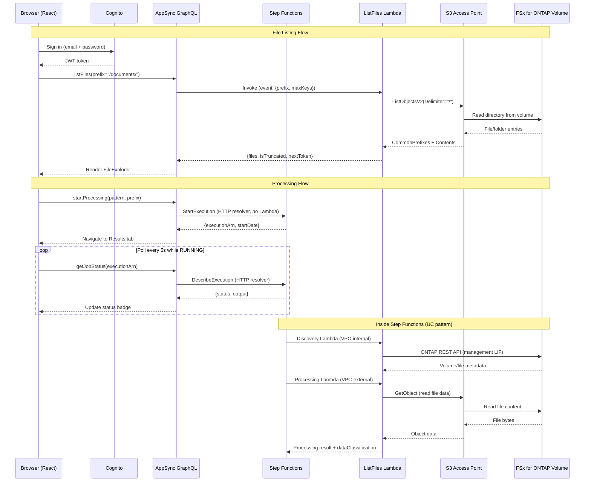

# FSx for ONTAP 文件门户 — Amplify Gen2

🌐 **语言**: [日本語](README.ja.md) | [English](README.md) | [한국어](README.ko.md) | 简体中文 | [繁體中文](README.zh-TW.md) | [Français](README.fr.md) | [Deutsch](README.de.md) | [Español](README.es.md)

基于 Web 的文件门户，通过 S3 Access Point 浏览、处理和查看 FSx for ONTAP 卷上的文件结果。

## 为什么要构建文件门户？

AWS 提供了构建模块（S3 API、Cognito、AppSync），但没有提供集成的托管服务来为 FSx for ONTAP 上的 NAS 数据提供类似 Box 或 Google Drive 的文件管理体验。要为最终用户提供基于浏览器的文件访问、处理触发和结果查看，需要自行组装解决方案。本项目是使用 Amplify Gen2 的一种实现方式。

参见：[文件门户 UI 选择指南（Amplify / Nextcloud / Custom）](../../docs/file-portal-amplify-gen2.md)

## 文档

- **[用户指南](../../docs/en/portal-user-guide.md)** — 日常门户使用的最终用户指南（无需部署知识）
- **[快速入门](docs/GETTING-STARTED.md)** — 设置、DemoMode、VPC Endpoints、生产检查清单
- **[实施指南](docs/IMPLEMENTATION.md)** — 架构、配置文件、组件结构、部署、变更日志
- **[管理员演示指南](../../docs/en/admin-resource-management-demo.md)** — 资源管理 + ARP/AI E2E 演示场景
- **[AI Agent 演示指南](docs/ai-agent-demo-guide.en.md)** — AI Agent Chat、语义搜索、护栏、HITL
- **[架构图索引](../../docs/architecture-diagrams.en.md)** — 全部 13 张图（浅色主题 / 深色主题）

## 主要功能

| 功能 | 说明 |
|---------|-------------|
| **Storage Dashboard** | 4 卡片健康概览（容量、ARP 威胁、已锁定快照、效率）— 管理员着陆页 |
| **Welcome Onboarding** | 首次用户 3 步引导教程（浏览 → AI → 保护） |
| **ARP/AI Incident Lifecycle** | 状态追踪：Detected → Contained → Investigating → Resolved |
| **S3 Object Lock Management** | 输出桶的状态显示 + 保留期配置 |
| **EMS Event Viewer** | 来自 Event Management System 的 ONTAP 告警/错误事件 |
| **PHI Guardrail** | 阻止 /dicom/、/phi/、/pii/ 路径的 AI 处理 |
| **SMB Encryption Toggle** | SMB 3.0 传输加密 ON/OFF（含客户端兼容性警告） |
| **Export Policy CRUD** | 策略创建/删除（不仅是规则，是策略级别） |
| **VolumeSelector Search** | 服务器端通配符过滤 + 大规模环境 300ms 防抖 |
| **Tamperproof Lock** | 含 FISC/SOX/HIPAA 保留预设的内联锁定表单 |
| **8-Language i18n** | JA/EN/KO/ZH-CN/ZH-TW/FR/DE/ES（运行时即时切换） |
| **AI Agent Chat** | 通过 Bedrock Converse + tool_use 的自然语言文件操作（3 种模式：KB/Agent/Multi） |
| **Multimodal Input** | 拖放图片上传 + Bedrock Vision API 分析 |
| **Chat History** | DynamoDB 持久化会话（自动保存和恢复） |
| **Agent Directory** | 自定义代理注册表（创建表单、分类过滤、共享功能） |
| **Multi-Agent Teams** | 角色分配（Supervisor/Collaborator/Reviewer）团队向导 |
| **KB Smart Routing** | 多租户访问控制的基于组的 KB 搜索范围过滤 |
| **Admin Feature Gates** | AI 功能默认禁用，从管理面板按功能切换 |

## 架构


*图: Amplify Gen2 门户架构 — VPC 外的 Lambda 通过 S3 Access Point 读写 FSx for ONTAP 卷*

> 上图为浅色主题（白色背景）。如果您偏好深色模式，请使用[深色主题版本](../../docs/images/amplify-vpc-split-en-dark.svg)。[架构图索引](../../docs/architecture-diagrams.en.md)汇总了全部 13 张图，并同时提供浅色与深色链接。

以下是同一架构的文本表示。

```
┌──────────────────────────────────────────────────────────┐
│  Amplify Gen2                                            │
│  ┌──────────┐  ┌─────────────────────────────────────┐   │
│  │ Cognito  │  │ AppSync GraphQL API                 │   │
│  │ Auth     │  │  startProcessing → Step Functions   │   │
│  │ +MFA     │  │  getJobStatus → Step Functions      │   │
│  │ +SAML    │  │  listFiles → Lambda → S3 AP         │   │
│  └──────────┘  └──────────────┬──────────────────────┘   │
│                               │                          │
│  ┌─────────────────────────────────────────────────────┐ │
│  │ CDK (in data stack)                                 │ │
│  │  - HTTP Data Source → states.<region>.amazonaws.com │ │
│  │  - Lambda Data Source → ListFiles (Python 3.13)     │ │
│  └─────────────────────────────────────────────────────┘ │
└──────────────────────────────────────────────────────────┘
          │                              │
          ▼                              ▼
┌──────────────────┐          ┌─────────────────────────┐
│ Step Functions   │          │ FSx for ONTAP           │
│ (UC pattern or   │          │ S3 Access Point         │
│  test workflow)  │          │ (Internet-origin)       │
└──────────────────┘          └─────────────────────────┘
```

### 请求流程（序列图）



---

## 门户 UI — 侧边栏布局（16 个部分）


*左侧边栏：分组导航。中央：活动部分内容。右侧：AI 助手（文件选择时）。*

| 分组 | 部分 | 用途 |
|-------|---------|---------|
| **Browse** | All Files | 浏览、预览、AI Q&A、共享链接、QR 访问 |
| | Favorites | 固定文件（DynamoDB，每用户） |
| | Recent | 最近访问的文件 |
| | Upload | 通过 Storage Browser for S3 拖放上传 |
| **AI & Processing** | AI Processing | 触发 AI/ML 工作流（Step Functions） |
| | AI Chat | 面向文件的工具型代理（也可运行已保存的代理或团队） |
| | Search | 跨卷语义搜索 |
| | Job History | 历史执行记录（DynamoDB，所有者范围） |
| | Analytics | 基于 Glue Data Catalog 的 Athena SQL |
| | Agent Directory | 运行、编辑或共享已保存的代理定义 |
| **Data Protection** | Snapshots | ONTAP 快照列表 + FlexClone 恢复 |
| | Lock | SnapLock (WORM) + S3 Object Lock 状态 |
| | ARP/AI | Autonomous Ransomware Protection 状态 |
| **Admin** | Resource Management | 卷、共享、导出、配额、QoS、SnapMirror（仅 storage-admin） |
| | Version Diff | 快照间的并排文件对比 |
| | Audit Trail | CloudTrail S3 数据事件（谁/何时/什么） |


*AI Processing：选择模式 + 输入路径 → 向 Step Functions 提交作业*


*ARP/AI：勒索软件检测状态、告警数量、自动快照清单*

### 附加功能

| 功能 | 说明 |
|---------|-------------|
| **My Files（组路由）** | Cognito 组 → 每团队不同的 S3 AP |
| **CONFIDENTIAL 护栏** | 阻止机密文件（CUI/CONFIDENTIAL）的 AI 处理 |
| **AI 元数据徽章** | 内联分类标签、Rekognition 标签、实体计数 |
| **QR 码访问** | Presigned URL → QR PNG（用于 OT/制造平板电脑） |
| **Presigned URL 共享** | 可配置 TTL 的共享链接（5 分钟~1 小时） |
| **cdk-nag 合规** | synth 时强制执行 AwsSolutionsChecks |
| **备用 UI** | ONTAP 未连接时显示信息面板（无白屏） |

> **详细部分指南**：[docs/portal-tabs-guide.md](docs/portal-tabs-guide.md)

---

## 前提条件

| 要求 | 版本 / 备注 |
|---|---|
| Node.js | 18.17+（Amplify Gen2 必需） |
| AWS CLI | v2（已配置凭证） |
| AWS 账户 | Amplify、Cognito、AppSync、Lambda、Step Functions 权限 |
| OS | macOS 或 Linux（Windows：使用 WSL2 或直接运行 npm 脚本） |
| （可选）FSx for ONTAP | 已挂载 **Internet-origin** S3 AP（本门户不支持 VPC-origin） |
| （可选）已部署的 UC 模式 | 用于 Step Functions 集成 |

> ⚠️ **沙盒资源在明确删除前会一直保留。** 测试后请始终运行 `make sandbox-delete` 以避免留下孤立的 AWS 资源（Cognito User Pool、AppSync API、Lambda）。参见[清理](#清理)。

---

## 快速开始（5 分钟）

> **耗时**：首次设置约需 15 分钟（npm install ~2 分钟 + CDK bootstrap + 沙盒部署 ~10-13 分钟）。后续迭代快得多（Lambda 代码变更 ~30 秒，基础设施变更 ~3 分钟）。

> **多开发者**：每位开发者获得独立的沙盒（通过 OS 用户名标识）。多个团队成员可在同一 AWS 账户上无冲突地工作。使用 `npx ampx sandbox --identifier <name>` 自定义。

```bash
# 1. 安装依赖
make install

# 2. 创建配置文件（构建/沙盒前必需）
cp amplify/portal-config.example.ts amplify/portal-config.ts
# 编辑 portal-config.ts — 至少设置区域（如美国用 us-east-1，日本用 ap-northeast-1）
# ⚠️ 没有此文件，`make sandbox` 和 `npx tsc` 将报错 "Cannot find module './portal-config'"

# 3. 部署后端到个人沙盒（首次 ~3-5 分钟，增量 ~30 秒）
make sandbox
# ⚠️ 在此步骤之前无法运行 `npm run build`。src/main.tsx 导入
#    ../amplify_outputs.json，该文件由 sandbox 生成并被 .gitignore 排除。
#    在全新克隆的仓库中，构建会因
#    "[UNRESOLVED_IMPORT] Could not resolve '../amplify_outputs.json'" 而失败。

# 4. 在另一个终端启动开发服务器
make dev

# 5. 在浏览器中打开 http://localhost:5173
#    使用邮箱注册 → 验证码确认（或使用 CLI：见下文）→ 登录
```

### 首次用户验证（CLI 快捷方式）

Cognito 会发送验证邮件，但测试账户可通过 CLI 确认：

```bash
# 用 amplify_outputs.json 中的 User Pool ID 替换
aws cognito-idp admin-confirm-sign-up \
  --user-pool-id <USER_POOL_ID> \
  --username "your-email@example.com" \
  --region ap-northeast-1
```

---

## 配置

所有环境特定参数位于 `amplify/portal-config.ts`。

### 设置

```bash
cp amplify/portal-config.example.ts amplify/portal-config.ts
```

编辑 `portal-config.ts`：

| 参数 | 必需 | 示例 | 说明 |
|---|---|---|---|
| `region` | 是 | `"ap-northeast-1"` | Step Functions 和 S3 AP 的 AWS 区域 |
| `s3ApAlias` | 否 | `"myap-abc123-s3alias"` | S3 AP 别名或桶名。为空 = "无文件" |
| `stateMachineArn` | 否 | `"arn:aws:states:..."` | 处理用 Step Functions ARN |
| `stateMachineResourceScope` | 否 | `"*"` | IAM 范围（生产环境使用特定 ARN） |
| `s3ApResourceArns` | 否 | `["arn:aws:s3:..."]` | S3 AP 的 IAM 范围（生产环境中限制） |
| `groupApMapping` | 否 | `{"eng": "ap-eng-xxx"}` | Cognito 组 → S3 AP 别名映射（My Files） |
| `bedrockKbId` | 否 | `"KB123ABC"` | Bedrock Knowledge Base ID（全文搜索） |

### 环境变量覆盖

可以通过设置环境变量替代编辑文件：

```bash
export AMPLIFY_PORTAL_REGION=ap-northeast-1
export AMPLIFY_PORTAL_S3AP_ALIAS=myap-abc123-s3alias
export AMPLIFY_PORTAL_SFN_ARN=arn:aws:states:ap-northeast-1:123456789012:stateMachine:uc1-workflow
export AMPLIFY_PORTAL_GROUP_AP_MAPPING='{"engineering":"ap-eng-xxx-s3alias","legal":"ap-legal-xxx-s3alias"}'
export AMPLIFY_PORTAL_BEDROCK_KB_ID=KB123ABC
```

---

## 部署指南

### 快速演示路径（最快）

```bash
make install
cp amplify/portal-config.example.ts amplify/portal-config.ts
make sfn-test-create   # 创建测试 SFn — 记下输出中的 ARN
# 编辑 portal-config.ts：将 ARN 粘贴到 stateMachineArn
# 编辑 amplify/data/resolvers/start-processing.js：粘贴 ARN（第 6 行）
make sandbox
make dev
```

> **两处 ARN 同步**：状态机 ARN 必须在 `portal-config.ts`（IAM 范围确定用）和 `start-processing.js`（运行时调用用）两处设置。这是 APPSYNC_JS 解析器在运行时无法读取 CDK 参数的已知限制。参见[已知陷阱 #6](#6-两处-arn-配置)。

### DemoMode（无 FSx for ONTAP）

无 FSx for ONTAP 开发时：

1. 将 `s3ApAlias` 留空（文件标签显示"无文件"）或设置普通 S3 桶名
2. 创建测试 Step Functions 状态机：`make sfn-test-create`
3. 将返回的 ARN 粘贴到 `portal-config.ts`
4. 重新部署：`make sandbox`

### 连接 FSx for ONTAP S3 Access Point

1. 在 FSx for ONTAP 卷上创建 S3 AP（推荐 Internet-origin）
2. 从 AWS 控制台 → FSx → S3 Access Points 记下 AP 别名
3. 在 `portal-config.ts` 中设置 `s3ApAlias`
4. 在 `src/portal-settings.ts` 中设置 `s3ApAlias`（同一别名 — Upload 标签需要）
5. 重新部署：`make sandbox`

> **注意**：ListFiles Lambda 在 VPC 外部运行（无 VpcConfig）。这是有意为之 — Internet-origin S3 AP 无需 VPC 配置即可访问。如使用 VPC-origin AP，必须为 Lambda 添加 VPC 配置。

> **Upload 标签**：Storage Browser 使用 Cognito Identity Pool 凭证从浏览器直接调用 S3 API。所需 IAM 权限由 `backend.ts` 自动配置（无需手动 IAM 设置）。确保 `s3ApAlias` 在 `portal-config.ts` 和 `src/portal-settings.ts` 中均已设置。

> **Upload 标签工作流**：选择 Location → 点击 S3 AP alias → 文件夹导航 → 选择文件预览/下载，或拖放上传。上传的文件可从 NFS/SMB 立即访问（ONTAP strong consistency）。

> **吞吐量说明**：S3 AP 操作与 NFS/SMB 工作负载共享 FSx for ONTAP 吞吐量容量。有关并发用户规划，参见[吞吐量和容量规划](../../docs/file-portal-amplify-gen2.md#スループットと容量計画)。

> **性能说明**：ListFiles Lambda 对于 < 100 个对象的目录通常在 100-300ms 内响应。对于 1000 个对象（最大单页），预期 300-800ms。Lambda 设有 30 秒超时作为安全网，但正常操作远低于 1 秒。

### 连接已部署的 UC 模式

部署 UC 模式后（如从仓库根目录执行 `make deploy-uc1`）：

1. 从 CloudFormation 输出中记下 State Machine ARN
2. 在 `portal-config.ts` 中设置 `stateMachineArn`
3. 更新 `start-processing.js` 解析器中的 ARN
4. 重新部署：`make sandbox`

---

## 已知陷阱（经验教训）

验证过程中发现的可节省调试时间的问题：

### 1. APPSYNC_JS 解析器限制

AppSync JavaScript 解析器（APPSYNC_JS 运行时）有重要限制：

| ❌ 不允许 | ✅ 替代方式 |
|---|---|
| `new Date()` | `util.time.nowISO8601()` 或返回 epoch，在前端解析 |
| 模板字面量（`` `${x}` ``） | 字符串拼接（`"a" + b + "c"`） |
| `async/await` | 仅同步 |
| 全局构造函数（`String()`、`Number()`） | 直接使用值 |

### 2. 跨堆栈数据源绑定

数据源（HTTP、Lambda）**必须**添加到与 AppSync API 相同的 CDK 堆栈中。如果使用 `backend.createStack()` 创建数据源，解析器会因引用不同的 CloudFormation 堆栈而报 "Data source not found" 错误。

**解决方案**：使用 `Stack.of(api)` 获取数据堆栈，并在其中添加所有数据源。

### 3. Step Functions Epoch 秒

`DescribeExecution` 返回的 `startDate` 和 `stopDate` 是 Unix epoch **秒**（非毫秒，非 ISO 8601）。解析器以字符串返回；前端乘以 1000 用于 JavaScript `Date`。

### 4. S3 桶 vs S3 Access Point 的 IAM 权限

Lambda IAM 策略使用 `arn:aws:s3:*:*:accesspoint/*` 覆盖 S3 Access Point。如果 DemoMode 测试使用**普通 S3 桶**，需要添加桶格式的 ARN 权限：

```bash
# 临时：通过 CLI 添加测试用
aws iam put-role-policy --role-name <LAMBDA_ROLE_NAME> \
  --policy-name S3BucketTestAccess \
  --policy-document '{"Version":"2012-10-17","Statement":[{"Effect":"Allow","Action":["s3:ListBucket","s3:GetObject"],"Resource":["arn:aws:s3:::<BUCKET>","arn:aws:s3:::<BUCKET>/*"]}]}'
```

或在 `portal-config.ts` 的 `s3ApResourceArns` 中包含桶 ARN。

### 5. Cognito 验证邮件

使用不存在邮箱地址的测试账户无法收到验证码。使用 CLI 快捷方式：

```bash
aws cognito-idp admin-confirm-sign-up \
  --user-pool-id <USER_POOL_ID> \
  --username "test@example.com" \
  --region <REGION>
```

### 6. 两处 ARN 配置

Step Functions 状态机 ARN 必须在**两处**设置：

1. `amplify/portal-config.ts` → `stateMachineArn`（CDK 中 IAM 策略范围确定用）
2. `amplify/data/resolvers/start-processing.js` → `const stateMachineArn = "..."`（AppSync 解析器运行时使用）

此重复存在是因为 APPSYNC_JS 解析器在运行时无法读取 CDK 参数或环境变量。它们是由 AppSync 内置运行时评估的静态 JavaScript。

**忘记更新其中一处**是最常见的部署问题。

### 7. 解析器中的 State Machine ARN 不是密钥

`start-processing.js` 中硬编码的 ARN 在源代码中可见。这是可以接受的，因为：
- ARN 不是密钥 — 它们标识资源但不授予访问权限
- IAM 策略（而非 ARN）控制谁可以调用状态机
- AppSync API 在任何解析器执行前需要 Cognito 认证

但 ARN 是**环境特定的** — 在 dev/staging/prod 之间切换时务必更新。

---

## 开发命令

| 命令 | 说明 |
|---|---|
| `make install` | 安装 npm 依赖 |
| `make dev` | 启动 Vite 开发服务器（仅前端） |
| `make sandbox` | 部署/更新 Amplify 后端（个人沙盒） |
| `make sandbox-delete` | 删除所有沙盒资源 |
| `make sandbox-status` | 显示 CloudFormation 堆栈状态 |
| `make sfn-test-create` | 创建测试 Step Functions 状态机 |
| `make sfn-test-delete` | 删除测试状态机 + IAM 角色 |
| `make test` | 运行 vitest（单次执行） |
| `make typecheck` | TypeScript 类型验证 |
| `make lint` | ESLint 检查 |
| `make build` | 生产构建 |
| `make clean` | 删除 node_modules、dist、.amplify |
| `make cleanup-all` | 删除沙盒 + 测试 SFn + 测试 S3 数据 |

---

## 部署耗时（2026-07-20 验证）

| 步骤 | 首次 | 后续 |
|------|-----------|-----------|
| `npm install` | ~60 秒 | 0 秒（已缓存） |
| `make sandbox` | 4-5 分钟（CDK bootstrap + 完整堆栈） | 20-40 秒（增量） |
| `make sandbox-delete` | ~2 分钟 | — |
| Cognito 用户创建（CLI） | 2 秒 | — |
| `make dev` → 浏览器 | 2 秒 | 2 秒 |

**总首次设置时间**：从 `git clone` 到可用门户 ~15 分钟（CDK bootstrap + 初始部署）。后续变更：仅代码 ~7 秒，基础设施变更 ~3 分钟。

### 生产部署

生产环境（Amplify Hosting + 自定义域名），参见 [Amplify Hosting 生产指南](../../docs/en/amplify-hosting-production-guide.md)。

与沙盒的主要区别：
- 基于分支的 CI/CD（push 到 `main` → 自动部署）
- 带 ACM 证书的自定义域名
- WAF 集成用于 DDoS 防护
- SAML/OIDC 替代纯邮箱认证

---

## 已知陷阱 — 额外学习（2026-07-20）

### 8. Upload 标签需要 `portal-settings.ts` 配置

Upload 标签（Storage Browser for S3）从 `src/portal-settings.ts` 读取 `region`、`accountId` 和 `s3ApAlias` — 而非 `amplify/portal-config.ts`。这是因为 Storage Browser 完全在客户端运行（无 Lambda），需要通过 Cognito Identity Pool 凭证直接访问 S3 API。

如果 Upload 标签显示 "Network Error"，请检查 `portal-settings.ts` 中的 `s3ApAlias` 是否正确。

### 9. ~~Cognito Identity Pool IAM 必须允许 S3 AP 访问~~ （已自动配置）

> **已解决**：`backend.ts` 已更改为通过 CDK 自动为 Cognito Identity Pool 的 authenticated 角色授予 S3 AP 访问权限。无需手动执行 `aws iam put-role-policy`。

`backend.ts` 中以下部分自动配置：
```typescript
authenticatedRole.addToPrincipalPolicy(
  new iam.PolicyStatement({
    sid: "StorageBrowserS3APAccess",
    actions: ["s3:GetObject", "s3:PutObject", "s3:DeleteObject", "s3:ListBucket", "s3:GetBucketLocation"],
    resources: config.s3ApResourceArns,
  })
);
```

如果 Upload 标签显示 "AccessDenied"，请确认 `portal-config.ts` 中的 `s3ApResourceArns` 包含正确的 S3 AP ARN。沙盒默认值（`arn:aws:s3:*:*:accesspoint/*`）可访问所有 AP。

> **Storage Browser 认证模式**：Storage Browser 使用**直接认证模式**（`getLocationCredentials` + `listLocations`），而非 `createManagedAuthAdapter`（需要 S3 Access Grants）。无需设置 S3 Access Grants。

### 10. 沙盒删除是完整的

`make sandbox-delete` 会移除所有资源（Cognito User Pool、AppSync API、Lambda 函数、DynamoDB 表、IAM 角色）。用户账户、作业历史和 API 端点将被永久删除。没有部分清理选项。

### 11. 多开发者沙盒

每位开发者获得以 OS 用户名为键的隔离沙盒。在不同机器（或不同用户名）上运行 `make sandbox` 会创建独立的堆栈：

```
amplify-fsxns3apamplifyportal-dev1-sandbox-0123456789  ← 开发者 1
amplify-fsxns3apamplifyportal-dev2-sandbox-9876543210   ← 开发者 2
```

它们共享同一 AWS 账户但互不干扰。使用 `npx ampx sandbox --identifier custom-name` 指定明确名称。

---

## 项目结构

```
amplify-portal/
├── amplify/
│   ├── backend.ts                  # 入口点 — 导入配置，创建数据源 + Lambda
│   ├── portal-config.ts            # 用户配置（git-ignored）
│   ├── portal-config.example.ts    # 模板 — 复制后自定义
│   ├── auth/resource.ts            # Cognito（email + MFA + SAML/OIDC 占位符）
│   ├── data/
│   │   ├── resource.ts             # AppSync 模式（查询、变更、自定义类型）
│   │   └── resolvers/              # APPSYNC_JS resolvers (18 files, all reached from resource.ts)
│   │       ├── start-processing.js   # HTTP → StepFunctions.StartExecution
│   │       ├── get-job-status.js     # HTTP → StepFunctions.DescribeExecution
│   │       ├── files-dispatch.js     # Lambda → list-files (listing + file lifecycle)
│   │       ├── snapshots-dispatch.js # Lambda → snapshots (ONTAP snapshots, FlexClone)
│   │       ├── rm-dispatch.js        # Lambda → resource-management (storage-admin actions)
│   │       ├── arp-dispatch.js       # Lambda → ARP response actions
│   │       ├── agent-dispatch.js     # Lambda → agent chat, directory and teams
│   │       ├── search-files.js       # Lambda → Bedrock KB Retrieve
│   │       ├── get-file-metadata.js  # Lambda → DynamoDB AI metadata
│   │       ├── get-presigned-url.js  # Lambda → Presigned URL generation
│   │       ├── generate-qr-code.js   # Lambda → Presigned URL + QR PNG
│   │       ├── query-audit-log.js    # Lambda → Athena (CloudTrail)
│   │       ├── ask-about-file.js     # Lambda → Bedrock Converse API
│   │       ├── detect-labels.js      # Lambda → Rekognition DetectLabels
│   │       ├── extract-text.js       # Lambda → Textract
│   │       ├── analyze-text.js       # Lambda → Comprehend
│   │       ├── browse-catalog.js     # Lambda → Glue Data Catalog
│   │       └── run-athena-query.js   # Lambda → Athena StartQueryExecution
│   └── custom/
│       └── step-functions.ts       # （参考 — 已移至 backend.ts）
├── src/
│   ├── main.tsx                    # Amplify configure + Authenticator 包装器
│   ├── App.tsx                     # 6 标签壳（Files/Upload/Process/Results/History/Analytics）
│   ├── portal-settings.ts         # 前端配置（Upload 标签、region、accountId）
│   └── components/
│       ├── FileExplorer.tsx        # 目录浏览 + 分页 + 共享链接
│       ├── FilePreview.tsx         # 通过 Presigned URL 的图片预览 + Rekognition 标签
│       ├── ShareLink.tsx           # Presigned URL 共享链接生成器（TTL 可选）
│       ├── StorageBrowserTab.tsx   # Storage Browser for S3（Upload 标签）
│       ├── AiPanel.tsx             # Bedrock Q&A 聊天界面
│       ├── AthenaQueryPanel.tsx    # SQL 编辑器 + 结果表格
│       ├── AuditLog.tsx            # 文件访问审计追踪（CloudTrail → Athena）
│       ├── VersionHistory.tsx      # ONTAP Snapshot 列表 + 恢复触发
│       ├── SnapshotCompare.tsx     # 并排对比（当前 vs FlexClone）
│       ├── JobSubmitForm.tsx       # UC 模式选择 + 作业提交
│       ├── ResultsViewer.tsx       # 状态（基于订阅）+ 输出显示
│       ├── FlexCloneStatus.tsx     # 克隆创建进度
│       ├── RestoreFromSnapshot.tsx # FlexClone 触发对话框
│       ├── JobHistory.tsx          # 历史执行（DynamoDB）
│       └── LoadingSkeleton.tsx     # 认证加载占位符
├── functions/
│   ├── notification-bridge/handler.py  # EventBridge → DynamoDB（FPolicy + SFTP 事件）
│   └── job-status-updater/handler.py   # Step Functions → DynamoDB（WebSocket 推送）
├── monitoring/
│   └── dashboard.ts               # CloudWatch Dashboard CDK 构造
├── docs/
│   ├── portal-tabs-guide.md       # 6 标签详细指南（含截图）
│   └── screenshots/               # 门户 UI 截图
├── tests/
│   └── components/App.test.tsx     # 标签渲染 + 导航测试
├── amplify_outputs.json            # 由沙盒自动生成（git-ignored）
├── package.json
├── Makefile                        # 所有工作流命令
└── README.md
```

---

## 清理

> ⚠️ **重要**：沙盒资源不会自动删除。它们在您明确移除前会保留在 AWS 账户中。

### 删除沙盒（开发资源）

```bash
make sandbox-delete
# 或手动：
npx ampx sandbox delete
```

移除内容：Cognito User Pool、AppSync API、Lambda 函数、IAM 角色。

### 删除测试资源

```bash
make sfn-test-delete    # 移除测试 Step Functions 状态机
make cleanup-all        # 完整清理（沙盒 + SFn + 测试 S3 数据）
```

### 预估费用（沙盒）

| 资源 | 月度费用（空闲） |
|---|---|
| Cognito User Pool | $0（< 50K MAU 免费） |
| AppSync | $0（< 250K 请求免费） |
| Lambda | $0（< 1M 请求免费） |
| **合计（沙盒空闲）** | **~$0** |

---

## 生产考虑事项

超出沙盒的部署：

### 认证

在 `amplify/auth/resource.ts` 中取消注释 SAML 或 OIDC 部分以实现企业 SSO。

### IAM 最小权限

> ⚠️ **安全警告**：默认 `stateMachineResourceScope: "*"` 授予 AppSync 数据源调用账户中**任何**状态机的权限。这仅适用于个人沙盒。对于任何共享或生产环境，请限制为特定 ARN 模式。

在 `portal-config.ts` 中限制：
- `stateMachineResourceScope` → 特定状态机 ARN 或模式（如 `"arn:aws:states:ap-northeast-1:123456789012:stateMachine:uc*"`）
- `s3ApResourceArns` → 特定 AP ARN

### 审计追踪（CloudTrail）

门户触发 Step Functions 时，CloudTrail 记录 **AppSync 服务角色**为调用者 — 而非最终用户。为实现审计可追溯性，`start-processing.js` 解析器在 Step Functions 执行输入中嵌入了 `userId` 字段。查询执行历史以将操作映射回用户。

### 托管

通过 Amplify Hosting（Git CI/CD）部署前端或构建并托管在 CloudFront + S3：

```bash
make build
# 将 dist/ 上传到 S3 + CloudFront，或将 Git 仓库连接到 Amplify Hosting
```

### 监控

添加 CloudWatch 告警：
- AppSync：4xx/5xx 错误率
- Lambda（ListFiles）：错误计数、持续时间 p99
- Step Functions：失败执行计数

为 AppSync 请求日志和 Step Functions 执行历史配置 CloudWatch Logs 保留期以满足审计/合规要求。

### 访问控制

当前骨架允许任何已认证用户查询任意执行 ARN。生产环境中应实现基于所有者的授权（在 DynamoDB 中存储执行 → userId 映射）。

> **文件级可见性说明**：门户的 Cognito 认证控制谁可以访问 AppSync API。但文件级访问控制（用户可以看到/修改哪些文件）由 ONTAP 卷上 S3 AP 的**文件系统标识**决定，而非 Cognito 组。如果所有门户用户共享同一 S3 AP（相同 UNIX/Windows 标识），他们将看到相同文件。要实现每用户文件隔离，需创建具有不同文件系统标识的独立 S3 AP。

### 内联 Lambda 代码

ListFiles Lambda 以内联方式定义（`backend.ts` 中的字符串）。生产环境中：
- 提取到带有适当错误处理和日志记录的独立 Python 文件
- 添加单元测试
- 考虑使用 Lambda Layer 共享依赖

### Amplify Gen2 API 稳定性

Amplify Gen2 正在积极演进。锁定 `@aws-amplify/*` 包版本并在升级后测试。早期生命周期中次要版本可能出现破坏性变更。

> **现场演示提示**：提前部署沙盒（`make sandbox`），演示期间仅运行 `make dev`。沙盒部署首次运行需 3-5 分钟。

---

## 相关文档

- [文件门户 UI 选项（Amplify / Nextcloud / Custom）](../../docs/file-portal-amplify-gen2.md)
- [部署运行手册 (EN)](../../docs/en/portal-deployment-runbook.md) | [JA](../../docs/ja/portal-deployment-runbook.md)
- [含截图的演示指南 (EN)](../../docs/en/portal-demo-guide.md) | [JA](../../docs/ja/portal-demo-guide.md)
- [SaaS 差距分析和功能请求 (JA)](../../docs/aws-feature-requests/file-portal-service-gap.md) | [EN](../../docs/aws-feature-requests/file-portal-service-gap.en.md)
- [全文搜索设计决策](../../.private/design-decisions/c4-fulltext-search-comparison.md)（gitignored — private）
- [门户路线图 (P0-P4)](../../.private/file-portal-roadmap.md)（gitignored — private）
- [Quick Desktop MCP 设置（AgentCore Gateway）](../../docs/quick-desktop-mcp-setup.md)
- [Nextcloud External Storage 设置](../../docs/nextcloud-external-storage-s3ap.md)
- [S3AP 兼容性说明](../../docs/s3ap-compatibility-notes.md)
- [演示模式指南](../../docs/demo-mode-guide.md)
- [Storage Browser 演示指南](../../docs/en/storage-browser-demo-guide.md)

---

🌐 **语言**: [日本語](README.ja.md) | [English](README.md) | [한국어](README.ko.md) | 简体中文 | [繁體中文](README.zh-TW.md) | [Français](README.fr.md) | [Deutsch](README.de.md) | [Español](README.es.md)
