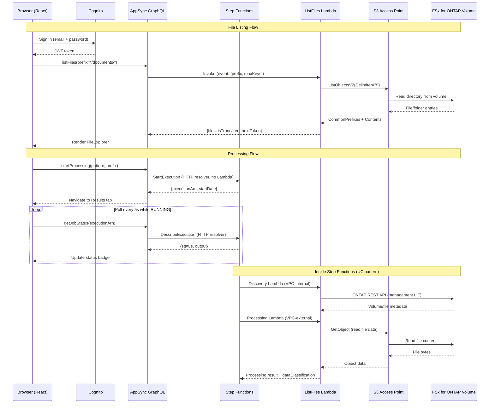

# FSx for ONTAP 檔案入口 — Amplify Gen2

🌐 **語言**: [日本語](README.ja.md) | [English](README.md) | [한국어](README.ko.md) | [简体中文](README.zh-CN.md) | 繁體中文 | [Français](README.fr.md) | [Deutsch](README.de.md) | [Español](README.es.md)

基於 Web 的檔案入口，透過 S3 Access Point 瀏覽、處理和檢視 FSx for ONTAP 卷上的檔案結果。

## 為什麼要建構檔案入口？

AWS 提供了建構模組（S3 API、Cognito、AppSync），但沒有提供整合的託管服務來為 FSx for ONTAP 上的 NAS 資料提供類似 Box 或 Google Drive 的檔案管理體驗。要為最終使用者提供基於瀏覽器的檔案存取、處理觸發和結果檢視，需要自行組裝解決方案。本專案是使用 Amplify Gen2 的一種實作方式。

參見：[檔案入口 UI 選擇指南（Amplify / Nextcloud / Custom）](../../docs/file-portal-amplify-gen2.md)

## 文件

- **[使用者指南](../../docs/en/portal-user-guide.md)** — 日常入口使用的最終使用者指南（無需部署知識）
- **[快速入門](docs/GETTING-STARTED.md)** — 設定、DemoMode、VPC Endpoints、生產檢查清單
- **[實作指南](docs/IMPLEMENTATION.md)** — 架構、設定檔、元件結構、部署、變更日誌
- **[管理員示範指南](../../docs/en/admin-resource-management-demo.md)** — 資源管理 + ARP/AI E2E 示範場景
- **[AI Agent 示範指南](docs/ai-agent-demo-guide.en.md)** — AI Agent Chat、語意搜尋、護欄、HITL
- **[架構圖索引](../../docs/architecture-diagrams.en.md)** — 全部 13 張圖（淺色主題 / 深色主題）

## 主要功能

| 功能 | 說明 |
|---------|-------------|
| **Storage Dashboard** | 4 卡片健康總覽（容量、ARP 威脅、已鎖定快照、效率）— 管理員著陸頁 |
| **Welcome Onboarding** | 首次使用者 3 步導覽教學（瀏覽 → AI → 保護） |
| **ARP/AI Incident Lifecycle** | 狀態追蹤：Detected → Contained → Investigating → Resolved |
| **S3 Object Lock Management** | 輸出桶的狀態顯示 + 保留期配置 |
| **EMS Event Viewer** | 來自 Event Management System 的 ONTAP 警示/錯誤事件 |
| **PHI Guardrail** | 阻止 /dicom/、/phi/、/pii/ 路徑的 AI 處理 |
| **SMB Encryption Toggle** | SMB 3.0 傳輸加密 ON/OFF（含用戶端相容性警告） |
| **Export Policy CRUD** | 策略建立/刪除（不僅是規則，是策略層級） |
| **VolumeSelector Search** | 伺服器端萬用字元篩選 + 大規模環境 300ms 防抖 |
| **Tamperproof Lock** | 含 FISC/SOX/HIPAA 保留預設的內嵌鎖定表單 |
| **8-Language i18n** | JA/EN/KO/ZH-CN/ZH-TW/FR/DE/ES（執行時即時切換） |
| **AI Agent Chat** | 透過 Bedrock Converse + tool_use 的自然語言檔案操作（3 種模式：KB/Agent/Multi） |
| **Multimodal Input** | 拖放圖片上傳 + Bedrock Vision API 分析 |
| **Chat History** | DynamoDB 持久化工作階段（自動儲存和還原） |
| **Agent Directory** | 自訂代理登錄檔（建立表單、分類篩選、共享功能） |
| **Multi-Agent Teams** | 角色指派（Supervisor/Collaborator/Reviewer）團隊精靈 |
| **KB Smart Routing** | 多租戶存取控制的基於群組的 KB 搜尋範圍篩選 |
| **Admin Feature Gates** | AI 功能預設停用，從管理面板按功能切換 |

## 架構


*圖: Amplify Gen2 門戶架構 — VPC 外的 Lambda 透過 S3 Access Point 讀寫 FSx for ONTAP 卷冊*

> 上圖為淺色主題（白色背景）。若您偏好深色模式，請使用[深色主題版本](../../docs/images/amplify-vpc-split-en-dark.svg)。[架構圖索引](../../docs/architecture-diagrams.en.md)彙整了全部 13 張圖，並同時提供淺色與深色連結。

以下是同一架構的文字表示。

```
┌──────────────────────────────────────────────────────────┐
│  Amplify Gen2                                            │
│  ┌──────────┐  ┌─────────────────────────────────────┐   │
│  │ Cognito  │  │ AppSync GraphQL API                 │   │
│  │ Auth     │  │  startProcessing → Step Functions   │   │
│  │ +MFA     │  │  getJobStatus → Step Functions      │   │
│  │ +SAML    │  │  listFiles → Lambda → S3 AP         │   │
│  └──────────┘  └──────────────┬──────────────────────┘   │
│                               │                          │
│  ┌─────────────────────────────────────────────────────┐ │
│  │ CDK (in data stack)                                 │ │
│  │  - HTTP Data Source → states.<region>.amazonaws.com │ │
│  │  - Lambda Data Source → ListFiles (Python 3.13)     │ │
│  └─────────────────────────────────────────────────────┘ │
└──────────────────────────────────────────────────────────┘
          │                              │
          ▼                              ▼
┌──────────────────┐          ┌─────────────────────────┐
│ Step Functions   │          │ FSx for ONTAP           │
│ (UC pattern or   │          │ S3 Access Point         │
│  test workflow)  │          │ (Internet-origin)       │
└──────────────────┘          └─────────────────────────┘
```

### 請求流程（序列圖）



---

## 入口 UI — 側邊欄佈局（12 個部分）


*左側邊欄：分組導覽。中央：活動部分內容。右側：AI 助手（檔案選取時）。*

| 群組 | 部分 | 用途 |
|-------|---------|---------|
| **Browse** | All Files | 瀏覽、預覽、AI Q&A、共享連結、QR 存取 |
| | Favorites | 釘選檔案（DynamoDB，每位使用者） |
| | Recent | 最近存取的檔案 |
| | Upload | 透過 Storage Browser for S3 拖放上傳 |
| **AI & Processing** | AI Processing | 觸發 AI/ML 工作流程（Step Functions） |
| | Job History | 歷史執行記錄（DynamoDB，擁有者範圍） |
| | Analytics | 基於 Glue Data Catalog 的 Athena SQL |
| **Data Protection** | Snapshots | ONTAP 快照列表 + FlexClone 還原 |
| | Lock | SnapLock (WORM) + S3 Object Lock 狀態 |
| | ARP/AI | Autonomous Ransomware Protection 狀態 |
| **Admin** | Version Diff | 快照間的並排檔案比對 |
| | Audit Trail | CloudTrail S3 資料事件（誰/何時/什麼） |


*AI Processing：選擇模式 + 輸入路徑 → 向 Step Functions 提交工作*


*ARP/AI：勒索軟體偵測狀態、警示數量、自動快照清單*

### 附加功能

| 功能 | 說明 |
|---------|-------------|
| **My Files（群組路由）** | Cognito 群組 → 每團隊不同的 S3 AP |
| **CONFIDENTIAL 護欄** | 阻止機密檔案（CUI/CONFIDENTIAL）的 AI 處理 |
| **AI 中繼資料徽章** | 內嵌分類標籤、Rekognition 標籤、實體計數 |
| **QR 碼存取** | Presigned URL → QR PNG（用於 OT/製造平板電腦） |
| **Presigned URL 共享** | 可配置 TTL 的共享連結（5 分鐘~1 小時） |
| **cdk-nag 合規** | synth 時強制執行 AwsSolutionsChecks |
| **備用 UI** | ONTAP 未連線時顯示資訊面板（無白屏） |

> **詳細部分指南**：[docs/portal-tabs-guide.md](docs/portal-tabs-guide.md)

---

## 前置條件

| 需求 | 版本 / 備註 |
|---|---|
| Node.js | 18.17+（Amplify Gen2 必要） |
| AWS CLI | v2（已設定憑證） |
| AWS 帳戶 | Amplify、Cognito、AppSync、Lambda、Step Functions 權限 |
| OS | macOS 或 Linux（Windows：使用 WSL2 或直接執行 npm 指令碼） |
| （選用）FSx for ONTAP | 已掛載 **Internet-origin** S3 AP（本入口不支援 VPC-origin） |
| （選用）已部署的 UC 模式 | 用於 Step Functions 整合 |

> ⚠️ **沙盒資源在明確刪除前會持續保留。** 測試後請務必執行 `make sandbox-delete` 以避免留下孤立的 AWS 資源（Cognito User Pool、AppSync API、Lambda）。參見[清理](#清理)。

---

## 快速開始（5 分鐘）

> **耗時**：首次設定約需 15 分鐘（npm install ~2 分鐘 + CDK bootstrap + 沙盒部署 ~10-13 分鐘）。後續迭代快得多（Lambda 程式碼變更 ~30 秒，基礎設施變更 ~3 分鐘）。

> **多開發者**：每位開發者獲得獨立的沙盒（透過 OS 使用者名稱識別）。多個團隊成員可在同一 AWS 帳戶上無衝突地工作。使用 `npx ampx sandbox --identifier <name>` 自訂。

```bash
# 1. 安裝相依性
make install

# 2. 建立設定檔（建置/沙盒前必要）
cp amplify/portal-config.example.ts amplify/portal-config.ts
# 編輯 portal-config.ts — 至少設定區域（如美國用 us-east-1，日本用 ap-northeast-1）
# ⚠️ 沒有此檔案，`make sandbox` 和 `npx tsc` 將報錯 "Cannot find module './portal-config'"

# 3. 部署後端到個人沙盒（首次 ~3-5 分鐘，增量 ~30 秒）
make sandbox

# 4. 在另一個終端啟動開發伺服器
make dev

# 5. 在瀏覽器中開啟 http://localhost:5173
#    使用電子郵件註冊 → 驗證碼確認（或使用 CLI：見下文）→ 登入
```

### 首次使用者驗證（CLI 捷徑）

Cognito 會發送驗證郵件，但測試帳戶可透過 CLI 確認：

```bash
# 用 amplify_outputs.json 中的 User Pool ID 替換
aws cognito-idp admin-confirm-sign-up \
  --user-pool-id <USER_POOL_ID> \
  --username "your-email@example.com" \
  --region ap-northeast-1
```

---

## 設定

所有環境特定參數位於 `amplify/portal-config.ts`。

### 設定方式

```bash
cp amplify/portal-config.example.ts amplify/portal-config.ts
```

編輯 `portal-config.ts`：

| 參數 | 必要 | 範例 | 說明 |
|---|---|---|---|
| `region` | 是 | `"ap-northeast-1"` | Step Functions 和 S3 AP 的 AWS 區域 |
| `s3ApAlias` | 否 | `"myap-abc123-s3alias"` | S3 AP 別名或桶名。空白 = "無檔案" |
| `stateMachineArn` | 否 | `"arn:aws:states:..."` | 處理用 Step Functions ARN |
| `stateMachineResourceScope` | 否 | `"*"` | IAM 範圍（生產環境使用特定 ARN） |
| `s3ApResourceArns` | 否 | `["arn:aws:s3:..."]` | S3 AP 的 IAM 範圍（生產環境中限制） |
| `groupApMapping` | 否 | `{"eng": "ap-eng-xxx"}` | Cognito 群組 → S3 AP 別名對應（My Files） |
| `bedrockKbId` | 否 | `"KB123ABC"` | Bedrock Knowledge Base ID（全文搜尋） |

### 環境變數覆寫

可透過設定環境變數替代編輯檔案：

```bash
export AMPLIFY_PORTAL_REGION=ap-northeast-1
export AMPLIFY_PORTAL_S3AP_ALIAS=myap-abc123-s3alias
export AMPLIFY_PORTAL_SFN_ARN=arn:aws:states:ap-northeast-1:123456789012:stateMachine:uc1-workflow
export AMPLIFY_PORTAL_GROUP_AP_MAPPING='{"engineering":"ap-eng-xxx-s3alias","legal":"ap-legal-xxx-s3alias"}'
export AMPLIFY_PORTAL_BEDROCK_KB_ID=KB123ABC
```

---

## 部署指南

### 快速示範路徑（最快）

```bash
make install
cp amplify/portal-config.example.ts amplify/portal-config.ts
make sfn-test-create   # 建立測試 SFn — 記下輸出中的 ARN
# 編輯 portal-config.ts：將 ARN 貼到 stateMachineArn
# 編輯 amplify/data/resolvers/start-processing.js：貼上 ARN（第 6 行）
make sandbox
make dev
```

> **兩處 ARN 同步**：狀態機 ARN 必須在 `portal-config.ts`（IAM 範圍界定用）和 `start-processing.js`（執行時呼叫用）兩處設定。這是 APPSYNC_JS 解析器在執行時無法讀取 CDK 參數的已知限制。參見[已知陷阱 #6](#6-兩處-arn-設定)。

### DemoMode（無 FSx for ONTAP）

無 FSx for ONTAP 開發時：

1. 將 `s3ApAlias` 留空（檔案標籤顯示「無檔案」）或設定一般 S3 桶名
2. 建立測試 Step Functions 狀態機：`make sfn-test-create`
3. 將傳回的 ARN 貼到 `portal-config.ts`
4. 重新部署：`make sandbox`

### 連線 FSx for ONTAP S3 Access Point

1. 在 FSx for ONTAP 卷上建立 S3 AP（建議 Internet-origin）
2. 從 AWS 主控台 → FSx → S3 Access Points 記下 AP 別名
3. 在 `portal-config.ts` 中設定 `s3ApAlias`
4. 在 `src/portal-settings.ts` 中設定 `s3ApAlias`（同一別名 — Upload 標籤需要）
5. 重新部署：`make sandbox`

> **注意**：ListFiles Lambda 在 VPC 外部執行（無 VpcConfig）。這是刻意的 — Internet-origin S3 AP 無需 VPC 配置即可存取。如使用 VPC-origin AP，必須為 Lambda 新增 VPC 設定。

> **Upload 標籤**：Storage Browser 使用 Cognito Identity Pool 憑證從瀏覽器直接呼叫 S3 API。所需 IAM 權限由 `backend.ts` 自動佈建（無需手動 IAM 設定）。確保 `s3ApAlias` 在 `portal-config.ts` 和 `src/portal-settings.ts` 中均已設定。

> **Upload 標籤工作流程**：選擇 Location → 點擊 S3 AP alias → 資料夾導覽 → 選擇檔案預覽/下載，或拖放上傳。上傳的檔案可從 NFS/SMB 立即存取（ONTAP strong consistency）。

> **吞吐量說明**：S3 AP 操作與 NFS/SMB 工作負載共享 FSx for ONTAP 吞吐量容量。有關並行使用者規劃，參見[吞吐量和容量規劃](../../docs/file-portal-amplify-gen2.md#スループットと容量計画)。

> **效能說明**：ListFiles Lambda 對於 < 100 個物件的目錄通常在 100-300ms 內回應。對於 1000 個物件（最大單頁），預期 300-800ms。Lambda 設有 30 秒逾時作為安全網，但正常操作遠低於 1 秒。

### 連線已部署的 UC 模式

部署 UC 模式後（如從儲存庫根目錄執行 `make deploy-uc1`）：

1. 從 CloudFormation 輸出中記下 State Machine ARN
2. 在 `portal-config.ts` 中設定 `stateMachineArn`
3. 更新 `start-processing.js` 解析器中的 ARN
4. 重新部署：`make sandbox`

---

## 已知陷阱（經驗教訓）

驗證過程中發現的可節省除錯時間的問題：

### 1. APPSYNC_JS 解析器限制

AppSync JavaScript 解析器（APPSYNC_JS 執行時）有重要限制：

| ❌ 不允許 | ✅ 替代方式 |
|---|---|
| `new Date()` | `util.time.nowISO8601()` 或傳回 epoch，在前端解析 |
| 範本字面值（`` `${x}` ``） | 字串串接（`"a" + b + "c"`） |
| `async/await` | 僅同步 |
| 全域建構函式（`String()`、`Number()`） | 直接使用值 |

### 2. 跨堆疊資料來源繫結

資料來源（HTTP、Lambda）**必須**新增到與 AppSync API 相同的 CDK 堆疊中。如果使用 `backend.createStack()` 建立資料來源，解析器會因參考不同的 CloudFormation 堆疊而報 "Data source not found" 錯誤。

**解決方案**：使用 `Stack.of(api)` 取得資料堆疊，並在其中新增所有資料來源。

### 3. Step Functions Epoch 秒

`DescribeExecution` 傳回的 `startDate` 和 `stopDate` 是 Unix epoch **秒**（非毫秒，非 ISO 8601）。解析器以字串傳回；前端乘以 1000 用於 JavaScript `Date`。

### 4. S3 桶 vs S3 Access Point 的 IAM 權限

Lambda IAM 策略使用 `arn:aws:s3:*:*:accesspoint/*` 涵蓋 S3 Access Point。如果 DemoMode 測試使用**一般 S3 桶**，需要新增桶格式的 ARN 權限：

```bash
# 暫時：透過 CLI 新增測試用
aws iam put-role-policy --role-name <LAMBDA_ROLE_NAME> \
  --policy-name S3BucketTestAccess \
  --policy-document '{"Version":"2012-10-17","Statement":[{"Effect":"Allow","Action":["s3:ListBucket","s3:GetObject"],"Resource":["arn:aws:s3:::<BUCKET>","arn:aws:s3:::<BUCKET>/*"]}]}'
```

或在 `portal-config.ts` 的 `s3ApResourceArns` 中包含桶 ARN。

### 5. Cognito 驗證郵件

使用不存在電子郵件地址的測試帳戶無法收到驗證碼。使用 CLI 捷徑：

```bash
aws cognito-idp admin-confirm-sign-up \
  --user-pool-id <USER_POOL_ID> \
  --username "test@example.com" \
  --region <REGION>
```

### 6. 兩處 ARN 設定

Step Functions 狀態機 ARN 必須在**兩處**設定：

1. `amplify/portal-config.ts` → `stateMachineArn`（CDK 中 IAM 策略範圍界定用）
2. `amplify/data/resolvers/start-processing.js` → `const stateMachineArn = "..."`（AppSync 解析器執行時使用）

此重複存在是因為 APPSYNC_JS 解析器在執行時無法讀取 CDK 參數或環境變數。它們是由 AppSync 內建執行時評估的靜態 JavaScript。

**忘記更新其中一處**是最常見的部署問題。

### 7. 解析器中的 State Machine ARN 不是密鑰

`start-processing.js` 中寫死的 ARN 在原始碼中可見。這是可以接受的，因為：
- ARN 不是密鑰 — 它們識別資源但不授予存取權限
- IAM 策略（而非 ARN）控制誰可以呼叫狀態機
- AppSync API 在任何解析器執行前需要 Cognito 認證

但 ARN 是**環境特定的** — 在 dev/staging/prod 之間切換時務必更新。

---

## 開發命令

| 命令 | 說明 |
|---|---|
| `make install` | 安裝 npm 相依性 |
| `make dev` | 啟動 Vite 開發伺服器（僅前端） |
| `make sandbox` | 部署/更新 Amplify 後端（個人沙盒） |
| `make sandbox-delete` | 刪除所有沙盒資源 |
| `make sandbox-status` | 顯示 CloudFormation 堆疊狀態 |
| `make sfn-test-create` | 建立測試 Step Functions 狀態機 |
| `make sfn-test-delete` | 刪除測試狀態機 + IAM 角色 |
| `make test` | 執行 vitest（單次執行） |
| `make typecheck` | TypeScript 型別驗證 |
| `make lint` | ESLint 檢查 |
| `make build` | 生產建置 |
| `make clean` | 刪除 node_modules、dist、.amplify |
| `make cleanup-all` | 刪除沙盒 + 測試 SFn + 測試 S3 資料 |

---

## 部署耗時（2026-07-20 驗證）

| 步驟 | 首次 | 後續 |
|------|-----------|-----------|
| `npm install` | ~60 秒 | 0 秒（已快取） |
| `make sandbox` | 4-5 分鐘（CDK bootstrap + 完整堆疊） | 20-40 秒（增量） |
| `make sandbox-delete` | ~2 分鐘 | — |
| Cognito 使用者建立（CLI） | 2 秒 | — |
| `make dev` → 瀏覽器 | 2 秒 | 2 秒 |

**總首次設定時間**：從 `git clone` 到可用入口 ~15 分鐘（CDK bootstrap + 初始部署）。後續變更：僅程式碼 ~7 秒，基礎設施變更 ~3 分鐘。

### 生產部署

生產環境（Amplify Hosting + 自訂網域），參見 [Amplify Hosting 生產指南](../../docs/en/amplify-hosting-production-guide.md)。

與沙盒的主要差異：
- 基於分支的 CI/CD（push 到 `main` → 自動部署）
- 帶 ACM 憑證的自訂網域
- WAF 整合用於 DDoS 防護
- SAML/OIDC 替代純電子郵件認證

---

## 已知陷阱 — 額外學習（2026-07-20）

### 8. Upload 標籤需要 `portal-settings.ts` 設定

Upload 標籤（Storage Browser for S3）從 `src/portal-settings.ts` 讀取 `region`、`accountId` 和 `s3ApAlias` — 而非 `amplify/portal-config.ts`。這是因為 Storage Browser 完全在用戶端執行（無 Lambda），需要透過 Cognito Identity Pool 憑證直接存取 S3 API。

如果 Upload 標籤顯示 "Network Error"，請檢查 `portal-settings.ts` 中的 `s3ApAlias` 是否正確。

### 9. ~~Cognito Identity Pool IAM 必須允許 S3 AP 存取~~ （已自動設定）

> **已解決**：`backend.ts` 已變更為透過 CDK 自動為 Cognito Identity Pool 的 authenticated 角色授予 S3 AP 存取權限。無需手動執行 `aws iam put-role-policy`。

`backend.ts` 中以下部分自動設定：
```typescript
authenticatedRole.addToPrincipalPolicy(
  new iam.PolicyStatement({
    sid: "StorageBrowserS3APAccess",
    actions: ["s3:GetObject", "s3:PutObject", "s3:DeleteObject", "s3:ListBucket", "s3:GetBucketLocation"],
    resources: config.s3ApResourceArns,
  })
);
```

如果 Upload 標籤顯示 "AccessDenied"，請確認 `portal-config.ts` 中的 `s3ApResourceArns` 包含正確的 S3 AP ARN。沙盒預設值（`arn:aws:s3:*:*:accesspoint/*`）可存取所有 AP。

> **Storage Browser 認證模式**：Storage Browser 使用**直接認證模式**（`getLocationCredentials` + `listLocations`），而非 `createManagedAuthAdapter`（需要 S3 Access Grants）。無需設定 S3 Access Grants。

### 10. 沙盒刪除是完整的

`make sandbox-delete` 會移除所有資源（Cognito User Pool、AppSync API、Lambda 函式、DynamoDB 資料表、IAM 角色）。使用者帳戶、工作歷史和 API 端點將被永久刪除。沒有部分清理選項。

### 11. 多開發者沙盒

每位開發者獲得以 OS 使用者名稱為鍵的隔離沙盒。在不同機器（或不同使用者名稱）上執行 `make sandbox` 會建立獨立的堆疊：

```
amplify-fsxns3apamplifyportal-yoshiki-sandbox-ae70db2b34  ← 開發者 1
amplify-fsxns3apamplifyportal-tanaka-sandbox-bf81ec3c45   ← 開發者 2
```

它們共享同一 AWS 帳戶但互不干擾。使用 `npx ampx sandbox --identifier custom-name` 指定明確名稱。

---

## 專案結構

```
amplify-portal/
├── amplify/
│   ├── backend.ts                  # 進入點 — 匯入設定，建立資料來源 + Lambda
│   ├── portal-config.ts            # 使用者設定（git-ignored）
│   ├── portal-config.example.ts    # 範本 — 複製後自訂
│   ├── auth/resource.ts            # Cognito（email + MFA + SAML/OIDC 預留位置）
│   ├── data/
│   │   ├── resource.ts             # AppSync 結構描述（查詢、變更、自訂類型）
│   │   └── resolvers/              # APPSYNC_JS 解析器（7 個檔案）
│   │       ├── start-processing.js # HTTP → StepFunctions.StartExecution
│   │       ├── get-job-status.js   # HTTP → StepFunctions.DescribeExecution
│   │       ├── list-files.js       # Lambda → S3 AP ListObjectsV2（+ 群組路由）
│   │       ├── list-files-from-ap.js # Lambda → 任意 AP（用於 SnapshotCompare）
│   │       ├── list-snapshots.js   # Lambda → ONTAP Snapshot 列表（VPC）
│   │       ├── search-files.js     # Lambda → Bedrock KB Retrieve
│   │       ├── get-file-metadata.js # Lambda → DynamoDB AI 中繼資料
│   │       ├── get-presigned-url.js # Lambda → Presigned URL 產生
│   │       ├── generate-qr-code.js # Lambda → Presigned URL + QR PNG
│   │       ├── query-audit-log.js  # Lambda → Athena（CloudTrail）
│   │       ├── ask-about-file.js   # Lambda → Bedrock Converse API
│   │       ├── detect-labels.js    # Lambda → Rekognition DetectLabels
│   │       └── run-athena-query.js # Lambda → Athena StartQueryExecution
│   └── custom/
│       └── step-functions.ts       # （參考 — 已移至 backend.ts）
├── src/
│   ├── main.tsx                    # Amplify configure + Authenticator 包裝器
│   ├── App.tsx                     # 6 標籤殼（Files/Upload/Process/Results/History/Analytics）
│   ├── portal-settings.ts         # 前端設定（Upload 標籤、region、accountId）
│   └── components/
│       ├── FileExplorer.tsx        # 目錄瀏覽 + 分頁 + 共享連結
│       ├── FilePreview.tsx         # 透過 Presigned URL 的圖片預覽 + Rekognition 標籤
│       ├── ShareLink.tsx           # Presigned URL 共享連結產生器（TTL 可選）
│       ├── StorageBrowserTab.tsx   # Storage Browser for S3（Upload 標籤）
│       ├── AiPanel.tsx             # Bedrock Q&A 聊天介面
│       ├── AthenaQueryPanel.tsx    # SQL 編輯器 + 結果表格
│       ├── AuditLog.tsx            # 檔案存取稽核追蹤（CloudTrail → Athena）
│       ├── VersionHistory.tsx      # ONTAP Snapshot 列表 + 還原觸發
│       ├── SnapshotCompare.tsx     # 並排比對（目前 vs FlexClone）
│       ├── JobSubmitForm.tsx       # UC 模式選擇 + 工作提交
│       ├── ResultsViewer.tsx       # 狀態（基於訂閱）+ 輸出顯示
│       ├── FlexCloneStatus.tsx     # 複製建立進度
│       ├── RestoreFromSnapshot.tsx # FlexClone 觸發對話方塊
│       ├── JobHistory.tsx          # 歷史執行（DynamoDB）
│       └── LoadingSkeleton.tsx     # 認證載入預留位置
├── functions/
│   ├── notification-bridge/handler.py  # EventBridge → DynamoDB（FPolicy + SFTP 事件）
│   └── job-status-updater/handler.py   # Step Functions → DynamoDB（WebSocket 推送）
├── monitoring/
│   └── dashboard.ts               # CloudWatch Dashboard CDK 建構
├── docs/
│   ├── portal-tabs-guide.md       # 6 標籤詳細指南（含截圖）
│   └── screenshots/               # 入口 UI 截圖
├── tests/
│   └── components/App.test.tsx     # 標籤渲染 + 導覽測試
├── amplify_outputs.json            # 由沙盒自動產生（git-ignored）
├── package.json
├── Makefile                        # 所有工作流程命令
└── README.md
```

---

## 清理

> ⚠️ **重要**：沙盒資源不會自動刪除。在您明確移除前會保留在 AWS 帳戶中。

### 刪除沙盒（開發資源）

```bash
make sandbox-delete
# 或手動：
npx ampx sandbox delete
```

移除內容：Cognito User Pool、AppSync API、Lambda 函式、IAM 角色。

### 刪除測試資源

```bash
make sfn-test-delete    # 移除測試 Step Functions 狀態機
make cleanup-all        # 完整清理（沙盒 + SFn + 測試 S3 資料）
```

### 預估費用（沙盒）

| 資源 | 月度費用（閒置） |
|---|---|
| Cognito User Pool | $0（< 50K MAU 免費） |
| AppSync | $0（< 250K 請求免費） |
| Lambda | $0（< 1M 請求免費） |
| **合計（沙盒閒置）** | **~$0** |

---

## 生產考量事項

超出沙盒的部署：

### 認證

在 `amplify/auth/resource.ts` 中取消註解 SAML 或 OIDC 部分以實現企業 SSO。

### IAM 最小權限

> ⚠️ **安全警告**：預設 `stateMachineResourceScope: "*"` 授予 AppSync 資料來源呼叫帳戶中**任何**狀態機的權限。這僅適用於個人沙盒。對於任何共享或生產環境，請限制為特定 ARN 模式。

在 `portal-config.ts` 中限制：
- `stateMachineResourceScope` → 特定狀態機 ARN 或模式（如 `"arn:aws:states:ap-northeast-1:123456789012:stateMachine:uc*"`）
- `s3ApResourceArns` → 特定 AP ARN

### 稽核追蹤（CloudTrail）

入口觸發 Step Functions 時，CloudTrail 記錄 **AppSync 服務角色**為呼叫者 — 而非最終使用者。為實現稽核可追溯性，`start-processing.js` 解析器在 Step Functions 執行輸入中嵌入了 `userId` 欄位。查詢執行歷史以將操作對應回使用者。

### 託管

透過 Amplify Hosting（Git CI/CD）部署前端或建置並託管在 CloudFront + S3：

```bash
make build
# 將 dist/ 上傳到 S3 + CloudFront，或將 Git 儲存庫連線到 Amplify Hosting
```

### 監控

新增 CloudWatch 警示：
- AppSync：4xx/5xx 錯誤率
- Lambda（ListFiles）：錯誤計數、持續時間 p99
- Step Functions：失敗執行計數

為 AppSync 請求日誌和 Step Functions 執行歷史設定 CloudWatch Logs 保留期以滿足稽核/合規要求。

### 存取控制

目前骨架允許任何已認證使用者查詢任意執行 ARN。生產環境中應實作基於擁有者的授權（在 DynamoDB 中儲存執行 → userId 對應）。

> **檔案層級可見性說明**：入口的 Cognito 認證控制誰可以存取 AppSync API。但檔案層級存取控制（使用者可以看到/修改哪些檔案）由 ONTAP 卷上 S3 AP 的**檔案系統識別**決定，而非 Cognito 群組。如果所有入口使用者共享同一 S3 AP（相同 UNIX/Windows 識別），他們將看到相同檔案。要實現每使用者檔案隔離，需建立具有不同檔案系統識別的獨立 S3 AP。

### 內嵌 Lambda 程式碼

ListFiles Lambda 以內嵌方式定義（`backend.ts` 中的字串）。生產環境中：
- 提取到帶有適當錯誤處理和日誌記錄的獨立 Python 檔案
- 新增單元測試
- 考慮使用 Lambda Layer 共享相依性

### Amplify Gen2 API 穩定性

Amplify Gen2 正在積極演進。鎖定 `@aws-amplify/*` 套件版本並在升級後測試。早期生命週期中次要版本可能出現破壞性變更。

> **現場示範提示**：提前部署沙盒（`make sandbox`），示範期間僅執行 `make dev`。沙盒部署首次執行需 3-5 分鐘。

---

## 相關文件

- [檔案入口 UI 選項（Amplify / Nextcloud / Custom）](../../docs/file-portal-amplify-gen2.md)
- [部署執行手冊 (EN)](../../docs/en/portal-deployment-runbook.md) | [JA](../../docs/ja/portal-deployment-runbook.md)
- [含截圖的示範指南 (EN)](../../docs/en/portal-demo-guide.md) | [JA](../../docs/ja/portal-demo-guide.md)
- [SaaS 差距分析和功能請求 (JA)](../../docs/aws-feature-requests/file-portal-service-gap.md) | [EN](../../docs/aws-feature-requests/file-portal-service-gap.en.md)
- [全文搜尋設計決策](../../.private/design-decisions/c4-fulltext-search-comparison.md)（gitignored — private）
- [入口路線圖 (P0-P4)](../../.private/file-portal-roadmap.md)（gitignored — private）
- [Quick Desktop MCP 設定（AgentCore Gateway）](../../docs/quick-desktop-mcp-setup.md)
- [Nextcloud External Storage 設定](../../docs/nextcloud-external-storage-s3ap.md)
- [S3AP 相容性說明](../../docs/s3ap-compatibility-notes.md)
- [示範模式指南](../../docs/demo-mode-guide.md)
- [Storage Browser 示範指南](../../docs/en/storage-browser-demo-guide.md)

---

🌐 **語言**: [日本語](README.ja.md) | [English](README.md) | [한국어](README.ko.md) | [简体中文](README.zh-CN.md) | 繁體中文 | [Français](README.fr.md) | [Deutsch](README.de.md) | [Español](README.es.md)
