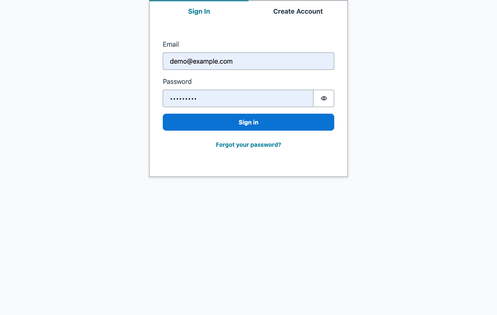
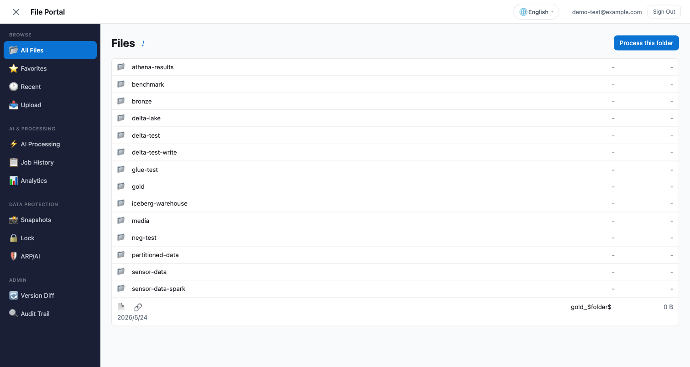
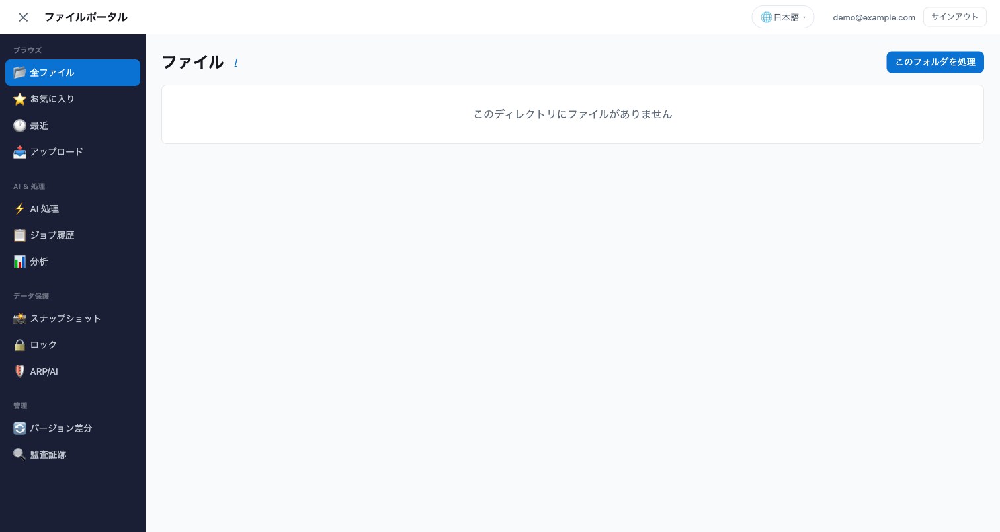
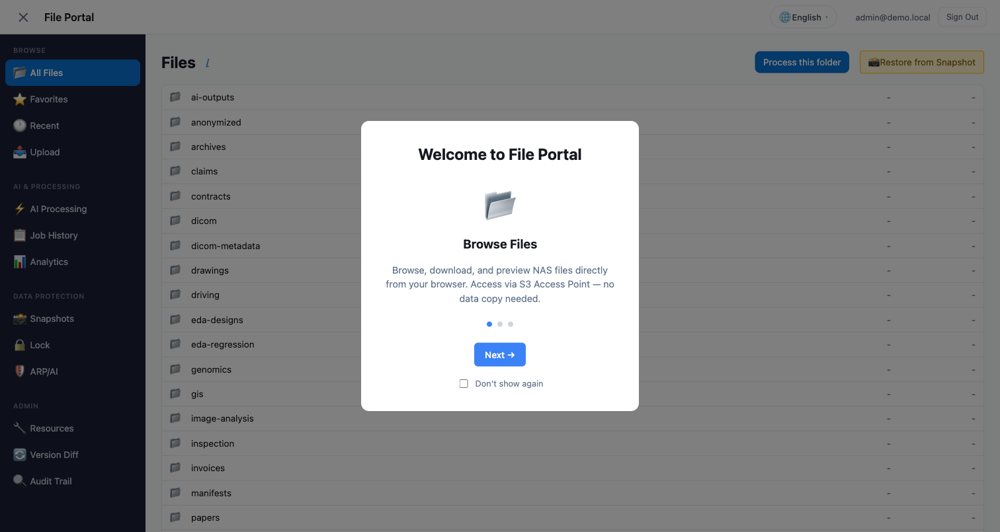
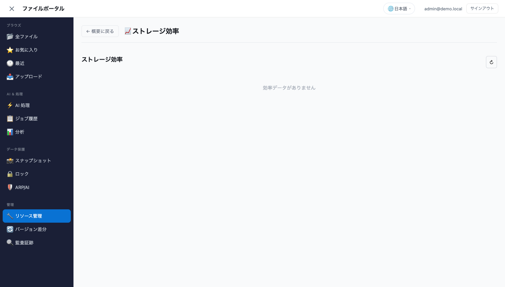
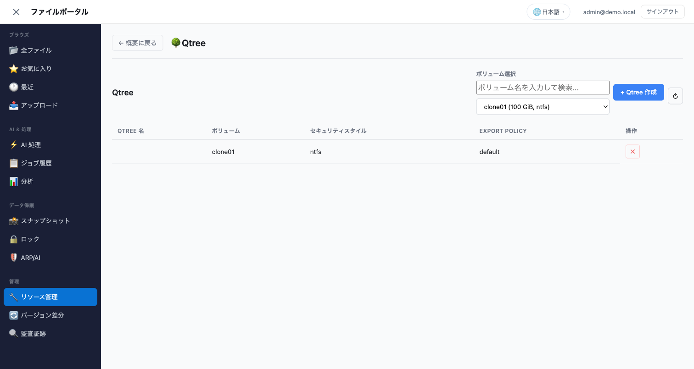
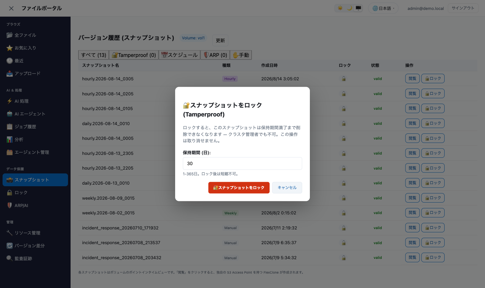

# ポータル UI を拡張する — 開発者ガイド

🌐 **Language / 言語**: 日本語 | [English](CONTRIBUTING-UI.en.md)

> ポータルに**機能を追加する / 既存の画面を直す**開発者向けの文書です。
> 「どこを触ると何が壊れるか」と「どのゲートが何を捕まえるか」を、実際に壊した順に書いています。
>
> 使い方だけ知りたい場合は [ユーザーガイド](../../../docs/ja/portal-user-guide.md)、
> 環境を作る場合は [Getting Started](GETTING-STARTED.md) を先に読んでください。
>
> **Amplify がはじめての方は、次の「まず全体像」から「手を動かす」までを順に読んでください。**
> 章 0 以降は、どのゲートが何を捕まえるかという設計の話で、最初に読む必要はありません。

---

## まず全体像 — 画面のどこが、どのファイルか

拡張の第一歩は「直したい画面がどのファイルか」を当てることです。ポータルは**左のサイドバーで
セクションを切り替える 1 画面構成**で、サイドバーの 1 項目が 1 コンポーネントに対応します。


対応関係はこの 3 か所を見れば分かります。

| 知りたいこと | 見る場所 |
|---|---|
| サイドバーにどの項目があるか | `src/App.tsx` の `NAV_ITEMS`（`{ id, icon, labelKey, group }` の配列）|
| その項目を選んだとき何が描かれるか | 同じ `src/App.tsx` の `{activeSection === "..." && <XxxPanel />}` |
| 項目のラベル文字列 | `src/i18n/locales/ja.ts` の `labelKey` と同名のキー |

管理系のパネルは `src/components/admin/` に、ファイル操作系は `src/components/` にあります。
名前は画面名とほぼ一致します（例: SMB 共有の画面 = `admin/CifsShareManager.tsx`）。

**まず読むのに向いているファイル**は `src/components/admin/EfficiencyPanel.tsx`（132 行）です。
読み取り専用のパネルとして最小の形をしていて、この後の手順で出てくる要素（`dispatch`、
`useQuery`、`t()`、エラー表示）が一通り入っています。

---

## 環境を起動する

コマンドは 2 つです。**1 回目だけ** `sandbox`、以降は `npm start` です。

```bash
cd solutions/amplify-portal

npx ampx sandbox   # 1 回だけ。自分専用の AWS 環境を作り amplify_outputs.json を生成する
npm start          # sandbox + Vite。http://localhost:5173 が開く
```

`npx ampx sandbox` は Amplify Gen2 が**自分専用のバックエンド**（Cognito、AppSync、Lambda、
DynamoDB）を AWS 上に作るコマンドです。生成される `amplify_outputs.json` は gitignore されて
いて、**これが無いと画面は起動しません**。初回は 3〜15 分かかります（VPC 設定の有無で変わります。
[実測の内訳](verification-results.md#デプロイ時間の記録)）。

起動するとサインイン画面が出ます。



サインイン後がこの画面です。ここまで来れば準備完了です。



> **FSx for ONTAP がまだ無い場合**: `DemoMode=true` なら FSx for ONTAP なしで起動でき、
> 通常の S3 バケットを相手に画面を動かせます。ONTAP 管理パネルは「ONTAP 接続が必要です」と
> 表示されます。手順は [Getting Started](GETTING-STARTED.md) にあります。
>
> **実機のスマートフォンで開きたい場合**: `npm run phone` です。`http://<LAN-IP>` では
> サインインできません（`crypto.subtle` が secure context 限定のため）。

---

## 手を動かす — 3 段階

**いきなり新機能を作らないでください。** 下の 3 段階は、触る範囲とゲートの数がこの順に増えます。
段階 1 を通せば「変更が画面に出るまでの一周」が分かり、段階 3 で「新しい ONTAP 操作を足す」
一周が分かります。

### 段階 1（10 分）— 表示されている文字を 1 つ変える

**目的**: 編集 → 画面反映 → ゲート通過の一周を、壊れる余地のない変更で体験します。

UI の文字列は**コンポーネントには書きません**。8 言語のファイルにキーとして持ち、
`t("キー名")` で引きます。

1. 変えたい文字で `ja.ts` を検索します。

```bash
grep -n "ストレージ効率" solutions/amplify-portal/src/i18n/locales/ja.ts
```

この例では **2 件** 返ります（`dashEfficiency` と `rmEfficiency`）。同じ文字列が別の画面で
使われているので、**どちらのキーかを画面側で確かめてから**変えてください。コンポーネント
（この場合 `src/components/admin/EfficiencyPanel.tsx`）で `t("...")` を検索するのが確実です。
片方だけ変えると、もう片方の画面は古い文字のままになります。

2. 目的のキーの値を書き換えます。

```typescript
// src/i18n/locales/ja.ts
rmEfficiency: "ストレージ効率",   // ← 管理パネル側の見出し
```

既存の訳を直すのは、このように**言語ごと**です（英語表示を変えるなら `en.ts`）。
**新しいキーを足すときだけ違います** — `ja.ts` が他 7 言語の型の源なので、そちらが先です。

3. ブラウザは自動で再読み込みされます（Vite の HMR）。同じ画面を英語で開くと、英語側は
   `en.ts` の値が出ます。




4. **新しいキーを足した場合**は、`ja.ts` に足したあと残り 7 言語にも同じキーを足します。
   キーが欠けると**コンパイルが通りません**（`ja.ts` が型の源で、他は同じキーの `Record`
   として実装されているため）。

```bash
make drift   # 8 言語の網羅と、ハードコード文字列の検査
```

> **やってはいけない書き方**
>
> ```tsx
> <h2>ストレージ効率</h2>                       // ✗ 日本語話者以外に届かない
> <button aria-label="削除">                    // ✗ aria-label も title も placeholder も対象
> <h2>{t("rmEfficiency") || "ストレージ効率"}</h2>   // ✗ 右辺には到達しません（後述）
> <h2>{t("rmEfficiency")}</h2>                      // ✓
> ```
>
> 製品名と技術用語（ONTAP、FlexCache、SnapLock、S3 AP）と SQL リテラルは**訳しません**。

### 段階 2（30 分）— 既存パネルに読み取り専用の行を足す

**目的**: すでにある ONTAP の応答から、画面に出ていない値を 1 つ出します。ハンドラを触らないので
バックエンドの再デプロイが不要です。

例として「ストレージ効率」パネルを使います。この画面です。



`src/components/admin/EfficiencyPanel.tsx` の先頭に、応答の形が `interface` で書かれています。

```typescript
interface VolumeEfficiency {
  name: string;
  dedupe: string;          // ONTAP の enum 文字列。"none" 以外なら有効
  compression: string;
  logicalUsedBytes: number;
  physicalUsedBytes: number;
  savingsRatio: number;
}
```

**この `interface` は「ハンドラが返すもの」の宣言であって、契約ではありません。** 実際に
`interface` と応答がずれていた不具合があり、そのときは画面が空になりました（ファイル先頭の
コメントに経緯があります）。**まず本物の応答を見てください。** ブラウザの開発者ツール →
Network → `adminQuery` のレスポンス、が一番速いです。

手順は 3 つです。

1. `interface` に足したいフィールドを追加する（**ハンドラが実際に返している名前で**）
2. 表のヘッダ（`<th>`）に `t("...")` で見出しを足す。文字列は段階 1 の手順で `ja.ts` へ
3. 行（`<td>`）に値を足す。バイトなら既にある `toGiB()` を使う

```bash
cd solutions/amplify-portal
npx tsc -b && npm run lint && npx vitest run
cd ../.. && make drift
```

> **躓きやすい点**: 値が `undefined` のまま表示されるときは、たいてい**名前の綴りが
> ハンドラと違う**か、`interface` のネストが実際と違います。`interface` は宣言でしかないので、
> TypeScript は「ハンドラがその名前で返すか」を検証できません。

### 段階 3（1 時間）— ONTAP の操作を 1 つ増やす

**目的**: バックエンドから UI までを一周します。ここからは**型が届かない境界**を越えるので、
順番に意味があります。飛ばすと「ボタンは描画されるが押すたびに失敗する」形になります。

この境界がなぜ生まれるかは章 0 に書いていますが、先に手順だけ示します。

**① ハンドラに追加する**（`functions/resource-management/handler.py`）

```python
elif action == "myNewAction":
    return _my_new_action(http, headers, event, user_id)
```

**② 型を再生成する**（手で書かない）

```bash
python3 scripts/portal_action_types.py --emit > solutions/amplify-portal/src/lib/dispatchActions.ts
```

**③ 画面から呼ぶ**

```typescript
import { adminMutate } from "../../lib/dispatch";

await adminMutate<{ success?: boolean }>({
  action: "myNewAction",              // ← 必ずリテラル。変数や計算した名前はチェッカーが読めない
  params: { volumeUuid: vol.uuid },   // ← 名前はハンドラが読むものと 1 文字も違えられない
});
```

**④ 契約を検査する**

```bash
python3 scripts/check_portal_action_params.py
python3 scripts/check_portal_action_params.py --list-opaque   # 静的に読めなかった呼び出し
python3 scripts/portal_action_types.py --check
```

`--list-opaque` に自分の呼び出しが出たら、**検査されていない呼び出し**です。ラッパーを一段
外して `action` をリテラルにしてください。

**⑤ ボリュームを選ばせる場合は既存の部品を使う**

スコープの階層は「ファイルシステム → SVM → ボリューム」です。セレクターは実装済みで、
下の画面のように使います。



```tsx
<VolumeSelector label={t("rmSelectVolume")} onSelect={(vol) => setVolumeName(vol?.name ?? "")} />
```

`onSelect` は **`null` を渡してきます**（SVM が変わって選択が無効になったとき、
プレースホルダーが選ばれたとき）。`vol.name` と書くとコンパイルエラーになります。
そういう型にしてあるのは、**ボリューム名は SVM の中でしか一意ではない**からです。
残った名前を別の SVM で解決すると、別のボリュームに着地します。

**⑥ 取り消せない操作なら、確認だけでは足りない**

SnapLock、Snapshot ロック、S3 Object Lock COMPLIANCE、容量リバランスの開始は**元に戻せません**。
「よろしいですか？」では、押す人が影響範囲を知りません。既存のダイアログは日付と範囲を
文章で述べます。



`SnaplockConfirmDialog` と `src/utils/snaplockConsequences.ts` を使い、ハンドラ側でも
`acknowledgeIrreversible` を必須にしてください（UI を通らない呼び出しにも同じ関門が必要です）。
詳細は章 5 にあります。

### 色を変えるとき

色は `var(--color-*)` で参照します。**値ではなく役割**で対応付けてください。

```tsx
<div style={{ color: "#fff" }}>              // ✗ ダークテーマで読めなくなる。上書きもできない
<div className="my-panel-title">             // ✓ CSS 側で var(--color-text-inverse) を使う
```

同じ画面のライトとダークです。インラインスタイルに色を書くと、片方で破綻します。


新しいトークンを足すときは `:root` と `[data-theme="dark"]` の**両方**に定義します。
片方だけだと `make drift` が落ちます。

---

## 0. 最初に知っておくこと

このポータルには**型が届かない境界**が 2 つあります。ここを越える変更が、これまでの
不具合のほとんどを生みました。

| 境界 | なぜ型が届かないか | 何で守っているか |
|------|------------------|----------------|
| React → Lambda | AppSync のエンドポイントは `action`（文字列）と `params`（JSON 文字列）を取る汎用ディスパッチ。TypeScript は向こう側を見られない | `src/lib/dispatch.ts` 経由の呼び出し + ハンドラから生成した `dispatchActions.ts` + `scripts/check_portal_action_params.py` |
| UI 文字列 → 8 言語 | ハードコードした文字列はコンパイルも lint も通り、日本語話者しか気づかない | `ja.ts` を型の源にした `t()` + `make drift` の i18n 網羅チェック |

汎用ディスパッチになっている理由は、73 個の操作を個別の AppSync フィールドにすると
CloudFormation テンプレートが 1 MB 制限を超えたためです（8 エンドポイントに集約）。
この設計は変えられませんが、**境界の手前で型を回復させる**ことはできます。それが
`dispatch.ts` と生成物の役割です。

---

## 1. リクエストが通る道

```
React コンポーネント
  └─ src/lib/dispatch.ts          … action 名と params を型で照合、activeSvm を自動付与
       └─ AppSync (amplify/data/resource.ts)   … 8 エンドポイント × query/mutation
            └─ amplify/data/resolvers/*-dispatch.js
                 └─ Lambda (functions/<name>/handler.py)
                      └─ ONTAP REST API / S3 AP / Bedrock / Athena
```

| ファイル | 役割 |
|---------|------|
| `amplify/portal-config.ts` | ボリューム名、SVM 名、S3 AP エイリアスなど環境固有の値 |
| `amplify/backend.ts` | CDK。リソース追加とポリシー付与 |
| `amplify/data/resource.ts` | エンドポイント定義と認可（`allow.groups(["storage-admin"])` 等） |
| `functions/*/handler.py` | `action` で分岐する Lambda。ONTAP と話す唯一の層 |
| `src/lib/dispatchActions.ts` | **生成物**。手で編集しない |

---

## 2. アクションを 1 つ追加する

手順は 4 つで、順番に意味があります。

**① ハンドラに追加する**

```python
elif action == "myNewAction":
    return _my_new_action(http, headers, event, user_id)
```

`event` から読むパラメータは、既定値を持たせるかどうかで意味が変わります。既定値のない
必須パラメータは、無いときに明示的にエラーを返してください（黙って別のリソースに
着地させない）。

**② 型を再生成する**

```bash
python3 scripts/portal_action_types.py --emit > solutions/amplify-portal/src/lib/dispatchActions.ts
```

生成物はハンドラが読むパラメータ名から作られます。`svm` を読むアクションは
`ACTIONS_ACCEPTING_SVM` に入り、`dispatch` が現在のスコープを自動で付けます。

**③ 呼び出す**

```typescript
import { adminQuery, adminMutate } from "../lib/dispatch";

const data = await adminMutate<{ success?: boolean }>({
  action: "myNewAction",          // ← リテラルで書く。計算した名前はチェッカーが読めない
  params: { volumeUuid: vol.uuid },
});
```

`client.mutations.*` を直接呼ばないでください。`dispatch.ts` を通らない呼び出しは
パラメータ照合の対象外になります。

**④ 契約を検査する**

```bash
python3 scripts/check_portal_action_params.py
python3 scripts/check_portal_action_params.py --list-opaque   # チェッカーが読めない呼び出し
python3 scripts/portal_action_types.py --check
```

`--list-opaque` に自分の呼び出しが出たら、それは**守られていない呼び出し**です。
ラッパーを一段外して、`action` をリテラルにしてください。

> **なぜこの検査があるか**: `{snapshotName, retentionDays}` を `snapshotId` と `expiryTime`
> を読むアクションに送るコードは、コンパイルも lint も通り、ボタンも描画され、押すたびに
> 失敗します。実際に出荷されました。

---

## 3. 画面を追加する / 直すとき

### クエリキーにスコープを入れる

```typescript
const activeSvm = useActiveSvm();
useQuery({
  queryKey: ["protection", "getArpStatus", activeSvm || null, volumeInScope || null],
  ...
});
```

キーにスコープが無いと、SVM を切り替えたあとに**別 SVM のキャッシュが配られます**。
無効化（invalidate）で隠せますが、値が応答を左右するならキーに入れるのが正しい形です。

### loading / error で早期 return しない

```typescript
// ✗ スコープ選択ごとアンマウントされ、存在しないボリュームを選ぶと復帰できない
if (error) return <div><h2>{title}</h2><OntapFailureNotice error={error} /></div>;

// ✓ ヘッダとスコープ行は常に描画し、本文だけ差し替える
{loading && !data && <p className="loading">{t("loading")}</p>}
{error && <OntapFailureNotice error={error} {...failureDiagnosis(queryError)} />}
```

`isPending` は**クエリキーが変わるたび true に戻る**ので、`loading` だけで判定すると
スコープを変えるたびに画面が消えます。`loading && !data` が「まだ何も無い」の条件です。

### スコープの階層は既存のものを使う

ファイルシステム（接続で固定）→ SVM → ボリュームの 3 層です。アグリゲートは
FSx for ONTAP では AWS が管理し利用者が選べないので、階層に入れません。

```tsx
{/* 見出しの横。応答が名指したボリュームと、それが選択なのか既定なのかを出す */}
<VolumeScopeBadge volumeName={volumeName} isDefault={!volumeInScope} />

{isStorageAdmin === true && (
  <div className="protection-scope">
    <SvmSelector />
    <span className="protection-scope-chain" aria-hidden="true">›</span>
    <VolumeSelector label={t("rmSelectVolume")} onSelect={(vol) => { ... }} />
  </div>
)}
```

バッジは「どのボリュームか」ではなく**「なぜこのボリュームか」**に答えます。選択前に出て
いる名前はデプロイ時に設定されたボリュームで、名前だけでは読者に判別できません。

### VolumeSelector の `onSelect` は `null` を渡してくる

SVM が変わってピックが無効になったとき、およびプレースホルダーが選ばれたときです。
`vol.name` と書くとコンパイルエラーになります（そのためにこの型にしてあります）。

```typescript
onSelect={(vol) => setVolumeName(vol?.name ?? "")}
```

ボリューム名は SVM の中でしか一意ではなく、**同名ボリュームが別 SVM にあるのは普通**です。
名前で解決するアクション（qtree 作成、クォータルール、SnapLock 保持期間）は、残った名前を
新しい SVM で解決して**別のボリュームに着地します**。UUID で解決するアクションは安全です。

### 認可は UI で隠すだけでは足りない

`adminQuery` / `adminMutation` は `allow.groups(["storage-admin"])` でサーバー側が拒否します。
`useStorageAdmin()` は**そのメニューを見せるか**の判断にだけ使います（`null` = 判定中）。

---

## 4. 文字列と色

| 対象 | ルール | 詳細 |
|------|-------|------|
| UI 文字列 | `ja.ts` に追加してから他 7 言語。`t("key")` を使う。JSX テキスト・`aria-label`・`title`・`placeholder` にハードコードしない | [portal-i18n](../../../docs/agent/portal-i18n.md) |
| 翻訳しない語 | 製品名・技術用語（ONTAP, FlexCache, SnapLock, S3 AP）・SQL リテラル | 同上 |
| 色 | `var(--color-*)` を使う。JSX の `style={{ }}` に色リテラルを書かない。新しいトークンは `:root` と `[data-theme="dark"]` の両方に定義 | `src/index.css` |

`t("key") || "既定値"` と書かないでください。`t()` は末尾が `?? key` なので常に truthy で、
右辺には到達しません。キーの綴り間違いはキー名がそのまま画面に出ます。

色は**値ではなく役割**で対応付けます。`white` は文字色なら `--color-text-inverse`、
背景なら `--color-surface` です。インラインスタイルは後から上書きできないので、
そのテーマに固定されます。

---

## 5. 不可逆な操作を追加するとき

SnapLock、Snapshot ロック、S3 Object Lock COMPLIANCE は**取り消せません**。保持期間の
残っているファイルはボリューム → SVM → ファイルシステムの削除をブロックします。

| やること | どこ |
|---------|------|
| 結果を文章で述べる確認ダイアログを出す | `SnaplockConfirmDialog` + `src/utils/snaplockConsequences.ts` |
| ハンドラ側で `acknowledgeIrreversible` を要求する | `functions/*/handler.py` |
| 影響範囲（どのリソースがいつまで削除不能か）を UI に書く | 該当パネル |

日数だけを聞くダイアログは不可逆性を伝えません。「いつまで」「解除できない」を明示します。
背景と実測は [pitfalls-snaplock](../../../docs/agent/pitfalls-snaplock.md) にあります。

---

## 6. テスト

| 対象 | 置き場所 | 実行 |
|------|---------|------|
| React コンポーネント / hooks / lib | `tests/components/`, `tests/hooks/`, `tests/lib/` | `npx vitest run` |
| Lambda ハンドラ | `functions/<name>/tests/` | `python3 -m pytest solutions/amplify-portal/functions/<name>/tests/ -q` |
| CDK / インフラ | `tests/infrastructure/` | `npx vitest run` |

コンポーネントテストは `src/lib/dispatch` をモックします（`tests/components/QtreeManager.test.tsx`
と `tests/components/VolumeSelector.test.tsx` が最小の型です）。

**実機を壊さずに確かめる**: 一覧の打ち切り表示のように「本番の応答を変えないと出ない状態」は、
Lambda の上限を一時的に下げるのではなく、モックした応答で固定します。下げたまま戻し忘れる
リスクと、次回だれも再現できないリスクの両方を避けられます。

---

## 7. コミット前に通すもの

```bash
cd solutions/amplify-portal
npx tsc -b        # 型
npm run lint      # eslint（--max-warnings 0）
npx vitest run    # フロントのテスト

cd ../..
make drift        # 下表のゲート群
make lint         # ruff check + ruff format --check
python3 -m pytest solutions/amplify-portal/functions/<変更した関数>/tests/ -q
```

`make drift` が見ているもののうち、ポータルに関係するのは次です。いずれも**それが無い状態で
一度出荷したことがある**ものです。

| ゲート | 捕まえるもの |
|-------|------------|
| `check_portal_action_params.py` | ハンドラが読まないパラメータ名を送る呼び出し |
| `portal_action_types.py --check` | 生成物とハンドラのアクション集合のずれ |
| `check_portal_drift.py`（テーマ規則） | 色リテラル、インラインスタイルの色、未定義トークン |
| `check_portal_drift.py`（i18n 規則） | 翻訳されていない UI 文字列、8 言語の欠落キー |
| `check_portal_drift.py`（クエリ規則） | `enabled: false` のクエリを `isPending` で loading と読む形（永久スピナー） |
| `test_iac_completeness_rules.py` | 存在しない Cognito グループへの認可、テンプレートが渡さない環境変数の読み取り |
| `check_doc_pairs.py` | JA/EN の片方しかないドキュメント、解決しない相対リンク |

CI 側は `.github/workflows/` の `ci.yml` / `lint.yaml` / `agent-output-audit.yml` /
`iam-policy-validation.yml` が同等の検査をします。

---

## 8. 実際に踏んだ失敗

| 症状 | 原因 | 教訓 |
|------|------|------|
| ロックボタンが一度も動いたことがなかった | 名前と日数を、UUID と絶対時刻を読むアクションに送っていた | 型のない境界は検査で埋める |
| ボタンを押しても何も起きない | プレースホルダーを入力値と誤認して `disabled` のままだった。`.btn-danger` は disabled でも赤く、カーソルも変わらなかった | 押せない理由を画面に書く |
| 有効にした保護が「未設定」と表示される | 画面が接続先の 1 ボリュームしか説明できなかった | スコープを選べるようにする |
| 存在しないボリュームを選ぶと操作不能になる | エラー時にスコープ選択ごと早期 return していた | 復帰手段をアンマウントしない |
| qtree パネルが永久スピナー | ボリューム未選択で `enabled: false`、それを `isPending` で loading と読み、スピナーがボリューム選択 UI を隠した | `isPending` は「保留」であって「読み込み中」ではない |
| 削除したはずのリソースが残る | ONTAP が成功を返して無言で戻した | レスポンスではなく数十秒後の状態で判定する |

---

## 9. 関連ドキュメント

| ドキュメント | 使う場面 |
|-------------|---------|
| [Implementation Guide](IMPLEMENTATION.md) | 設計意図と変更履歴を追うとき |
| [Getting Started](GETTING-STARTED.md) | 環境を作るとき |
| [ONTAP 接続ガイド](ONTAP-CONNECTION-GUIDE.md) | ONTAP パネルにデータが出ないとき |
| [管理機能マップ](admin-capability-map.md) | 20 パネルの実装状況と ONTAP エンドポイント対応 |
| [portal-cdk-quality-gates](../../../docs/agent/portal-cdk-quality-gates.md) | `amplify/` の CDK と cdk-nag |
| [portal-i18n](../../../docs/agent/portal-i18n.md) | 8 言語の詳細規則 |
| [pitfalls-s3ap-ontap](../../../docs/agent/pitfalls-s3ap-ontap.md) | S3 AP / ONTAP API の罠 |
| [CONTRIBUTING](../../../CONTRIBUTING.md) | PR の出し方 |
