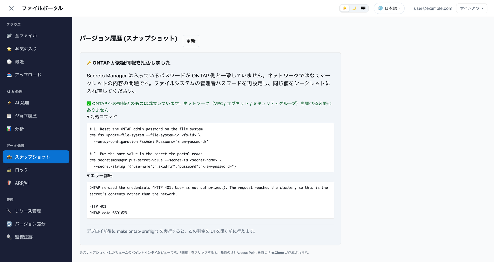
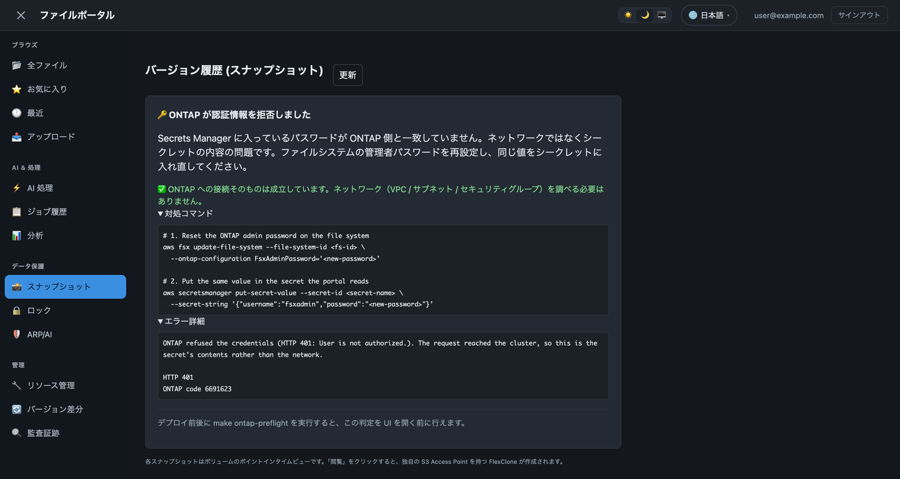
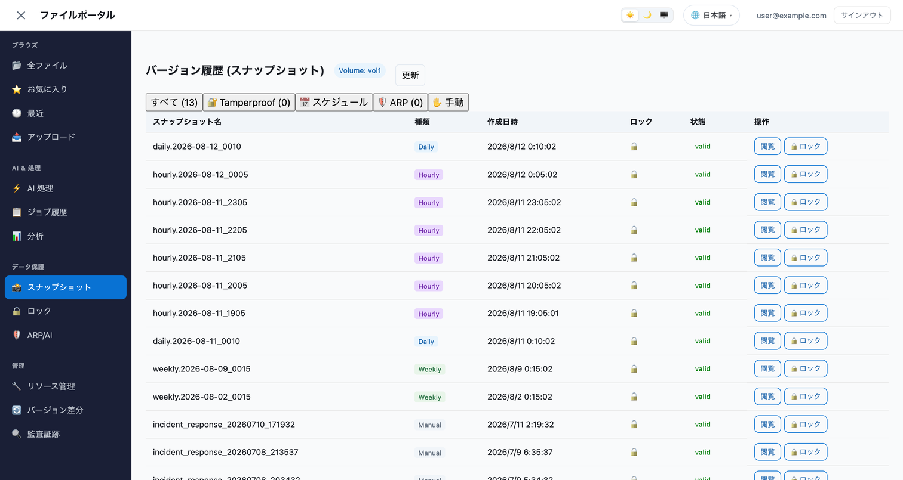

# ONTAP REST API Connection Guide — File Portal

🌐 **Language / 言語**: [日本語](ONTAP-CONNECTION-GUIDE.md) | English

> The connection architecture between the file portal and Amazon FSx for NetApp ONTAP (hereafter FSx for ONTAP), how to troubleshoot it, and the points that matter at deployment time.

## Connection architecture

```
┌──────────────────────────────────────────────────────────────────┐
│ Amplify Gen2 Backend (CDK)                                        │
│                                                                    │
│  AppSync → Lambda (in VPC) → ONTAP REST API (HTTPS/443)         │
│                 │                    │                              │
│                 │                    ├── https://<mgmt-ip>/api/...  │
│                 │                    │   (Basic Auth: fsxadmin)     │
│                 │                    │                              │
│                 ├── Secrets Manager ─┘                              │
│                 │   (fsxadmin credentials)                         │
│                 │                                                    │
│                 └── VPC Endpoint (Secrets Manager)                  │
│                     VPC Endpoint (S3 Gateway)                      │
└──────────────────────────────────────────────────────────────────┘
```

### Which endpoint to connect to (file system vs SVM)

| Endpoint | Scope | User | Purpose |
|-------------|--------|---------|------|
| **File system management IP** | Cluster scope | `fsxadmin` | FlexCache, SnapMirror, Volume, QoS, Export Policy, Snapshot Policy |
| SVM management LIF | SVM scope | `vsadmin` | Operations inside the SVM only (limited) |

**Important**: this portal uses the **file system management IP**. FlexCache and SnapMirror are cluster-scope operations and are not reachable through the SVM management LIF (you get HTTP 401).

### How to look up the IP addresses

```bash
# File system management IP (the one this portal uses)
aws fsx describe-file-systems --file-system-ids <fs-id> \
  --query "FileSystems[0].OntapConfiguration.Endpoints.Management.IpAddresses[0]" \
  --output text

# SVM management LIF IP (not used by this portal)
aws fsx describe-storage-virtual-machines \
  --filters "Name=file-system-id,Values=<fs-id>" \
  --query "StorageVirtualMachines[0].Endpoints.Management.IpAddresses[0]" \
  --output text
```

## Managing the secret

### Secret format

```json
{
  "username": "fsxadmin",
  "password": "<fsxadmin-password>"
}
```

### Creating the secret

```bash
aws secretsmanager create-secret \
  --name fsx-ontap-fsxadmin-credentials \
  --secret-string '{"username":"fsxadmin","password":"YOUR_SECURE_PASSWORD"}' \
  --region <your-region>
```

> **Security note**: Secrets Manager encrypts with the AWS managed KMS key (`aws/secretsmanager`) by default. If a regulatory requirement (FISC, PCI DSS, HIPAA and similar) calls for a customer managed key (CMK), pass `--kms-key-id`. To enable automatic rotation, see [AWS documentation: Rotate secrets](https://docs.aws.amazon.com/secretsmanager/latest/userguide/rotating-secrets.html).

### Changing the password

When you change the FSx for ONTAP `fsxadmin` password, **always update both sides**, and **only run Step 2 once Step 1 has succeeded** (for the reason below):

```bash
NEWPW='NewSecureP@ss2026!'

# Step 1: change the password on the FSx for ONTAP side.
# Proceed to Step 2 only on success -- chain with && or branch explicitly.
if aws fsx update-file-system \
     --file-system-id <fs-id> \
     --ontap-configuration "{\"FsxAdminPassword\":\"$NEWPW\"}" \
     --region <your-region>; then
  # Step 2: sync the value in Secrets Manager
  aws secretsmanager put-secret-value \
    --secret-id fsx-ontap-fsxadmin-credentials \
    --secret-string "{\"username\":\"fsxadmin\",\"password\":\"$NEWPW\"}" \
    --region <your-region>
else
  echo "Step 1 failed, so the secret is left alone"
fi
```

> **Why the branch matters**: running the two unconditionally has produced the case where **Step 1 failed and Step 2 succeeded**. The secret then held a value ONTAP had never received, so the mismatch was not resolved but **made worse**. The only way back is to get Step 1 through and then repeat Step 2. Step 1 validates synchronously, so checking is cheap.

**Password constraints** (Step 1 rejects these synchronously):

| Constraint | Value |
|------------|-------|
| Length | 8-128 characters |
| Required | at least one English letter and one digit |
| **Forbidden** | **must not contain the string `admin`** |

> The last row is easy to miss. Naming the password after `fsxadmin` (`Fsxadmin-...` and similar) trips it, and Step 1 fails with `Provided FsxAdminPassword is not valid`.

> **Note**: if the portal makes an API call between Step 1 and Step 2, authentication fails with the old password. ONTAP records authentication failures and may lock the account out once a threshold is exceeded.

Confirm afterwards with the preflight:

```bash
make ontap-preflight FS_ID=<fs-id> LAMBDA=<name of ResourceMgmtFunction>
# -> 6. [PASS] ONTAP auth / ONTAP accepted the credentials and answered.
```

## Troubleshooting

### Start with `make ontap-preflight`

When an ONTAP panel has no data, the cause is in one of six stages. **Do not reason backwards from the message on screen** — for the reason given below, an earlier version of this portal pointed at the wrong stage. This command walks the six in order and names the one that broke.

```bash
# Stages 1 and 5 (configuration and secret)
make ontap-preflight

# Adds stages 2-4: the file system, SVM and volume really exist
make ontap-preflight FS_ID=fs-0123456789abcdef0

# Adds stage 6: does ONTAP accept the credentials
make ontap-preflight FS_ID=fs-0123456789abcdef0 LAMBDA=<name of ResourceMgmtFunction>
```

| Stage | What it checks | Where to look on a failure |
|:-----:|----------------|----------------------------|
| 1 | The four values are in `portal-config.ts` | `amplify/portal-config.ts` |
| 2 | The file system is AVAILABLE, and **the management IP is its own** | `ontapMgmtIp` |
| 3 | The configured SVM name exists | `ontapSvmName` |
| 4 | The configured volume name is on that SVM | `ontapVolumeName` |
| 5 | The secret is readable, is JSON, and the password has no surrounding whitespace | Secrets Manager |
| 6 | **ONTAP accepts the credentials** | The HTTP 401 section below |

Stage 6 cannot be checked from a laptop: the management LIF is private, so `LAMBDA=` asks the deployed function to make the call on your behalf. Without it, stage 6 reports **SKIP** rather than passing — a green run that never tried the one thing that was wrong is worse than no run at all.

#### What the screen shows

The panel when the credentials were refused. The heading names the cause, the ✅ line states that the network does not need investigating, and the remedy is given as both halves — resetting the file system's password without writing the same value into the secret leaves the portal exactly as broken. The error detail carries ONTAP's own message, the HTTP status and the error code verbatim; that part is deliberately not translated, because it goes into a support case as-is.



Dark theme:



The same panel once the two passwords agree, with the preflight reporting every stage as PASS:



> **Why the order matters**: on the verification environment, stages 1 to 5 all passed and only stage 6 failed. `aws fsx describe-volumes` listed the volume as CREATED and the request reached the cluster over TLS. The cause was a password that Secrets Manager and ONTAP disagreed about. The portal nevertheless displayed "📡 ONTAP connection required" and advice about the VPC, the subnet and the security group. **Naming the wrong layer costs more than saying nothing, because the reader believes it.**
>
> Each panel now classifies the cause into one of five classes (`NOT_CONFIGURED`, `UNREACHABLE`, `CREDENTIALS_REJECTED`, `NOT_FOUND`, `ONTAP_ERROR`) and, when the credentials were refused, states outright that the network does not need investigating. The classification lives in `shared/ontap_diagnosis.py`.

> **If you are investigating a user's report**: what to ask them for (the heading, and the contents of
> "Error details") and a reverse index from symptom to what to check are in the
> [handover and support guide](portal-handover-guide.en.md#what-the-user-said--what-to-check).

### HTTP 401 "User is not authorized"

| Cause | How to check | Action |
|------|---------|------|
| Password mismatch | The value in Secrets Manager differs from the actual FSx password | Sync both sides using "Changing the password" above |
| Account lockout | Many authentication failures (automated tests and similar) exceeded the threshold | Reset the password with `aws fsx update-file-system` → the lock is released |
| Wrong endpoint IP | Connecting to the SVM management LIF as `fsxadmin` | Check the file system management IP with `describe-file-systems` |
| No VPC connectivity | The Lambda cannot reach the ONTAP IP | Check outbound TCP/443 on the security group and the subnet routing |

### Checking in CloudWatch Logs

```bash
# Search the Lambda logs for ONTAP API errors
aws logs filter-log-events \
  --log-group-name "/aws/lambda/<ResourceMgmtFunction name>" \
  --start-time $(( $(date +%s) - 300 ))000 \
  --region <your-region> \
  --query 'events[*].message' --output text \
  | grep -i "ONTAP API error\|401\|flexcache\|snapmirror"
```

### Lambda timeout (over 120s)

FlexCache creation and SnapMirror initialization run as asynchronous jobs on the ONTAP side. With the `return_timeout=0` parameter, ONTAP returns 202 Accepted plus a job UUID immediately, but the first connection to ONTAP (TLS handshake + Basic Auth) takes 4-5 seconds.

Lambda timeout: 120 seconds (set in `backend.ts`). A normal API call completes in 4-8 seconds.

## Notes on FlexCache operations

### Behaviour specific to FSx for ONTAP

- **No aggregate to specify**: FSx for ONTAP uses a single automatically managed aggregate, so the `aggregate_name` parameter can be omitted (the ONTAP REST API selects the default aggregate). On-premises ONTAP may require it explicitly.
- **SVM creation is AWS API only**: an SVM cannot be created from the ONTAP CLI or REST API. Use `aws fsx create-storage-virtual-machine`.
- **FlexCache can be created within the same cluster**: another volume on the same file system can be the origin, with no cluster peering.

### Creation

```
POST /storage/flexcache/flexcaches?return_timeout=0
```

- Without `return_timeout=0`, ONTAP waits synchronously for completion (30-120 seconds, which causes the Lambda timeout)
- Creation is an asynchronous job. It takes 30 seconds to a few minutes. The portal refreshes the list automatically at 10s/30s/60s intervals

### Deletion (3 steps, all required)

A mounted FlexCache volume cannot be deleted directly:

```
1. PATCH /storage/volumes/{uuid} → {"nas": {"path": ""}}      // unmount
2. PATCH /storage/volumes/{uuid} → {"state": "offline"}       // offline
3. DELETE /storage/flexcache/flexcaches/{uuid}?return_timeout=0  // delete
```

The portal's `_delete_flexcache` automates these three steps.

## Notes on SnapMirror operations

### State transitions

| State | Meaning | Permitted operations |
|------|------|---------------|
| `snapmirrored` | Synchronizing normally | sync, break, quiesce |
| `broken_off` | The DP volume is read-write | resync |
| `transferring` | Transferring data | abort |
| `quiesced` | Synchronization paused | resume, break |

### Creation and initialization

The CLI takes three steps — `volume create -type DP` → `snapmirror create` → `snapmirror initialize` — while the portal's `createSnapmirror` does it in one POST.

| Argument | Effect |
|------|------|
| `create_destination.enabled` | ONTAP provisions the destination volume, so nobody has to pre-create it as `-type DP` |
| `create_destination.tiering.supported` | Allows placement on a tiering-enabled aggregate. **It defaults to false**, and every FSx for ONTAP aggregate has tiering enabled, so the default leaves nowhere to put the volume and the create fails (the same trap as `use_tiered_aggregate` on FlexCache) |
| `state: snapmirrored` | Initializes as part of creating. Without it the relationship stays `uninitialized` and the transfer history stays empty |

The POST is issued on the **destination cluster**, which is the one the portal is connected to. That is what makes protecting a volume on another file system a local operation. Conversely, a relationship whose destination lives on another cluster is neither visible nor operable from this portal.

### Prerequisites

- The cluster peer is `available`.
- The SVM peer is `peered` **and lists `snapmirror` among its applications**. A peer created for FlexCache is `peered` and still refuses SnapMirror, returning an error such as `SVM peer permission not found.` that reads as "not peered". Adding `snapmirror` through "Change applications" in the portal's SVM peer list resolves it; the peer does not have to be recreated.

## Behaviour of the Amplify sandbox

### Scope of file change detection

| Directory | Change detected | Lambda code updated |
|------------|:--------:|:--------------:|
| `amplify/` | ✅ automatic | Re-bundled when `backend.ts` changes |
| `functions/` | ⚠️ indirect | Re-bundled only once a file under `amplify/` changes |
| `src/` (frontend) | ✅ Vite HMR | No effect on the Lambda |

**Important**: when you change `functions/resource-management/handler.py`, the sandbox may not detect it automatically. Force the trigger with either of:
1. Change the Lambda `description` in `backend.ts` (this changes the asset hash)
2. Stop the sandbox with Ctrl+C, then restart it

### Why `authMode: "userPool"` is needed

When Amplify Gen2 has multiple authentication providers configured (Cognito User Pools + IAM), failing to pass `authMode` explicitly to `generateClient<Schema>()` means the Cognito ID Token is not sent to AppSync, producing a "User is not authorized" error.

```typescript
// ❌ Does not work: no authMode given
const client = generateClient<Schema>();

// ✅ Correct: the Cognito token is sent
const client = generateClient<Schema>({ authMode: "userPool" });
```

## Deploying to a new environment (end to end)

```bash
# 1. Get the repository
git clone https://github.com/Yoshiki0705/FSx-for-ONTAP-S3AccessPoints-Serverless-Patterns.git
cd FSx-for-ONTAP-S3AccessPoints-Serverless-Patterns/solutions/amplify-portal

# 2. Dependencies
npm install

# 3. Config file (FSx for ONTAP details are discovered for you)
./scripts/setup-prerequisites.sh --fs-id <your-fs-id>
cp amplify/portal-config.example.ts amplify/portal-config.ts
# Copy the printed values into portal-config.ts

# 4. Register the credentials in Secrets Manager
aws secretsmanager create-secret \
  --name fsx-ontap-fsxadmin-credentials \
  --secret-string '{"username":"fsxadmin","password":"<your-password>"}'

# 5. Start
npm start

# 6. Create the first user (the Cognito sign-up screen opens on its own)
# In a browser: http://localhost:5173 → Create Account
```

## Patterns for using this alongside other SaaS tools

| Situation | Combined approach | Role of the portal |
|-----------|-------------|-------------|
| Using a cloud file sharing SaaS | Keep day-to-day file sharing in the SaaS | AI processing and auditing for large data on NAS (EDA, video, HPC results) |
| Running a self-hosted file sharing service | Just add the S3 AP as External Storage | Browse NAS data directly from the existing UI + admin operations in the portal |
| Using groupware (M365 and similar) | Leave the groupware integration as it is | SnapMirror replication management between on-premises NAS and FSx for ONTAP |
| Using a hybrid file service | Keep using the file service | Visibility into data protection (Tamperproof Snapshot) and ransomware defence (ARP/AI) |

**Design philosophy**: this portal is not a "replacement" for an existing file sharing tool. It is a layer providing **AI processing + data protection visibility + admin operations** over NAS data. Day-to-day file sharing continues in the existing tool, while NAS-specific features (Snapshot, FlexClone, FlexCache, SnapMirror, ARP) become operable from a browser.


## Future Improvements

The items below were identified during review:

### Performance visibility
- **Cache hit ratio display** (EDA/VFX workloads): use the `cache_hit_ratio` field of the ONTAP REST API to show the live hit ratio on a dashboard
- **Throughput / IOPS graphs**: draw on CloudWatch metrics or the ONTAP REST metrics API

### Operational automation
- **RPO alerts**: SNS notification plus a UI warning badge when SnapMirror lag exceeds a threshold (implemented: the UI warning)
- **FlexCache prepopulate**: allow an initial warm-up directory to be specified at creation time
- **Automated secret rotation**: periodic password update via a Lambda rotation function

### UX improvements
- **FlexCache creation wizard**: origin volume dropdown (implemented: datalist), automatic size suggestion (10% of the origin)
- **Inline delete confirmation UI**: window.confirm() → a custom confirmation dialog (ARIA support)
- **Multi file system switching**: define several file systems in portal-config and switch between them in the UI

### Auditing and compliance
- **Operation audit trail**: write every operation to DynamoDB (who / when / what)
- **mTLS support**: make CA verification of the ONTAP self-signed certificate optional

### Accessibility
- **ARIA dialog pattern**: aria-modal + focus trap on confirmation dialogs
- **aria-label on status badges**: screen reader support
