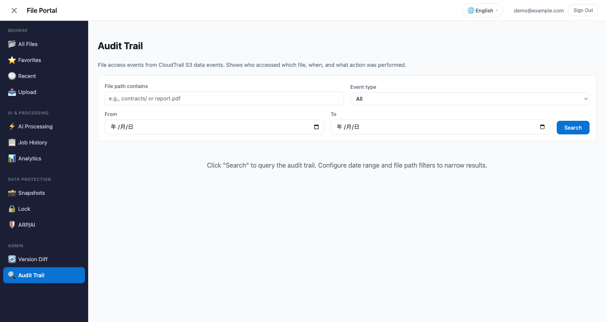

# Amplify Gen2 File Portal — Section Layout Guide

> 🌐 **Language / 言語**: [日本語](portal-tabs-guide.md) | English

> **Last updated**: 2026-07-22
> **Verified**: CDK Sandbox deploy → Cognito login → all 17 sections confirmed to render

---

## Overview

The File Portal for Amazon FSx for NetApp ONTAP (hereafter FSx for ONTAP) is organised as a sidebar navigation with 4 groups and 17 sections. Each section provides an independent capability, and all of them access data on the same FSx for ONTAP S3 Access Point.


```
┌────────────────────────────────────────────────────────────┐
│ File Portal                           demo@example.com     │
├──────────────┬─────────────────────────────────────────────┤
│ BROWSE       │                                             │
│  All Files   │  [Main Content Area]                        │
│  Favorites   │                                             │
│  Recent      │  + AI Assistant Panel (right, on selection) │
│  Folder Watch│                                             │
│  Upload      │                                             │
│──────────────│                                             │
│ AI & PROC.   │                                             │
│  AI Proc.    │                                             │
│  AI Chat     │                                             │
│  Search      │                                             │
│  History     │                                             │
│  Analytics   │                                             │
│  Agent Dir   │                                             │
│──────────────│                                             │
│ DATA PROT.   │                                             │
│  Snapshots   │                                             │
│  Lock        │                                             │
│  ARP/AI      │                                             │
│──────────────│                                             │
│ ADMIN        │                                             │
│  Resources   │                                             │
│  Version     │                                             │
│  Audit       │                                             │
└──────────────┴─────────────────────────────────────────────┘
```

---

## Browse group

### All Files (file browsing + AI + sharing + preview)


| Feature | Action | Icon |
|------|------|:---:|
| Folder navigation | Click a directory to move into it. Breadcrumbs show the hierarchy | — |
| **Order by column header** | Name / Size / Modified. Clicking the same column again reverses the direction. Folders always come first | ▲▼ |
| **Filter within this folder** | Type part of a name into the search box in the header. Case-insensitive | — |
| **Multi-select** | Row checkboxes. Shift + click selects the run in display order; the header checkbox selects every listed file | ☑️ |
| **Bulk trash / bulk restore** | Run from the bar that appears above the listing. Progress is counted, and files that failed are listed by name | 🗑️ ♻️ |
| **Shareable folder URL** | The current folder appears in the address as `#files/<path>`. Link sharing, bookmarks and back/forward all follow the hierarchy | — |
| **Relative modified time** | "3 days ago" within a week, a date beyond it. The tooltip carries the instant to the second; size carries its byte count | — |
| **More actions for a row** | Click ⋮ for the share link, tags, copy/move, rename and trash together. Escape or a click outside closes it | ⋮ |
| **Create a folder** | "New folder" in the header. Created in the folder on screen | 📁➕ |
| **Copy or move** | ⋮ → 📋 → type the destination folder → Copy or Move. The resulting key is shown before you commit | 📋 |
| **Delete permanently** | Inside the trash only: ⋮ → 🔥. Asks for confirmation, because it cannot be undone | 🔥 |
| Image preview | Click 🖼️ for an image popover served through a Presigned URL | 🖼️ |
| **PDF preview** | Click 📕 to display the PDF in an iframe (the browser's built-in viewer) | 📕 |
| **DOCX preview** | Click 📝 for inline rendering by docx-preview | 📝 |
| File download | Click 📄 to download through a Presigned URL | 📄 |
| Share link generation | 🔗 → choose a TTL (5 minutes / 15 minutes / 1 hour) → copy the URL | 🔗 |
| AI Q&A | Select a file → ask from the AI panel (Bedrock Converse API) | 🤖 |
| Rekognition | The "Detect Objects" button inside the image preview | 🏷️ |
| Restore from Snapshot | FlexClone creation dialog (FC7_FLEXCLONE_RESTORE). The clone gets its own S3 AP, so the original data is untouched | 📸 |
| Process this folder | Passes the selected folder to AI Processing | ⚡ |
| **File tags** | Click 🏷️ to edit tags. Tag badges are shown on the row | 🏷️ |
| **AI metadata badges** | Shows AI processing results (classification, label count, entity count, whether a summary exists) on the row | — |
| **Rename** | Click ✏️ for inline editing. Names containing `/` are rejected (this is not a move) | ✏️ |
| **Move to trash** | Click 🗑️ to move straight to the `.trash/` prefix. No confirmation dialog; undo it from the toast | 🗑️ |
| **Open trash / restore** | 🗑️ Trash in the header → browse `.trash/` → ♻️ returns the file to its original location | ♻️ |
| **Upload link** | 📤 → file name and validity period (1 hour / 24 hours) → issues a signed PUT URL | 📤 |
| **Folder download** | Click 📦 to download everything under the folder as a single ZIP | 📦 |
| **Snapshot comparison** | 🔍 → enter the S3 AP alias of the FlexClone → shows the difference between current and Snapshot side by side | 🔍 |
| **Document analysis** | 🔎 in the AI panel → text extraction with Textract, analysis with Comprehend | 🔎 |
| **QR code** | Inside the 🔗 share panel. Issues the signed URL as a QR PNG (for tablets) | 📱 |


**What ordering and filtering apply to**:


`ListObjectsV2` offers only ascending key order and a prefix. Neither a sort column nor a substring match exists on the API side, so both are applied **to the pages fetched so far**.

- The default "Name ascending" is the order the Access Point returns, so no difference arises there
- Choose any other order, or type a filter, while pages remain unfetched and a note above the listing states what was arranged. "Load more files" fetches the rest and the count in the note follows
- No note means the whole folder is loaded


> The screen above was captured with the page size temporarily reduced to 10 so that the note would appear. The actual default is 100, and the count in the note follows it.

**Copy and move, and what stands in front of them**:


The destination is typed, not picked from a tree. A tree would be nicer and is a larger thing to build; typing is bounded by the boundary below, so the worst outcome of a mistyped folder is a refusal rather than a file somewhere unexpected. **The resulting key is shown before you commit** — a destination box on its own leaves the reader to work out whether the filename gets appended.

Every one of these decisions is made in **the backend**. A dialog in a browser is a suggestion, and anything calling AppSync directly never sees it.

| Guardrail | Behaviour |
|-----------|-----------|
| **Tenant boundary** | A key outside `GROUP_PATH_PREFIXES` is refused. `storage-admin` is exempt. No configured prefixes means no restriction |
| **Overwriting** | Refused when the destination holds something. Only the retry behind "Replace" overwrites |
| **A `..` segment** | Refused. S3 keys are literal, so `a/../b` is never resolved, and it means one thing to a prefix comparison and another to a person |
| **Key shape** | Empty, leading `/`, doubled `/`, control characters and anything over 1024 bytes are refused |
| **Folders** | Refused. It would mean copying every object under the prefix, and a run that fails halfway leaves the contents split across two places |
| **Permanent deletion** | Under `.trash/` only, and `acknowledgeIrreversible` is required — so destroying something takes **trash it, then purge it** |

> **On the tenant boundary**: it used to apply to the folder-watch inbox alone, and rename, trash, restore and upload links went unchecked. Where per-team prefixes were configured, naming another team's key directly was enough to act on it, and a presigned PUT into their prefix could be minted. **Every action that takes a key** now passes the same boundary, and so does the listing.

> **Why permanent deletion has no undo**: the objects are not versioned, so no earlier state exists to return to. That is why this one action relies on confirmation beforehand, while the other destructive ones (rename, trash, move) rely on an undo afterwards.

**Why folders cannot be selected**:

Checkboxes appear on file rows only. Moving to trash is implemented as CopyObject + DeleteObject against a single object on the S3 Access Point, so handing it a folder (a prefix) would leave the files underneath behind. Deleting a folder needs a backend action that walks the prefix recursively.

Bulk operations process files one at a time, in order. There is no action that takes a list, so the number of calls equals the number of files selected. For a large selection, wait for the progress count to finish.

**The row overflow menu (⋮)**:


Three controls stay in the row — the checkbox, the favourite star and the preview — and the rest live behind ⋮. Seven controls used to sit on every line, and all of them had to be discounted before the filename could be read.

- ⋮ is always rendered rather than appearing on hover. Hover is not a state a touch screen has, and a control that exists only while the pointer is over it cannot be reached by tabbing either
- Its accessible name carries the filename ("More actions for inspection_qc.json"). One identical name per row would be indistinguishable read aloud
- It is not marked `role="menu"`. The contents include the share panel and the tag editor, and a menu role promises arrow-key movement between items that these do not provide; it is exposed as a named `group` instead
- The last two rows open their panel upwards, where there is no room below

**Keyboard and screen readers**:

- Opening a folder is carried by **the button on the folder name**, not by the row itself. Tab reaches it; Enter or Space opens it. Clicking anywhere in the row still opens it as before
- Making the whole row a button nested the favourite star inside another control and put the star's label at the front of the row's announcement — "Add to favourites 📁 ai-outputs - -". On the name, the announcement is the folder being opened
- The bulk buttons carry an accessible name that includes the count ("Move the 3 selected files to trash"). Every row also has a "Move to trash" button, so the short label alone does not distinguish them

**Office preview (new in 2026-07-22)**:
- PDF: simply passes the Presigned URL to an `<iframe>` (displayed by the browser's built-in viewer)
- DOCX: client-side rendering with the `docx-preview` library (70-80% layout fidelity)
- XLSX/PPTX: not supported at present (a download link is shown). Support via a Lambda Container Image is planned for Phase 2

**Completion notices and undo**:


Rename, move to trash, restore and the bulk operations post a notice at the bottom right when they finish. Success used to be silent; the only evidence was the listing redrawing.

- Rename and move-to-trash carry an **Undo**, because each has an opposite: a rename in the other direction, and a restore
- The **confirmation dialog was removed** from the single-file move to trash. A dialog asks beforehand, every time, at the moment the user has least to go on. The undo answers afterwards, when a mistake is visible, and costs nothing when there was none
- The bulk confirmation stays. What it conveys is not danger but **duration**: one CopyObject + DeleteObject runs per selected file
- Undo covers **only the files that actually moved**. Where three of five succeeded, three are put back
- If the backend did not report where the file landed, no Undo is offered: a button that cannot work is worse than none
- A notice withdraws itself after 12 seconds with an undo, or 6 without. Errors do not withdraw themselves

**What rename and trash actually are**:
- Both are CopyObject + DeleteObject on the S3 Access Point. They are not metadata rewrites, so large files take time
- Trash is the `.trash/` prefix in the same bucket. It is not separate storage, so no capacity is freed
- CopyObject is not an IAM action. The execution role needs `s3:GetObject` and `s3:GetObjectTagging` on the source, `s3:PutObject` and `s3:PutObjectTagging` on the destination, and `s3:DeleteObject` to remove the original. An entry reading `s3:CopyObject` names an action that does not exist and grants nothing (see [Portal CDK and quality-gate pitfalls](../../../docs/agent/portal-cdk-quality-gates.md))

**Notes on upload links**:
- The issued URL is itself a credential. Until it expires, anyone holding the URL can write to that key
- This is why the UI shows the destination key alongside the validity period

**Scope of document analysis**:
- Textract and Comprehend send file content to managed services
- They are rejected under regulated folders (`phi/`, `dicom/`, `pii/`, `hipaa-`, `protected-health-`). The decision is defined in one place, `src/utils/regulatedPath.ts`

**CONFIDENTIAL guardrail**:
- When the data classification label in `shared/ai_guardrails.py` is CONFIDENTIAL/CUI, AI Q&A is blocked
- When blocked, the error message shows the classification level and the reason

---

### Favorites

Files pinned by the user are stored in DynamoDB (owner-scoped). One click jumps to that file in All Files.

---

### Recent


| Displayed information | Description |
|---------|------|
| File name + path | The most recently accessed file |
| Action icons | 👁️ view / 📥 download / 🤖 AI Q&A / 🖼️ preview / 🔗 share |
| Relative time | "2m ago", "3h ago", "2d ago" format |
| Click behaviour | Navigates to that file in All Files |

**Technical detail**:
- DynamoDB `RecentFile` model (owner-scoped, independent per Cognito user)
- Other components call the `recordRecentFile()` utility to log access
- Shows the 30 most recent entries in descending `accessedAt` order
- Empty state: "No recent file activity yet. Navigate to All Files to get started."

---

### Folder Watch

Appears in the sidebar only when Folder Watch is enabled in the admin settings (off by default).

| Feature | Action |
|------|------|
| Add a watch | Enter a prefix → choose the target events (create / update / delete) → add the watch |
| Remove a watch | "Remove" in the watch target table |
| Inbox | Shows events under the registered prefixes, newest first |
| Not-configured display | When the notification table is not connected, it shows "Not configured" rather than guessing |

**Why the toggle is in the admin settings**:
- The portal is not the publisher of the events. An FPolicy server or Transfer Family has to be publishing to EventBridge
- Enabling it is an administrator's declaration that a publisher exists. Turning it on by default would mean showing a permanently empty inbox in environments with no publisher

**Order in which the boundary is narrowed**:
1. The path boundary of the Cognito group (`GROUP_PATH_PREFIXES`)
2. Your own watched prefixes

This order cannot be swapped. Because a watch is your own record you can register `/` as well, but nothing outside the group boundary is visible (`storage-admin` bypasses the boundary). In a single-tenant configuration all events are visible. This is the same boundary as the file listing.

**Why the inbox is read through Lambda**:
- `FileNotification` is `allow.authenticated()`, and the bridge Lambda writes without an owner
- Reading it directly from the generated model client would let any authenticated user read every path, every user name and every client IP

**Path**: FPolicy server (or Transfer Family) → EventBridge → notification bridge Lambda → `FileNotification` table → portal. For configuring FPolicy itself, see the [event-driven/fpolicy pattern](../../event-driven/fpolicy/).

---

### Upload (Storage Browser for S3)

| Feature | Action |
|------|------|
| File upload | Drag and drop (up to 50 GB. Above 5 GB it switches to multipart automatically) |
| Folder creation | New folder |
| Copy and delete | File operations |
| Pagination | Handles large numbers of files |

- The Storage Browser component from `@aws-amplify/ui-react-storage`
- Accesses the S3 AP directly with temporary credentials from the Cognito Identity Pool (no Lambda involved)
- Files arriving from NFS/SMB are reflected in real time (ONTAP strong consistency)

---

## AI & Processing group

### AI Processing (workflow launch)


| Feature | Action |
|------|------|
| Pattern selection | UC1-UC28 / OPS1 / FC7_FLEXCLONE_RESTORE |
| Input path | The directory to process |
| Job submission | Step Functions StartExecution (AppSync HTTP resolver) |

---

### AI Chat (tool-executing agent)

An agent that responds while calling tools against files. It is used both for plain chat and for running saved agents and teams.

| Feature | Description |
|------|------|
| Mode selection | Normal chat / agent mode. Disabling agent mode in the admin settings removes the choice |
| Tools | File listing, reading, search, and approval requests. The tools in an agent definition are intersected with the tools that actually exist |
| Action approval | Operations that change something are presented as a card and are not executed until the user approves |
| Running a saved agent | Launching from Agent Directory runs with that definition (system prompt + tools). While running, a badge shows the definition name and the mode selection is hidden |
| Running a team | Launched from Multi-Agent Teams. Runs the member composition and roles as a single-turn supervisor (not as parallel agents) |

> Execution continues even when some team members are unreachable, and their names appear in `unavailableMembers` in the response. Execution is refused only when none of them are reachable.


The six cards on the opening screen are coloured by the agent that handles them
(file-explorer blue, knowledge-analyst purple, safety-controller red). The colours are
token references, so they follow the theme.

---

### Search (semantic search)

Uses Retrieve on a Bedrock Knowledge Base to search by content rather than by file name. Choosing a file from the results moves to that location in All Files.

---

### Job History

DynamoDB `JobExecution` model (owner-scoped). Shows past jobs together with executionArn, pattern, status, and start/end times.

---

### Analytics (Athena SQL)


Runs Athena SQL queries and shows the results as a table. A Glue Data Catalog browser (database → table → schema) is integrated as well.

---

### Agent Directory (agent definitions)

A list of saved agent definitions. Clicking a card opens the detail (tools, system prompt).

| Action | Description |
|------|------|
| 💬 Use in chat | Opens AI Chat with that definition and runs it |
| ✏️ Edit | Change the name / description / system prompt / category / icon / sharing settings. **Shown only to the author** |
| 🗑️ Delete | Delete the definition. **Shown only to the author** |
| Search / category filter | Partial match on name and description, filtering by category |

> Tools are chosen on the creation screen. At run time the intersection with the tools that actually exist is used, so they cannot be changed in the edit form (loose editing would make the display disagree with reality).

> Edit and delete are not shown for definitions shared by other users. The server side also rejects anyone other than the author, but presenting a clickable button would leave an authorisation error as the only means of explanation, so the UI hides them too.

---

## Data Protection group

### Snapshots (+ Tamperproof Snapshot locking)


Retrieves the Snapshot list through the ONTAP REST API. The "Browse this version" button on each Snapshot creates a FlexClone plus S3 AP to access the past state of the files.

**Tamperproof Snapshot (Snapshot Locking)**:
- Shows 🔐 (locked) / 🔓 (not locked) state on each Snapshot
- A locked Snapshot cannot be deleted until `expiry_time`, including by administrators
- The "🔒 Lock" button → specify a retention period (1-365 days) to lock (`storage-admin` group only)
- ONTAP REST API: set `expiry_time` on `PATCH /api/storage/volumes/{uuid}/snapshots/{uuid}`

**Prerequisites (enabling Tamperproof)**:
- Snapshot Locking must be enabled on the volume: `volume modify -volume <vol> -snapshot-locking-enabled true`
- No SnapLock licence is required (Snapshot Locking is a separate feature from SnapLock)

**Fallback UI when ONTAP is not connected**: instead of a blank screen, an info panel with the connection steps is shown.

---

### Lock (SnapLock + Tamperproof + S3 Object Lock)


Retrieved in real time from the ONTAP REST API:

| Retrieved information | API | Displayed content |
|---------|-----|---------|
| SnapLock type | `GET /api/storage/volumes?fields=snaplock` | Compliance / Enterprise / Non-SnapLock |
| Retention policy | Same as above | Default / Min / Max retention period |
| Autocommit period | Same as above | The automatic WORM commit period for inactive files |
| Snapshot Locking enabled/disabled | `fields=snapshot_locking_enabled` | 🔐 Enabled / 🔓 Not enabled |

**Three layers of immutability shown together**:
1. **ONTAP SnapLock**: volume-level WORM (enforced across all protocols — NFS/SMB/S3 AP)
2. **Tamperproof Snapshot**: per-Snapshot locking (operated from the Snapshots tab)
3. **S3 Object Lock**: WORM on the output bucket (archive protection for AI processing results)

**Fallback UI when ONTAP is not connected**: instead of a blank screen, an info panel with the connection steps is shown.

---

### ARP/AI (ransomware detection)


Retrieved in real time from the ONTAP REST API:

| Retrieved information | API | Displayed content |
|---------|-----|---------|
| ARP state | `GET /api/storage/volumes?fields=anti_ransomware` | enabled / dry_run / paused / disabled |
| Threat level | Same as above (`attack_probability`) | none / low / moderate / high |
| Learning start time | Same as above (`dry_run_start_time`) | Shown when in the dry_run state |
| Automatic Snapshot | Active when state=enabled | Creates an immutable Snapshot automatically on threat detection |

**ARP state card**:
- ✅ `enabled`: AI-driven protection is active (file entropy, extension changes, access pattern monitoring)
- 🔄 `dry_run`: Learning mode (learning patterns, no blocking)
- ⏸️ `paused`: paused by an administrator
- ⚠️ `disabled`: not configured

**Threat level display**:
- 🟢 `none`: no threat
- 🟡 `low`: low-probability anomaly detected
- 🟠 `moderate`: moderate — review recommended
- 🔴 `high`: possible ransomware attack — immediate response required

**Fallback UI when ONTAP is not connected**: instead of a blank screen, an info panel with the connection steps is shown.

---

## Admin group

### Resources (resource management)

Storage administration equivalent to ONTAP System Manager. Shown in the sidebar only to members of the `storage-admin` Cognito group.

Volumes, FlexClone, Qtrees, Quotas, Storage Efficiency, Export Policies, SMB Shares, Local Users, Name Mapping, QoS, ARP/AI, Snapshot management, SnapLock, FPolicy, Vscan, SnapMirror, FlexCache, Cluster (nodes / licences / EMS events).

For the procedures, see the [Admin Resource Management demo guide](../../../docs/en/admin-resource-management-demo.md) (27 scenarios).

> It is not shown to users outside the group. AppSync also rejects them with `allow.groups(["storage-admin"])`, but a menu that always errors when opened does not work as a menu.

---

### Version Diff (difference between Snapshots)

Compares files across two S3 APs (Current Volume vs FlexClone) side by side. Additions, deletions and changes are colour-coded.

**Fallback UI when ONTAP is not connected**: the same info panel as the Snapshots section.

---

### Audit Trail



Searches CloudTrail S3 data events with Athena. Filters: file path, event type (Read/Write/All), date range. Shows "who accessed which file, and when".

---

## Supported preview formats

| Extension | Preview method | Icon |
|--------|:---:|:---:|
| `.jpg`, `.jpeg`, `.png`, `.gif`, `.webp`, `.bmp`, `.svg` | Presigned URL → popover | 🖼️ |
| `.pdf` | Presigned URL → iframe (browser's built-in viewer) | 📕 |
| `.docx` | Presigned URL → docx-preview (client-side) | 📝 |
| Other | Download link | 📄 |

---

## Internationalisation (i18n)

The portal supports 8 languages, switchable instantly from the pill-shaped dropdown in the top bar.

| Language | Browser auto-detection |
|------|:--------------:|
| 日本語 / English / 한국어 / 简体中文 / 繁體中文 / Français / Deutsch / Español | ✅ |

- **Language Switcher**: 🌐 globe icon + the current language in its native script + ▾ chevron
- **Persistence**: stored in `localStorage("portal-locale")`
- **Translation coverage**: all sidebar labels, section titles, all text in ARP/Lock/Snapshots, dialogs, fallback UI
- **Technical terms**: ONTAP, SnapLock, FlexClone, S3 AP, ARP/AI and similar stay in English in every language

---

## Theme (light / dark / system)

The top bar carries a three-way toggle: ☀️ 🌙 🖥️. It is three choices rather than a
two-state switch because "follow the system" is a real answer. A switch has to pick a
starting state, and whichever it picks is wrong for half of the people who never touch
it.


| Choice | Behaviour | localStorage |
|--------|-----------|--------------|
| ☀️ Light | always light | `portal-theme=light` |
| 🌙 Dark | always dark | `portal-theme=dark` |
| 🖥️ System | follows the OS, including when the OS switches at dusk | key removed |

"System" removes the key rather than storing it, because an absent key and "follow the
system" are the same state, and keeping both invites them to disagree.

### Implementation: map by role, not by value

The palette is 32 tokens defined on `:root` and `[data-theme="dark"]`, and every rule
reads a token. The point is to **map by role rather than by value**: `white` is
`--color-text-inverse` as a `color` and `--color-surface` as a `background`. Replacing
values alone reverses the meaning and breaks the result.

An inline script in `index.html` resolves `data-theme` before the first paint, so a
stored choice is never drawn light for a frame and then corrected. There is
deliberately no `@media (prefers-color-scheme: dark)` block in the CSS: two copies of
a palette drift, and the theme nobody is looking at is the one that breaks.

### Guardrails

`make drift` applies five rules. The first four look at colour, the fifth at rendered
text. What they share is that the defect is **invisible to whoever writes it**: a
hardcoded light colour is correct in the author's theme and a white slab to everyone
who opens the portal in dark mode.

| Rule | What it finds |
|------|---------------|
| `theme-literal` | colour literals in the stylesheet; budget of 4, each documented at its line |
| `inline-colour` | colour literals in a JSX `style={{ }}`; no budget, because an inline style cannot be restyled |
| `undefined-token` | a reference to a token nothing defines, so it always falls through -- or drops the declaration |
| `theme-contrast` | text against its fill within one rule, in both themes (WCAG AA: 4.5:1 body, 3:1 large) |
| `locale-escaping` | over-escaped locale strings; `\\"` where `\"` was meant renders the backslash on screen |

`theme-contrast` exists because tokenising was not sufficient. The dark theme's accent
colours have to go **lighter** to stay visible against a dark page, and white text
(`--color-text-inverse`) on top of them put every primary button at 3.4:1 and the
approve button at 2.8:1. Nothing was a light slab, so every literal rule was
satisfied. The answer was `--color-on-primary` / `--color-on-success` /
`--color-on-error`: **the fill does not flip with the theme, the text on it does.**

Only pairs written in the same rule are checked statically. A background arriving from
a different selector needs the cascade resolved, which needs a browser, so that half
is covered by the on-device sweep.

> **Before trusting a gate, confirm it fails on input it must reject.**
> `theme-literal` was originally anchored to the start of a line, so it could not see a
> one-line rule such as `.state-online { background: #dcfce7; }` and reported 5
> literals out of 201. While `inline-colour` did not exist, six AI agent cards kept
> pale fills in inline styles and combined them with the dark theme's light text,
> shipping at a contrast ratio of 1.1:1. Every gate in the repository was green
> throughout. The checks' own tests are in
> `scripts/tests/test_theme_literal_check.py`.

---

## On a phone

The portal works in a phone browser. There is no separate app; it is the same URL.

> **The procedure for someone using it** is [section 4 of the user
> guide](../../../docs/en/portal-user-guide.md). This section covers the breakpoints and
> what the CSS does.

> **The 🖥️ in the theme control is not a desktop-mode switch.** It is the third
> choice, "match the system" -- follow the OS appearance setting. It has nothing to do
> with mobile.


| Width | Behaviour |
|-------|-----------|
| 769px and up | the sidebar is a column beside the content, open by default |
| 768px and below | the sidebar is a **drawer over** the content, closed by default, opened with ☰, and closed again once a section is chosen |
| 480px and below | the topbar keeps only the controls: the product name is hidden visually but stays in the DOM as the h1, sign-out becomes an icon, the address is dropped |
| 768px and below | the listing drops its Size and Modified columns; below 480px it is the name and the row actions |

### What it meets

- **No horizontal scroll** (verified at 390px across 11 tabs in both themes)
- **Every field at 16px or more.** iOS Safari zooms the page when a focused field is
  under 16px, and once zoomed the layout no longer fits the screen
- **Touch targets 44×44** (the row's checkbox, star, preview and ⋮; every header
  button; the filter field; the preview sheet's close and download). WCAG 2.2 sets the
  floor at 24×24 in SC 2.5.8 (AA); the controls a thumb reaches for are held to the
  44×44 of SC 2.5.5 (AAA)
- **The drawer has a scrim.** Opening it dims the content; tapping the scrim or
  pressing Escape closes it, as does choosing a section
- **Rotation is followed.** 390×844 is a drawer and 844×390 is a column, and turning
  the phone switches between them
- **Preview is a bottom sheet** (up to 70vh from the bottom edge) rather than a popover
  hanging off a row, so it cannot be clipped by the list or open below the fold

> **The row checkbox is drawn rather than native.** A native checkbox ignores padding,
> so its hit area cannot exceed its box while it keeps the default appearance.
> `appearance: none` gives a 44×44 target with a 22px square inside it, and the tick is
> two rotated borders -- token-coloured, so it stays visible in both themes.

### Writing a responsive rule

**A media query adds no specificity.** A rule inside `@media (max-width: 768px)` loses
to the same selector appearing later in the file, and to any more specific selector
anywhere in it. The declaration stays present and is ignored, so the failure is silent.
Two were live at once:

- `.portal-layout { grid-template-columns: minmax(0, 1fr) }` lost to
  `.portal-layout.sidebar-collapsed` 200 lines earlier -- two classes against one.
  Collapsed is the default state on a phone, so the three-column desktop grid was
  applied against a one-area template and the topbar rendered 40px wide
- `.form-group label` lost to the same selector 1,000 lines further down

**Put a responsive rule directly after the rule it overrides.** The
`dead-media-override` rule in `make drift` finds these mechanically.

| Rule | What it finds |
|------|---------------|
| `dead-media-override` | a declaration in a `max-width` query that the cascade discards, whether to a later identical selector or a more specific one anywhere; `!important` is honoured in both directions |

---

## CDK quality gates

This portal is protected by the following quality gates:

| Tool | What it checks |
|--------|------------|
| cdk-nag (AwsSolutionsChecks) | Over-permissive IAM, encryption, log retention |
| CDK harness tests (114 assertions) | Lambda count, runtime, environment variables |
| IAM Access Analyzer | SECURITY_WARNING detection in policies |
| floci integration tests (9 tests) | S3 ListObjectsV2 + Delimiter behaviour |

cdk-nag is off in the deployment path (enabled only with `CDK_NAG=1`). Locally, `npm run nag`. In CI, Stage 2b compares it against the baseline and fails on a finding that is not recorded.
