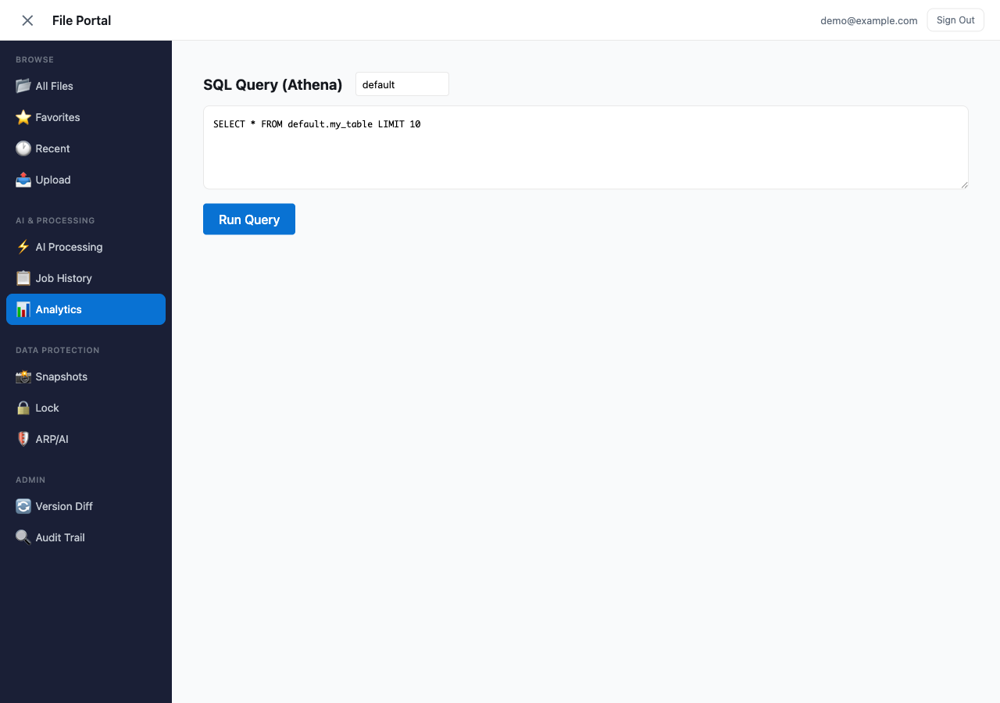
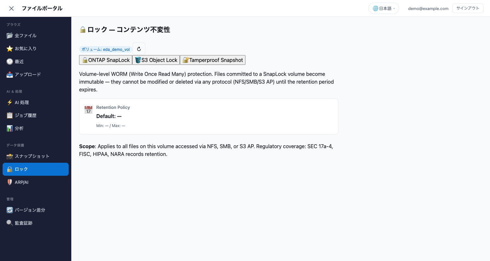
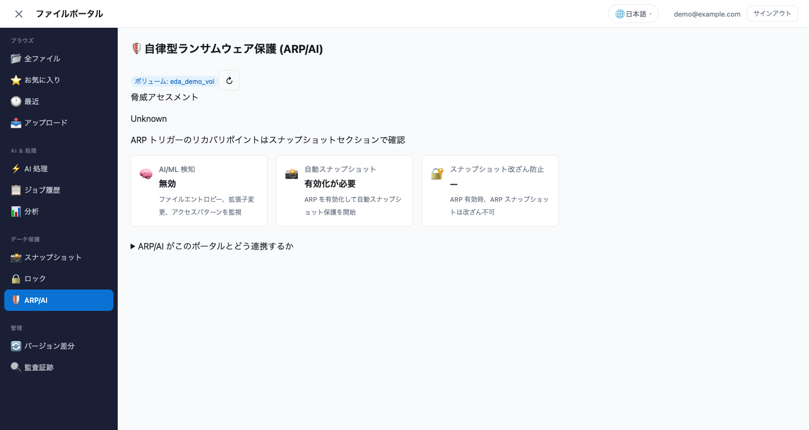

# Amplify Gen2 File Portal — セクション構成ガイド

> **最終更新**: 2026-07-22
> **検証**: CDK Sandbox デプロイ → Cognito ログイン → 12 セクション全表示確認済み

---

## 概要

FSx for ONTAP File Portal はサイドバーナビゲーション（4 グループ × 12 セクション）で構成されています。各セクションは独立した機能を提供し、同一の FSx for ONTAP S3 Access Point 上のデータにアクセスします。


```
┌──────────────────────────────────────────────────────────┐
│ File Portal                         demo@example.com     │
├────────────┬─────────────────────────────────────────────┤
│ BROWSE     │  [Main Content Area]                        │
│  All Files │                                             │
│  Favorites │  + AI Assistant Panel (right, on selection) │
│  Recent    │                                             │
│  Upload    │                                             │
│────────────│                                             │
│ AI & PROC. │                                             │
│  AI Proc.  │                                             │
│  History   │                                             │
│  Analytics │                                             │
│────────────│                                             │
│ DATA PROT. │                                             │
│  Snapshots │                                             │
│  Lock      │                                             │
│  ARP/AI    │                                             │
│────────────│                                             │
│ ADMIN      │                                             │
│  Version   │                                             │
│  Audit     │                                             │
└────────────┴─────────────────────────────────────────────┘
```

---

## Browse グループ

### All Files（ファイル閲覧 + AI + 共有 + プレビュー）

| 機能 | 操作 | アイコン |
|------|------|:---:|
| フォルダナビゲーション | ディレクトリクリックで移動。ブレッドクラムで階層表示 | — |
| 画像プレビュー | 🖼️ クリックで Presigned URL 経由の画像ポップオーバー | 🖼️ |
| **PDF プレビュー** | 📕 クリックで iframe 内 PDF 表示（ブラウザ内蔵ビューア） | 📕 |
| **DOCX プレビュー** | 📝 クリックで docx-preview によるインラインレンダリング | 📝 |
| ファイルダウンロード | 📄 クリックで Presigned URL 経由ダウンロード | 📄 |
| 共有リンク生成 | 🔗 → TTL 選択 (5 分/15 分/1 時間) → URL コピー | 🔗 |
| AI Q&A | ファイル選択 → AI パネルから質問（Bedrock Converse API） | 🤖 |
| Rekognition | 画像プレビュー内「Detect Objects」ボタン | 🏷️ |
| Restore from Snapshot | FlexClone 作成ダイアログ (FC7_FLEXCLONE_RESTORE) | 📸 |
| Process this folder | 選択中フォルダを AI Processing に渡す | ⚡ |

**Office プレビュー（新機能 2026-07-22）**:
- PDF: Presigned URL を `<iframe>` に渡すだけ（ブラウザ内蔵ビューアで表示）
- DOCX: `docx-preview` ライブラリでクライアントサイドレンダリング（レイアウト再現度 70-80%）
- XLSX/PPTX: 現時点非対応（ダウンロードリンク表示）。Phase 2 で Lambda Container Image 対応予定

**CONFIDENTIAL ガードレール**:
- `shared/ai_guardrails.py` のデータ分類ラベルが CONFIDENTIAL/CUI の場合、AI Q&A をブロック
- ブロック時はエラーメッセージで分類レベルと理由を表示

---

### Favorites（お気に入り）

ユーザーがピン留めしたファイルを DynamoDB に保存（owner-scoped）。ワンクリックで All Files の該当ファイルにジャンプ。

---

### Recent（最近のファイル）


| 表示情報 | 説明 |
|---------|------|
| ファイル名 + パス | 最後にアクセスしたファイル |
| アクションアイコン | 👁️ 閲覧 / 📥 ダウンロード / 🤖 AI Q&A / 🖼️ プレビュー / 🔗 共有 |
| 相対時間 | 「2m ago」「3h ago」「2d ago」形式 |
| クリック動作 | All Files の該当ファイルにナビゲート |

**技術詳細**:
- DynamoDB `RecentFile` モデル（owner-scoped, Cognito ユーザーごとに独立）
- `recordRecentFile()` ユーティリティを他コンポーネントから呼び出してログ記録
- 最新 30 件を `accessedAt` 降順で表示
- 空状態: 「No recent file activity yet. Navigate to All Files to get started.」

---

### Upload（Storage Browser for S3）

| 機能 | 操作 |
|------|------|
| ファイルアップロード | ドラッグ＆ドロップ（最大 5 GB） |
| フォルダ作成 | 新規フォルダ |
| コピー・削除 | ファイル操作 |
| ページネーション | 大量ファイル対応 |

- `@aws-amplify/ui-react-storage` の Storage Browser コンポーネント
- Cognito Identity Pool の一時認証情報で S3 AP に直接アクセス（Lambda 不要）
- NFS/SMB からのファイルがリアルタイム反映（ONTAP 強一貫性）

---

## AI & Processing グループ

### AI Processing（ワークフロー起動）


| 機能 | 操作 |
|------|------|
| パターン選択 | UC1-UC28 / OPS1 / FC7_FLEXCLONE_RESTORE |
| 入力パス指定 | 処理対象ディレクトリ |
| ジョブ投入 | Step Functions StartExecution（AppSync HTTP resolver） |

---

### Job History（実行履歴）

DynamoDB `JobExecution` モデル（owner-scoped）。過去のジョブを executionArn, pattern, status, 開始/終了時刻とともに表示。

---

### Analytics（Athena SQL）



Athena SQL クエリを実行し、結果をテーブル表示。Glue Data Catalog ブラウザ（データベース → テーブル → スキーマ）も統合。

---

## Data Protection グループ

### Snapshots

ONTAP REST API 経由で Snapshot 一覧を取得。各 Snapshot から「Browse this version」ボタンで FlexClone + S3 AP を作成し、過去のファイル状態にアクセス。

**ONTAP 未接続時のフォールバック UI**: 白画面ではなく、接続手順付きの info パネルを表示。

---

### Lock（SnapLock + S3 Object Lock）



ONTAP SnapLock（Volume-level WORM）と S3 Object Lock（Bucket-level WORM）の統合ビュー。Compliance/Enterprise モード、保持期間を表示。

---

### ARP/AI（ランサムウェア検知）



ONTAP Autonomous Ransomware Protection のステータス。検知イベント数、自動 Snapshot 数を表示。FlexClone 復元ワークフローへの案内付き。

---

## Admin グループ

### Version Diff（Snapshot 間差分）

2 つの S3 AP（Current Volume vs FlexClone）のファイルを並列比較。追加/削除/変更をカラーコードで表示。

**ONTAP 未接続時のフォールバック UI**: Snapshots セクションと同じ info パネル。

---

### Audit Trail（監査証跡）


CloudTrail S3 データイベントを Athena で検索。フィルター: ファイルパス、イベント種別（Read/Write/All）、日付範囲。「誰が、いつ、どのファイルを」を表示。

---

## プレビュー対応形式

| 拡張子 | プレビュー方式 | アイコン |
|--------|:---:|:---:|
| `.jpg`, `.jpeg`, `.png`, `.gif`, `.webp`, `.bmp`, `.svg` | Presigned URL → ポップオーバー | 🖼️ |
| `.pdf` | Presigned URL → iframe（ブラウザ内蔵ビューア） | 📕 |
| `.docx` | Presigned URL → docx-preview（クライアントサイド） | 📝 |
| その他 | ダウンロードリンク | 📄 |

---

## CDK 品質ゲート

このポータルは以下の品質ゲートで保護されています:

| ツール | チェック内容 |
|--------|------------|
| cdk-nag (AwsSolutionsChecks) | IAM 過剰権限、暗号化、ログ保持 |
| CDK ハーネステスト (17 assertions) | Lambda 数、ランタイム、環境変数 |
| IAM Access Analyzer | ポリシーの SECURITY_WARNING 検知 |
| floci 統合テスト (9 tests) | S3 ListObjectsV2 + Delimiter 動作 |

`SKIP_CDK_NAG=1 npx ampx sandbox --once` で開発時は nag スキップ可。CI では nag 有効。
