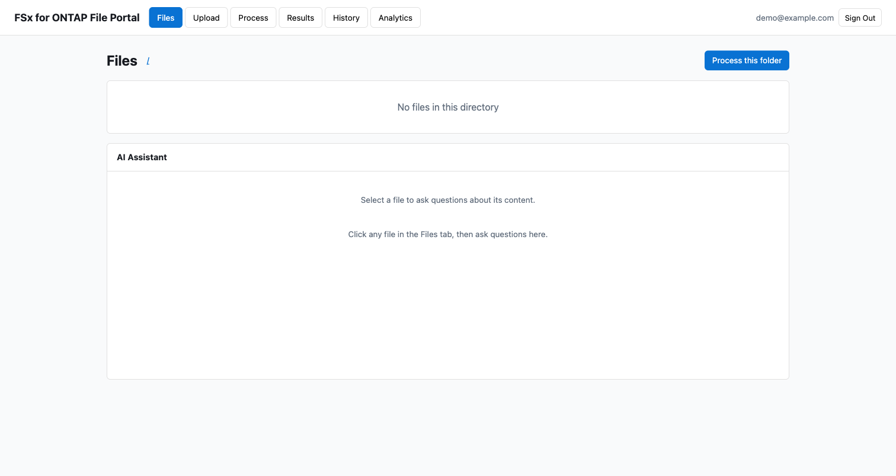
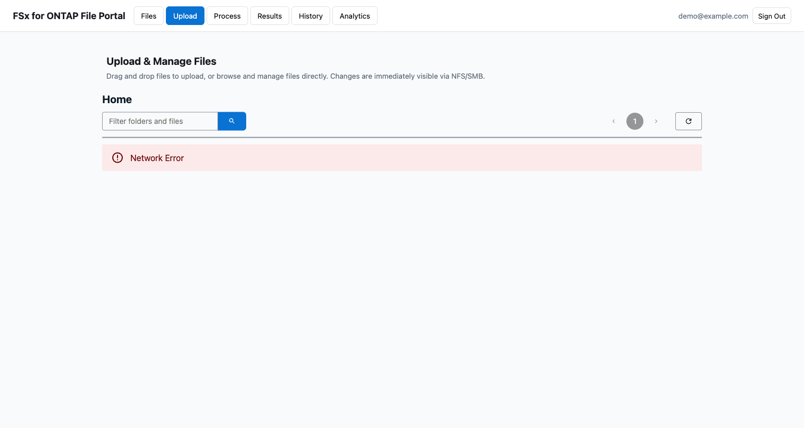
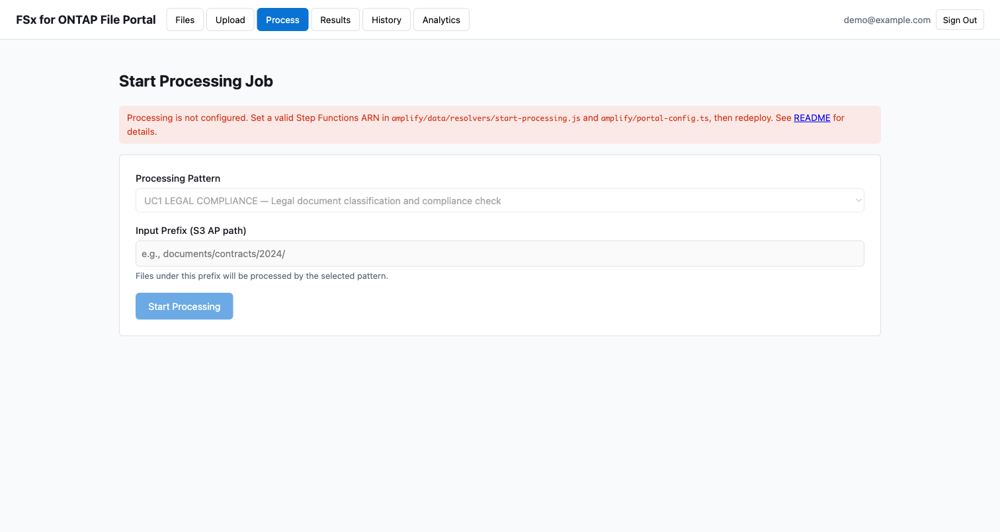

# Amplify Gen2 File Portal — タブ構成ガイド

> **最終更新**: 2026-07-20
> **検証**: CDK Sandbox デプロイ → Cognito ログイン → 6 タブ全表示確認済み

---

## 概要

FSx for ONTAP File Portal は 6 つのタブで構成されています。各タブは独立した機能を提供し、同一の FSx for ONTAP S3 Access Point 上のデータにアクセスします。

```
┌─────────────────────────────────────────────────────────────────────┐
│  FSx for ONTAP File Portal                    demo@example.com [↗]  │
├──────┬────────┬─────────┬─────────┬─────────┬───────────────────────┤
│ Files│ Upload │ Process │ Results │ History │ Analytics             │
├──────┴────────┴─────────┴─────────┴─────────┴───────────────────────┤
│                                                                     │
│  [タブコンテンツ]                                                      │
│                                                                     │
└─────────────────────────────────────────────────────────────────────┘
```

---

## タブ一覧

### 1. Files（ファイル閲覧 + AI + 共有リンク）



| 機能 | 操作 |
|------|------|
| フォルダナビゲーション | ディレクトリをクリックで移動。ブレッドクラムで階層表示 |
| ファイルプレビュー | 🖼️ クリックで Presigned URL 経由の画像プレビュー表示 |
| ファイルダウンロード | 📄 クリックで Presigned URL 経由のダウンロード |
| **共有リンク生成** | 🔗 クリックで TTL 選択パネル → URL 生成 → コピー |
| AI Q&A | ファイル選択後、AI Assistant パネルから質問 |
| Rekognition | 画像プレビュー内「Detect Objects」ボタン |
| Restore from Snapshot | FlexClone 作成ダイアログ |
| Process this folder | 選択中フォルダを Process タブに渡す |

**共有リンク（新機能）**:
- TTL: 5 分 / 15 分 / 1 時間 から選択
- ワンクリックでクリップボードにコピー
- リンクを知っている人は認証なしでファイルにアクセス可能（Presigned URL）
- 機密ファイルには使用しないよう注意書き表示

---

### 2. Upload（Storage Browser for S3）



| 機能 | 操作 |
|------|------|
| ファイルアップロード | ドラッグ＆ドロップ、またはファイルピッカー（最大 5 GB） |
| フォルダ作成 | 新規フォルダの作成 |
| ファイルダウンロード | クリックでダウンロード |
| コピー | 別パスへコピー |
| 削除 | 選択ファイルの削除 |
| 検索 | フィルターボックスでファイル名フィルタリング |
| ページネーション | 大量ファイルのページ切り替え |

**技術詳細**:
- `@aws-amplify/ui-react-storage` の Storage Browser コンポーネントを使用
- Cognito Identity Pool の一時認証情報で S3 AP に直接アクセス（Lambda 不要）
- NFS/SMB からのファイルがリアルタイムに反映（ONTAP 強一貫性）
- アップロードしたファイルは即座に NFS/SMB から参照可能

---

### 3. Process（ワークフロー起動）



| 機能 | 操作 |
|------|------|
| パターン選択 | UC1-UC28 / OPS1 からワークフローを選択 |
| 入力パス指定 | 処理対象のディレクトリパスを指定 |
| ジョブ投入 | Step Functions state machine を起動 |
| パラメータ設定 | UC 固有のオプションパラメータ |

---

### 4. Results（結果表示）

| 機能 | 操作 |
|------|------|
| ステータス表示 | RUNNING / SUCCEEDED / FAILED + タイムスタンプ |
| 出力データ | Step Functions の output JSON を整形表示 |
| FlexClone ステータス | クローン作成の進捗表示 |
| フォルダナビゲーション | 処理結果フォルダへのブレッドクラムリンク |

---

### 5. History（ジョブ履歴）

| 機能 | 操作 |
|------|------|
| 実行一覧 | DynamoDB に保存されたジョブ実行履歴 |
| オーナーフィルタ | ログインユーザーの実行のみ表示 |
| 結果遷移 | 過去のジョブをクリックで Results タブに遷移 |

---

### 6. Analytics（Athena SQL）

| 機能 | 操作 |
|------|------|
| SQL エディタ | Athena SQL クエリを入力・実行 |
| データベース選択 | Glue Data Catalog のデータベースを選択 |
| 結果テーブル | クエリ結果をテーブル形式で表示（最大 100 行） |

---

## セットアップ手順

### 前提条件

- Node.js 18.17+
- AWS CLI v2 (認証済み)
- FSx for ONTAP S3 Access Point（DemoMode なら不要）

### Step 1: 設定ファイル

```bash
cd solutions/amplify-portal
npm install
cp amplify/portal-config.example.ts amplify/portal-config.ts
```

`portal-config.ts` を編集:
```typescript
export const config: PortalConfig = {
  region: "ap-northeast-1",
  s3ApAlias: "your-ap-xxxxx-ext-s3alias",  // S3 AP alias or bucket name
  stateMachineArn: "arn:aws:states:ap-northeast-1:123456789012:stateMachine:your-workflow",
  stateMachineResourceScope: "*",
  s3ApResourceArns: [
    "arn:aws:s3:*:*:accesspoint/*",
    "arn:aws:s3:*:*:accesspoint/*/object/*",
  ],
};
```

`src/portal-settings.ts` を編集（Upload タブ用）:
```typescript
export const portalSettings = {
  processingEnabled: true,  // Process タブを有効化
  fileListingEnabled: true,
  region: "ap-northeast-1",
  accountId: "123456789012",  // aws sts get-caller-identity --query Account
  s3ApAlias: "your-ap-xxxxx-ext-s3alias",
};
```

### Step 2: デプロイ

```bash
# CDK Sandbox デプロイ（Cognito + AppSync + Lambda）
make sandbox
# → 約 4-5 分で完了。amplify_outputs.json が生成される

# ローカル開発サーバー起動
make dev
# → http://localhost:5173
```

### Step 3: テストユーザー作成

```bash
USER_POOL_ID=$(jq -r '.auth.user_pool_id' amplify_outputs.json)
aws cognito-idp admin-create-user \
  --user-pool-id $USER_POOL_ID \
  --username demo@example.com \
  --user-attributes Name=email,Value=demo@example.com Name=email_verified,Value=true \
  --temporary-password 'Demo1234!' \
  --region ap-northeast-1

aws cognito-idp admin-set-user-password \
  --user-pool-id $USER_POOL_ID \
  --username demo@example.com \
  --password 'Demo1234!' \
  --permanent \
  --region ap-northeast-1
```

### Step 4: 動作確認

1. http://localhost:5173 にアクセス
2. `demo@example.com` / `Demo1234!` でログイン
3. 6 タブが表示されることを確認
4. Files タブ: ファイル一覧が表示される（S3 AP にデータがある場合）
5. Upload タブ: Storage Browser が表示される
6. Files タブ: ファイル行の 🔗 ボタンで共有リンクパネルが開く

---

## クリーンアップ

```bash
# Sandbox 削除（全リソース削除）
make sandbox-delete
# → Cognito, AppSync, Lambda, DynamoDB, IAM Role 全て削除される
```

---

## IaC 構成

```
amplify/
├── auth/resource.ts          # Cognito User Pool + Identity Pool
├── data/resource.ts          # AppSync GraphQL Schema (queries/mutations)
├── data/resolvers/           # APPSYNC_JS リゾルバー (7 files)
│   ├── list-files.js         # Lambda → S3 AP ListObjectsV2
│   ├── get-presigned-url.js  # Lambda → Presigned URL 生成
│   ├── start-processing.js   # HTTP → Step Functions StartExecution
│   ├── get-job-status.js     # HTTP → Step Functions DescribeExecution
│   ├── ask-about-file.js     # Lambda → Bedrock Converse API
│   ├── detect-labels.js      # Lambda → Rekognition DetectLabels
│   └── run-athena-query.js   # Lambda → Athena StartQueryExecution
├── backend.ts                # 全リソース統合 (Lambda inline, IAM, HTTP DS)
└── portal-config.ts          # 環境固有設定（gitignore 対象）
```

**Lambda 関数（backend.ts に inline 定義）**:
- `ListFilesFunction` — S3 AP ListObjectsV2 + CommonPrefixes
- `GetPresignedUrlFunction` — SigV4 presigned URL 生成（共有リンク + プレビュー兼用）
- `AskAboutFileFunction` — S3 AP GetObject → Bedrock Converse
- `DetectLabelsFunction` — S3 AP GetObject → Rekognition DetectLabels
- `ExtractTextFunction` — S3 AP GetObject → Textract AnalyzeDocument
- `AnalyzeTextFunction` — S3 AP GetObject → Comprehend DetectEntities
- `RunAthenaQueryFunction` — Athena StartQueryExecution + GetQueryResults
- `BrowseCatalogFunction` — Glue GetDatabases/GetTables/GetTable

---

## 関連ドキュメント

| ドキュメント | 内容 |
|---|---|
| [Storage Browser Demo Guide](../../docs/en/storage-browser-demo-guide.md) | Storage Browser 単体の詳細セットアップ |
| [Amplify Hosting Production Guide](../../docs/en/amplify-hosting-production-guide.md) | 本番 Amplify Hosting デプロイ手順 |
| [S3AP Compatibility Notes](../../docs/s3ap-compatibility-notes.md) | S3 AP の制約と回避策 |
| [portal-config.example.ts](../amplify/portal-config.example.ts) | 設定ファイルテンプレート |
