# Amplify Gen2 File Portal — セクション構成ガイド

> 🌐 **Language / 言語**: 日本語 | [English](portal-tabs-guide.en.md)

> **最終更新**: 2026-07-22
> **検証**: CDK Sandbox デプロイ → Cognito ログイン → 17 セクション全表示確認済み

---

## 概要

FSx for ONTAP File Portal はサイドバーナビゲーション（4 グループ × 17 セクション）で構成されています。各セクションは独立した機能を提供し、同一の FSx for ONTAP S3 Access Point 上のデータにアクセスします。


```
┌────────────────────────────────────────────────────────────┐
│ File Portal                           demo@example.com     │
├──────────────┬─────────────────────────────────────────────┤
│ BROWSE       │                                             │
│  All Files   │  [Main Content Area]                        │
│  Favorites   │                                             │
│  Recent      │  + AI Assistant Panel (right, on selection) │
│  Folder Watch│                                             │
│  Upload      │                                             │
│──────────────│                                             │
│ AI & PROC.   │                                             │
│  AI Proc.    │                                             │
│  AI Chat     │                                             │
│  Search      │                                             │
│  History     │                                             │
│  Analytics   │                                             │
│  Agent Dir   │                                             │
│──────────────│                                             │
│ DATA PROT.   │                                             │
│  Snapshots   │                                             │
│  Lock        │                                             │
│  ARP/AI      │                                             │
│──────────────│                                             │
│ ADMIN        │                                             │
│  Resources   │                                             │
│  Version     │                                             │
│  Audit       │                                             │
└──────────────┴─────────────────────────────────────────────┘
```

---

## Browse グループ

### All Files（ファイル閲覧 + AI + 共有 + プレビュー）

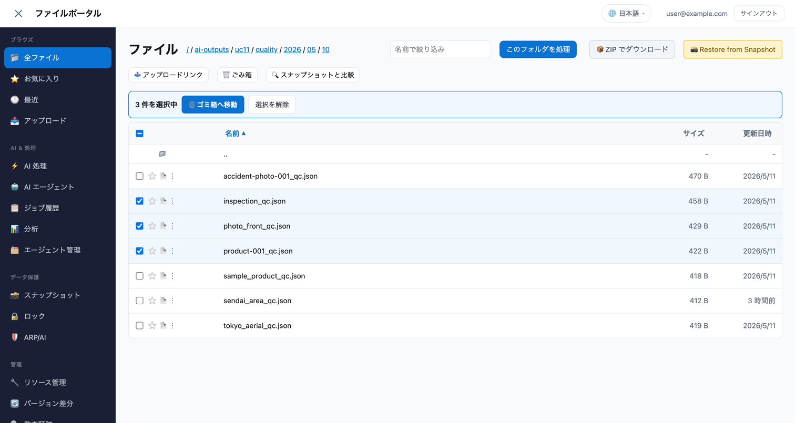

| 機能 | 操作 | アイコン |
|------|------|:---:|
| フォルダナビゲーション | ディレクトリクリックで移動。ブレッドクラムで階層表示 | — |
| **列ヘッダで並べ替え** | 名前 / サイズ / 更新日時。同じ列を再クリックで昇順・降順が入れ替わる。フォルダは常に上 | ▲▼ |
| **このフォルダ内を絞り込み** | ヘッダーの検索ボックスに名前の一部を入力。大文字小文字を区別しない | — |
| **複数選択** | 行のチェックボックス。Shift + クリックで表示順の範囲選択、ヘッダーのチェックで表示中の全ファイル | ☑️ |
| **一括ゴミ箱 / 一括復元** | 選択後に上部のバーから実行。進捗を件数で表示し、失敗したファイルは名前ごとに列挙 | 🗑️ ♻️ |
| **フォルダの URL 共有** | 現在のフォルダが `#files/<パス>` としてアドレスに載る。リンク共有・ブックマーク・戻る/進むが階層に追随 | — |
| **更新日時の相対表示** | 7 日以内は「3 日前」、それ以降は日付。ツールチップに秒までの日時。サイズもツールチップにバイト値 | — |
| **行のその他の操作** | ⋮ クリックで共有リンク・タグ・コピー / 移動・名前の変更・ごみ箱をまとめて開く。Escape または外側クリックで閉じる | ⋮ |
| **フォルダの作成** | ヘッダーの「新しいフォルダ」。現在の階層に作成される | 📁➕ |
| **コピー / 移動** | ⋮ → 📋 → 移動先フォルダを入力 → コピー または 移動。保存先のキーを実行前に表示 | 📋 |
| **完全削除** | ごみ箱の中でのみ ⋮ → 🔥。取り消せないため確認を求める | 🔥 |
| 画像プレビュー | 🖼️ クリックで Presigned URL 経由の画像ポップオーバー | 🖼️ |
| **PDF プレビュー** | 📕 クリックで iframe 内 PDF 表示（ブラウザ内蔵ビューア） | 📕 |
| **DOCX プレビュー** | 📝 クリックで docx-preview によるインラインレンダリング | 📝 |
| ファイルダウンロード | 📄 クリックで Presigned URL 経由ダウンロード | 📄 |
| 共有リンク生成 | 🔗 → TTL 選択 (5 分/15 分/1 時間) → URL コピー | 🔗 |
| AI Q&A | ファイル選択 → AI パネルから質問（Bedrock Converse API） | 🤖 |
| Rekognition | 画像プレビュー内「Detect Objects」ボタン | 🏷️ |
| スナップショットから復元 | FlexClone 作成ダイアログ (FC7_FLEXCLONE_RESTORE)。クローンには専用の S3 AP が割り当たるので、元のデータには触れない | 📸 |
| Process this folder | 選択中フォルダを AI Processing に渡す | ⚡ |
| **ファイルタグ** | 🏷️ クリックでタグを編集。行にタグバッジを表示 | 🏷️ |
| **AI メタデータバッジ** | AI 処理の結果（分類、ラベル数、エンティティ数、要約有無）を行に表示 | — |
| **名前を変更** | ✏️ クリックでインライン編集。`/` を含む名前は拒否（移動ではないため） | ✏️ |
| **ごみ箱へ移動** | 🗑️ クリックで即座に `.trash/` プレフィックスへ移動。確認ダイアログはなく、トーストの「元に戻す」で取り消す | 🗑️ |
| **ごみ箱を開く / 復元** | ヘッダーの 🗑️ ごみ箱 → `.trash/` を閲覧 → ♻️ で元の場所に戻す | ♻️ |
| **アップロードリンク** | 📤 → ファイル名と有効期限（1 時間 / 24 時間）→ 署名付き PUT URL を発行 | 📤 |
| **フォルダーダウンロード** | 📦 クリックでフォルダー配下を ZIP でまとめてダウンロード | 📦 |
| **Snapshot 比較** | 🔍 → FlexClone の S3 AP エイリアスを入力 → 現在と Snapshot の差分を並べて表示 | 🔍 |
| **文書の解析** | AI パネルの 🔎 → Textract でテキスト抽出、Comprehend で解析 | 🔎 |
| **QR コード** | 🔗 の共有パネル内。署名付き URL を QR PNG で発行（タブレット向け） | 📱 |

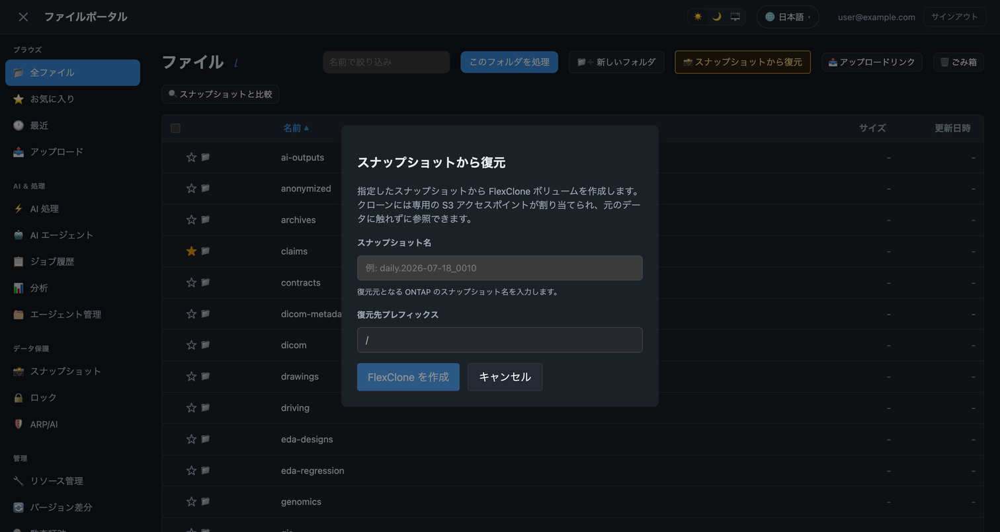

**並べ替えと絞り込みが効く範囲**:


`ListObjectsV2` はキーの昇順と前方一致（プレフィックス）しか提供しません。並べ替える列も、名前の部分一致も、API 側には無い機能です。したがってどちらも**取得済みのページに対して**適用されます。

- 既定の「名前 昇順」は Access Point が返す順序そのものなので、この差は生じません
- 未取得のページが残っている状態でそれ以外の並び順や絞り込みを使うと、一覧の上に適用範囲の注記が出ます。「さらに読み込む」で残りを取得すると注記の件数が追随します
- 注記が出ていない状態は「そのフォルダを全部読み込んでいる」ことを意味します

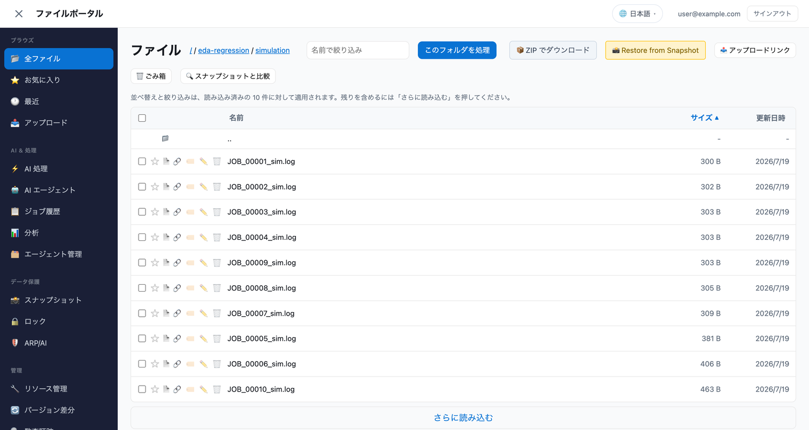

> 上の画面は注記を写すためにページサイズを一時的に 10 件へ下げて撮影しています。実際の既定値は 100 件で、注記の件数もそれに従います。

**コピー / 移動と、その前に立つガードレール**:

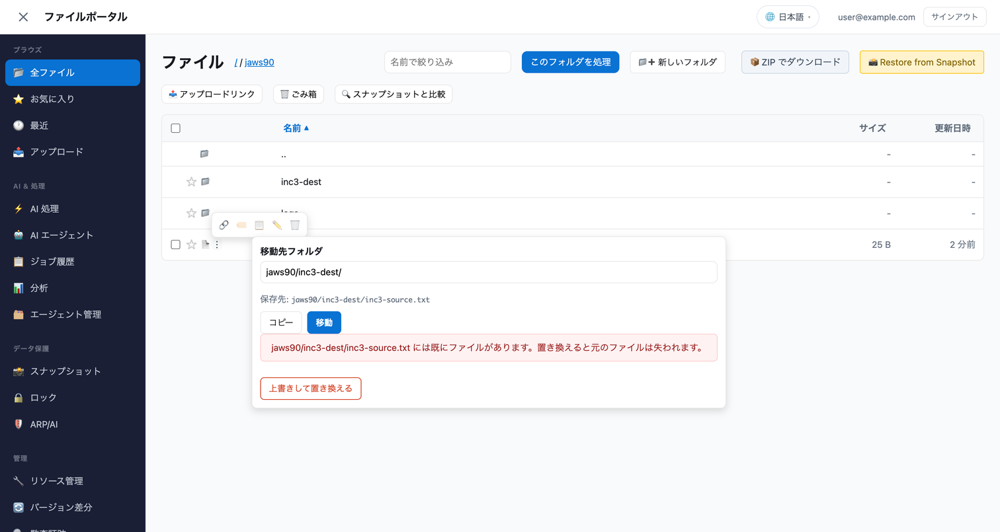

移動先はツリーではなく入力です。ツリーのほうが快適ですが、入力でも後述の境界がバックエンド側で効くため、打ち間違いの最悪の結果は「拒否される」で、想定外の場所にファイルが置かれることではありません。実行前に**保存先のキーを表示**します（入力欄だけだと、ファイル名が付くのかどうかを読者が推測することになります）。

以下はすべて**バックエンド側**の判断です。ブラウザのダイアログは提案でしかなく、AppSync を直接呼ぶ経路はそれを見ません。

| ガードレール | 挙動 |
|------------|------|
| **テナント境界** | `GROUP_PATH_PREFIXES` の外側のキーは拒否。`storage-admin` は対象外。未設定なら制限なし |
| **上書き** | 移動先に何かあれば拒否。「置き換える」を押した再試行だけが上書きする |
| **`..` を含むキー** | 拒否。S3 キーは文字列なので `a/../b` は解決されず、前方一致の判定と人間の読みが食い違う |
| **キーの形** | 空・先頭の `/`・連続した `/`・制御文字・1024 バイト超を拒否 |
| **フォルダ** | 拒否。プレフィックス配下の全オブジェクトのコピーになり、途中で失敗すると中身が 2 か所に分かれる |
| **完全削除** | `.trash/` 配下のみ。かつ `acknowledgeIrreversible` が必須。つまり**ごみ箱に入れる → 消す**の 2 段階を踏まないと消せない |

> **テナント境界について**: この境界は以前フォルダー監視の受信箱にのみ適用されており、名前の変更・ごみ箱・復元・アップロードリンクは素通りでした。prefix 分離を設定している環境では、他チームのキーを直接指定すれば操作でき、他チームの prefix への署名付き PUT も発行できました。現在は**キーを取るすべての操作**と一覧が同じ境界を通ります。

> **完全削除に「元に戻す」が無い理由**: オブジェクトはバージョン管理されていないため、戻せる以前の状態が存在しません。だからこの操作だけは事前の確認に頼り、他の破壊的操作（名前の変更・ごみ箱・移動）は事後の「元に戻す」に頼ります。

**複数選択でフォルダを選べない理由**:

チェックボックスはファイル行にだけ付きます。ゴミ箱への移動は S3 Access Point 上の CopyObject + DeleteObject を 1 オブジェクトに対して行う実装なので、フォルダ（プレフィックス）を渡すと配下のファイルが取り残されます。フォルダ単位の削除には、プレフィックスを再帰的にたどるバックエンド側の action が必要です。

一括操作はファイルを 1 件ずつ順番に処理します。リストを受け取る action がバックエンドに無いため、選択件数と同じ回数の呼び出しが発生します。件数が多いときは進捗表示で完了を待ってください。

**行のその他の操作（⋮）**:

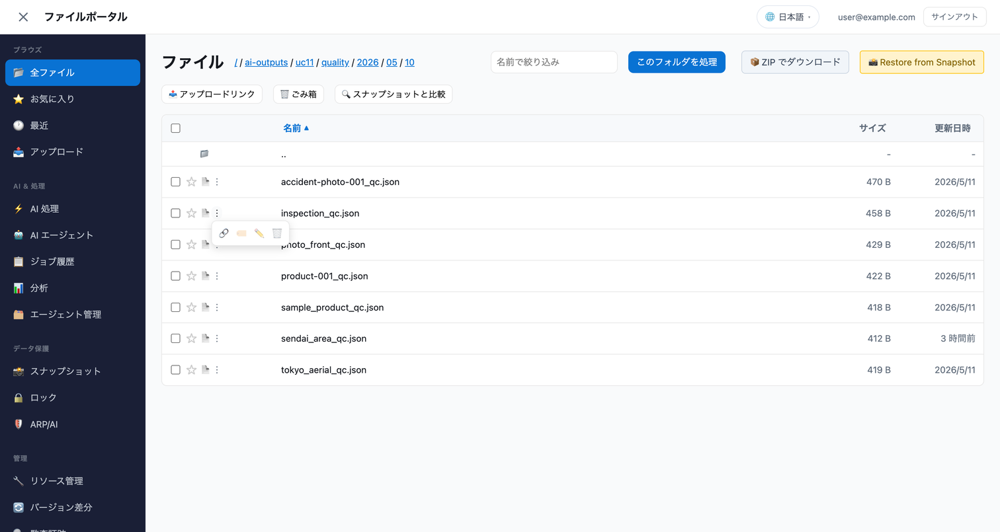

行に常時表示するのはチェックボックス・お気に入り・プレビューの 3 つで、残りは ⋮ の中です。以前は 1 行に 7 個の操作が並び、ファイル名を読む前にそれらを読み飛ばす必要がありました。

- ⋮ はホバー時ではなく常に表示します。ホバーはタッチ画面に存在しない状態で、ポインタが乗っている間だけ存在する操作は Tab でも到達できません
- 読み上げ名にファイル名を含めます（「inspection_qc.json のその他の操作」）。同名のボタンが行数だけ並ぶと区別できません
- `role="menu"` は付けていません。中身は共有リンクのパネルとタグエディタを含み、`menu` ロールが約束する矢印キーでの項目移動を提供しないためです。名前付きの `group` として公開しています
- 一覧の末尾 2 行はパネルが下に収まらないため上向きに開きます

**キーボードとスクリーンリーダー**:

- フォルダを開く操作は行そのものではなく**フォルダ名のボタン**が持ちます。Tab で到達し、Enter または Space で開きます。行のどこをクリックしても開く動作はそのままです
- 行全体をボタンにすると、お気に入りの星がボタンの入れ子になり、行の読み上げが「お気に入りに追加 📁 ai-outputs - -」のように星のラベルから始まってしまいます。名前側に持たせることで、読み上げは開く対象のフォルダ名になります
- 一括操作ボタンは選択件数を含む読み上げ名（「選択した 3 件をゴミ箱へ移動」）を持ちます。各行にも「ゴミ箱へ移動」ボタンがあるため、名前だけでは区別できません

**Office プレビュー（新機能 2026-07-22）**:
- PDF: Presigned URL を `<iframe>` に渡すだけ（ブラウザ内蔵ビューアで表示）
- DOCX: `docx-preview` ライブラリでクライアントサイドレンダリング（レイアウト再現度 70-80%）
- XLSX/PPTX: 現時点非対応（ダウンロードリンク表示）。Phase 2 で Lambda Container Image 対応予定

**完了通知と「元に戻す」**:

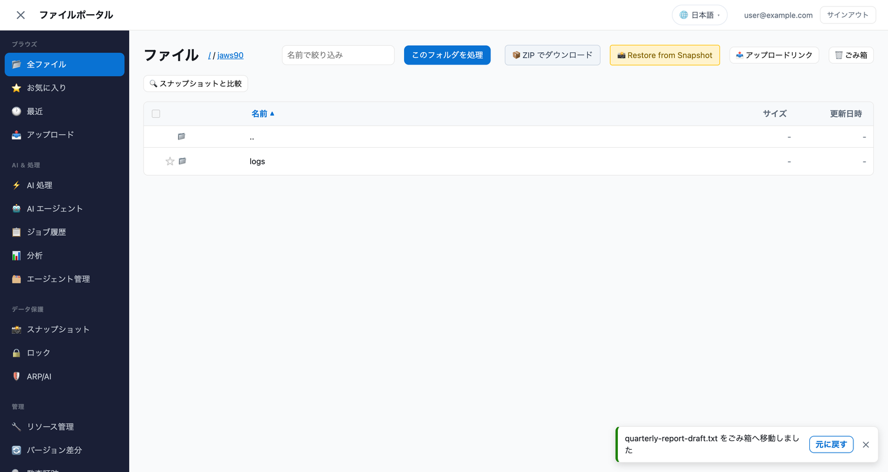

名前の変更・ごみ箱への移動・復元・一括操作は、完了時に右下に通知を出します。以前は成功が無言で、一覧が再描画されたことだけが手がかりでした。

- 名前の変更とごみ箱への移動には**「元に戻す」**が付きます。どちらも逆向きの操作が存在するためです（名前の変更は逆方向の名前の変更、ごみ箱への移動は復元）
- 単一ファイルのごみ箱移動から**確認ダイアログを外しました**。ダイアログは事前に、毎回、まだ判断材料がない時点で尋ねます。「元に戻す」は事後に、間違いが見えている時点で答え、間違いがなければ何のコストもかかりません
- 一括操作の確認ダイアログは残しています。こちらが伝えるのは危険性ではなく**所要時間**です（選択件数と同じ回数の CopyObject + DeleteObject が走ります）
- 「元に戻す」が対象にするのは**実際に動いたファイルだけ**です。5 件中 3 件が成功した一括操作では、その 3 件だけを戻します
- バックエンドが移動先のキーを返さなかった場合、「元に戻す」は表示されません。押しても動かないボタンは無いほうがよいためです
- 通知は 12 秒（「元に戻す」付き）または 6 秒で自動的に閉じます。エラーは自動では閉じません

**名前変更 / ごみ箱の実体**:
- どちらも S3 Access Point 上の CopyObject + DeleteObject です。メタデータの書き換えではないため、大きなファイルでは時間がかかります
- ごみ箱は同一バケット内の `.trash/` プレフィックスです。別のストレージではないため、容量は解放されません
- CopyObject は IAM アクションではありません。実行ロールに必要なのは source の `s3:GetObject` と `s3:GetObjectTagging`、destination の `s3:PutObject` と `s3:PutObjectTagging`、および元を消すための `s3:DeleteObject` です。`s3:CopyObject` という記述は存在しないアクションで、何も許可しません（[ポータル CDK / 品質ゲートの罠](../../../docs/agent/portal-cdk-quality-gates.md) 参照）

**アップロードリンクの注意**:
- 発行した URL 自体が認証情報です。期限まで、URL を持つ誰でもそのキーに書き込めます
- UI が保存先キーと有効期限を併記するのはこのためです

**文書解析の適用範囲**:
- Textract / Comprehend はファイルの内容をマネージドサービスに送信します
- 規制フォルダー（`phi/`、`dicom/`、`pii/`、`hipaa-`、`protected-health-`）配下では拒否されます。判定は `src/utils/regulatedPath.ts` の 1 箇所に定義されています

**CONFIDENTIAL ガードレール**:
- `shared/ai_guardrails.py` のデータ分類ラベルが CONFIDENTIAL/CUI の場合、AI Q&A をブロック
- ブロック時はエラーメッセージで分類レベルと理由を表示

---

### Favorites（お気に入り）

ユーザーがピン留めしたファイルを DynamoDB に保存（owner-scoped）。ワンクリックで All Files の該当ファイルにジャンプ。

---

### Recent（最近のファイル）

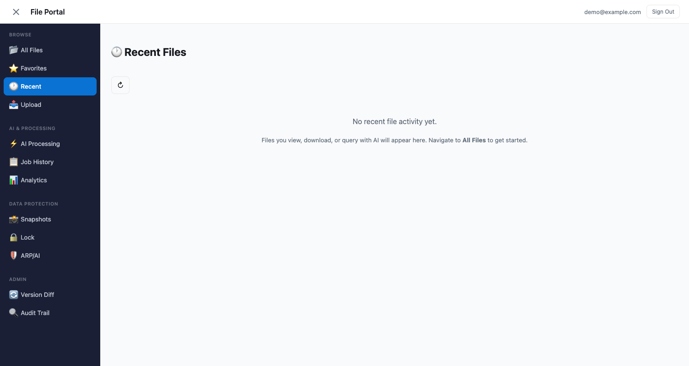

| 表示情報 | 説明 |
|---------|------|
| ファイル名 + パス | 最後にアクセスしたファイル |
| アクションアイコン | 👁️ 閲覧 / 📥 ダウンロード / 🤖 AI Q&A / 🖼️ プレビュー / 🔗 共有 |
| 相対時間 | 「2m ago」「3h ago」「2d ago」形式 |
| クリック動作 | All Files の該当ファイルにナビゲート |

**技術詳細**:
- DynamoDB `RecentFile` モデル（owner-scoped, Cognito ユーザーごとに独立）
- `recordRecentFile()` ユーティリティを他コンポーネントから呼び出してログ記録
- 最新 30 件を `accessedAt` 降順で表示
- 空状態: 「No recent file activity yet. Navigate to All Files to get started.」

---

### フォルダー監視（Folder Watch）

管理設定で「フォルダー監視」を有効にしたときだけサイドバーに現れます（既定はオフ）。

| 機能 | 操作 |
|------|------|
| 監視の追加 | プレフィックスを入力 → 対象イベント（作成 / 更新 / 削除）を選択 → 監視を追加 |
| 監視の解除 | 監視対象テーブルの「解除」 |
| 受信箱 | 登録したプレフィックス配下のイベントを新しい順に表示 |
| 未構成の表示 | 通知テーブルが未接続の場合、推測せず「未構成」と表示 |

**トグルが管理設定にある理由**:
- ポータルはイベントの発行元ではありません。FPolicy サーバーまたは Transfer Family が EventBridge に発行している必要があります
- 有効化は「発行元が存在する」という管理者の宣言です。既定オンにすると、発行元のない環境では永久に空の受信箱を見せることになります

**境界の絞り込み順序**:
1. Cognito グループのパス境界（`GROUP_PATH_PREFIXES`）
2. 自分の監視対象プレフィックス

この順序は入れ替えられません。監視は自分のレコードなので `/` も登録できますが、グループ境界の外は見えません（`storage-admin` は境界を迂回）。単一テナント構成では全イベントが見えます。ファイル一覧と同じ境界です。

**受信箱を Lambda 経由で読む理由**:
- `FileNotification` は `allow.authenticated()` で、ブリッジ Lambda は owner を持たずに書き込みます
- 生成モデルクライアントから直読させると、任意の認証ユーザーが全パス・全ユーザー名・全クライアント IP を読めてしまいます

**経路**: FPolicy サーバー（または Transfer Family）→ EventBridge → 通知ブリッジ Lambda → `FileNotification` テーブル → ポータル。FPolicy 自体の構成は [event-driven/fpolicy パターン](../../event-driven/fpolicy/) を参照。

---

### Upload（Storage Browser for S3）

| 機能 | 操作 |
|------|------|
| ファイルアップロード | ドラッグ＆ドロップ（最大 50 GB。5 GB 超はマルチパートに自動切替） |
| フォルダ作成 | 新規フォルダ |
| コピー・削除 | ファイル操作 |
| ページネーション | 大量ファイル対応 |

- `@aws-amplify/ui-react-storage` の Storage Browser コンポーネント
- Cognito Identity Pool の一時認証情報で S3 AP に直接アクセス（Lambda 不要）
- NFS/SMB からのファイルがリアルタイム反映（ONTAP 強一貫性）

---

## AI & Processing グループ

### AI Processing（ワークフロー起動）


| 機能 | 操作 |
|------|------|
| パターン選択 | UC1-UC28 / OPS1 / FC7_FLEXCLONE_RESTORE |
| 入力パス指定 | 処理対象ディレクトリ |
| ジョブ投入 | Step Functions StartExecution（AppSync HTTP resolver） |

---

### AI Chat（ツール実行エージェント）

ファイルを対象に、ツールを呼びながら応答するエージェントです。素のチャットと、保存済みエージェント / チームの実行の両方に使います。

| 機能 | 説明 |
|------|------|
| モード選択 | 通常チャット / エージェントモード。管理設定でエージェントモードを無効化すると選択肢が消える |
| ツール | ファイル一覧、読み取り、検索、および承認要求。エージェント定義のツールは実在するツールとの積集合になる |
| アクション承認 | 変更を伴う操作はカードで提示され、ユーザーの承認まで実行されない |
| 保存済みエージェントの実行 | Agent Directory から起動すると、その定義（システムプロンプト + ツール）で実行される。実行中はバッジで定義名を表示し、モード選択は隠れる |
| チームの実行 | Multi-Agent Teams から起動。メンバー構成とロールを 1 ターンのスーパーバイザーとして実行する（並行エージェントではない） |

> 到達できないチームメンバーがいても実行は継続し、応答の `unavailableMembers` に名前が入ります。全員到達できない場合のみ実行を拒否します。

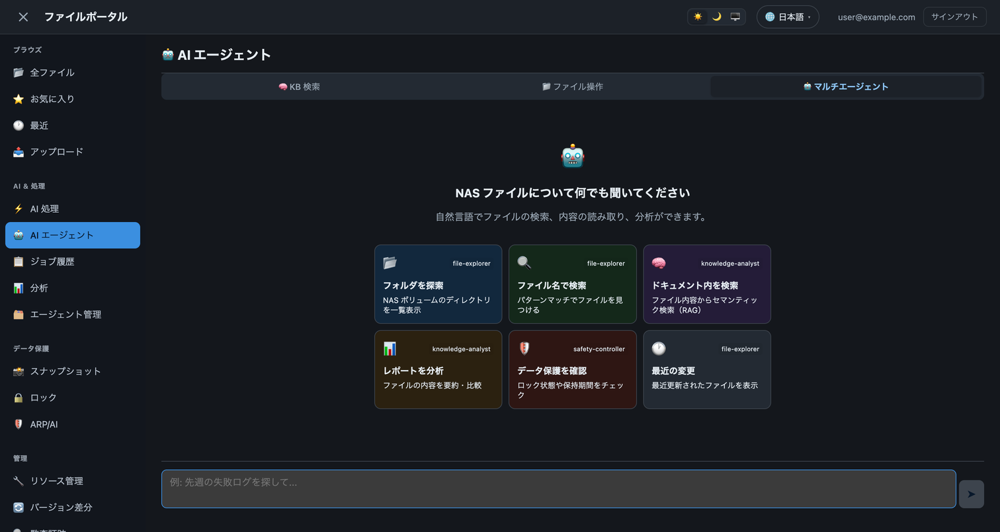

初回表示の 6 枚のカードは担当エージェントごとに配色が異なる（file-explorer は青、
knowledge-analyst は紫、safety-controller は赤）。配色はトークン参照なのでテーマに追従する。

---

### Search（セマンティック検索）

Bedrock Knowledge Base の Retrieve を使い、ファイル名ではなく内容で検索します。結果からファイルを選ぶと All Files の該当箇所に移動します。

---

### Job History（実行履歴）

DynamoDB `JobExecution` モデル（owner-scoped）。過去のジョブを executionArn, pattern, status, 開始/終了時刻とともに表示。

---

### Analytics（Athena SQL）

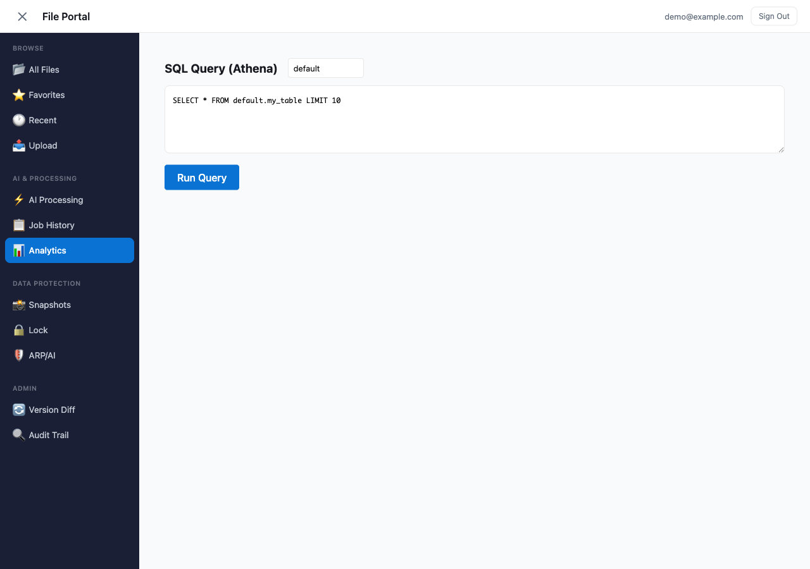

Athena SQL クエリを実行し、結果をテーブル表示。Glue Data Catalog ブラウザ（データベース → テーブル → スキーマ）も統合。

---

### Agent Directory（エージェント定義）

保存済みエージェント定義の一覧です。カードをクリックすると詳細（ツール、システムプロンプト）が開きます。

| 操作 | 説明 |
|------|------|
| 💬 チャットで使う | AI Chat をその定義で開いて実行する |
| ✏️ 編集 | 名前 / 説明 / システムプロンプト / カテゴリ / アイコン / 共有設定を変更。**作成者本人にのみ表示** |
| 🗑️ 削除 | 定義を削除。**作成者本人にのみ表示** |
| 検索 / カテゴリ絞り込み | 名前と説明の部分一致、カテゴリでの絞り込み |

> ツールは作成画面で選びます。実行時には実在するツールとの積集合が使われるため、編集フォームでは変更できません（緩く編集できると表示と実際が食い違うため）。

> 他ユーザーが共有した定義には編集 / 削除が表示されません。サーバー側でも作成者以外を拒否しますが、押せるボタンを出すと認可エラーが唯一の説明手段になってしまうため、UI 側でも隠しています。

---

## Data Protection グループ

### Snapshots（+ Tamperproof Snapshot ロック）

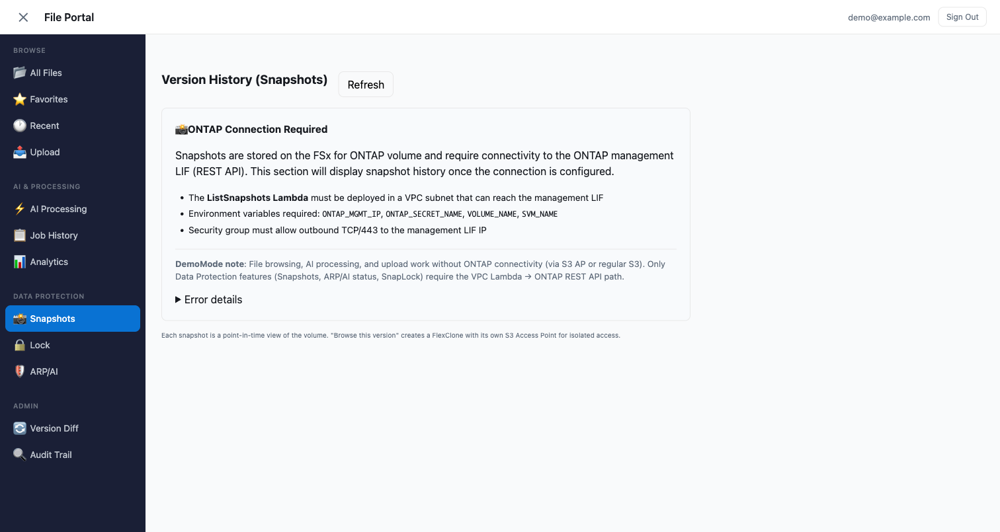

ONTAP REST API 経由で Snapshot 一覧を取得。各 Snapshot から「Browse this version」ボタンで FlexClone + S3 AP を作成し、過去のファイル状態にアクセス。

**Tamperproof Snapshot（Snapshot Locking）**:
- 各 Snapshot に 🔐（ロック済み）/ 🔓（未ロック）状態を表示
- ロック済み Snapshot は `expiry_time` まで削除不可（管理者含む）
- 「🔒 Lock」ボタン → 保持期間（1-365 日）を指定してロック（storage-admin グループのみ）
- ONTAP REST API: `PATCH /api/storage/volumes/{uuid}/snapshots/{uuid}` に `expiry_time` を設定

**前提条件（Tamperproof 有効化）**:
- ボリュームで Snapshot Locking が有効であること: `volume modify -volume <vol> -snapshot-locking-enabled true`
- SnapLock ライセンスは不要（Snapshot Locking は SnapLock とは別機能）

**ONTAP 未接続時のフォールバック UI**: 白画面ではなく、接続手順付きの info パネルを表示。

---

### Lock（SnapLock + Tamperproof + S3 Object Lock）

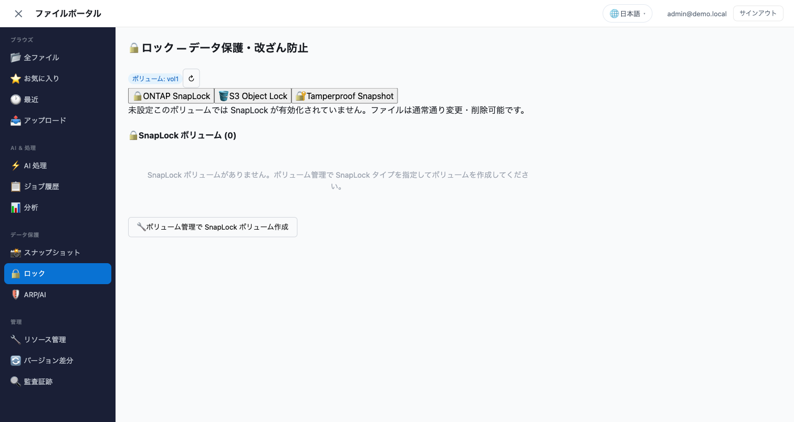

ONTAP REST API から以下をリアルタイム取得:

| 取得情報 | API | 表示内容 |
|---------|-----|---------|
| SnapLock タイプ | `GET /api/storage/volumes?fields=snaplock` | Compliance / Enterprise / Non-SnapLock |
| 保持ポリシー | 同上 | Default / Min / Max retention period |
| Autocommit 期間 | 同上 | 非活動ファイルの自動 WORM コミット期間 |
| Snapshot Locking 有効/無効 | `fields=snapshot_locking_enabled` | 🔐 Enabled / 🔓 Not enabled |

**3 層の不変性を統合表示**:
1. **ONTAP SnapLock**: ボリュームレベル WORM（NFS/SMB/S3 AP 全プロトコルで強制）
2. **Tamperproof Snapshot**: Snapshot 単位のロック（Snapshots タブで操作）
3. **S3 Object Lock**: 出力バケット WORM（AI 処理結果のアーカイブ保護）

**ONTAP 未接続時のフォールバック UI**: 白画面ではなく、接続手順付きの info パネルを表示。

---

### ARP/AI（ランサムウェア検知）

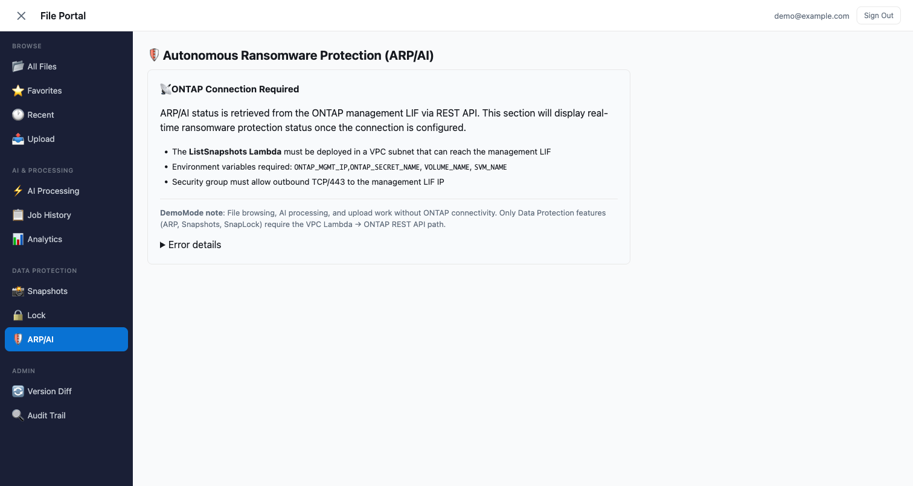

ONTAP REST API から以下をリアルタイム取得:

| 取得情報 | API | 表示内容 |
|---------|-----|---------|
| ARP 状態 | `GET /api/storage/volumes?fields=anti_ransomware` | enabled / dry_run / paused / disabled |
| 脅威レベル | 同上 (`attack_probability`) | none / low / moderate / high |
| Learning 開始時刻 | 同上 (`dry_run_start_time`) | dry_run 状態の場合に表示 |
| 自動 Snapshot | state=enabled 時に有効 | 脅威検知時に自動で不変 Snapshot 作成 |

**ARP 状態カード**:
- ✅ `enabled`: AI 駆動の保護が有効（ファイルエントロピー、拡張子変更、アクセスパターン監視）
- 🔄 `dry_run`: Learning モード（パターン学習中、ブロックなし）
- ⏸️ `paused`: 管理者が一時停止
- ⚠️ `disabled`: 未設定

**脅威レベル表示**:
- 🟢 `none`: 脅威なし
- 🟡 `low`: 低確率の異常検知
- 🟠 `moderate`: 中程度 — 確認推奨
- 🔴 `high`: ランサムウェア攻撃の可能性 — 即座に対応が必要

**ONTAP 未接続時のフォールバック UI**: 白画面ではなく、接続手順付きの info パネルを表示。

---

## Admin グループ

### Resources（リソース管理）

ONTAP System Manager 相当のストレージ管理。`storage-admin` Cognito グループのメンバーにのみサイドバーに表示されます。

Volumes、FlexClone、Qtrees、Quotas、Storage Efficiency、Export Policies、SMB Shares、Local Users、Name Mapping、QoS、ARP/AI、Snapshot 管理、SnapLock、FPolicy、Vscan、SnapMirror、FlexCache、Cluster（ノード / ライセンス / EMS イベント）。

手順は [管理者向けリソース管理 デモガイド](../../../docs/ja/admin-resource-management-demo.md)（27 シナリオ）を参照してください。

> グループ外のユーザーには表示されません。AppSync 側でも `allow.groups(["storage-admin"])` で拒否しますが、開けば必ずエラーになるメニューはメニューとして成立しないためです。

---

### Version Diff（Snapshot 間差分）

2 つの S3 AP（Current Volume vs FlexClone）のファイルを並列比較。追加/削除/変更をカラーコードで表示。

**ONTAP 未接続時のフォールバック UI**: Snapshots セクションと同じ info パネル。

---

### Audit Trail（監査証跡）

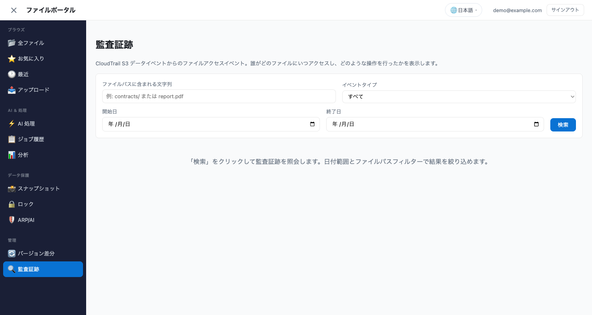

CloudTrail S3 データイベントを Athena で検索。フィルター: ファイルパス、イベント種別（Read/Write/All）、日付範囲。「誰が、いつ、どのファイルを」を表示。

---

## プレビュー対応形式

| 拡張子 | プレビュー方式 | アイコン |
|--------|:---:|:---:|
| `.jpg`, `.jpeg`, `.png`, `.gif`, `.webp`, `.bmp`, `.svg` | Presigned URL → ポップオーバー | 🖼️ |
| `.pdf` | Presigned URL → iframe（ブラウザ内蔵ビューア） | 📕 |
| `.docx` | Presigned URL → docx-preview（クライアントサイド） | 📝 |
| その他 | ダウンロードリンク | 📄 |

---

## 多言語対応 (i18n)

ポータルは 8 言語に対応し、トップバーのピル型ドロップダウンから即座に切り替え可能。

| 言語 | ブラウザ自動検知 |
|------|:--------------:|
| 日本語 / English / 한국어 / 简体中文 / 繁體中文 / Français / Deutsch / Español | ✅ |

- **Language Switcher**: 🌐 グローブアイコン + ネイティブ文字で現在の言語表示 + ▾ シェブロン
- **永続化**: `localStorage("portal-locale")` に保存
- **翻訳カバレッジ**: サイドバー全ラベル、セクションタイトル、ARP/Lock/Snapshots の全テキスト、ダイアログ、フォールバック UI
- **技術用語**: ONTAP, SnapLock, FlexClone, S3 AP, ARP/AI 等は全言語で英語表記

---

## テーマ（ライト / ダーク / システム）

トップバーに ☀️ 🌙 🖥️ の 3 択トグルがある。2 状態のスイッチではなく 3 択にしているのは、
「システムに追従」が実在する答えだからである。2 状態だとどちらかを初期値に決めるしかなく、
一度も触らない利用者の半分にとってその初期値は誤りになる。

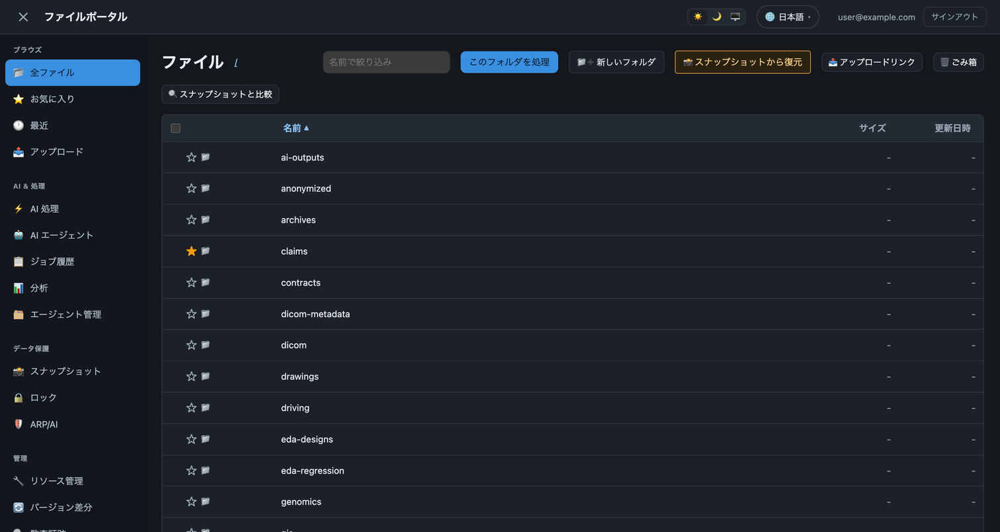

| 選択 | 挙動 | localStorage |
|------|------|--------------|
| ☀️ ライト | 常にライト | `portal-theme=light` |
| 🌙 ダーク | 常にダーク | `portal-theme=dark` |
| 🖥️ システム | OS の設定に追従。日没時に OS が切り替われば追従する | キーを削除 |

「システム」でキーを保存せず削除しているのは、キーが無い状態と「システムに追従」が
同じ状態であり、両方を持つと食い違う余地が生まれるためである。

### 実装: 値ではなく役割で対応付ける

配色は 32 個のトークンとして `:root` と `[data-theme="dark"]` に定義し、各ルールは
トークンを参照する。**値ではなく役割で対応付ける**のが要点で、`white` は `color` なら
`--color-text-inverse`、`background` なら `--color-surface` になる。値だけを一括置換すると
役割が反転して壊れる。

初回描画前に `index.html` のインラインスクリプトが `data-theme` を解決するので、
保存済みの選択が一瞬ライトで描かれてから切り替わる（FOUC）ことはない。CSS 側に
`@media (prefers-color-scheme: dark)` は**置いていない**。パレットを二重に持つと片方が
古くなり、誰も見ていないテーマが壊れる。

### ガードレール

`make drift` が 5 つのルールで検査する。上の 4 つは色を、5 つ目は表示文字列を見る。
共通しているのは**書いた本人には見えない**という性質である。ハードコードされた明るい色は
書いた人のテーマでは正しく、ダークテーマで開いた人にだけ白い板が見える。

| ルール | 検出対象 |
|--------|---------|
| `theme-literal` | スタイルシート内の色リテラル。上限 4（意図的な 4 件は行にコメントで理由を記載） |
| `inline-colour` | JSX の `style={{ }}` 内の色リテラル。上限なし（インラインは後から上書きできないため） |
| `undefined-token` | 定義されていないトークン名の参照。常にフォールバックへ落ちる、または宣言が破棄される |
| `theme-contrast` | 同一ルール内の文字色と背景色のコントラスト比を両テーマで検査（WCAG AA: 本文 4.5:1 / 大きい文字 3:1） |
| `locale-escaping` | ロケール文字列の過剰エスケープ。`\"` のつもりの `\\"` は画面にバックスラッシュを出す |

`theme-contrast` はトークン化しただけでは足りないことへの対策である。ダークテーマの
アクセント色は暗い背景から浮かせるために**明るく**する必要があり、その上に白文字
（`--color-text-inverse`）を載せると primary ボタン全体が 3.4:1、承認ボタンが 2.8:1 になる。
白い板ではないのでリテラル系のルールは全て満たしてしまう。
対策として `--color-on-primary` / `--color-on-success` / `--color-on-error` を用意した。
**塗りはテーマで反転しないが、その上の文字は反転する**という役割である。

同一ルール内の組み合わせだけを静的に検査する。別のセレクタから背景が来る場合はカスケードの
解決が必要でブラウザが要るため、そちらは実機の目視検査に回している。

> **ゲートを信用する前に、通してはいけない入力で落ちることを確認する。**
> `theme-literal` は当初、行頭に固定した正規表現だったため
> `.state-online { background: #dcfce7; }` のような 1 行ルールを見られず、201 件あるうち
> 5 件と報告していた。`inline-colour` が無かった間は AI エージェントのカード 6 枚が
> インラインの淡色を保持し、ダークテーマの明るい文字と重なってコントラスト 1.1:1 で
> 出荷されていた。いずれもリポジトリの全ゲートが緑のままだった。
> 検査そのもののテストは `scripts/tests/test_theme_literal_check.py` にある。

---

## モバイル対応

スマートフォンのブラウザで利用できる。専用アプリはなく、同じ URL を開く。

> **利用者向けの手順**は[ユーザーガイドの「4. スマートフォンで使う」](../../../docs/ja/portal-user-guide.md)
> にある。この節はブレークポイントと CSS 側の扱いを説明する。

> **テーマトグルの 🖥️ はデスクトップ表示の切り替えではない。** 「システムに合わせる」
> （OS の外観設定に追従）という 3 つ目の選択肢である。モバイル対応とは無関係。

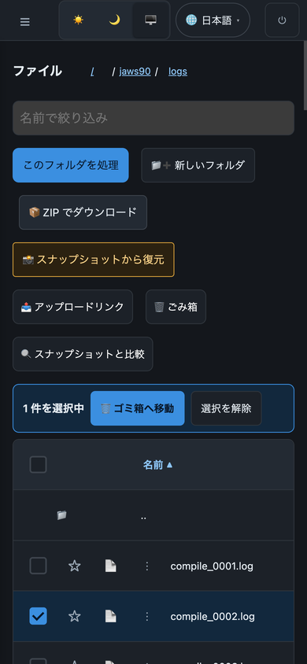

| 幅 | 挙動 |
|----|------|
| 769px 以上 | サイドバーは本文の左に並ぶ列。既定で開いている |
| 768px 以下 | サイドバーは本文の**上に重なるドロワー**。既定で閉じており、☰ で開く。セクションを選ぶと閉じる |
| 480px 以下 | トップバーは操作のみを残す（製品名は視覚的に隠すが h1 として DOM に残る、サインアウトはアイコンのみ、メールアドレスは非表示） |
| 768px 以下 | 一覧の「サイズ」「更新日時」列を省略。480px 以下では名前と操作のみ |

### 満たしている基準

- **横スクロールなし**（390px 幅・11 タブ・両テーマで確認）
- **入力欄は 16px 以上**。iOS Safari は 16px 未満のフィールドにフォーカスするとページを拡大し、拡大後はレイアウトが収まらなくなる
- **タップ領域は 44×44**（行のチェックボックス・お気に入り・プレビュー・⋮、ヘッダーの
  各ボタン、絞り込み欄、プレビューの閉じる/ダウンロード）。WCAG 2.2 の下限は
  SC 2.5.8 の 24×24（AA）だが、指で扱う主要操作は SC 2.5.5（AAA）の 44×44 に揃えている
- **ドロワーは暗幕付き**。開くと本文が暗くなり、暗幕のタップまたは Escape で閉じる。
  セクションを選んでも閉じる
- **画面回転に追従**。390×844 はドロワー、844×390 は列。回転すると配置が切り替わる
- **プレビューはボトムシート**（画面下から最大 70vh）。行に紐づく吹き出しではないので、
  一覧のスクロールで切れたり画面外に開いたりしない

> **行のチェックボックスは自前描画**。ネイティブのチェックボックスは padding を無視するため、
> 既定の外観のままでは当たり判定を箱より大きくできない。`appearance: none` で 44×44 の
> 領域に 22px の四角を描き、チェックは回転させたボーダーで引いている（トークン参照なので
> 両テーマで見える）。

### レスポンシブ指定を書くときの注意

**メディアクエリは詳細度を上げない。** `@media (max-width: 768px)` の中の規則は、
同じセレクタが後方にあれば負け、より詳細なセレクタがどこにあっても負ける。宣言は
残ったまま無視されるので、失敗が静かである。実際に 2 件同時に発生していた。

- `.portal-layout { grid-template-columns: minmax(0, 1fr) }` が 200 行前の
  `.portal-layout.sidebar-collapsed`（クラス 2 個）に負けた。モバイルの既定は
  collapsed なので、1 領域のテンプレートに対して 3 列のデスクトップ配置が適用され、
  トップバーが 40px 幅になった
- `.form-group label` の指定が 1,000 行後の同一セレクタに負けていた

**レスポンシブ指定は、それが上書きする規則の直後に置く。** `make drift` の
`dead-media-override` ルールがこれを機械的に検出する。

| ルール | 検出対象 |
|--------|---------|
| `dead-media-override` | `max-width` メディアクエリ内の宣言のうち、後方の同一セレクタまたはより詳細なセレクタに負けて適用されないもの。`!important` は両方向で考慮する |

---

## CDK 品質ゲート

このポータルは以下の品質ゲートで保護されています:

| ツール | チェック内容 |
|--------|------------|
| cdk-nag (AwsSolutionsChecks) | IAM 過剰権限、暗号化、ログ保持 |
| CDK ハーネステスト (47 assertions) | Lambda 数、ランタイム、環境変数 |
| IAM Access Analyzer | ポリシーの SECURITY_WARNING 検知 |
| floci 統合テスト (9 tests) | S3 ListObjectsV2 + Delimiter 動作 |

cdk-nag は既定で無効（opt-in）。見たいときだけ `CDK_NAG=1 npx ampx generate outputs` を実行する。CI には未統合。
