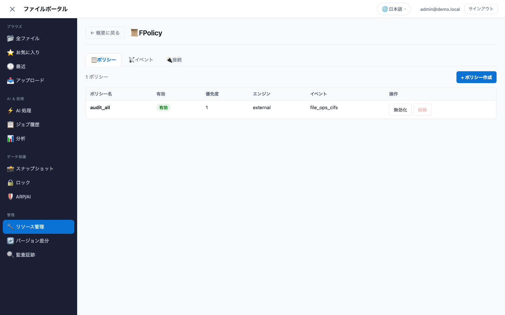

# リソース管理 デモガイド

🌐 **Language / 言語**: 日本語 | [English](resource-management-demo-guide.en.md)

> `管理 → リソース管理` の 20 パネルを操作する手順です。
> 各パネルがどの ONTAP REST API を呼ぶか、何が確認できれば成功かを示します。

[English](resource-management-demo-guide.en.md)

---

## 前提条件

| 条件 | 確認方法 |
|------|---------|
| `storage-admin` Cognito グループに所属 | ログイン後、左メニューに `管理` セクションが表示される |
| ONTAP 管理エンドポイントに到達可能 | パネルを開いて `接続中...` のまま止まらない |
| Secrets Manager に ONTAP 資格情報 | `ONTAP_SECRET_NAME` が設定済み |
| SVM で CIFS 有効（SMB 系パネルのみ） | SMB 共有・ローカルユーザー・名前マッピングを使う場合 |
| intercluster LIF（ピアリングのみ） | `ピアリング → intercluster LIF` タブに up の LIF が出る |

ONTAP に未接続の場合、各パネルは空の状態とセットアップ手順を表示します。
エラーダイアログは出ません。まず接続設定は
[ONTAP 接続ガイド](ONTAP-CONNECTION-GUIDE.md) を参照してください。

---

## デモシナリオ

### シナリオ 1: パネル一覧の確認

1. 左メニューの `管理 → リソース管理` を開く
2. カテゴリごとにカードが並ぶ

確認ポイント: **5 カテゴリ・20 カード**が表示されること。

| カテゴリ | カード数 | 内容 |
|---------|:-------:|------|
| ストレージ | 6 | ボリューム / Qtree / クォータ / ストレージ効率 / FlexCache / FlexClone |
| アクセス制御 | 5 | エクスポートポリシー / SMB 共有 / QoS ポリシー / ローカルユーザー / 名前マッピング |
| データ保護 | 6 | ARP/AI 保護 / スナップショット管理 / SnapLock / SnapMirror / ウイルススキャン / FPolicy |
| クラスター | 2 | ピアリング / クラスター情報 |
| AI サービス | 1 | AI 設定 |

上部にはストレージ健全性の 4 カード（ボリューム数、ARP 保護、ロック済みスナップショット、
ストレージ効率）が表示されます。カードをクリックすると該当パネルに移動します。

**対象 SVM**: ファイルシステムが複数の SVM を持つ場合、ヘッダー右に `対象 SVM` セレクターが
出ます。選択は `svm` を読むすべてのアクションに渡され、切り替えると管理系の一覧が
その SVM のものに変わります。SVM が 1 つの環境では選ぶものが無いので表示されません。

確認ポイント: 切り替え後にボリューム一覧の内容が変わること。別 SVM に作ったボリュームが
既定の SVM の一覧に出ないのは正常で、それを見るための切り替えです。

---

### シナリオ 2: SMB ローカルユーザーとグループ

`アクセス制御 → ローカルユーザー`

ONTAP REST: `/protocols/cifs/local-users`、`/protocols/cifs/local-groups`

**ユーザー作成**

1. `👤 ユーザー` タブで `+ ユーザー作成`
2. ユーザー名・パスワード・フルネーム・説明を入力
3. `作成`

確認ポイント: 一覧に追加され、`所属グループ` 列と `状態`（有効／無効）が表示されること。

> **セキュリティに関する補足**: パスワードは Lambda のログに出力しません。
> 監査ログにはユーザー名と実行者のみが残ります。

**グループ作成とメンバー管理**

1. `👥 グループ` タブで `+ グループ作成`
2. グループ名・説明を入力し `作成`
3. 作成したグループの `▶ メンバー` を展開
4. メンバー名を入力して追加

確認ポイント: `✅ グループを作成しました` が表示され、件数が増えること。

メンバー名にドメイン付き（`DEMO\alice`）を指定できます。削除時はパス
セグメントとして URL エンコードされます。

**削除**

`ユーザーを削除` / `グループを削除` は SID を使って削除します。
SVM UUID は自動で解決されます。

---

### シナリオ 3: 名前マッピング（Windows ↔ UNIX）

`アクセス制御 → 名前マッピング`

ONTAP REST: `/name-services/name-mappings`

1. `+ マッピング作成`
2. 方向を選ぶ（`Windows → UNIX` または `UNIX → Windows`）
3. インデックス、パターン（正規表現）、置換文字列を入力
4. `作成`

確認ポイント: 方向が `Windows → UNIX` のように表示され、インデックス順に並ぶこと。

> **S3 Access Point に関する補足**: `S3 → UNIX` 方向のマッピングは、
> S3 Access Point をアタッチしたときに FSx for ONTAP が自動生成・自動削除します。
> ポータルから作成しようとすると、その旨のメッセージを返して処理を中止します。
> 手動管理は不要です。

置換文字列を空にすると、ONTAP の仕様上そのユーザーのマッピングを明示的に拒否する
意味になります。一覧では `" " (deny)` と表示されます。

**評価順（index）の移動**

`編集` はパターンと置換文字列を書き換えます。評価順を変えるのは別のボタンです。

1. 行の `順序を変更`
2. `移動先の index` を入力（現在と同じ値では `実行` が押せません）
3. `実行`

確認ポイント: 移動した行が指定した index に並び、**間のルールの index も繰り上がる**こと。
ONTAP は index 順に評価して最初に一致したルールで止まるので、順序を変えると
「どのルールが先に当たるか」が変わります。削除は繰り上げませんが、この移動は繰り上げます
（実測: `win_unix` の 2 番を 1 番へ移動すると、1 番だったルールが 2 番になる）。

---

### シナリオ 4: FlexCache

`ストレージ → FlexCache`

ONTAP REST: `/storage/flexcache/flexcaches`

1. `+ FlexCache 作成`
2. キャッシュ名、オリジンボリューム、オリジン SVM（同一 SVM なら空欄）、サイズ、
   ジャンクションパスを入力
3. 必要ならプリポピュレートするディレクトリをカンマ区切りで指定
4. `作成`

確認ポイント: `オリジン → キャッシュ` の関係が矢印付きで表示され、サイズ・パス・
Global File Locking の状態が出ること。作成は非同期なので、ジョブ ID が返ります。

サイズはオリジンボリュームの 10% 程度が目安ですが、それは下限ではありません。FlexCache は
FlexGroup なので、下限は「構成ボリュームあたりの最小値 × ONTAP が選んだ構成ボリューム数」に
なり、クラスターによって変わります（検証環境の実測では 50 GB）。下回る指定は ONTAP が
ジョブ内で拒否し、そのメッセージにこのファイルシステムでの下限が入ります。

**サイズ変更**

キャッシュは作成時のサイズに固定されません。行の `サイズ変更` でパネルが開きます。

1. 行の `サイズ変更`
2. サイズ (GiB) を入力（現在と同じ値では `適用` が押せません）
3. `適用`

オリジンのサイズとは独立です。キャッシュを大きくしてもオリジンは変わりません。

作成時の下限は既存キャッシュの縮小には適用されません（実測: 作成が 50 GB 未満で拒否される
ファイルシステムで、既存の 100 GiB キャッシュを 20 GiB へ縮小できた）。「作成できない値までは
縮小できない」と考えないこと。

確認ポイント: FlexGroup のサイズ変更は ONTAP のジョブとして続くため、`サイズ変更を
受け付けました` と出た直後は一覧が古い値のままのことがあります（実測: 拡大・縮小の
どちらも 10 秒を超えて継続）。パネルは 20 秒後にもう一度取得します。

**書き込みモード**

FlexCache は読み取り専用ではありません。キャッシュへの書き込みは受け付けられ、
どちらのモードでも ONTAP がオリジンとの整合性を保ちます。違いは完了を返す場所です。

| モード | 動作 | 要件 |
|--------|------|------|
| write-around（既定） | 書き込みをオリジンに転送し、オリジンが確定してから完了を返す | なし |
| write-back | キャッシュで確定して即座に完了を返し、オリジンへは非同期に反映する | キャッシュとオリジンの**両方**が ONTAP 9.15.1 以降 |

作成フォームの `write-back を有効にする` で作成時に指定できます。既存のキャッシュは
行の `write-back 有効化` / `write-back 無効化` で切り替えられます。無効化はキャッシュに
しかない書き込みをオリジンへ反映するため、**キャッシュを削除する前に必要**です。

確認ポイント: 行に `✍️ write-around` または `✍️ write-back` のバッジが常に表示され、
切り替え後に一覧へ反映されること。

**削除**

行の `削除` → `本当に削除？` → `実行` の 2 段階です。誤操作を防ぐため、
1 回目のクリックでは削除されません。write-back が有効なキャッシュは ONTAP が削除を
拒否し、その理由と対処（先に write-back を無効化する）がエラーに添えられます。

---

### シナリオ 5: FlexClone

`ストレージ → FlexClone`

ONTAP REST: `/storage/volumes`（`clone` ブロック付き POST、一覧は
`clone.is_flexclone=true` でフィルタ）

1. `+ FlexClone 作成`
2. クローン名、親ボリューム、親スナップショットを入力
3. `作成`

確認ポイント: 一覧に親ボリューム・親スナップショット・サイズ・使用量が表示されること。

> **セキュリティスタイルに関する補足**: クローンのセキュリティスタイルと
> エクスポートポリシーは親ボリュームから継承されます。作成時に指定できないため、
> ポータルからも送信しません。

**分割**

`分割` をクリックすると確認後に分割が始まり、行が `分割中 n%` に変わります。

分割するとクローンは親とブロックを共有しなくなり、データ全量分の容量を消費します。
確認ダイアログにもその旨を表示します。

---

### シナリオ 6: SnapMirror の運用操作

`データ保護 → SnapMirror`

ONTAP REST: `/snapmirror/relationships`、`/snapmirror/relationships/{uuid}/transfers`

1. パネルを開くと、宛先が当該クラスターにある関係が一覧表示される
2. `▶ 転送履歴` を展開すると直近の転送が表示される

確認ポイント: `ソース → 宛先`、ポリシー名、Lag、健全性バッジ（正常／異常）が
表示されること。

`+ レプリケーション作成` で新規の関係を張れます。宛先ボリュームは ONTAP が作成するため、
事前に `volume create -type DP` を実行する必要はありません。

| 項目 | 内容 |
|------|------|
| SVM ピア | `peered` かつ用途に `snapmirror` を含むピアだけが選択肢に出る。ソース SVM、ソースクラスター、宛先 SVM はピアから決まる |
| ソースボリューム名 | 相手ファイルシステム上のボリューム名 |
| 宛先ボリューム名 | このファイルシステム上で未使用の名前 |
| 作成後に初期化する | POST に `state: snapmirrored` を含め、初回転送まで実行する |

確認ポイント: 作成直後は `uninitialized` で、初回転送が終わると `snapmirrored` に変わり
転送履歴に 1 件目が出ること。作成と初期化はどちらも Lambda の実行時間より長いため、
「実行中のジョブ」は受理として扱われます。一覧は遷移中の関係がある間だけ自動で再取得されます。

用途に `snapmirror` を含むピアが 1 つも無い場合は、選択肢の代わりに理由が表示されます。
`ピアリング → SVM ピア` の `用途を変更` で追加してください（ピアの作り直しは不要）。

行の操作ボタンから次を実行できます。

| 操作 | 呼び出し | 確認の有無 |
|------|---------|:---------:|
| 即時更新 | `POST /snapmirror/relationships/{uuid}/transfers` | — |
| 一時停止 | `PATCH state=paused` | — |
| 再開 | `PATCH state=snapmirrored` | — |
| break | `PATCH state=broken_off` | 要 |
| resync | `PATCH state=snapmirrored`（broken_off から） | 要 |
| 転送中止 | `PATCH transfers/{uuid} state=aborted` | — |
| 関係の削除 | `DELETE /snapmirror/relationships/{uuid}` | 要 |
| 新規作成 | `POST /snapmirror/relationships`（`create_destination` + `state`） | — |

「要」の操作は行内に確認行が出て、`実行` を押すまで送信されません。
ハンドラ側でも `confirm=true` がなければ実行しないため、UI を経由しない
直接呼び出しでも確認なしでは通りません。

> **切り替え手順に関する補足**: break は宛先を書き込み可能にする操作です。
> 切り戻し（resync）の方向によっては、宛先側の更新分が失われます。
> 実際の DR 切り替えでは、アプリ停止・DNS 切り替え・整合性確認を含む
> Runbook と併せて実行してください。ポータルは ONTAP 側の操作だけを担います。

---

### シナリオ 7: ウイルススキャン（Vscan）

`データ保護 → ウイルススキャン`

ONTAP REST: `/protocols/vscan/{svm.uuid}`、
`/protocols/vscan/{svm.uuid}/on-access-policies`

1. パネル上部のトグルで SVM の Vscan を有効・無効にする
2. `+ ポリシー作成` でオンアクセスポリシーを作る
   （名前、スキャン必須の有無、最大ファイルサイズ、除外パス、除外拡張子）
3. 行のトグルでポリシーを有効・無効にする
4. `削除` → 確認 → `実行` でポリシーを削除する

確認ポイント: 有効・無効の状態が即座に一覧へ反映され、除外パスと除外拡張子が
カンマ区切りで表示されること。

ツールバーの `📖 セットアップガイドを表示` から、対応製品の一覧・コネクタの入手先・
ONTAP CLI のコマンド例を含むセットアップ手順を開けます。Vscan が無効のときは自動で
表示され、有効にしたあとも同じ内容をこのボタンから参照できます。

> **前提に関する補足**: ポリシー定義は本ポータルから作成できますが、実際の
> スキャンには外部スキャンエンジンと Vscan コネクタが必要です。スキャナー側の
> 構成はスキャナー製品の管理ツールで行います。

---

### シナリオ 8: FPolicy

`データ保護 → FPolicy`

ONTAP REST: `/protocols/fpolicy/{svm.uuid}/events`、
`/protocols/fpolicy/{svm.uuid}/policies`

3 つのタブがあります。

| タブ | 内容 |
|------|------|
| 📋 ポリシー | ポリシー名、有効状態、優先度、エンジン種別、購読イベント |
| 📡 イベント | イベント定義名、プロトコル、監視対象の操作 |
| 🔌 接続 | ノード、ポリシー、外部サーバー、接続状態 |

1. `📡 イベント` タブで `+ イベント作成`
   （名前、プロトコル、監視する操作を選択）
2. `📋 ポリシー` タブで `+ ポリシー作成`
   （名前、購読するイベント、エンジン種別）
3. 行のトグルでポリシーを有効化する。有効化時は優先度が必須です
4. 不要になったら無効化してから `削除` → 確認 → `実行`

確認ポイント: 有効なポリシーでは削除ボタンが押せないこと（ONTAP が拒否するため）。
無効化すると削除できるようになります。

> **ONTAP の仕様に関する補足**: 有効化のリクエストには `priority` が必須で、
> 無効化では送ってはいけません。ポータルはこの違いを内部で処理します。

`📡 イベント` はイベント**定義**の一覧です。ファイルアクセスの実データを流す用途には
`solutions/event-driven/fpolicy/` のパターンを使ってください。

---

### シナリオ 9: クラスターピアリング

`クラスター → ピアリング`

ONTAP REST: `/cluster/peers`、`/network/ip/interfaces?services=intercluster_core`

AWS マネジメントコンソールにこの操作面はありません。従来は ONTAP CLI か
REST API を手作業で叩く必要がありました。

**前提の確認**

1. `🌐 intercluster LIF` タブを開く
2. up 状態の LIF が 1 つ以上あることを確認する
   （`ピアリング可能` バッジが出れば条件を満たしています）
3. セキュリティグループで、両クラスターの intercluster LIF 間に
   TCP 11104・11105 と ICMP を許可する

**片側で作成**

1. `🔗 クラスターピア` タブで `+ クラスターピア作成`
2. 相手クラスターの intercluster LIF アドレスをカンマ区切りで入力
3. `パスフレーズを生成する` をオンにして `作成`

確認ポイント: 生成されたパスフレーズがパネル上部に表示されること。
**この値は 1 回だけ表示されます。** 閉じると再表示できません。

**相手側で承認**

1. 相手クラスターのポータルで `🔗 クラスターピア` タブを開く
2. 該当行の `承認` をクリックし、同じパスフレーズを入力して `実行`

確認ポイント: 状態が `pending` から `available`、認証が `ok` に変わること。

**削除**

`削除` → 確認 → `実行`。依存する SVM ピアとレプリケーション関係を先に削除して
おく必要があります（残っていると ONTAP が拒否します）。

---

### シナリオ 10: SVM ピアリング

`クラスター → ピアリング → 🗂️ SVM ピア`

ONTAP REST: `/svm/peers`

クラスターピアが `available` になってから実行します。

1. `+ SVM ピア作成`
2. ピア SVM 名、ピアクラスター名、用途（`snapmirror` / `flexcache`）を入力
3. `作成`
4. 相手側のポータルで該当行の `承認` をクリック（パスフレーズは不要です）

確認ポイント: 状態が `pending` から `peered` に変わり、`用途` 列に指定した
アプリケーションが並ぶこと。

> **SnapMirror との関係に関する補足**: SVM 間の SnapMirror を張るには、
> SVM ピアが `peered` であることに加えて、ソースの subtype が `default`、
> 宛先が `dp_destination` である必要があります。宛先 SVM を新規に作る場合は
> subtype の指定を忘れないでください。

---

### シナリオ 11: クラスター情報

`クラスター → クラスター情報`

4 つのタブがあります。

| タブ | ONTAP REST | 内容 |
|------|-----------|------|
| 🖥️ 概要 | `/cluster`、`/cluster/nodes`、`/cluster/licensing/licenses` | クラスター名・ONTAP バージョン、ノードと HA パートナー、ライセンス |
| 🌐 インターフェイス | `/network/ip/interfaces` | LIF の一覧と有効・無効の切り替え |
| ⚙️ サービス | `/protocols/{nfs,cifs,s3}/services`、`/name-services/dns` | プロトコルの有効・無効、DNS ドメイン・サーバーの更新 |
| 📜 ジョブ | `/cluster/jobs` | 非同期ジョブの状態とメッセージ |

> **ノード・ライセンスが空になる場合**: FSx for ONTAP ではクラスター管理を
> AWS が担うため、`/cluster/nodes` と `/cluster/licensing/licenses` が
> 0 件で返ることがあります。実測（ONTAP 9.17.1P7D1）でも両方 0 件、
> エラーなしでした。画面には同じ趣旨の注記を出しています。
> クラスター名と ONTAP バージョン（`/cluster`）は取得できます。

**LIF の有効・無効**

行の `有効化` / `無効化` で切り替えます。無効化は確認が必要です。

> **経路に関する補足**: 管理 LIF やデータ LIF を無効化すると、その経路が
> 切断されます。ポータル自身が使う管理 LIF を無効化すると、以降の操作が
> できなくなります。

**プロトコルサービスの有効・無効**

NFS / CIFS / S3 それぞれの状態を表示し、切り替えられます。無効化は確認が必要です。
CIFS の `詳細` 列には AD ドメイン名が出ます。空欄なら AD 未参加です。

**DNS の更新**

ドメインとサーバーをカンマ区切りで入力し `適用`。

> **AD 連携に関する補足**: AD 参加 SVM はここで指定したサーバー経由でドメイン
> コントローラーを解決します。誤った値を設定すると SMB が壊れ、AD 参加 SVM では
> S3 Access Point のデータ操作も `AccessDenied` になります。

**ジョブ**

FlexCache 作成、FlexClone 分割、SnapMirror 転送、ピアリングはすべて非同期ジョブ
として実行されます。進行状況と失敗理由はこのタブで確認します。

---

### シナリオ 12: ファイル操作（`全ファイル` 画面）

リソース管理とは別に、ファイル画面から使える機能です。

**フォルダー単位のお気に入り**

1. 任意のフォルダー行の ☆ をクリック（★ に変わる）
2. 左メニューの `お気に入り` を開く
3. `📁 フォルダー名` と末尾スラッシュ付きのキーが表示される
4. クリックするとそのフォルダーを開く

同じお気に入りを再度クリックしても、別の階層を見ていた場合はそのフォルダーに戻ります。

**ZIP ダウンロード**

1. 任意のフォルダーに入る（ルート直下では表示されません）
2. ヘッダーの `📦 ZIP でダウンロード` をクリック
3. ファイル数とサイズを添えて完了表示、`ダウンロードリンクを開く` が出る

確認ポイント: 上限（ファイル数・合計サイズ）を超える場合は、ZIP を作らずにエラーを返すこと。

**ファイルタグ**

1. ファイル行の 🏷️ をクリックして編集欄を開く
2. タグ名を入力して `+`
3. 行にバッジとして表示される

確認ポイント: 追加直後に行のバッジが更新されること。タグはユーザー単位で保存されます。

**共有リンク**

1. ファイル行の 🔗 をクリック
2. 有効期限を選ぶ（5 分 / 15 分 / 1 時間）
3. `リンクを生成` → `コピー`

確認ポイント: 表示ラベルが選択中の言語で表示されること（8 言語対応）。

**PDF / Office インラインプレビュー**

ファイル名をクリックすると、署名付き URL を使ってポータル内にプレビューが
表示されます。PDF は iframe、Office 文書はクライアント側描画です。

**スナップショット比較**

1. ヘッダーの `🔍 スナップショットと比較` をクリック
2. クローンの S3 AP エイリアスを入力（`📸 Restore from Snapshot` のジョブ結果で確認できます）
3. `スナップショットと比較` をクリック

確認ポイント: 追加・削除・変更なしの件数と、現行とクローンのサイズ・日時を並べた表が出ること。

---

### シナリオ 13: 既存パネルの回帰確認

新規パネルの追加で既存動作が壊れていないことを確認します。

| パネル | 操作 | 期待結果 |
|--------|------|---------|
| ボリューム | 一覧 → リサイズ | 容量が変わる |
| クォータ | ルール作成 → レポート | 使用量が表示される |
| エクスポートポリシー | ルール追加 | クライアント一致条件が反映される |
| ARP/AI 保護 | 状態変更 | 学習／有効の切り替えができる |
| SnapLock | 保持期間更新 | 変更が反映される |

---

### シナリオ 14: Qtree の名前変更とクォータの適用

編集と区別している 2 つの操作です。どちらもボタンの後ろで起きることが「設定の変更」ではない
ため、専用のボタンと、実行前に表示される影響の説明を持ちます。

**Qtree の名前変更** — `ストレージ → Qtree`
ONTAP REST: `PATCH /storage/qtrees/{volume.uuid}/{id}` に `name`

1. ボリュームを選ぶ
2. 対象の行の `名前変更`（`変更` は security style とエクスポートポリシー用です）
3. 新しい名前を入力し `実行`

確認ポイント: 名前が変わり、**id は変わらない**こと。名前は `/vol/qtree` のパスの一部なので、
旧名でマウント・マッピングしているクライアントは再マウントが必要になります。この操作は
`confirm` を必須にしているため、確認せずに実行する経路はありません（API を直接呼んでも同じ）。
ボリュームルートの行には名前変更は出ません。

**クォータの適用（enforcement）** — `ストレージ → クォータ`
ONTAP REST: `PATCH /storage/volumes/{uuid}` に `quota.enabled`

1. ボリュームを選ぶ
2. ルール表の上の行で現在の状態を確認（`適用中` / `停止中` / `初期化中`）
3. `適用を開始` または `適用を停止`

確認ポイント: 状態が切り替わり、停止してもルールが残ること。ルールが 1 件も無いボリュームでは
ONTAP が開始を拒否し、その旨のメッセージが出ます。開始直後は `初期化中` になることがあります
（ONTAP がボリュームを走査するあいだ、上限は適用されていません）。`↻` で状態を再取得します。

> **なぜ状態表示が必要か**: ルールの存在と適用は別です。以前は上限を作っても、そのボリュームで
> 適用が停止していれば効かず、そのことが UI から分かりませんでした。読み取るフィールドは
> `quota.state` です。書き込むのは `quota.enabled` ですが、こちらは適用中でも `false` を返します。

---

## 確認ポイント

- [ ] リソース管理に 20 カードが 5 カテゴリで表示される
- [ ] ONTAP 未接続でもエラーではなく空の状態とセットアップ手順が出る
- [ ] グループ作成が `✅ グループを作成しました` と一覧更新につながる
- [ ] FlexClone の分割が `分割中 n%` に反映される
- [ ] FlexCache の削除が 2 段階確認を経て実行される
- [ ] `S3 → UNIX` のマッピング作成が明示的に拒否される
- [ ] 名前マッピングの順序変更で間のルールの index も繰り上がる
- [ ] FlexCache のサイズ変更がジョブ継続中でも失敗として報告されない
- [ ] Qtree の名前変更が `変更` とは別のボタンで、確認なしには実行されない
- [ ] クォータの適用状態がルール表の上に出て、切り替えてもルールが残る
- [ ] SnapMirror の break / resync / 削除が確認行を経てから実行される
- [ ] Vscan ポリシーの作成・有効化・削除ができる
- [ ] 有効な FPolicy ポリシーの削除ボタンが押せない
- [ ] クラスターピア作成でパスフレーズが 1 回だけ表示される
- [ ] SVM ピアの承認で状態が `peered` になる
- [ ] LIF・プロトコルの無効化が確認行を経てから実行される
- [ ] ジョブタブに FlexCache / SnapMirror の非同期ジョブが出る

---

## トラブルシューティング

| 症状 | 原因と対処 |
|------|----------|
| `Unknown action: <名前>` | バックエンドが未デプロイ。`make sandbox` でデプロイする（`npx ampx sandbox` を素で実行すると別 sandbox を作りに行く） |
| `ONTAP connection not configured` | `ONTAP_MGMT_IP` / `ONTAP_SECRET_NAME` が未設定 |
| パネルが `接続中...` のまま | 管理エンドポイントに到達できない。Lambda の VPC 構成とセキュリティグループを確認 |
| SMB 系パネルが空 | SVM で CIFS が無効。AD 参加が前提 |
| FlexCache 作成が失敗する | オリジンクラスターとのピア関係を確認 |
| 名前マッピング作成が拒否される | `S3 → UNIX` を選んでいる場合は仕様どおり。FSx for ONTAP が自動管理する |
| SnapMirror が空 | 宛先が当該クラスターにある関係のみ表示される |
| `confirm=true is required` | 破壊的操作を確認行を経ずに呼び出している。UI からは確認行の `実行` を押す |
| クラスターピア作成が失敗する | intercluster LIF が up か、TCP 11104・11105 と ICMP が許可されているかを確認 |
| クラスターピアが `pending` のまま | 相手側での承認が未実施。パスフレーズは 1 回だけ表示されるため、失った場合は削除して作り直す |
| SVM ピア作成が失敗する | クラスターピアが `available` になっているかを確認 |
| FPolicy ポリシーを削除できない | 有効なままでは削除できない。先に無効化する |

---

## 関連ドキュメント

- [管理機能マップ](admin-capability-map.md) — 各インターフェースの担当範囲と実装状況一覧
- [ONTAP 接続ガイド](ONTAP-CONNECTION-GUIDE.md)
- [実装ガイド](IMPLEMENTATION.md)
- [AI エージェント デモガイド](ai-agent-demo-guide.md)
