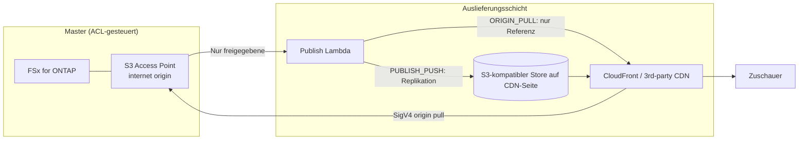

# Content Edge Delivery — FSx for ONTAP S3 AP × CDN/Edge-Auslieferung (herstellerneutral)

🌐 **Language / 言語**: [日本語](README.md) | [English](README.en.md) | [한국어](README.ko.md) | [简体中文](README.zh-CN.md) | [繁體中文](README.zh-TW.md) | [Français](README.fr.md) | Deutsch | [Español](README.es.md)

## Überblick

Ein **auslieferungsherstellerneutrales** Serverless-Pattern, das FSx for NetApp ONTAP als
**Single Source of Truth (Master)** beibehält und **für die Auslieferung freigegebene Renditions** auf
S3 Access Points (S3 AP) über ein CDN/Edge-Auslieferungsnetz auslieferbar macht.

Den technischen Vergleich der Integrationsmechanismen und der Machbarkeit der einzelnen Auslieferungsnetze
(CloudFront / Akamai / Fastly / Cloudflare / Bunny.net / Google Media CDN usw.)
finden Sie in **[docs/cdn-comparison.md](../docs/cdn-comparison.md)**.

> Dieses Pattern ist eine reference implementation (Referenzimplementierung). Die Auswahl des
> Auslieferungsherstellers, die Rechteverwaltung, geografische Beschränkungen und Compliance liegen in der Entscheidung des Kunden.

> **TL;DR (30 Sek.)**: Ohne den ONTAP/NAS-Master zu bewegen, liefern Sie **nur freigegebene Auslieferungsartefakte**
> über CloudFront oder ein Drittanbieter-CDN aus. Beginnen Sie mit `PUBLISH_PUSH` (M3), das das geringste
> Verifizierungsrisiko aufweist. Übernehmen Sie den direkten SigV4-Pull (ORIGIN_PULL) erst, nachdem Sie ihn mit der
> [Verifizierungs-Checkliste](../docs/cdn-origin-verification-checklist.md) gemessen haben.

## Geschäftsergebnis und Einführung (Outcome / Adoption)

Bewerten Sie nach **Geschäftsergebnis**, nicht danach, dass „es sich deployen ließ".

| Kategorie | Definition (Outcome / Metric / Messmethode) |
|---|---|
| Business Outcome | Edge-Auslieferung ohne Duplizierung des Masters erreichen (Auslieferungskopien sind ausschließlich freigegebene Artefakte) |
| Metric | Anzahl der in die Auslieferungsschicht abgeflossenen Master = 0 / Anzahl `unrecorded` Freigabe-Provenienz |
| Messmethode | `provenance` sowie `skipped`/`published` aus dem Publish-Manifest aggregieren |

- **Sichere Experimentiergrenze**: `DemoMode=true` validiert den Betrieb ohne FSx/externes CDN (Bereich, in dem Versuch und Irrtum erlaubt sind).
- **Business Sponsor**: einen Auslieferungsverantwortlichen (Medien-/Auslieferungsplattform-Team) benennen, der Go/No-Go freigibt.
- **Go/No-Go-Checkliste**:
  - [ ] Nichts außerhalb von `ApprovedPrefix` ist im Auslieferungsziel enthalten (Berechtigungsgrenze)
  - [ ] Die Freigabe-Provenienz (wer freigegeben hat) wird aufgezeichnet
  - [ ] Zuschauer-Token funktionieren über den CDN-nativen Mechanismus
  - [ ] Bei Übernahme von ORIGIN_PULL ist die SigV4×alias-Messung PASS
- Positionieren Sie zukünftige Arbeiten als **Evidenzerweiterung** (TBV per Verifizierung auf realer Hardware in Messwerte umwandeln), nicht als „Unvollständigkeit".

**Jetzt ausprobieren (30-Sekunden-Aktion)**: Führen Sie mit `make test-content-edge-delivery` die Unit-Tests (13 Fälle)
aus und bestätigen Sie das Verhalten des permission-aware-Filters, der Freigabe-Provenienz und der PII-Maskierung.

## Partner/SI-Nutzungsleitfaden

- **Erste Kundenfrage**: „Möchten Sie bestehende NAS/ONTAP-Assets ohne Kopie an die Edge-Auslieferung anbinden?
  Erfolgt die Auslieferung über CloudFront oder über ein bereits vertraglich gebundenes CDN (z. B. Akamai)?"
- **PoC-Ergebnisse**: DemoMode-Demo → Auslieferungsmanifest der freigegebenen Renditions → (optional) SigV4-Verifizierungsergebnis auf realer Hardware.
- Für die Auswahl des Auslieferungsnetzes kann der [CDN-Vergleich](../docs/cdn-comparison.md) unmittelbar in Kundengesprächen verwendet werden.

## Zu lösende Herausforderungen

- Produktions-/Verwaltungsdaten auf ONTAP/NAS ohne doppelte Kopienhaltung an die Edge-Auslieferung anbinden
- Da die Auslieferung nicht über die NFS/SMB-ACLs von ONTAP läuft, **das Auslieferungsziel auf freigegebene Artefakte beschränken**
- Kein Lock-in an ein bestimmtes CDN und CloudFront / Drittanbieter-CDNs austauschbar halten

## Architektur (zwei Integrationsmechanismen)



- **ORIGIN_PULL**: kopiert keine Objekte; erzeugt ein Origin-Referenzmanifest unter der Voraussetzung, dass das CDN
  das S3 AP direkt per SigV4 abruft. CloudFront unterstützt dies über OAC (Referenzimplementierung).
  Die SigV4-Origin-Signierung bei Drittanbieter-CDNs ist **zu verifizieren** (siehe [Vergleichsdokument](../docs/cdn-comparison.md)).
- **PUBLISH_PUSH**: repliziert freigegebene Renditions in den S3-kompatiblen Store auf CDN-Seite. Umgeht das
  Origin-Authentifizierungsproblem und ist CDN-unabhängig — der erste Schritt mit dem geringsten Verifizierungsrisiko.

## Hauptkomponenten

| Komponente | Rolle |
|---|---|
| `functions/publish/handler.py` | Spiegelt freigegebene Renditions in die Auslieferungsschicht und schreibt das Auslieferungsmanifest zurück in das S3 AP |
| `functions/delivery_log_sync/handler.py` | Normalisiert CDN-Auslieferungsprotokolle (IP-Maskierung) und schreibt sie in das S3 AP zurück, um den Abgleich mit Produktionsdaten zu ermöglichen |
| Step Functions | Publish → SNS-Benachrichtigung |
| CloudFront (optional) | Referenzauslieferung für ORIGIN_PULL (OAC + SigV4) |

## Parameter

| Parameter | Beschreibung | Standard |
|---|---|---|
| `S3AccessPointAlias` | Eingabe-S3-AP-Alias (Internet-origin) | — |
| `S3AccessPointOutputAlias` | S3-AP-Alias zum Zurückschreiben von Manifesten/Protokollen | — |
| `DeliveryMode` | `ORIGIN_PULL` / `PUBLISH_PUSH` | `PUBLISH_PUSH` |
| `CDNTarget` | `CLOUDFRONT`/`AKAMAI`/`FASTLY`/`CLOUDFLARE`/`OTHER` | `CLOUDFRONT` |
| `ApprovedPrefix` | Für die Auslieferung freigegebenes Präfix (permission-aware) | `delivery-approved/` |
| `SuffixFilter` | Auslieferungsziel-Erweiterungen (kommagetrennt) | `""` |
| `DemoMode` | Externen Push überspringen (ohne FSx/externes CDN validieren) | `true` |
| `ExternalStoreEndpoint` | S3-kompatibler Endpoint für PUBLISH_PUSH | `""` |
| `ExternalStoreBucket` | Zielbucket für PUBLISH_PUSH | `""` |
| `EnableCloudFront` | CloudFront-Auslieferung aktivieren | `false` |
| `RedactClientIp` | IP-Maskierung der Auslieferungsprotokolle | `true` |
| `TriggerMode` | `POLLING`/`EVENT_DRIVEN`/`HYBRID` | `POLLING` |

## Deployment

```bash
sam build --template content-edge-delivery/template.yaml
sam deploy --guided \
  --template content-edge-delivery/template.yaml \
  --stack-name fsxn-content-edge-delivery
```

> **Hinweis**: `template.yaml` wird mit dem SAM CLI (`sam build` + `sam deploy`) verwendet.
> Zum direkten Deployment mit dem Befehl `aws cloudformation deploy` verwenden Sie stattdessen `template-deploy.yaml` (erfordert das vorherige Packen der Lambda-Zip-Dateien und deren Upload nach S3).

Zur Verifizierung von DemoMode siehe [docs/demo-guide.md](docs/demo-guide.md).

## Sicherheit / Governance

- **permission-aware**: Das Auslieferungsziel ist auf das beschränkt, was sich unter `ApprovedPrefix` befindet.
  ACL-gesteuerte Master werden nicht direkt ausgeliefert.
- **Audit-Trail der Auslieferungsfreigabe**: zeichnet `provenance` (source_key / approver / approval_id /
  published_at / execution_id) im Publish-Manifest auf. Die Freigabequelle wird aus den Benutzermetadaten des Objekts
  (`x-amz-meta-approved-by` / `x-amz-meta-approval-id`) bezogen; wenn nicht aufgezeichnet, wird sie als
  `unrecorded` sichtbar gemacht (Auslieferung wird nicht gestoppt, Erkennung im Betrieb). Wenn eine dauerhafte
  (durable) Nachverfolgung erforderlich ist, kann sie um eine Aufzeichnung in `shared/lineage.py` (DynamoDB) erweitert werden.
- **Datenresidenz / geografische Beschränkungen**: Da CDNs global ausliefern, sollten Daten, für die eine
  Auslieferung außerhalb der Region nicht zulässig ist, von der Freigabe ausgeschlossen oder mit dem Geo-Blocking des CDN gesteuert werden.
- **Zuschauer-Authentifizierung**: Da S3-Presigned-URLs nicht unterstützt werden, verwenden Sie CDN-native Token-Mechanismen.
- **PII**: Client-IPs werden beim Zurückschreiben der Auslieferungsprotokolle maskiert (`RedactClientIp=true`).
- **Least Privilege**: Publish/LogSync haben nur die notwendigen Actions auf dem Ziel-S3-AP. Die Auslieferungs-Lambdas
  laufen für den Internet-origin-S3-AP-Zugriff **außerhalb des VPC**.

> **Governance Note**: Die Auslieferung erzwingt keine ONTAP-Dateiberechtigungen. Die Auslieferungsgrenze wird durch
> die Betriebsregel „nur freigegebene Artefakte ausliefern", die Aufzeichnung der Freigabe-Provenienz und die
> Zugriffskontrollen am Auslieferungsziel gewährleistet.

### Verantwortungsaufteilung (RACI / Public-Sector-Perspektive)

| Rolle | Verantwortung |
|---|---|
| Dateneigentümer (Data Owner) | Endverantwortung für Klassifizierung, Residenz und Veröffentlichungsberechtigung der Auslieferungszieldaten |
| Freigeber (Approver) | Genehmigt die Platzierung unter `ApprovedPrefix`; vergibt die Freigabe-Provenienz (approved-by / approval-id) |
| Audit-Trail-Prüfer (Audit Reviewer) | Prüft regelmäßig die `provenance` im Publish-Manifest und die Auslieferungsprotokolle |
| Betriebsverantwortlicher (Ops Owner) | Empfängt Alarme, bearbeitet Vorfälle, führt Rollback aus |

- KI-/automatisierte Entscheidungen sind **Hilfssignale**; über die öffentliche Auslieferung entscheiden Menschen (Data Owner / Approver).
- Verwenden Sie für die Verifizierung **nicht sensible synthetische/Beispieldaten** (verwenden Sie niemals personenbezogene Produktionsdaten für die Verifizierung weiter).
- Technische Validierung **ersetzt nicht** die rechtliche, Compliance- und Datenschutzbewertung.

## Einschränkungen des Scaffolds (explizit)

- `TriggerMode=EVENT_DRIVEN` / `HYBRID` sind **als Parameter definiert, aber dieses Scaffold implementiert weder die
  FPolicy-Integration noch die Idempotenz (idempotency)**. Wenn eine Deduplizierung für HYBRID erforderlich ist,
  integrieren Sie `shared/idempotency_checker.py` in den Publish-Pfad. Die aktuelle Betriebsprüfung erfolgt mit `POLLING`.
- Der tatsächliche Push in den externen Store für `PUBLISH_PUSH` ist nur wirksam, wenn Endpoint/Bucket konfiguriert sind (DemoMode zeichnet ein Skip auf).
- Der direkte SigV4-Origin-Pull von ORIGIN_PULL ist bei Drittanbieter-CDNs **zu verifizieren** (siehe [Vergleichsdokument](../docs/cdn-comparison.md) 4.1).

## Betrieb / Runbook (Reliability/Ops)

- **Alarme**: Mit `EnableCloudWatchAlarms=true` werden Lambda-Fehler (publish / log-sync) und Step-Functions-Fehler
  per SNS benachrichtigt. Empfang über `NotificationEmail`.
- **Vorfallbehandlung**:
  - publish-Fehler → CloudWatch Logs `/aws/lambda/<stack>-publish` prüfen. S3-AP-Autorisierung
    (IAM + AP policy + ONTAP-ID) von der Authentifizierung des externen Stores (Secrets Manager) abgrenzen.
  - Fehler beim externen Push → Anmeldeinformationen, Endpoint und Bucket in `ExternalStoreSecretName` prüfen.
  - Verdacht auf Auslieferungsgrenzenproblem (Auslieferung außerhalb der Berechtigung) → [Incident-Response-Playbook](../docs/incident-response-playbook.md).
- **Rollback**: Die Auslieferung veröffentlicht nur freigegebene Artefakte. Bei einer Fehlveröffentlichung entfernen
  Sie das betreffende Objekt aus dem Auslieferungsziel (CDN-Store/Distribution), ziehen es aus `ApprovedPrefix` zurück und veröffentlichen es erneut.
- **Authentifizierung des externen Stores**: Bei der Replikation nach Akamai/R2/Fastly usw. mit PUBLISH_PUSH gelten
  die AWS-Standardanmeldeinformationen nicht; daher ist `ExternalStoreSecretName` (Secrets Manager, `{"access_key_id","secret_access_key"}`) erforderlich.

## Success Metrics (PoC-Go/No-Go-Perspektive)

| Kategorie | Kennzahl | Richtwert |
|---|---|---|
| Business Outcome | Duplizierung des Masters vermeiden | Auslieferungskopien sind ausschließlich freigegebene Artefakte |
| Technical KPI | Erfolgsrate von publish | SUCCEEDED in DemoMode |
| Quality KPI | Begrenzung des Auslieferungsziels | Nichts außerhalb von ApprovedPrefix wird ausgeliefert |
| Cost KPI | Kapazität des Auslieferungsstores | Nur für freigegebene Renditions |
| Go/No-Go | Direkter SigV4-Origin-Pull | Drittanbieter-CDNs werden per Verifizierung auf realer Hardware beurteilt |

## Zugehörige Dokumente

- [Vergleich der CDN/Edge-Auslieferungsintegration](../docs/cdn-comparison.md) / [English](../docs/cdn-comparison.en.md)
- [ORIGIN_PULL-SigV4-Verifizierungs-Checkliste](../docs/cdn-origin-verification-checklist.md) (Verfahren auf realer Hardware)
- [Vergleich alternativer Architekturen](../docs/comparison-alternatives.md)
- [S3AP-Kompatibilitätshinweise](../docs/s3ap-compatibility-notes.md)
- [Incident-Response-Playbook](../docs/incident-response-playbook.md) (Reaktionspfad bei Auslieferung außerhalb der Berechtigung / Fehlveröffentlichung)
