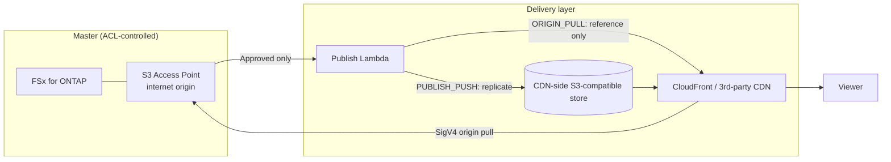

# Content Edge Delivery — FSx for ONTAP S3 AP × CDN/Edge Delivery (vendor-neutral)

🌐 **Language / 言語**: [日本語](README.md) | English | [한국어](README.ko.md) | [简体中文](README.zh-CN.md) | [繁體中文](README.zh-TW.md) | [Français](README.fr.md) | [Deutsch](README.de.md) | [Español](README.es.md)

## Overview

A **delivery-vendor-neutral** serverless pattern that keeps FSx for NetApp ONTAP as the
**Single Source of Truth (master)** and makes **delivery-approved renditions** on
S3 Access Points (S3 AP) deliverable from a CDN/edge delivery network.

For the technical comparison of integration mechanisms and the feasibility of each delivery network
(CloudFront / Akamai / Fastly / Cloudflare / Bunny.net / Google Media CDN, etc.),
see **[docs/cdn-comparison.md](../docs/cdn-comparison.md)**.

> This pattern is a reference implementation. Delivery-vendor selection, rights processing,
> geo-restrictions, and compliance are decided by the customer.

> **TL;DR (30s)**: Without moving the ONTAP/NAS master, deliver **only approved delivery artifacts** via
> CloudFront or a third-party CDN. Start with the lowest-verification-risk `PUBLISH_PUSH` (M3). Adopt
> SigV4 direct pull (ORIGIN_PULL) only after measuring it with the
> [verification checklist](../docs/cdn-origin-verification-checklist.md).

## Business Outcome and Adoption (Outcome / Adoption)

Evaluate by **business outcome**, not "it deployed".

| Category | Definition (Outcome / Metric / Measurement) |
|---|---|
| Business Outcome | Achieve edge delivery without duplicating the master (delivery copies are approved artifacts only) |
| Metric | Master objects leaking to the delivery layer = 0 / count of `unrecorded` approval provenance |
| Measurement | Aggregate `provenance` and `skipped`/`published` from the publish manifest |

- **Safe experimentation boundary**: `DemoMode=true` validates behavior without FSx/external CDN (a space where trial and error is allowed).
- **Business Sponsor**: appoint a delivery owner (media/delivery-platform team) who approves Go/No-Go.
- **Go/No-Go checklist**:
  - [ ] Nothing outside `ApprovedPrefix` is included in the delivery target (permission boundary)
  - [ ] Approval provenance (who approved) is recorded
  - [ ] Viewer tokens work via the CDN-native mechanism
  - [ ] When adopting ORIGIN_PULL, the SigV4×alias measurement is PASS
- Frame future work as **evidence expansion** (turning TBV into measured values via hardware verification), not as "incompleteness".

**Try it now (30-second action)**: run `make test-content-edge-delivery` to execute the unit tests (13 cases)
and confirm the behavior of the permission-aware filter, approval provenance, and PII masking.

## Partner/SI Usage Guide

- **First customer question**: "Do you want to connect existing NAS/ONTAP assets to edge delivery without
  copying? Is delivery via CloudFront, or via an already-contracted CDN (e.g., Akamai)?"
- **PoC deliverables**: DemoMode demo → delivery manifest of approved renditions → (optional) hardware SigV4 verification result.
- For delivery-network selection, the [CDN comparison](../docs/cdn-comparison.md) can be used as-is in customer conversations.

## Problems Solved

- Connect production/management data on ONTAP/NAS to edge delivery without duplicating copies
- Because delivery does not go through ONTAP's NFS/SMB ACLs, **limit the delivery target to approved artifacts**
- Avoid lock-in to a specific CDN and keep CloudFront / third-party CDNs swappable

## Architecture (two integration mechanisms)



- **ORIGIN_PULL**: Generates an origin-reference manifest on the premise that the CDN fetches the S3 AP
  directly via SigV4, without copying objects. CloudFront supports this via OAC (reference implementation).
  SigV4 origin signing on third-party CDNs is **to be verified** (see the [comparison doc](../docs/cdn-comparison.md)).
- **PUBLISH_PUSH**: Replicates approved renditions to the CDN-side S3-compatible store. Avoids the
  origin-authentication problem and is CDN-agnostic — the lowest-verification-risk first step.

## Key Components

| Component | Role |
|---|---|
| `functions/publish/handler.py` | Reflects approved renditions to the delivery layer and writes the delivery manifest back to the S3 AP |
| `functions/delivery_log_sync/handler.py` | Normalizes CDN delivery logs (IP masking) and writes them back to the S3 AP so they can be correlated with production data |
| Step Functions | Publish → SNS notification |
| CloudFront (optional) | Reference delivery for ORIGIN_PULL (OAC + SigV4) |

## Parameters

| Parameter | Description | Default |
|---|---|---|
| `S3AccessPointAlias` | Input S3 AP Alias (Internet-origin) | — |
| `S3AccessPointOutputAlias` | S3 AP Alias for writing back manifests/logs | — |
| `DeliveryMode` | `ORIGIN_PULL` / `PUBLISH_PUSH` | `PUBLISH_PUSH` |
| `CDNTarget` | `CLOUDFRONT`/`AKAMAI`/`FASTLY`/`CLOUDFLARE`/`OTHER` | `CLOUDFRONT` |
| `ApprovedPrefix` | Delivery-approved prefix (permission-aware) | `delivery-approved/` |
| `SuffixFilter` | Delivery target extensions (comma-separated) | `""` |
| `DemoMode` | Skip external push (validate without FSx/external CDN) | `true` |
| `ExternalStoreEndpoint` | S3-compatible endpoint for PUBLISH_PUSH | `""` |
| `ExternalStoreBucket` | Destination bucket for PUBLISH_PUSH | `""` |
| `EnableCloudFront` | Enable CloudFront delivery | `false` |
| `RedactClientIp` | IP masking for delivery logs | `true` |
| `TriggerMode` | `POLLING`/`EVENT_DRIVEN`/`HYBRID` | `POLLING` |

## Deploy

```bash
sam build --template content-edge-delivery/template.yaml
sam deploy --guided \
  --template content-edge-delivery/template.yaml \
  --stack-name fsxn-content-edge-delivery
```

> **Note**: `template.yaml` is used with the SAM CLI (`sam build` + `sam deploy`).
> To deploy directly with the `aws cloudformation deploy` command, use `template-deploy.yaml` instead (it requires pre-packaging the Lambda zip files and uploading them to S3).

For DemoMode verification, see [docs/demo-guide.md](docs/demo-guide.md).

## Security / Governance

- **permission-aware**: The delivery target is limited to what is under `ApprovedPrefix`. ACL-controlled masters are not delivered directly.
- **Audit trail for delivery approval**: Records `provenance` (source_key / approver / approval_id /
  published_at / execution_id) in the publish manifest. The approval source is obtained from the object's
  user metadata (`x-amz-meta-approved-by` / `x-amz-meta-approval-id`); when not recorded, it is surfaced as
  `unrecorded` (delivery is not stopped, detected operationally). When durable tracking is required, it can
  be extended to record into `shared/lineage.py` (DynamoDB).
- **Data residency / geo-restrictions**: Because CDNs deliver globally, data for which out-of-region
  delivery is not allowed should be excluded from approval, or controlled with the CDN's geo-blocking.
- **Viewer authentication**: Because S3 Presigned URLs are unsupported, use CDN-native token mechanisms.
- **PII**: Client IPs are masked when writing delivery logs back (`RedactClientIp=true`).
- **Least privilege**: Publish/LogSync have only the necessary Actions on the target S3 AP. The delivery
  Lambdas run **outside the VPC** for Internet-origin S3 AP access.

> **Governance Note**: Delivery does not enforce ONTAP file permissions. The delivery boundary is ensured
> by the "deliver approved artifacts only" operating rule, the recording of approval provenance, and the
> access controls at the delivery target.

### Responsibility Split (RACI / Public Sector lens)

| Role | Responsibility |
|---|---|
| Data Owner | Final accountability for the classification, residency, and public-release eligibility of the delivery-target data |
| Approver | Approves placement under `ApprovedPrefix`; assigns approval provenance (approved-by / approval-id) |
| Audit Reviewer | Periodically reviews `provenance` in the publish manifest and delivery logs |
| Ops Owner | Receives alarms, handles incidents, executes rollback |

- AI/automated decisions are **assistive signals**; humans (Data Owner / Approver) decide whether public delivery is allowed.
- Use **non-sensitive synthetic/sample** data for verification (do not repurpose production personal data for verification).
- Technical validation does **not replace** legal, compliance, and privacy assessment.

## Scaffold Constraints (explicit)

- `TriggerMode=EVENT_DRIVEN` / `HYBRID` are **defined as parameters, but this scaffold does not implement
  FPolicy integration or idempotency**. If deduplication for HYBRID is required, incorporate
  `shared/idempotency_checker.py` into the publish path. Current behavior verification is done with `POLLING`.
- The actual push to the external store for `PUBLISH_PUSH` is effective only when the endpoint/bucket are configured (DemoMode records a skip).
- ORIGIN_PULL's SigV4 origin direct pull is **to be verified** on third-party CDNs (see [comparison doc](../docs/cdn-comparison.md) 4.1).

## Operations / Runbook (Reliability/Ops)

- **Alarms**: With `EnableCloudWatchAlarms=true`, Lambda errors (publish / log-sync) and Step Functions
  failures are notified via SNS. Received via `NotificationEmail`.
- **Incident response**:
  - publish error → check CloudWatch Logs `/aws/lambda/<stack>-publish`. Isolate S3 AP authorization
    (IAM + AP policy + ONTAP ID) from external-store authentication (Secrets Manager).
  - external push failure → check the credentials, endpoint, and bucket in `ExternalStoreSecretName`.
  - suspected delivery-boundary issue (out-of-permission delivery) → [incident response playbook](../docs/incident-response-playbook.md).
- **Rollback**: Delivery only publishes approved artifacts. On mis-publish, remove the relevant object from the
  delivery target (CDN store/Distribution), withdraw it from `ApprovedPrefix`, and re-publish.
- **External-store authentication**: When replicating to Akamai/R2/Fastly, etc. with PUBLISH_PUSH, AWS default
  credentials do not apply, so `ExternalStoreSecretName` (Secrets Manager, `{"access_key_id","secret_access_key"}`) is required.

## Success Metrics (PoC Go/No-Go lens)

| Category | Metric | Guideline |
|---|---|---|
| Business Outcome | Avoid duplicating the master | Delivery copies are approved artifacts only |
| Technical KPI | publish success rate | SUCCEEDED in DemoMode |
| Quality KPI | Limiting the delivery target | Nothing outside ApprovedPrefix is delivered |
| Cost KPI | Delivery store capacity | Only for approved renditions |
| Go/No-Go | SigV4 origin direct pull | Third-party CDNs are judged by hardware verification |

## Related Documents

- [CDN/edge delivery integration comparison](../docs/cdn-comparison.md) / [English](../docs/cdn-comparison.en.md)
- [ORIGIN_PULL SigV4 verification checklist](../docs/cdn-origin-verification-checklist.md) (hardware verification procedure)
- [Alternative architecture comparison](../docs/comparison-alternatives.md)
- [S3AP compatibility notes](../docs/s3ap-compatibility-notes.md)
- [Incident response playbook](../docs/incident-response-playbook.md) (response path for out-of-permission delivery / mis-publish)
