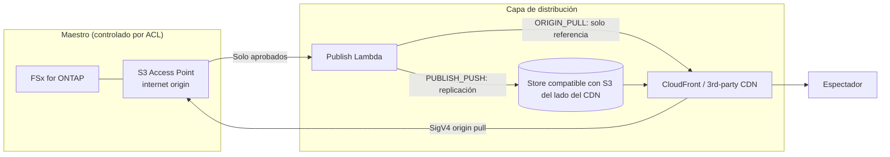

# Content Edge Delivery — FSx for ONTAP S3 AP × distribución CDN/edge (independiente del proveedor)

🌐 **Language / 言語**: [日本語](README.md) | [English](README.en.md) | [한국어](README.ko.md) | [简体中文](README.zh-CN.md) | [繁體中文](README.zh-TW.md) | [Français](README.fr.md) | [Deutsch](README.de.md) | Español

## Descripción general

Un patrón serverless **independiente del proveedor de distribución** que conserva FSx for NetApp ONTAP como
**Single Source of Truth (maestro)** y hace que las **renditions aprobadas para distribución** en los
S3 Access Points (S3 AP) puedan distribuirse desde una red de distribución CDN/edge.

Para la comparación técnica de los mecanismos de integración y la viabilidad de cada red de distribución
(CloudFront / Akamai / Fastly / Cloudflare / Bunny.net / Google Media CDN, etc.),
consulte **[docs/cdn-comparison.md](../docs/cdn-comparison.md)**.

> Este patrón es una reference implementation (implementación de referencia). La selección del proveedor de
> distribución, la gestión de derechos, las restricciones geográficas y el cumplimiento los decide el cliente.

> **TL;DR (30 s)**: sin mover el maestro ONTAP/NAS, distribuya **solo los artefactos de distribución aprobados**
> mediante CloudFront o un CDN de terceros. Comience con `PUBLISH_PUSH` (M3), que presenta el menor riesgo de
> verificación. Adopte el pull directo SigV4 (ORIGIN_PULL) solo después de medirlo con la
> [lista de verificación](../docs/cdn-origin-verification-checklist.md).

## Resultado de negocio y adopción (Outcome / Adoption)

Evalúe por **resultado de negocio**, no por «se desplegó».

| Categoría | Definición (Outcome / Metric / Método de medición) |
|---|---|
| Business Outcome | Lograr la distribución edge sin duplicar el maestro (las copias de distribución son únicamente artefactos aprobados) |
| Metric | Número de maestros filtrados a la capa de distribución = 0 / número de procedencias de aprobación `unrecorded` |
| Método de medición | Agregar `provenance` y `skipped`/`published` del manifiesto de publicación |

- **Límite de experimentación seguro**: `DemoMode=true` valida el funcionamiento sin FSx/CDN externo (rango en el que se permite el ensayo y error).
- **Business Sponsor**: designar a un responsable de distribución (equipo de medios/plataforma de distribución) que apruebe el Go/No-Go.
- **Lista de verificación Go/No-Go**:
  - [ ] Nada fuera de `ApprovedPrefix` se incluye en el objetivo de distribución (límite de permisos)
  - [ ] La procedencia de aprobación (quién aprobó) queda registrada
  - [ ] Los tokens de espectador funcionan mediante el mecanismo nativo del CDN
  - [ ] Al adoptar ORIGIN_PULL, la medición SigV4×alias es PASS
- Posicione el trabajo futuro como **ampliación de evidencia** (convertir los TBV en valores medidos mediante verificación en hardware real), no como «incompletitud».

**Pruébelo ahora (acción de 30 segundos)**: ejecute `make test-content-edge-delivery` para lanzar las pruebas
unitarias (13 casos) y confirmar el funcionamiento del filtro permission-aware, la procedencia de aprobación y el enmascaramiento de PII.

## Guía de uso Partner/SI

- **Primera pregunta al cliente**: «¿Desea conectar los activos NAS/ONTAP existentes a la distribución edge sin
  copiar? ¿La distribución es mediante CloudFront o mediante un CDN ya contratado (p. ej., Akamai)?»
- **Entregables del PoC**: demo de DemoMode → manifiesto de distribución de las renditions aprobadas → (opcional) resultado de verificación SigV4 en hardware real.
- Para la selección de la red de distribución, la [comparación de CDN](../docs/cdn-comparison.md) puede usarse tal cual en las conversaciones con el cliente.

## Problemas que resuelve

- Conectar los datos de producción/gestión en ONTAP/NAS a la distribución edge sin duplicar copias
- Como la distribución no pasa por las ACL NFS/SMB de ONTAP, **limitar el objetivo de distribución a los artefactos aprobados**
- Evitar el bloqueo en un CDN específico y mantener CloudFront / los CDN de terceros intercambiables

## Arquitectura (dos mecanismos de integración)



- **ORIGIN_PULL**: no copia objetos; genera un manifiesto de referencia de origen partiendo de la premisa de que el
  CDN obtiene el S3 AP directamente mediante SigV4. CloudFront lo admite mediante OAC (implementación de referencia).
  La firma de origen SigV4 en CDN de terceros está **por verificar** (consulte el [documento de comparación](../docs/cdn-comparison.md)).
- **PUBLISH_PUSH**: replica las renditions aprobadas al store compatible con S3 del lado del CDN. Evita el problema
  de autenticación de origen y es independiente del CDN — el primer paso con el menor riesgo de verificación.

## Componentes principales

| Componente | Función |
|---|---|
| `functions/publish/handler.py` | Refleja las renditions aprobadas en la capa de distribución y reescribe el manifiesto de distribución en el S3 AP |
| `functions/delivery_log_sync/handler.py` | Normaliza los registros de distribución del CDN (enmascaramiento de IP) y los reescribe en el S3 AP para permitir la correlación con los datos de producción |
| Step Functions | Publish → notificación SNS |
| CloudFront (opcional) | Distribución de referencia para ORIGIN_PULL (OAC + SigV4) |

## Parámetros

| Parámetro | Descripción | Predeterminado |
|---|---|---|
| `S3AccessPointAlias` | Alias de S3 AP de entrada (Internet-origin) | — |
| `S3AccessPointOutputAlias` | Alias de S3 AP para reescribir manifiestos/registros | — |
| `DeliveryMode` | `ORIGIN_PULL` / `PUBLISH_PUSH` | `PUBLISH_PUSH` |
| `CDNTarget` | `CLOUDFRONT`/`AKAMAI`/`FASTLY`/`CLOUDFLARE`/`OTHER` | `CLOUDFRONT` |
| `ApprovedPrefix` | Prefijo aprobado para distribución (permission-aware) | `delivery-approved/` |
| `SuffixFilter` | Extensiones objetivo de distribución (separadas por comas) | `""` |
| `DemoMode` | Omitir el push externo (validar sin FSx/CDN externo) | `true` |
| `ExternalStoreEndpoint` | Endpoint compatible con S3 para PUBLISH_PUSH | `""` |
| `ExternalStoreBucket` | Bucket de destino para PUBLISH_PUSH | `""` |
| `EnableCloudFront` | Habilitar la distribución CloudFront | `false` |
| `RedactClientIp` | Enmascaramiento de IP de los registros de distribución | `true` |
| `TriggerMode` | `POLLING`/`EVENT_DRIVEN`/`HYBRID` | `POLLING` |

## Despliegue

```bash
sam build --template content-edge-delivery/template.yaml
sam deploy --guided \
  --template content-edge-delivery/template.yaml \
  --stack-name fsxn-content-edge-delivery
```

> **Nota**: `template.yaml` se utiliza con la SAM CLI (`sam build` + `sam deploy`).
> Para desplegar directamente con el comando `aws cloudformation deploy`, utilice en su lugar `template-deploy.yaml` (requiere empaquetar previamente los archivos zip de Lambda y subirlos a un bucket S3).

Para la verificación de DemoMode, consulte [docs/demo-guide.md](docs/demo-guide.md).

## Seguridad / Gobernanza

- **permission-aware**: el objetivo de distribución se limita a lo que está bajo `ApprovedPrefix`. Los maestros
  bajo control de ACL no se distribuyen directamente.
- **Registro de auditoría de la aprobación de distribución**: registra `provenance` (source_key / approver / approval_id /
  published_at / execution_id) en el manifiesto de publicación. El origen de la aprobación se obtiene de los
  metadatos de usuario del objeto (`x-amz-meta-approved-by` / `x-amz-meta-approval-id`); cuando no se registra, se
  hace visible como `unrecorded` (la distribución no se detiene, se detecta en operación). Cuando se requiere un
  seguimiento durable, puede ampliarse para registrar en `shared/lineage.py` (DynamoDB).
- **Residencia de datos / restricciones geográficas**: como los CDN distribuyen globalmente, los datos cuya
  distribución fuera de la región no esté permitida deben excluirse de la aprobación o controlarse con el geo-blocking del CDN.
- **Autenticación de espectadores**: como las URL prefirmadas de S3 no se admiten, utilice los mecanismos de token nativos del CDN.
- **PII**: las IP de cliente se enmascaran al reescribir los registros de distribución (`RedactClientIp=true`).
- **Privilegio mínimo**: Publish/LogSync solo tienen las Actions necesarias en el S3 AP objetivo. Las Lambdas de
  distribución se ejecutan **fuera del VPC** para el acceso al S3 AP Internet-origin.

> **Governance Note**: la distribución no aplica de forma obligatoria los permisos de archivo de ONTAP. El límite de
> distribución se garantiza mediante la regla operativa «distribuir solo artefactos aprobados», el registro de la
> procedencia de aprobación y los controles de acceso del destino de distribución.

### Reparto de responsabilidades (RACI / perspectiva Public Sector)

| Rol | Responsabilidad |
|---|---|
| Propietario de los datos (Data Owner) | Responsabilidad final de la clasificación, la residencia y la elegibilidad de publicación de los datos objetivo de distribución |
| Aprobador (Approver) | Aprueba la colocación bajo `ApprovedPrefix`; asigna la procedencia de aprobación (approved-by / approval-id) |
| Revisor del registro de auditoría (Audit Reviewer) | Revisa periódicamente la `provenance` del manifiesto de publicación y los registros de distribución |
| Responsable de operaciones (Ops Owner) | Recibe alarmas, gestiona incidentes, ejecuta el rollback |

- Las decisiones de IA/automatizadas son **señales de asistencia**; la publicación la deciden las personas (Data Owner / Approver).
- Use datos **sintéticos/de muestra no sensibles** para la verificación (no reutilice nunca datos personales de producción para la verificación).
- La validación técnica **no reemplaza** la evaluación legal, de cumplimiento y de privacidad.

## Restricciones del Scaffold (explícitas)

- `TriggerMode=EVENT_DRIVEN` / `HYBRID` están **definidos como parámetros, pero este scaffold no implementa la
  integración con FPolicy ni la idempotencia (idempotency)**. Si se requiere la deduplicación para HYBRID, integre
  `shared/idempotency_checker.py` en la ruta de publicación. La verificación actual del funcionamiento se realiza con `POLLING`.
- El push real al store externo para `PUBLISH_PUSH` solo es efectivo cuando el endpoint/bucket están configurados (DemoMode registra un skip).
- El pull directo de origen SigV4 de ORIGIN_PULL está **por verificar** en CDN de terceros (consulte el [documento de comparación](../docs/cdn-comparison.md) 4.1).

## Operación / Runbook (Reliability/Ops)

- **Alarmas**: con `EnableCloudWatchAlarms=true`, los errores de Lambda (publish / log-sync) y los fallos de Step Functions
  se notifican mediante SNS. Recepción mediante `NotificationEmail`.
- **Respuesta a incidentes**:
  - error de publish → revisar CloudWatch Logs `/aws/lambda/<stack>-publish`. Separar la autorización del S3 AP
    (IAM + AP policy + ID de ONTAP) de la autenticación del store externo (Secrets Manager).
  - fallo del push externo → revisar las credenciales, el endpoint y el bucket en `ExternalStoreSecretName`.
  - sospecha de problema de límite de distribución (distribución fuera de permisos) → [playbook de respuesta a incidentes](../docs/incident-response-playbook.md).
- **Rollback**: la distribución solo publica artefactos aprobados. En caso de publicación errónea, elimine el objeto
  correspondiente del destino de distribución (store del CDN/Distribution), retírelo de `ApprovedPrefix` y vuelva a publicar.
- **Autenticación del store externo**: al replicar a Akamai/R2/Fastly, etc. con PUBLISH_PUSH, las credenciales
  predeterminadas de AWS no se aplican, por lo que se requiere `ExternalStoreSecretName` (Secrets Manager, `{"access_key_id","secret_access_key"}`).

## Success Metrics (perspectiva PoC Go/No-Go)

| Categoría | Indicador | Referencia |
|---|---|---|
| Business Outcome | Evitar la duplicación del maestro | Las copias de distribución son únicamente artefactos aprobados |
| Technical KPI | Tasa de éxito de publish | SUCCEEDED en DemoMode |
| Quality KPI | Limitación del objetivo de distribución | Nada fuera de ApprovedPrefix se distribuye |
| Cost KPI | Capacidad del store de distribución | Solo para las renditions aprobadas |
| Go/No-Go | Pull directo de origen SigV4 | Los CDN de terceros se juzgan por verificación en hardware real |

## Documentos relacionados

- [Comparación de la integración de distribución CDN/edge](../docs/cdn-comparison.md) / [English](../docs/cdn-comparison.en.md)
- [Lista de verificación SigV4 de ORIGIN_PULL](../docs/cdn-origin-verification-checklist.md) (procedimiento en hardware real)
- [Comparación de arquitecturas alternativas](../docs/comparison-alternatives.md)
- [Notas de compatibilidad de S3AP](../docs/s3ap-compatibility-notes.md)
- [Playbook de respuesta a incidentes](../docs/incident-response-playbook.md) (ruta de respuesta ante distribución fuera de permisos / publicación errónea)
