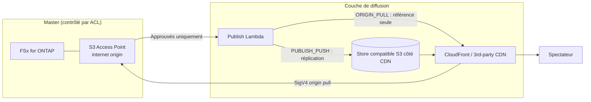

# Content Edge Delivery — FSx for ONTAP S3 AP × diffusion CDN/edge (indépendant du fournisseur)

🌐 **Language / 言語**: [日本語](README.md) | [English](README.en.md) | [한국어](README.ko.md) | [简体中文](README.zh-CN.md) | [繁體中文](README.zh-TW.md) | Français | [Deutsch](README.de.md) | [Español](README.es.md)

## Vue d'ensemble

Un pattern serverless **indépendant du fournisseur de diffusion** qui conserve FSx for NetApp ONTAP comme
**Single Source of Truth (master)** et rend les **rendus approuvés pour la diffusion** situés sur les
S3 Access Points (S3 AP) diffusables depuis un réseau de diffusion CDN/edge.

Pour la comparaison technique des mécanismes d'intégration et de la faisabilité de chaque réseau de diffusion
(CloudFront / Akamai / Fastly / Cloudflare / Bunny.net / Google Media CDN, etc.),
consultez **[docs/cdn-comparison.md](../docs/cdn-comparison.md)**.

> Ce pattern est une reference implementation (implémentation de référence). La sélection du fournisseur de
> diffusion, la gestion des droits, les restrictions géographiques et la conformité relèvent de la décision du client.

> **TL;DR (30 s)** : sans déplacer le master ONTAP/NAS, diffusez **uniquement les artefacts de diffusion approuvés**
> via CloudFront ou un CDN tiers. Commencez par `PUBLISH_PUSH` (M3), qui présente le risque de vérification le plus
> faible. N'adoptez le pull direct SigV4 (ORIGIN_PULL) qu'après l'avoir mesuré avec la
> [checklist de vérification](../docs/cdn-origin-verification-checklist.md).

## Résultat métier et adoption (Outcome / Adoption)

Évaluez par **résultat métier**, et non par « ça s'est déployé ».

| Catégorie | Définition (Outcome / Metric / Méthode de mesure) |
|---|---|
| Business Outcome | Réaliser la diffusion edge sans dupliquer le master (les copies de diffusion sont uniquement des artefacts approuvés) |
| Metric | Nombre de masters ayant fui vers la couche de diffusion = 0 / nombre de provenances d'approbation `unrecorded` |
| Méthode de mesure | Agréger `provenance` et `skipped`/`published` du manifeste de publication |

- **Frontière d'expérimentation sûre** : `DemoMode=true` valide le fonctionnement sans FSx/CDN externe (plage où l'essai-erreur est permis).
- **Business Sponsor** : nommer un propriétaire de diffusion (équipe média/plateforme de diffusion) qui approuve le Go/No-Go.
- **Checklist Go/No-Go** :
  - [ ] Rien en dehors de `ApprovedPrefix` n'est inclus dans la cible de diffusion (frontière d'autorisation)
  - [ ] La provenance d'approbation (qui a approuvé) est enregistrée
  - [ ] Les jetons de spectateur fonctionnent via le mécanisme natif du CDN
  - [ ] En cas d'adoption d'ORIGIN_PULL, la mesure SigV4×alias est PASS
- Positionnez les travaux futurs comme une **extension de preuves** (transformer les TBV en valeurs mesurées via une vérification sur matériel réel), et non comme un « inachèvement ».

**Essayez maintenant (action de 30 secondes)** : exécutez `make test-content-edge-delivery` pour lancer les tests
unitaires (13 cas) et confirmer le fonctionnement du filtre permission-aware, de la provenance d'approbation et du masquage des PII.

## Guide d'utilisation Partner/SI

- **Première question client** : « Souhaitez-vous connecter vos actifs NAS/ONTAP existants à la diffusion edge sans
  copie ? La diffusion se fait-elle via CloudFront ou via un CDN déjà sous contrat (Akamai, etc.) ? »
- **Livrables PoC** : démo DemoMode → manifeste de diffusion des rendus approuvés → (facultatif) résultat de vérification SigV4 sur matériel réel.
- Pour la sélection du réseau de diffusion, la [comparaison CDN](../docs/cdn-comparison.md) peut être utilisée telle quelle dans les conversations client.

## Problèmes résolus

- Connecter les données de production/gestion sur ONTAP/NAS à la diffusion edge sans dupliquer les copies
- Comme la diffusion ne passe pas par les ACL NFS/SMB d'ONTAP, **limiter la cible de diffusion aux artefacts approuvés**
- Éviter le verrouillage sur un CDN spécifique et garder CloudFront / les CDN tiers interchangeables

## Architecture (deux mécanismes d'intégration)



- **ORIGIN_PULL** : ne copie pas les objets ; génère un manifeste de référence d'origine partant du principe que le
  CDN récupère le S3 AP directement via SigV4. CloudFront le prend en charge via OAC (implémentation de référence).
  La signature d'origine SigV4 sur les CDN tiers est **à vérifier** (voir le [document de comparaison](../docs/cdn-comparison.md)).
- **PUBLISH_PUSH** : réplique les rendus approuvés vers le store compatible S3 côté CDN. Évite le problème
  d'authentification d'origine et est indépendant du CDN — le premier pas au risque de vérification le plus faible.

## Composants principaux

| Composant | Rôle |
|---|---|
| `functions/publish/handler.py` | Reflète les rendus approuvés vers la couche de diffusion et réécrit le manifeste de diffusion vers le S3 AP |
| `functions/delivery_log_sync/handler.py` | Normalise les journaux de diffusion CDN (masquage d'IP) et les réécrit vers le S3 AP pour permettre la corrélation avec les données de production |
| Step Functions | Publish → notification SNS |
| CloudFront (facultatif) | Diffusion de référence pour ORIGIN_PULL (OAC + SigV4) |

## Paramètres

| Paramètre | Description | Par défaut |
|---|---|---|
| `S3AccessPointAlias` | Alias S3 AP d'entrée (Internet-origin) | — |
| `S3AccessPointOutputAlias` | Alias S3 AP pour la réécriture des manifestes/journaux | — |
| `DeliveryMode` | `ORIGIN_PULL` / `PUBLISH_PUSH` | `PUBLISH_PUSH` |
| `CDNTarget` | `CLOUDFRONT`/`AKAMAI`/`FASTLY`/`CLOUDFLARE`/`OTHER` | `CLOUDFRONT` |
| `ApprovedPrefix` | Préfixe approuvé pour la diffusion (permission-aware) | `delivery-approved/` |
| `SuffixFilter` | Extensions cibles de diffusion (séparées par des virgules) | `""` |
| `DemoMode` | Ignorer le push externe (valider sans FSx/CDN externe) | `true` |
| `ExternalStoreEndpoint` | Endpoint compatible S3 pour PUBLISH_PUSH | `""` |
| `ExternalStoreBucket` | Bucket de destination pour PUBLISH_PUSH | `""` |
| `EnableCloudFront` | Activer la diffusion CloudFront | `false` |
| `RedactClientIp` | Masquage d'IP des journaux de diffusion | `true` |
| `TriggerMode` | `POLLING`/`EVENT_DRIVEN`/`HYBRID` | `POLLING` |

## Déploiement

```bash
sam build --template content-edge-delivery/template.yaml
sam deploy --guided \
  --template content-edge-delivery/template.yaml \
  --stack-name fsxn-content-edge-delivery
```

> **Remarque** : `template.yaml` s'utilise avec le SAM CLI (`sam build` + `sam deploy`).
> Pour déployer directement avec la commande `aws cloudformation deploy`, utilisez plutôt `template-deploy.yaml` (nécessite un pré-packaging des fichiers zip Lambda et leur téléversement vers un bucket S3).

Pour la vérification de DemoMode, consultez [docs/demo-guide.md](docs/demo-guide.md).

## Sécurité / Gouvernance

- **permission-aware** : la cible de diffusion est limitée à ce qui se trouve sous `ApprovedPrefix`. Les masters
  sous contrôle ACL ne sont pas diffusés directement.
- **Piste d'audit de l'approbation de diffusion** : enregistre la `provenance` (source_key / approver / approval_id /
  published_at / execution_id) dans le manifeste de publication. La source d'approbation est obtenue depuis les
  métadonnées utilisateur de l'objet (`x-amz-meta-approved-by` / `x-amz-meta-approval-id`) ; lorsqu'elle n'est pas
  enregistrée, elle est rendue visible sous la forme `unrecorded` (la diffusion n'est pas arrêtée, détection en
  exploitation). Lorsqu'un suivi durable est requis, cela peut être étendu à un enregistrement dans
  `shared/lineage.py` (DynamoDB).
- **Résidence des données / restrictions géographiques** : comme les CDN diffusent mondialement, les données dont la
  diffusion hors région n'est pas autorisée doivent être exclues de l'approbation, ou contrôlées avec le geo-blocking du CDN.
- **Authentification des spectateurs** : les URL présignées S3 n'étant pas prises en charge, utilisez les mécanismes de jetons natifs du CDN.
- **PII** : les IP clientes sont masquées lors de la réécriture des journaux de diffusion (`RedactClientIp=true`).
- **Moindre privilège** : Publish/LogSync n'ont que les Actions nécessaires sur le S3 AP cible. Les Lambdas de
  diffusion s'exécutent **hors du VPC** pour l'accès au S3 AP Internet-origin.

> **Governance Note** : la diffusion n'applique pas de force les permissions de fichiers ONTAP. La frontière de
> diffusion est garantie par la règle d'exploitation « diffuser uniquement les artefacts approuvés », par
> l'enregistrement de la provenance d'approbation et par les contrôles d'accès de la cible de diffusion.

### Répartition des responsabilités (RACI / perspective Public Sector)

| Rôle | Responsabilité |
|---|---|
| Propriétaire des données (Data Owner) | Responsabilité finale de la classification, de la résidence et de l'éligibilité à la publication des données cibles de diffusion |
| Approbateur (Approver) | Approuve le placement sous `ApprovedPrefix` ; attribue la provenance d'approbation (approved-by / approval-id) |
| Réviseur de piste d'audit (Audit Reviewer) | Révise périodiquement la `provenance` du manifeste de publication et les journaux de diffusion |
| Propriétaire d'exploitation (Ops Owner) | Reçoit les alarmes, gère les incidents, exécute le rollback |

- Les décisions IA/automatisées sont des **signaux d'assistance** ; ce sont les humains (Data Owner / Approver) qui décident de la publication.
- Utilisez des données **synthétiques/d'exemple non sensibles** pour la vérification (ne réutilisez jamais de données personnelles de production pour la vérification).
- La validation technique ne **remplace pas** l'évaluation juridique, de conformité et de confidentialité.

## Contraintes du Scaffold (explicites)

- `TriggerMode=EVENT_DRIVEN` / `HYBRID` sont **définis comme paramètres, mais ce scaffold n'implémente pas
  l'intégration FPolicy ni l'idempotence (idempotency)**. Si la déduplication pour HYBRID est nécessaire, intégrez
  `shared/idempotency_checker.py` dans le chemin de publication. La vérification actuelle du fonctionnement se fait avec `POLLING`.
- Le push réel vers le store externe pour `PUBLISH_PUSH` n'est effectif que lorsque l'endpoint/le bucket sont configurés (DemoMode enregistre un skip).
- Le pull direct d'origine SigV4 d'ORIGIN_PULL est **à vérifier** sur les CDN tiers (voir le [document de comparaison](../docs/cdn-comparison.md) 4.1).

## Exploitation / Runbook (Reliability/Ops)

- **Alarmes** : avec `EnableCloudWatchAlarms=true`, les erreurs Lambda (publish / log-sync) et les échecs Step Functions
  sont notifiés via SNS. Réception via `NotificationEmail`.
- **Réponse aux incidents** :
  - erreur publish → vérifier CloudWatch Logs `/aws/lambda/<stack>-publish`. Isoler l'autorisation S3 AP
    (IAM + AP policy + ID ONTAP) de l'authentification du store externe (Secrets Manager).
  - échec du push externe → vérifier les informations d'authentification, l'endpoint et le bucket dans `ExternalStoreSecretName`.
  - suspicion de problème de frontière de diffusion (diffusion hors autorisation) → [playbook de réponse aux incidents](../docs/incident-response-playbook.md).
- **Rollback** : la diffusion ne publie que des artefacts approuvés. En cas de publication erronée, retirez l'objet
  concerné de la cible de diffusion (store CDN/Distribution), retirez-le de `ApprovedPrefix`, puis republiez.
- **Authentification du store externe** : lors d'une réplication vers Akamai/R2/Fastly, etc. avec PUBLISH_PUSH, les
  identifiants AWS par défaut ne s'appliquent pas ; `ExternalStoreSecretName` (Secrets Manager, `{"access_key_id","secret_access_key"}`) est requis.

## Success Metrics (perspective PoC Go/No-Go)

| Catégorie | Indicateur | Repère |
|---|---|---|
| Business Outcome | Éviter la duplication du master | Les copies de diffusion sont uniquement des artefacts approuvés |
| Technical KPI | Taux de réussite de publish | SUCCEEDED en DemoMode |
| Quality KPI | Limitation de la cible de diffusion | Rien en dehors de ApprovedPrefix n'est diffusé |
| Cost KPI | Capacité du store de diffusion | Uniquement pour les rendus approuvés |
| Go/No-Go | Pull direct d'origine SigV4 | Les CDN tiers sont jugés par vérification sur matériel réel |

## Documents connexes

- [Comparaison de l'intégration diffusion CDN/edge](../docs/cdn-comparison.md) / [English](../docs/cdn-comparison.en.md)
- [Checklist de vérification SigV4 ORIGIN_PULL](../docs/cdn-origin-verification-checklist.md) (procédure sur matériel réel)
- [Comparaison des architectures alternatives](../docs/comparison-alternatives.md)
- [Notes de compatibilité S3AP](../docs/s3ap-compatibility-notes.md)
- [Playbook de réponse aux incidents](../docs/incident-response-playbook.md) (parcours de réponse en cas de diffusion hors autorisation / publication erronée)
