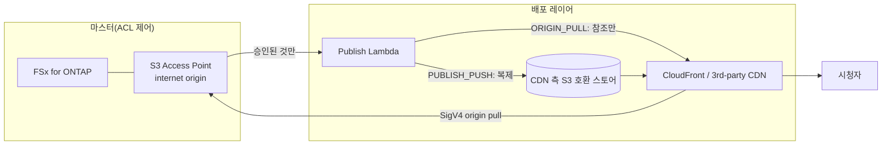

# Content Edge Delivery — FSx for ONTAP S3 AP × CDN/엣지 배포(벤더 비종속)

🌐 **Language / 言語**: [日本語](README.md) | [English](README.en.md) | 한국어 | [简体中文](README.zh-CN.md) | [繁體中文](README.zh-TW.md) | [Français](README.fr.md) | [Deutsch](README.de.md) | [Español](README.es.md)

## 개요

FSx for NetApp ONTAP 을 **Single Source of Truth(마스터)** 로 유지하면서, S3 Access Points (S3 AP)
상의 **배포 승인된 렌디션** 을 CDN/엣지 배포 네트워크에서 배포할 수 있게 하는,
**배포 벤더 비종속** 서버리스 패턴입니다.

통합 메커니즘 및 각 배포망의 실현 가능성(CloudFront / Akamai / Fastly / Cloudflare / Bunny.net /
Google Media CDN 등)의 기술 비교는 **[docs/cdn-comparison.md](../docs/cdn-comparison.md)** 를 참조하십시오.

> 본 패턴은 reference implementation(참조 구현)입니다. 배포 벤더 선정, 권리 처리, 지역 제한,
> 컴플라이언스는 고객이 판단합니다.

> **TL;DR(30초)**: ONTAP/NAS 의 마스터를 이동하지 않고, **승인된 배포용 산출물만** CloudFront 나
> 서드파티 CDN 에서 배포합니다. 첫걸음은 검증 리스크가 가장 낮은 `PUBLISH_PUSH`(M3). SigV4 직접 조회
> (ORIGIN_PULL)는 [검증 체크리스트](../docs/cdn-origin-verification-checklist.md)에서 실측한 후 채택하십시오.

## 비즈니스 성과와 도입(Outcome / Adoption)

「배포에 성공했다」가 아니라 **업무 성과** 로 평가합니다.

| 구분 | 정의(Outcome / Metric / 측정 방법) |
|---|---|
| Business Outcome | 마스터를 이중으로 보관하지 않고 엣지 배포를 실현(배포용 사본은 승인된 산출물만) |
| Metric | 배포 레이어로 유출되는 마스터 건수 = 0 / 승인 증적 `unrecorded` 건수 |
| 측정 방법 | publish 매니페스트의 `provenance` 와 `skipped`/`published` 를 집계 |

- **안전한 실험 경계**: `DemoMode=true` 로 FSx/외부 CDN 없이 동작 확인(시행착오가 허용되는 범위).
- **Business Sponsor**: 배포 오너(미디어/배포 기반 팀)를 임명하고 Go/No-Go 를 승인.
- **Go/No-Go 체크리스트**:
  - [ ] `ApprovedPrefix` 외부가 배포 대상에 포함되지 않음(권한 경계)
  - [ ] 승인 증적(누가 승인했는지)이 기록됨
  - [ ] 시청자 토큰이 CDN 네이티브 메커니즘으로 동작
  - [ ] ORIGIN_PULL 채택 시 SigV4×alias 실측이 PASS
- 향후 작업은 「미완성」이 아니라 **에비던스 확장**(실기 검증으로 TBV 를 실측값으로)으로 자리매김합니다.

**지금 바로 시도(30초 액션)**: `make test-content-edge-delivery` 로 단위 테스트(13건)를 실행하여
permission-aware 필터, 승인 증적, PII 마스킹 동작을 확인할 수 있습니다.

## Partner/SI 이용 가이드

- **첫 고객 질문**: 「기존 NAS/ONTAP 자산을 복사하지 않고 엣지 배포에 연결하고 싶은가. 배포는 CloudFront 인가,
  기존 계약 CDN(Akamai 등)인가」
- **PoC 산출물**: DemoMode 데모 → 승인된 렌디션의 배포 매니페스트 → (선택) 실기 SigV4 검증 결과.
- 배포망 선정은 [CDN 비교](../docs/cdn-comparison.md) 를 고객 대화에서 그대로 사용할 수 있습니다.

## 해결하는 과제

- ONTAP/NAS 상의 제작·관리 데이터를, 사본을 이중으로 보관하지 않고 엣지 배포로 연결하고 싶다
- 배포는 ONTAP 의 NFS/SMB ACL 을 경유하지 않으므로, **배포 대상을 승인된 산출물로 한정**하고 싶다
- 특정 CDN 에 종속되지 않고, CloudFront / 서드파티 CDN 을 교체 가능하게 하고 싶다

## 아키텍처(2가지 통합 메커니즘)



- **ORIGIN_PULL**: 오브젝트를 복제하지 않고, CDN 이 S3 AP 를 SigV4 로 직접 취득하는 것을 전제로 한
  오리진 참조 매니페스트를 생성합니다. CloudFront 는 OAC 로 대응(참조 구현).
  서드파티 CDN 의 SigV4 오리진 서명은 **검증 필요**([비교 문서](../docs/cdn-comparison.md) 참조).
- **PUBLISH_PUSH**: 승인된 렌디션을 CDN 측 S3 호환 스토어로 복제합니다. 오리진 인증 문제를 회피할 수 있으며,
  CDN 비종속. 검증 리스크가 가장 낮은 첫걸음.

## 주요 컴포넌트

| 컴포넌트 | 역할 |
|---|---|
| `functions/publish/handler.py` | 승인된 렌디션을 배포 레이어에 반영하고, 배포 매니페스트를 S3 AP 에 다시 씀 |
| `functions/delivery_log_sync/handler.py` | CDN 배포 로그를 정규화(IP 마스킹)하고, S3 AP 에 다시 써서 제작 데이터와 대조 가능하게 함 |
| Step Functions | Publish → SNS 알림 |
| CloudFront (선택) | ORIGIN_PULL 의 참조 배포(OAC + SigV4) |

## 파라미터

| 파라미터 | 설명 | 기본값 |
|---|---|---|
| `S3AccessPointAlias` | 입력 S3 AP Alias(Internet-origin) | — |
| `S3AccessPointOutputAlias` | 매니페스트/로그 재기록용 S3 AP Alias | — |
| `DeliveryMode` | `ORIGIN_PULL` / `PUBLISH_PUSH` | `PUBLISH_PUSH` |
| `CDNTarget` | `CLOUDFRONT`/`AKAMAI`/`FASTLY`/`CLOUDFLARE`/`OTHER` | `CLOUDFRONT` |
| `ApprovedPrefix` | 배포 승인된 프리픽스(permission-aware) | `delivery-approved/` |
| `SuffixFilter` | 배포 대상 확장자(쉼표 구분) | `""` |
| `DemoMode` | 외부 push 를 건너뜀(FSx/외부 CDN 없이 검증) | `true` |
| `ExternalStoreEndpoint` | PUBLISH_PUSH 의 S3 호환 엔드포인트 | `""` |
| `ExternalStoreBucket` | PUBLISH_PUSH 의 배포 대상 버킷 | `""` |
| `EnableCloudFront` | CloudFront 배포 활성화 | `false` |
| `RedactClientIp` | 배포 로그의 IP 마스킹 | `true` |
| `TriggerMode` | `POLLING`/`EVENT_DRIVEN`/`HYBRID` | `POLLING` |

## 배포

```bash
sam build --template content-edge-delivery/template.yaml
sam deploy --guided \
  --template content-edge-delivery/template.yaml \
  --stack-name fsxn-content-edge-delivery
```

> **주의**: `template.yaml` 은 SAM CLI(`sam build` + `sam deploy`)로 사용합니다.
> `aws cloudformation deploy` 명령으로 직접 배포하는 경우에는 `template-deploy.yaml` 을 사용하십시오(Lambda zip 파일의 사전 패키징과 S3 업로드가 필요합니다).

DemoMode 확인은 [docs/demo-guide.md](docs/demo-guide.md) 를 참조하십시오.

## 보안 / 거버넌스

- **permission-aware**: 배포 대상은 `ApprovedPrefix` 하위로 한정. ACL 제어 하의 마스터를 직접 배포하지 않음.
- **배포 승인의 감사 증적**: publish 매니페스트에 `provenance`(source_key / approver / approval_id /
  published_at / execution_id)를 기록. 승인 출처는 오브젝트의 사용자 메타데이터
  (`x-amz-meta-approved-by` / `x-amz-meta-approval-id`)에서 취득하며, 미기록 시 `unrecorded` 로
  가시화(배포는 멈추지 않고 운영에서 검출). durable 한 추적이 필요한 경우 `shared/lineage.py`(DynamoDB)로의
  기록으로 확장 가능.
- **데이터 소재지 / 지역 제한**: CDN 은 글로벌 배포이므로, 리전 외 배포가 허용되지 않는 데이터는
  승인 대상에서 제외하거나, CDN 의 geo-blocking 으로 제어합니다.
- **시청자 인증**: S3 Presigned URL 미지원이므로, CDN 네이티브 토큰 메커니즘을 사용합니다.
- **PII**: 배포 로그 재기록 시 클라이언트 IP 를 마스킹(`RedactClientIp=true`).
- **최소 권한**: Publish/LogSync 는 대상 S3 AP 의 필요한 Action 만. 배포용 Lambda 는 Internet-origin S3 AP
  액세스를 위해 **VPC 외부**에서 실행.

> **Governance Note**: 배포는 ONTAP 의 파일 권한을 강제 적용하지 않습니다. 배포 경계의 담보는
> 「승인된 산출물만 배포」라는 운영 규칙과, 승인 증적의 기록, 배포 대상의 액세스 제어로 수행합니다.

### 책임 분담(RACI / Public Sector 관점)

| 역할 | 책임 |
|---|---|
| 데이터 소유자(Data Owner) | 배포 대상 데이터의 분류·소재지·공개 가부의 최종 책임 |
| 배포 승인자(Approver) | `ApprovedPrefix` 로의 배치 승인. 승인 증적(approved-by / approval-id)의 부여 |
| 감사 증적 리뷰어(Audit Reviewer) | publish 매니페스트의 `provenance` 와 배포 로그를 정기 리뷰 |
| 운영 오너(Ops Owner) | 알람 수신·장애 대응·롤백 실행 |

- AI/자동 판정은 **보조 시그널**이며, 공개 배포의 가부는 인간(Data Owner / Approver)이 결정합니다.
- 검증용 데이터는 **비기밀 합성/샘플**을 사용(프로덕션 개인 데이터를 검증에 전용하지 않음).
- 기술적 검증은 법무·컴플라이언스·프라이버시 평가를 **대체하지 않습니다**.

## Scaffold 의 제약(명시)

- `TriggerMode=EVENT_DRIVEN` / `HYBRID` 은 **파라미터로 정의되어 있으나, 본 스캐폴드에서는 FPolicy 연계·
  멱등화(idempotency)를 미구현**. HYBRID 의 중복 제거가 필요한 경우 `shared/idempotency_checker.py` 를
  publish 경로에 통합하십시오. 현재의 동작 확인은 `POLLING` 으로 수행합니다.
- `PUBLISH_PUSH` 의 외부 스토어로의 실제 push 는 엔드포인트/버킷 설정 시에만 유효(DemoMode 는 건너뜀 기록).
- ORIGIN_PULL 의 SigV4 오리진 직접 조회는 서드파티 CDN 에서 **검증 필요**([비교 문서](../docs/cdn-comparison.md) 4.1 참조).

## 운영 / Runbook(Reliability/Ops)

- **알람**: `EnableCloudWatchAlarms=true` 로 Lambda 에러(publish / log-sync)와 Step Functions 실패를
  SNS 알림. `NotificationEmail` 로 수신.
- **장애 대응**:
  - publish 에러 → CloudWatch Logs `/aws/lambda/<stack>-publish` 를 확인. S3 AP 인가(IAM + AP policy +
    ONTAP ID)와 외부 스토어 인증(Secrets Manager)을 분리.
  - 외부 push 실패 → `ExternalStoreSecretName` 의 인증 정보·엔드포인트·버킷을 확인.
  - 배포 경계 의심(권한 외 배포) → [인시던트 대응 Playbook](../docs/incident-response-playbook.md).
- **롤백**: 배포는 승인된 산출물의 publish 만. 오배포 시에는 배포 대상(CDN 스토어/Distribution)에서 해당
  오브젝트를 제거하고, `ApprovedPrefix` 에서 회수하여 재 publish.
- **외부 스토어 인증**: PUBLISH_PUSH 로 Akamai/R2/Fastly 등에 복제하는 경우, AWS 기본 인증은 통용되지 않으므로
  `ExternalStoreSecretName`(Secrets Manager, `{"access_key_id","secret_access_key"}`)이 필요.

## Success Metrics(PoC Go/No-Go 관점)

| 구분 | 지표 | 기준 |
|---|---|---|
| Business Outcome | 마스터 이중 보관 회피 | 배포용 사본은 승인된 산출물만 |
| Technical KPI | publish 성공률 | DemoMode 에서 SUCCEEDED |
| Quality KPI | 배포 대상의 한정 | ApprovedPrefix 외부가 배포되지 않을 것 |
| Cost KPI | 배포 스토어 용량 | 승인된 렌디션 분량만 |
| Go/No-Go | SigV4 오리진 직접 조회 | 서드파티 CDN 은 실기 검증으로 판정 |

## 관련 문서

- [CDN/엣지 배포 통합 비교](../docs/cdn-comparison.md) / [English](../docs/cdn-comparison.en.md)
- [ORIGIN_PULL SigV4 검증 체크리스트](../docs/cdn-origin-verification-checklist.md)(실기 검증 절차)
- [대체 아키텍처 비교](../docs/comparison-alternatives.md)
- [S3AP 호환성 노트](../docs/s3ap-compatibility-notes.md)
- [인시던트 대응 Playbook](../docs/incident-response-playbook.md)(권한 외 배포·오배포 시의 대응 동선)
