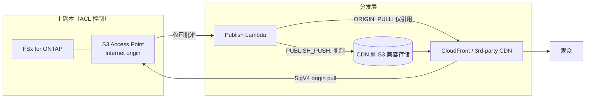

# Content Edge Delivery — FSx for ONTAP S3 AP × CDN/边缘分发（供应商无关）

🌐 **Language / 言語**: [日本語](README.md) | [English](README.en.md) | [한국어](README.ko.md) | 简体中文 | [繁體中文](README.zh-TW.md) | [Français](README.fr.md) | [Deutsch](README.de.md) | [Español](README.es.md)

## 概述

将 FSx for NetApp ONTAP 保留为 **Single Source of Truth（主副本）**，并使 S3 Access Points (S3 AP)
上的 **已批准分发的呈现版本** 能够从 CDN/边缘分发网络进行分发的
**分发供应商无关** 无服务器模式。

关于集成机制以及各分发网络的可行性（CloudFront / Akamai / Fastly / Cloudflare / Bunny.net /
Google Media CDN 等）的技术比较，请参阅 **[docs/cdn-comparison.md](../docs/cdn-comparison.md)**。

> 本模式是 reference implementation（参考实现）。分发供应商的选型、权利处理、地域限制、
> 合规性由客户判断。

> **TL;DR（30 秒）**: 不移动 ONTAP/NAS 的主副本，**仅将已批准的分发用产物** 通过 CloudFront 或
> 第三方 CDN 进行分发。第一步采用验证风险最小的 `PUBLISH_PUSH`（M3）。SigV4 直接拉取（ORIGIN_PULL）
> 需在[验证检查清单](../docs/cdn-origin-verification-checklist.md)中实测后再采用。

## 业务成果与落地（Outcome / Adoption）

不以「部署成功了」而以 **业务成果** 来评价。

| 区分 | 定义（Outcome / Metric / 测量方法） |
|---|---|
| Business Outcome | 无需双重保留主副本即可实现边缘分发（分发用副本仅为已批准产物） |
| Metric | 流出到分发层的主副本数量 = 0 / 批准凭证 `unrecorded` 数量 |
| 测量方法 | 汇总 publish 清单中的 `provenance` 与 `skipped`/`published` |

- **安全的实验边界**: `DemoMode=true` 可在没有 FSx/外部 CDN 的情况下验证运行（允许试错的范围）。
- **Business Sponsor**: 任命分发负责人（媒体/分发基础设施团队），并批准 Go/No-Go。
- **Go/No-Go 检查清单**:
  - [ ] `ApprovedPrefix` 之外的内容不包含在分发对象中（权限边界）
  - [ ] 批准凭证（由谁批准）被记录
  - [ ] 观众令牌通过 CDN 原生机制工作
  - [ ] 采用 ORIGIN_PULL 时 SigV4×alias 的实测为 PASS
- 将未来工作定位为 **证据扩展**（通过实机验证将 TBV 转为实测值），而非「未完成」。

**立即尝试（30 秒操作）**: 通过 `make test-content-edge-delivery` 运行单元测试（13 项），
可确认 permission-aware 过滤器、批准凭证、PII 掩码的运行情况。

## Partner/SI 使用指南

- **首个客户问题**: 「是否希望在不复制的情况下将现有的 NAS/ONTAP 资产连接到边缘分发。分发是通过 CloudFront，
  还是通过已签约的 CDN（Akamai 等）」
- **PoC 产物**: DemoMode 演示 → 已批准呈现版本的分发清单 →（可选）实机 SigV4 验证结果。
- 分发网络选型可将 [CDN 比较](../docs/cdn-comparison.md) 在客户对话中直接使用。

## 要解决的课题

- 希望将 ONTAP/NAS 上的制作·管理数据，在不双重保留副本的情况下连接到边缘分发
- 由于分发不经过 ONTAP 的 NFS/SMB ACL，因此希望 **将分发对象限定为已批准产物**
- 希望不被特定 CDN 锁定，使 CloudFront / 第三方 CDN 可替换

## 架构（2 种集成机制）



- **ORIGIN_PULL**: 不复制对象，生成以 CDN 通过 SigV4 直接获取 S3 AP 为前提的
  源引用清单。CloudFront 通过 OAC 支持（参考实现）。
  第三方 CDN 的 SigV4 源签名 **需验证**（参阅[比较文档](../docs/cdn-comparison.md)）。
- **PUBLISH_PUSH**: 将已批准的呈现版本复制到 CDN 侧 S3 兼容存储。可规避源认证问题，
  且与 CDN 无关。验证风险最低的第一步。

## 主要组件

| 组件 | 作用 |
|---|---|
| `functions/publish/handler.py` | 将已批准的呈现版本反映到分发层，并将分发清单写回 S3 AP |
| `functions/delivery_log_sync/handler.py` | 将 CDN 分发日志规范化（IP 掩码），写回 S3 AP 以便与制作数据进行对照 |
| Step Functions | Publish → SNS 通知 |
| CloudFront（可选） | ORIGIN_PULL 的参考分发（OAC + SigV4） |

## 参数

| 参数 | 说明 | 默认值 |
|---|---|---|
| `S3AccessPointAlias` | 输入 S3 AP Alias（Internet-origin） | — |
| `S3AccessPointOutputAlias` | 用于写回清单/日志的 S3 AP Alias | — |
| `DeliveryMode` | `ORIGIN_PULL` / `PUBLISH_PUSH` | `PUBLISH_PUSH` |
| `CDNTarget` | `CLOUDFRONT`/`AKAMAI`/`FASTLY`/`CLOUDFLARE`/`OTHER` | `CLOUDFRONT` |
| `ApprovedPrefix` | 已批准分发的前缀（permission-aware） | `delivery-approved/` |
| `SuffixFilter` | 分发对象扩展名（逗号分隔） | `""` |
| `DemoMode` | 跳过外部 push（无需 FSx/外部 CDN 即可验证） | `true` |
| `ExternalStoreEndpoint` | PUBLISH_PUSH 的 S3 兼容端点 | `""` |
| `ExternalStoreBucket` | PUBLISH_PUSH 的分发目标存储桶 | `""` |
| `EnableCloudFront` | 启用 CloudFront 分发 | `false` |
| `RedactClientIp` | 分发日志的 IP 掩码 | `true` |
| `TriggerMode` | `POLLING`/`EVENT_DRIVEN`/`HYBRID` | `POLLING` |

## 部署

```bash
sam build --template content-edge-delivery/template.yaml
sam deploy --guided \
  --template content-edge-delivery/template.yaml \
  --stack-name fsxn-content-edge-delivery
```

> **注意**: `template.yaml` 用于 SAM CLI（`sam build` + `sam deploy`）。
> 若使用 `aws cloudformation deploy` 命令直接部署，请使用 `template-deploy.yaml`（需要预先打包 Lambda zip 文件并上传到 S3）。

DemoMode 的确认请参阅 [docs/demo-guide.md](docs/demo-guide.md)。

## 安全 / 治理

- **permission-aware**: 分发对象限定于 `ApprovedPrefix` 之下。不直接分发处于 ACL 控制下的主副本。
- **分发批准的审计凭证**: 在 publish 清单中记录 `provenance`（source_key / approver / approval_id /
  published_at / execution_id）。批准来源从对象的用户元数据
  （`x-amz-meta-approved-by` / `x-amz-meta-approval-id`）获取，未记录时以 `unrecorded` 形式
  可视化（不停止分发，通过运营检测）。当需要 durable 的追踪时，可扩展为向 `shared/lineage.py`（DynamoDB）
  记录。
- **数据所在地 / 地域限制**: 由于 CDN 是全球分发，对于不允许跨区域分发的数据，应
  从批准对象中排除，或通过 CDN 的 geo-blocking 进行控制。
- **观众认证**: 由于不支持 S3 Presigned URL，使用 CDN 原生的令牌机制。
- **PII**: 写回分发日志时对客户端 IP 进行掩码（`RedactClientIp=true`）。
- **最小权限**: Publish/LogSync 仅具备目标 S3 AP 的必要 Action。分发用 Lambda 因需进行 Internet-origin S3 AP
  访问而在 **VPC 外** 运行。

> **Governance Note**: 分发不强制应用 ONTAP 的文件权限。分发边界的保障通过
> 「仅分发已批准产物」的运营规则、批准凭证的记录，以及分发目标的访问控制来实现。

### 责任分担（RACI / Public Sector 视角）

| 角色 | 责任 |
|---|---|
| 数据所有者（Data Owner） | 分发对象数据的分类·所在地·可否公开的最终责任 |
| 分发批准者（Approver） | 对 `ApprovedPrefix` 的放置批准。批准凭证（approved-by / approval-id）的赋予 |
| 审计凭证审阅者（Audit Reviewer） | 定期审阅 publish 清单中的 `provenance` 与分发日志 |
| 运营负责人（Ops Owner） | 告警接收·故障应对·回滚执行 |

- AI/自动判定是 **辅助信号**，公开分发的可否由人（Data Owner / Approver）决定。
- 验证用数据使用 **非机密的合成/样本**（不将生产个人数据挪用于验证）。
- 技术性验证 **不替代** 法务·合规·隐私评估。

## Scaffold 的约束（明示）

- `TriggerMode=EVENT_DRIVEN` / `HYBRID` **虽已定义为参数，但本脚手架尚未实现 FPolicy 联动·
  幂等化（idempotency）**。若需要 HYBRID 的去重，请将 `shared/idempotency_checker.py` 集成到
  publish 路径中。当前的运行确认以 `POLLING` 进行。
- `PUBLISH_PUSH` 向外部存储的实际 push 仅在配置了端点/存储桶时有效（DemoMode 记录跳过）。
- ORIGIN_PULL 的 SigV4 源直接拉取在第三方 CDN 上 **需验证**（参阅[比较文档](../docs/cdn-comparison.md) 4.1）。

## 运营 / Runbook（Reliability/Ops）

- **告警**: 通过 `EnableCloudWatchAlarms=true` 将 Lambda 错误（publish / log-sync）与 Step Functions 失败
  经 SNS 通知。通过 `NotificationEmail` 接收。
- **故障应对**:
  - publish 错误 → 检查 CloudWatch Logs `/aws/lambda/<stack>-publish`。区分 S3 AP 授权（IAM + AP policy +
    ONTAP ID）与外部存储认证（Secrets Manager）。
  - 外部 push 失败 → 检查 `ExternalStoreSecretName` 的认证信息·端点·存储桶。
  - 疑似分发边界问题（越权分发）→ [事件响应 Playbook](../docs/incident-response-playbook.md)。
- **回滚**: 分发仅进行已批准产物的 publish。误发布时，从分发目标（CDN 存储/Distribution）移除相应
  对象，从 `ApprovedPrefix` 撤下后重新 publish。
- **外部存储认证**: 使用 PUBLISH_PUSH 向 Akamai/R2/Fastly 等复制时，AWS 默认认证不适用，因此需要
  `ExternalStoreSecretName`（Secrets Manager, `{"access_key_id","secret_access_key"}`）。

## Success Metrics（PoC Go/No-Go 视角）

| 区分 | 指标 | 参考 |
|---|---|---|
| Business Outcome | 避免主副本双重保留 | 分发用副本仅为已批准产物 |
| Technical KPI | publish 成功率 | DemoMode 下 SUCCEEDED |
| Quality KPI | 分发对象的限定 | ApprovedPrefix 之外不被分发 |
| Cost KPI | 分发存储容量 | 仅为已批准呈现版本的部分 |
| Go/No-Go | SigV4 源直接拉取 | 第三方 CDN 以实机验证判定 |

## 相关文档

- [CDN/边缘分发集成比较](../docs/cdn-comparison.md) / [English](../docs/cdn-comparison.en.md)
- [ORIGIN_PULL SigV4 验证检查清单](../docs/cdn-origin-verification-checklist.md)（实机验证步骤）
- [替代架构比较](../docs/comparison-alternatives.md)
- [S3AP 兼容性说明](../docs/s3ap-compatibility-notes.md)
- [事件响应 Playbook](../docs/incident-response-playbook.md)（越权分发·误发布时的应对动线）
