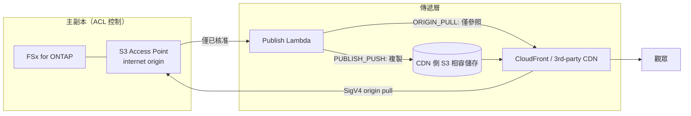

# Content Edge Delivery — FSx for ONTAP S3 AP × CDN/邊緣傳遞（供應商無關）

🌐 **Language / 言語**: [日本語](README.md) | [English](README.en.md) | [한국어](README.ko.md) | [简体中文](README.zh-CN.md) | 繁體中文 | [Français](README.fr.md) | [Deutsch](README.de.md) | [Español](README.es.md)

## 概述

將 FSx for NetApp ONTAP 保留為 **Single Source of Truth（主副本）**，並使 S3 Access Points (S3 AP)
上的 **已核准傳遞的轉譯版本** 能夠從 CDN/邊緣傳遞網路進行傳遞的
**傳遞供應商無關** 無伺服器模式。

關於整合機制以及各傳遞網路的可行性（CloudFront / Akamai / Fastly / Cloudflare / Bunny.net /
Google Media CDN 等）的技術比較，請參閱 **[docs/cdn-comparison.md](../docs/cdn-comparison.md)**。

> 本模式為 reference implementation（參考實作）。傳遞供應商的選型、權利處理、地區限制、
> 合規性由客戶判斷。

> **TL;DR（30 秒）**: 不移動 ONTAP/NAS 的主副本，**僅將已核准的傳遞用產物** 透過 CloudFront 或
> 第三方 CDN 進行傳遞。第一步採用驗證風險最小的 `PUBLISH_PUSH`（M3）。SigV4 直接拉取（ORIGIN_PULL）
> 需在[驗證檢查清單](../docs/cdn-origin-verification-checklist.md)中實測後再採用。

## 業務成果與導入（Outcome / Adoption）

不以「部署成功了」而以 **業務成果** 來評價。

| 區分 | 定義（Outcome / Metric / 測量方法） |
|---|---|
| Business Outcome | 無需雙重保留主副本即可實現邊緣傳遞（傳遞用副本僅為已核准產物） |
| Metric | 流出到傳遞層的主副本數量 = 0 / 核准憑證 `unrecorded` 數量 |
| 測量方法 | 彙總 publish 資訊清單中的 `provenance` 與 `skipped`/`published` |

- **安全的實驗邊界**: `DemoMode=true` 可在沒有 FSx/外部 CDN 的情況下驗證運作（允許試錯的範圍）。
- **Business Sponsor**: 任命傳遞負責人（媒體/傳遞基礎架構團隊），並核准 Go/No-Go。
- **Go/No-Go 檢查清單**:
  - [ ] `ApprovedPrefix` 之外的內容不包含在傳遞對象中（權限邊界）
  - [ ] 核准憑證（由誰核准）被記錄
  - [ ] 觀眾權杖透過 CDN 原生機制運作
  - [ ] 採用 ORIGIN_PULL 時 SigV4×alias 的實測為 PASS
- 將未來工作定位為 **證據擴充**（透過實機驗證將 TBV 轉為實測值），而非「未完成」。

**立即嘗試（30 秒操作）**: 透過 `make test-content-edge-delivery` 執行單元測試（13 項），
可確認 permission-aware 篩選器、核准憑證、PII 遮罩的運作情況。

## Partner/SI 使用指南

- **首個客戶問題**: 「是否希望在不複製的情況下將既有的 NAS/ONTAP 資產連接到邊緣傳遞。傳遞是透過 CloudFront，
  還是透過已簽約的 CDN（Akamai 等）」
- **PoC 產物**: DemoMode 示範 → 已核准轉譯版本的傳遞資訊清單 →（選用）實機 SigV4 驗證結果。
- 傳遞網路選型可將 [CDN 比較](../docs/cdn-comparison.md) 在客戶對話中直接使用。

## 要解決的課題

- 希望將 ONTAP/NAS 上的製作·管理資料，在不雙重保留副本的情況下連接到邊緣傳遞
- 由於傳遞不經過 ONTAP 的 NFS/SMB ACL，因此希望 **將傳遞對象限定為已核准產物**
- 希望不被特定 CDN 鎖定，使 CloudFront / 第三方 CDN 可替換

## 架構（2 種整合機制）



- **ORIGIN_PULL**: 不複製物件，產生以 CDN 透過 SigV4 直接取得 S3 AP 為前提的
  來源參照資訊清單。CloudFront 透過 OAC 支援（參考實作）。
  第三方 CDN 的 SigV4 來源簽章 **需驗證**（參閱[比較文件](../docs/cdn-comparison.md)）。
- **PUBLISH_PUSH**: 將已核准的轉譯版本複製到 CDN 側 S3 相容儲存。可規避來源認證問題，
  且與 CDN 無關。驗證風險最低的第一步。

## 主要元件

| 元件 | 作用 |
|---|---|
| `functions/publish/handler.py` | 將已核准的轉譯版本反映到傳遞層，並將傳遞資訊清單寫回 S3 AP |
| `functions/delivery_log_sync/handler.py` | 將 CDN 傳遞記錄正規化（IP 遮罩），寫回 S3 AP 以便與製作資料進行比對 |
| Step Functions | Publish → SNS 通知 |
| CloudFront（選用） | ORIGIN_PULL 的參考傳遞（OAC + SigV4） |

## 參數

| 參數 | 說明 | 預設值 |
|---|---|---|
| `S3AccessPointAlias` | 輸入 S3 AP Alias（Internet-origin） | — |
| `S3AccessPointOutputAlias` | 用於寫回資訊清單/記錄的 S3 AP Alias | — |
| `DeliveryMode` | `ORIGIN_PULL` / `PUBLISH_PUSH` | `PUBLISH_PUSH` |
| `CDNTarget` | `CLOUDFRONT`/`AKAMAI`/`FASTLY`/`CLOUDFLARE`/`OTHER` | `CLOUDFRONT` |
| `ApprovedPrefix` | 已核准傳遞的前綴（permission-aware） | `delivery-approved/` |
| `SuffixFilter` | 傳遞對象副檔名（逗號分隔） | `""` |
| `DemoMode` | 略過外部 push（無需 FSx/外部 CDN 即可驗證） | `true` |
| `ExternalStoreEndpoint` | PUBLISH_PUSH 的 S3 相容端點 | `""` |
| `ExternalStoreBucket` | PUBLISH_PUSH 的傳遞目標儲存貯體 | `""` |
| `EnableCloudFront` | 啟用 CloudFront 傳遞 | `false` |
| `RedactClientIp` | 傳遞記錄的 IP 遮罩 | `true` |
| `TriggerMode` | `POLLING`/`EVENT_DRIVEN`/`HYBRID` | `POLLING` |

## 部署

```bash
sam build --template content-edge-delivery/template.yaml
sam deploy --guided \
  --template content-edge-delivery/template.yaml \
  --stack-name fsxn-content-edge-delivery
```

> **注意**: `template.yaml` 用於 SAM CLI（`sam build` + `sam deploy`）。
> 若使用 `aws cloudformation deploy` 命令直接部署，請使用 `template-deploy.yaml`（需要預先封裝 Lambda zip 檔案並上傳到 S3）。

DemoMode 的確認請參閱 [docs/demo-guide.md](docs/demo-guide.md)。

## 安全 / 治理

- **permission-aware**: 傳遞對象限定於 `ApprovedPrefix` 之下。不直接傳遞處於 ACL 控制下的主副本。
- **傳遞核准的稽核憑證**: 在 publish 資訊清單中記錄 `provenance`（source_key / approver / approval_id /
  published_at / execution_id）。核准來源從物件的使用者中繼資料
  （`x-amz-meta-approved-by` / `x-amz-meta-approval-id`）取得，未記錄時以 `unrecorded` 形式
  可視化（不停止傳遞，透過營運偵測）。當需要 durable 的追蹤時，可擴充為向 `shared/lineage.py`（DynamoDB）
  記錄。
- **資料所在地 / 地區限制**: 由於 CDN 為全球傳遞，對於不允許跨區域傳遞的資料，應
  從核准對象中排除，或透過 CDN 的 geo-blocking 進行控制。
- **觀眾認證**: 由於不支援 S3 Presigned URL，使用 CDN 原生的權杖機制。
- **PII**: 寫回傳遞記錄時對用戶端 IP 進行遮罩（`RedactClientIp=true`）。
- **最小權限**: Publish/LogSync 僅具備目標 S3 AP 的必要 Action。傳遞用 Lambda 因需進行 Internet-origin S3 AP
  存取而在 **VPC 外** 執行。

> **Governance Note**: 傳遞不強制套用 ONTAP 的檔案權限。傳遞邊界的保障透過
> 「僅傳遞已核准產物」的營運規則、核准憑證的記錄，以及傳遞目標的存取控制來實現。

### 責任分擔（RACI / Public Sector 觀點）

| 角色 | 責任 |
|---|---|
| 資料擁有者（Data Owner） | 傳遞對象資料的分類·所在地·可否公開的最終責任 |
| 傳遞核准者（Approver） | 對 `ApprovedPrefix` 的放置核准。核准憑證（approved-by / approval-id）的賦予 |
| 稽核憑證審閱者（Audit Reviewer） | 定期審閱 publish 資訊清單中的 `provenance` 與傳遞記錄 |
| 營運負責人（Ops Owner） | 告警接收·故障應對·回復執行 |

- AI/自動判定為 **輔助訊號**，公開傳遞的可否由人（Data Owner / Approver）決定。
- 驗證用資料使用 **非機密的合成/樣本**（不將生產個人資料挪用於驗證）。
- 技術性驗證 **不替代** 法務·合規·隱私評估。

## Scaffold 的約束（明示）

- `TriggerMode=EVENT_DRIVEN` / `HYBRID` **雖已定義為參數，但本骨架尚未實作 FPolicy 連動·
  冪等化（idempotency）**。若需要 HYBRID 的去重，請將 `shared/idempotency_checker.py` 整合到
  publish 路徑中。目前的運作確認以 `POLLING` 進行。
- `PUBLISH_PUSH` 向外部儲存的實際 push 僅在設定了端點/儲存貯體時有效（DemoMode 記錄略過）。
- ORIGIN_PULL 的 SigV4 來源直接拉取在第三方 CDN 上 **需驗證**（參閱[比較文件](../docs/cdn-comparison.md) 4.1）。

## 營運 / Runbook（Reliability/Ops）

- **告警**: 透過 `EnableCloudWatchAlarms=true` 將 Lambda 錯誤（publish / log-sync）與 Step Functions 失敗
  經 SNS 通知。透過 `NotificationEmail` 接收。
- **故障應對**:
  - publish 錯誤 → 檢查 CloudWatch Logs `/aws/lambda/<stack>-publish`。區分 S3 AP 授權（IAM + AP policy +
    ONTAP ID）與外部儲存認證（Secrets Manager）。
  - 外部 push 失敗 → 檢查 `ExternalStoreSecretName` 的認證資訊·端點·儲存貯體。
  - 疑似傳遞邊界問題（越權傳遞）→ [事件回應 Playbook](../docs/incident-response-playbook.md)。
- **回復**: 傳遞僅進行已核准產物的 publish。誤發布時，從傳遞目標（CDN 儲存/Distribution）移除相應
  物件，從 `ApprovedPrefix` 撤下後重新 publish。
- **外部儲存認證**: 使用 PUBLISH_PUSH 向 Akamai/R2/Fastly 等複製時，AWS 預設認證不適用，因此需要
  `ExternalStoreSecretName`（Secrets Manager, `{"access_key_id","secret_access_key"}`）。

## Success Metrics（PoC Go/No-Go 觀點）

| 區分 | 指標 | 參考 |
|---|---|---|
| Business Outcome | 避免主副本雙重保留 | 傳遞用副本僅為已核准產物 |
| Technical KPI | publish 成功率 | DemoMode 下 SUCCEEDED |
| Quality KPI | 傳遞對象的限定 | ApprovedPrefix 之外不被傳遞 |
| Cost KPI | 傳遞儲存容量 | 僅為已核准轉譯版本的部分 |
| Go/No-Go | SigV4 來源直接拉取 | 第三方 CDN 以實機驗證判定 |

## 相關文件

- [CDN/邊緣傳遞整合比較](../docs/cdn-comparison.md) / [English](../docs/cdn-comparison.en.md)
- [ORIGIN_PULL SigV4 驗證檢查清單](../docs/cdn-origin-verification-checklist.md)（實機驗證步驟）
- [替代架構比較](../docs/comparison-alternatives.md)
- [S3AP 相容性說明](../docs/s3ap-compatibility-notes.md)
- [事件回應 Playbook](../docs/incident-response-playbook.md)（越權傳遞·誤發布時的應對動線）
