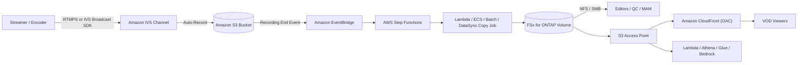

# Amazon IVS Live-to-FSx for ONTAP VOD Publishing Pattern

🌐 **Language / Sprache**: [日本語](README.md) | [English](README.en.md) | [한국어](README.ko.md) | [简体中文](README.zh-CN.md) | [繁體中文](README.zh-TW.md) | [Français](README.fr.md) | Deutsch | [Español](README.es.md)

> Referenzmuster, das **Amazon Interactive Video Service (Amazon IVS)** Live-Streaming mit
> **Amazon FSx for NetApp ONTAP** + **Amazon S3 Access Points** kombiniert, um einen
> Post-Live-Medien-Workspace und eine VOD-(Video-on-Demand-)Publishing-Ebene aufzubauen.

## Status

| Pfad | Status | Bedeutung |
|------|--------|-----------|
| **Empfohlen** | `Supported components` | Amazon IVS zeichnet automatisch in einen unterstützten Standard-S3-Bucket auf; anschließend wird das HLS-Paket nach FSx for ONTAP publiziert und über S3 Access Point + Amazon CloudFront als VOD ausgeliefert. Jede Komponente ist einzeln dokumentiert und unterstützt. |
| **Experimentell** | `Not documented as supported` | Eine IVS Recording Configuration direkt auf einen FSx-for-ONTAP-S3-Access-Point-Alias richten. **Von AWS nicht als unterstützt dokumentiert** — separat zu validieren. Siehe [direct-recording-experiment.md](direct-recording-experiment.md). |

> Dies ist eine **Referenzimplementierung**. Wahl des Auslieferungsanbieters, Rechteverwaltung,
> Geobeschränkungen und Compliance liegen bei der nutzenden Organisation. Technische Validierung ersetzt keine
> rechtliche, Compliance- oder Datenschutzprüfung.

> **TL;DR (30 s)**: IVS-Live-Erlebnis beibehalten; in den **unterstützten S3-Bucket** aufzeichnen;
> danach HLS nach FSx for ONTAP publizieren, über NFS/SMB schneiden/QC/freigeben und VOD über
> S3 Access Point + CloudFront ausliefern. Direktaufzeichnung (IVS→FSx for ONTAP S3 AP) ist **Experimentell** —
> nur Validierungsplan.

**Jetzt testen (30 s)**: `make test-media-ivs-vod-publishing` führt Unit-/Property-Tests aus und
prüft Recording-End-Validierung, die permission-aware Ingest-Grenze, Manifest-Validierung, die
Human-Review-Entscheidung und die Datenklassifizierung (kein FSx for ONTAP nötig).

## Warum dieses Muster

- Amazon IVS liefert das **interaktive Live-Erlebnis** (niedrige Latenz).
- Amazon IVS zeichnet automatisch in einen **Standard-S3-Bucket** auf (offiziell unterstützte Landing Zone).
- **FSx for ONTAP** wird zum **Post-Live-Medien-Workspace**: Schnitt, QC und Freigabe über **NFS/SMB** auf denselben Daten.
- **S3 Access Points** stellt diese auf FSx liegenden Dateien AWS-Diensten (CloudFront, Lambda, Athena, Glue, Amazon Bedrock) über die S3-API bereit.
- **Amazon CloudFront** liefert das fertige HLS-VOD an Zuschauer aus.
- Es erweitert sich auch auf **near-live-Kollaboration parallel zum Livestream** (Catch-up-Schnitte und
  Untertitel während der Übertragung). Direkte Injektion in das IVS-Live-Manifest ist nicht möglich;
  nach Schicht gestalten (siehe „Near-live-Kollaboration" in [architecture.de.md](architecture.de.md)).

So hält ein Medienteam eine einzige maßgebliche Kopie auf FSx for ONTAP (nutzbar von Datei-Tools und
S3-API-Diensten) statt getrennter Kopien für Schnitt und Auslieferung.

## Partner/SI-Leitfaden

- **Erste zu klärende Frage**: „Benötigen Schnitt/QC/Freigabe/Archiv nach dem Live sowohl Dateiprotokolle (NFS/SMB) als auch die S3-API? Erfolgt die VOD-Auslieferung über CloudFront?"
- **PoC-Ergebnisse**: DemoMode-Demo → VOD-Publish-Manifest (Master-Manifest-Validierung + Human-Review-Entscheidung) → (optional) echte IVS-Aufzeichnung → FSx-Publishing → CloudFront-Auslieferung.

## Architektur (empfohlener Pfad)



Siehe [architecture.de.md](architecture.de.md); Diagrammquelle: [diagrams/architecture.mmd](diagrams/architecture.mmd).

## Rollenverteilung

| Ebene | Komponente | Rolle |
|-------|------------|-------|
| Live | Amazon IVS | Interaktives Live-Video-Erlebnis |
| Landing Zone | Amazon S3 | Offiziell unterstütztes Aufzeichnungsziel |
| Medien-Workspace | FSx for ONTAP | Post-Live Schnitt / QC / Freigabe / Archiv / VOD-Quelle |
| S3-API-Zugriff | S3 Access Points | S3-API-Zugriff auf FSx-Dateien |
| Auslieferung | Amazon CloudFront | Öffentliche/kontrollierte VOD-Auslieferung (OAC + SigV4) |

## Wichtige Komponenten

| Komponente | Rolle |
|---|---|
| `functions/publish/handler.py` | Durch IVS Recording End ausgelöst; nimmt das HLS-Paket nach FSx for ONTAP (S3 AP) auf, validiert das Master-Manifest und schreibt ein VOD-Publish-Manifest mit Human-Review-Entscheidung |
| `functions/moderation/handler.py` (optional) | Async-start/collect-Lambda für strikte Moderation (Video/Audio/Untertitel) (`EnableStrictModeration=true`) |
| `functions/transcode/handler.py` (optional) | Async-start/collect-Lambda für HLS→MP4 (MediaConvert); erzeugt das MP4 als Eingabe für die Videomoderation (`EnableStrictModeration=true`) |
| `template.yaml` | SAM-Template (EventBridge / Scheduler / Step Functions / Lambda / optional CloudFront) |
| Step Functions | Publish → SNS-Benachrichtigung |
| CloudFront (optional) | VOD-Auslieferung vom S3-Access-Point-Origin (OAC + SigV4) |

## Parameter

| Parameter | Beschreibung | Standard |
|---|---|---|
| `RecordingSourceBucket` | Standard-S3-Bucket (oder AP-Alias) als IVS-Auto-Record-Ziel | — |
| `S3AccessPointOutputAlias` | S3-AP-Alias zum Schreiben nach FSx for ONTAP (Internet-origin) | — |
| `MasterManifestName` | Master-Manifest-Dateiname (Validierung) | `master.m3u8` |
| `TriggerMode` | `POLLING`/`EVENT_DRIVEN`/`HYBRID` | `EVENT_DRIVEN` |
| `SourcePrefixRoot` | Im POLLING-Modus gescanntes IVS-Aufzeichnungspräfix | `ivs/v1/` |
| `DemoMode` | Echte Kopie überspringen, nur protokollieren (ohne FSx validieren) | `true` |
| `DataClassification` | Ausgabe-Datenklassifizierung (VOD meist PUBLIC) | `PUBLIC` |
| `HumanReviewAutoApproveThreshold` | Confidence-Schwelle für Auto-Publish | `0.85` |
| `HumanReviewRejectThreshold` | Confidence-Schwelle für Auto-Ablehnung | `0.30` |
| `EnableModeration` | Rekognition-Thumbnail-Content-Moderation (opt-in) | `false` |
| `ModerationMinConfidence` | Min. Confidence für Moderationslabels | `80` |
| `ModerationMaxImages` | Max. Thumbnails zur Moderation (Kostenkontrolle) | `5` |
| `EnableStrictModeration` | Strikte Video-/Audio-/Untertitel-Moderation-Lambda (opt-in, async) | `false` |
| `ModerationToxicityThreshold` | Comprehend-Toxicity-Schwelle (0-1) | `0.5` |
| `MediaModerationLanguage` | Comprehend-/Transcribe-Sprachcode | `en` |
| `MediaConvertRoleArn` | MediaConvert-Ausführungsrollen-ARN für HLS→MP4 (Videomoderation) | — |
| `EnableCloudFront` | CloudFront-Auslieferung aktivieren | `false` |
| `NotificationEmail` | SNS-Benachrichtigungsempfänger | — |
| `ScheduleExpression` | Scheduler-Ausdruck (POLLING / HYBRID) | `rate(1 hour)` |
| `EnableCloudWatchAlarms` | Lambda/SFN-Alarme aktivieren | `false` |
| `EnableXRayTracing` | X-Ray-Tracing | `true` |
| `LogRetentionInDays` | CloudWatch-Logs-Aufbewahrung | `90` |

## Bereitstellung

```bash
sam build --template solutions/edge/media-ivs-vod-publishing/template.yaml
sam deploy --guided \
  --template solutions/edge/media-ivs-vod-publishing/template.yaml \
  --stack-name fsxn-media-ivs-vod-publishing
```

Zur DemoMode-Prüfung siehe [docs/demo-guide.md](docs/demo-guide.md).

## Human Review (menschliche Freigabe vor Veröffentlichung)

VOD-Publishing verlässt sich nicht allein auf Automatik. Aus **Vollständigkeitssignalen** des Pakets
wird eine Publish-Readiness-Confidence berechnet und über die Schwellen in `shared/human_review.py`
bewertet.

| Entscheidung | Bedingung (Standard) | Verhalten |
|--------------|----------------------|-----------|
| `AUTO_APPROVE` | Confidence ≥ 0,85 (Master-Manifest + Segmente vorhanden) | Publish-Manifest unverändert erfassen |
| `HUMAN_REVIEW` | 0,30 ≤ Confidence < 0,85 (Manifest vorhanden, aber Segmente fehlen usw.) | Mit `[REVIEW REQUIRED]` benachrichtigen, menschliche Prüfung |
| `REJECT` | Confidence < 0,30 (Master-Manifest fehlt usw.) | Als `[ESCALATION]` benachrichtigen, nicht veröffentlichen |

> Confidence ist **kein** KI-Modell-Score, sondern eine **Heuristik zur Paketvollständigkeit**. Menschen
> (Data Owner / Approver) treffen die endgültige Veröffentlichungsentscheidung.

## Content-Moderation (opt-in)

Als **von der Vollständigkeitsprüfung unabhängiges Veröffentlichungs-Tor** können Sie die Amazon-
Rekognition-Content-Moderation optional aktivieren (standardmäßig aus; empfohlener Pfad und DemoMode bleiben unverändert).

- Mit `EnableModeration=true` (nicht DemoMode) führt der Handler `DetectModerationLabels` auf den Thumbnails
  der Aufzeichnung aus (bis zu `ModerationMaxImages`).
- Wird ein Label über `ModerationMinConfidence` (Standard 80) gefunden, wird die **Veröffentlichung blockiert**
  (`blocked_by_moderation`) und zur menschlichen Prüfung geleitet. Das `moderation`-Ergebnis wird im Manifest festgehalten.
- Dies ist eine **Thumbnail-Stichprobe**, keine vollständige Inhaltsabdeckung.
- Unabhängig von der Vollständigkeits-Heuristik (Human Review): „das Paket ist vollständig" ≠ „der Inhalt ist freigegeben".

### Strikte Moderation (Video/Audio/Untertitel, opt-in, async)

Für eine strengere Abdeckung als die Thumbnail-Stichprobe moderiert eine asynchrone Komponente Video, Audio
und Untertitel (`EnableStrictModeration=true` erstellt `functions/moderation/handler.py`).

- **Video**: Amazon Rekognition `StartContentModeration` / `GetContentModeration` (async). Eingabe: eine
  einzelne Videodatei in S3 (z. B. ein aus dem HLS per MediaConvert erzeugtes MP4, via `video_key` referenziert).
- **Audio**: Amazon-Transcribe-Transkription → Amazon Comprehend `DetectToxicContent` für toxische Sprache.
- **Untertitel**: Paket-Untertitel (`.vtt` / `.srt`) werden synchron via Comprehend geprüft.
- **HLS→MP4-Transcoding**: Videomoderation braucht ein einzelnes MP4, daher konvertiert
  `functions/transcode/handler.py` (AWS Elemental MediaConvert, start/collect) das HLS zuerst zu MP4
  (`MediaConvertRoleArn` erforderlich).
- Läuft in **zwei Phasen (start / collect)**, gedacht für Step-Functions-Steuerung
  `transcode → moderation start → Wait → collect (poll) → gate`
  (Beispiel: [samples/strict-moderation.asl.json](samples/strict-moderation.asl.json), transcode→moderation Ende-zu-Ende).
  Erreicht irgendetwas den Schwellenwert, blockiert `decision=BLOCK` die Veröffentlichung und leitet zur menschlichen Prüfung.
- Schwellen: `ModerationMinConfidence` (Video) / `ModerationToxicityThreshold` (Audio & Untertitel, 0-1).

> Einschränkungen: Videomoderation kann HLS-Segmente nicht direkt adressieren, daher ist ein einzelnes MP4
> nötig — dieses Muster bündelt die HLS→MP4-Konvertierung via `functions/transcode/` (MediaConvert; erfordert
> eine MediaConvert-Ausführungsrolle). MediaConvert/Transcribe/Comprehend/Rekognition async verursachen Kosten
> und Latenz. Dies ist ein unterstützendes Signal — Menschen (Data Owner / Approver) treffen die endgültige Entscheidung.

## Datenklassifizierung

- VOD-Auslieferungsartefakte sind meist **PUBLIC** (`DataClassification=PUBLIC`). Das Publish-Manifest führt
  `data_classification` / `data_classification_label`.
- Nicht veröffentlichbares Material (nicht freigegeben, geobeschränkt, Rechte ungeklärt) sollte gar nicht
  aufgenommen/veröffentlicht werden.

## Success Metrics (PoC-Go/No-Go-Sicht)

| Kategorie | Metrik | Richtwert |
|---|---|---|
| Business Outcome | Doppelte Medienhaltung Schnitt vs. Auslieferung vermeiden | Einzelne FSx-Kopie für beides |
| Technical KPI | Publish-Erfolgsrate | SUCCEEDED im DemoMode |
| Quality KPI | Master-Manifest-Validierung | Master-Manifest vor Veröffentlichung bestätigen |
| Cost KPI | FSx-Lese-Bandbreiten-Einfluss | Origin-Fetches verdrängen Schnitt-Traffic nicht (P95/P99) |
| Go/No-Go | Direktaufzeichnung (IVS→FSx for ONTAP S3 AP) | Per Hardware-Validierung entschieden (Experimentell, solange AWS es nicht dokumentiert) |

## Validierungsmatrix (Zusammenfassung)

| Integrationspunkt | Status |
|-------------------|--------|
| IVS-Auto-Record in Standard-S3-Bucket | Supported |
| IVS RecordingConfiguration + FSx-S3-AP-Alias | Experimental / Unknown |
| S3 → FSx über NFS/SMB | Supported |
| S3 → FSx über S3 AP `PutObject` | Supported (Größen-/API-Grenzen) |
| FSx for ONTAP S3 AP → CloudFront | Supported (dokumentiertes Tutorial) |
| FSx for ONTAP S3 AP → Lambda | Supported |
| FSx for ONTAP S3 AP → Athena / Glue / Bedrock | Supported |

Vollständige Details in [validation-matrix.md](validation-matrix.md).

## Dokumente

| Dokument | Zweck |
|----------|-------|
| [architecture.de.md](architecture.de.md) | Designprinzipien, Datenfluss, Netzwerk |
| [validation-matrix.md](validation-matrix.md) | Support-Status je Integrationspunkt |
| [direct-recording-experiment.md](direct-recording-experiment.md) | Validierungsplan für Direktaufzeichnung |
| [supported-path-ivs-s3-fsx-cloudfront.md](supported-path-ivs-s3-fsx-cloudfront.md) | Implementierungshinweise zum empfohlenen Pfad |
| [docs/demo-guide.md](docs/demo-guide.md) | DemoMode-Prüfschritte |
| [samples/](samples/) | EventBridge-Event, Step-Functions-ASL, Lambda-Snippet, AP-Policy, CloudFront-Hinweise |
| [scripts/](scripts/) | CLI zum Erstellen/Validieren/Synchronisieren der Recording-Config |

## Sicherheit / Governance

- **Permission-aware Ingest-Grenze**: Ingest ist auf das konfigurierte Aufzeichnungspräfix beschränkt.
  Öffentliche Auslieferung erzwingt keine ONTAP-Dateiberechtigungen; die Grenze wird durch die Regel „nur
  Freigegebenes veröffentlichen" und die Sperrung des CloudFront-Origin sichergestellt.
- **Zuschauer-Authentifizierung**: FSx for ONTAP S3 AP unterstützt **keine** S3-Presigned-URLs — CloudFront-eigene
  signierte URLs/Cookies verwenden.
- **Datenresidenz**: IVS-Kanal, Recording Configuration und S3-Standort müssen in **derselben Region** liegen.
  CloudFront ist global; Daten, die nicht außerhalb einer Region ausgeliefert werden dürfen, ausschließen oder
  CloudFront-Geobeschränkung anwenden.
- **Least Privilege**: Die Publish-Lambda hat nur die nötigen Actions auf Quell-S3 (Lesen) und Output-S3-AP
  (Schreiben). Sie läuft **außerhalb der VPC** für Internet-origin-S3-AP-Zugriff.
- KI/automatisierte Signale sind **unterstützend**; Menschen (Data Owner / Approver) entscheiden über die Veröffentlichung.

> **Governance Note**: Auslieferung erzwingt keine ONTAP-Dateiberechtigungen. Die Grenze wird durch Begrenzung
> des Ingest-Umfangs, Freigabeabläufe, Human Review und CloudFront-Origin-Zugriffskontrolle sichergestellt.
> Technische Validierung ersetzt keine rechtliche, Compliance- und Datenschutzprüfung.

## Scaffold-Einschränkungen (explizit)

- Dieses Scaffold zielt auf **EVENT_DRIVEN** (IVS Recording End → EventBridge → Step Functions). `POLLING` scannt
  unter `SourcePrefixRoot`; `HYBRID` definiert beides, aber **Idempotenz ist nicht implementiert**. Für
  Deduplizierung `shared/idempotency_checker.py` integrieren.
- `functions/publish/handler.py` implementiert Ingest mit größenbasierter Auto-Auswahl: `PutObject` für kleine
  Objekte, **Streaming-Multipart** (`streaming_download` + `multipart_upload`, geringer Speicher) für große
  (Standard > 100MB). Objekte über der Lambda-Ingest-Obergrenze (Standard 20GB) werden übersprungen — DataSync
  oder ECS/Batch (NFS/SMB-Mount) bevorzugen.
- Direktaufzeichnung ist Experimentell ([direct-recording-experiment.md](direct-recording-experiment.md)).

## Geltungsbereich

- Dieses Muster zielt auf **Amazon IVS Low-Latency Streaming** Auto-Record (Kanalaufzeichnungen unter
  `ivs/v1/...`). **IVS Real-Time Streaming (stages)** hat ein anderes Aufzeichnungsmodell und ist
  außerhalb des Bereichs (die gleiche Idee „nach FSx publizieren → über S3 AP + CloudFront ausliefern"
  gilt weiterhin).
- Es deckt **Auslieferung/Ingest von bereits kodiertem HLS** ab. Es **transkodiert, re-packaged oder
  fügt keine Werbung ein**.

## Alternativen und Auswahl (neutral)

Nach Kontext wählen. Trade-offs symmetrisch dargestellt (auch für den empfohlenen Ansatz).
Vollständiger Vergleich + Entscheidungsdiagramm in [architecture.de.md](architecture.de.md).

| Option | Passt zu | Trade-off / Erwägung |
|--------|----------|----------------------|
| **Dieses Muster** | Aufzeichnung braucht **NFS/SMB-Schnitt/QC/Freigabe** *und* S3-API-Auslieferung/Analyse auf derselben Kopie | Zusätzlicher Ingest-Hop (S3→FSx) und Betriebsebene; Auslieferungsgrenze operativ, nicht ONTAP-ACLs |
| **IVS Auto-Record → S3 + CloudFront** (ohne FSx) | Einfaches Live-to-VOD ohne dateibasierte Postproduktion | Kein einheitlicher NFS/SMB-Workspace |
| **AWS Elemental MediaConvert / MediaPackage / MediaTailor** | Transkodierung / JIT-Packaging / DRM / Werbeeinblendung | Mehr Dienste zu betreiben; dieses Muster tut nichts davon — bei Bedarf kombinieren |
| **Direkt S3 + CloudFront** | Reines VOD von vorhandenem HLS | Keine Live-Ebene, kein ONTAP-Datei-Workflow |

Diese sind **kombinierbar**, nicht exklusiv.

## Betrieb / Runbook (Reliability/Ops)

- **EventBridge-Zustellung ist Best-Effort** (Ereignisse können fehlen, verspätet oder unsortiert
  sein). In der Produktion `TriggerMode=HYBRID` bevorzugen (EVENT_DRIVEN für Latenz + POLLING als
  Absicherung). Da **Idempotenz nicht implementiert** ist, vor HYBRID `shared/idempotency_checker.py`
  (Schlüssel `recording_session_id` + `recording_prefix`) integrieren.
- **Alarme**: `EnableCloudWatchAlarms=true` meldet Lambda-Fehler / Step-Functions-Fehler via SNS.
- **Incident Response**: bei Publish-Fehler `/aws/lambda/<stack>-publish` prüfen und S3-AP-Autorisierung
  (IAM + AP-Policy + ONTAP-Identität) vom Quell-S3-Lesen isolieren. Bei Fehlveröffentlichung Objekt aus
  dem CloudFront-Origin entfernen und nach Korrektur erneut ausführen. Siehe
  [Incident-Response-Playbook](../../docs/incident-response-playbook.md).

## FAQ / verbreitete Missverständnisse

- **„Kann IVS direkt in einen FSx-for-ONTAP-S3-AP aufzeichnen?"** Nicht als unterstützt dokumentiert →
  als Experimentell behandeln ([direct-recording-experiment.md](direct-recording-experiment.md)).
- **„Ist ein S3 AP ein vollständiger S3-Bucket?"** Nein (kein Presigned URL / Versioning / Object Lock /
  Lifecycle / Static Website Hosting).
- **„Kann man Zuschauern eine Presigned URL geben?"** Nein → CloudFront-signierte URLs/Cookies verwenden.
- **„Bedeutet ein hoher Vollständigkeits-Score, dass Veröffentlichung sicher ist?"** Nein — geprüft wird
  nur die HLS-Paketvollständigkeit; die Inhaltsfreigabe ist ein separater menschlicher/KI-Moderationsschritt
  . Moderation ist **opt-in verfügbar** (`EnableModeration=true` führt Rekognition aus und blockiert die
  Veröffentlichung bei Flag).

## Performance Considerations

- Der provisionierte FSx-for-ONTAP-Durchsatz wird zwischen NFS/SMB/S3AP **geteilt**. VOD-Origin-Fetches von
  CloudFront können mit Schnitt-/QC-Traffic konkurrieren — nach **P95/P99-Latenz** dimensionieren und hohe
  CloudFront-TTLs / Origin Shield nutzen, um Origin-Fetches zu reduzieren.
- Playlist (`.m3u8`): kurze TTL; Segmente (`.ts` / `.m4s`): lange TTL.
- Zur Trennung der Auslieferungs-Lesevorgänge ein **FlexCache**-Volume (ONTAP-nativ) als CloudFront-Origin-Quelle erwägen.
- **Ein S3 AP ist kein vollständiger S3-Bucket** — es ist eine S3-kompatible Zugriffsgrenze. Keine
  Bucket-Funktionen (Presigned URL, Versioning, Object Lock, Lifecycle, Static Website Hosting) voraussetzen.
  Siehe [../../docs/s3ap-compatibility-notes.md](../../docs/s3ap-compatibility-notes.md).

## Referenzen (offizielle AWS-Dokumentation)

- [IVS Auto-Record to Amazon S3 (Low-Latency Streaming)](https://docs.aws.amazon.com/ivs/latest/LowLatencyUserGuide/record-to-s3.html)
- [IVS CreateRecordingConfiguration API](https://docs.aws.amazon.com/ivs/latest/LowLatencyAPIReference/API_CreateRecordingConfiguration.html)
- [Using Amazon EventBridge with IVS Low-Latency Streaming](https://docs.aws.amazon.com/ivs/latest/LowLatencyUserGuide/eventbridge.html)
- [AWS::IVS::RecordingConfiguration (CloudFormation)](https://docs.aws.amazon.com/AWSCloudFormation/latest/TemplateReference/aws-resource-ivs-recordingconfiguration.html)
- [FSx for ONTAP S3 access points](https://docs.aws.amazon.com/fsx/latest/ONTAPGuide/s3-access-points.html)
- [Restricting access to an Amazon S3 origin (CloudFront OAC)](https://docs.aws.amazon.com/AmazonCloudFront/latest/DeveloperGuide/private-content-restricting-access-to-s3.html)

## Verwandte Dokumente

- [S3AP-Kompatibilitätshinweise](../../docs/s3ap-compatibility-notes.md)
- [S3AP-Leistungsüberlegungen](../../docs/s3ap-performance-considerations.md)
- [Kostenrechner](../../docs/cost-calculator.md)
- [Vergleich alternativer Architekturen](../../docs/comparison-alternatives.md)
- [Incident-Response-Playbook](../../docs/incident-response-playbook.md)
- [Content-Edge-Delivery-Muster](../content-delivery/README.md)
- [Media/VFX-Branchenmuster](../../industry/media-vfx/README.md)
