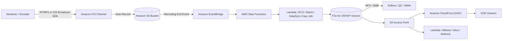

# Amazon IVS Live-to-FSx for ONTAP VOD Publishing Pattern

🌐 **Language / 言語**: [日本語](README.md) | English | [한국어](README.ko.md) | [简体中文](README.zh-CN.md) | [繁體中文](README.zh-TW.md) | [Français](README.fr.md) | [Deutsch](README.de.md) | [Español](README.es.md)

> Reference pattern that combines **Amazon Interactive Video Service (Amazon IVS)** live
> streaming with **Amazon FSx for NetApp ONTAP** + **Amazon S3 Access Points** to build a
> post-live media workspace and VOD (video-on-demand) publishing layer.

## Status

| Path | Status | Meaning |
|------|--------|---------|
| **Recommended** | `Supported components` | Amazon IVS Auto-Record to a standard S3 bucket, then publish the HLS package to FSx for ONTAP and deliver via S3 Access Point + Amazon CloudFront. Every component is individually documented and supported. |
| **Experimental** | `Not documented as supported` | Pointing an IVS Recording Configuration directly at an FSx for ONTAP S3 Access Point alias. This is **not documented by AWS as supported** and must be validated separately. See [direct-recording-experiment.md](direct-recording-experiment.md). |

> This is a **reference implementation**. Delivery vendor selection, rights management, geo
> restrictions, and compliance judgments are the operating organization's responsibility. Technical
> validation does not replace legal, compliance, or privacy review.

> **TL;DR (30s)**: Keep the IVS live experience; record to the **supported S3 bucket**; then
> publish HLS to FSx for ONTAP, edit/QC/approve over NFS/SMB, and re-deliver VOD via S3 Access
> Point + CloudFront. Direct recording (IVS→FSx for ONTAP S3 AP) is **Experimental** — validation plan only.

**Try it now (30-second action)**: run `make test-media-ivs-vod-publishing` to execute the
unit/property tests and confirm Recording End validation, the permission-aware ingest boundary,
manifest validation, the Human Review decision, and data classification (no FSx for ONTAP needed).

## Why this pattern

- Amazon IVS delivers the **live interactive experience** (low-latency streaming).
- Amazon IVS Auto-Records to a **standard S3 bucket** (the officially supported landing zone).
- **FSx for ONTAP** becomes the **post-live media workspace**: editors, QC, and approval work
  over **NFS/SMB** on the same data.
- **S3 Access Points** expose those FSx-resident files to AWS services (CloudFront, Lambda,
  Athena, Glue, Amazon Bedrock) via the S3 API.
- **Amazon CloudFront** re-delivers the finished HLS VOD to viewers.
- It also extends to **near-live collaborative editing alongside the live stream** (catch-up edits and
  captions during the broadcast). Direct injection into the IVS live manifest is not possible; design it
  by layer (see "Near-live collaborative editing" in [architecture.en.md](architecture.en.md)).

This lets a media team keep one authoritative copy of the media on FSx for ONTAP (usable by
both file-protocol tools and S3-API services) instead of separate copies for editing and delivery.

## Partner/SI usage guide

- **First discovery question**: "After live streaming, do editing/QC/approval/archive need both
  file protocols (NFS/SMB) and the S3 API? Is VOD delivery via CloudFront?"
- **PoC deliverables**: DemoMode demo → VOD publish manifest (master-manifest validation + Human
  Review decision) → (optional) real IVS recording → FSx publish → CloudFront delivery.

## Architecture (recommended path)



See [architecture.en.md](architecture.en.md) and [diagrams/architecture.mmd](diagrams/architecture.mmd).

## Role separation

| Layer | Component | Role |
|-------|-----------|------|
| Live | Amazon IVS | Live interactive video experience |
| Landing zone | Amazon S3 | Officially supported recording destination |
| Media workspace | FSx for ONTAP | Post-live editing / QC / approval / archive / VOD source |
| S3 API access | S3 Access Points | S3-API access to FSx-resident files |
| Delivery | Amazon CloudFront | Public or controlled VOD delivery (OAC + SigV4) |

## Key components

| Component | Role |
|---|---|
| `functions/publish/handler.py` | Triggered by IVS Recording End; ingests the HLS package to FSx for ONTAP (S3 AP), validates the master manifest, and writes a VOD publish manifest with a Human Review decision |
| `functions/moderation/handler.py` (optional) | Async strict-moderation (video/audio/captions) start/collect Lambda (`EnableStrictModeration=true`) |
| `functions/transcode/handler.py` (optional) | Async HLS→MP4 (MediaConvert) start/collect Lambda; produces the MP4 input for video moderation (`EnableStrictModeration=true`) |
| `template.yaml` | SAM template (EventBridge / Scheduler / Step Functions / Lambda / optional CloudFront) |
| Step Functions | Publish → SNS notification |
| CloudFront (optional) | VOD delivery from the S3 Access Point origin (OAC + SigV4) |

## Parameters

| Parameter | Description | Default |
|---|---|---|
| `RecordingSourceBucket` | Standard S3 bucket (or AP alias) that IVS Auto-Records to | — |
| `S3AccessPointOutputAlias` | S3 AP Alias for writing into FSx for ONTAP (Internet-origin) | — |
| `MasterManifestName` | Master manifest filename (for validation) | `master.m3u8` |
| `TriggerMode` | `POLLING`/`EVENT_DRIVEN`/`HYBRID` | `EVENT_DRIVEN` |
| `SourcePrefixRoot` | IVS recording prefix scanned in POLLING mode | `ivs/v1/` |
| `DemoMode` | Skip real copy, record only (validate without FSx) | `true` |
| `DataClassification` | Output data classification (VOD artifacts are usually PUBLIC) | `PUBLIC` |
| `HumanReviewAutoApproveThreshold` | Auto-publish confidence threshold | `0.85` |
| `HumanReviewRejectThreshold` | Auto-reject confidence threshold | `0.30` |
| `EnableModeration` | Rekognition thumbnail content moderation (opt-in) | `false` |
| `ModerationMinConfidence` | Min confidence for moderation labels | `80` |
| `ModerationMaxImages` | Max thumbnails to moderate (cost control) | `5` |
| `EnableStrictModeration` | Strict video/audio/caption moderation Lambda (opt-in, async) | `false` |
| `ModerationToxicityThreshold` | Comprehend toxicity threshold (0-1) | `0.5` |
| `MediaModerationLanguage` | Comprehend / Transcribe language code | `en` |
| `MediaConvertRoleArn` | MediaConvert execution role ARN for HLS→MP4 (video moderation) | — |
| `EnableCloudFront` | Enable CloudFront delivery | `false` |
| `NotificationEmail` | SNS notification recipient | — |
| `ScheduleExpression` | Scheduler expression (POLLING / HYBRID) | `rate(1 hour)` |
| `EnableCloudWatchAlarms` | Enable Lambda/SFN alarms | `false` |
| `EnableXRayTracing` | X-Ray tracing | `true` |
| `LogRetentionInDays` | CloudWatch Logs retention | `90` |

## Deploy

```bash
sam build --template solutions/edge/media-ivs-vod-publishing/template.yaml
sam deploy --guided \
  --template solutions/edge/media-ivs-vod-publishing/template.yaml \
  --stack-name fsxn-media-ivs-vod-publishing
```

For DemoMode verification see [docs/demo-guide.md](docs/demo-guide.md). Copy
`samconfig.toml.example` to `samconfig.toml` and set your values.

## Human Review (human approval before publishing)

VOD publishing does not rely on automation alone. A publish-readiness confidence is computed
from **package completeness signals** and evaluated by `shared/human_review.py` thresholds.

| Decision | Condition (default) | Behavior |
|----------|---------------------|----------|
| `AUTO_APPROVE` | confidence ≥ 0.85 (master manifest present + segments present) | Record the publish manifest as-is |
| `HUMAN_REVIEW` | 0.30 ≤ confidence < 0.85 (manifest present but segments missing, etc.) | Notify with `[REVIEW REQUIRED]`, human check |
| `REJECT` | confidence < 0.30 (master manifest missing, etc.) | Notify as `[ESCALATION]`, do not publish |

> Confidence is **not** an AI model score — it is a **package-completeness heuristic**. Humans
> (Data Owner / Approver) make the final publish decision. Thresholds are tunable via
> `HumanReviewAutoApproveThreshold` / `HumanReviewRejectThreshold`.

## Content moderation (opt-in)

As a **publish gate independent of the completeness check**, you can opt in to Amazon Rekognition
content moderation (default off; recommended path and DemoMode are unchanged).

- With `EnableModeration=true` (and not DemoMode), the handler runs `DetectModerationLabels` on the
  recording's thumbnail images (up to `ModerationMaxImages`).
- If any moderation label at/above `ModerationMinConfidence` (default 80) is found, **publish is
  blocked** (`blocked_by_moderation`) and the item is routed to human review. The `moderation` result
  is recorded in the publish manifest.
- This is a **thumbnail sample check**, not full-content coverage. For stricter needs, combine
  Rekognition async `StartContentModeration` (video) and Amazon Transcribe + Comprehend (audio/captions).
- It operates independently of the completeness heuristic (Human Review): "the package is complete"
  is not the same as "the content is cleared for release."

### Strict moderation (video/audio/captions, opt-in, async)

For stricter coverage than the thumbnail sample check, a separate async component moderates video,
audio, and captions (`EnableStrictModeration=true` creates `functions/moderation/handler.py`).

- **Video**: Amazon Rekognition `StartContentModeration` / `GetContentModeration` (async). Input is a
  single video file in S3 (e.g., an MP4 produced from the HLS by MediaConvert, referenced by `video_key`).
- **Audio**: Amazon Transcribe transcription → Amazon Comprehend `DetectToxicContent` for toxic language.
- **Captions**: recording-package captions (`.vtt` / `.srt`) checked synchronously via Comprehend.
- **HLS→MP4 transcode**: video moderation needs a single MP4, so `functions/transcode/handler.py`
  (AWS Elemental MediaConvert, start/collect) converts the HLS to MP4 first (`MediaConvertRoleArn` required).
- Runs in **two phases (start / collect)**, intended to be driven by Step Functions
  `transcode → moderation start → Wait → collect (poll) → gate`
  (sample: [samples/strict-moderation.asl.json](samples/strict-moderation.asl.json), transcode→moderation end-to-end).
  If anything is at/above threshold, `decision=BLOCK` blocks publish and routes to human review.
- Thresholds: `ModerationMinConfidence` (video) / `ModerationToxicityThreshold` (audio & captions, 0-1).

> Constraints: video moderation cannot target HLS segments directly, so it needs a single MP4 — this
> pattern bundles HLS→MP4 conversion via `functions/transcode/` (MediaConvert; requires a MediaConvert
> execution role). MediaConvert/Transcribe/Comprehend/Rekognition async incur cost and latency. This
> is an assistive signal — humans (Data Owner / Approver) make the final publish decision.

## Data classification

- VOD delivery artifacts are usually **PUBLIC** (`DataClassification=PUBLIC`). The publish
  manifest carries `data_classification` / `data_classification_label`.
- Material that must not be published (unapproved, geo-restricted, rights-unprocessed) should not
  be ingested/published at all. Classification follows `shared/data_classification.py`.

## Success Metrics (PoC Go/No-Go lens)

| Category | Metric | Guideline |
|---|---|---|
| Business Outcome | Avoid duplicating media for edit vs delivery | Single FSx copy used for both |
| Technical KPI | publish success rate | SUCCEEDED in DemoMode |
| Quality KPI | master manifest validation | Confirm master manifest before publishing |
| Cost KPI | FSx read bandwidth impact | Delivery origin fetches don't crowd out editing (P95/P99) |
| Go/No-Go | Direct recording (IVS→FSx for ONTAP S3 AP) | Judged by hardware validation (Experimental unless AWS documents it) |

## Validation matrix (summary)

| Integration point | Status |
|-------------------|--------|
| IVS Auto-Record to standard S3 bucket | Supported |
| IVS RecordingConfiguration with FSx for ONTAP S3 AP alias | Experimental / Unknown |
| S3 → FSx via NFS/SMB | Supported |
| S3 → FSx via S3 AP `PutObject` | Supported (size/API constraints) |
| FSx for ONTAP S3 AP → CloudFront | Supported (documented tutorial exists) |
| FSx for ONTAP S3 AP → Lambda | Supported |
| FSx for ONTAP S3 AP → Athena / Glue / Bedrock | Supported |

Full detail is in [validation-matrix.md](validation-matrix.md).

## Documents in this pattern

| Document | Purpose |
|----------|---------|
| [architecture.en.md](architecture.en.md) | Design principles, data flow, network design |
| [validation-matrix.md](validation-matrix.md) | Support status of each integration point |
| [direct-recording-experiment.md](direct-recording-experiment.md) | Experimental plan for direct IVS → FSx for ONTAP S3 AP recording |
| [supported-path-ivs-s3-fsx-cloudfront.md](supported-path-ivs-s3-fsx-cloudfront.md) | Recommended path implementation notes |
| [docs/demo-guide.md](docs/demo-guide.md) | DemoMode verification steps |
| [samples/](samples/) | EventBridge event, Step Functions ASL, Lambda snippet, AP policy, CloudFront notes |
| [scripts/](scripts/) | CLI helpers for recording config + validation + sync |

## Security / Governance

- **permission-aware ingest boundary**: ingestion is limited to the configured recording prefix.
  Public delivery does not enforce ONTAP file permissions, so the delivery boundary is ensured by
  the "publish only approved" operating rule and by locking down the CloudFront origin.
- **Viewer authentication**: FSx for ONTAP S3 AP does **not** support S3 Presigned URLs — use
  CloudFront-native signed URLs / signed cookies for controlled VOD.
- **Data residency**: IVS channel, Recording Configuration, and the S3 location must be in the
  **same region**. CloudFront is global; exclude data that must not be delivered outside a region,
  or apply CloudFront geo-restriction.
- **Least privilege**: the Publish Lambda has only the necessary Actions on the source S3 (read)
  and the output S3 AP (write). It runs **outside the VPC** for Internet-origin S3 AP access.
- AI/automated signals are **assistive only**; publish decisions are made by humans.

> **Governance Note**: Delivery does not enforce ONTAP file permissions. The boundary is ensured
> by limiting ingest scope, approval operations, Human Review, and CloudFront origin access
> control. Technical validation does not replace legal, compliance, or privacy review.

### Responsibility split (RACI / Public Sector lens)

| Role | Responsibility |
|---|---|
| Data Owner | Final accountability for classification, residency, and public-release eligibility |
| Approver | Approves the VOD to publish; reviews Human Review items |
| Audit Reviewer | Periodically reviews the publish manifest and delivery logs |
| Ops Owner | Receives alarms, handles incidents, executes rollback |

## Scaffold constraints (explicit)

- This scaffold targets **EVENT_DRIVEN** (IVS Recording End → EventBridge → Step Functions).
  `POLLING` scans under `SourcePrefixRoot`; `HYBRID` defines both, but **idempotency is not
  implemented**. If deduplication is needed, incorporate `shared/idempotency_checker.py`.
- `functions/publish/handler.py` implements ingest with size-based auto-selection: `PutObject` for small
  objects, **streaming multipart** (`streaming_download` + `multipart_upload`, low memory) for large ones
  (default > 100MB). Objects above the Lambda ingest ceiling (default 20GB) are skipped — prefer DataSync
  or ECS/Batch (NFS/SMB mount); snippets in [samples/](samples/).
- Direct recording is Experimental ([direct-recording-experiment.md](direct-recording-experiment.md)).

## Scope

- This pattern targets **Amazon IVS Low-Latency Streaming** Auto-Record (channel recordings under
  `ivs/v1/...`). **IVS Real-Time Streaming (stages)** uses a different recording model and is out
  of scope (the same "publish to FSx, deliver via S3 AP + CloudFront" idea still applies).
- It covers **delivery/ingest of already-encoded HLS**. It does **not** transcode, re-package, or
  insert ads.

## Alternatives and how to choose (neutral)

Pick by context. Trade-offs are stated symmetrically, including for the recommended approach. Full
comparison + decision flowchart in [architecture.en.md](architecture.en.md).

| Option | Suits | Trade-off / consideration |
|--------|-------|---------------------------|
| **This pattern** | Recording needs **NFS/SMB editing/QC/approval** *and* S3-API delivery/analytics on the same copy | Adds an ingest hop (S3→FSx) and an ops layer; delivery boundary is operational, not ONTAP ACLs |
| **IVS Auto-Record → S3 + CloudFront** (no FSx) | Simple live-to-VOD with no file-protocol post-production | No unified NFS/SMB workspace |
| **AWS Elemental MediaConvert / MediaPackage / MediaTailor** | Transcoding / JIT packaging / DRM / ad insertion | More services to operate; this pattern does none — combine when needed |
| **Direct S3 + CloudFront** | Pure VOD of existing HLS | No live tier; no ONTAP file workflow |

These are composable, not mutually exclusive.

## Operations / Runbook (Reliability/Ops)

- **EventBridge delivery is best-effort** (events may be missing, late, or out of order). In
  production prefer `TriggerMode=HYBRID` (EVENT_DRIVEN for latency + POLLING backstop). Because
  **idempotency is not implemented**, integrate `shared/idempotency_checker.py` (keyed on
  `recording_session_id` + `recording_prefix`) before enabling HYBRID.
- **Alarms**: `EnableCloudWatchAlarms=true` sends Lambda errors / Step Functions failures to SNS.
- **Incident response**: on publish failure, check `/aws/lambda/<stack>-publish` and isolate S3 AP
  authorization (IAM + AP policy + ONTAP identity) from source-bucket read. On mis-publish, remove
  the object from the CloudFront origin path and re-run after correcting the source. See the
  [incident response playbook](../../docs/incident-response-playbook.md).

## FAQ / common misconceptions

- **"Can IVS record straight into an FSx for ONTAP S3 AP?"** Not documented as supported → treat
  as Experimental ([direct-recording-experiment.md](direct-recording-experiment.md)).
- **"Is an S3 AP a full S3 bucket?"** No (no Presigned URL / Versioning / Object Lock / Lifecycle /
  Static Website Hosting).
- **"Can viewers get a presigned URL?"** No → use CloudFront signed URLs / cookies.
- **"Does a high completeness score mean it's safe to publish?"** No — it only checks the HLS
  package is complete; content clearance is a separate human/AI moderation step. Moderation is
  **available opt-in** (`EnableModeration=true` runs Rekognition and blocks publish when flagged).

## Performance Considerations

- FSx for ONTAP provisioned throughput is **shared** across NFS/SMB/S3AP. VOD origin fetches from
  CloudFront can compete with editing/QC traffic — size for **P95/P99 tail latency**, and use high
  CloudFront TTLs / Origin Shield to reduce origin fetches.
- Playlist (`.m3u8`) uses short TTL; segments (`.ts` / `.m4s`) use long TTL.
- To isolate delivery reads, consider a **FlexCache** volume (ONTAP-native) as the CloudFront-origin source.
- **S3 AP is not a full S3 bucket** — it is an S3-compatible access boundary. Don't assume
  bucket-level features (Presigned URL, Versioning, Object Lock, Lifecycle, Static Website Hosting).
  See [../../docs/s3ap-compatibility-notes.md](../../docs/s3ap-compatibility-notes.md).

## Source references (AWS official docs)

- [IVS Auto-Record to Amazon S3 (Low-Latency Streaming)](https://docs.aws.amazon.com/ivs/latest/LowLatencyUserGuide/record-to-s3.html)
- [IVS CreateRecordingConfiguration API](https://docs.aws.amazon.com/ivs/latest/LowLatencyAPIReference/API_CreateRecordingConfiguration.html)
- [Using Amazon EventBridge with IVS Low-Latency Streaming](https://docs.aws.amazon.com/ivs/latest/LowLatencyUserGuide/eventbridge.html)
- [AWS::IVS::RecordingConfiguration (CloudFormation)](https://docs.aws.amazon.com/AWSCloudFormation/latest/TemplateReference/aws-resource-ivs-recordingconfiguration.html)
- [FSx for ONTAP S3 access points](https://docs.aws.amazon.com/fsx/latest/ONTAPGuide/s3-access-points.html)
- [Using access points with AWS services (Athena/Lambda/Glue/Bedrock/EMR/CloudFront)](https://docs.aws.amazon.com/fsx/latest/ONTAPGuide/using-access-points-with-aws-services.html)
- [Stream video using CloudFront with FSx for ONTAP](https://docs.aws.amazon.com/fsx/latest/ONTAPGuide/tutorial-stream-video-with-cloudfront.html)
- [Restricting access to an Amazon S3 origin (CloudFront OAC)](https://docs.aws.amazon.com/AmazonCloudFront/latest/DeveloperGuide/private-content-restricting-access-to-s3.html)

## Related documents

- [S3AP Compatibility Notes](../../docs/s3ap-compatibility-notes.md)
- [S3AP Performance Considerations](../../docs/s3ap-performance-considerations.md)
- [Cost calculator](../../docs/cost-calculator.md)
- [Alternative architecture comparison](../../docs/comparison-alternatives.md)
- [Incident response playbook](../../docs/incident-response-playbook.md)
- [Content Edge Delivery pattern](../content-delivery/README.md) (CDN-agnostic delivery)
- [Media/VFX industry pattern](../../industry/media-vfx/README.md)
