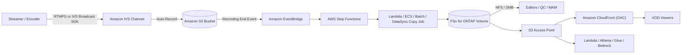

# Amazon IVS Live-to-FSx for ONTAP VOD Publishing Pattern

🌐 **Language / Idioma**: [日本語](README.md) | [English](README.en.md) | [한국어](README.ko.md) | [简体中文](README.zh-CN.md) | [繁體中文](README.zh-TW.md) | [Français](README.fr.md) | [Deutsch](README.de.md) | Español

> Patrón de referencia que combina el streaming en directo de **Amazon Interactive Video Service
> (Amazon IVS)** con **Amazon FSx for NetApp ONTAP** + **Amazon S3 Access Points** para construir
> un espacio de trabajo multimedia posterior al directo y una capa de publicación VOD (vídeo bajo demanda).

## Estado

| Ruta | Estado | Significado |
|------|--------|-------------|
| **Recomendada** | `Supported components` | Amazon IVS graba automáticamente en un bucket S3 estándar compatible; luego el paquete HLS se publica en FSx for ONTAP y se entrega vía S3 Access Point + Amazon CloudFront. Cada componente está documentado y es compatible individualmente. |
| **Experimental** | `Not documented as supported` | Apuntar una IVS Recording Configuration directamente a un alias de S3 Access Point de FSx for ONTAP. **No documentado como compatible por AWS** — validar por separado. Véase [direct-recording-experiment.md](direct-recording-experiment.md). |

> Esta es una **implementación de referencia**. La elección del proveedor de entrega, la gestión de
> derechos, las restricciones geográficas y el cumplimiento los decide el cliente. La validación
> técnica no sustituye la revisión legal, de cumplimiento o de privacidad.

> **TL;DR (30 s)**: conserve la experiencia en directo de IVS; grabe en el **bucket S3 compatible**;
> luego publique el HLS en FSx for ONTAP, edite/QC/apruebe vía NFS/SMB y re-entregue el VOD vía
> S3 Access Point + CloudFront. La grabación directa (IVS→FSx for ONTAP S3 AP) es **Experimental** — solo plan
> de validación.

**Pruébelo ahora (30 s)**: ejecute `make test-media-ivs-vod-publishing` para lanzar las pruebas
unitarias/de propiedades y verificar la validación de Recording End, el límite de ingesta
permission-aware, la validación del manifiesto, la decisión de Human Review y la clasificación de
datos (no se requiere FSx for ONTAP).

## Por qué este patrón

- Amazon IVS ofrece la **experiencia interactiva en directo** (baja latencia).
- Amazon IVS graba automáticamente en un **bucket S3 estándar** (zona de aterrizaje oficialmente compatible).
- **FSx for ONTAP** se convierte en el **espacio de trabajo multimedia post-directo**: edición, QC y aprobación vía **NFS/SMB** sobre los mismos datos.
- **S3 Access Points** expone esos archivos residentes en FSx a servicios AWS (CloudFront, Lambda, Athena, Glue, Amazon Bedrock) vía la API S3.
- **Amazon CloudFront** re-entrega el VOD HLS terminado a los espectadores.

Así, un equipo de medios mantiene una única copia autorizada en FSx for ONTAP (utilizable por
herramientas de archivos y servicios de la API S3) en lugar de copias separadas para edición y entrega.

## Guía Partner/SI

- **Primera pregunta al cliente**: «Tras el directo, ¿la edición/QC/aprobación/archivo necesitan tanto protocolos de archivo (NFS/SMB) como la API S3? ¿La entrega VOD es vía CloudFront?»
- **Entregables PoC**: demo DemoMode → manifiesto de publicación VOD (validación del master manifest + decisión de Human Review) → (opcional) grabación IVS real → publicación FSx → entrega CloudFront.

## Arquitectura (ruta recomendada)



Véase [architecture.es.md](architecture.es.md); fuente del diagrama: [diagrams/architecture.mmd](diagrams/architecture.mmd).

## Reparto de roles

| Capa | Componente | Rol |
|------|------------|-----|
| Directo | Amazon IVS | Experiencia de vídeo interactivo en directo |
| Zona de aterrizaje | Amazon S3 | Destino de grabación oficialmente compatible |
| Espacio multimedia | FSx for ONTAP | Edición / QC / aprobación / archivo / fuente VOD post-directo |
| Acceso API S3 | S3 Access Points | Acceso API S3 a archivos residentes en FSx |
| Entrega | Amazon CloudFront | Entrega VOD pública/controlada (OAC + SigV4) |

## Componentes clave

| Componente | Rol |
|---|---|
| `functions/publish/handler.py` | Disparado por IVS Recording End; ingiere el paquete HLS a FSx for ONTAP (S3 AP), valida el master manifest y escribe un manifiesto de publicación VOD con una decisión de Human Review |
| `functions/moderation/handler.py` (opcional) | Lambda async start/collect de moderación estricta (video/audio/subtítulos) (`EnableStrictModeration=true`) |
| `functions/transcode/handler.py` (opcional) | Lambda async start/collect HLS→MP4 (MediaConvert); produce el MP4 de entrada para la moderación de video (`EnableStrictModeration=true`) |
| `template.yaml` | Plantilla SAM (EventBridge / Scheduler / Step Functions / Lambda / CloudFront opcional) |
| Step Functions | Publish → notificación SNS |
| CloudFront (opcional) | Entrega VOD desde el origen S3 Access Point (OAC + SigV4) |

## Parámetros

| Parámetro | Descripción | Predet. |
|---|---|---|
| `RecordingSourceBucket` | Bucket S3 estándar (o alias AP) destino del auto-grabado IVS | — |
| `S3AccessPointOutputAlias` | Alias S3 AP para escribir en FSx for ONTAP (Internet-origin) | — |
| `MasterManifestName` | Nombre de archivo del master manifest (validación) | `master.m3u8` |
| `TriggerMode` | `POLLING`/`EVENT_DRIVEN`/`HYBRID` | `EVENT_DRIVEN` |
| `SourcePrefixRoot` | Prefijo de grabación IVS escaneado en modo POLLING | `ivs/v1/` |
| `DemoMode` | Omitir copia real, solo registrar (validar sin FSx) | `true` |
| `DataClassification` | Clasificación de datos de salida (VOD normalmente PUBLIC) | `PUBLIC` |
| `HumanReviewAutoApproveThreshold` | Umbral de confianza para auto-publicación | `0.85` |
| `HumanReviewRejectThreshold` | Umbral de confianza para auto-rechazo | `0.30` |
| `EnableModeration` | Moderación de contenido de miniaturas por Rekognition (opt-in) | `false` |
| `ModerationMinConfidence` | Confianza mínima para etiquetas de moderación | `80` |
| `ModerationMaxImages` | Máx. miniaturas a moderar (control de costos) | `5` |
| `EnableStrictModeration` | Lambda de moderación estricta de video/audio/subtítulos (opt-in, async) | `false` |
| `ModerationToxicityThreshold` | Umbral de toxicidad de Comprehend (0-1) | `0.5` |
| `MediaModerationLanguage` | Código de idioma Comprehend / Transcribe | `en` |
| `MediaConvertRoleArn` | ARN del rol de ejecución de MediaConvert para HLS→MP4 (moderación de video) | — |
| `EnableCloudFront` | Habilitar entrega CloudFront | `false` |
| `NotificationEmail` | Destinatario de notificaciones SNS | — |
| `ScheduleExpression` | Expresión Scheduler (POLLING / HYBRID) | `rate(1 hour)` |
| `EnableCloudWatchAlarms` | Habilitar alarmas Lambda/SFN | `false` |
| `EnableXRayTracing` | Rastreo X-Ray | `true` |
| `LogRetentionInDays` | Retención de CloudWatch Logs | `90` |

## Despliegue

```bash
sam build --template solutions/edge/media-ivs-vod-publishing/template.yaml
sam deploy --guided \
  --template solutions/edge/media-ivs-vod-publishing/template.yaml \
  --stack-name fsxn-media-ivs-vod-publishing
```

Para la verificación DemoMode, véase [docs/demo-guide.md](docs/demo-guide.md).

## Human Review (aprobación humana antes de publicar)

La publicación VOD no depende solo de la automatización. Se calcula una confianza de
«publish-readiness» a partir de **señales de completitud del paquete** y se evalúa con los umbrales
de `shared/human_review.py`.

| Decisión | Condición (predet.) | Comportamiento |
|----------|---------------------|----------------|
| `AUTO_APPROVE` | confianza ≥ 0,85 (master manifest + segmentos presentes) | Registrar el manifiesto de publicación tal cual |
| `HUMAN_REVIEW` | 0,30 ≤ confianza < 0,85 (manifiesto presente pero faltan segmentos, etc.) | Notificar con `[REVIEW REQUIRED]`, revisión humana |
| `REJECT` | confianza < 0,30 (falta master manifest, etc.) | Notificar `[ESCALATION]`, no publicar |

> La confianza **no** es una puntuación de modelo de IA — es una **heurística de completitud del paquete**.
> Las personas (Data Owner / Approver) toman la decisión final de publicación.

## Moderación de contenido (opt-in)

Como **puerta de publicación independiente de la verificación de completitud**, puede activar en opt-in la
moderación de contenido de Amazon Rekognition (desactivada por defecto; la ruta recomendada y el DemoMode no cambian).

- Con `EnableModeration=true` (no DemoMode), el handler ejecuta `DetectModerationLabels` sobre las miniaturas
  de la grabación (hasta `ModerationMaxImages`).
- Si se encuentra una etiqueta por encima de `ModerationMinConfidence` (por defecto 80), la **publicación se
  bloquea** (`blocked_by_moderation`) y se enruta a revisión humana. El resultado `moderation` se registra en el manifiesto.
- Es un **muestreo de miniaturas**, no una cobertura de contenido completa.
- Funciona independientemente de la heurística de completitud (Human Review): "el paquete está completo" ≠ "el contenido está aprobado".

### Moderación estricta (video/audio/subtítulos, opt-in, async)

Para una cobertura más estricta que el muestreo de miniaturas, un componente asíncrono modera video, audio y
subtítulos (`EnableStrictModeration=true` crea `functions/moderation/handler.py`).

- **Video**: Amazon Rekognition `StartContentModeration` / `GetContentModeration` (async). Entrada: un único
  archivo de video en S3 (p. ej. un MP4 producido desde el HLS por MediaConvert, referenciado por `video_key`).
- **Audio**: transcripción de Amazon Transcribe → Amazon Comprehend `DetectToxicContent` para lenguaje tóxico.
- **Subtítulos**: subtítulos del paquete (`.vtt` / `.srt`) verificados de forma síncrona vía Comprehend.
- **Transcodificación HLS→MP4**: la moderación de video necesita un único MP4, por lo que
  `functions/transcode/handler.py` (AWS Elemental MediaConvert, start/collect) convierte primero el HLS a MP4
  (`MediaConvertRoleArn` requerido).
- Funciona en **dos fases (start / collect)**, pensado para ser orquestado por Step Functions
  `transcode → moderation start → Wait → collect (sondeo) → gate`
  (ejemplo: [samples/strict-moderation.asl.json](samples/strict-moderation.asl.json), transcode→moderation de extremo a extremo).
  Si algo alcanza el umbral, `decision=BLOCK` bloquea la publicación y la enruta a revisión humana.
- Umbrales: `ModerationMinConfidence` (video) / `ModerationToxicityThreshold` (audio y subtítulos, 0-1).

> Restricciones: la moderación de video no puede apuntar a los segmentos HLS directamente, por lo que necesita
> un único MP4 — este patrón incluye la conversión HLS→MP4 vía `functions/transcode/` (MediaConvert; requiere un
> rol de ejecución de MediaConvert). MediaConvert/Transcribe/Comprehend/Rekognition async incurren en costo y
> latencia. Es una señal asistiva — las personas (Data Owner / Approver) toman la decisión final de publicación.

## Clasificación de datos

- Los artefactos de entrega VOD suelen ser **PUBLIC** (`DataClassification=PUBLIC`). El manifiesto de
  publicación lleva `data_classification` / `data_classification_label`.
- El material no publicable (no aprobado, geo-restringido, derechos no procesados) no debe ingerirse/publicarse.

## Success Metrics (perspectiva PoC Go/No-Go)

| Categoría | Métrica | Referencia |
|---|---|---|
| Business Outcome | Evitar duplicar medios edición vs entrega | Copia FSx única para ambos |
| Technical KPI | Tasa de éxito de publicación | SUCCEEDED en DemoMode |
| Quality KPI | Validación del master manifest | Confirmar master manifest antes de publicar |
| Cost KPI | Impacto en ancho de banda de lectura FSx | Los fetches de origen no saturan la edición (P95/P99) |
| Go/No-Go | Grabación directa (IVS→FSx for ONTAP S3 AP) | Juzgado por validación en hardware (Experimental salvo documentación de AWS) |

## Matriz de validación (resumen)

| Punto de integración | Estado |
|----------------------|--------|
| Auto-grabado IVS a bucket S3 estándar | Supported |
| IVS RecordingConfiguration + alias FSx for ONTAP S3 AP | Experimental / Unknown |
| S3 → FSx vía NFS/SMB | Supported |
| S3 → FSx vía S3 AP `PutObject` | Supported (límites de tamaño/API) |
| FSx for ONTAP S3 AP → CloudFront | Supported (tutorial documentado) |
| FSx for ONTAP S3 AP → Lambda | Supported |
| FSx for ONTAP S3 AP → Athena / Glue / Bedrock | Supported |

Detalles completos en [validation-matrix.md](validation-matrix.md).

## Documentos

| Documento | Propósito |
|-----------|-----------|
| [architecture.es.md](architecture.es.md) | Principios de diseño, flujo de datos, red |
| [validation-matrix.md](validation-matrix.md) | Estado de soporte de cada punto de integración |
| [direct-recording-experiment.md](direct-recording-experiment.md) | Plan de validación de la grabación directa |
| [supported-path-ivs-s3-fsx-cloudfront.md](supported-path-ivs-s3-fsx-cloudfront.md) | Notas de implementación de la ruta recomendada |
| [docs/demo-guide.md](docs/demo-guide.md) | Pasos de verificación DemoMode |
| [samples/](samples/) | Evento EventBridge, ASL de Step Functions, fragmento Lambda, política AP, notas CloudFront |
| [scripts/](scripts/) | CLI de creación/validación/sincronización de la config de grabación |
| [support-request/](support-request/) | Plantillas de solicitud de mejora para AWS (JA / EN) |

## Seguridad / Gobernanza

- **Límite de ingesta permission-aware**: la ingesta se limita al prefijo de grabación configurado. La entrega
  pública no aplica los permisos de archivos ONTAP; por tanto, el límite se asegura con la regla «publicar solo
  lo aprobado» y el bloqueo del origen CloudFront.
- **Autenticación de espectadores**: FSx for ONTAP S3 AP **no** admite URL prefirmadas de S3 — use URL/cookies
  firmadas nativas de CloudFront.
- **Residencia de datos**: el canal IVS, la Recording Configuration y la ubicación S3 deben estar en la **misma
  región**. CloudFront es global; excluya datos que no puedan entregarse fuera de una región, o aplique la
  restricción geográfica de CloudFront.
- **Mínimo privilegio**: la Lambda Publish solo tiene las Actions necesarias sobre el S3 de origen (lectura) y el
  S3 AP de salida (escritura). Se ejecuta **fuera de la VPC** para el acceso S3 AP Internet-origin.
- Las señales de IA/automatizadas son **de apoyo**; las personas (Data Owner / Approver) deciden la publicación.

> **Governance Note**: la entrega no aplica los permisos de archivos ONTAP. El límite se asegura limitando el
> alcance de la ingesta, las operaciones de aprobación, la Human Review y el control de acceso al origen
> CloudFront. La validación técnica no sustituye la revisión legal, de cumplimiento y de privacidad.

## Restricciones del scaffold (explícitas)

- Este scaffold apunta a **EVENT_DRIVEN** (IVS Recording End → EventBridge → Step Functions). `POLLING` escanea
  bajo `SourcePrefixRoot`; `HYBRID` define ambos, pero **la idempotencia no está implementada**. Para
  deduplicación, integre `shared/idempotency_checker.py`.
- `functions/publish/handler.py` implementa la ingesta con selección automática por tamaño: `PutObject` para
  objetos pequeños, **multipart en streaming** (`streaming_download` + `multipart_upload`, baja memoria) para
  los grandes (por defecto > 100MB). Los objetos por encima del techo de ingesta de Lambda (por defecto 20GB)
  se omiten — prefiera DataSync o ECS/Batch (montaje NFS/SMB).
- La grabación directa es Experimental ([direct-recording-experiment.md](direct-recording-experiment.md)).

## Alcance

- Este patrón se dirige al auto-grabado de **Amazon IVS Low-Latency Streaming** (grabaciones de canal
  bajo `ivs/v1/...`). **IVS Real-Time Streaming (stages)** usa un modelo de grabación distinto y queda
  fuera de alcance (la misma idea «publicar a FSx → entregar vía S3 AP + CloudFront» sigue aplicando).
- Cubre la **entrega/ingesta de HLS ya codificado**. **No** transcodifica, re-empaqueta ni inserta anuncios.

## Alternativas y cómo elegir (neutral)

Elija según el contexto. Los compromisos se enuncian simétricamente (incluida la opción recomendada).
Comparación detallada + diagrama de decisión en [architecture.es.md](architecture.es.md).

| Opción | Apta para | Compromiso / consideración |
|--------|-----------|----------------------------|
| **Este patrón** | La grabación necesita **edición/QC/aprobación NFS/SMB** *y* entrega/análisis S3-API sobre la misma copia | Añade un salto de ingesta (S3→FSx) y una capa operativa; el límite de entrega es operativo, no las ACL de ONTAP |
| **IVS Auto-Record → S3 + CloudFront** (sin FSx) | Live-to-VOD simple sin postproducción por archivos | Sin espacio NFS/SMB unificado |
| **AWS Elemental MediaConvert / MediaPackage / MediaTailor** | Transcodificación / empaquetado JIT / DRM / inserción de anuncios | Más servicios que operar; este patrón no hace ninguno — combinar cuando se necesite |
| **S3 directo + CloudFront** | VOD puro de HLS existente | Sin capa en directo ni flujo de archivos ONTAP |

Son **combinables**, no excluyentes.

## Operación / Runbook (Reliability/Ops)

- **La entrega de EventBridge es de mejor esfuerzo** (eventos ausentes, tardíos o desordenados). En
  producción, prefiera `TriggerMode=HYBRID` (EVENT_DRIVEN por latencia + POLLING de respaldo). Como la
  **idempotencia no está implementada**, integre `shared/idempotency_checker.py` (clave
  `recording_session_id` + `recording_prefix`) antes de habilitar HYBRID.
- **Alarmas**: `EnableCloudWatchAlarms=true` notifica errores de Lambda / fallos de Step Functions vía SNS.
- **Respuesta a incidentes**: ante un fallo de publicación, revise `/aws/lambda/<stack>-publish` y aísle
  la autorización S3 AP (IAM + política AP + identidad ONTAP) de la lectura del bucket de origen. Ante una
  publicación errónea, retire el objeto del origen CloudFront y reejecute tras corregir. Véase el
  [playbook de respuesta a incidentes](../../docs/incident-response-playbook.md).

## FAQ / conceptos erróneos comunes

- **«¿Puede IVS grabar directamente en un S3 AP de FSx for ONTAP?»** No documentado como compatible →
  tratar como Experimental ([direct-recording-experiment.md](direct-recording-experiment.md)).
- **«¿Un S3 AP es un bucket S3 completo?»** No (sin URL prefirmada / Versioning / Object Lock / Lifecycle /
  Static Website Hosting).
- **«¿Se puede dar una URL prefirmada a los espectadores?»** No → use URL/cookies firmadas de CloudFront.
- **«¿Una puntuación de completitud alta significa que es publicable?»** No — solo comprueba que el paquete
  HLS está completo; la aprobación de contenido es un paso de moderación humana/IA aparte. La moderación
  está **disponible en opt-in** (`EnableModeration=true` ejecuta Rekognition y bloquea la publicación si se marca).

## Performance Considerations

- El rendimiento aprovisionado de FSx for ONTAP se **comparte** entre NFS/SMB/S3AP. Los fetches de origen VOD
  desde CloudFront pueden competir con el tráfico de edición/QC — dimensione por **latencia P95/P99** y use TTL
  altos de CloudFront / Origin Shield para reducir los fetches de origen.
- Playlist (`.m3u8`): TTL corto; segmentos (`.ts` / `.m4s`): TTL largo.
- Para aislar las lecturas de entrega, considere un volumen **FlexCache** (nativo de ONTAP) como fuente de origen CloudFront.
- **Un S3 AP no es un bucket S3 completo** — es un límite de acceso compatible con S3. No presuponga funciones a
  nivel de bucket (URL prefirmada, Versioning, Object Lock, Lifecycle, Static Website Hosting).
  Véase [../../docs/s3ap-compatibility-notes.md](../../docs/s3ap-compatibility-notes.md).

## Referencias (documentación oficial de AWS)

- [IVS Auto-Record to Amazon S3 (Low-Latency Streaming)](https://docs.aws.amazon.com/ivs/latest/LowLatencyUserGuide/record-to-s3.html)
- [IVS CreateRecordingConfiguration API](https://docs.aws.amazon.com/ivs/latest/LowLatencyAPIReference/API_CreateRecordingConfiguration.html)
- [Using Amazon EventBridge with IVS Low-Latency Streaming](https://docs.aws.amazon.com/ivs/latest/LowLatencyUserGuide/eventbridge.html)
- [AWS::IVS::RecordingConfiguration (CloudFormation)](https://docs.aws.amazon.com/AWSCloudFormation/latest/TemplateReference/aws-resource-ivs-recordingconfiguration.html)
- [FSx for ONTAP S3 access points](https://docs.aws.amazon.com/fsx/latest/ONTAPGuide/s3-access-points.html)
- [Restricting access to an Amazon S3 origin (CloudFront OAC)](https://docs.aws.amazon.com/AmazonCloudFront/latest/DeveloperGuide/private-content-restricting-access-to-s3.html)

## Documentos relacionados

- [Notas de compatibilidad S3AP](../../docs/s3ap-compatibility-notes.md)
- [Consideraciones de rendimiento S3AP](../../docs/s3ap-performance-considerations.md)
- [Calculadora de costos](../../docs/cost-calculator.md)
- [Comparación de arquitecturas alternativas](../../docs/comparison-alternatives.md)
- [Playbook de respuesta a incidentes](../../docs/incident-response-playbook.md)
- [Patrón Content Edge Delivery](../content-delivery/README.md)
- [Patrón de industria Media/VFX](../../industry/media-vfx/README.md)
