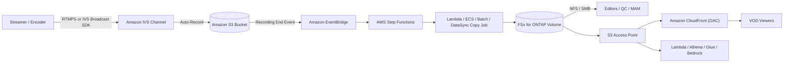

# Amazon IVS Live-to-FSx for ONTAP VOD Publishing Pattern

🌐 **Language / Langue**: [日本語](README.md) | [English](README.en.md) | [한국어](README.ko.md) | [简体中文](README.zh-CN.md) | [繁體中文](README.zh-TW.md) | Français | [Deutsch](README.de.md) | [Español](README.es.md)

> Modèle de référence combinant le streaming en direct **Amazon Interactive Video Service
> (Amazon IVS)** avec **Amazon FSx for NetApp ONTAP** + **Amazon S3 Access Points** pour bâtir
> un espace de travail média post-live et une couche de publication VOD (vidéo à la demande).

## Statut

| Chemin | Statut | Signification |
|--------|--------|---------------|
| **Recommandé** | `Supported components` | Amazon IVS enregistre automatiquement vers un bucket S3 standard pris en charge, puis le paquet HLS est publié vers FSx for ONTAP et diffusé via S3 Access Point + Amazon CloudFront. Chaque composant est documenté et pris en charge individuellement. |
| **Expérimental** | `Not documented as supported` | Pointer une IVS Recording Configuration directement vers un alias S3 Access Point FSx for ONTAP. **Non documenté comme pris en charge par AWS** — à valider séparément. Voir [direct-recording-experiment.md](direct-recording-experiment.md). |

> Ceci est une **implémentation de référence**. Le choix du fournisseur de diffusion, la gestion
> des droits, les restrictions géographiques et la conformité relèvent de l'organisation utilisatrice. La validation
> technique ne remplace pas l'examen juridique, de conformité ou de confidentialité.

> **TL;DR (30 s)** : conservez l'expérience live IVS ; enregistrez vers le **bucket S3 pris en
> charge** ; publiez ensuite le HLS vers FSx for ONTAP, éditez/QC/approuvez via NFS/SMB, puis
> rediffusez la VOD via S3 Access Point + CloudFront. L'enregistrement direct (IVS→FSx for ONTAP S3 AP) est
> **Expérimental** — plan de validation uniquement.

**Essayez maintenant (30 s)** : exécutez `make test-media-ivs-vod-publishing` pour lancer les tests
unitaires/de propriétés et vérifier la validation Recording End, la limite d'ingestion
permission-aware, la validation du manifeste, la décision Human Review et la classification des
données (FSx for ONTAP non requis).

## Pourquoi ce modèle

- Amazon IVS assure l'**expérience interactive en direct** (faible latence).
- Amazon IVS enregistre automatiquement vers un **bucket S3 standard** (zone d'atterrissage officielle).
- **FSx for ONTAP** devient l'**espace de travail média post-live** : édition, QC et approbation via **NFS/SMB** sur les mêmes données.
- **S3 Access Points** expose ces fichiers résidant sur FSx aux services AWS (CloudFront, Lambda, Athena, Glue, Amazon Bedrock) via l'API S3.
- **Amazon CloudFront** rediffuse la VOD HLS finie aux spectateurs.

Une équipe média conserve ainsi une seule copie faisant autorité sur FSx for ONTAP (utilisable par
les outils fichiers et les services API S3) au lieu de copies séparées pour l'édition et la diffusion.

## Guide Partner/SI

- **Première question à clarifier** : « Après le live, l'édition/QC/approbation/archivage nécessitent-ils à la fois des protocoles fichiers (NFS/SMB) et l'API S3 ? La diffusion VOD passe-t-elle par CloudFront ? »
- **Livrables PoC** : démo DemoMode → manifeste de publication VOD (validation master manifest + décision Human Review) → (optionnel) enregistrement IVS réel → publication FSx → diffusion CloudFront.

## Architecture (chemin recommandé)



Voir [architecture.fr.md](architecture.fr.md) ; source du diagramme : [diagrams/architecture.mmd](diagrams/architecture.mmd).

## Répartition des rôles

| Couche | Composant | Rôle |
|--------|-----------|------|
| Live | Amazon IVS | Expérience vidéo interactive en direct |
| Zone d'atterrissage | Amazon S3 | Destination d'enregistrement officiellement prise en charge |
| Espace média | FSx for ONTAP | Édition / QC / approbation / archivage / source VOD post-live |
| Accès API S3 | S3 Access Points | Accès API S3 aux fichiers résidant sur FSx |
| Diffusion | Amazon CloudFront | Diffusion VOD publique/contrôlée (OAC + SigV4) |

## Composants clés

| Composant | Rôle |
|---|---|
| `functions/publish/handler.py` | Déclenché par IVS Recording End ; ingère le paquet HLS vers FSx for ONTAP (S3 AP), valide le master manifest et écrit un manifeste de publication VOD avec une décision Human Review |
| `functions/moderation/handler.py` (optionnel) | Lambda async start/collect de modération stricte (vidéo/audio/sous-titres) (`EnableStrictModeration=true`) |
| `functions/transcode/handler.py` (optionnel) | Lambda async start/collect HLS→MP4 (MediaConvert) ; produit le MP4 d'entrée pour la modération vidéo (`EnableStrictModeration=true`) |
| `template.yaml` | Modèle SAM (EventBridge / Scheduler / Step Functions / Lambda / CloudFront optionnel) |
| Step Functions | Publish → notification SNS |
| CloudFront (optionnel) | Diffusion VOD depuis l'origine S3 Access Point (OAC + SigV4) |

## Paramètres

| Paramètre | Description | Défaut |
|---|---|---|
| `RecordingSourceBucket` | Bucket S3 standard (ou alias AP) ciblé par l'auto-enregistrement IVS | — |
| `S3AccessPointOutputAlias` | Alias S3 AP pour l'écriture vers FSx for ONTAP (Internet-origin) | — |
| `MasterManifestName` | Nom de fichier du master manifest (validation) | `master.m3u8` |
| `TriggerMode` | `POLLING`/`EVENT_DRIVEN`/`HYBRID` | `EVENT_DRIVEN` |
| `SourcePrefixRoot` | Préfixe d'enregistrement IVS scanné en mode POLLING | `ivs/v1/` |
| `DemoMode` | Ignorer la copie réelle, enregistrer seulement (valider sans FSx) | `true` |
| `DataClassification` | Classification des données de sortie (VOD généralement PUBLIC) | `PUBLIC` |
| `HumanReviewAutoApproveThreshold` | Seuil de confiance d'auto-publication | `0.85` |
| `HumanReviewRejectThreshold` | Seuil de confiance de rejet automatique | `0.30` |
| `EnableModeration` | Modération de contenu des vignettes par Rekognition (opt-in) | `false` |
| `ModerationMinConfidence` | Confiance minimale pour les libellés de modération | `80` |
| `ModerationMaxImages` | Nombre max de vignettes à modérer (contrôle des coûts) | `5` |
| `EnableStrictModeration` | Lambda de modération stricte vidéo/audio/sous-titres (opt-in, async) | `false` |
| `ModerationToxicityThreshold` | Seuil de toxicité Comprehend (0-1) | `0.5` |
| `MediaModerationLanguage` | Code langue Comprehend / Transcribe | `en` |
| `MediaConvertRoleArn` | ARN du rôle d'exécution MediaConvert pour HLS→MP4 (modération vidéo) | — |
| `EnableCloudFront` | Activer la diffusion CloudFront | `false` |
| `NotificationEmail` | Destinataire des notifications SNS | — |
| `ScheduleExpression` | Expression Scheduler (POLLING / HYBRID) | `rate(1 hour)` |
| `EnableCloudWatchAlarms` | Activer les alarmes Lambda/SFN | `false` |
| `EnableXRayTracing` | Traçage X-Ray | `true` |
| `LogRetentionInDays` | Rétention CloudWatch Logs | `90` |

## Déploiement

```bash
sam build --template solutions/edge/media-ivs-vod-publishing/template.yaml
sam deploy --guided \
  --template solutions/edge/media-ivs-vod-publishing/template.yaml \
  --stack-name fsxn-media-ivs-vod-publishing
```

Pour la vérification DemoMode, voir [docs/demo-guide.md](docs/demo-guide.md).

## Human Review (approbation humaine avant publication)

La publication VOD ne repose pas uniquement sur l'automatisation. Une confiance de « publish-readiness »
est calculée à partir de **signaux de complétude du paquet** et évaluée par les seuils de
`shared/human_review.py`.

| Décision | Condition (défaut) | Comportement |
|----------|--------------------|--------------|
| `AUTO_APPROVE` | confiance ≥ 0,85 (master manifest + segments présents) | Enregistrer le manifeste de publication tel quel |
| `HUMAN_REVIEW` | 0,30 ≤ confiance < 0,85 (manifeste présent mais segments manquants, etc.) | Notifier avec `[REVIEW REQUIRED]`, contrôle humain |
| `REJECT` | confiance < 0,30 (master manifest manquant, etc.) | Notifier `[ESCALATION]`, ne pas publier |

> La confiance n'est **pas** un score de modèle IA — c'est une **heuristique de complétude du paquet**.
> Les humains (Data Owner / Approver) prennent la décision finale de publication.

## Modération de contenu (opt-in)

En tant que **porte de publication indépendante de la vérification de complétude**, vous pouvez activer en
opt-in la modération de contenu Amazon Rekognition (désactivée par défaut ; le chemin recommandé et le
DemoMode restent inchangés).

- Avec `EnableModeration=true` (hors DemoMode), le handler exécute `DetectModerationLabels` sur les vignettes
  de l'enregistrement (jusqu'à `ModerationMaxImages`).
- Si un libellé au-dessus de `ModerationMinConfidence` (défaut 80) est trouvé, la **publication est bloquée**
  (`blocked_by_moderation`) et routée vers une revue humaine. Le résultat `moderation` est consigné dans le manifeste.
- C'est un **échantillonnage de vignettes**, pas une couverture de contenu complète.
- Indépendant de l'heuristique de complétude (Human Review) : « le paquet est complet » ≠ « le contenu est validé ».

### Modération stricte (vidéo/audio/sous-titres, opt-in, async)

Pour une couverture plus stricte que l'échantillonnage de vignettes, un composant asynchrone modère la
vidéo, l'audio et les sous-titres (`EnableStrictModeration=true` crée `functions/moderation/handler.py`).

- **Vidéo** : Amazon Rekognition `StartContentModeration` / `GetContentModeration` (async). Entrée : un
  fichier vidéo unique dans S3 (p. ex. un MP4 produit depuis le HLS par MediaConvert, référencé par `video_key`).
- **Audio** : transcription Amazon Transcribe → Amazon Comprehend `DetectToxicContent` pour le langage toxique.
- **Sous-titres** : sous-titres du paquet (`.vtt` / `.srt`) vérifiés en synchrone via Comprehend.
- **Transcodage HLS→MP4** : la modération vidéo nécessite un MP4 unique, donc `functions/transcode/handler.py`
  (AWS Elemental MediaConvert, start/collect) convertit d'abord le HLS en MP4 (`MediaConvertRoleArn` requis).
- Fonctionne en **deux phases (start / collect)**, prévu pour être piloté par Step Functions
  `transcode → moderation start → Wait → collect (poll) → gate`
  (exemple : [samples/strict-moderation.asl.json](samples/strict-moderation.asl.json), transcode→moderation de bout en bout).
  Si quoi que ce soit atteint le seuil, `decision=BLOCK` bloque la publication et route vers une revue humaine.
- Seuils : `ModerationMinConfidence` (vidéo) / `ModerationToxicityThreshold` (audio & sous-titres, 0-1).

> Contraintes : la modération vidéo ne peut pas cibler les segments HLS directement, il faut donc un MP4
> unique — ce modèle intègre la conversion HLS→MP4 via `functions/transcode/` (MediaConvert ; nécessite un rôle
> d'exécution MediaConvert). MediaConvert/Transcribe/Comprehend/Rekognition async engendrent coût et latence.
> C'est un signal assistif — les humains (Data Owner / Approver) prennent la décision finale de publication.

## Classification des données

- Les artefacts de diffusion VOD sont généralement **PUBLIC** (`DataClassification=PUBLIC`). Le manifeste
  de publication porte `data_classification` / `data_classification_label`.
- Les contenus non publiables (non approuvés, géo-restreints, droits non traités) ne doivent pas être ingérés/publiés.

## Success Metrics (perspective PoC Go/No-Go)

| Catégorie | Métrique | Repère |
|---|---|---|
| Business Outcome | Éviter la duplication média édition vs diffusion | Copie FSx unique pour les deux |
| Technical KPI | Taux de succès de publication | SUCCEEDED en DemoMode |
| Quality KPI | Validation du master manifest | Confirmer le master manifest avant publication |
| Cost KPI | Impact bande passante lecture FSx | Les fetches d'origine ne saturent pas l'édition (P95/P99) |
| Go/No-Go | Enregistrement direct (IVS→FSx for ONTAP S3 AP) | Jugé par validation matérielle (Expérimental sauf documentation AWS) |

## Matrice de validation (résumé)

| Point d'intégration | Statut |
|---------------------|--------|
| Auto-enregistrement IVS vers bucket S3 standard | Supported |
| IVS RecordingConfiguration + alias FSx for ONTAP S3 AP | Experimental / Unknown |
| S3 → FSx via NFS/SMB | Supported |
| S3 → FSx via S3 AP `PutObject` | Supported (contraintes taille/API) |
| FSx for ONTAP S3 AP → CloudFront | Supported (tutoriel documenté) |
| FSx for ONTAP S3 AP → Lambda | Supported |
| FSx for ONTAP S3 AP → Athena / Glue / Bedrock | Supported |

Détails complets dans [validation-matrix.md](validation-matrix.md).

## Documents

| Document | Objet |
|----------|-------|
| [architecture.fr.md](architecture.fr.md) | Principes de conception, flux de données, réseau |
| [validation-matrix.md](validation-matrix.md) | Statut de prise en charge de chaque point d'intégration |
| [direct-recording-experiment.md](direct-recording-experiment.md) | Plan de validation de l'enregistrement direct |
| [supported-path-ivs-s3-fsx-cloudfront.md](supported-path-ivs-s3-fsx-cloudfront.md) | Notes d'implémentation du chemin recommandé |
| [docs/demo-guide.md](docs/demo-guide.md) | Étapes de vérification DemoMode |
| [samples/](samples/) | Événement EventBridge, ASL Step Functions, extrait Lambda, politique AP, notes CloudFront |
| [scripts/](scripts/) | CLI de création/validation/synchronisation de la config d'enregistrement |

## Sécurité / Gouvernance

- **Limite d'ingestion permission-aware** : l'ingestion est limitée au préfixe d'enregistrement configuré.
  La diffusion publique n'applique pas les permissions de fichiers ONTAP ; la limite est donc assurée par la
  règle « publier uniquement l'approuvé » et le verrouillage de l'origine CloudFront.
- **Authentification des spectateurs** : FSx for ONTAP S3 AP ne prend **pas** en charge les URL présignées S3 —
  utilisez les URL/cookies signés natifs de CloudFront.
- **Résidence des données** : le canal IVS, la Recording Configuration et l'emplacement S3 doivent être dans la
  **même région**. CloudFront est global ; excluez les données à ne pas diffuser hors région, ou appliquez la
  restriction géographique CloudFront.
- **Moindre privilège** : la Lambda Publish n'a que les Actions nécessaires sur le S3 source (lecture) et le S3 AP
  de sortie (écriture). Elle s'exécute **hors VPC** pour l'accès S3 AP Internet-origin.
- Les signaux IA/automatisés sont **assistifs** ; les humains (Data Owner / Approver) décident de la publication.

> **Governance Note** : la diffusion n'applique pas les permissions de fichiers ONTAP. La limite est assurée par
> la restriction du périmètre d'ingestion, les opérations d'approbation, la Human Review et le contrôle d'accès à
> l'origine CloudFront. La validation technique ne remplace pas l'examen juridique, de conformité et de confidentialité.

## Contraintes du scaffold (explicites)

- Ce scaffold cible **EVENT_DRIVEN** (IVS Recording End → EventBridge → Step Functions). `POLLING` scanne sous
  `SourcePrefixRoot` ; `HYBRID` définit les deux, mais **l'idempotence n'est pas implémentée**. Pour la
  déduplication, intégrez `shared/idempotency_checker.py`.
- `functions/publish/handler.py` implémente l'ingestion avec sélection automatique selon la taille : `PutObject`
  pour les petits objets, **multipart en streaming** (`streaming_download` + `multipart_upload`, faible mémoire)
  pour les gros (par défaut > 100 Mo). Les objets au-dessus du plafond d'ingestion Lambda (par défaut 20 Go)
  sont ignorés — préférez DataSync ou ECS/Batch (montage NFS/SMB).
- L'enregistrement direct est Expérimental ([direct-recording-experiment.md](direct-recording-experiment.md)).

## Périmètre

- Ce modèle cible l'auto-enregistrement d'**Amazon IVS Low-Latency Streaming** (enregistrements de
  canal sous `ivs/v1/...`). **IVS Real-Time Streaming (stages)** a un modèle d'enregistrement
  différent et est hors périmètre (la même idée « publier vers FSx → diffuser via S3 AP + CloudFront »
  reste applicable).
- Il couvre la **diffusion/ingestion de HLS déjà encodé**. Il ne fait **pas** de transcodage, de
  re-packaging ni d'insertion de publicités.

## Alternatives et comment choisir (neutre)

Choisissez selon le contexte. Les compromis sont énoncés symétriquement (y compris pour l'approche
recommandée). Comparaison détaillée + logigramme dans [architecture.fr.md](architecture.fr.md).

| Option | Convient à | Compromis / considération |
|--------|-----------|---------------------------|
| **Ce modèle** | L'enregistrement nécessite **édition/QC/approbation NFS/SMB** *et* diffusion/analyse S3-API sur la même copie | Ajoute un saut d'ingestion (S3→FSx) et une couche d'exploitation ; la limite de diffusion est opérationnelle, pas les ACL ONTAP |
| **IVS Auto-Record → S3 + CloudFront** (sans FSx) | Live-to-VOD simple sans post-production par fichiers | Pas d'espace NFS/SMB unifié |
| **AWS Elemental MediaConvert / MediaPackage / MediaTailor** | Transcodage / packaging JIT / DRM / insertion de publicités | Plus de services à exploiter ; ce modèle n'en fait aucun — à combiner au besoin |
| **S3 direct + CloudFront** | VOD pur de HLS existant | Pas de niveau live ni de flux de fichiers ONTAP |

Ces options sont **composables**, non exclusives.

## Exploitation / Runbook (Reliability/Ops)

- **La livraison EventBridge est au mieux** (événements manquants, tardifs ou désordonnés). En
  production, préférez `TriggerMode=HYBRID` (EVENT_DRIVEN pour la latence + POLLING de secours).
  L'**idempotence n'étant pas implémentée**, intégrez `shared/idempotency_checker.py` (clé
  `recording_session_id` + `recording_prefix`) avant d'activer HYBRID.
- **Alarmes** : `EnableCloudWatchAlarms=true` notifie les erreurs Lambda / échecs Step Functions via SNS.
- **Réponse aux incidents** : en cas d'échec de publication, consultez `/aws/lambda/<stack>-publish`
  et isolez l'autorisation S3 AP (IAM + politique AP + identité ONTAP) de la lecture du bucket source.
  En cas de mauvaise publication, retirez l'objet de l'origine CloudFront et relancez après correction.
  Voir le [playbook de réponse aux incidents](../../docs/incident-response-playbook.md).

## FAQ / idées reçues

- **« IVS peut-il enregistrer directement dans un S3 AP FSx for ONTAP ? »** Non documenté comme pris
  en charge → à traiter comme Expérimental ([direct-recording-experiment.md](direct-recording-experiment.md)).
- **« Un S3 AP est-il un bucket S3 complet ? »** Non (pas d'URL présignée / Versioning / Object Lock /
  Lifecycle / Static Website Hosting).
- **« Peut-on donner une URL présignée aux spectateurs ? »** Non → utilisez les URL/cookies signés CloudFront.
- **« Un score de complétude élevé signifie-t-il que c'est publiable ? »** Non — cela vérifie seulement
  que le paquet HLS est complet ; la validation du contenu est une étape de modération humaine/IA
  distincte. La modération est **disponible en opt-in** (`EnableModeration=true` exécute Rekognition et
  bloque la publication si signalé).

## Performance Considerations

- Le débit provisionné FSx for ONTAP est **partagé** entre NFS/SMB/S3AP. Les fetches d'origine VOD depuis
  CloudFront peuvent concurrencer le trafic d'édition/QC — dimensionnez sur la **latence P95/P99**, et utilisez
  des TTL CloudFront élevés / Origin Shield pour réduire les fetches d'origine.
- Playlist (`.m3u8`) : TTL court ; segments (`.ts` / `.m4s`) : TTL long.
- Pour isoler les lectures de diffusion, envisagez un volume **FlexCache** (natif ONTAP) comme source d'origine CloudFront.
- **Un S3 AP n'est pas un bucket S3 complet** — c'est une limite d'accès compatible S3. Ne présumez pas des
  fonctions au niveau bucket (URL présignée, Versioning, Object Lock, Lifecycle, Static Website Hosting).
  Voir [../../docs/s3ap-compatibility-notes.md](../../docs/s3ap-compatibility-notes.md).

## Références (documentation officielle AWS)

- [IVS Auto-Record to Amazon S3 (Low-Latency Streaming)](https://docs.aws.amazon.com/ivs/latest/LowLatencyUserGuide/record-to-s3.html)
- [IVS CreateRecordingConfiguration API](https://docs.aws.amazon.com/ivs/latest/LowLatencyAPIReference/API_CreateRecordingConfiguration.html)
- [Using Amazon EventBridge with IVS Low-Latency Streaming](https://docs.aws.amazon.com/ivs/latest/LowLatencyUserGuide/eventbridge.html)
- [AWS::IVS::RecordingConfiguration (CloudFormation)](https://docs.aws.amazon.com/AWSCloudFormation/latest/TemplateReference/aws-resource-ivs-recordingconfiguration.html)
- [FSx for ONTAP S3 access points](https://docs.aws.amazon.com/fsx/latest/ONTAPGuide/s3-access-points.html)
- [Restricting access to an Amazon S3 origin (CloudFront OAC)](https://docs.aws.amazon.com/AmazonCloudFront/latest/DeveloperGuide/private-content-restricting-access-to-s3.html)

## Documents associés

- [Notes de compatibilité S3AP](../../docs/s3ap-compatibility-notes.md)
- [Considérations de performance S3AP](../../docs/s3ap-performance-considerations.md)
- [Calculateur de coûts](../../docs/cost-calculator.md)
- [Comparaison d'architectures alternatives](../../docs/comparison-alternatives.md)
- [Playbook de réponse aux incidents](../../docs/incident-response-playbook.md)
- [Modèle Content Edge Delivery](../content-delivery/README.md)
- [Modèle secteur Media/VFX](../../industry/media-vfx/README.md)
