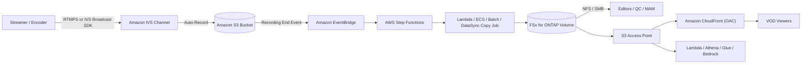

# Amazon IVS Live-to-FSx for ONTAP VOD Publishing Pattern

🌐 **Language / 언어**: [日本語](README.md) | [English](README.en.md) | 한국어 | [简体中文](README.zh-CN.md) | [繁體中文](README.zh-TW.md) | [Français](README.fr.md) | [Deutsch](README.de.md) | [Español](README.es.md)

> **Amazon Interactive Video Service(Amazon IVS)** 라이브 스트리밍과 **Amazon FSx for
> NetApp ONTAP** + **Amazon S3 Access Points** 를 결합하여, 라이브 이후의 미디어 워크스페이스와
> VOD(video-on-demand) 게시 계층을 구축하는 참조 패턴입니다.

## 상태

| 경로 | 상태 | 의미 |
|------|------|------|
| **권장(Recommended)** | `Supported components` | Amazon IVS 를 정식 지원되는 표준 S3 버킷에 Auto-Record 한 뒤 HLS 패키지를 FSx for ONTAP 로 게시하고 S3 Access Point + Amazon CloudFront 로 VOD 전달. 각 구성 요소는 개별적으로 문서화·지원됨. |
| **실험(Experimental)** | `Not documented as supported` | IVS Recording Configuration 의 출력 대상으로 FSx for ONTAP S3 Access Point alias 를 직접 지정하는 구성. **AWS 공식 문서에서 지원으로 명시되지 않음** — 별도 검증 필요. [direct-recording-experiment.md](direct-recording-experiment.md) 참조. |

> 본 패턴은 **참조 구현**입니다. 전달 벤더 선택, 권리 처리, 지역 제한, 컴플라이언스는 이용자·조직이 판단합니다.
> 기술 검증은 법무·컴플라이언스·개인정보 평가를 대체하지 않습니다.

> **TL;DR (30초)**: IVS 라이브 경험은 그대로 활용하고, 녹화는 **지원되는 S3 버킷**으로. 이후 HLS 를
> FSx for ONTAP 에 게시하여 NFS/SMB 로 편집·QC·승인하고, S3 Access Point + CloudFront 로 VOD 재전달.
> 직접 녹화(IVS→FSx for ONTAP S3 AP)는 **Experimental** — 검증 계획만 제공.

**지금 시도(30초)**: `make test-media-ivs-vod-publishing` 로 단위/속성 테스트를 실행하여 Recording End
검증, permission-aware 수집 경계, 매니페스트 검증, Human Review 판정, 데이터 분류를 확인할 수 있습니다
(FSx for ONTAP 불필요).

## 왜 이 패턴인가

- Amazon IVS 가 **라이브 인터랙티브 경험**(저지연 스트리밍)을 제공.
- Amazon IVS 는 **표준 S3 버킷**(정식 지원 녹화 랜딩 존)에 Auto-Record.
- **FSx for ONTAP** 를 **라이브 이후 미디어 워크스페이스**로 사용. 편집·QC·승인을 동일 데이터에서 **NFS/SMB** 로 수행.
- **S3 Access Point** 를 통해 FSx 상의 파일을 AWS 서비스(CloudFront, Lambda, Athena, Glue, Amazon Bedrock)에 S3 API 로 노출.
- **Amazon CloudFront** 로 완성된 HLS VOD 를 시청자에게 재전달.

편집용과 전달용으로 미디어를 이중 보관하지 않고 FSx for ONTAP 에 단일 정본을 두어(파일 프로토콜 도구와
S3 API 서비스 모두 사용 가능) 운영합니다.

## Partner/SI 가이드

- **첫 확인 질문**: "라이브 이후 편집·QC·승인·아카이브에 파일(NFS/SMB)과 S3 API 가 모두 필요한가? VOD 전달은 CloudFront 인가?"
- **PoC 산출물**: DemoMode 데모 → VOD publish 매니페스트(master manifest 검증 + Human Review 판정) → (선택) 실제 IVS 녹화 → FSx 게시 → CloudFront 전달.

## 아키텍처(권장 경로)



자세한 내용은 [architecture.ko.md](architecture.ko.md), 다이어그램 소스는 [diagrams/architecture.mmd](diagrams/architecture.mmd) 참조.

## 역할 분담

| 계층 | 구성 요소 | 역할 |
|------|-----------|------|
| 라이브 | Amazon IVS | 라이브 인터랙티브 비디오 경험 |
| 랜딩 존 | Amazon S3 | 정식 지원 녹화 대상 |
| 미디어 워크스페이스 | FSx for ONTAP | 라이브 이후 편집 / QC / 승인 / 아카이브 / VOD 소스 |
| S3 API 액세스 | S3 Access Points | FSx 상 파일에 대한 S3 API 액세스 |
| 전달 | Amazon CloudFront | 공개/제어된 VOD 전달(OAC + SigV4) |

## 주요 구성 요소

| 구성 요소 | 역할 |
|---|---|
| `functions/publish/handler.py` | IVS Recording End 을 기점으로 HLS 패키지를 FSx for ONTAP(S3 AP)로 수집하고 master manifest 를 검증하며 Human Review 판정이 포함된 VOD publish 매니페스트를 기록 |
| `functions/moderation/handler.py`(선택) | 엄격 모더레이션(동영상/음성/자막) 비동기 start/collect Lambda(`EnableStrictModeration=true`) |
| `functions/transcode/handler.py`(선택) | HLS→MP4 변환(MediaConvert) 비동기 start/collect Lambda. 동영상 모더레이션 입력 MP4 생성(`EnableStrictModeration=true`) |
| `template.yaml` | SAM 템플릿(EventBridge / Scheduler / Step Functions / Lambda / 선택 CloudFront) |
| Step Functions | Publish → SNS 알림 |
| CloudFront(선택) | S3 Access Point 오리진에서 VOD 전달(OAC + SigV4) |

## 파라미터

| 파라미터 | 설명 | 기본값 |
|---|---|---|
| `RecordingSourceBucket` | IVS Auto-Record 대상 표준 S3 버킷(또는 AP alias) | — |
| `S3AccessPointOutputAlias` | FSx for ONTAP 쓰기용 S3 AP Alias(Internet-origin) | — |
| `MasterManifestName` | master manifest 파일명(검증용) | `master.m3u8` |
| `TriggerMode` | `POLLING`/`EVENT_DRIVEN`/`HYBRID` | `EVENT_DRIVEN` |
| `SourcePrefixRoot` | POLLING 시 스캔할 IVS 녹화 프리픽스 | `ivs/v1/` |
| `DemoMode` | 실제 복사 생략, 기록만(FSx 없이 검증) | `true` |
| `DataClassification` | 출력 데이터 분류(VOD 산출물은 보통 PUBLIC) | `PUBLIC` |
| `HumanReviewAutoApproveThreshold` | 자동 게시 confidence 임계값 | `0.85` |
| `HumanReviewRejectThreshold` | 자동 거부 confidence 임계값 | `0.30` |
| `EnableModeration` | Rekognition 썸네일 콘텐츠 모더레이션(opt-in) | `false` |
| `ModerationMinConfidence` | 모더레이션 라벨 채택 최소 confidence | `80` |
| `ModerationMaxImages` | 모더레이션 대상 썸네일 상한(비용 제어) | `5` |
| `EnableStrictModeration` | 동영상/음성/자막 엄격 모더레이션 Lambda(opt-in, 비동기) | `false` |
| `ModerationToxicityThreshold` | Comprehend toxicity 임계값(0-1) | `0.5` |
| `MediaModerationLanguage` | Comprehend / Transcribe 언어 코드 | `en` |
| `MediaConvertRoleArn` | HLS→MP4 변환용 MediaConvert 실행 롤 ARN(동영상 모더레이션 시) | — |
| `EnableCloudFront` | CloudFront 전달 활성화 | `false` |
| `NotificationEmail` | SNS 알림 수신자 | — |
| `ScheduleExpression` | Scheduler 식(POLLING / HYBRID) | `rate(1 hour)` |
| `EnableCloudWatchAlarms` | Lambda/SFN 경보 활성화 | `false` |
| `EnableXRayTracing` | X-Ray 추적 | `true` |
| `LogRetentionInDays` | CloudWatch Logs 보존 일수 | `90` |

## 배포

```bash
sam build --template solutions/edge/media-ivs-vod-publishing/template.yaml
sam deploy --guided \
  --template solutions/edge/media-ivs-vod-publishing/template.yaml \
  --stack-name fsxn-media-ivs-vod-publishing
```

DemoMode 검증은 [docs/demo-guide.md](docs/demo-guide.md) 참조.

## Human Review(게시 전 사람 승인)

VOD 게시는 자동 판정에만 의존하지 않습니다. 패키지 **완전성 신호**로 publish-readiness confidence 를
산출하고 `shared/human_review.py` 임계값으로 판정합니다.

| 판정 | 조건(기본) | 동작 |
|------|-----------|------|
| `AUTO_APPROVE` | confidence ≥ 0.85(master manifest + 세그먼트 존재) | publish 매니페스트를 그대로 기록 |
| `HUMAN_REVIEW` | 0.30 ≤ confidence < 0.85(manifest 있으나 세그먼트 누락 등) | `[REVIEW REQUIRED]` 알림, 사람 확인 |
| `REJECT` | confidence < 0.30(master manifest 누락 등) | `[ESCALATION]` 알림, 게시 안 함 |

> confidence 는 AI 모델 점수가 아니라 **패키지 완전성 휴리스틱**입니다. 게시 최종 결정은 사람(Data
> Owner / Approver)이 합니다.

## 콘텐츠 모더레이션(opt-in)

완전성 검사와 **독립된 게시 가부 게이트**로 Amazon Rekognition 콘텐츠 모더레이션을 옵트인으로 활성화할 수
있습니다(기본 꺼짐. 추천 경로·DemoMode 동작 불변).

- `EnableModeration=true`(비 DemoMode)로 녹화 패키지의 썸네일(최대 `ModerationMaxImages`)에
  `DetectModerationLabels` 를 실행합니다.
- `ModerationMinConfidence`(기본 80) 이상 라벨이 하나라도 나오면 **게시를 차단**(`blocked_by_moderation`)하고
  사람 검토로 라우팅합니다. 게시 매니페스트에 `moderation` 결과를 기록합니다.
- 이는 **썸네일 샘플 검사**이며 전체 콘텐츠 커버리지가 아닙니다.
- 완전성 휴리스틱(Human Review)과 독립적으로 동작합니다. "패키지가 완비됨"과 "공개 승인됨"은 별개입니다.

### 엄격 모더레이션(동영상/음성/자막, opt-in·비동기)

썸네일 동기 검사보다 엄격하게 동영상·음성·자막을 판정하는 비동기 컴포넌트를 별도로 제공합니다
(`EnableStrictModeration=true` 로 `functions/moderation/handler.py` 생성).

- **동영상**: Amazon Rekognition `StartContentModeration` / `GetContentModeration`(비동기). 입력은 S3 상의
  단일 동영상(예: MediaConvert 로 HLS 에서 생성한 MP4. `video_key` 로 지정).
- **음성**: Amazon Transcribe 문자 변환 → Amazon Comprehend `DetectToxicContent` 로 유해 표현 판정.
- **자막**: 녹화 패키지의 자막(`.vtt` / `.srt`)을 Comprehend 로 동기 판정.
- **HLS→MP4 변환**: 동영상 모더레이션은 단일 MP4 가 필요하므로 `functions/transcode/handler.py`
  (AWS Elemental MediaConvert, start/collect)로 HLS 를 MP4 로 변환한 뒤 moderation 에 넘깁니다
  (`MediaConvertRoleArn` 필요).
- **2 페이즈(start / collect)** 로 동작하며 Step Functions
  `transcode → moderation start → Wait → collect(폴링) → gate` 에서 호출하는 것을 상정
  (샘플: [samples/strict-moderation.asl.json](samples/strict-moderation.asl.json), transcode→moderation 일괄).
  임계값 이상이면 `decision=BLOCK` 로 게시를 차단하고 사람 검토로 라우팅합니다.
- 임계값은 `ModerationMinConfidence`(동영상) / `ModerationToxicityThreshold`(음성·자막, 0-1)로 조정.

> 제약: 동영상 모더레이션은 HLS 세그먼트를 직접 대상으로 할 수 없어 단일 MP4 가 필요합니다. 본 패턴은
> `functions/transcode/`(MediaConvert)로 HLS→MP4 변환을 동봉합니다(MediaConvert 실행 롤 필요).
> MediaConvert/Transcribe/Comprehend/Rekognition async 는 비용·시간이 발생합니다. 이는 보조 신호이며
> 게시 최종 가부는 사람(Data Owner / Approver)이 결정합니다.

## 데이터 분류

- VOD 전달 산출물은 보통 **PUBLIC**(`DataClassification=PUBLIC`). publish 매니페스트에 `data_classification`
  / `data_classification_label` 을 포함합니다.
- 공개 불가 소재(미승인, 지역 제한, 권리 미처리)는 애초에 수집·게시 대상에서 제외해야 합니다.

## Success Metrics(PoC Go/No-Go)

| 구분 | 지표 | 기준 |
|---|---|---|
| Business Outcome | 편집/전달 미디어 이중 보관 회피 | FSx 단일 정본을 양쪽 용도로 사용 |
| Technical KPI | publish 성공률 | DemoMode 에서 SUCCEEDED |
| Quality KPI | master manifest 검증 | 게시 전 master manifest 존재 확인 |
| Cost KPI | FSx 읽기 대역 영향 | 전달 오리진 페치가 편집 대역을 압박하지 않음(P95/P99) |
| Go/No-Go | 직접 녹화(IVS→FSx for ONTAP S3 AP) | 실기 검증으로 판정(공식 명시 전까지 Experimental) |

## Validation Matrix(요약)

| 통합 지점 | 상태 |
|-----------|------|
| IVS Auto-Record → 표준 S3 버킷 | Supported |
| IVS RecordingConfiguration + FSx for ONTAP S3 AP alias | Experimental / Unknown |
| S3 → FSx(NFS/SMB) | Supported |
| S3 → FSx(S3 AP `PutObject`) | Supported(크기/API 제약) |
| FSx for ONTAP S3 AP → CloudFront | Supported(공식 튜토리얼 존재) |
| FSx for ONTAP S3 AP → Lambda | Supported |
| FSx for ONTAP S3 AP → Athena / Glue / Bedrock | Supported |

자세한 내용은 [validation-matrix.md](validation-matrix.md) 참조.

## 문서

| 문서 | 목적 |
|------|------|
| [architecture.ko.md](architecture.ko.md) | 설계 원칙, 데이터 흐름, 네트워크 설계 |
| [validation-matrix.md](validation-matrix.md) | 각 통합 지점 지원 상태 |
| [direct-recording-experiment.md](direct-recording-experiment.md) | 직접 녹화 검증 계획 |
| [supported-path-ivs-s3-fsx-cloudfront.md](supported-path-ivs-s3-fsx-cloudfront.md) | 권장 경로 구현 방침 |
| [docs/demo-guide.md](docs/demo-guide.md) | DemoMode 검증 절차 |
| [samples/](samples/) | EventBridge 이벤트, Step Functions ASL, Lambda 스니펫, AP 정책, CloudFront 노트 |
| [scripts/](scripts/) | Recording Config 생성·검증·동기화 CLI |

## 보안 / 거버넌스

- **permission-aware 수집 경계**: 수집은 지정 녹화 프리픽스 하위로 제한. 공개 전달은 ONTAP 파일 권한을
  강제하지 않으므로 경계는 "승인된 것만 게시" 운영과 CloudFront 오리진 잠금으로 보장.
- **시청자 인증**: FSx for ONTAP S3 AP 는 S3 Presigned URL **미지원** — CloudFront 서명 URL/쿠키 사용.
- **데이터 소재지**: IVS 채널·Recording Configuration·S3 위치는 **동일 리전**. CloudFront 는 글로벌이므로
  리전 외 전달 불가 데이터는 제외하거나 지역 제한 적용.
- **최소 권한**: Publish Lambda 는 소스 S3(읽기)와 출력 S3 AP(쓰기)의 필요 Action 만. Internet-origin S3 AP
  접근을 위해 **VPC 외** 실행.
- AI/자동 신호는 **보조적**이며 게시 여부는 사람(Data Owner / Approver)이 결정.

> **Governance Note**: 전달은 ONTAP 파일 권한을 강제하지 않습니다. 경계는 수집 범위 제한, 승인 운영,
> Human Review, CloudFront 오리진 접근 제어로 보장합니다. 기술 검증은 법무·컴플라이언스·개인정보 평가를
> 대체하지 않습니다.

## Scaffold 제약(명시)

- 본 스캐폴드는 **EVENT_DRIVEN**(IVS Recording End → EventBridge → Step Functions)을 주 대상으로 합니다.
  `POLLING` 은 `SourcePrefixRoot` 하위를 스캔, `HYBRID` 는 둘 다 정의하지만 **멱등성 미구현**. 중복 제거가
  필요하면 `shared/idempotency_checker.py` 를 통합.
- `functions/publish/handler.py` 는 크기 기반 자동 선택으로 수집을 구현: 작은 객체는 `PutObject`, 큰 객체
  (기본 100MB 초과)는 **스트리밍 multipart**(`streaming_download` + `multipart_upload`, 저메모리). Lambda 수집
  상한(기본 20GB) 초과는 skip — DataSync 또는 ECS/Batch(NFS/SMB 마운트) 권장.
- 직접 녹화는 Experimental([direct-recording-experiment.md](direct-recording-experiment.md)).

## 스코프

- 본 패턴은 **Amazon IVS Low-Latency Streaming** 의 Auto-Record(`ivs/v1/...` 채널 녹화)를 대상으로 합니다.
  **IVS Real-Time Streaming(stages)** 은 녹화 모델이 달라 대상 외입니다(동일한 "FSx 게시 → S3 AP + CloudFront
  전달" 개념은 적용 가능).
- 이미 인코딩된 **HLS 의 전달/수집**이 대상이며, **트랜스코딩·재패키징·광고 삽입은 하지 않습니다**.

## 대안과 선택 방법(중립)

용도에 따라 선택합니다. 트레이드오프는 권장안을 포함해 대칭으로 기술합니다. 상세 비교/판정 플로차트는
[architecture.ko.md](architecture.ko.md) 참조.

| 선택지 | 적합한 상황 | 트레이드오프 / 고려사항 |
|--------|-----------|----------------------|
| **본 패턴** | 녹화에 **NFS/SMB 편집·QC·승인**이 필요하고 동일 사본으로 S3 API 전달/분석도 수행 | 수집 홉(S3→FSx)과 운영 계층이 증가. 전달 경계는 ONTAP ACL 이 아닌 운영으로 보장 |
| **IVS Auto-Record → S3 + CloudFront**(FSx 없음) | 파일 운영이 불필요한 단순 live-to-VOD | 통합 NFS/SMB 워크스페이스 없음 |
| **AWS Elemental MediaConvert / MediaPackage / MediaTailor** | 트랜스코딩 / JIT 패키징 / DRM / 광고 삽입 | 운영 대상 증가. 본 패턴은 미수행하므로 필요 시 조합 |
| **직접 S3 + CloudFront** | 기존 HLS 의 순수 VOD | 라이브 계층·ONTAP 파일 운영 없음 |

이들은 배타적이지 않고 **조합 가능**합니다.

## 운영 / Runbook(Reliability/Ops)

- **EventBridge 는 베스트에포트 전달**(누락·지연·순서 역전 가능). 프로덕션은 `TriggerMode=HYBRID` 권장
  (EVENT_DRIVEN 저지연 + POLLING 보완). 단 **멱등성 미구현**이므로 HYBRID 에서는
  `shared/idempotency_checker.py`(`recording_session_id` + `recording_prefix` 키)를 통합할 것.
- **경보**: `EnableCloudWatchAlarms=true` 로 Lambda 오류 / Step Functions 실패를 SNS 통지.
- **장애 대응**: publish 실패 시 `/aws/lambda/<stack>-publish` 확인, S3 AP 인가(IAM + AP policy + ONTAP
  identity)와 소스 S3 읽기를 분리. 오배포 시 CloudFront 오리진에서 해당 객체 제거 후 재실행.
  [인시던트 대응 Playbook](../../docs/incident-response-playbook.md) 참조.

## FAQ / 흔한 오해

- **"IVS 녹화를 FSx for ONTAP S3 AP 로 직접?"** 공식 지원 명시 없음 → Experimental 로 검증
  ([direct-recording-experiment.md](direct-recording-experiment.md)).
- **"S3 AP 는 완전한 S3 버킷?"** 아니오(Presigned URL / Versioning / Object Lock / Lifecycle /
  Static Website Hosting 미지원).
- **"시청자에게 Presigned URL?"** 아니오 → CloudFront 서명 URL / 쿠키 사용.
- **"완전성 점수가 높으면 공개해도 되나?"** 아니오. 패키지 완전성 확인일 뿐, 콘텐츠 공개 가부는 별도의
  사람/AI 모더레이션으로 판단. 모더레이션은 **opt-in 으로 내장**(`EnableModeration=true` 로 Rekognition 실행,
  플래그 시 publish 차단).

## Performance Considerations

- FSx for ONTAP 프로비저닝 스루풋은 NFS/SMB/S3AP 에서 **공유**됩니다. VOD 오리진 페치가 편집/QC 트래픽과
  경합할 수 있으므로 평균이 아닌 **P95/P99(tail latency)** 로 사이징하고, 높은 CloudFront TTL / Origin
  Shield 로 오리진 페치를 줄입니다.
- Playlist(`.m3u8`)는 짧은 TTL, Segment(`.ts` / `.m4s`)는 긴 TTL.
- 전달 읽기를 업무 볼륨과 분리하려면 **FlexCache** 볼륨(ONTAP 네이티브)을 CloudFront 오리진 소스로 고려.
- **S3 AP 는 완전한 S3 버킷이 아닙니다** — S3 호환 액세스 경계. 버킷 레벨 기능(Presigned URL, Versioning,
  Object Lock, Lifecycle, Static Website Hosting) 전제 금지. [../../docs/s3ap-compatibility-notes.md](../../docs/s3ap-compatibility-notes.md) 참조.

## 참조(AWS 공식 문서)

- [IVS Auto-Record to Amazon S3 (Low-Latency Streaming)](https://docs.aws.amazon.com/ivs/latest/LowLatencyUserGuide/record-to-s3.html)
- [IVS CreateRecordingConfiguration API](https://docs.aws.amazon.com/ivs/latest/LowLatencyAPIReference/API_CreateRecordingConfiguration.html)
- [Using Amazon EventBridge with IVS Low-Latency Streaming](https://docs.aws.amazon.com/ivs/latest/LowLatencyUserGuide/eventbridge.html)
- [AWS::IVS::RecordingConfiguration (CloudFormation)](https://docs.aws.amazon.com/AWSCloudFormation/latest/TemplateReference/aws-resource-ivs-recordingconfiguration.html)
- [FSx for ONTAP S3 access points](https://docs.aws.amazon.com/fsx/latest/ONTAPGuide/s3-access-points.html)
- [Restricting access to an Amazon S3 origin (CloudFront OAC)](https://docs.aws.amazon.com/AmazonCloudFront/latest/DeveloperGuide/private-content-restricting-access-to-s3.html)

## 관련 문서

- [S3AP 호환성 노트](../../docs/s3ap-compatibility-notes.md)
- [S3AP 성능 고려사항](../../docs/s3ap-performance-considerations.md)
- [비용 계산](../../docs/cost-calculator.md)
- [대체 아키텍처 비교](../../docs/comparison-alternatives.md)
- [인시던트 대응 Playbook](../../docs/incident-response-playbook.md)
- [Content Edge Delivery 패턴](../content-delivery/README.md)
- [Media/VFX 산업 패턴](../../industry/media-vfx/README.md)
