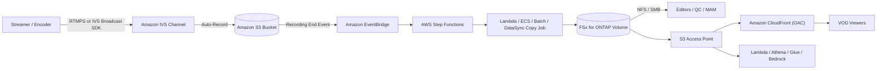

# Amazon IVS Live-to-FSx for ONTAP VOD Publishing Pattern

🌐 **Language / 言語**: [日本語](README.md) | [English](README.en.md) | [한국어](README.ko.md) | [简体中文](README.zh-CN.md) | [繁體中文](README.zh-TW.md) | [Français](README.fr.md) | [Deutsch](README.de.md) | [Español](README.es.md)

> **Amazon Interactive Video Service（Amazon IVS）** のライブ配信と、**Amazon FSx for
> NetApp ONTAP** + **Amazon S3 Access Points** を組み合わせ、ライブ後のメディアワークスペースと
> VOD（video-on-demand）配信基盤を構築するリファレンスパターンです。

## ステータス

| パス | ステータス | 意味 |
|------|-----------|------|
| **推奨（Recommended）** | `Supported components` | Amazon IVS を正式サポートされた標準 S3 バケットに Auto-Record し、その後 HLS パッケージを FSx for ONTAP へ展開、S3 Access Point + Amazon CloudFront で VOD 配信する。各コンポーネントは個別にドキュメント化・サポートされている。 |
| **実験（Experimental）** | `Not documented as supported` | IVS Recording Configuration の出力先に FSx for ONTAP S3 Access Point alias を直接指定する構成。**AWS 公式ドキュメント上でサポートと明記されていない**ため、個別に検証が必要。[direct-recording-experiment.md](direct-recording-experiment.md) を参照。 |

> 本パターンは **リファレンス実装** です。配信ベンダーの選定、権利処理、地域制限、コンプライアンスは
> 顧客が判断します。技術的検証は法務・コンプライアンス・プライバシー評価を代替しません。

> **TL;DR（30秒）**: IVS のライブ体験はそのまま活かし、録画は**正式サポートの S3 バケット**へ。その後
> HLS を FSx for ONTAP に展開し、NFS/SMB で編集・QC・承認しつつ、S3 Access Point + CloudFront で
> VOD 再配信する。直接録画（IVS→FSx for ONTAP S3 AP）は **Experimental** として検証計画のみ提供する。

**今すぐ試す（30秒アクション）**: `make test-media-ivs-vod-publishing` でユニット/プロパティテストを実行し、
Recording End 検証・permission-aware な取り込み境界・マニフェスト検証・Human Review 判定・データ分類の
動作を確認できます（FSx for ONTAP 不要）。

## なぜこのパターンか

- Amazon IVS が **ライブのインタラクティブ体験**（低遅延配信）を実現する。
- Amazon IVS は **標準 S3 バケット**（正式サポートされた録画ランディングゾーン）に Auto-Record する。
- **FSx for ONTAP** を **ライブ後のメディアワークスペース** として使う。編集・QC・承認・メディア運用を
  同一データ上で **NFS/SMB** から行う。
- **S3 Access Point** 経由で、FSx 上のファイルを AWS サービス（CloudFront、Lambda、Athena、Glue、
  Amazon Bedrock）に S3 API で公開する。
- **Amazon CloudFront** で完成した HLS VOD を視聴者へ再配信する。

編集用と配信用でメディアのコピーを二重持ちせず、FSx for ONTAP 上に単一の正となるコピーを置き
（ファイルプロトコルのツールと S3 API サービスの両方から利用可能）、運用できます。

## Partner/SI 利用ガイド

- **最初の顧客質問**: 「ライブ配信後の編集・QC・承認・アーカイブに、ファイル（NFS/SMB）と S3 API の
  両方が要るか。VOD 配信は CloudFront で行うか」
- **PoC 成果物**: DemoMode デモ → VOD publish マニフェスト（master manifest 検証 + Human Review 判定）
  →（任意）実機での IVS 録画 → FSx 展開 → CloudFront 配信。

## アーキテクチャ（推奨パス）



詳細は [architecture.md](architecture.md)、図のソースは
[diagrams/architecture.mmd](diagrams/architecture.mmd) を参照してください。

## 役割分担

| レイヤ | コンポーネント | 役割 |
|--------|--------------|------|
| ライブ | Amazon IVS | ライブのインタラクティブ動画体験 |
| ランディングゾーン | Amazon S3 | 正式サポートされた録画出力先 |
| メディアワークスペース | FSx for ONTAP | ライブ後の編集 / QC / 承認 / アーカイブ / VOD ソース |
| S3 API アクセス | S3 Access Points | FSx 上ファイルへの S3 API アクセス |
| 配信 | Amazon CloudFront | 公開 / 制御された VOD 配信（OAC + SigV4） |

## 主要コンポーネント

| コンポーネント | 役割 |
|---|---|
| `functions/publish/handler.py` | IVS Recording End を起点に、HLS パッケージを FSx for ONTAP（S3 AP）へ取り込み、master manifest を検証し、Human Review 判定付きの VOD publish マニフェストを書き戻す |
| `functions/moderation/handler.py`（任意） | 厳密モデレーション（動画/音声/字幕）の非同期 start/collect Lambda（`EnableStrictModeration=true`） |
| `functions/transcode/handler.py`（任意） | HLS→MP4 変換（MediaConvert）の非同期 start/collect Lambda。動画モデレーションの入力 MP4 を生成（`EnableStrictModeration=true`） |
| `template.yaml` | SAM テンプレート（EventBridge / Scheduler / Step Functions / Lambda / 任意 CloudFront） |
| Step Functions | Publish → SNS 通知 |
| CloudFront（任意） | S3 Access Point オリジンからの VOD 配信（OAC + SigV4） |

## パラメータ

| パラメータ | 説明 | デフォルト |
|---|---|---|
| `RecordingSourceBucket` | IVS Auto-Record 先の標準 S3 バケット名（または AP alias） | — |
| `S3AccessPointOutputAlias` | FSx for ONTAP 書き込み用 S3 AP Alias（Internet-origin） | — |
| `MasterManifestName` | master manifest のファイル名（検証用） | `master.m3u8` |
| `TriggerMode` | `POLLING`/`EVENT_DRIVEN`/`HYBRID` | `EVENT_DRIVEN` |
| `SourcePrefixRoot` | POLLING 時に走査する IVS 録画プレフィックス | `ivs/v1/` |
| `DemoMode` | 実コピーをスキップし記録のみ（FSx 無しで検証） | `true` |
| `DataClassification` | 出力データ分類ラベル（VOD 成果物は原則 PUBLIC） | `PUBLIC` |
| `HumanReviewAutoApproveThreshold` | 自動公開の confidence 閾値 | `0.85` |
| `HumanReviewRejectThreshold` | 自動却下の confidence 閾値 | `0.30` |
| `EnableModeration` | Rekognition によるサムネイルのコンテンツモデレーション（opt-in） | `false` |
| `ModerationMinConfidence` | モデレーションラベル採用の最小 confidence | `80` |
| `ModerationMaxImages` | モデレーション対象サムネイル数の上限（コスト制御） | `5` |
| `EnableStrictModeration` | 動画/音声/字幕の厳密モデレーション Lambda（opt-in、非同期） | `false` |
| `ModerationToxicityThreshold` | Comprehend toxicity しきい値（0-1） | `0.5` |
| `MediaModerationLanguage` | Comprehend / Transcribe 言語コード | `en` |
| `MediaConvertRoleArn` | HLS→MP4 変換用 MediaConvert 実行ロール ARN（動画モデレーション時） | — |
| `EnableCloudFront` | CloudFront 配信を有効化 | `false` |
| `NotificationEmail` | SNS 通知先メールアドレス | — |
| `ScheduleExpression` | Scheduler 式（POLLING / HYBRID 時） | `rate(1 hour)` |
| `EnableCloudWatchAlarms` | Lambda/SFN のアラームを有効化 | `false` |
| `EnableXRayTracing` | X-Ray トレーシング | `true` |
| `LogRetentionInDays` | CloudWatch Logs 保持日数 | `90` |

## デプロイ

```bash
sam build --template solutions/edge/media-ivs-vod-publishing/template.yaml
sam deploy --guided \
  --template solutions/edge/media-ivs-vod-publishing/template.yaml \
  --stack-name fsxn-media-ivs-vod-publishing
```

DemoMode の確認手順は [docs/demo-guide.md](docs/demo-guide.md) を参照。
`samconfig.toml.example` を `samconfig.toml` にコピーして値を設定できます。

## Human Review（公開前の人手承認）

VOD の公開は自動判定のみに依存しません。取り込んだパッケージの **完全性シグナル** から
publish-readiness の confidence を算出し、`shared/human_review.py` の閾値判定にかけます。

| 判定 | 条件（デフォルト） | 挙動 |
|------|-------------------|------|
| `AUTO_APPROVE` | confidence ≥ 0.85（master manifest あり + セグメントあり） | そのまま publish マニフェストを記録 |
| `HUMAN_REVIEW` | 0.30 ≤ confidence < 0.85（manifest はあるがセグメント欠落等） | `[REVIEW REQUIRED]` を付けて通知、人手確認 |
| `REJECT` | confidence < 0.30（master manifest 欠落等） | `[ESCALATION]` として通知、公開しない |

> confidence は AI モデルスコアではなく、**パッケージ完全性のヒューリスティック**です。公開の最終可否は
> 人間（Data Owner / Approver）が決定します。閾値は `HumanReviewAutoApproveThreshold` /
> `HumanReviewRejectThreshold` で調整可能です。

## コンテンツモデレーション（opt-in）

完全性チェックとは独立した**公開可否ゲート**として、Amazon Rekognition によるコンテンツモデレーションを
オプトインで有効化できます（既定は無効。推奨パス・DemoMode の動作は不変）。

- `EnableModeration=true`（かつ非 DemoMode）で、録画パッケージ内のサムネイル画像（最大
  `ModerationMaxImages` 件）に `DetectModerationLabels` を実行します。
- `ModerationMinConfidence`（既定 80）以上のモデレーションラベルが 1 つでも出たら **publish をブロック**し
  （`blocked_by_moderation`）、対象を人手確認へ回します。publish マニフェストに `moderation` 結果を記録します。
- これは**サムネイルのサンプル検査**であり本文全編の網羅ではありません。より厳密には Rekognition の
  非同期 `StartContentModeration`（動画）や Amazon Transcribe + Comprehend（音声/字幕）を併用します。
- 完全性ヒューリスティック（Human Review）と独立して動作します。「パッケージが揃っている」ことと
  「内容が公開可」であることは別問題です。

### 厳密モデレーション（動画/音声/字幕、opt-in・非同期）

サムネイルの同期検査より厳密に、動画・音声・字幕を判定する非同期コンポーネントを別途用意しています
（`EnableStrictModeration=true` で `functions/moderation/handler.py` を作成）。

- **動画**: Amazon Rekognition `StartContentModeration` / `GetContentModeration`（非同期）。入力は S3 上の
  単一動画ファイル（例: MediaConvert で HLS から生成した MP4。`video_key` で指定）。
- **音声**: Amazon Transcribe で文字起こし → Amazon Comprehend `DetectToxicContent` で有害表現を判定。
- **字幕**: 録画パッケージ内の字幕（`.vtt` / `.srt`）を Comprehend で同期判定。
- **HLS→MP4 変換**: 動画モデレーションは単一 MP4 を要するため、`functions/transcode/handler.py`
  （AWS Elemental MediaConvert、start/collect）で HLS を MP4 に変換してから moderation に渡す
  （`MediaConvertRoleArn` 必須）。
- **2 フェーズ（start / collect）** で動作し、Step Functions の
  `transcode → moderation start → Wait → collect（ポーリング）→ gate` から呼び出す想定
  （サンプル: [samples/strict-moderation.asl.json](samples/strict-moderation.asl.json)、transcode→moderation を一気通貫）。
  いずれかがしきい値以上なら `decision=BLOCK` として publish をブロックし人手確認へ回す。
- 閾値は `ModerationMinConfidence`（動画）/ `ModerationToxicityThreshold`（音声・字幕、0-1）で調整。

> 制約: 動画モデレーションは HLS セグメント群を直接対象にできないため単一 MP4 を要する。本パターンは
> `functions/transcode/`（MediaConvert）で HLS→MP4 変換を同梱する（要 MediaConvert 実行ロール）。
> MediaConvert/Transcribe/Comprehend/Rekognition async はコストと処理時間が発生する。これは補助判定であり、
> 公開の最終可否は人間（Data Owner / Approver）が決定する。

## データ分類

- VOD 配信成果物は原則 **PUBLIC**（`DataClassification=PUBLIC`）。publish マニフェストに
  `data_classification` / `data_classification_label` を付与します。
- 公開してはいけない素材（未承認、地域制限対象、権利未処理）は、そもそも取り込み・公開対象にしないこと。
  分類は `shared/data_classification.py`（PUBLIC/INTERNAL/RESTRICTED/HIGHLY_RESTRICTED 等）に準拠。

## Success Metrics（PoC Go/No-Go 観点）

| 区分 | 指標 | 目安 |
|---|---|---|
| Business Outcome | 編集用/配信用のメディア二重持ち回避 | FSx 上の単一コピーを両用途で利用 |
| Technical KPI | publish 成功率 | DemoMode で SUCCEEDED |
| Quality KPI | master manifest 検証 | 公開前に master manifest 存在を確認 |
| Cost KPI | FSx 読み取り帯域影響 | 配信オリジンフェッチが編集帯域を圧迫しない（P95/P99） |
| Go/No-Go | 直接録画（IVS→FSx for ONTAP S3 AP） | 実機検証で判定（公式明記なき限り Experimental） |

## Validation Matrix（サマリ）

| 統合ポイント | ステータス |
|------------|-----------|
| IVS Auto-Record → 標準 S3 バケット | Supported |
| IVS RecordingConfiguration に FSx for ONTAP S3 AP alias | Experimental / Unknown |
| S3 → FSx（NFS/SMB 経由） | Supported |
| S3 → FSx（S3 AP `PutObject` 経由） | Supported（サイズ/API 制約あり） |
| FSx for ONTAP S3 AP → CloudFront | Supported（公式チュートリアルあり） |
| FSx for ONTAP S3 AP → Lambda | Supported |
| FSx for ONTAP S3 AP → Athena / Glue / Bedrock | Supported |

詳細（必要な検証、想定リスク、参照元）は [validation-matrix.md](validation-matrix.md) を参照。

## このパターンのドキュメント

| ドキュメント | 目的 |
|------------|------|
| [architecture.md](architecture.md) | 設計原則、データフロー、ネットワーク設計 |
| [validation-matrix.md](validation-matrix.md) | 各統合ポイントのサポート状況 |
| [direct-recording-experiment.md](direct-recording-experiment.md) | Direct（IVS → FSx for ONTAP S3 AP 直接録画）の検証計画 |
| [supported-path-ivs-s3-fsx-cloudfront.md](supported-path-ivs-s3-fsx-cloudfront.md) | 推奨パスの実装方針 |
| [docs/demo-guide.md](docs/demo-guide.md) | DemoMode の検証手順 |
| [samples/](samples/) | EventBridge イベント、Step Functions ASL、Lambda スニペット、AP ポリシー、CloudFront ノート |
| [scripts/](scripts/) | Recording Config 作成・検証・同期の CLI ヘルパー |
| [support-request/](support-request/) | AWS 向け機能改善要望テンプレート（JA / EN） |

## セキュリティ / ガバナンス

- **permission-aware な取り込み境界**: 取り込みは指定された録画プレフィックス配下に限定。公開配信は
  ONTAP のファイル権限を強制適用しないため、配信境界は「承認済みのみ公開」という運用と、CloudFront
  オリジンのロックダウンで担保する。
- **視聴者認証**: FSx for ONTAP S3 AP は S3 Presigned URL **非対応**。制御された VOD では CloudFront
  ネイティブの署名付き URL / 署名付き Cookie を使用する。
- **データ所在地**: IVS チャンネル・Recording Configuration・S3 ロケーションは **同一リージョン**。
  CloudFront はグローバル配信のため、リージョン外配信が許容されないデータは対象から除外、または
  CloudFront の地域制限で制御する。
- **最小権限**: Publish Lambda は取り込み元 S3（読み取り）と出力 S3 AP（書き込み）の必要 Action のみ。
  Internet-origin S3 AP アクセスのため **VPC 外**で実行。
- AI/自動シグナルは **補助的** であり、publish の可否は人間（Data Owner / Approver）が決定する。

> **Governance Note**: 配信は ONTAP のファイル権限を強制適用しません。配信境界の担保は、取り込み対象の
> 限定、承認運用、Human Review、CloudFront オリジンのアクセス制御で行います。技術的検証は法務・
> コンプライアンス・プライバシー評価を代替しません。

### 責任分担（RACI / Public Sector 観点）

| ロール | 責任 |
|---|---|
| データ所有者（Data Owner） | 配信対象素材の分類・所在地・公開可否の最終責任 |
| 承認者（Approver） | 公開する VOD の承認。Human Review 対象の確認 |
| 監査証跡レビュア（Audit Reviewer） | publish マニフェストと配信ログの定期レビュー |
| 運用オーナー（Ops Owner） | アラーム受信・障害対応・ロールバック実行 |

## Scaffold の制約（明示）

- 本雛形は **EVENT_DRIVEN**（IVS Recording End → EventBridge → Step Functions）を主対象とする。
  `POLLING` は `SourcePrefixRoot` 配下を走査、`HYBRID` は両方を定義するが、**冪等化（idempotency）は
  未実装**。重複排除が必要な場合は `shared/idempotency_checker.py` を publish 経路に組み込むこと。
- `functions/publish/handler.py` は取り込みを実装する。小さいオブジェクトは `PutObject`、大きいオブジェクト
  （既定 100MB 超）は `streaming_download` + `multipart_upload` による**ストリーミング multipart**（低メモリ）で
  自動選択する。Lambda 取り込み上限（既定 20GB）超は skip し、DataSync / ECS・Batch（NFS/SMB マウント）を推奨
  （[samples/](samples/) にスニペット）。
- Direct 録画は Experimental（[direct-recording-experiment.md](direct-recording-experiment.md)）。

## スコープ / 対象範囲

- 本パターンは **Amazon IVS Low-Latency Streaming** の Auto-Record（`ivs/v1/...` 配下のチャンネル録画）を
  対象とします。**IVS Real-Time Streaming（stages）** は録画モデルが異なり本パターンの対象外です
  （同じ「FSx へ publish → S3 AP + CloudFront で配信」の考え方は適用可能）。
- 既にエンコード済みの **HLS の配信/取り込み** が対象です。**トランスコード・再パッケージ・広告挿入は行いません**。

## 代替と選び方（中立）

用途に応じて選択します。トレードオフは推奨案を含めて対称に記載します。詳細な比較・判断フローチャートは
[architecture.md](architecture.md) を参照。

| 選択肢 | 向いている状況 | トレードオフ / 考慮点 |
|--------|--------------|---------------------|
| **本パターン** | 録画に **NFS/SMB での編集・QC・承認** が必要、かつ同一コピーで S3 API 配信/分析も行う | 取り込みホップ（S3→FSx）と運用レイヤが増える。配信境界は ONTAP ACL ではなく運用で担保 |
| **IVS Auto-Record → S3 + CloudFront**（FSx なし） | ファイル運用が不要な単純な live-to-VOD | NFS/SMB の統合ワークスペースは無い |
| **AWS Elemental MediaConvert / MediaPackage / MediaTailor** | トランスコード / JIT パッケージング / DRM / 広告挿入 | 運用対象が増える。本パターンは行わないため必要時に組み合わせる |
| **直接 S3 + CloudFront** | 既存 HLS の純粋な VOD | ライブ層・ONTAP ファイル運用は無い |

これらは排他ではなく **組み合わせ可能** です。

## 運用 / Runbook（Reliability/Ops）

- **EventBridge はベストエフォート配信**（欠落・遅延・順序前後がありうる）。本番は `TriggerMode=HYBRID`
  を推奨（EVENT_DRIVEN で低遅延 + POLLING で取りこぼしを補完）。ただし **冪等化は未実装** のため、HYBRID
  では `shared/idempotency_checker.py`（`recording_session_id` + `recording_prefix` をキー）を組み込むこと。
- **アラーム**: `EnableCloudWatchAlarms=true` で Lambda エラー / Step Functions 失敗を SNS 通知。
- **障害対応**: publish 失敗時は `/aws/lambda/<stack>-publish` を確認し、S3 AP 認可（IAM + AP policy +
  ONTAP identity）と取り込み元 S3 読み取りを切り分ける。誤公開時は CloudFront オリジンから該当オブジェクトを
  除去し、原因修正後に再実行。詳細導線は [インシデント対応 Playbook](../../docs/incident-response-playbook.md)。

## FAQ / よくある誤解

- **「IVS の録画先を直接 FSx for ONTAP S3 AP にできる？」** 公式サポート明記なし → Experimental として検証
  （[direct-recording-experiment.md](direct-recording-experiment.md)）。
- **「S3 AP はフル S3 バケット？」** いいえ（Presigned URL / Versioning / Object Lock / Lifecycle /
  Static Website Hosting は非対応）。
- **「視聴者に Presigned URL を渡せる？」** いいえ → CloudFront 署名付き URL / Cookie を使用。
- **「完全性スコアが高い＝公開してよい？」** いいえ。パッケージ完全性のチェックであり、内容の公開可否は
  別途の人手/AI モデレーションで判断する。モデレーションは **opt-in で搭載**（`EnableModeration=true` で
  Rekognition を実行し、フラグ時は publish をブロック）。

## Performance Considerations

- FSx for ONTAP のプロビジョンドスループットは NFS/SMB/S3AP で **共有** されます。CloudFront からの
  VOD オリジンフェッチが編集/QC トラフィックと競合しうるため、平均ではなく **P95/P99（tail latency）**
  でサイジングし、高い CloudFront TTL / Origin Shield でオリジンフェッチを削減します。
- Playlist（`.m3u8`）は短い TTL、Segment（`.ts` / `.m4s`）は長い TTL。
- 配信読み取りを業務ボリュームから分離したい場合、**FlexCache** ボリューム（ONTAP ネイティブ）を
  CloudFront オリジンのソースにすることを検討します。
- **S3 AP はフル S3 バケットではありません** — S3 互換のアクセス境界です。バケットレベル機能
  （Presigned URL、Versioning、Object Lock、Lifecycle、Static Website Hosting）が使える前提にしないこと。
  [../../docs/s3ap-compatibility-notes.md](../../docs/s3ap-compatibility-notes.md) を参照。

## 参照元（AWS 公式ドキュメント）

- [IVS Auto-Record to Amazon S3 (Low-Latency Streaming)](https://docs.aws.amazon.com/ivs/latest/LowLatencyUserGuide/record-to-s3.html)
- [IVS CreateRecordingConfiguration API](https://docs.aws.amazon.com/ivs/latest/LowLatencyAPIReference/API_CreateRecordingConfiguration.html)
- [Using Amazon EventBridge with IVS Low-Latency Streaming](https://docs.aws.amazon.com/ivs/latest/LowLatencyUserGuide/eventbridge.html)
- [AWS::IVS::RecordingConfiguration (CloudFormation)](https://docs.aws.amazon.com/AWSCloudFormation/latest/TemplateReference/aws-resource-ivs-recordingconfiguration.html)
- [FSx for ONTAP S3 access points](https://docs.aws.amazon.com/fsx/latest/ONTAPGuide/s3-access-points.html)
- [Restricting access to an Amazon S3 origin (CloudFront OAC)](https://docs.aws.amazon.com/AmazonCloudFront/latest/DeveloperGuide/private-content-restricting-access-to-s3.html)

## 関連ドキュメント

- [S3AP 互換性ノート](../../docs/s3ap-compatibility-notes.md)
- [S3AP 性能考慮事項](../../docs/s3ap-performance-considerations.md)
- [コスト試算](../../docs/cost-calculator.md)
- [代替アーキテクチャ比較](../../docs/comparison-alternatives.md)
- [インシデント対応 Playbook](../../docs/incident-response-playbook.md)
- [Content Edge Delivery パターン](../content-delivery/README.md)（CDN 非依存の配信）
- [Media/VFX 業界パターン](../../industry/media-vfx/README.md)
