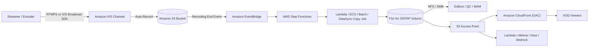

# Amazon IVS Live-to-FSx for ONTAP VOD Publishing Pattern

🌐 **Language / 语言**: [日本語](README.md) | [English](README.en.md) | [한국어](README.ko.md) | 简体中文 | [繁體中文](README.zh-TW.md) | [Français](README.fr.md) | [Deutsch](README.de.md) | [Español](README.es.md)

> 将 **Amazon Interactive Video Service（Amazon IVS）** 直播与 **Amazon FSx for NetApp ONTAP** +
> **Amazon S3 Access Points** 结合，构建直播后媒体工作区与 VOD（点播）发布层的参考模式。

## 状态

| 路径 | 状态 | 含义 |
|------|------|------|
| **推荐（Recommended）** | `Supported components` | Amazon IVS 自动录制到受支持的标准 S3 存储桶，随后将 HLS 包发布到 FSx for ONTAP，并通过 S3 Access Point + Amazon CloudFront 分发 VOD。每个组件均已单独文档化并受支持。 |
| **实验（Experimental）** | `Not documented as supported` | 将 IVS Recording Configuration 的输出目标直接指定为 FSx for ONTAP S3 Access Point alias。**AWS 官方文档未声明支持** — 需单独验证。参见 [direct-recording-experiment.md](direct-recording-experiment.md)。 |

> 本模式为**参考实现**。分发厂商选择、版权处理、地域限制与合规由客户判断。技术验证不替代法律、合规与隐私评估。

> **TL;DR（30 秒）**：保留 IVS 直播体验，录制到**受支持的 S3 存储桶**；随后将 HLS 发布到 FSx for ONTAP，
> 通过 NFS/SMB 进行编辑/QC/审批，并用 S3 Access Point + CloudFront 再分发 VOD。直接录制（IVS→FSx for ONTAP S3 AP）
> 为 **Experimental**，仅提供验证计划。

**立即体验（30 秒）**：运行 `make test-media-ivs-vod-publishing` 执行单元/属性测试，验证 Recording End
校验、permission-aware 摄取边界、清单校验、Human Review 判定与数据分类（无需 FSx for ONTAP）。

## 为何采用此模式

- Amazon IVS 提供**直播互动体验**（低延迟）。
- Amazon IVS 自动录制到**标准 S3 存储桶**（官方支持的录制落地区）。
- **FSx for ONTAP** 作为**直播后媒体工作区**：通过 **NFS/SMB** 在同一数据上进行编辑、QC、审批。
- 通过 **S3 Access Point** 以 S3 API 将 FSx 上的文件暴露给 AWS 服务（CloudFront、Lambda、Athena、Glue、Amazon Bedrock）。
- **Amazon CloudFront** 将成品 HLS VOD 再分发给观众。

无需为编辑与分发重复保存媒体，在 FSx for ONTAP 上保留单一权威副本（文件协议工具与 S3 API 服务均可使用）。

## Partner/SI 指南

- **首个客户问题**："直播后编辑/QC/审批/归档是否同时需要文件（NFS/SMB）与 S3 API？VOD 分发是否用 CloudFront？"
- **PoC 交付物**：DemoMode 演示 → VOD publish 清单（master manifest 校验 + Human Review 判定）→（可选）真实 IVS 录制 → FSx 发布 → CloudFront 分发。

## 架构（推荐路径）



详见 [architecture.zh-CN.md](architecture.zh-CN.md)，图源见 [diagrams/architecture.mmd](diagrams/architecture.mmd)。

## 角色划分

| 层 | 组件 | 角色 |
|----|------|------|
| 直播 | Amazon IVS | 直播互动视频体验 |
| 落地区 | Amazon S3 | 官方支持的录制目标 |
| 媒体工作区 | FSx for ONTAP | 直播后编辑 / QC / 审批 / 归档 / VOD 源 |
| S3 API 访问 | S3 Access Points | 对 FSx 上文件的 S3 API 访问 |
| 分发 | Amazon CloudFront | 公开/受控 VOD 分发（OAC + SigV4） |

## 主要组件

| 组件 | 角色 |
|---|---|
| `functions/publish/handler.py` | 以 IVS Recording End 为起点，将 HLS 包摄取到 FSx for ONTAP（S3 AP），校验 master manifest，并写回带 Human Review 判定的 VOD publish 清单 |
| `functions/moderation/handler.py`（可选） | 严格审核（视频/音频/字幕）异步 start/collect Lambda（`EnableStrictModeration=true`） |
| `functions/transcode/handler.py`（可选） | HLS→MP4 转换（MediaConvert）异步 start/collect Lambda；生成视频审核所需的 MP4 输入（`EnableStrictModeration=true`） |
| `template.yaml` | SAM 模板（EventBridge / Scheduler / Step Functions / Lambda / 可选 CloudFront） |
| Step Functions | Publish → SNS 通知 |
| CloudFront（可选） | 从 S3 Access Point 源分发 VOD（OAC + SigV4） |

## 参数

| 参数 | 说明 | 默认值 |
|---|---|---|
| `RecordingSourceBucket` | IVS 自动录制目标标准 S3 存储桶（或 AP alias） | — |
| `S3AccessPointOutputAlias` | 写入 FSx for ONTAP 的 S3 AP Alias（Internet-origin） | — |
| `MasterManifestName` | master manifest 文件名（用于校验） | `master.m3u8` |
| `TriggerMode` | `POLLING`/`EVENT_DRIVEN`/`HYBRID` | `EVENT_DRIVEN` |
| `SourcePrefixRoot` | POLLING 时扫描的 IVS 录制前缀 | `ivs/v1/` |
| `DemoMode` | 跳过实际复制，仅记录（无需 FSx 验证） | `true` |
| `DataClassification` | 输出数据分类（VOD 成品通常为 PUBLIC） | `PUBLIC` |
| `HumanReviewAutoApproveThreshold` | 自动发布 confidence 阈值 | `0.85` |
| `HumanReviewRejectThreshold` | 自动拒绝 confidence 阈值 | `0.30` |
| `EnableModeration` | Rekognition 缩略图内容审核（opt-in） | `false` |
| `ModerationMinConfidence` | 采用审核标签的最小 confidence | `80` |
| `ModerationMaxImages` | 审核缩略图数量上限（成本控制） | `5` |
| `EnableStrictModeration` | 视频/音频/字幕严格审核 Lambda（opt-in，异步） | `false` |
| `ModerationToxicityThreshold` | Comprehend toxicity 阈值（0-1） | `0.5` |
| `MediaModerationLanguage` | Comprehend / Transcribe 语言代码 | `en` |
| `MediaConvertRoleArn` | HLS→MP4 转换用 MediaConvert 执行角色 ARN（视频审核时） | — |
| `EnableCloudFront` | 启用 CloudFront 分发 | `false` |
| `NotificationEmail` | SNS 通知接收方 | — |
| `ScheduleExpression` | Scheduler 表达式（POLLING / HYBRID） | `rate(1 hour)` |
| `EnableCloudWatchAlarms` | 启用 Lambda/SFN 告警 | `false` |
| `EnableXRayTracing` | X-Ray 跟踪 | `true` |
| `LogRetentionInDays` | CloudWatch Logs 保留天数 | `90` |

## 部署

```bash
sam build --template solutions/edge/media-ivs-vod-publishing/template.yaml
sam deploy --guided \
  --template solutions/edge/media-ivs-vod-publishing/template.yaml \
  --stack-name fsxn-media-ivs-vod-publishing
```

DemoMode 验证参见 [docs/demo-guide.md](docs/demo-guide.md)。

## Human Review（发布前人工审批）

VOD 发布不仅依赖自动判定。基于包的**完整性信号**计算 publish-readiness confidence，并用
`shared/human_review.py` 阈值判定。

| 判定 | 条件（默认） | 行为 |
|------|-------------|------|
| `AUTO_APPROVE` | confidence ≥ 0.85（master manifest + 分段存在） | 直接记录 publish 清单 |
| `HUMAN_REVIEW` | 0.30 ≤ confidence < 0.85（有 manifest 但缺分段等） | 以 `[REVIEW REQUIRED]` 通知，人工确认 |
| `REJECT` | confidence < 0.30（缺 master manifest 等） | 以 `[ESCALATION]` 通知，不发布 |

> confidence 不是 AI 模型分数，而是**包完整性启发式**。发布最终决定由人（Data Owner / Approver）做出。

## 内容审核（opt-in）

作为**独立于完整性检查的发布门**，可选启用 Amazon Rekognition 内容审核（默认关闭；推荐路径与 DemoMode 行为不变）。

- `EnableModeration=true`（非 DemoMode）对录制包内缩略图（最多 `ModerationMaxImages`）运行
  `DetectModerationLabels`。
- 若出现 `ModerationMinConfidence`（默认 80）及以上的标签，则**阻止发布**（`blocked_by_moderation`）并路由到
  人工审核。发布清单记录 `moderation` 结果。
- 这是**缩略图抽样检查**，非全文覆盖。
- 与完整性启发式（Human Review）独立运行。"包完整" 与 "内容已获公开许可" 是两回事。

### 严格审核（视频/音频/字幕，opt-in·异步）

比缩略图同步检查更严格地判定视频·音频·字幕的异步组件另行提供
（`EnableStrictModeration=true` 创建 `functions/moderation/handler.py`）。

- **视频**：Amazon Rekognition `StartContentModeration` / `GetContentModeration`（异步）。输入为 S3 上的
  单个视频文件（例如用 MediaConvert 从 HLS 生成的 MP4，由 `video_key` 指定）。
- **音频**：Amazon Transcribe 转写 → Amazon Comprehend `DetectToxicContent` 判定有害内容。
- **字幕**：录制包内字幕（`.vtt` / `.srt`）用 Comprehend 同步判定。
- **HLS→MP4 转换**：视频审核需要单个 MP4，故用 `functions/transcode/handler.py`
  （AWS Elemental MediaConvert，start/collect）先把 HLS 转成 MP4 再交给 moderation（需 `MediaConvertRoleArn`）。
- **两阶段（start / collect）** 运行，拟由 Step Functions
  `transcode → moderation start → Wait → collect（轮询）→ gate` 调用
  （示例：[samples/strict-moderation.asl.json](samples/strict-moderation.asl.json)，transcode→moderation 一体化）。
  任一项达到阈值则 `decision=BLOCK` 阻止发布并路由到人工审核。
- 阈值用 `ModerationMinConfidence`（视频）/ `ModerationToxicityThreshold`（音频·字幕，0-1）调整。

> 约束：视频审核无法直接针对 HLS 分段，故需要单个 MP4。本模式用 `functions/transcode/`（MediaConvert）
> 同捆 HLS→MP4 转换（需 MediaConvert 执行角色）。MediaConvert/Transcribe/Comprehend/Rekognition async 会产生
> 成本与时延。这是辅助信号，发布最终可否由人（Data Owner / Approver）决定。

## 数据分类

- VOD 分发成品通常为 **PUBLIC**（`DataClassification=PUBLIC`）。publish 清单包含 `data_classification` /
  `data_classification_label`。
- 不可公开的素材（未审批、地域受限、版权未处理）不应被摄取/发布。

## Success Metrics（PoC Go/No-Go）

| 类别 | 指标 | 参考 |
|---|---|---|
| Business Outcome | 避免编辑/分发媒体重复保存 | FSx 单一副本两用 |
| Technical KPI | publish 成功率 | DemoMode 下 SUCCEEDED |
| Quality KPI | master manifest 校验 | 发布前确认 master manifest 存在 |
| Cost KPI | FSx 读带宽影响 | 分发源拉取不挤占编辑带宽（P95/P99） |
| Go/No-Go | 直接录制（IVS→FSx for ONTAP S3 AP） | 由实机验证判定（官方明示前为 Experimental） |

## Validation Matrix（摘要）

| 集成点 | 状态 |
|--------|------|
| IVS 自动录制 → 标准 S3 存储桶 | Supported |
| IVS RecordingConfiguration + FSx for ONTAP S3 AP alias | Experimental / Unknown |
| S3 → FSx（NFS/SMB） | Supported |
| S3 → FSx（S3 AP `PutObject`） | Supported（大小/API 限制） |
| FSx for ONTAP S3 AP → CloudFront | Supported（有官方教程） |
| FSx for ONTAP S3 AP → Lambda | Supported |
| FSx for ONTAP S3 AP → Athena / Glue / Bedrock | Supported |

详见 [validation-matrix.md](validation-matrix.md)。

## 文档

| 文档 | 目的 |
|------|------|
| [architecture.zh-CN.md](architecture.zh-CN.md) | 设计原则、数据流、网络设计 |
| [validation-matrix.md](validation-matrix.md) | 各集成点支持状态 |
| [direct-recording-experiment.md](direct-recording-experiment.md) | 直接录制验证计划 |
| [supported-path-ivs-s3-fsx-cloudfront.md](supported-path-ivs-s3-fsx-cloudfront.md) | 推荐路径实现方针 |
| [docs/demo-guide.md](docs/demo-guide.md) | DemoMode 验证步骤 |
| [samples/](samples/) | EventBridge 事件、Step Functions ASL、Lambda 片段、AP 策略、CloudFront 说明 |
| [scripts/](scripts/) | Recording Config 创建/验证/同步 CLI |
| [support-request/](support-request/) | AWS 功能改进请求模板（JA / EN） |

## 安全 / 治理

- **permission-aware 摄取边界**：摄取仅限于指定录制前缀。公开分发不强制 ONTAP 文件权限，因此边界由"仅发布
  已审批"运营与 CloudFront 源锁定保障。
- **观众认证**：FSx for ONTAP S3 AP **不支持** S3 Presigned URL — 使用 CloudFront 签名 URL/Cookie。
- **数据所在地**：IVS 频道、Recording Configuration、S3 位置须**同一区域**。CloudFront 为全球分发，不可跨区
  分发的数据应排除或用地域限制控制。
- **最小权限**：Publish Lambda 仅对源 S3（读）和输出 S3 AP（写）具备必要 Action。为访问 Internet-origin S3 AP
  在 **VPC 外**运行。
- AI/自动信号为**辅助**，发布与否由人（Data Owner / Approver）决定。

> **Governance Note**：分发不强制 ONTAP 文件权限。边界由摄取范围限制、审批运营、Human Review 与 CloudFront
> 源访问控制保障。技术验证不替代法律、合规与隐私评估。

## Scaffold 约束（明示）

- 本脚手架以 **EVENT_DRIVEN**（IVS Recording End → EventBridge → Step Functions）为主。`POLLING` 扫描
  `SourcePrefixRoot` 下，`HYBRID` 两者皆定义，但**未实现幂等性**。如需去重，请集成 `shared/idempotency_checker.py`。
- `functions/publish/handler.py` 按大小自动选择实现摄取：小对象用 `PutObject`，大对象（默认 >100MB）用
  **流式 multipart**（`streaming_download` + `multipart_upload`，低内存）。超过 Lambda 摄取上限（默认 20GB）则
  跳过——建议 DataSync 或 ECS/Batch（NFS/SMB 挂载）。
- 直接录制为 Experimental（[direct-recording-experiment.md](direct-recording-experiment.md)）。

## 范围

- 本模式面向 **Amazon IVS Low-Latency Streaming** 的自动录制（`ivs/v1/...` 频道录制）。
  **IVS Real-Time Streaming（stages）** 录制模型不同，不在本模式范围（同样的"发布到 FSx → S3 AP + CloudFront
  分发"思路仍适用）。
- 面向**已编码 HLS 的分发/摄取**，**不做转码、再打包、广告插入**。

## 备选与如何选择（中立）

按场景选择。权衡对称陈述（含推荐方案）。详细比较/判定流程图见 [architecture.zh-CN.md](architecture.zh-CN.md)。

| 选项 | 适用 | 权衡 / 考量 |
|------|------|-----------|
| **本模式** | 录制需要 **NFS/SMB 编辑/QC/审批**，且同一副本进行 S3 API 分发/分析 | 增加摄取跳（S3→FSx）与运维层；分发边界由运维而非 ONTAP ACL 保障 |
| **IVS Auto-Record → S3 + CloudFront**（无 FSx） | 无需文件运维的简单 live-to-VOD | 无统一 NFS/SMB 工作区 |
| **AWS Elemental MediaConvert / MediaPackage / MediaTailor** | 转码 / JIT 打包 / DRM / 广告插入 | 运维对象增多；本模式不做，按需组合 |
| **直接 S3 + CloudFront** | 现有 HLS 的纯 VOD | 无直播层与 ONTAP 文件运维 |

三者可**组合**，非互斥。

## 运维 / Runbook（Reliability/Ops）

- **EventBridge 为尽力交付**（可能丢失、延迟、乱序）。生产建议 `TriggerMode=HYBRID`（EVENT_DRIVEN 低延迟 +
  POLLING 兜底）。因**未实现幂等**，HYBRID 需集成 `shared/idempotency_checker.py`（以 `recording_session_id`
  + `recording_prefix` 为键）。
- **告警**：`EnableCloudWatchAlarms=true` 将 Lambda 错误 / Step Functions 失败通过 SNS 通知。
- **故障处理**：publish 失败时查看 `/aws/lambda/<stack>-publish`，区分 S3 AP 授权（IAM + AP policy +
  ONTAP identity）与源 S3 读取。误发布时从 CloudFront 源移除该对象并在修正后重跑。参见
  [事件响应 Playbook](../../docs/incident-response-playbook.md)。

## FAQ / 常见误解

- **"IVS 能否直接录制到 FSx for ONTAP S3 AP？"** 无官方支持声明 → 作为 Experimental 验证
  ([direct-recording-experiment.md](direct-recording-experiment.md))。
- **"S3 AP 是完整 S3 存储桶吗？"** 否（不支持 Presigned URL / Versioning / Object Lock / Lifecycle /
  Static Website Hosting）。
- **"能给观众 Presigned URL 吗？"** 否 → 使用 CloudFront 签名 URL / Cookie。
- **"完整性分数高就能公开？"** 否。仅检查 HLS 包完整性；内容可否公开需另行人工/AI 审核。审核为 **opt-in 内置**
  （`EnableModeration=true` 运行 Rekognition，命中则阻止发布）。

## Performance Considerations

- FSx for ONTAP 预置吞吐在 NFS/SMB/S3AP 间**共享**。VOD 源拉取可能与编辑/QC 流量竞争，应按 **P95/P99（尾延迟）**
  而非均值进行容量规划，并用高 CloudFront TTL / Origin Shield 减少源拉取。
- Playlist（`.m3u8`）短 TTL，Segment（`.ts` / `.m4s`）长 TTL。
- 若需将分发读取与业务卷隔离，可考虑用 **FlexCache** 卷（ONTAP 原生）作为 CloudFront 源。
- **S3 AP 不是完整的 S3 存储桶** — 是 S3 兼容访问边界。勿假设桶级功能（Presigned URL、Versioning、
  Object Lock、Lifecycle、Static Website Hosting）可用。参见 [../../docs/s3ap-compatibility-notes.md](../../docs/s3ap-compatibility-notes.md)。

## 参考（AWS 官方文档）

- [IVS Auto-Record to Amazon S3 (Low-Latency Streaming)](https://docs.aws.amazon.com/ivs/latest/LowLatencyUserGuide/record-to-s3.html)
- [IVS CreateRecordingConfiguration API](https://docs.aws.amazon.com/ivs/latest/LowLatencyAPIReference/API_CreateRecordingConfiguration.html)
- [Using Amazon EventBridge with IVS Low-Latency Streaming](https://docs.aws.amazon.com/ivs/latest/LowLatencyUserGuide/eventbridge.html)
- [AWS::IVS::RecordingConfiguration (CloudFormation)](https://docs.aws.amazon.com/AWSCloudFormation/latest/TemplateReference/aws-resource-ivs-recordingconfiguration.html)
- [FSx for ONTAP S3 access points](https://docs.aws.amazon.com/fsx/latest/ONTAPGuide/s3-access-points.html)
- [Restricting access to an Amazon S3 origin (CloudFront OAC)](https://docs.aws.amazon.com/AmazonCloudFront/latest/DeveloperGuide/private-content-restricting-access-to-s3.html)

## 相关文档

- [S3AP 兼容性说明](../../docs/s3ap-compatibility-notes.md)
- [S3AP 性能考量](../../docs/s3ap-performance-considerations.md)
- [成本估算](../../docs/cost-calculator.md)
- [替代架构比较](../../docs/comparison-alternatives.md)
- [事件响应 Playbook](../../docs/incident-response-playbook.md)
- [Content Edge Delivery 模式](../content-delivery/README.md)
- [Media/VFX 行业模式](../../industry/media-vfx/README.md)
