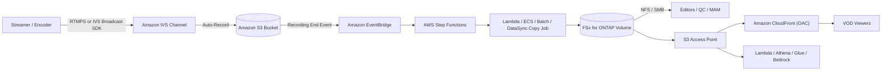

# Amazon IVS Live-to-FSx for ONTAP VOD Publishing Pattern

🌐 **Language / 語言**: [日本語](README.md) | [English](README.en.md) | [한국어](README.ko.md) | [简体中文](README.zh-CN.md) | 繁體中文 | [Français](README.fr.md) | [Deutsch](README.de.md) | [Español](README.es.md)

> 將 **Amazon Interactive Video Service（Amazon IVS）** 直播與 **Amazon FSx for NetApp ONTAP** +
> **Amazon S3 Access Points** 結合，建構直播後媒體工作區與 VOD（隨選視訊）發佈層的參考模式。

## 狀態

| 路徑 | 狀態 | 意義 |
|------|------|------|
| **建議（Recommended）** | `Supported components` | Amazon IVS 自動錄製到受支援的標準 S3 儲存貯體，隨後將 HLS 套件發佈到 FSx for ONTAP，並透過 S3 Access Point + Amazon CloudFront 分發 VOD。各元件皆已個別文件化並受支援。 |
| **實驗（Experimental）** | `Not documented as supported` | 將 IVS Recording Configuration 的輸出目標直接指定為 FSx for ONTAP S3 Access Point alias。**AWS 官方文件未聲明支援** — 需另行驗證。參見 [direct-recording-experiment.md](direct-recording-experiment.md)。 |

> 本模式為**參考實作**。分發廠商選擇、版權處理、地域限制與合規由客戶判斷。技術驗證不取代法律、合規與隱私評估。

> **TL;DR（30 秒）**：保留 IVS 直播體驗，錄製到**受支援的 S3 儲存貯體**；隨後將 HLS 發佈到 FSx for ONTAP，
> 透過 NFS/SMB 進行編輯/QC/審核，並以 S3 Access Point + CloudFront 再分發 VOD。直接錄製（IVS→FSx for ONTAP S3 AP）
> 為 **Experimental**，僅提供驗證計畫。

**立即體驗（30 秒）**：執行 `make test-media-ivs-vod-publishing` 執行單元/屬性測試，驗證 Recording End
檢查、permission-aware 擷取邊界、清單檢查、Human Review 判定與資料分類（不需 FSx for ONTAP）。

## 為何採用此模式

- Amazon IVS 提供**直播互動體驗**（低延遲）。
- Amazon IVS 自動錄製到**標準 S3 儲存貯體**（官方支援的錄製落地區）。
- **FSx for ONTAP** 作為**直播後媒體工作區**：透過 **NFS/SMB** 在同一資料上進行編輯、QC、審核。
- 透過 **S3 Access Point** 以 S3 API 將 FSx 上的檔案暴露給 AWS 服務（CloudFront、Lambda、Athena、Glue、Amazon Bedrock）。
- **Amazon CloudFront** 將成品 HLS VOD 再分發給觀眾。

無需為編輯與分發重複保存媒體，在 FSx for ONTAP 上保留單一權威副本（檔案協定工具與 S3 API 服務皆可使用）。

## Partner/SI 指南

- **首個客戶問題**：「直播後編輯/QC/審核/封存是否同時需要檔案（NFS/SMB）與 S3 API？VOD 分發是否用 CloudFront？」
- **PoC 交付物**：DemoMode 示範 → VOD publish 清單（master manifest 檢查 + Human Review 判定）→（選用）真實 IVS 錄製 → FSx 發佈 → CloudFront 分發。

## 架構（建議路徑）



詳見 [architecture.zh-TW.md](architecture.zh-TW.md)，圖源見 [diagrams/architecture.mmd](diagrams/architecture.mmd)。

## 角色劃分

| 層 | 元件 | 角色 |
|----|------|------|
| 直播 | Amazon IVS | 直播互動視訊體驗 |
| 落地區 | Amazon S3 | 官方支援的錄製目標 |
| 媒體工作區 | FSx for ONTAP | 直播後編輯 / QC / 審核 / 封存 / VOD 來源 |
| S3 API 存取 | S3 Access Points | 對 FSx 上檔案的 S3 API 存取 |
| 分發 | Amazon CloudFront | 公開/受控 VOD 分發（OAC + SigV4） |

## 主要元件

| 元件 | 角色 |
|---|---|
| `functions/publish/handler.py` | 以 IVS Recording End 為起點，將 HLS 套件擷取到 FSx for ONTAP（S3 AP），驗證 master manifest，並寫回帶 Human Review 判定的 VOD publish 清單 |
| `functions/moderation/handler.py`（選用） | 嚴格審核（影片/音訊/字幕）非同步 start/collect Lambda（`EnableStrictModeration=true`） |
| `functions/transcode/handler.py`（選用） | HLS→MP4 轉換（MediaConvert）非同步 start/collect Lambda；產生影片審核所需的 MP4 輸入（`EnableStrictModeration=true`） |
| `template.yaml` | SAM 範本（EventBridge / Scheduler / Step Functions / Lambda / 選用 CloudFront） |
| Step Functions | Publish → SNS 通知 |
| CloudFront（選用） | 從 S3 Access Point 來源分發 VOD（OAC + SigV4） |

## 參數

| 參數 | 說明 | 預設值 |
|---|---|---|
| `RecordingSourceBucket` | IVS 自動錄製目標標準 S3 儲存貯體（或 AP alias） | — |
| `S3AccessPointOutputAlias` | 寫入 FSx for ONTAP 的 S3 AP Alias（Internet-origin） | — |
| `MasterManifestName` | master manifest 檔名（用於檢查） | `master.m3u8` |
| `TriggerMode` | `POLLING`/`EVENT_DRIVEN`/`HYBRID` | `EVENT_DRIVEN` |
| `SourcePrefixRoot` | POLLING 時掃描的 IVS 錄製前綴 | `ivs/v1/` |
| `DemoMode` | 略過實際複製，僅記錄（不需 FSx 驗證） | `true` |
| `DataClassification` | 輸出資料分類（VOD 成品通常為 PUBLIC） | `PUBLIC` |
| `HumanReviewAutoApproveThreshold` | 自動發佈 confidence 閾值 | `0.85` |
| `HumanReviewRejectThreshold` | 自動拒絕 confidence 閾值 | `0.30` |
| `EnableModeration` | Rekognition 縮圖內容審核（opt-in） | `false` |
| `ModerationMinConfidence` | 採用審核標籤的最小 confidence | `80` |
| `ModerationMaxImages` | 審核縮圖數量上限（成本控制） | `5` |
| `EnableStrictModeration` | 影片/音訊/字幕嚴格審核 Lambda（opt-in，非同步） | `false` |
| `ModerationToxicityThreshold` | Comprehend toxicity 閾值（0-1） | `0.5` |
| `MediaModerationLanguage` | Comprehend / Transcribe 語言代碼 | `en` |
| `MediaConvertRoleArn` | HLS→MP4 轉換用 MediaConvert 執行角色 ARN（影片審核時） | — |
| `EnableCloudFront` | 啟用 CloudFront 分發 | `false` |
| `NotificationEmail` | SNS 通知接收方 | — |
| `ScheduleExpression` | Scheduler 運算式（POLLING / HYBRID） | `rate(1 hour)` |
| `EnableCloudWatchAlarms` | 啟用 Lambda/SFN 警示 | `false` |
| `EnableXRayTracing` | X-Ray 追蹤 | `true` |
| `LogRetentionInDays` | CloudWatch Logs 保留天數 | `90` |

## 部署

```bash
sam build --template solutions/edge/media-ivs-vod-publishing/template.yaml
sam deploy --guided \
  --template solutions/edge/media-ivs-vod-publishing/template.yaml \
  --stack-name fsxn-media-ivs-vod-publishing
```

DemoMode 驗證參見 [docs/demo-guide.md](docs/demo-guide.md)。

## Human Review（發佈前人工審核）

VOD 發佈不僅依賴自動判定。依套件**完整性訊號**計算 publish-readiness confidence，並以
`shared/human_review.py` 閾值判定。

| 判定 | 條件（預設） | 行為 |
|------|-------------|------|
| `AUTO_APPROVE` | confidence ≥ 0.85（master manifest + 分段存在） | 直接記錄 publish 清單 |
| `HUMAN_REVIEW` | 0.30 ≤ confidence < 0.85（有 manifest 但缺分段等） | 以 `[REVIEW REQUIRED]` 通知，人工確認 |
| `REJECT` | confidence < 0.30（缺 master manifest 等） | 以 `[ESCALATION]` 通知，不發佈 |

> confidence 不是 AI 模型分數，而是**套件完整性啟發式**。發佈最終決定由人（Data Owner / Approver）做出。

## 內容審核（opt-in）

作為**獨立於完整性檢查的發佈閘門**，可選擇啟用 Amazon Rekognition 內容審核（預設關閉；建議路徑與 DemoMode 行為不變）。

- `EnableModeration=true`（非 DemoMode）對錄製套件內縮圖（最多 `ModerationMaxImages`）執行
  `DetectModerationLabels`。
- 若出現 `ModerationMinConfidence`（預設 80）以上的標籤，則**封鎖發佈**（`blocked_by_moderation`）並路由到
  人工審核。發佈清單記錄 `moderation` 結果。
- 這是**縮圖抽樣檢查**，非全文涵蓋。
- 與完整性啟發式（Human Review）獨立運作。「套件完整」與「內容已獲公開許可」是兩回事。

### 嚴格審核（影片/音訊/字幕，opt-in·非同步）

比縮圖同步檢查更嚴格地判定影片·音訊·字幕的非同步元件另行提供
（`EnableStrictModeration=true` 建立 `functions/moderation/handler.py`）。

- **影片**：Amazon Rekognition `StartContentModeration` / `GetContentModeration`（非同步）。輸入為 S3 上的
  單一影片檔（例如以 MediaConvert 從 HLS 產生的 MP4，由 `video_key` 指定）。
- **音訊**：Amazon Transcribe 轉錄 → Amazon Comprehend `DetectToxicContent` 判定有害內容。
- **字幕**：錄製套件內字幕（`.vtt` / `.srt`）以 Comprehend 同步判定。
- **HLS→MP4 轉換**：影片審核需要單一 MP4，故以 `functions/transcode/handler.py`
  （AWS Elemental MediaConvert，start/collect）先將 HLS 轉為 MP4 再交給 moderation（需 `MediaConvertRoleArn`）。
- **兩階段（start / collect）** 運作，擬由 Step Functions
  `transcode → moderation start → Wait → collect（輪詢）→ gate` 呼叫
  （範例：[samples/strict-moderation.asl.json](samples/strict-moderation.asl.json)，transcode→moderation 一體化）。
  任一項達到閾值則 `decision=BLOCK` 封鎖發佈並路由到人工審核。
- 閾值以 `ModerationMinConfidence`（影片）/ `ModerationToxicityThreshold`（音訊·字幕，0-1）調整。

> 限制：影片審核無法直接針對 HLS 分段，故需要單一 MP4。本模式以 `functions/transcode/`（MediaConvert）
> 同捆 HLS→MP4 轉換（需 MediaConvert 執行角色）。MediaConvert/Transcribe/Comprehend/Rekognition async 會產生
> 成本與延遲。這是輔助訊號，發佈最終可否由人（Data Owner / Approver）決定。

## 資料分類

- VOD 分發成品通常為 **PUBLIC**（`DataClassification=PUBLIC`）。publish 清單包含 `data_classification` /
  `data_classification_label`。
- 不可公開的素材（未審核、地域受限、版權未處理）不應被擷取/發佈。

## Success Metrics（PoC Go/No-Go）

| 類別 | 指標 | 參考 |
|---|---|---|
| Business Outcome | 避免編輯/分發媒體重複保存 | FSx 單一副本兩用 |
| Technical KPI | publish 成功率 | DemoMode 下 SUCCEEDED |
| Quality KPI | master manifest 檢查 | 發佈前確認 master manifest 存在 |
| Cost KPI | FSx 讀取頻寬影響 | 分發來源提取不擠壓編輯頻寬（P95/P99） |
| Go/No-Go | 直接錄製（IVS→FSx for ONTAP S3 AP） | 由實機驗證判定（官方明示前為 Experimental） |

## Validation Matrix（摘要）

| 整合點 | 狀態 |
|--------|------|
| IVS 自動錄製 → 標準 S3 儲存貯體 | Supported |
| IVS RecordingConfiguration + FSx for ONTAP S3 AP alias | Experimental / Unknown |
| S3 → FSx（NFS/SMB） | Supported |
| S3 → FSx（S3 AP `PutObject`） | Supported（大小/API 限制） |
| FSx for ONTAP S3 AP → CloudFront | Supported（有官方教學） |
| FSx for ONTAP S3 AP → Lambda | Supported |
| FSx for ONTAP S3 AP → Athena / Glue / Bedrock | Supported |

詳見 [validation-matrix.md](validation-matrix.md)。

## 文件

| 文件 | 目的 |
|------|------|
| [architecture.zh-TW.md](architecture.zh-TW.md) | 設計原則、資料流、網路設計 |
| [validation-matrix.md](validation-matrix.md) | 各整合點支援狀態 |
| [direct-recording-experiment.md](direct-recording-experiment.md) | 直接錄製驗證計畫 |
| [supported-path-ivs-s3-fsx-cloudfront.md](supported-path-ivs-s3-fsx-cloudfront.md) | 建議路徑實作方針 |
| [docs/demo-guide.md](docs/demo-guide.md) | DemoMode 驗證步驟 |
| [samples/](samples/) | EventBridge 事件、Step Functions ASL、Lambda 片段、AP 政策、CloudFront 說明 |
| [scripts/](scripts/) | Recording Config 建立/驗證/同步 CLI |
| [support-request/](support-request/) | AWS 功能改進請求範本（JA / EN） |

## 安全 / 治理

- **permission-aware 擷取邊界**：擷取僅限於指定錄製前綴。公開分發不強制 ONTAP 檔案權限，因此邊界由「僅發佈
  已審核」營運與 CloudFront 來源鎖定保障。
- **觀眾認證**：FSx for ONTAP S3 AP **不支援** S3 Presigned URL — 使用 CloudFront 簽章 URL/Cookie。
- **資料所在地**：IVS 頻道、Recording Configuration、S3 位置須**同一區域**。CloudFront 為全球分發，不可跨區
  分發的資料應排除或以地域限制控制。
- **最小權限**：Publish Lambda 僅對來源 S3（讀）與輸出 S3 AP（寫）具備必要 Action。為存取 Internet-origin
  S3 AP 於 **VPC 外**執行。
- AI/自動訊號為**輔助**，發佈與否由人（Data Owner / Approver）決定。

> **Governance Note**：分發不強制 ONTAP 檔案權限。邊界由擷取範圍限制、審核營運、Human Review 與 CloudFront
> 來源存取控制保障。技術驗證不取代法律、合規與隱私評估。

## Scaffold 限制（明示）

- 本 scaffold 以 **EVENT_DRIVEN**（IVS Recording End → EventBridge → Step Functions）為主。`POLLING` 掃描
  `SourcePrefixRoot` 下，`HYBRID` 兩者皆定義，但**未實作冪等性**。如需去重，請整合 `shared/idempotency_checker.py`。
- `functions/publish/handler.py` 依大小自動選擇實作擷取：小物件用 `PutObject`，大物件（預設 >100MB）用
  **串流 multipart**（`streaming_download` + `multipart_upload`，低記憶體）。超過 Lambda 擷取上限（預設 20GB）則
  略過——建議 DataSync 或 ECS/Batch（NFS/SMB 掛載）。
- 直接錄製為 Experimental（[direct-recording-experiment.md](direct-recording-experiment.md)）。

## 範圍

- 本模式面向 **Amazon IVS Low-Latency Streaming** 的自動錄製（`ivs/v1/...` 頻道錄製）。
  **IVS Real-Time Streaming（stages）** 錄製模型不同，不在本模式範圍（同樣的「發佈到 FSx → S3 AP + CloudFront
  分發」思路仍適用）。
- 面向**已編碼 HLS 的分發/擷取**，**不做轉碼、重新封裝、廣告插入**。

## 替代與如何選擇（中立）

依場景選擇。權衡對稱陳述（含建議方案）。詳細比較/判定流程圖見 [architecture.zh-TW.md](architecture.zh-TW.md)。

| 選項 | 適用 | 權衡 / 考量 |
|------|------|-----------|
| **本模式** | 錄製需要 **NFS/SMB 編輯/QC/審核**，且同一副本進行 S3 API 分發/分析 | 增加擷取跳（S3→FSx）與維運層；分發邊界由維運而非 ONTAP ACL 保障 |
| **IVS Auto-Record → S3 + CloudFront**（無 FSx） | 無需檔案維運的簡單 live-to-VOD | 無統一 NFS/SMB 工作區 |
| **AWS Elemental MediaConvert / MediaPackage / MediaTailor** | 轉碼 / JIT 封裝 / DRM / 廣告插入 | 維運對象增多；本模式不做，按需組合 |
| **直接 S3 + CloudFront** | 既有 HLS 的純 VOD | 無直播層與 ONTAP 檔案維運 |

三者可**組合**，非互斥。

## 維運 / Runbook（Reliability/Ops）

- **EventBridge 為盡力交付**（可能遺失、延遲、亂序）。生產建議 `TriggerMode=HYBRID`（EVENT_DRIVEN 低延遲 +
  POLLING 補漏）。因**未實作冪等**，HYBRID 需整合 `shared/idempotency_checker.py`（以 `recording_session_id`
  + `recording_prefix` 為鍵）。
- **警示**：`EnableCloudWatchAlarms=true` 將 Lambda 錯誤 / Step Functions 失敗透過 SNS 通知。
- **故障處理**：publish 失敗時查看 `/aws/lambda/<stack>-publish`，區分 S3 AP 授權（IAM + AP policy +
  ONTAP identity）與來源 S3 讀取。誤發佈時從 CloudFront 來源移除該物件並於修正後重跑。參見
  [事件回應 Playbook](../../docs/incident-response-playbook.md)。

## FAQ / 常見誤解

- **「IVS 能否直接錄製到 FSx for ONTAP S3 AP？」** 無官方支援聲明 → 作為 Experimental 驗證
  ([direct-recording-experiment.md](direct-recording-experiment.md))。
- **「S3 AP 是完整 S3 儲存貯體嗎？」** 否（不支援 Presigned URL / Versioning / Object Lock / Lifecycle /
  Static Website Hosting）。
- **「能給觀眾 Presigned URL 嗎？」** 否 → 使用 CloudFront 簽章 URL / Cookie。
- **「完整性分數高就能公開？」** 否。僅檢查 HLS 套件完整性；內容可否公開需另行人工/AI 審核。審核為 **opt-in 內建**
  （`EnableModeration=true` 執行 Rekognition，命中則封鎖發佈）。

## Performance Considerations

- FSx for ONTAP 佈建輸送量在 NFS/SMB/S3AP 間**共用**。VOD 來源提取可能與編輯/QC 流量競爭，應以 **P95/P99
  （尾端延遲）** 而非平均進行容量規劃，並以高 CloudFront TTL / Origin Shield 減少來源提取。
- Playlist（`.m3u8`）短 TTL，Segment（`.ts` / `.m4s`）長 TTL。
- 若需將分發讀取與業務磁碟區隔離，可考慮以 **FlexCache** 磁碟區（ONTAP 原生）作為 CloudFront 來源。
- **S3 AP 不是完整的 S3 儲存貯體** — 是 S3 相容存取邊界。勿假設貯體層級功能（Presigned URL、Versioning、
  Object Lock、Lifecycle、Static Website Hosting）可用。參見 [../../docs/s3ap-compatibility-notes.md](../../docs/s3ap-compatibility-notes.md)。

## 參考（AWS 官方文件）

- [IVS Auto-Record to Amazon S3 (Low-Latency Streaming)](https://docs.aws.amazon.com/ivs/latest/LowLatencyUserGuide/record-to-s3.html)
- [IVS CreateRecordingConfiguration API](https://docs.aws.amazon.com/ivs/latest/LowLatencyAPIReference/API_CreateRecordingConfiguration.html)
- [Using Amazon EventBridge with IVS Low-Latency Streaming](https://docs.aws.amazon.com/ivs/latest/LowLatencyUserGuide/eventbridge.html)
- [AWS::IVS::RecordingConfiguration (CloudFormation)](https://docs.aws.amazon.com/AWSCloudFormation/latest/TemplateReference/aws-resource-ivs-recordingconfiguration.html)
- [FSx for ONTAP S3 access points](https://docs.aws.amazon.com/fsx/latest/ONTAPGuide/s3-access-points.html)
- [Restricting access to an Amazon S3 origin (CloudFront OAC)](https://docs.aws.amazon.com/AmazonCloudFront/latest/DeveloperGuide/private-content-restricting-access-to-s3.html)

## 相關文件

- [S3AP 相容性說明](../../docs/s3ap-compatibility-notes.md)
- [S3AP 效能考量](../../docs/s3ap-performance-considerations.md)
- [成本試算](../../docs/cost-calculator.md)
- [替代架構比較](../../docs/comparison-alternatives.md)
- [事件回應 Playbook](../../docs/incident-response-playbook.md)
- [Content Edge Delivery 模式](../content-delivery/README.md)
- [Media/VFX 產業模式](../../industry/media-vfx/README.md)
