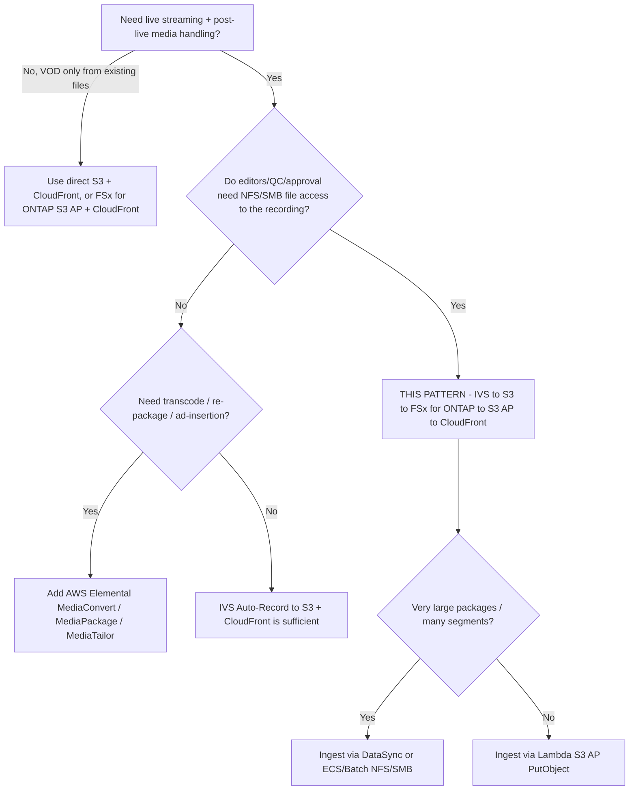

# Architektur — Amazon IVS Live-to-FSx for ONTAP VOD Publishing

🌐 **Language / Sprache**: [日本語](architecture.md) | [English](architecture.en.md) | [한국어](architecture.ko.md) | [简体中文](architecture.zh-CN.md) | [繁體中文](architecture.zh-TW.md) | [Français](architecture.fr.md) | [Deutsch](architecture.de.md) | [Español](architecture.es.md)

## Designprinzipien

1. **Amazon IVS verantwortet das Live-Erlebnis.** Interaktives Streaming mit niedriger Latenz
   liefert IVS; wir implementieren die Live-Auslieferung nicht neu.
2. **In das unterstützte Ziel aufzeichnen.** IVS zeichnet automatisch in einen **Standard-Amazon-S3-
   Bucket** auf — das einzige heute von AWS dokumentierte und unterstützte Ziel.
3. **FSx for ONTAP = Post-Live-Medien-Workspace.** Nach dem Aufzeichnungsende wird das HLS-Paket
   nach FSx for ONTAP publiziert, damit Schnitt, QC und Freigabe über **NFS/SMB** auf denselben
   Daten arbeiten, die auch S3-API-Dienste konsumieren.
4. **S3 Access Points machen FSx-Dateien zugänglich.** VOD-Auslieferung und Analyse erreichen die
   FSx-Daten über die S3-API via S3 Access Point (keine zweite Kopie in einem separaten S3-Bucket
   für die Auslieferung nötig).
5. **Die Auslieferungsgrenze ist operativ.** Öffentliche/kontrollierte Auslieferung umgeht ONTAP-
   ACLs; nur freigegebene Inhalte publizieren und den CloudFront-Origin kontrollieren.

## Empfohlener Datenfluss

```text
Amazon IVS
  -> Auto-Record to S3 bucket           (supported)
  -> EventBridge "IVS Recording State Change" / "Recording End"
  -> Step Functions
  -> Lambda / ECS / Batch / DataSync    (copy/sync HLS package)
  -> FSx for ONTAP volume               (NFS/SMB workspace + S3 AP surface)
  -> S3 Access Point
  -> CloudFront with OAC (SigV4)
  -> VOD viewers
```

1. Ein Streamer/Encoder publiziert an einen **Amazon-IVS-Kanal** (RTMPS oder IVS Broadcast SDK).
2. IVS **zeichnet automatisch** die Session in einen Standard-S3-Bucket unter dem Präfix
   `ivs/v1/<aws_account_id>/<channel_id>/<year>/<month>/<day>/<hours>/<minutes>/<recording_id>`
   auf (HLS-Medien, Manifest, Thumbnails, Metadaten-JSON).
3. Bei **Recording End** sendet IVS ein `IVS Recording State Change`-Ereignis an **EventBridge**.
   Nachgelagerte Verarbeitung erst nach Recording End starten (Segmente/Manifeste vorher nicht
   garantiert vollständig).
4. Eine EventBridge-Regel startet eine **Step-Functions**-Zustandsmaschine.
5. Step Functions führt einen **Copy/Sync-Job** aus (Lambda für kleine Pakete; ECS/Batch/DataSync
   für große), der das HLS-Paket auf das **FSx-for-ONTAP**-Volume schreibt.
6. Schnitt-/QC-/MAM-Tools arbeiten über **NFS/SMB**; dieselben Daten werden über einen **S3 Access
   Point** für Auslieferung und Analyse bereitgestellt.
7. **Amazon CloudFront** (OAC + SigV4) liefert das HLS-VOD vom S3-Access-Point-Origin aus.
8. Optional verarbeiten **Lambda / Athena / Glue / Bedrock** dieselben Daten über den S3 AP.

## Netzwerkdesign

- **Copy/Sync-Compute**:
  - Bei Lesen aus dem Standard-S3-Bucket und Schreiben nach FSx via **S3 AP `PutObject`**
    (Internet-origin AP) den Worker **außerhalb einer VPC** ausführen (oder NAT-Pfad).
  - Bei Schreiben nach FSx via **NFS/SMB-Mounts** den Worker **innerhalb der VPC** ausführen
    (ECS/Batch mit erreichbarem FSx-Mount; Lambda kann NFS/SMB nicht direkt mounten — NFS/SMB-
    Schreibvorgänge nach FSx nutzen daher meist ECS/Batch).
- ONTAP-Management-LIF-Zugriff und Internet-origin-S3-AP-Zugriff **nicht** in einem Lambda **mischen**.
- **CloudFront** erreicht den S3-Access-Point-Origin über das Internet mit SigV4 (OAC); der
  S3-Gateway-VPC-Endpoint fungiert nicht als Front für einen Internet-origin-S3-AP.

## Zwei Wege, in FSx for ONTAP zu schreiben

| Methode | Wann verwenden | Hinweise |
|---------|----------------|----------|
| S3 AP `PutObject` | Moderate Objektanzahl, Worker serverless (Lambda) | `PutObject` max 5 GB; darüber multipart; Internet-origin AP braucht Worker außerhalb VPC oder NAT |
| NFS/SMB-Mount (ECS/Batch/DataSync) | Große Pakete, viele kleine Segmente, vorhandene Datei-Tools | Erhält Datei-Semantik für Editoren; DataSync handhabt Massentransfer effizient |

## Storage-/Durchsatz-Design (Storage lens)

- Der provisionierte FSx-for-ONTAP-Durchsatz wird zwischen NFS/SMB/S3AP **geteilt**. VOD-Origin-
  Fetches und Editing-Traffic konkurrieren auf demselben Volume; nach **P95/P99-Latenz** dimensionieren.
- Hohe CloudFront-TTLs und **Origin Shield** nutzen, um Origin-Fetches zu minimieren; Segmente sind
  unveränderlich (lange TTL), Playlists ändern sich (kurze TTL).
- Ein **FlexCache**-Volume als CloudFront-Origin-Quelle erwägen, um Auslieferungs-Lesevorgänge vom
  Produktions-Editing-Volume zu isolieren (ONTAP-nativ, ohne Anwendungsänderung).
- Quantitative Werte sind konfigurationsabhängig — Produktionsschätzungen auf Messung stützen, nicht auf dieses Beispiel.

## Einschränkungen (FSx for ONTAP S3 AP)

- **Presigned URLs nicht unterstützt** → Zuschauer-Auth über CloudFront-signierte URLs/Cookies.
- Kein vollständiger S3-Bucket: kein Object Versioning / Object Lock / Lifecycle / Static Website
  Hosting (pro Operation in [../../docs/s3ap-compatibility-notes.md](../../docs/s3ap-compatibility-notes.md) prüfen).
- `PutObject` max 5 GB (darüber multipart).
- Zweischichtige Autorisierung: IAM/AP-Policy **und** ONTAP-Dateisystem-Identität (UNIX/Windows)
  müssen beide zulassen.
- `NetworkOrigin` (Internet vs. VPC) nach Erstellung unveränderlich.

## Region / Residenz

- IVS-Kanal, Recording Configuration und S3-Aufzeichnungsort müssen in **derselben Region** liegen.
  FSx for ONTAP und den S3-Bucket ko-lokalisieren, um regionsübergreifenden Transfer zu vermeiden.
- CloudFront ist global — Geobeschränkung anwenden, wo regionsgebundene Inhalte die Region nicht verlassen dürfen.

> **Residenz** (Public Sector lens): „standardmäßig global ausgeliefert" als Ausgangsannahme
> behandeln. Regionsgebundene Inhalte aus Ingest/Publish ausschließen oder per CloudFront-
> Geobeschränkung gaten; die Auslieferungsschicht erbt keine ONTAP-ACLs.

## Geltungsbereich

- Dieses Muster zielt auf **Amazon IVS Low-Latency Streaming** Auto-Record (Kanalaufzeichnungen
  unter `ivs/v1/...`). **IVS Real-Time Streaming (stages)** hat ein anderes Aufzeichnungsmodell
  (einzelne/zusammengesetzte Teilnehmeraufzeichnungen) und ist außerhalb des Bereichs. Die Idee
  „nach FSx for ONTAP publizieren → über S3 AP + CloudFront ausliefern" gilt dennoch.
- Das Muster deckt **Post-Live-Packaging/Auslieferung bereits kodierten HLS** ab. Es **transkodiert,
  re-packaged oder fügt keine Werbung ein**.

> **Medien-Workflow** (Media SME lens): IVS zeichnet HLS als multivariate `master.m3u8` +
> Rendition-Medienplaylists + Segmente (`.ts` für TS, `.m4s`+init für fMP4/CMAF) plus Thumbnails und
> Aufzeichnungs-Metadaten-JSON auf. Das multivariate Master validieren, nicht irgendeine Playlist.

## Wann dieses Muster verwenden — Entscheidungshilfe



## Alternativen und Auswahl (neutral)

Jede Option passt zu einem anderen Kontext. Trade-offs sind symmetrisch dargestellt, auch für den
von diesem Muster empfohlenen Ansatz.

| Option | Passt zu | Trade-off / Erwägung |
|--------|----------|----------------------|
| **Dieses Muster** (IVS → S3 → FSx for ONTAP → S3 AP → CloudFront) | Teams, die **NFS/SMB-Schnitt/QC/Freigabe** auf der Aufzeichnung *und* S3-API-Auslieferung/Analyse auf derselben Kopie brauchen | Zusätzlicher Ingest-Hop (S3 → FSx) und Betriebsebene; Auslieferungsgrenze operativ, nicht ONTAP-ACLs |
| **IVS Auto-Record → S3 + CloudFront** (ohne FSx) | Einfaches Live-to-VOD ohne dateibasierte Postproduktion | Kein einheitlicher NFS/SMB-Workspace; getrennte Kopien, wenn Editoren Dateien brauchen |
| **AWS Elemental MediaConvert / MediaPackage / MediaTailor** | Transkodierung, JIT-Packaging, DRM, serverseitige Werbeeinblendung | Mehr Dienste zu betreiben; dieses Muster tut nichts davon — bei Bedarf kombinieren |
| **Direkt S3 + CloudFront** (Dateien bereits auf S3) | Reines VOD von vorhandenem HLS ohne Live-Erfassung | Keine Live-Ebene; kein ONTAP-Datei-Workflow |

> **Auswahl**: danach wählen, ob Sie (a) einen **gemeinsamen Datei-Workspace** auf der Aufzeichnung
> brauchen (→ dieses Muster), (b) **Medienverarbeitung** (→ MediaConvert/MediaPackage/MediaTailor,
> vor oder nach FSx), oder (c) das **einfachste Live-to-VOD** (→ IVS + S3 + CloudFront). Kombinierbar, nicht exklusiv.

> **Kosten** (FinOps lens): dominante Kosten sind FSx-for-ONTAP-Durchsatz/-Kapazität, CloudFront-
> Egress und S3-Speicher der Aufzeichnungen — nicht das Lambda. Siehe
> [../../docs/cost-calculator.md](../../docs/cost-calculator.md) und nach gemessenem Traffic dimensionieren, nicht nach Beispielläufen.

## Zuverlässigkeit: EventBridge-Zustellsemantik

Amazon IVS stellt EventBridge-Ereignisse **Best-Effort** zu — Ereignisse können fehlen, verspätet
oder unsortiert sein. Ein einzelnes `Recording End` nicht als garantiert Exactly-once-Trigger behandeln.

- **Empfehlung**: in der Produktion `TriggerMode=HYBRID` verwenden — EVENT_DRIVEN für Latenz plus
  ein POLLING-Auffangnetz (`SourcePrefixRoot`-Scan), das verpasste Aufzeichnungen abgleicht.
- Nachgelagerte Verarbeitung erst **nach** `Recording End` starten (Manifeste/Segmente vorher evtl. unvollständig).

> **Zuverlässigkeit/Ops** (SRE lens): das Scaffold implementiert **keine** Idempotenz, daher kann
> HYBRID eine Aufzeichnung doppelt verarbeiten. Vor Aktivierung von HYBRID in der Produktion
> `shared/idempotency_checker.py` (Schlüssel `recording_session_id` + `recording_prefix`) integrieren.
> Eine DLQ an der Zustandsmaschine / dem Lambda für Poison-Events verdrahten.

> **Runbook** (Ops lens): bei Publish-Fehler `/aws/lambda/<stack>-publish` prüfen und S3-AP-
> Autorisierung (IAM + AP-Policy + ONTAP-Identität) vom Quell-Lesen isolieren. Bei Fehlveröffentlichung
> das Objekt aus dem CloudFront-Origin entfernen und nach Korrektur erneut ausführen.

## Content-Moderation und Aufbewahrung (Moderation opt-in; Aufbewahrung ONTAP-nativ)

- **Content-Moderation ist opt-in (standardmäßig aus).** Mit `EnableModeration=true` (nicht DemoMode)
  Amazon Rekognition `DetectModerationLabels` auf den Thumbnails der Aufzeichnung ausführen; bei einem
  Label ≥ `ModerationMinConfidence` wird die Veröffentlichung blockiert (`blocked_by_moderation`) und zur
  menschlichen Prüfung geleitet. Dies ist eine **Thumbnail-Stichprobe**, keine vollständige
  Inhaltsabdeckung — für strengere Anforderungen Rekognition async `StartContentModeration` (Video) /
  Amazon Transcribe + Comprehend ergänzen. Dieses Muster bündelt diesen strikten Pfad opt-in via
  `functions/moderation/` (async start/collect) und die HLS→MP4-Konvertierung `functions/transcode/`
  (MediaConvert) (`EnableStrictModeration=true`; Step-Functions-Beispiel:
  [samples/strict-moderation.asl.json](samples/strict-moderation.asl.json)). Unabhängig von der
  Vollständigkeits-Heuristik (Human Review).

> **Governance** (Public Sector lens): „das Paket ist vollständig" ≠ „der Inhalt ist zur
> Veröffentlichung freigegeben". Die menschliche Publish-Freigabe (Data Owner / Approver) als
> autoritatives Tor beibehalten; das Vollständigkeits-Scoring leitet Elemente nur an dieses Tor.

- **Aufbewahrung**: FSx for ONTAP S3 AP unterstützt **kein** S3-Lifecycle. VOD-Aufbewahrung/-Tiering
  ONTAP-nativ verwalten — **FabricPool** für Kapazitäts-Tiering kalten VODs, **Snapshot** für den
  Zeitpunkt, **SnapMirror** für Archiv/DR — statt S3-Bucket-Lifecycle zu erwarten.

> **Storage** (Storage Specialist lens): Auslieferungs-Origin-Lesevorgänge mit einem **FlexCache**-
> Volume als CloudFront-Origin-Quelle vom Editing-Volume isolieren; Origin-Fetches auf P95/P99
> dimensionieren und Range GET + hohe CloudFront-TTL / Origin Shield nutzen, damit VOD nicht mit QC-I/O konkurriert.

## Phasenweise Einführung

1. **Logik validieren (ohne Infra)**: `make test-media-ivs-vod-publishing` (Unit- + Property-Tests).
2. **DemoMode-Deploy**: mit `DemoMode=true` deployen (ohne FSx-Abhängigkeit); Publish-Manifest,
   Master-Manifest-Validierung und Human-Review-Routing bestätigen.
3. **Realer Ingest**: `RecordingSourceBucket` auf einen IVS-Aufzeichnungs-Bucket, `S3AccessPointOutputAlias`
   auf einen FSx-for-ONTAP-S3-AP zeigen; kurz streamen und bestätigen, dass `ivs/v1/...` landet und publiziert.
4. **Auslieferung**: CloudFront aktivieren (`EnableCloudFront=true`), OAC + AP-Policy konfigurieren,
   SigV4-GET der `.m3u8`/Segmente prüfen; signierte URLs/Cookies für kontrolliertes VOD hinzufügen.
5. **Härten**: HYBRID + Idempotenz, DLQ, Alarme (`EnableCloudWatchAlarms=true`), Moderationsintegration bei öffentlicher Veröffentlichung.

> **Partner/SI** (delivery lens): Phasen 1–2 sind ein 30-minütiger, FSx-freier PoC für das erste
> Kundengespräch; Phasen 3–5 bilden die reale Kundenumgebung ab und sind der Ort für Sizing und Governance-Freigabe.

> **App Developer** (developer lens): der deploybare Handler ist `functions/publish/handler.py`
> (nutzt `shared/` für S3-AP-Zugriff, Datenklassifizierung, Human Review, EMF). Die `samples/`-
> Snippets sind nur illustrativ; nicht deployen.

## FAQ / verbreitete Missverständnisse

- **„Kann IVS direkt in einen FSx-for-ONTAP-S3-Access-Point aufzeichnen?"** Nicht als unterstützt
  dokumentiert — als Experimentell behandeln und validieren ([direct-recording-experiment.md](direct-recording-experiment.md)).
- **„Ist ein S3 Access Point ein Drop-in-S3-Bucket?"** Nein — eine S3-kompatible Zugriffsgrenze. Kein
  Presigned URL, Versioning, Object Lock, Lifecycle oder Static Website Hosting.
- **„Kann man Zuschauern eine Presigned URL des VOD geben?"** Nein — CloudFront-signierte URLs/Cookies verwenden.
- **„Erzwingt das Publizieren die ursprünglichen NFS/SMB-Berechtigungen?"** Nein — die Auslieferung
  umgeht ONTAP-ACLs; die Grenze ist operativ (nur Freigegebenes publizieren) + CloudFront-Origin-Sperre.
- **„Bedeutet ein hoher Vollständigkeits-Score, dass der Inhalt sicher veröffentlicht werden kann?"**
  Nein — es prüft nur die HLS-Paketvollständigkeit. Die Inhaltsfreigabe ist ein separater menschlicher/KI-Moderationsschritt.
- **„Brauche ich MediaConvert?"** Nur bei Transkodierung/Re-Packaging/Werbung; dieses Muster liefert bereits kodiertes HLS.

## Verwandte Dokumente

- [README (日本語)](README.md) / [README (English)](README.en.md)
- [Validation matrix](validation-matrix.md)
- [Direct recording experiment](direct-recording-experiment.md)
- [Supported path notes](supported-path-ivs-s3-fsx-cloudfront.md)
- [DemoMode-Leitfaden](docs/demo-guide.md)
- [S3AP-Kompatibilitätshinweise](../../docs/s3ap-compatibility-notes.md) / [S3AP-Leistung](../../docs/s3ap-performance-considerations.md)
- [Kostenrechner](../../docs/cost-calculator.md)
- [Content-Edge-Delivery-Muster](../content-delivery/README.md)
