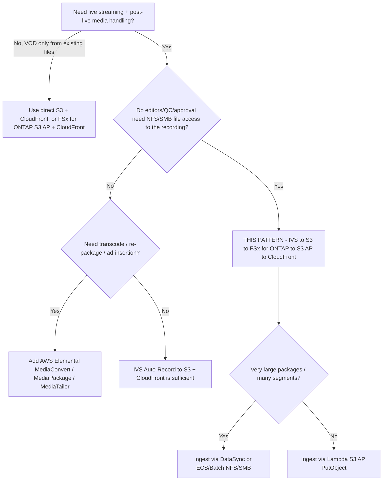

# Architecture — Amazon IVS Live-to-FSx for ONTAP VOD Publishing

🌐 **Language / 言語**: [日本語](architecture.md) | [English](architecture.en.md) | [한국어](architecture.ko.md) | [简体中文](architecture.zh-CN.md) | [繁體中文](architecture.zh-TW.md) | [Français](architecture.fr.md) | [Deutsch](architecture.de.md) | [Español](architecture.es.md)

## Design principles

1. **Amazon IVS owns the live experience.** Low-latency interactive streaming is delivered by
   IVS; we do not attempt to re-implement live delivery.
2. **Record to the supported destination.** IVS Auto-Records to a **standard Amazon S3
   bucket** — the only destination documented and supported by AWS today.
3. **FSx for ONTAP = post-live media workspace.** Once the recording ends, the HLS package is
   published to FSx for ONTAP so editors, QC, and approval workflows can operate over NFS/SMB
   on the same data that S3-API services consume.
4. **S3 Access Points expose FSx-resident files.** VOD delivery and analytics reach FSx data
   through the S3 API via an S3 Access Point (no second copy in a separate S3 bucket required
   for delivery).
5. **Delivery boundary is operational.** Public/controlled delivery bypasses ONTAP ACLs, so
   publish only approved content and control the CloudFront origin.

## Recommended data flow

```text
Amazon IVS
  -> Auto-Record to S3 bucket           (supported)
  -> EventBridge "IVS Recording State Change" / "Recording End"
  -> Step Functions
  -> Lambda / ECS / Batch / DataSync    (copy/sync HLS package)
  -> FSx for ONTAP volume               (NFS/SMB workspace + S3 AP surface)
  -> S3 Access Point
  -> CloudFront with OAC (SigV4)
  -> VOD viewers
```

1. A streamer/encoder publishes to an **Amazon IVS channel** (RTMPS or IVS Broadcast SDK).
2. IVS **Auto-Records** the session to a standard S3 bucket under the
   `ivs/v1/<aws_account_id>/<channel_id>/<year>/<month>/<day>/<hours>/<minutes>/<recording_id>`
   prefix (HLS media, manifest, thumbnails, metadata JSON).
3. On **Recording End**, IVS emits an `IVS Recording State Change` event to **EventBridge**.
   Downstream processing should start only after Recording End (segments/manifests are not
   guaranteed complete before then).
4. An EventBridge rule starts a **Step Functions** state machine.
5. Step Functions runs a **copy/sync job** (Lambda for small packages; ECS/Batch/DataSync for
   large ones) that writes the HLS package to the **FSx for ONTAP** volume.
6. Editors/QC/MAM tools work over **NFS/SMB**; the same data is exposed through an **S3 Access
   Point** for delivery and analytics.
7. **Amazon CloudFront** (with OAC + SigV4) serves the HLS VOD from the S3 Access Point origin.
8. Optionally, **Lambda / Athena / Glue / Bedrock** process the same data via the S3 AP.

## Network design

- **Copy/sync compute**:
  - If reading from the standard S3 bucket and writing to FSx via **S3 AP `PutObject`**
    (Internet-origin AP), run the worker **outside a VPC** (or use a NAT path).
  - If writing to FSx via **NFS/SMB mounts**, run the worker **inside the VPC** (ECS/Batch
    with the FSx mount reachable; Lambda cannot mount NFS/SMB directly — use EFS-style access
    only for EFS, so NFS/SMB writes to FSx typically use ECS/Batch).
- **Do not mix** ONTAP management-LIF access and Internet-origin S3 AP access in one Lambda.
- **CloudFront** reaches the S3 Access Point origin over the Internet with SigV4 (OAC); the
  S3 Gateway VPC Endpoint does not front an Internet-origin S3 AP.

## Two ways to write into FSx for ONTAP

| Method | When to use | Notes |
|--------|-------------|-------|
| S3 AP `PutObject` | Object-count is moderate, worker is serverless (Lambda) | `PutObject` max 5 GB; use multipart for larger; Internet-origin AP needs VPC-external worker or NAT |
| NFS/SMB mount (ECS/Batch/DataSync) | Large packages, many small segments, existing file tooling | Preserves file semantics for editors; DataSync handles bulk transfer efficiently |

## Storage / throughput design (Storage lens)

- FSx for ONTAP provisioned throughput is **shared** across NFS/SMB/S3AP. VOD origin fetches
  and editing traffic compete on the same volume; size for **P95/P99 tail latency**.
- Use high CloudFront TTLs and **Origin Shield** to minimize origin fetches; segments are
  immutable (long TTL), playlists change (short TTL).
- Consider a **FlexCache** volume as the CloudFront-origin source to isolate delivery reads
  from the production editing volume (ONTAP-native, no application change).
- Quantitative values are configuration-dependent — base production estimates on measurement,
  not on this sample.

## Constraints (FSx for ONTAP S3 AP)

- **Presigned URLs not supported** → viewer auth via CloudFront-native signed URLs/cookies.
- Not a full S3 bucket: no Object Versioning / Object Lock / Lifecycle / Static Website
  Hosting (verify per operation in [../../docs/s3ap-compatibility-notes.md](../../docs/s3ap-compatibility-notes.md)).
- `PutObject` max 5 GB (multipart for larger).
- Dual-layer authorization: IAM/AP policy **and** ONTAP file-system identity (UNIX/Windows)
  must both allow access.
- `NetworkOrigin` (Internet vs VPC) is immutable after creation.

## Region / residency

- IVS channel, Recording Configuration, and the S3 recording location must be in the **same
  region**. Keep FSx for ONTAP and the S3 bucket co-located to avoid cross-region transfer.
- CloudFront is global — apply geo-restriction where region-bound content must not leave a
  region.

> **Residency** (Public Sector lens): treat "delivered globally by default" as the starting
> assumption. Region-bound content must be excluded from ingest/publish or gated by CloudFront
> geo-restriction; the delivery layer does not inherit ONTAP ACLs.

## Scope

- This pattern targets **Amazon IVS Low-Latency Streaming** Auto-Record (channel recordings
  under `ivs/v1/...`). **IVS Real-Time Streaming (stages)** uses a different recording model
  (individual/composite participant recordings) and is out of scope here, though the same
  "publish to FSx for ONTAP, deliver via S3 AP + CloudFront" idea applies.
- The pattern covers **post-live packaging/delivery of already-encoded HLS**. It does **not**
  transcode, re-package, or insert ads.

> **Media workflow** (Media SME lens): IVS records HLS as multivariate `master.m3u8` +
> per-rendition media playlists + segments (`.ts` for TS, `.m4s`+init for fMP4/CMAF) plus
> thumbnails and recording metadata JSON. Validate the multivariate master, not just any playlist.

## Near-live collaborative editing during a live stream (3-layer model)

"During a live stream, insert catch-up edits or captions from FSx for ONTAP through an S3 Access
Point" is a natural ask, but because of how IVS live delivery works, you must decide **which layer**
the insertion happens at.

| Layer | What it can do | Role of FSx for ONTAP S3 AP |
|-------|----------------|------------------------------|
| **1. IVS live delivery path (IVS-managed)** | encoder → IVS transcode/packaging → IVS CDN to viewers. The **live playback manifest is IVS-managed**; there is no hook to inject externally authored HLS segments/captions into it. | **Not possible** (the live manifest is immutable). Server-side live manipulation is the domain of AWS Elemental MediaLive / MediaPackage. |
| **2. Client-side overlay (timed metadata)** | Insert [Timed Metadata (`PutMetadata`)](https://docs.aws.amazon.com/ivs/latest/LowLatencyUserGuide/metadata.html) synced to the live stream; the player SDK renders **captions/lower-thirds/graphics on the client**. `PutMetadata` allows max 1 KB/request, 5 TPS/channel. | **Indirectly possible**: put an "asset reference key + timecode" in the metadata, and fetch the caption text / overlay images from **CloudFront (origin = FSx for ONTAP S3 AP)**. Editors author captions over NFS/SMB; the same data is served by S3 AP + CloudFront. |
| **3. Near-live editing rendition (recording side)** | Continuously ingest the Auto-Recorded HLS into FSx for ONTAP, edit the growing recording, and publish a near-live rendition on a **separate URL, tens of seconds to minutes behind live**. | **The sweet spot**: NLE (SMB) / caption tools (SMB) / S3-API automation / Athena/Bedrock analysis run concurrently on a **single authoritative copy** without extra copies (protocol-agnostic collaborative editing). |

> **Media SME lens**: rather than "burning into the live stream itself," realize this at layer 2
> (client rendering) or layer 3 (near-live rendition), which matches how IVS works. Burned-in
> closed captions (CEA-608/708) are embedded at the **encoder**, not added later from FSx.

### Honest constraints

- **Near-live, not truly live**: segment finalization → ingest → edit → re-publish each add delay.
  "Catch-up" implies tens of seconds to minutes of lag.
- **The IVS live manifest is immutable**: no injection into layer 1.
- **Live burned-in captions** are an encoder-side concern (outside IVS).
- For layer 2, keep within the `PutMetadata` 1 KB / 5 TPS limits by carrying references, not payloads.

> **User value** (Partner/SI lens): the pattern's appeal extends beyond "post-live VOD" to a
> **near-live collaborative editing workspace running alongside the live stream**. Editing, QC,
> captioning, and analysis run concurrently on the same data regardless of protocol — that is the
> motivation for combining FSx for ONTAP with S3 Access Points.

## Streaming challenges and solution ideas (use cases)

Beyond post-live VOD and near-live editing, several recurring streaming challenges map well to a
shared FSx for ONTAP media workspace exposed through S3 Access Points. These are options and
trade-offs, not a ranking; combine them with the complementary AWS media services noted.

| Streaming challenge | Solution idea (FSx for ONTAP + S3 AP + IVS) | Complementary services | Honest trade-off |
|---|---|---|---|
| Reach international audiences with multi-language subtitles/translation | Localization teams author caption/subtitle assets over NFS/SMB on the same recording; serve VTT via S3 AP + CloudFront (near-live rendition), or drive client overlays via timed metadata | Amazon Transcribe, Amazon Translate; live-captioning partners | Live translation is near-live; human review is advisable for regulated or brand-sensitive content |
| Turn long live streams into highlights/clips quickly | EventBridge → Step Functions clip finished segments into highlight assets on FSx for ONTAP; editors refine over SMB; publish via S3 AP + CloudFront | AWS Elemental MediaConvert (renditions) | Segment-finalization delay; clip accuracy depends on markers/timecodes |
| Remote / geographically distributed editing over high-latency links | Give editors a local-like cache with FlexCache near them; edit low-res proxies while full-res stays on the origin volume | — | FlexCache adds cache management; proxy workflow needs a proxy-generation step |
| Growing media libraries and storage cost | Tier cold assets with FabricPool to a capacity pool; keep hot editing data on SSD | — | Tiering is ONTAP-native (not S3 Lifecycle, which S3 AP does not provide); recall latency for cold data |
| Business continuity for media operations | Replicate the media workspace cross-region with SnapMirror; take point-in-time Snapshots; align to a 3-2-1 approach | CloudFront + AWS media services resiliency | Define RPO/RTO for source data and any index separately; replication has cost |
| Interactive live commerce / engagement | Drive product overlays and moments with IVS timed metadata; keep product/catalog/overlay assets on FSx for ONTAP served via S3 AP + CloudFront; clip the "moment" to VOD | IVS timed metadata, IVS chat | PutMetadata 1 KB / 5 TPS limits; overlays render client-side |
| Regulated retention / audit of recordings | Keep recordings on ONTAP with Snapshot/retention features and audit trails; expose read paths per title/role via separate access points | — | Validate the immutability/retention features for your FSx for ONTAP version and jurisdiction; this is governance guidance, not legal advice |
| Searchable media archive | Transcribe recordings to text, index for search, and run analysis over S3 AP without copying data out of FSx for ONTAP | Amazon Transcribe, Athena/Glue, Amazon Bedrock, OpenSearch | Extraction/index cost; apply per-title access control at query time |

> **Neutral framing**: each row is an option suited to a different context. AWS Elemental
> MediaLive / MediaPackage / MediaTailor handle server-side live manipulation, packaging, and ad
> insertion; this pattern focuses on the file + S3-API media workspace and post/near-live delivery.
> Choose by workload, constraints, and trade-offs.

## When to use this pattern — decision guide



## Alternatives and how to choose (neutral)

Each option below suits a different context. Trade-offs are stated symmetrically, including for
the approach this pattern recommends.

| Option | Suits | Trade-off / consideration |
|--------|-------|---------------------------|
| **This pattern** (IVS → S3 → FSx for ONTAP → S3 AP → CloudFront) | Teams that need **file-protocol (NFS/SMB) editing/QC/approval** on the recording *and* S3-API delivery/analytics on the same copy | Adds an ingest hop (S3 → FSx) and an operational layer; delivery boundary is enforced operationally, not by ONTAP ACLs |
| **IVS Auto-Record to S3 + CloudFront** (no FSx) | Simple live-to-VOD where no file-protocol post-production is needed | No unified NFS/SMB workspace; separate copies if editors need files |
| **AWS Elemental MediaConvert / MediaPackage / MediaTailor** | Transcoding, just-in-time packaging, DRM, server-side ad insertion | More services to operate; this pattern intentionally does none of these — combine when needed |
| **Direct S3 + CloudFront** (files already on S3) | Pure VOD of existing HLS with no live capture | No live tier; no ONTAP file workflow |

> **How to choose**: pick by whether you need (a) a **shared file workspace** on the recording
> (→ this pattern), (b) **media processing** (→ MediaConvert/MediaPackage/MediaTailor, which can
> sit before or after FSx), or (c) **the simplest live-to-VOD** (→ IVS + S3 + CloudFront).
> These are composable, not mutually exclusive.

> **Cost** (FinOps lens): the dominant costs are FSx for ONTAP throughput/capacity, CloudFront
> egress, and S3 storage of recordings — not the Lambda. See
> [../../docs/cost-calculator.md](../../docs/cost-calculator.md) and size on measured traffic,
> not on sample runs.

## Reliability: EventBridge delivery semantics

Amazon IVS delivers EventBridge events on a **best-effort** basis — events may be missing, late,
or out of order. Do not treat a single `Recording End` event as a guaranteed exactly-once trigger.

- **Recommendation**: run `TriggerMode=HYBRID` in production — EVENT_DRIVEN for low latency plus a
  POLLING backstop (`SourcePrefixRoot` scan) that reconciles any recordings that missed an event.
- Start downstream processing only **after** `Recording End` (manifests/segments may be
  incomplete before then).

> **Reliability/Ops** (SRE lens): the scaffold does **not** implement idempotency, so HYBRID can
> double-process a recording. Add `shared/idempotency_checker.py` keyed on
> `recording_session_id` + `recording_prefix` before enabling HYBRID in production. Wire a DLQ on
> the state machine / Lambda for poison events.

> **Runbook** (Ops lens): on publish failure, check `/aws/lambda/<stack>-publish` and isolate
> S3 AP authorization (IAM + AP policy + ONTAP identity) from source-bucket read. On mis-publish,
> remove the object from the CloudFront origin path and re-run after correcting the source.

## Content moderation and retention (moderation opt-in; retention ONTAP-native)

- **Content moderation is opt-in (default off).** Set `EnableModeration=true` (non-DemoMode) to run
  Amazon Rekognition `DetectModerationLabels` on the recording's thumbnails; if any label at/above
  `ModerationMinConfidence` is found, publish is blocked (`blocked_by_moderation`) and routed to human
  review. This is a **thumbnail sample check**, not full-content coverage — for stricter needs add
  Rekognition async `StartContentModeration` (video) / Amazon Transcribe + Comprehend (audio/captions).
  This pattern ships that stricter path as the opt-in `functions/moderation/` component (async
  start/collect) plus HLS→MP4 conversion `functions/transcode/` (MediaConvert)
  (`EnableStrictModeration=true`; Step Functions sample:
  [samples/strict-moderation.asl.json](samples/strict-moderation.asl.json)). It operates independently
  of the completeness heuristic (Human Review).

> **Governance** (Public Sector lens): "the package is complete" ≠ "the content is cleared for
> public release." Keep the human publish approval (Data Owner / Approver) as the authoritative
> gate; completeness scoring only routes items to that gate.

- **Retention**: FSx for ONTAP S3 AP does **not** support S3 Lifecycle. Manage VOD retention and
  tiering ONTAP-natively — **FabricPool** capacity tiering for cold VOD, **Snapshot** for
  point-in-time, and **SnapMirror** for archive/DR — rather than expecting S3 bucket lifecycle.

> **Storage** (Storage Specialist lens): isolate delivery-origin reads from the editing volume
> with a **FlexCache** volume as the CloudFront-origin source; size origin fetches on P95/P99 and
> exploit Range GET + high CloudFront TTL / Origin Shield so VOD does not contend with QC I/O.

## Phased adoption

1. **Validate logic (no infra)**: `make test-media-ivs-vod-publishing` (unit + property tests).
2. **DemoMode deploy**: deploy with `DemoMode=true` (no FSx dependency); confirm publish manifest,
   master-manifest validation, and Human Review routing.
3. **Real ingest**: point `RecordingSourceBucket` at an IVS recording bucket, `S3AccessPointOutputAlias`
   at an FSx for ONTAP S3 AP; run a short live stream and confirm `ivs/v1/...` lands and publishes.
4. **Delivery**: enable CloudFront (`EnableCloudFront=true`), configure OAC + AP policy, verify
   SigV4 GET of `.m3u8`/segments; add signed URLs/cookies for controlled VOD.
5. **Harden**: HYBRID + idempotency, DLQ, alarms (`EnableCloudWatchAlarms=true`), moderation
   integration if publishing publicly.

> **Partner/SI** (delivery lens): Phases 1–2 are a 30-minute, FSx-free PoC suitable for the first
> discovery conversation; Phases 3–5 map to the user's real environment and are where sizing
> and governance sign-off happen.

> **App Developer** (developer lens): the deployable handler is `functions/publish/handler.py`
> (uses `shared/` for S3 AP access, data classification, Human Review, EMF). The `samples/`
> snippets are illustrative only; do not deploy them.

## FAQ / common misconceptions

- **"Can IVS record straight into FSx for ONTAP's S3 Access Point?"** Config creation reaches `ACTIVE`, but
  in a test environment a live stream produced a **"Recording Start Failure"** and wrote no `ivs/v1/...` objects.
  It is also not documented as supported — treat as Experimental ([direct-recording-experiment.md](direct-recording-experiment.md)).
- **"Is an S3 Access Point a drop-in S3 bucket?"** No — it is an S3-compatible access boundary.
  No Presigned URLs, Versioning, Object Lock, Lifecycle, or Static Website Hosting.
- **"Can viewers get a presigned URL to the VOD?"** No — use CloudFront signed URLs/cookies.
- **"Does publishing enforce the original NFS/SMB permissions?"** No — delivery bypasses ONTAP
  ACLs; the boundary is operational (publish only approved) + CloudFront origin lockdown.
- **"Does the completeness score mean the content is safe to publish?"** No — it only checks the
  HLS package is complete. Content clearance is a separate human/AI moderation step.
- **"Do I need MediaConvert?"** Only if you need transcoding/re-packaging/ads; this pattern
  delivers already-encoded HLS.

## Related documents

- [README (日本語)](README.md) / [README (English)](README.en.md)
- [Validation matrix](validation-matrix.md)
- [Direct recording experiment](direct-recording-experiment.md)
- [Supported path notes](supported-path-ivs-s3-fsx-cloudfront.md)
- [DemoMode guide](docs/demo-guide.md)
- [S3AP compatibility notes](../../docs/s3ap-compatibility-notes.md) / [S3AP performance](../../docs/s3ap-performance-considerations.md)
- [Cost calculator](../../docs/cost-calculator.md)
- [Content Edge Delivery pattern](../content-delivery/README.md)
