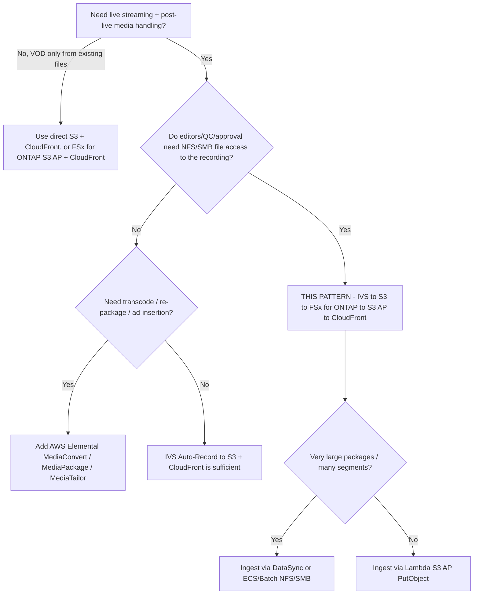

# Arquitectura — Amazon IVS Live-to-FSx for ONTAP VOD Publishing

🌐 **Language / Idioma**: [日本語](architecture.md) | [English](architecture.en.md) | [한국어](architecture.ko.md) | [简体中文](architecture.zh-CN.md) | [繁體中文](architecture.zh-TW.md) | [Français](architecture.fr.md) | [Deutsch](architecture.de.md) | [Español](architecture.es.md)

## Principios de diseño

1. **Amazon IVS asume la experiencia en directo.** El streaming interactivo de baja latencia lo
   entrega IVS; no reimplementamos la entrega en directo.
2. **Grabar al destino compatible.** IVS graba automáticamente a un **bucket S3 estándar** — el único
   destino documentado y compatible por AWS hoy.
3. **FSx for ONTAP = espacio de trabajo multimedia post-directo.** Al terminar la grabación, el
   paquete HLS se publica a FSx for ONTAP para que edición, QC y aprobación operen por **NFS/SMB**
   sobre los mismos datos que consumen los servicios de API S3.
4. **Los S3 Access Points exponen los archivos residentes en FSx.** La entrega VOD y el análisis
   acceden a los datos FSx por la API S3 mediante un S3 Access Point (sin segunda copia en un bucket
   S3 separado para la entrega).
5. **El límite de entrega es operativo.** La entrega pública/controlada omite las ACL de ONTAP; por
   tanto publicar solo contenido aprobado y controlar el origen CloudFront.

## Flujo de datos recomendado

```text
Amazon IVS
  -> Auto-Record to S3 bucket           (supported)
  -> EventBridge "IVS Recording State Change" / "Recording End"
  -> Step Functions
  -> Lambda / ECS / Batch / DataSync    (copy/sync HLS package)
  -> FSx for ONTAP volume               (NFS/SMB workspace + S3 AP surface)
  -> S3 Access Point
  -> CloudFront with OAC (SigV4)
  -> VOD viewers
```

1. Un streamer/codificador publica a un **canal Amazon IVS** (RTMPS o IVS Broadcast SDK).
2. IVS **graba automáticamente** la sesión a un bucket S3 estándar bajo el prefijo
   `ivs/v1/<aws_account_id>/<channel_id>/<year>/<month>/<day>/<hours>/<minutes>/<recording_id>`
   (medios HLS, manifiesto, miniaturas, metadatos JSON).
3. En **Recording End**, IVS emite un evento `IVS Recording State Change` a **EventBridge**. El
   procesamiento posterior debe iniciarse solo tras Recording End (segmentos/manifiestos no
   garantizados completos antes).
4. Una regla de EventBridge inicia una máquina de estados **Step Functions**.
5. Step Functions ejecuta un **trabajo de copia/sincronización** (Lambda para paquetes pequeños;
   ECS/Batch/DataSync para grandes) que escribe el paquete HLS en el volumen **FSx for ONTAP**.
6. Las herramientas de edición/QC/MAM trabajan por **NFS/SMB**; los mismos datos se exponen mediante
   un **S3 Access Point** para entrega y análisis.
7. **Amazon CloudFront** (OAC + SigV4) sirve el VOD HLS desde el origen S3 Access Point.
8. Opcionalmente, **Lambda / Athena / Glue / Bedrock** procesan los mismos datos por el S3 AP.

## Diseño de red

- **Cómputo de copia/sincronización**:
  - Si se lee del bucket S3 estándar y se escribe a FSx por **S3 AP `PutObject`** (AP Internet-origin),
    ejecutar el worker **fuera de una VPC** (o usar una ruta NAT).
  - Si se escribe a FSx por **montajes NFS/SMB**, ejecutar el worker **dentro de la VPC** (ECS/Batch
    con el montaje FSx alcanzable; Lambda no puede montar NFS/SMB directamente — las escrituras
    NFS/SMB a FSx suelen usar ECS/Batch).
- No **mezclar** el acceso al LIF de gestión ONTAP y el acceso S3 AP Internet-origin en un solo Lambda.
- **CloudFront** alcanza el origen S3 Access Point por Internet con SigV4 (OAC); el VPC Endpoint S3
  Gateway no actúa como frente de un S3 AP Internet-origin.

## Dos formas de escribir en FSx for ONTAP

| Método | Cuándo usar | Notas |
|--------|-------------|-------|
| S3 AP `PutObject` | Número de objetos moderado, worker serverless (Lambda) | `PutObject` máx 5 GB; multipart para más; el AP Internet-origin necesita worker fuera de VPC o NAT |
| Montaje NFS/SMB (ECS/Batch/DataSync) | Paquetes grandes, muchos segmentos pequeños, herramientas de archivos existentes | Preserva la semántica de archivos para editores; DataSync gestiona la transferencia masiva eficientemente |

## Diseño de almacenamiento / rendimiento (Storage lens)

- El rendimiento aprovisionado de FSx for ONTAP se **comparte** entre NFS/SMB/S3AP. Los fetches de
  origen VOD y el tráfico de edición compiten en el mismo volumen; dimensionar por **latencia P95/P99**.
- Usar TTL altos de CloudFront y **Origin Shield** para minimizar los fetches de origen; los
  segmentos son inmutables (TTL largo), las playlists cambian (TTL corto).
- Considerar un volumen **FlexCache** como origen CloudFront para aislar las lecturas de entrega del
  volumen de edición de producción (nativo de ONTAP, sin cambios en la aplicación).
- Los valores cuantitativos dependen de la configuración — basar las estimaciones de producción en la medición, no en este ejemplo.

## Restricciones (FSx for ONTAP S3 AP)

- **URL prefirmadas no compatibles** → autenticación del espectador por URL/cookies firmadas de CloudFront.
- No es un bucket S3 completo: sin Object Versioning / Object Lock / Lifecycle / Static Website
  Hosting (verificar por operación en [../../docs/s3ap-compatibility-notes.md](../../docs/s3ap-compatibility-notes.md)).
- `PutObject` máx 5 GB (multipart para más).
- Autorización de dos capas: la política IAM/AP **y** la identidad del sistema de archivos ONTAP
  (UNIX/Windows) deben permitir ambas.
- `NetworkOrigin` (Internet vs VPC) inmutable tras la creación.

## Región / residencia

- El canal IVS, la Recording Configuration y la ubicación de grabación S3 deben estar en la **misma
  región**. Co-ubicar FSx for ONTAP y el bucket S3 para evitar transferencia entre regiones.
- CloudFront es global — aplicar restricción geográfica donde el contenido ligado a una región no pueda salir de ella.

> **Residencia** (Public Sector lens): tratar "entregado globalmente por defecto" como premisa de
> partida. El contenido ligado a una región debe excluirse de la ingesta/publicación o controlarse
> con restricción geográfica de CloudFront; la capa de entrega no hereda las ACL de ONTAP.

## Alcance

- Este patrón se dirige al auto-grabado de **Amazon IVS Low-Latency Streaming** (grabaciones de canal
  bajo `ivs/v1/...`). **IVS Real-Time Streaming (stages)** usa un modelo de grabación distinto
  (grabaciones de participante individuales/compuestas) y queda fuera de alcance. La idea "publicar a
  FSx for ONTAP → entregar por S3 AP + CloudFront" sigue aplicando.
- El patrón cubre el **empaquetado/entrega post-directo de HLS ya codificado**. **No** transcodifica,
  re-empaqueta ni inserta anuncios.

> **Flujo multimedia** (Media SME lens): IVS graba HLS como `master.m3u8` multivariante + playlists de
> medios por rendición + segmentos (`.ts` para TS, `.m4s`+init para fMP4/CMAF) más miniaturas y
> metadatos de grabación JSON. Validar el master multivariante, no cualquier playlist.

## Cuándo usar este patrón — guía de decisión



## Alternativas y cómo elegir (neutral)

Cada opción se adapta a un contexto distinto. Los compromisos se enuncian simétricamente, incluida la
opción que recomienda este patrón.

| Opción | Apta para | Compromiso / consideración |
|--------|-----------|----------------------------|
| **Este patrón** (IVS → S3 → FSx for ONTAP → S3 AP → CloudFront) | Equipos que necesitan **edición/QC/aprobación NFS/SMB** sobre la grabación *y* entrega/análisis S3-API sobre la misma copia | Añade un salto de ingesta (S3 → FSx) y una capa operativa; límite de entrega operativo, no las ACL de ONTAP |
| **IVS Auto-Record → S3 + CloudFront** (sin FSx) | Live-to-VOD simple sin postproducción por archivos | Sin espacio NFS/SMB unificado; copias separadas si los editores necesitan archivos |
| **AWS Elemental MediaConvert / MediaPackage / MediaTailor** | Transcodificación, empaquetado JIT, DRM, inserción de anuncios del lado del servidor | Más servicios que operar; este patrón no hace ninguno — combinar cuando se necesite |
| **S3 directo + CloudFront** (archivos ya en S3) | VOD puro de HLS existente sin captura en directo | Sin capa en directo; sin flujo de archivos ONTAP |

> **Cómo elegir**: según si necesita (a) un **espacio de trabajo de archivos compartido** sobre la
> grabación (→ este patrón), (b) **procesamiento multimedia** (→ MediaConvert/MediaPackage/MediaTailor,
> antes o después de FSx), o (c) el **live-to-VOD más simple** (→ IVS + S3 + CloudFront). Combinables, no exclusivos.

> **Costo** (FinOps lens): los costos dominantes son el rendimiento/capacidad de FSx for ONTAP, el
> egress de CloudFront y el almacenamiento S3 de las grabaciones — no el Lambda. Véase
> [../../docs/cost-calculator.md](../../docs/cost-calculator.md) y dimensione por tráfico medido, no por ejecuciones de ejemplo.

## Fiabilidad: semántica de entrega de EventBridge

Amazon IVS entrega los eventos de EventBridge en **mejor esfuerzo** — eventos ausentes, tardíos o
desordenados posibles. No tratar un único `Recording End` como un disparador exactly-once garantizado.

- **Recomendación**: en producción use `TriggerMode=HYBRID` — EVENT_DRIVEN por latencia más un
  respaldo POLLING (escaneo de `SourcePrefixRoot`) que reconcilia las grabaciones que perdieron un evento.
- Iniciar el procesamiento posterior solo **tras** `Recording End` (manifiestos/segmentos quizá incompletos antes).

> **Fiabilidad/Ops** (SRE lens): el scaffold **no** implementa idempotencia, por lo que HYBRID puede
> procesar una grabación dos veces. Integre `shared/idempotency_checker.py` (clave `recording_session_id`
> + `recording_prefix`) antes de habilitar HYBRID en producción. Cablee una DLQ en la máquina de
> estados / el Lambda para eventos venenosos.

> **Runbook** (Ops lens): ante un fallo de publicación, revise `/aws/lambda/<stack>-publish` y aísle la
> autorización S3 AP (IAM + política AP + identidad ONTAP) de la lectura de origen. Ante una publicación
> errónea, retire el objeto del origen CloudFront y reejecute tras corregir.

## Moderación de contenido y retención (moderación opt-in; retención nativa de ONTAP)

- **La moderación de contenido es opt-in (desactivada por defecto).** Con `EnableModeration=true`
  (no DemoMode), ejecuta Amazon Rekognition `DetectModerationLabels` sobre las miniaturas de la
  grabación; si se encuentra una etiqueta ≥ `ModerationMinConfidence`, la publicación se bloquea
  (`blocked_by_moderation`) y se enruta a revisión humana. Es un **muestreo de miniaturas**, no una
  cobertura de contenido completa — para necesidades más estrictas añada Rekognition async
  `StartContentModeration` (video) / Amazon Transcribe + Comprehend. Este patrón incluye esta ruta estricta
  en opt-in vía `functions/moderation/` (async start/collect) y la conversión HLS→MP4 `functions/transcode/`
  (MediaConvert) (`EnableStrictModeration=true`; ejemplo de Step Functions:
  [samples/strict-moderation.asl.json](samples/strict-moderation.asl.json)). Independiente de la heurística de
  completitud (Human Review).

> **Gobernanza** (Public Sector lens): "el paquete está completo" ≠ "el contenido está aprobado para
> difusión pública". Mantenga la aprobación humana de publicación (Data Owner / Approver) como puerta
> autoritativa; la puntuación de completitud solo enruta elementos a esa puerta.

- **Retención**: FSx for ONTAP S3 AP **no** admite S3 Lifecycle. Gestione la retención/tiering de VOD
  de forma nativa en ONTAP — **FabricPool** para tiering de capacidad de VOD frío, **Snapshot** para el
  punto en el tiempo, **SnapMirror** para archivo/DR — en lugar de esperar un lifecycle de bucket S3.

> **Almacenamiento** (Storage Specialist lens): aísle las lecturas de origen de entrega del volumen de
> edición con un volumen **FlexCache** como origen CloudFront; dimensione los fetches de origen por
> P95/P99 y aproveche Range GET + TTL alto de CloudFront / Origin Shield para que el VOD no compita con la I/O de QC.

## Adopción por fases

1. **Validar la lógica (sin infra)**: `make test-media-ivs-vod-publishing` (pruebas unitarias + de propiedades).
2. **Despliegue DemoMode**: desplegar con `DemoMode=true` (sin dependencia de FSx); confirmar el
   manifiesto de publicación, la validación del master manifest y el enrutado de Human Review.
3. **Ingesta real**: apunte `RecordingSourceBucket` a un bucket de grabación IVS, `S3AccessPointOutputAlias`
   a un S3 AP de FSx for ONTAP; transmita brevemente y confirme que `ivs/v1/...` aterriza y se publica.
4. **Entrega**: habilite CloudFront (`EnableCloudFront=true`), configure OAC + política AP, verifique el
   GET SigV4 de `.m3u8`/segmentos; añada URL/cookies firmadas para VOD controlado.
5. **Endurecer**: HYBRID + idempotencia, DLQ, alarmas (`EnableCloudWatchAlarms=true`), integración de moderación si se publica públicamente.

> **Partner/SI** (delivery lens): las fases 1–2 son un PoC de 30 minutos sin FSx, adecuado para la
> primera conversación de descubrimiento; las fases 3–5 se mapean al entorno real de la organización usuaria y es donde se hace el dimensionamiento y la aprobación de gobernanza.

> **App Developer** (developer lens): el handler desplegable es `functions/publish/handler.py` (usa
> `shared/` para acceso S3 AP, clasificación de datos, Human Review, EMF). Los fragmentos `samples/` son
> ilustrativos únicamente; no los despliegue.

## FAQ / conceptos erróneos comunes

- **«¿Puede IVS grabar directamente en un S3 Access Point de FSx for ONTAP?»** No documentado como
  compatible — tratar como Experimental y validar ([direct-recording-experiment.md](direct-recording-experiment.md)).
- **«¿Un S3 Access Point es un bucket S3 intercambiable?»** No — es un límite de acceso compatible con
  S3. Sin URL prefirmada, Versioning, Object Lock, Lifecycle ni Static Website Hosting.
- **«¿Se puede dar una URL prefirmada del VOD a los espectadores?»** No — use URL/cookies firmadas de CloudFront.
- **«¿La publicación aplica los permisos NFS/SMB originales?»** No — la entrega omite las ACL de ONTAP;
  el límite es operativo (publicar solo lo aprobado) + bloqueo del origen CloudFront.
- **«¿Una puntuación de completitud alta significa que es seguro publicar?»** No — solo comprueba que el
  paquete HLS esté completo. La aprobación de contenido es un paso de moderación humana/IA aparte.
- **«¿Necesito MediaConvert?»** Solo si necesita transcodificación/re-empaquetado/anuncios; este patrón entrega HLS ya codificado.

## Documentos relacionados

- [README (日本語)](README.md) / [README (English)](README.en.md)
- [Validation matrix](validation-matrix.md)
- [Direct recording experiment](direct-recording-experiment.md)
- [Supported path notes](supported-path-ivs-s3-fsx-cloudfront.md)
- [Guía DemoMode](docs/demo-guide.md)
- [Notas de compatibilidad S3AP](../../docs/s3ap-compatibility-notes.md) / [Rendimiento S3AP](../../docs/s3ap-performance-considerations.md)
- [Calculadora de costos](../../docs/cost-calculator.md)
- [Patrón Content Edge Delivery](../content-delivery/README.md)
